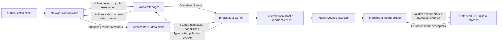

# ADR 0011: Server Control Plane, Workers, and Plugin Runtimes Are Separate Security Domains

## Status

Accepted as the target contract for Issue #97. This decision freezes the
tenant, Job, authentication, quota, artifact, worker, and plugin boundaries
consumed by Issues #98 through #106. It does not claim that the full server,
worker-manager, standalone artifact data plane, sandbox, or isolated-plugin
target is current software behavior. Live delivery status remains in the linked
Issue and Project.

The current `photospiderd` and plugin loaders remain unchanged. Issues #99 and
#100 now implement a source-private local JobSpec vertical with complete-
envelope tenant quota accounting, durable Job/image artifact recovery,
explicit retry/checkpoint identity, and one freshly execed Embedded Host worker
process per attempt. One same-process `WorkerManager` object owns the private
socket, PID, heartbeat, cancellation escalation, exact reaping, and supervision
handle; the control-plane Job service remains the sole durable/quota/artifact/
retry authority. Host memory is enforced as POSIX `RLIMIT_AS`; configured device
capacity remains admission-only. The private closed protocol and exact lease
fencing isolate startup, exit, signal, channel, protocol, heartbeat, runtime,
and forced-cancellation failures to the owning attempt.

That local slice preserves this decision's identity and authority ordering and
provides real quota admission, crash durability, process-crash containment, and
bounded cancellation/shutdown. It retains the shared 128-configured-device
admission/recovery maximum and the explicit Job-journal distinction between not
published, published with durability unconfirmed, and confirmed committed. A
published barrier failure retains visible truth and enters a monotonic control-
plane fail-stop instead of attempting rollback. The profile defaults on only
for Darwin and Linux and has no Job/worker target inventory on unsupported
systems. It is not evidence of multi-tenant authorization, a separately
deployed WorkerManager, authenticated network transport, standalone artifact
data plane, syscall/device isolation, or untrusted-plugin isolation. Current
behavior is defined by
[Single-Tenant Job Vertical](../kernel-architecture/Single-Tenant-Job-Vertical.md).

Issue #102 also provides a source-private Darwin/Linux CPU invocation transport.
`NonSupervisedIsolatedCpuInvocationExecutor` uses an independently versioned,
pointer-free request/response protocol, a framed Unix stream, ordered
`SCM_RIGHTS` descriptors, and unlinked POSIX shared memory. Every direct call
starts one fresh empty-environment runtime process, and the Host exposes output
only after normal zero exit, descriptor/header revalidation, copy into a fresh
Host allocation, and content-binding validation of that snapshot before seal.
That deliberately named adapter remains the unbounded #102 transport seam and
is never a fallback.

Issue #103 now composes that transport through source-private
`PluginInvocationExecutor` and `PluginRuntimeSupervisor`. Each invocation gets
a fresh execed child, exact PID ownership, a dedicated Unix datagram lifecycle
channel, an OS-random 128-bit nonce bound to the complete invocation identity,
strict lifecycle sequences, a Host-selected heartbeat interval, and absolute
monotonic startup, invocation, heartbeat-gap, response, termination, and reap
bounds. Complete request transfer receives one independent full invocation-
duration window; only after it finishes are the callback invocation and
heartbeat-gap deadlines armed. Faults preserve observable deadline, protocol,
channel, bad-output, natural exit, signal, and escalation facts; `SIGKILL` is
only marked memory-pressure-compatible and never asserted to prove OOM.
Failure revokes the channels, escalates `SIGTERM` to `SIGKILL` when needed, exactly reaps or
quarantines one deferred exact reaper, and starts a later invocation only in a
new process after bounded backoff. Product-linked integration composes the
executor inside the existing `ExecutionService` callback/request boundary and
proves a failed Run does not kill its fixed worker or a later unrelated Run.

That #103 boundary is authenticated private-session supervision, not hostile-
child attestation, package trust, sandboxing, resource enforcement, or a
selected end-user operation route. Issue #104 now wraps the maintained direct
and supervised entries with signed package admission, one-use Host resource
admission, and process rlimits. No current `ExecutionService`, `WorkerManager`,
embedded Host/CLI, `photospider-worker`, or operation loader constructs this
path for an end-user Graph operation; the complete operation-ABI migration
still owns final selection, and a general syscall/network sandbox remains
separate.

## Context

The repository has a strong local/process baseline, but it is not a network
service security model:

- `photospiderd` is a foreground same-user Unix-domain sidecar. Its protected
  directory, socket, lock, and output files form a same-UID local access
  boundary. Protocol v2 has no tenant identity, end-user authentication, or
  remote transport trust model.
- The daemon's session, compute-request, cursor, output, delivery, and
  server-instance ids are process/local-transport identities. Its private
  `OutputStore` is a protected lease/TTL delivery store, not a durable artifact
  authority.
- `ExecutionService`, `RunLifecycleRegistry`, and `ResourceLedger` own one
  injected Host process's physical execution, Run lifecycle, and admitted
  Host/device resources. A `ComputeRun` and its Graph/Run/task identities are
  process-local; they do not own durable Job state or tenant quota.
- Operation, data-definition, and policy DSOs execute native code in the Host
  address space. ABI checks, shadow transactions, callback fences, and DSO
  leases protect compatibility, publication, exception, and lifetime
  invariants. They do not prevent memory corruption, syscalls, unreported
  threads, unbounded allocation, crashes, or callbacks that never return.
- `ValueRevisionId`, `AllocationIdentity`, `StorageBinding`, and
  `BufferHandle` are runtime observations/capabilities. They are not durable
  artifact or cross-process identities.

Project #5 introduces remote clients, multiple tenants, constrained Job
workers, durable artifacts, and tenant-supplied operation code. The threat model
therefore includes malicious or compromised tenant principals, malformed
JobSpecs/artifacts/protocol messages, replayed or stale worker reports, worker
crash/hang/OOM, malicious plugin code and output, and confused-deputy attempts
across tenant, Job, artifact, quota, and process boundaries.

The trusted computing base contains the operating system, configured network
identity/credential roots, the network control plane, worker manager, artifact
authority, authenticated local channels, and the trusted worker executable and
operator-approved built-ins. A constrained general worker is a lower-trust
execution domain. A tenant operation-plugin process is untrusted.

This decision extends the process ownership of ADR 0003 and ADR 0007 rather
than replacing it. It also preserves ADR 0008's runtime/persistent identity
separation and ADR 0009's independent output-commit authority.

## Decision

### Process and security domains

The target server profile has five distinct domains:

| Domain | Authority | Explicit non-authority |
| --- | --- | --- |
| Network control-plane process | Network authentication, principal-to-tenant mapping, authorization, immutable `JobSpec`, `JobId` and Job state, cancellation intent, retry policy, tenant/Job quota reservations, artifact references | Graph/Run execution, native plugin loading, worker OS lifecycle, bulk artifact bytes |
| Worker-manager process | Worker spawn/reap, `WorkerInstanceId`, assignment lease, authenticated local channel, OS resource envelope, heartbeat and cancellation/termination escalation | End-user authentication, JobSpec mutation, final Job/retry decisions, Graph/Run commit, artifact bytes/commit |
| One constrained `photospider-worker` per active `JobAttemptId` | One immutable attempt, Embedded Host/Kernel, Graph/Run lifecycle, one attempt-local `ExecutionService`/`ResourceLedger`, validated attempt report | Network listener, user credentials, another Job/tenant assignment, server quota mint, artifact root, final Job/retry state |
| Artifact-store/data-plane service | Immutable payloads/manifests, `ArtifactId`, content/descriptor bindings, idempotent commit, typed durability receipt, retention/recovery, artifact/output quota | Job/Run state, Graph execution, plugin execution, tenant policy beyond supplied authorization context |
| Isolated CPU operation-plugin runtime | One bounded invocation's tenant code and invocation-local private state | Network, arbitrary filesystem roots, user credentials, tenant/Job/Graph/Run state, server/Host tokens, artifact publication, native GPU authority |

The network control plane and worker manager are separate OS processes. The
artifact data plane is a separate service/process boundary. Each
`photospider-worker` is fresh for one JobAttempt, accepts no second assignment,
and exits after normal settlement or manager termination. A plugin runtime may
serve multiple invocations only for one JobAttempt and approved plugin
generation; attempt end, lease revocation, protocol fault, or supervisor
retirement destroys it.



The control plane and WorkerManager load no plugin DSO and execute no Graph
operation. A general worker exposes no network listener and cannot own or spawn
another general worker. An isolated plugin process receives no Job, Graph, Run,
artifact, credential, quota, or Host resource authority.

### Local sidecar is not the server protocol

`photospiderd` and protocol v2 remain the same-user local workstation sidecar.
Modes `0700`/`0600` and same-UID path identity are its local access boundary;
they are not remote authentication, tenant isolation, or peer attestation.

The future network service uses a new versioned protocol and composition root.
It does not expose or tunnel the local router unchanged, reinterpret a session
name as a tenant, promote process-global plugin mutation methods, or translate
local opaque ids into server authority. Putting TLS in front of
`photospiderd` is not a conforming server profile.

### Authentication and tenant authority

The control plane authenticates each request through a configured identity
root and maps the immutable `PrincipalId` to one authoritative `TenantId` and
permission set. It authorizes the exact `{principal, tenant, action, resource}`
tuple before protected lookup or disclosure. Caller-provided tenant labels,
object ids, local daemon ids, trace ids, and identifier secrecy do not grant
authority.

End-user bearer credentials and identity-provider secrets stop at the control
plane. Cross-process operations use authenticated, audience-bound, expiry- or
revocation-aware capabilities scoped to the exact tenant, Job, attempt, action,
resource, and budget. Delegation may narrow but never widen authority. Receivers
validate channel/process identity as well as message fields. The credential
encoding, TLS implementation, and identity-provider product remain downstream
choices; these authority properties do not.

### Identity domains

The target identity chain is:

```text
PrincipalId -> TenantId -> JobId + JobSpecDigest
                         -> JobAttemptId + WorkerInstanceId
                                         + WorkerLeaseGeneration
                         -> process-local GraphInstanceId / RunId
                                                   / RunLocalTaskId
                         -> PluginInvocationId
                         -> ArtifactId + OutputCommitReceipt
```

- `TenantId` scopes every Job, quota, artifact, plugin policy, audit, and
  idempotency key.
- `JobId` identifies one immutable accepted `JobSpec`. Retry preserves JobId
  and `JobSpecDigest` and mints a new, non-reused `JobAttemptId`.
- `WorkerInstanceId` identifies one OS process. `WorkerLeaseGeneration` binds
  its exact assignment and revocation epoch.
- Graph/Run/task identities remain internal to one worker attempt. They may be
  copied for trace correlation but grant no server authority.
- `PluginInvocationId` identifies one exact attempt, approved plugin
  generation, and invocation. It grants no Graph or artifact authority.
- `ArtifactId` identifies an immutable persisted manifest/version. It is not a
  path, process pointer, Run id, content digest, `OutputArtifactId`,
  `ValueRevisionId`, `AllocationIdentity`, or `BufferHandle`.

Every message carries and validates the identities needed to join it to
retained current state. Equality in one domain never substitutes for another.
An old attempt/lease report is stale even when JobId and content match.

### Immutable JobSpec and Job truth

The control plane validates and freezes canonical `JobSpec` bytes before
acceptance and records `JobSpecDigest`. The spec references graph/configuration,
input, plugin, and checkpoint material by authorized immutable identity and
declares output slots, execution profile, requested resource policy,
durability, and retention. It contains no unrestricted Host path, file
descriptor, pointer, native/runtime handle, mutable store location, local
session id, or bearer credential.

The worker validates the complete spec and resolved artifact descriptors again
before Graph construction or provider entry. It reports attempt facts: start,
process-local Run outcomes, quiescence, resource settlement, artifact receipts,
and typed failure. It does not own overall Job state.

The control plane alone owns current attempt selection, cancellation intent,
retry, and terminal Job outcome. Job success requires a successful current
attempt and every artifact receipt promised by the JobSpec. Run success,
artifact commit, Job terminal, cancellation, and response observation remain
independent facts. Retry creates a new attempt; it never reopens an old worker
lease or mutates an old Run.

### Hierarchical quota without a second ResourceLedger

One server quota authority owns tenant/Job limits for concurrency, CPU, Host
memory, configured GPU/device capacity, output/staging bytes, artifact
retention, and later licensed resources. Job admission reserves one complete
envelope atomically or rejects it without partial authority.

WorkerManager derives one attempt-scoped OS/process budget and assignment
capability from that reservation. Inside `photospider-worker`, the existing
process-owned `ResourceLedger` remains the sole mint for its current Host/device
execution dimensions, configured no larger than the attempt envelope. It
suballocates Runs and device work but cannot mint tenant concurrency, server
GPU ownership, output, or artifact capacity. The artifact authority enforces
its delegated output/staging/retention quota at stage and commit.

Usage and release reconcile upward exactly once against trusted assignment and
process-lifecycle state. Worker reports, JobSpec values, policies, plugins, and
plugin runtimes may declare demand but cannot construct, duplicate, enlarge, or
directly release server quota or Host ledger tokens.

This is a hierarchy of different scopes, not two competing resource mints:
server quota authorizes an attempt envelope; WorkerManager/OS enforce it; the
attempt-local ledger subdivides only its current execution dimensions.

### Worker lifecycle and bounded termination

WorkerManager exclusively owns spawn, process identity, assignment, heartbeat,
cancellation delivery, revocation, termination escalation, exit
classification, and reaping. It targets the current
`{WorkerInstanceId, WorkerLeaseGeneration}`, never an unqualified PID. The
control plane does not kill or reuse worker processes directly.

Potentially blocking graph resolution is not part of that supervisor before a
PID exists. Product composition completes it before service ownership and
retains only an immutable prepared catalog. WorkerManager registers the exact
execed child PID before a non-virtual in-memory handoff; filesystem opening and
graph loading occur inside that owned process. A blocked trusted read can
therefore be cancelled, signalled, and exactly reaped instead of holding the
manager's handle reaper indefinitely.

Cancellation proceeds through four owners:

1. the control plane records monotonic cancellation intent for the current
   JobAttempt;
2. WorkerManager routes cooperative cancellation to the exact worker lease;
3. the worker maps it to existing Run/Graph shutdown and reports quiescence;
4. after a configured bound, WorkerManager revokes capabilities and
   terminates/reaps that exact process.

Normal completion requires Run/Graph settlement, attempt-local resource
release, required artifact receipts, authenticated report acceptance,
capability closure, and process exit. Crash, hang, OOM, signal death, malformed
protocol, or channel loss fails only the current JobAttempt. WorkerManager
revokes and reconciles its assignment without trusting a final worker report;
the control plane alone applies retry policy.

The current Issue #100 subset instantiates this lifecycle inside the local
single-tenant authority rather than as the target separate WorkerManager
process. It uses one private socket pair, a fixed bounded protocol, fresh
`fork`/`exec`, `RLIMIT_AS`, cooperative cancel followed by `SIGTERM`/`SIGKILL`,
and exact `waitpid`. A report is eligible only after clean exit and reap. This
includes the deadline-side race where a second exact observation reaps natural
exit before channel revocation: the manager keeps the parent socket and
stateful decoder for one bounded post-reap Report/EOF drain rather than
inventing channel loss or forced cancellation. This is process crash isolation
for the trusted Embedded worker composition; it is not network peer
authentication, a syscall sandbox, device isolation, or the isolated tenant-
plugin runtime assigned to Issues #101-#104.

That private protocol applies its 64-MiB bound to the complete encoded Report,
including identity, diagnostic, flags, image metadata, and tight image bytes.
An otherwise valid settled success that cannot fit the remaining frame or Job
output/staging/retention envelope becomes one bounded identity-preserving
`Failed/Compute` Report with no image, so an untransportable candidate is typed
worker truth rather than an uncaught write exception later inferred as process
or channel loss. After cancellation delivery has been attempted, a socket-
system error likewise remains inside the bounded monitor: decoding stops, but
exact process ownership and reap deadlines continue so signal/nonzero wait
status or an already decoded Report outranks the weaker channel fact. While
the cooperative cancellation deadline remains active, the ordinary EOF/post-
report deadline is subordinate to it and cannot terminate/reap the worker
through the generic channel path first. Exact exit status or manager-owned
escalation therefore settles before any residual `WorkerChannel` fact.
This rule also covers a complete, valid candidate Report received while the
worker remains alive: its ordinary post-report close/exit deadline cannot
terminate or reap the worker before the active cooperative deadline. A
worker-owned signal or nonzero exit observed before that deadline remains the
authoritative wait-status fact; only a worker still alive at the cooperative
deadline enters the cancellation state machine's owned `SIGTERM`/`SIGKILL`
escalation and may produce forced cancellation.

The exec bootstrap also carries required exact startup and worker-write
deadlines alongside the control descriptor. The worker uses the manager values
without local defaults or shorter caps, so both sides enforce one configured
lifecycle policy even before the first assignment frame is available.
All nine manager durations use one inclusive `4,294,967,295 ms` closed domain;
heartbeat interval stops at `4,294,967,294 ms` so it can remain strictly below
heartbeat timeout. Product construction rejects every field-specific excess
before durable-root ownership. Manager and worker deadline construction then
uses an exactly representable monotonic duration plus checked addition against
the same captured base, so neither duration conversion nor time-point addition
can overflow or wrap.

### Artifact store and data plane

The artifact authority owns immutable payloads, canonical manifests,
descriptor/content bindings, stable tenant-scoped `ArtifactId`, commit
idempotency, typed achieved-durability receipts, retention, recovery, and
artifact/output quota. Durable output follows ADR 0009's manifest-last,
no-replace, identity-revalidated, capability-aware transaction.

The control plane retains authorized artifact references and verified receipt
facts, not bulk bytes. Target control messages carry bounded authentication,
tenant, Job, quota, ArtifactId, receipt, and capability metadata. Bulk input,
output, and checkpoint bytes move through the data plane.

A worker receives immutable-read capabilities for exact inputs and private
stage/commit capabilities for exact output slots. It receives no artifact root,
unrestricted namespace listing, another tenant's ids, or mutable published
path. A plugin runtime receives invocation buffers only, never an artifact
capability. Every data-plane capability checks audience, tenant, resource,
action/direction, byte/range limits, content/descriptor binding, and
expiry/revocation.

Loading an artifact creates new process-local Value, binding, allocation, and
fence state. Current `OutputArtifactId`, delivery lease, cache path, content
digest, and runtime identities never substitute for `ArtifactId` or a receipt.

### Plugin trust and isolation

Operation v2, data-definition-provider v3, and policy v1 DSOs are trusted
native code whenever loaded in a Host process. Pure-C records and minimized
legitimate authority do not sandbox native code. The server control plane and
WorkerManager load none. Current operation and policy candidates require a
process-immutable Ed25519-signed kind/package/generation/content decision before
native mapping; approved DSOs remain fully trusted in-process. Data-definition
loading is unchanged by #104. Tenant-supplied CPU operation code belongs on the
isolated path once a separately owned end-user selection route exists.

The private isolated composition uses `PluginInvocationExecutor`. A trusted
`PluginRuntimeSupervisor`, the executor, and attempt-local `ResourceLedger`
together own plugin-process creation, authenticated protocol, heartbeat,
invocation deadline, termination/restart backoff, signed package admission,
resource limits, and shared-memory/file-descriptor transport. They do not
provide a general syscall/network sandbox.

Each invocation contains exact tenant/Job/attempt/worker-lease binding,
`PluginInvocationId`, approved plugin package/generation, operation identity,
immutable scalar parameters, bounded versioned descriptors, access direction,
and checked byte ranges. It carries no C++ object graph, Host callback, raw
pointer, allocator owner, Graph/Run owner, native GPU handle, artifact
capability, credential, or resource token.

Trusted Host code validates every input before transfer and every output before
Run use. Validation includes version/kind, count, rank/extent, layout/stride,
checked range arithmetic, overlap/write permission, byte size,
descriptor/content binding, readiness, ownership, plugin/generation/invocation
identity, current worker lease, and declared resource bounds. Returned
descriptors, handles, offsets, digests, statuses, and diagnostics are untrusted
data and never mint authority.

The current Issue #102 slice implements the first CPU shared-memory/FD record
without migrating operation ABI v2 or implementing the target-only operation
ABI v1. Its callback seam is process-local runtime code; neither ABI family's
pointer-bearing records are serialized. It binds the canonical request and
every declared physical tensor range to the invocation identity, grants only
declared directional capabilities, and fails closed on malformed or mutated
request, response, descriptor, header, FD, or content state. The one-shot
process and RAII owners provide exact normal/error-path transport retirement.
Direct use of the accurately named non-supervised adapter still does not bound a
callback that never returns.

Those source-private Issue #102 objects are compiled into the installable
product archive and exercised from that archive by a real-exec fixture. Issue
#103 adds the product-archive `PluginInvocationExecutor`/
`PluginRuntimeSupervisor` composition and a separate authenticated lifecycle
channel without changing the #102 data frame. The supervisor binds an
OS-random nonce, the full invocation identity, and a strictly increasing event
sequence; enforces startup, invocation, heartbeat-gap, response, TERM, KILL,
and reap bounds; preserves typed observable failure facts; and launches every
later invocation in a fresh process instead of falling back in-process.

Maintained integration also invokes that executor from a real
`ExecutionService` ready callback. The original `PluginRuntimeFault` reaches
the request boundary, that boundary publishes the owning Run as Failed, and the
fixed service worker executes a later unrelated Run. This is a product-linked
Run-failure composition proof, not an end-user route: no current
`ExecutionService`, `WorkerManager`, embedded Host/CLI,
`photospider-worker`, or operation loader constructs an isolated request from a
Graph operation. Wiring current ABI v2 or implementing or shimming target-only
ABI v1 remains outside #102 and #103.

Issue #104 now configures one process-immutable trust policy through
`PHOTOSPIDER_PLUGIN_TRUST_MANIFEST`,
`PHOTOSPIDER_PLUGIN_TRUST_SIGNATURE`, and
`PHOTOSPIDER_PLUGIN_TRUST_PUBLIC_KEY`. The canonical Ed25519-signed manifest
binds each closed operation/policy/isolated-runtime role, package id,
generation, and SHA-256 content digest. Duplicate `(kind, digest)` mappings are
rejected so content and role select one package generation. Linux copies an
approved candidate into a four-seal anonymous `memfd` and maps operation/policy
DSOs through `/proc/self/fd/N`. Darwin copies an approved DSO into a mode-0700
private directory, reopens and rehashes it, then immediately unlinks the file
and directory before `/dev/fd/N` mapping. Unsupported DSO platforms, including
the current Windows profile, fail closed.
Trust rejection reaches current Host-facing plugin load results as
`GraphErrc::InvalidParameter`; a native loader failure after successful
authorization remains `GraphErrc::Io`.

For both maintained isolated Host entries, side-effect-free preflight derives
one explicit runtime-process/CPU/address-space/shared-memory/descriptor vector.
The attempt-local `ResourceLedger` atomically mints a move-only token bound to
the complete invocation identity and exact vector. Equal-fact consumption
happens before shared-memory, FD, mapping, socket, fork, or exec effects; the
lease settles every path exactly once and the replay tombstone survives for the
ledger lifetime. Neither trust material nor the token enters IPC.

Linux executes the post-copy verified sealed runtime descriptor with `fexecve`.
Darwin rejects isolated-runtime authorization with
`ExactObjectUnsupported` during executor construction, before token issuance,
capability materialization, socket creation, or fork; it retains no runtime
pathname snapshot. Current Windows and every other unsupported runtime profile
also fail closed. Before Linux native exec, the child applies admitted
`RLIMIT_AS`, positive `RLIMIT_CPU`, checked
`RLIMIT_NOFILE`, and zero `RLIMIT_CORE`, while retaining the empty environment
and closed capability-only descriptor set.

Issue #101 owns the pure-C operation ABI decision, Issue #102 owns the first
invocation record, Issue #103 owns authenticated private-session supervision,
and Issue #104 owns the current signed admission and resource-token
composition. Session authentication proves binding and liveness of the private
launch; signed content approval establishes package admission; neither proves
returned output truth. This ADR fixes their authority and process boundaries.
Atomic operation-ABI migration and end-user selection, a general syscall/
network sandbox, cross-process GPU handles/fences, and long-lived fuzz/audit
evidence remain later decisions.

### Failure, revocation, and replay

Capabilities are non-forgeable, audience/action/resource scoped,
tenant/Job/attempt bound where applicable, bounded by an expiry or monotonic
revocation generation, and never widened by delegation. Cancellation,
assignment replacement, worker exit, plugin retirement, and artifact commit
are monotonic transitions.

Duplicate, reordered, replayed, stale, over-limit, unknown-generation, or
identity-mismatched messages fail closed. After revocation, a late message may
perform idempotent private cleanup but cannot restore admission, publish Job or
Run/plugin output, attach an artifact, mint/release quota, or disclose another
tenant's state.

- Plugin crash, hang, deadline, OOM, sandbox denial, protocol fault, or bad
  output fails the exact invocation and then its owning Run/attempt according to
  operation semantics. The supervisor revokes and terminates only that
  attempt-scoped plugin process.
- Worker crash, hang, OOM, protocol fault, or channel loss fails the exact
  JobAttempt. Other workers, tenants, the control plane, and committed
  artifacts continue.
- A committed artifact receipt remains authoritative after worker/plugin/Job
  cancellation. Private uncommitted stages remain artifact-authority cleanup.
- Restart reconstructs only durable control and artifact facts. Process-local
  session, output, Graph, Run, task, Value, or buffer ids are not recovery
  authority.

### Audit correlation is observation only

Accepted boundaries emit bounded facts that correlate `PrincipalId`,
`TenantId`, `JobId`, `JobSpecDigest`, `JobAttemptId`, `WorkerInstanceId`,
`WorkerLeaseGeneration`, process-local Graph/Run/task identities when present,
plugin package/generation, `PluginInvocationId`, `ArtifactId`/receipt,
decisions, and typed failures. Records omit bearer credentials, private keys,
raw capability secrets, and unrestricted payload data.

Audit ids, trace ids, log text, and caller correlation fields grant no
authority and never substitute for identity/lease validation, current-attempt
selection, or quota. Issue #106 owns long-lived fuzz, audit, and cross-layer
trace implementation.

### Delivery boundaries

The downstream delivery ownership is fixed:

| Issue | Delivery boundary |
| --- | --- |
| #98 | Immutable JobSpec, single-tenant control-plane-to-worker submit/query/cancel/completion, and artifact-identity closure |
| #99 | Tenant quota, durable artifact, retry/checkpoint, and recovery semantics |
| #100 | WorkerManager/`photospider-worker` supervision, worker-crash containment, bounded cancellation/shutdown |
| #101 | Separate pure-C operation-plugin ABI decision |
| #102 | Isolated CPU invocation over shared memory/FD with exact descriptor/stride/size/ownership validation |
| #103 | `PluginRuntimeSupervisor` heartbeat, deadline, crash/hang/OOM/bad-output containment |
| #104 | Implemented signed operation/policy/runtime admission plus one-use isolated-resource tokens and pre-exec rlimits; no end-user route or general sandbox |
| #105 | Network control metadata and bulk artifact data-plane separation |
| #106 | Long-lived codec/descriptor fuzzing, security audit, and Session/Revision/Run/Task cross-layer trace |

An earlier slice advertises only the narrower profile it actually implements.
A single-tenant Job vertical is not a multi-tenant server. A pure-C ABI without
process isolation is not safe for hostile native code. No network
multi-tenant claim is valid before authentication/authorization, tenant Job
state, quota, one-attempt workers, durable artifacts, replay-safe capabilities,
bounded cancellation/shutdown, and long-lived isolation tests are current. No
untrusted-plugin claim is valid before isolated invocation, exact
descriptor/ownership validation, supervisor fault handling, plugin trust and
resource policy, and crash/hang/OOM/bad-output/fuzz tests are current.

## Consequences

- Network parsing, worker lifecycle, Job execution, durable bytes, and tenant
  native code no longer share one failure or authority domain.
- Fresh one-attempt workers simplify tenant isolation and stale-state proof at
  the cost of process startup and memory overhead. Worker reuse requires a new
  ADR and process-global/native-state scrubbing proof.
- Authentication, Job truth, quota, artifact commit, Run commit, and plugin
  invocation gain explicit independent owners. Callers must preserve more typed
  states, but failure and recovery no longer rely on ambiguous "complete".
- Server quota and attempt-local `ResourceLedger` remain hierarchical rather
  than competing. A plugin cannot mint either authority.
- CPU plugin isolation adds protocol, validation, copy/mapping, supervision,
  and platform-sandbox cost. Pure C improves record compatibility but does not
  itself provide security.
- OS sandbox capability differs by platform. A product must publish a closed
  supported capability profile and fail unsupported isolation explicitly; it
  cannot silently run tenant code in-process.
- Trusted policy and data-definition DSOs remain able to compromise a worker.
  Only operator-approved generations are permitted until separate isolation
  decisions exist.

## Rejected Alternatives

### Put a network listener or TLS proxy around `photospiderd`

Rejected because local filesystem ownership and protocol-v2 opaque ids do not
provide tenant identity, Job truth, quota delegation, worker isolation,
durable artifacts, or plugin containment.

### Run control plane, manager, worker, artifact store, and plugins in one process

Rejected because a network parser, malformed artifact, worker fault, or native
plugin would gain every tenant, Job, resource, and persistence authority.

### Reuse a general worker across tenants or Job attempts

Rejected for the first generation because process-global registries, native
runtimes, DSO state, threads, mappings, and allocator state do not have a
ratified complete scrub boundary.

### Treat ComputeRun or a daemon compute request as Job identity

Rejected because Run/request identities are process-local and ADR 0009 keeps
Run success, durable output, daemon result, and response observation separate.

### Serialize ValueRevisionId, BufferHandle, or OutputArtifactId as ArtifactId

Rejected because those values identify runtime publication, allocation/range,
or process-scoped delivery, not a durable manifest/version and receipt.

### Give one global ResourceLedger server and worker authority

Rejected because the worker-local ledger cannot observe other processes or
durable artifact retention, while an independent unrestricted worker mint
would double-account capacity. The accepted hierarchy assigns each scope one
owner.

### Treat a pure-C plugin ABI as hostile-code containment

Rejected because fixed records do not constrain arbitrary native memory,
threads, syscalls, allocation, crashes, or hangs. Untrusted code requires a
process, sandbox, scoped transport capabilities, and supervisor.

### Rely only on cooperative cancellation

Rejected because native code may never return. The worker and plugin process
boundaries provide capability revocation and bounded termination while
preserving attempt/Run cleanup semantics.

### Send bulk values through the network control plane

Rejected because it combines authentication/Job-state availability with
unbounded payload parsing, storage bandwidth, and artifact authority. The data
plane owns payload transfer and the control plane owns identities/metadata.

## Relationship to Current Facts and Other Decisions

- [ADR 0003](0003-process-owned-execution-resources.md) remains authoritative
  for process-owned execution resources. In the server profile, each
  `photospider-worker` is one explicit composition root; server quota bounds
  rather than replaces its execution domain.
- [ADR 0006](0006-kernel-documentation-separates-facts-decisions-targets-and-status.md)
  requires this accepted target, current local facts, and Issue delivery status
  to remain distinct.
- [ADR 0007](0007-compute-runs-and-process-execution-have-separate-owners.md)
  remains authoritative for worker-local Run identity, lifecycle, ledger,
  Graph close, and process execution shutdown. This ADR owns the higher-level
  Job/attempt/worker authority.
- [ADR 0008](0008-generic-values-memory-bindings-and-regions-are-explicit-versioned-contracts.md)
  remains authoritative for runtime/persistent identity separation and provider
  generations.
- [ADR 0009](0009-compute-io-durability-and-completion-semantics.md) remains
  authoritative for Artifact/OutputStore commit, receipts, failure ordering,
  and durability. This ADR places that authority in the separate artifact data
  plane.
- [ADR 0010](0010-execution-profile-slos-are-six-independent-benchmark-verdicts.md)
  remains an execution-profile evidence contract; its rows do not prove
  sandboxing or tenant isolation.
- Current facts remain authoritative in
  [IPC Protocol v2](../codebase-structure/IPC-Protocol-v2.md),
  [Plugin ABI](../kernel-architecture/Plugin-ABI.md), and
  [Compute Boundaries](../kernel-architecture/Compute-Boundaries.md).
- The [server and plugin isolation roadmap](../roadmap/Kernel-Evolution.md#server-and-plugin-isolation)
  records this decision as a target and the Issue #98 through #106 sequence.
