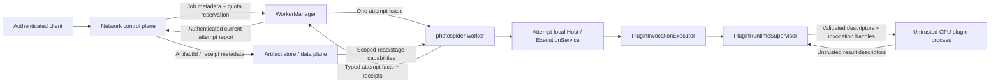

# ADR 0011：Server Control Plane、Worker 与 Plugin Runtime 属于不同安全域

## 状态

本决策作为 Issue #97 的目标契约被接受。它冻结 Issues #98 至 #106 所使用的
tenant、Job、authentication、quota、artifact、worker 与 plugin 边界。它不表示完整的
server、worker-manager、独立 artifact data plane、sandbox 或 isolated-plugin 目标已是当前软件行为。
实时交付状态仍由所链接的 Issue 与 Project 维护。

当前 `photospiderd` 与 plugin loader 均保持不变。Issues #99 和 #100 现在实现了源码私有的
本地 JobSpec 纵向路径，其中包含 complete-envelope tenant quota accounting、durable
Job/image artifact recovery、显式 retry/checkpoint identity，以及每个 attempt 一个全新 exec
的 Embedded Host worker process。一个同进程 `WorkerManager` object 拥有 private socket、
PID、heartbeat、cancellation escalation、精确 reaping 与 supervision handle；control-plane
Job service 仍是唯一 durable/quota/artifact/retry authority。Host memory 以 POSIX
`RLIMIT_AS` 执行；configured device capacity 仍仅用于 admission。Private closed protocol 与
精确 lease fencing 会把 startup、exit、signal、channel、protocol、heartbeat、runtime 与
forced-cancellation failure 隔离到拥有它的 attempt。

该本地切片保留本决策的身份与权威顺序，并提供真实的 quota admission、crash durability、
process-crash containment 与 bounded cancellation/shutdown。它保留共享的
128-configured-device admission/recovery 上限，以及 Job journal 对 not published、published
but durability unconfirmed 与 confirmed committed 的显式区分。Published barrier failure 会
保留 visible truth 并进入单调 control-plane fail-stop，而不尝试回滚。该 profile 只在 Darwin
与 Linux 默认启用；unsupported system 不存在 Job/worker target inventory。该切片不能证明
multi-tenant authorization、独立部署的 WorkerManager、authenticated network transport、
standalone artifact data plane、syscall/device isolation 或 untrusted-plugin isolation。当前行为由
[单租户 Job 纵向路径](../../kernel-architecture/zh/Single-Tenant-Job-Vertical.zh.md)定义。

## 背景

仓库已经具有稳固的本地/进程基线，但它并不是 network service security model：

- `photospiderd` 是 foreground、同用户 Unix-domain sidecar。受保护 directory、socket、
  lock 与 output file 构成同 UID 本地访问边界。Protocol v2 不包含 tenant identity、
  end-user authentication 或 remote transport trust model。
- Daemon 的 session、compute-request、cursor、output、delivery 与 server-instance id 都是
  process/local-transport identity。其私有 `OutputStore` 是受保护的 lease/TTL delivery
  store，不是 durable artifact authority。
- `ExecutionService`、`RunLifecycleRegistry` 与 `ResourceLedger` 拥有一个注入 Host
  进程的 physical execution、Run lifecycle 与已 admission 的 Host/device resource。
  `ComputeRun` 及其 Graph/Run/task identity 均为 process-local；它们不拥有 durable Job
  state 或 tenant quota。
- Operation、data-definition 与 policy DSO 在 Host address space 内执行 native code。
  ABI check、shadow transaction、callback fence 与 DSO lease 保护 compatibility、
  publication、exception 与 lifetime invariant。它们无法阻止 memory corruption、
  syscall、未申报 thread、unbounded allocation、crash 或永不返回的 callback。
- `ValueRevisionId`、`AllocationIdentity`、`StorageBinding` 与 `BufferHandle` 是 runtime
  observation/capability，不是 durable artifact 或 cross-process identity。

Project #5 引入 remote client、multiple tenant、受限 Job worker、durable artifact 与
tenant-supplied operation code。因此 threat model 包含恶意或已被攻陷的 tenant principal、
malformed JobSpec/artifact/protocol message、replayed/stale worker report、worker
crash/hang/OOM、恶意 plugin code/output，以及跨 tenant、Job、artifact、quota 与 process
boundary 的 confused-deputy 尝试。

Trusted computing base 包含 operating system、配置的 network identity/credential root、
network control plane、worker manager、artifact authority、authenticated local channel，
以及可信 worker executable 与 operator-approved built-in。受限 general worker 是较低信任
execution domain；tenant operation-plugin process 是非可信域。

本决策扩展 ADR 0003 与 ADR 0007 的 process ownership，而非取代它们。它还保留
ADR 0008 对 runtime/persistent identity 的分离，以及 ADR 0009 对独立 output-commit
authority 的要求。

## 决策

### 进程与安全域

目标 server profile 包含五个不同安全域：

| 安全域 | 权威 | 明确不拥有 |
| --- | --- | --- |
| Network control-plane process | Network authentication、principal-to-tenant mapping、authorization、immutable `JobSpec`、`JobId` 与 Job state、cancellation intent、retry policy、tenant/Job quota reservation、artifact reference | Graph/Run execution、native plugin loading、worker OS lifecycle、bulk artifact byte |
| Worker-manager process | Worker spawn/reap、`WorkerInstanceId`、assignment lease、authenticated local channel、OS resource envelope、heartbeat 与 cancellation/termination escalation | End-user authentication、JobSpec mutation、final Job/retry decision、Graph/Run commit、artifact byte/commit |
| 每个 active `JobAttemptId` 独占一个受限 `photospider-worker` | 一个 immutable attempt、Embedded Host/Kernel、Graph/Run lifecycle、一个 attempt-local `ExecutionService`/`ResourceLedger`、已验证 attempt report | Network listener、user credential、另一个 Job/tenant assignment、server quota mint、artifact root、final Job/retry state |
| Artifact-store/data-plane service | Immutable payload/manifest、`ArtifactId`、content/descriptor binding、idempotent commit、typed durability receipt、retention/recovery、artifact/output quota | Job/Run state、Graph execution、plugin execution、所提供 authorization context 以外的 tenant policy |
| 隔离的 CPU operation-plugin runtime | 一次有界 invocation 的 tenant code 与 invocation-local private state | Network、任意 filesystem root、user credential、tenant/Job/Graph/Run state、server/Host token、artifact publication、native GPU authority |

Network control plane 与 worker manager 是不同 OS process。Artifact data plane 是独立的
service/process boundary。每个 `photospider-worker` 都为一个 JobAttempt 全新创建，不接受
第二次 assignment，并在正常 settlement 或 manager termination 后退出。Plugin runtime 只有在
同一 JobAttempt 和 approved plugin generation 内才可服务多次 invocation；attempt 结束、lease
revocation、protocol fault 或 supervisor retirement 都会销毁它。



Control plane 与 WorkerManager 不加载 plugin DSO，也不执行 Graph operation。General worker
不暴露 network listener，且不能拥有或创建另一个 general worker。隔离 plugin process 不获得
Job、Graph、Run、artifact、credential、quota 或 Host resource authority。

### 本地 Sidecar 不是 Server Protocol

`photospiderd` 与 protocol v2 继续作为同用户本地 workstation sidecar。`0700`/`0600`
mode 与同 UID path identity 是其本地访问边界；它们不是 remote authentication、tenant
isolation 或 peer attestation。

未来 network service 使用新的带版本 protocol 与 composition root。它不会原样暴露或 tunnel
local router，不把 session name 重新解释为 tenant，不提升 process-global plugin mutation
method，也不把 local opaque id 转换成 server authority。在 `photospiderd` 前加 TLS 不构成
符合本决策的 server profile。

### Authentication 与 Tenant Authority

Control plane 通过配置的 identity root 认证每个 request，并把 immutable `PrincipalId`
映射到唯一 authoritative `TenantId` 与 permission set。它会在访问或披露受保护对象前，
授权精确的 `{principal, tenant, action, resource}` tuple。Caller-provided tenant label、
object id、local daemon id、trace id 与 identifier secrecy 都不授予 authority。

End-user bearer credential 与 identity-provider secret 止于 control plane。Cross-process
operation 使用 authenticated、audience-bound、expiry/revocation-aware capability，并精确
限制 tenant、Job、attempt、action、resource 与 budget。Delegation 只能缩小，不能扩大 authority。
Receiver 除 message field 外还会校验 channel/process identity。Credential encoding、TLS
implementation 与 identity-provider product 留给后续选择，但上述 authority property 不变。

### Identity Domain

目标 identity chain 如下：

```text
PrincipalId -> TenantId -> JobId + JobSpecDigest
                         -> JobAttemptId + WorkerInstanceId
                                         + WorkerLeaseGeneration
                         -> process-local GraphInstanceId / RunId
                                                   / RunLocalTaskId
                         -> PluginInvocationId
                         -> ArtifactId + OutputCommitReceipt
```

- `TenantId` 限定每个 Job、quota、artifact、plugin policy、audit 与 idempotency key。
- `JobId` 标识一个 immutable accepted `JobSpec`。Retry 保留 JobId 与 `JobSpecDigest`，
  并生成新的、不可复用的 `JobAttemptId`。
- `WorkerInstanceId` 标识一个 OS process。`WorkerLeaseGeneration` 绑定其精确 assignment
  与 revocation epoch。
- Graph/Run/task identity 仍只属于一个 worker attempt。它们可以复制用于 trace correlation，
  但不授予 server authority。
- `PluginInvocationId` 标识一个精确 attempt、approved plugin generation 与 invocation。
  它不授予 Graph 或 artifact authority。
- `ArtifactId` 标识 immutable persisted manifest/version。它不是 path、process pointer、
  Run id、content digest、`OutputArtifactId`、`ValueRevisionId`、`AllocationIdentity` 或
  `BufferHandle`。

每个 message 都携带并校验把它关联到 retained current state 所需的 identity。一个 domain
中的相等不能替代另一个 domain。即使 JobId 与 content 相同，旧 attempt/lease report 仍为 stale。

### Immutable JobSpec 与 Job Truth

Control plane 在接收前校验并冻结 canonical `JobSpec` byte，并记录 `JobSpecDigest`。Spec
通过 authorized immutable identity 引用 graph/configuration、input、plugin 与 checkpoint
material，并声明 output slot、execution profile、requested resource policy、durability 与
retention。它不包含 unrestricted Host path、file descriptor、pointer、native/runtime handle、
mutable store location、local session id 或 bearer credential。

Worker 会在 Graph construction 或 provider entry 前再次验证完整 spec 和 resolved artifact
descriptor。它报告 attempt fact：start、process-local Run outcome、quiescence、resource
settlement、artifact receipt 与 typed failure。它不拥有 overall Job state。

只有 control plane 拥有 current attempt selection、cancellation intent、retry 与 terminal Job
outcome。Job success 要求 current attempt 成功，并具有 JobSpec 所承诺的全部 artifact receipt。
Run success、artifact commit、Job terminal、cancellation 与 response observation 仍是独立事实。
Retry 会创建新 attempt；绝不重新打开旧 worker lease，也不修改旧 Run。

### 不引入第二个 ResourceLedger 的分层 Quota

唯一 server quota authority 拥有 concurrency、CPU、Host memory、已配置 GPU/device
capacity、output/staging byte、artifact retention 与后续 licensed resource 的 tenant/Job limit。
Job admission 要么原子保留完整 envelope，要么不产生任何局部 authority 并拒绝请求。

WorkerManager 从该 reservation 派生一个 attempt-scoped OS/process budget 与 assignment
capability。在 `photospider-worker` 内，现有 process-owned `ResourceLedger` 继续作为当前
Host/device execution dimension 的唯一 mint，且配置不得大于 attempt envelope。它可以细分
Run 与 device work，但不能 mint tenant concurrency、server GPU ownership、output 或 artifact
capacity。Artifact authority 在 stage 与 commit 时执行其委托的 output/staging/retention quota。

Usage 与 release 会依据可信 assignment 和 process-lifecycle state 向上恰好对账一次。
Worker report、JobSpec value、policy、plugin 与 plugin runtime 可以声明 demand，但不能构造、
复制、放大或直接释放 server quota 或 Host ledger token。

这是一组不同 scope 的 hierarchy，不是两个相互竞争的 resource mint：server quota 授权
attempt envelope；WorkerManager/OS 执行它；attempt-local ledger 只细分其当前 execution
dimension。

### Worker Lifecycle 与有界终止

WorkerManager 独占 spawn、process identity、assignment、heartbeat、cancellation delivery、
revocation、termination escalation、exit classification 与 reaping。它只针对 current
`{WorkerInstanceId, WorkerLeaseGeneration}` 操作，绝不针对未经限定的 PID。Control plane
不直接 kill 或复用 worker process。

潜在阻塞的 graph resolution 不属于 PID 出现前的 supervisor。产品 composition 会在 service
ownership 前完成它，并且只保留 immutable prepared catalog。WorkerManager 先登记精确 exec 后
child PID，再执行不可覆写的内存 handoff；filesystem open 与 graph load 发生在该 owned process
内。因此 blocked trusted read 可以被取消、signal 并精确 reap，而不会无限占住 manager handle
reaper。

Cancellation 由四个 owner 依次处理：

1. control plane 为 current JobAttempt 记录 monotonic cancellation intent；
2. WorkerManager 把 cooperative cancellation 路由到精确 worker lease；
3. worker 把它映射到现有 Run/Graph shutdown 并报告 quiescence；
4. 超过配置时限后，WorkerManager 撤销 capability，并终止/reap 该精确 process。

Normal completion 要求 Run/Graph settlement、attempt-local resource release、所需 artifact
receipt、authenticated report acceptance、capability closure 与 process exit。Crash、hang、
OOM、signal death、malformed protocol 或 channel loss 只使 current JobAttempt 失败。
WorkerManager 不依赖最终 worker report 便可 revoke 并 reconcile assignment；只有 control
plane 应用 retry policy。

当前 Issue #100 子集在本地 single-tenant authority 内实例化这一 lifecycle，而不是目标中的
独立 WorkerManager process。它使用一个 private socket pair、固定 bounded protocol、全新
`fork`/`exec`、`RLIMIT_AS`、cooperative cancel 后的 `SIGTERM`/`SIGKILL`，以及精确
`waitpid`。Report 只有在 clean exit 与 reap 后才具备资格。这也包括 deadline-side 竞态：第二次
精确观察在 channel 撤销前 reap 了自然退出时，manager 会为一次有界的 post-reap Report/EOF
drain 保留 parent socket 与 stateful decoder，而不是虚构 channel loss 或 forced cancellation。
这为可信 Embedded worker composition 提供 process crash isolation；它不是 network peer
authentication、syscall sandbox、device isolation，也不是 Issues #101-#104 分配的 isolated
tenant-plugin runtime。

该 private protocol 把 64-MiB bound 应用于完整编码 Report，包括 identity、diagnostic、flag、
image metadata 与 tight image bytes。当其他方面有效且已 settled 的 success 无法装入剩余 frame
或 Job output/staging/retention envelope 时，会变成一个有界、保留 identity 且没有 image 的
`Failed/Compute` Report，因此不可传输 candidate 是 typed worker truth，而不是未捕获的 write
exception 再被推断为 process 或 channel loss。在已经尝试 cancellation delivery 后发生
socket-system error 时，同样会让错误留在有界 monitor 内：decode 停止，但精确 process
ownership 与 reap deadline 继续，因此 signal/nonzero wait status 或已经 decode 的 Report
优先于较弱 channel fact。当 cooperative cancellation deadline 仍然有效时，普通 EOF/post-
report deadline 必须服从它，不能先通过 generic channel path 终止并 reap worker。因此，精确
exit status 或 manager-owned escalation 会先完成裁决，之后才允许剩余 `WorkerChannel` fact。
该规则也覆盖 worker 仍然存活时收到完整、有效 candidate Report 的情形：它的普通 post-report
close/exit deadline 不能在有效 cooperative deadline 之前终止或 reap worker。在该 deadline
之前观察到的 worker-owned signal 或 nonzero exit 仍是权威 wait-status fact；只有在
cooperative deadline 到达时仍然存活的 worker 才会进入 cancellation state machine 所有的
`SIGTERM`/`SIGKILL` escalation，并且才可能产生 forced cancellation。

Exec bootstrap 还会在 control descriptor 之外携带必填的精确 startup 与 worker-write
deadline。worker 不使用本地默认值或更短 cap，而是直接采用 manager value，因此即使第一帧
assignment 尚不可用，两端也执行同一 configured lifecycle policy。

### Artifact Store 与 Data Plane

Artifact authority 拥有 immutable payload、canonical manifest、descriptor/content binding、
稳定且 tenant-scoped 的 `ArtifactId`、commit idempotency、typed achieved-durability receipt、
retention、recovery 与 artifact/output quota。Durable output 遵守 ADR 0009 的 manifest-last、
no-replace、identity-revalidated、capability-aware transaction。

Control plane 只保留 authorized artifact reference 与 verified receipt fact，不保留 bulk byte。
目标 control message 只携带有界 authentication、tenant、Job、quota、ArtifactId、receipt 与
capability metadata。Bulk input、output 与 checkpoint byte 通过 data plane 传输。

Worker 获得 exact input 的 immutable-read capability，以及 exact output slot 的私有
stage/commit capability。它不获得 artifact root、unrestricted namespace listing、其他 tenant
id 或 mutable published path。Plugin runtime 只获得 invocation buffer，绝不获得 artifact
capability。每个 data-plane capability 都会校验 audience、tenant、resource、action/direction、
byte/range limit、content/descriptor binding 与 expiry/revocation。

加载 artifact 会创建新的 process-local Value、binding、allocation 与 fence state。当前
`OutputArtifactId`、delivery lease、cache path、content digest 与 runtime identity 都不能替代
`ArtifactId` 或 receipt。

### Plugin Trust 与 Isolation

Operation v2、data-definition-provider v3 与 policy v1 DSO 只要加载到 Host process，就属于
trusted native code。Pure-C record 与最小化合法 authority 并不能 sandbox native code。
Server control plane 与 WorkerManager 不加载任何 DSO。Worker 只可加载由配置的
allowlist/signature policy 接受的 operator-trusted generation。Tenant-supplied CPU operation
code 始终使用隔离路径。Policy 与 data-definition DSO 在另行批准隔离协议前，继续保持
trusted/allowlisted。

`ExecutionService` 只能通过私有 `PluginInvocationExecutor` 到达隔离 CPU operation code。
General worker 中的可信 `PluginRuntimeSupervisor` 拥有 plugin-process creation、authenticated
protocol、heartbeat、invocation deadline、termination/restart backoff、sandbox/capability policy、
resource limit 与 shared-memory/FD transport。

每次 invocation 都包含精确 tenant/Job/attempt/worker-lease binding、`PluginInvocationId`、
approved plugin package/generation、operation identity、immutable scalar parameter、bounded
versioned descriptor、access direction 与 checked byte range。它不携带 C++ object graph、Host
callback、raw pointer、allocator owner、Graph/Run owner、native GPU handle、artifact capability、
credential 或 resource token。

可信 Host 代码会在 transfer 前验证所有 input，并在 Run 使用前验证所有 output。Validation
包括 version/kind、count、rank/extent、layout/stride、checked range arithmetic、overlap/write
permission、byte size、descriptor/content binding、readiness、ownership、plugin/generation/
invocation identity、current worker lease 与 declared resource bound。返回的 descriptor、handle、
offset、digest、status 与 diagnostic 均为 untrusted data，绝不 mint authority。

Issue #101 拥有 pure-C operation ABI 决策。Issue #102 拥有首个 CPU shared-memory/FD
invocation record。Issue #103 拥有 heartbeat、deadline 与 fault isolation。Issue #104 拥有
allowlist/signature 与可执行 plugin resource policy。本 ADR 冻结其 authority 与 process
boundary，但不预先决定 wire layout。Cross-process GPU handle/fence 留给后续决策。

### Failure、Revocation 与 Replay

Capability 必须 non-forgeable，限制 audience/action/resource，按需绑定 tenant/Job/attempt，
受 expiry 或 monotonic revocation generation 限制，且 delegation 绝不扩大 authority。
Cancellation、assignment replacement、worker exit、plugin retirement 与 artifact commit 都是
monotonic transition。

Duplicate、reordered、replayed、stale、over-limit、unknown-generation 或 identity-mismatched
message 都会 fail closed。Revocation 后的 late message 可以执行 idempotent private cleanup，
但不能恢复 admission，不能发布 Job 或 Run/plugin output，不能 attach artifact、mint/release
quota，亦不能披露其他 tenant state。

- Plugin crash、hang、deadline、OOM、sandbox denial、protocol fault 或 bad output 只会使
  exact invocation 失败，并按 operation semantics 使其所属 Run/attempt 失败。Supervisor
  只 revoke 并终止该 attempt-scoped plugin process。
- Worker crash、hang、OOM、protocol fault 或 channel loss 只会使 exact JobAttempt 失败。
  其他 worker、tenant、control plane 与 committed artifact 继续可用。
- Committed artifact receipt 在 worker/plugin/Job cancellation 后仍具权威。Private
  uncommitted stage 仍由 artifact authority 清理。
- Restart 只从 durable control fact 与 artifact fact 重建。Process-local session、output、
  Graph、Run、task、Value 或 buffer id 都不是 recovery authority。

### Audit Correlation 只用于观察

成功经过 boundary 的操作会发出有界 fact，用于关联 `PrincipalId`、`TenantId`、`JobId`、
`JobSpecDigest`、`JobAttemptId`、`WorkerInstanceId`、`WorkerLeaseGeneration`、存在时的
process-local Graph/Run/task identity、plugin package/generation、`PluginInvocationId`、
`ArtifactId`/receipt、decision 与 typed failure。Record 不包含 bearer credential、private key、
raw capability secret 或 unrestricted payload data。

Audit id、trace id、log text 与 caller correlation field 不授予 authority，也不能替代
identity/lease validation、current-attempt selection 或 quota。Issue #106 拥有长期 fuzz、audit
与 cross-layer trace 实现。

### 交付边界

后续 delivery ownership 固定如下：

| Issue | 交付边界 |
| --- | --- |
| #98 | Immutable JobSpec、single-tenant control-plane-to-worker submit/query/cancel/completion，以及 artifact-identity closure |
| #99 | Tenant quota、durable artifact、retry/checkpoint 与 recovery semantics |
| #100 | WorkerManager/`photospider-worker` supervision、worker-crash containment、bounded cancellation/shutdown |
| #101 | 独立的 pure-C operation-plugin ABI 决策 |
| #102 | 通过 shared memory/FD 的隔离 CPU invocation，以及精确 descriptor/stride/size/ownership validation |
| #103 | `PluginRuntimeSupervisor` heartbeat、deadline、crash/hang/OOM/bad-output containment |
| #104 | Plugin allowlist/signature 与可执行 resource quota/token policy |
| #105 | Network control metadata 与 bulk artifact data-plane separation |
| #106 | 长期 codec/descriptor fuzzing、security audit，以及 Session/Revision/Run/Task cross-layer trace |

较早切片只能声明其实际实现的较窄 profile。Single-tenant Job vertical 不是 multi-tenant server。
没有 process isolation 的 pure-C ABI 不能安全承载 hostile native code。在 authentication/
authorization、tenant Job state、quota、one-attempt worker、durable artifact、replay-safe
capability、bounded cancellation/shutdown 与长期 isolation test 成为当前行为前，不得声明
network multi-tenant profile。在 isolated invocation、精确 descriptor/ownership validation、
supervisor fault handling、plugin trust/resource policy 与 crash/hang/OOM/bad-output/fuzz test
成为当前行为前，不得声明 untrusted-plugin profile。

## 后果

- Network parsing、worker lifecycle、Job execution、durable byte 与 tenant native code 不再
  共享同一 failure 或 authority domain。
- Fresh one-attempt worker 简化 tenant isolation 与 stale-state proof，但增加 process startup
  与 memory overhead。Worker reuse 需要新 ADR，并证明 process-global/native-state 完整清理。
- Authentication、Job truth、quota、artifact commit、Run commit 与 plugin invocation 获得
  明确且独立的 owner。Caller 必须保留更多 typed state，但 failure/recovery 不再依赖模糊的
  “complete”。
- Server quota 与 attempt-local `ResourceLedger` 保持 hierarchy，而非相互竞争。Plugin 不能
  mint 任一 authority。
- CPU plugin isolation 增加 protocol、validation、copy/mapping、supervision 与 platform-sandbox
  成本。Pure C 改善 record compatibility，但本身不提供 security。
- 各平台 OS sandbox capability 不同。产品必须发布封闭的 supported capability profile，并在
  不支持 isolation 时显式失败；不得静默在进程内运行 tenant code。
- Trusted policy 与 data-definition DSO 仍可攻陷 worker。在另行决定 isolation 前，只允许
  operator-approved generation。

## 被拒绝的替代方案

### 在 `photospiderd` 周围增加 Network Listener 或 TLS Proxy

拒绝，因为 local filesystem ownership 与 protocol-v2 opaque id 不提供 tenant identity、
Job truth、quota delegation、worker isolation、durable artifact 或 plugin containment。

### 在一个进程内运行 Control Plane、Manager、Worker、Artifact Store 与 Plugin

拒绝，因为 network parser、malformed artifact、worker fault 或 native plugin 会获得所有
tenant、Job、resource 与 persistence authority。

### 在 Tenant 或 Job Attempt 之间复用 General Worker

第一代拒绝该方案，因为 process-global registry、native runtime、DSO state、thread、mapping
与 allocator state 尚无已批准的完整 scrub boundary。

### 把 ComputeRun 或 Daemon Compute Request 当作 Job Identity

拒绝，因为 Run/request identity 是 process-local，且 ADR 0009 要求 Run success、durable
output、daemon result 与 response observation 相互分离。

### 把 ValueRevisionId、BufferHandle 或 OutputArtifactId 序列化为 ArtifactId

拒绝，因为这些值标识 runtime publication、allocation/range 或 process-scoped delivery，
而不是 durable manifest/version 与 receipt。

### 让一个 Global ResourceLedger 同时拥有 Server 与 Worker Authority

拒绝，因为 worker-local ledger 无法观察其他 process 或 durable artifact retention，而独立且
不受限的 worker mint 会重复计账 capacity。被接受的 hierarchy 为每个 scope 指定唯一 owner。

### 把 Pure-C Plugin ABI 当作 Hostile-Code Containment

拒绝，因为 fixed record 无法约束任意 native memory、thread、syscall、allocation、crash 或
hang。非可信代码需要 process、sandbox、scoped transport capability 与 supervisor。

### 只依赖 Cooperative Cancellation

拒绝，因为 native code 可能永不返回。Worker 与 plugin process boundary 能提供 capability
revocation 与 bounded termination，同时保留 attempt/Run cleanup semantics。

### 通过 Network Control Plane 传输 Bulk Value

拒绝，因为这会把 authentication/Job-state availability 与 unbounded payload parsing、storage
bandwidth、artifact authority 合并。Data plane 拥有 payload transfer，control plane 拥有
identity/metadata。

## 与当前事实及其他决策的关系

- [ADR 0003](0003-process-owned-execution-resources.zh.md)继续作为 process-owned
  execution resource 的权威。在 server profile 中，每个 `photospider-worker` 都是一个显式
  composition root；server quota 约束而不替代其 execution domain。
- [ADR 0006](0006-kernel-documentation-separates-facts-decisions-targets-and-status.zh.md)
  要求本 ADR 的 accepted target、当前 local fact 与 Issue delivery status 保持分离。
- [ADR 0007](0007-compute-runs-and-process-execution-have-separate-owners.zh.md)继续作为
  worker-local Run identity、lifecycle、ledger、Graph close 与 process execution shutdown 的
  权威。本 ADR 拥有更高层 Job/attempt/worker authority。
- [ADR 0008](0008-generic-values-memory-bindings-and-regions-are-explicit-versioned-contracts.zh.md)
  继续作为 runtime/persistent identity separation 与 provider generation 的权威。
- [ADR 0009](0009-compute-io-durability-and-completion-semantics.zh.md)继续作为
  Artifact/OutputStore commit、receipt、failure ordering 与 durability 的权威。本 ADR 把该
  authority 放入独立 artifact data plane。
- [ADR 0010](0010-execution-profile-slos-are-six-independent-benchmark-verdicts.zh.md)
  继续作为 execution-profile evidence contract；其 row 不能证明 sandbox 或 tenant isolation。
- 当前事实继续由 [IPC Protocol v2](../../codebase-structure/zh/IPC-Protocol-v2.zh.md)、
  [Plugin ABI](../../kernel-architecture/zh/Plugin-ABI.zh.md)与
  [Compute Boundaries](../../kernel-architecture/zh/Compute-Boundaries.zh.md)权威记录。
- [Server 与 plugin isolation 路线图](../../roadmap/zh/Kernel-Evolution.zh.md#服务器与插件隔离)
  把本决策记录为目标，并记录 Issue #98 至 #106 的交付顺序。
