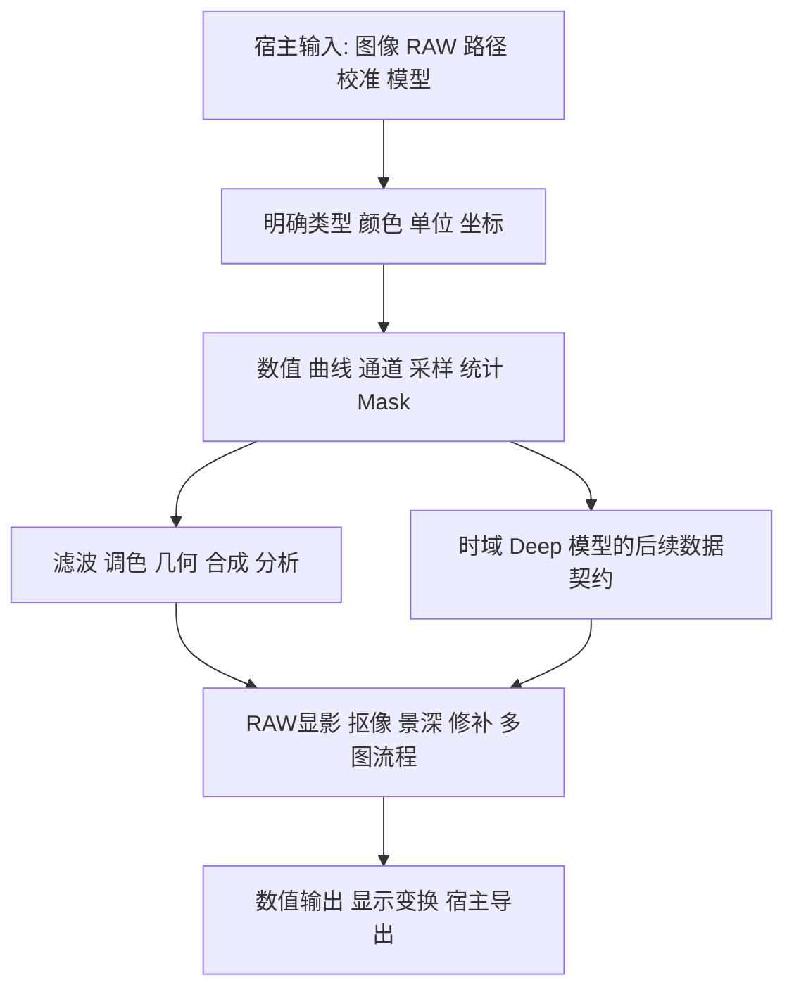

# 图像算子体系研究结论

需要开发的是一组可组合的数据转换、采样、统计、颜色与合成能力，以及由它们组成的专业流程。原清单已经覆盖多数常见菜单方向；主要遗漏集中在通道重组、图像采样、mask/距离与连通、RAW、多图、修复、时域、特殊数据和模型边界。仅增加更多滤镜名称无法补齐这些连接关系。

本研究采用数学和颜色科学语义为默认，以商业产品文档核实功能存在和公开行为，以标准/原论文定义可实现的方法。兼容具体软件属于单独目标，需要版本化输入输出证据。各分类页给出端口、算法、参数建议、支持限制和验收，整体执行链见[路线](../14-roadmap/implementation.md)，未实现目录项继续 Proposed；已交付基础和节点按[当前实现](current-state.md)区分。原外部研究日期仍为 2026-09-09，本次仅同步本地实现状态。

## 从功能清单到能力结构

本架构建议保留基础op与复合workflow两个层级。例如“渐变映射”依赖标量feature和颜色ramp，“液化”依赖可编辑map与统一sampler，“阴影高光”依赖tonal mask或局部base/detail，“景深”依赖depth、PSF和visibility。产品层仍可提供一体化控件，但计算中间结果应可复用和检查。

## 已交付基础与近期缺口

`ops@66b16339` 已交付 typed image v2、signed/HDR、静态 shape、computed scalar、命名多输出与精确采样依赖。Phase A 进一步提供分页全局结果、结构化 schema、独立 emission、资源预算与错误/质量模型，统计、FFT、连通域和 Layer 有公开 workflow。默认节点、显式 factory 和仅提供表示/helper 的范围见[当前实现](current-state.md)。

后续节点应复用已实现 Value/多输出/Result 入口，逐算子明确数值域、映射、资源和发布条件；Whole 和分页的选择取决于算法与可检查预算。算子数量本身不足以证明需要重写通用runtime。CPU参考可先实现可检查行为，GPU选择依实际输入域、质量与开销。

## 四项关键语义结论

第一，三通道曲线表是[N,3]，真正三维颜色LUT是[Nr,Ng,Nb,3]；同为[N,3]的标量color ramp与RGB独立查表仍不同。控制点、连续曲线、离散LUT、LUT应用应分开；烘焙近似误差进入验收。[CLF规范](https://docs.acescentral.com/clf/specification/)

第二，颜色模型、原色/白点、transfer、scene/display参照、alpha、dtype和量化范围是不同信息。ICC转换、OCIO配置、tone/gamut mapping和softproof也不能合成一个无条件“格式转换”。OpenEXR允许零alpha非零RGB发光数据，CoverageRGBA 仍要求零 alpha 时 P=0；已实现 Layer 用独立 E 承载发光数据，导入和颜色处理须遵循 [Layer 契约](../../kernel-architecture/Layer-Runtime.md)。[ICC1:2022](https://www.color.org/specification/ICC.1-2022-05.pdf)、[OpenEXR技术说明](https://openexr.com/en/latest/TechnicalIntroduction.html)

第三，标准blend function和alpha composite分开。默认Lab/LCh组件替换具有可检查的L/C/h语义；legacy RGB SetLum/SetSat另设模式。公开公式不能证明现代Photoshop或CSP内部采用YCbCr，CSP Glow模式完整公式仍未知。同一半透明原图与调色版要用premul mix，不能无条件source-over，否则alpha变化。[W3C合成](https://www.w3.org/TR/compositing-1/)、[CSP模式说明](https://help.clip-studio.com/en-us/manual_en/180_layers/Blending_modes.htm)

第四，数学上的局部性决定真实输入需求。Canny连接、EDT、scan/FFT、统计与迭代求解有全局或跨tile关系；标准guided filter可能读2r范围；warp有内部极值和任意源读取。不能用统一小halo覆盖所有算法。具有完整辅助表的逐像素LUT也需要按端口区分demand。[Guided Filter论文](https://people.csail.mit.edu/kaiming/publications/eccv10guidedfilter.pdf)、[OpenCV变换](https://docs.opencv.org/4.13.0/da/d54/group__imgproc__transform.html)

## 散景和鱼眼专项结论

相邻散景项目已提供固定层距离与固定光圈核参考，depth map、像差与波长是新增范围。gather按输出半径平均，scatter按源半径散布能量；半径分桶的运算顺序也不同。圆盘扫描线prefix/周界差分可降低恒强离散核成本，但不自动解决面积抗锯齿、任意PSF、遮挡或高精度归约。单RGBD缺少背景，实时方案必须标近似。[散景规格](../06-optics/bokeh.md)、[AMD DoF1.1](https://gpuopen.com/manuals/fidelityfx_sdk/techniques/depth-of-field/)

球极投影的3D直线方向轨迹可形成圆弧，但端点框不保守、退化/极点需要特殊处理，圆盘轴向缩放也不自动成为矩形。首期鱼眼应是已知相机模型间的2D重采样；3D曲边栅格还需要mesh、visibility、depth和属性插值。ShaderToy两链接未能读取，保留未核验状态。[鱼眼规格](../08-transform/projections.md)、[Kannala–Brandt](https://users.aalto.fi/~kannalj1/calibration/Kannala_Brandt_calibration.pdf)

## 支持面与实施优先级

numeric/curve/channel/mask 基础、卷积、STMap 和具名全局链路已有实现；下一步补专用路径/距离/边缘节点、更多 sampler、颜色管理、标准 blend 与恢复/PSF/RAW 等完整流程。时域、Deep和ML完整登记输入/输出与依赖，待专用契约明确后实施。具体可执行叶子和每阶段退出条件在路线表中。

库复用按职责选取：LibRaw负责原始数据、OIIO负责I/O与部分算法、ICC CMM/OCIO负责不同颜色流程、FFT负责固定频域计算、模型runtime负责规定推理。它们都需要适配数值、layout、资源、线程和取消，不能以集成库数推算功能完成率。[依赖调查](dependencies.md)

## 使用和验收的终点

每个切片必须给公开入口运行的最小workflow、解析输入或独立oracle、实际参数、结果检查和相关边界。目录已定义LUT、路径线宽、选区、液化、边缘、摄影调色、合成、景深、频谱与RAW等11条新需求验收链；概念 DAG 的完整覆盖与可运行实现子集分别列出，并链接公开示例；本轮未重跑产品流程。[验收链](../14-roadmap/workflows.md)

软件覆盖按功能族记录，未完整展开排版、完整自然介质、3D场景系统、音频、资产管理和商业私有算法。本次完成的是有证据的需求目录与规格研究，既不修改现有API，也不宣称完成七款产品复刻。[覆盖矩阵](../13-coverage/software-matrix.md)
