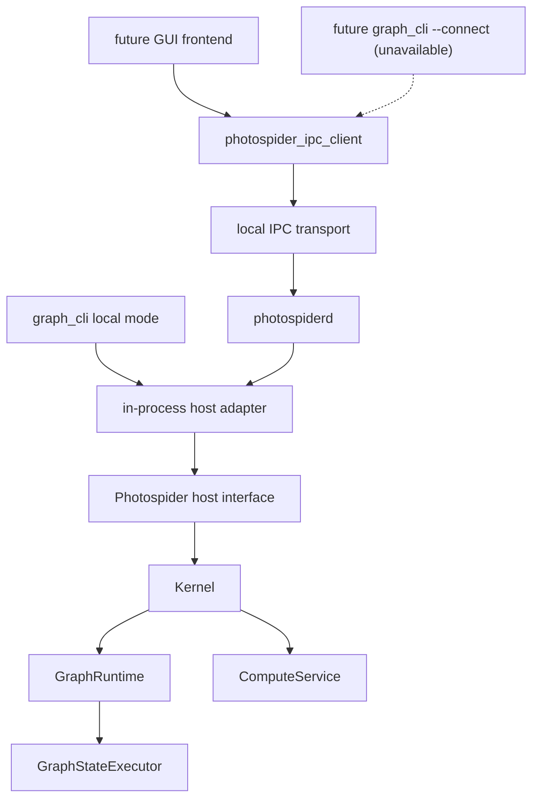

# Codebase Structure Direction

This document records Photospider's current public header/Host seam, static
product, role-owned source layout, implemented version 2 daemon/IPC slice, and
the completed extension-SDK/internal-target split. Current-state claims and future work are
distinguished explicitly below.

The goals are:

- `libphotospider` is the stable static-link target for embedded frontends.
- `photospiderd` runs as a foreground, same-user local Unix-domain sidecar that
  owns graph sessions through one embedded `ps::Host`; it is not the current
  system-service, multi-user, remote, or TCP product.
- `graph_cli` remains the basic interactive command-line frontend.
- Frontends can either link `libphotospider` in-process or use the typed client
  to talk to
  `photospiderd` through IPC.

## Current Friction

The current repository now has the public Host seam, installable static
product, migrated CLI application tree, role-owned backend source tree,
explicit production-plugin homes, unit/integration test ownership, and the
macOS/Linux version 2 daemon/IPC graph, inspection, polling-compute, protected
image-output, bounded event/trace observation, and process-global operation-
plugin router behavior. The installed typed IPC Client now exposes owned calls
for the exact 60-method surface, validates every typed result, and aggregates
stable cursor pages into complete Host-shaped values. The installed IPC-backed
Host now implements all 58 current non-destructor Host virtuals through typed
short-lived connections, joined asynchronous polling, and deterministic stop
ordering. Image mode currently performs strict same-user regular-file
revalidation while its delivery lease protects result-to-open, creates a
shared read-only mapping, and then releases the matching job/lease. The final
mapping owner unmaps and closes exactly once. The installed IPC-only package
consumer now closes the complete symbol/export/header contract; the plugin SDK
follows the extension contracts documented below.

Observed build targets in the current root `CMakeLists.txt`:

| Current target | Current role | Friction |
| --- | --- | --- |
| `photospider_core_internal` | Build-only core values, private conversion, and registry helper. | Role-owned sources are also folded into the static product. |
| `photospider_graph_internal` | Build-only `GraphModel` and graph-service helper. | `GraphModel` remains private under `src/lib/graph`. |
| `photospider_plugin_host_internal` | Build-only host-side operation v2 loader, adapter, and lifetime helper. | It is not exported. |
| `photospider_policy_internal` | Build-only pure-C policy DSO registry/loader, built-in types, bindings, contexts, faults, and DSO leases. | It owns ordering contexts only; it owns no worker, queue, grant, Run, Graph, or execution route. |
| `photospider_execution_internal` | Build-only private physical-execution accounting primitive. | `ResourceLedger` is compiled here; each composition-root `ExecutionService` owns its sole Host-authoritative instance. |
| `photospider_compute_internal` | Build-only compute, request-owned HP/RT `ComputeRun`, policy-aware ready store, reserved-start transaction, private route execution, runtime, and dirty-region helpers. | Runs and physical route mechanisms remain private. |
| `photospider_host_internal` | Build-only embedded Host adapter and Kernel facade closure. | It is not exported and exposes no private execution owner to consumers. |
| `photospider_operation_runtime` | Installable static image-buffer factory implementation. | It has no external package or back-link to the operation SDK. |
| `photospider_operation_sdk` | Installable operation v2 interface SDK. | It transitively carries `operation_runtime`, so it is the sole ordinary plugin link target. |
| `photospider_operation_opencv` | Installable opt-in OpenCV adapter. | It discovers and links only OpenCV `core`. |
| `photospider_policy_sdk` | Installable dependency-neutral pure-C policy ABI v1 SDK. | It carries one C11/C++17-compatible header and no execution/runtime dependency. |
| `photospider` | Static installable backend product with archive name `libphotospider`. | Matches the desired static product and public Host shape while folding role-owned backend sources into one archive. |
| `photospider_cli_common` | Static CLI command/TUI/autocomplete code plus the reusable `run_graph_cli` boundary under `apps/graph_cli/` and two role-owned benchmark service translation units. | The benchmark sources belong only to this non-installable helper and the complete CLI closure; they are absent from the installable `photospider` static product. |
| `graph_cli` | Process-policy-only entry point at `apps/graph_cli/main.cpp`. | Disables OpenCL, owns allocation-independent fatal exit policy, creates the embedded `Host` adapter, and has no daemon-client mode yet. |
| `photospider_ipc_client` | Installable static typed Unix IPC client and complete Host adapter. | Implements typed owned calls for all 60 version 2 methods plus `create_ipc_host` for all 58 current non-destructor Host virtuals; it does not link the backend or expose JSON/POSIX types. |
| `photospider_ipc_server_internal` | Non-installable router, registry, and bounded Unix listener. | Serializes every Host call and intentionally remains outside the package export. |
| `photospiderd` | Installed foreground process shell under `apps/photospiderd/`. | Owns one embedded Host, self-pipe signal policy, protected socket, and deterministic cleanup. |

Remaining and recently resolved interface leaks:

- The former `include/graph_model.hpp` has moved to
  `src/lib/graph/graph_model.hpp`;
  graph model state, dirty-region snapshots, planner summaries, full task graph
  cache handles, and runtime generation state are now internal to the private
  include root.
- The internal `Kernel` and `InteractionService` facades now live under
  `src/lib/runtime/`. They include runtime, compute service, graph services, plugin
  manager, and dirty-control-lane implementation types, so they are not
  supported headers for linked consumers of `photospider`; repository
  targets that still include them must receive the private `src/lib/` include
  root.
  `ps::Host` is already the only supported frontend public seam. The embedded
  Host adapter translates `ps::HostComputeRequest` into the internal
  `Kernel::ComputeRequest` and then delegates through
  `InteractionService`/`Kernel`. Later phases preserve this ownership while
  changing internal targets or adding daemon/IPC adapters; they do not
  introduce a second frontend facade.
- Benchmark and implementation-private backend headers now live with their
  owning roles under `src/lib/**`; CLI headers live in the application-private
  `apps/graph_cli/include/graph_cli/` tree. The eight former transitional
  source-tree extension headers were
  `include/{plugin_api,node,ps_types,image_buffer}.hpp`,
  `include/adapter/buffer_adapter_opencv.hpp`, and
  `include/kernel/scheduler/{i_scheduler,scheduler_task_runtime,scheduler_plugin_api}.hpp`.
  They are now deleted without compatibility forwarders; their public narrow
  contracts and private full declarations have distinct role-owned homes.

Resolved seam tightening in the current branch:

- The former direct graph-state submission and runtime access escape hatches
  have been removed from the frontend contract. `Kernel` and
  `InteractionService` are internal facades, while tests that still need runtime
  or graph-state access explicitly include the internal-only
  `tests/support/kernel_test_access.hpp` helper and route those calls through
  `ps::testing::KernelTestAccess`.
- Graph, compute, runtime, Host, plugin, policy, execution, benchmark, and adapter
  implementation files and private headers now live under role-owned
  `src/lib/**` directories. Internal targets compile with the private
  `src/lib/` root, while the installable public header inventory remains
  limited to `include/photospider/**`.
- The issue #69–#75 Run/policy/execution implementation lives under
  `src/lib/compute/`, `src/lib/policy/`, and `src/lib/execution/`, while the
  shared accounting primitive lives under
  `src/lib/runtime/resource_ledger.*`. `Kernel` injects the Host-owned
  `ExecutionService`; `ComputeService` creates one Run for each non-realtime HP
  call and separate HP `Full` plus RT `Interactive` child Runs for realtime
  calls. Full, dirty, preflight, initial, and dependency-released work crosses
  one bounded ready store as move-only lease-backed submissions. The Host fixes
  the service class and trusted frontier, invokes one built-in or pure-C policy
  binding, validates the decision, and commits a resource exchange before one
  of the closed `cpu`, `serial_debug`, or `gpu_pipeline` routes starts. Graphs
  retain only copied route ids/generations. Policy bindings retain their own
  contexts, nonzero generations, immutable first faults, and DSO leases but no
  physical authority. No installed Host value or operation ABI names these
  private objects; the installed policy ABI exposes only immutable scalar
  ranking snapshots.
- Dirty-region diagnostics, compute planning diagnostics, and execution trace
  diagnostics are available through copied Host value snapshots. Public headers
  no longer need to name the backend graph/runtime/service/planning types or
  physical route classes to expose those diagnostics.
- The configured CLI application surface now lives under `apps/graph_cli/`:
  `main.cpp`, private headers, implementation sources, command help resources,
  root configuration code, REPL/TUI, autocomplete, and terminal helpers. Its
  complete target closure additionally includes only
  `src/lib/benchmark/benchmark_service.cpp` and
  `src/lib/benchmark/benchmark_yaml_generator.cpp`; both belong exclusively to
  the non-installable `photospider_cli_common`/CLI closure and are not folded
  into the installable `photospider` static product. The old top-level CLI homes
  are not compatibility surfaces.
- Repository-owned operation and policy plugins now live under
  `plugins/ops/` and `plugins/policies/`; test-only DSOs remain fixtures.
  Maintained test translation units are classified under `tests/unit/` and
  `tests/integration/`, with explicit fixture, support, and manual-verification
  roles. Obsolete issue replay/result orchestration has been removed.
- Operation plugins compile against public `ps::plugin` v2 snapshots and a
  host registrar without `Node`, `GraphModel`, `OpRegistry`, YAML, or private
  cache ownership. Policy plugins compile against the self-contained C11
  `policy_plugin_api.h`; exact ABI v1 records expose immutable bounded scalar
  candidates and no executor, allocation service, resource grant, Run, Graph,
  completion route, or logger. Both are trusted in-process contracts rather
  than isolation boundaries, but only the operation interface remains a
  provisional C++ ABI.

## External Interface Rule

The external seam should be:

```text
external frontend
  -> public ps::Host (the only frontend seam)
      -> embedded Host adapter
          -> internal InteractionService / Kernel boundary
              -> GraphRuntime / GraphModel / ComputeService implementation
```

External code should not include or name these implementation concepts:

- `GraphModel`
- `GraphRuntime`
- `GraphStateExecutor`
- `ComputeService`
- `DirtyControlLane`
- `ComputePlan`
- `FullTaskGraph`
- `PolicyRegistry`, `ExecutionTaskRuntime`, or concrete private route classes
- graph cache/traversal/io service classes

External code may depend on stable value contracts:

- graph/session identifiers
- compute request options
- error/result values
- graph and node inspection snapshots
- policy binding and execution trace snapshots
- dirty-region inspection views
- image and tile buffer contracts
- plugin operation registration contracts

This keeps `InteractionService` as a deeper backend module behind the public
`ps::Host` seam: frontends get graph lifecycle, compute, inspection, events,
policy/execution configuration, and plugin control without learning the implementation
topology behind them.

## Target Public Headers

Only headers under `include/photospider/` are installable. There are no
source-tree extension exceptions, compatibility wrappers, or duplicate old/new
declarations.

Target layout:

```text
include/photospider/core/
  export.hpp
  geometry.hpp
  device.hpp
  image_buffer.hpp
  graph_error.hpp
  compute_intent.hpp
  result_types.hpp
  inspection_types.hpp

include/photospider/host/
  host.hpp
  graph_session.hpp
  compute_request.hpp
  event_stream.hpp

include/photospider/plugin/
  plugin_api.hpp
  op_contract.hpp
  node_view.hpp
  opencv_adapter.hpp

include/photospider/policy/
  policy_plugin_api.h

include/photospider/ipc/
  client.hpp
  host.hpp
  protocol.hpp

include/photospider/
  public_boundary.hpp
```

Header rules:

- Public headers must not include files from `src/`.
- Public headers must not include `kernel/services/...`.
- Public headers must not expose mutable implementation state owned by
  `GraphModel`, `GraphRuntime`, or `ComputeService`.
- Public headers should prefer value objects, opaque handles, small references,
  and request/result structs.
- OpenCV appears only in the opt-in `plugin/opencv_adapter.hpp` contract;
  operation SDK, policy SDK, Host, core, and IPC headers do not require it.
  No public header exposes yaml-cpp. `ImageBuffer` remains a public value
  contract.
- CLI, benchmark, and test-only headers are not public install headers.

## Current and Target Source Layout

The source tree should make ownership visible before reading a single file:

```text
include/photospider/
  core/
  host/
  plugin/
  policy/
  ipc/

src/lib/
  core/
  graph/
  compute/
  runtime/
  host/
  plugin/
  policy/
  execution/
  benchmark/
  adapters/
    opencv/
    metal/
  ipc/

apps/
  graph_cli/
    main.cpp
    include/graph_cli/
    src/
      autocomplete/
      command/
    resources/help/
  photospiderd/

plugins/
  ops/
  policies/

tests/
  unit/
  integration/
  fixtures/
  support/
  verification/
```

All existing backend, plugin, maintained test, and version 2 IPC code now uses
this layout. Issue #36 created `src/lib/ipc/`, `include/photospider/ipc/`, and
`apps/photospiderd/` together with real daemon behavior. Issue #38 completed the
operation extension contract and removed all eight transitional extension
headers without shims or duplicates. Issue #75 removes the worker-owning
scheduler SDK and adds the one-header `include/photospider/policy/` pure-C
contract. Policy registry/loading lives under `src/lib/policy/`; private
route/runtime contracts live under `src/lib/execution/`; the policy-aware store
and reserved-start logic remain under `src/lib/compute/`; and the sole
Host-authoritative ledger implementation remains under `src/lib/runtime/`.
None of those private implementation owners becomes a public Host or IPC type.

Naming rules:

- Directories, files, CMake targets, and free functions use `snake_case`.
- Types use `PascalCase`.
- Methods and fields use `snake_case`.
- Public target names use the product name directly, such as `photospider` or
  `libphotospider`; helper targets use role names such as
  `photospider_graph_internal`.
- Concrete implementations should not use vague suffixes such as `_module` when
  a domain name exists.

## Build Target Shape

Current target shape:

| Target | Kind | Installs? | Role |
| --- | --- | --- | --- |
| `photospider_core_internal` | Static | No | Core values, image buffer, graph errors, low-level helpers. |
| `photospider_graph_internal` | Static | No | `GraphModel`, graph IO, traversal, cache, inspection implementation. |
| `photospider_compute_internal` | Static | No | Compute planning, dirty-region state, dispatcher, policy-aware ready store, reserved start, and private-route execution. |
| `photospider_plugin_host_internal` | Static | No | Host-side dynamic plugin loading and lifetime ownership. |
| `photospider_policy_internal` | Static | No | Pure-C policy registry/loader, built-ins, bindings, contexts, faults, and DSO leases. |
| `photospider_execution_internal` | Static | No | Private physical-execution accounting and `ResourceLedger` implementation. |
| `photospider_host_internal` | Static | No | Embedded Host adapter and Kernel facade closure. |
| `photospider_operation_runtime` | Static | Yes | Public image-buffer factories with no external-package dependency or SDK back-link. |
| `photospider_operation_sdk` | Interface | Yes | Operation v2 headers and transitive `operation_runtime` link. |
| `photospider_operation_opencv` | Static | Yes | Opt-in public OpenCV adapter with only OpenCV `core`. |
| `photospider_policy_sdk` | Interface | Yes | One dependency-neutral pure-C ABI v1 header with C11/C++17 usage requirements. |
| `photospider` / `libphotospider` | Static | Yes | Public static library for in-process frontends. |
| `photospider_ipc_client` | Static | Yes | Client-side IPC adapter for daemon frontends. |
| `photospider_cli_common` | Static | No | CLI command parser, REPL, TUI, autocomplete, and the two CLI-only benchmark service translation units; none enter the installable static product. |
| `graph_cli` | Executable | No | Basic interactive frontend. |
| `photospider_ipc_server_internal` | Static | No | Version 2 router, session/admission registry, joined compute-request registry, protected listener, and worker lifecycle. |
| `photospiderd` | Executable | Yes | Foreground daemon that owns one embedded `ps::Host` and the IPC server. |
| operation plugins | Shared | Optional | Dynamically loaded operation extensions. |
| policy plugins | Shared | Optional | Pure-C policy-only ranking extensions. |

Target dependency direction:

```mermaid
graph TD
    public_headers["include/photospider/*"] --> libphotospider["libphotospider STATIC"]
    core["photospider_core_internal"] --> libphotospider
    graph_internal["photospider_graph_internal"] --> libphotospider
    compute["photospider_compute_internal"] --> libphotospider
    plugin_host["photospider_plugin_host_internal"] --> libphotospider
    policy["photospider_policy_internal"] --> libphotospider
    execution["photospider_execution_internal"] --> libphotospider
    operation_sdk["Photospider::operation_sdk"] --> operation_runtime["Photospider::operation_runtime"]
    operation_opencv["Photospider::operation_opencv"] --> operation_sdk
    policy_sdk["Photospider::policy_sdk"] --> policy_plugins["policy plugins"]
    operation_sdk --> operation_plugins["operation plugins"]
    ipc_client["photospider_ipc_client STATIC"] --> future_frontend["future daemon frontend"]
    libphotospider --> graph_cli
    libphotospider --> photospiderd
    ipc_server["daemon IPC server implementation"] --> photospiderd
```



CMake rules:

- Internal targets may use `src/lib/` as a `PRIVATE` include root.
- Installable targets expose only `include/photospider`.
- The installation boundary copies headers only from
  `include/photospider/**`. Implementation headers under `src/lib/` are
  excluded from the installed package, and the `photospider` product keeps
  `src/lib/` as a private include root.
- The install/export configuration makes `photospider` the installable
  `STATIC` target, installs only `include/photospider/**`, and exports
  `Photospider::photospider` through `PhotospiderConfig.cmake`. The archive is
  named `libphotospider.a` on Unix-like toolchains and `photospider.lib` with
  MSVC.
- Build-tree consumers of `photospider` receive a generated public include root
  containing only `photospider/` forwarding headers. The source-tree
  `include/photospider/**` inventory is tracked with `CONFIGURE_DEPENDS`, so
  additions and removals regenerate the forwarding tree without requiring
  symbolic-link privileges; header content is read directly from the live
  source file. The source-tree `include/` and `src/lib/` roots remain private
  implementation include paths for repository targets; repository plugins
  receive only the generated public include root.
- The static product archive folds the product implementation sources directly
  into `photospider`. Repository-only static helper modules remain available
  for local build organization but are not exported to package consumers.
- A shared library can be added later as an explicit compatibility product, not
  as the primary backend.
- Current operation plugins export `register_photospider_ops_v2` and receive
  `ps::plugin::OperationPluginRegistrar` from the host. They do not link
  `photospider` merely to share `OpRegistry`; an ordinary plugin links only
  `Photospider::operation_sdk`, while an OpenCV-adapter user also links
  `Photospider::operation_opencv` and declares any algorithm-specific modules.
- OpenCV (`core`, `imgproc`, `imgcodecs`, `videoio`), `yaml-cpp`, and `Threads`
  are link-only implementation dependencies for the static archive. The
  installed `Photospider::photospider` target records them as
  `$<LINK_ONLY:...>` entries in `INTERFACE_LINK_LIBRARIES`.
  `PhotospiderConfig.cmake` finds them so embedded consumers can link the
  exported target, but public Host/core headers do not require OpenCV or
  `yaml-cpp` types. `${CMAKE_DL_LIBS}` adds the platform dynamic-loader library
  only where CMake requires one.
- Package components are `embedded`, `ipc_client`, `operation_sdk`,
  `operation_runtime`, `operation_opencv`, and `policy_sdk`. Omitting
  components uses `embedded` and preserves the dependency behavior above.
  `policy_sdk`, `operation_sdk`, and `operation_runtime` resolve no external
  package; `operation_opencv` resolves only OpenCV `core`; an explicit required
  `ipc_client` component resolves only Threads; an optional `embedded`
  component becomes not-found when its backend dependencies are unavailable
  without invalidating a required IPC component. Unknown required components,
  and required IPC from an IPC-disabled install, fail discovery.
- On Apple, the static product carries system `Metal` and `Foundation` framework
  link flags for Objective-C++ runtime sources. Metal operation plugins and
  their `CoreImage`/`CoreVideo` dependencies remain optional runtime plugin
  artifacts rather than public package requirements.
- On Windows, the exported target propagates `PHOTOSPIDER_STATIC`, so public
  declarations do not acquire DLL import/export annotations when consumers link
  the `.lib` archive. Dynamic operation-plugin exports use
  `PHOTOSPIDER_OPERATION_PLUGIN_EXPORT` and remain separate from the static
  product boundary.
- FTXUI and `photospider_cli_common` are CLI-only dependencies and are not part
  of the embedded package export. Operation and policy plugin DSOs remain
  runtime extension artifacts rather than dependencies of
  `Photospider::photospider`.
- `apps/graph_cli/include/graph_cli/**` is a private application include tree.
  CMake exposes it only to `photospider_cli_common`, `graph_cli`, and focused
  CLI tests; install rules continue to copy only `include/photospider/**`.
- `graph_cli` currently links only `libphotospider` and remains local/embedded;
  remote CLI mode is later work.
- `photospiderd` links `libphotospider` plus the non-installed IPC server and
  owns one embedded `ps::Host`. The installed client target contains its codec
  objects directly and exports no dependency on the backend, JSON target, or
  server-internal target.
- Operation plugins should not link to a broad shared backend merely to reach
  registry symbols. The current implementation uses host-provided
  `ps::plugin::OperationPluginRegistrar` callbacks and the versioned
  `register_photospider_ops_v2` entry; this remains a provisional C++ ABI.
  Policy plugins link only `Photospider::policy_sdk` and export exactly
  `ps_policy_plugin_get_abi_version` plus `ps_policy_plugin_get_api_v1`.
  Their exact natural-layout records and callbacks form a C11 pure-C ABI;
  policy code receives no worker grant, executor, Run, Graph, allocator, or
  completion route. The removed scheduler SDK has no adapter, alias, forwarding
  header, or compatibility registration.

## Target Process-Execution Composition Boundary

[ADR 0007](../adr/0007-compute-runs-and-process-execution-have-separate-owners.md)
fixes the complete process-execution ownership. Its issue #69 private HP/RT
Runs, stable lease/composite identity, owned ready-submission, and injected
multi-Run CPU service slice is now current under `src/lib/compute/`. Issue #70's
complete resource admission and issue #71's built-in policy-aware ready store
are current there as well. Issue #72's exact-revision staged commit and issue
#73's private cooperative cancellation, Run-owned commit arbitration, and
RT-denies-HP behavior are current too. Issue #74's request-owned realtime
`RunGroup`, checked latest-wins generations, bounded ticket-backed coalescing,
and current-generation commit predicate are also current. `EmbeddedHostState`
constructs the
process execution owner before Kernel, and Kernel injects it into request-local
`ComputeService` instances without a static singleton. Issue #75's process
policy bindings, pure-C ABI, Host-authored frontier, reserved-start admission,
and closed private execution routes are current. Only the final lifecycle
fence/shutdown/telemetry work (#76) remains target layout.

In that target:

- `GraphRuntime` remains graph-scoped and owns Graph state, the graph-state lane,
  latest-wins coordinator, bounded compute-request lane, revision/generation
  capture and commit validation, stable graph-instance identity and lifetime
  anchor, events, and platform/session metadata;
- the current `ComputeRun` shared control owns non-realtime HP Runs and the
  separate HP `Full`/RT `Interactive` child Runs of realtime calls, including
  descriptor/phase/terminal and cancellation state, the Run-owned one-shot
  commit contender, and corresponding full-plan/temporary or standalone dirty
  staging storage; all full HP work retains non-forgeable
  read-only leases and composite task identity, while final lifecycle
  registration remains a later target;
- current request-owned `RunGroup` coordination keeps HP and RT as independent Runs,
  returns RT output only after deterministic two-child settlement, and never
  creates cross-domain task dependencies;
- the current `ExecutionService` owns one fixed CPU worker pool, private
  `serial_debug` and `gpu_pipeline` behavior, one Host-authoritative ledger, a
  policy-aware entry/byte-bounded ready store,
  checked full-vector Run admission, work/byte cost, class-local Graph and
  weighted-Run fairness, stable aging, a three-Interactive burst bound,
  Throughput-owned protected-headroom accounting with exact root lifetime,
  concurrent multi-Graph Runs, exact reservation/grant release, and per-Run
  completion, first-failure, trace, and Host-context routing. It also observes
  accepted Run cancellation, purges only that Run's queued entries, rejects
  dependent re-entry, and waits for running callbacks to drain. Interactive
  roots do not debit the Throughput class quota. Every Graph stores only copied
  route ids/generations, while every route uses the common policy and
  reserved-start boundary;
- its private `RunLifecycleRegistry` supplies the single process admission/
  graph-close/process-shutdown fence, pending-candidate tracking,
  graph-indexed registry-held `RunLease` entries, and process enumeration without
  owning Run plans, dispatchers, terminal state, Graph state, or resource tokens;
- the internal host-authoritative `ResourceLedger` is the only reservation and
  grant mint; and
- the current process policy registry owns built-in and pure-C DSO types. One
  binding per `PolicyClass` owns its context, nonzero generation, immutable
  first fault, and DSO leases. Host state selects the service class and trusted
  frontier; a policy ranks immutable scalar descriptors only and owns no
  worker, queue, token, native resource, Run, Graph, or start authority.

The former worker-only budget and worker-owning scheduler SDK are removed as
complete migrations without wrappers, aliases, duplicate authority, or stale
installed headers. Future general-resource or isolation slices must extend the
private Host boundary without reintroducing execution authority into policy.

## Daemon Shape

`photospiderd` is an executable with a small process shell and a deep Host-only
server module behind it.

Its current capability profile is a same-user local workstation sidecar: it
stays in the foreground, listens only on a protected Unix-domain socket, and
creates exactly one embedded Host. It is not a background system service,
multi-user or multi-tenant service, remote endpoint, or TCP server. Those roles
require separate control-plane, transport, identity, authorization, isolation,
and lifecycle designs.

Process responsibilities:

- create and own one embedded `ps::Host`
- expose ping/version, graph load/close/list, and graph/node/dependency-tree
  inspection through the installed typed version 2 client
- accept the documented typed graph reload/save/clear, node YAML, node-list,
  cache, dirty lifecycle, ROI, timing, last-IO, and last-error requests and
  route each through exactly one matching Host call
- own bounded polling compute jobs and materialize successful nonempty image
  results as protected metadata-only artifacts with stable delivery leases
- route bounded destructive compute-event drains and non-destructive execution
  trace pages directly through the matching Host observation APIs
- enforce per-user directory/socket permissions and safe live/stale handling
- translate SIGINT/SIGTERM through a self-pipe and perform deterministic worker,
  session, Host, and socket cleanup
- remain foreground-only, without a protocol shutdown method, pid file, TCP
  listener, or daemonizing fork

It should not duplicate graph or compute logic. All graph-state operations still
flow through the same host interface used by in-process frontends.

Recommended runtime diagram:

The GUI branch is an available future consumer shape. The dashed CLI branch is
direction only: version 2 does not implement `graph_cli --connect`, and current
CLI construction remains embedded.



The important seam is the host interface, not the transport. If the in-process
adapter and IPC adapter both satisfy the same frontend-facing interface, then
frontends can choose local embedding or daemon mode without learning different
graph and compute semantics.

## IPC Protocol Direction

The exact maintained version 2 wire, typed client, opaque-session, socket, and
shutdown contract is `IPC-Protocol-v2.md`; this section places that implemented
slice in the longer migration direction.

Implemented version 2 transport:

- Unix domain socket on macOS/Linux.
- IPC is disabled outside macOS/Linux; named pipes remain later Windows work.
- No TCP listener or remote/multi-user access mode is implemented; this is a
  same-user local sidecar, not a general service endpoint.
- Socket path is per-user under a valid `$XDG_RUNTIME_DIR`, otherwise under
  `/tmp/photospider-<uid>`.
- Daemon-created directories are `0700`; bind creates the socket directly as
  exact `0600` under umask `0177`.
- A persistent mode-`0600` `${socket}.lock` is opened without following
  symlinks and held with nonblocking exclusive `flock` from stale-path
  inspection through identity-checked socket cleanup; the lock inode is never
  removed. Listener ownership advances only through Candidate capture, a real
  framed pathname self-connect observed on the original accept queue, final
  fixed-dirfd revalidation, and allocation-free cleanup activation. Proof-time
  connect/write/accept/prefix classification shares one cancellable absolute
  deadline; backlog reserves no proof slot. Non-probe clients remain bounded
  and enter ordinary admission only after the router runtime starts. Saved
  scalar parent identity makes stable rename/recreation fail closed, and Active
  cleanup unlinks before listener close. Portable POSIX cannot make the final pathname
  revalidation and unlink atomic against a same-uid writer; the authoritative
  boundary is documented in `IPC-Protocol-v2.md`.

Implemented version 2 protocol:

- Four-byte big-endian bounded length followed by UTF-8 JSON object text.
- Every request has required integer `protocol_version`, nonempty bounded id,
  method name, and params object; duplicate keys are rejected.
- Every response has the same id, either a result object or an error object.
- Notifications can be added for event streams after request/response methods
  are stable.

Avoid newline-delimited JSON for long-term protocol framing because logs,
multi-line diagnostics, and future binary metadata make framing ambiguous.
Avoid gRPC as the first step unless the project intentionally accepts generated
code, a larger dependency surface, and a more complex plugin/build story.

Method groups and current wire availability:

| Group | Example methods | Notes |
| --- | --- | --- |
| daemon | `daemon.ping`, `daemon.version` | Implemented without Host locking. `daemon.version.methods` returns the exact sorted 60-method inventory. The installed typed Client exposes owned calls for every advertised method and has no raw-JSON call. |
| graph | `graph.load`, `graph.close`, `graph.list`, `graph.reload`, `graph.save`, `graph.clear`, `graph.node_yaml.get`, `graph.node_yaml.set` | Implemented through Host. Status-only mutations use `result:{}`; clearing model state preserves the opaque session mapping. |
| inspect | `inspect.graph`, `inspect.node`, `inspect.dependency_tree`, `inspect.node_ids`, `inspect.ending_nodes`, `inspect.roi_forward`, `inspect.roi_backward`, `inspect.dirty_region`, `inspect.compute_planning`, `inspect.recent_compute_planning`, `inspect.traversal_orders`, `inspect.traversal_details`, `inspect.trees_containing_node` | Implemented through copied Host values. Full-value collections use stable bounded cursor pages; node/ROI/dirty/current-planning values remain indivisible direct results. Host order and duplicates are preserved. |
| dirty | `dirty.begin`, `dirty.update`, `dirty.end` | Implemented through one matching Host lifecycle mutation and return the copied dirty-region snapshot; the complete compact response size is preflighted before result-DOM allocation. |
| cache | `cache.clear_all`, `cache.clear_drive`, `cache.clear_memory`, `cache.cache_all_nodes`, `cache.free_transient`, `cache.synchronize_disk` | Implemented as status-only Host calls; no backend cache handle or path enters a result. |
| compute | `compute.submit`, `compute.status`, `compute.result`, `compute.release`, `compute.timing`, `compute.last_io_time`, `compute.last_error` | Polling jobs and diagnostics are routed. Submit/status/result use stable `{compute_id,session_id,state,cancellable,status,output}` values; states are exactly `queued`, `running`, `succeeded`, and `failed`, and every job reports `cancellable:false`. Submit, status, status-mode result, empty-image result, and failed result keep `output` null. A terminal nonempty image result revalidates the protected artifact, refreshes one stable 60-second delivery lease, and returns the specified metadata object. Terminal release atomically returns `{compute_id,released:true}`, accepts an optional exact `delivery_id`, and can release its matching orphaned lease after normal job removal. Timing preflights its aggregate compact response size; last error is nested diagnostic data. |
| policy | `policy.types`, `policy.description`, `policy.scan`, `policy.load`, `policy.loaded_plugins`, `policy.configure_defaults`, `policy.info`, `policy.replace` | Process-scoped pure-C type discovery/loading and Interactive/Throughput bindings. The Client aggregates stable type/plugin pages and validates copied binding/fault snapshots; disconnecting a Client does not retire process-owned DSO state. |
| execution | `execution.types`, `execution.description`, `execution.configure_defaults`, `execution.info`, `execution.replace`, `execution.trace` | Closed-vocabulary private route control. Defaults accept `worker_count` in `[0,8]`; info/replacement is session-scoped and serialized with same-Graph compute/close. Trace remains bounded and non-destructive. No route plugin or physical owner crosses IPC. |
| plugins | `plugins.load_report`, `plugins.unload_all`, `plugins.seed_builtins`, `plugins.ops_sources`, `plugins.ops_combined_keys`, `plugins.ops_combined_sources` | Operation-plugin control is implemented only through matching Host calls and advertised in the exact 60-method inventory. The installed typed Client exposes every route, decodes exact reports, and aggregates key-sorted stable views; disconnecting a Client does not unload a successful process-owned DSO. |
| events | `events.drain` | Bounded destructive event draining is routed through Host and exposed by the installed typed Client as one strictly validated, non-retried Host event batch. |

Image payload rule:

- Image bytes do not enter JSON.
- The private OutputStore materializes validated CPU images as exact tight-row
  mode-`0600` artifacts below a same-owner mode-`0700`
  `<socket>.outputs/instance-<server_instance_id>` directory. Publication is
  quota-bounded and atomic; live access and cleanup revalidate filesystem
  identity without following symlinks.
- The private compute registry retains move-only OutputStore ownership whose
  exact-once cleanup runs outside the registry mutex on optional lease-aware
  release, eviction, TTL expiry, or shutdown. A stable delivery id protects at
  most one refreshed 60-second lease after each successful image result.
- Submit/status and non-image, empty-image, or failed results keep the stable
  nullable `output` field null. A terminal nonempty image result returns only
  `output_id`, `delivery_id`, the protected absolute artifact path, width,
  height, channels, data type, CPU device, tight row step, byte size,
  filesystem device, and inode. The registry's opaque reference appears only
  as that normalized `output_id`; no extra `output_reference` field, backend
  handle, pixel bytes, backend cache path, image-library object, or
  caller-selected result path enters JSON.
- `compute.release` validates an optional stable delivery id before mutation.
  A matching id releases job ownership and the lease together; if normal job
  release, terminal eviction, or job TTL already removed the record, the same
  `(compute_id, delivery_id)` may still release the surviving orphan lease.

Collection snapshot rule:

- The router owns one private type-erased `CollectionSnapshotRegistry`; it does
  not add a Host page API, public ABI type, separate page route, or cursor
  release method. Runtime start enables registry admission, shutdown begins by
  stopping admission, and final shutdown clears its records and reservations.
- The private admission API reserves one slot plus 64 MiB. Production retains
  at most 64 records/256 MiB. Publication accepts a caller-measured value of at
  most 262,144 recursive public entries/64 MiB, moves a multi-page value into
  stable storage, and converts the worst-case reservation to exact measured
  bytes. Recursive entries include outer vector/map rows, node parameter maps,
  present spatial matrices, dependency roots/entries and nested nodes,
  traversal branch vectors, and planning sample/dependency vectors. Scalar
  object members do not count. The registry retains the actual top-level row
  count separately and rejects an under-reported recursive count. Rejection
  publishes no cursor or retained copy.
- After one Host call, dependency and traversal values are recursively
  pre-scanned before shared-header/root copies or map-to-vector allocation.
  Dependency byte accounting replaces the header's empty `entries: []` token
  with the exact measured entries array, so the array is counted once.
- A first request uses optional `limit`; a continuation invokes the same method
  with its frozen typed parameters plus `cursor`, exact next `offset`, and
  `limit`. Results retain their collection field and add
  `offset`/`has_more`/nullable `cursor`. A 32-hex cursor freezes exact
  method/session/original-parameter identity. Continuations use retained value
  only, require no live-session lookup, survive graph close, never refresh
  their 15-minute TTL, and atomically release the record on the final page.
- Row-by-row measurement computes and freezes a dynamic page ceiling whose
  every contiguous page fits the 16 MiB frame, including worst-case legal id
  escaping and page metadata. One indivisible oversize row is rejected before
  cursor publication; small values that fit remain complete single pages.
- Binding/type/offset mismatches and unknown well-formed cursors return
  private `CursorNotFound` without advancing a retained record. Malformed
  cursor/page arithmetic returns private `InvalidParams` without changing the
  record. TTL expiry erases the record and releases its measured quota.
  Injected limits, clock, and ids support deterministic race tests. Graph
  listing, node lists, graph/tree inspection, traversal branches, tree
  membership, and recent planning history reserve and page these records.

Error rule:

- `OperationStatus` and `OperationErrorDomain` are the sole public status
  vocabulary for embedded and IPC Hosts. Canonical success is domain `none`,
  signed code zero, and empty name/message.
- Recoverable failures preserve exactly one of `transport`, `protocol`,
  `graph`, or `daemon`, together with one signed code and stable name. Current
  Graph codes use the explicit `GraphErrc` 1..9 mapping; transport is never
  rewritten as Graph IO.
- Diagnostic `message` remains bounded human-readable context only. Client
  behavior branches on domain/code/name, never by parsing that text.

Concurrency rule:

- The daemon accepts at most 32 tracked client workers.
- Because Host does not promise thread safety, every Host call uses one
  daemon-owned mutex; socket IO never holds it.
- Ping/version and protocol validation do not acquire the Host mutex.
- A compute job reports literal `cancellable:false`, advances only through
  `queued`, `running`, `succeeded`, or `failed`, runs through the sole joined
  FIFO worker, and invokes exactly one matching synchronous Host compute call.
- Session close marks the row closing before it waits admitted Host calls and
  queued/running jobs; only then may it acquire the Host mutex.
- Process shutdown stops session/compute admission and new delivery leases,
  drains and joins compute, releases terminal job ownership, waits active
  leases to release or expire, and only then closes Host sessions.

## Migration State and Remaining Order

Frontend-boundary, physical-layout, daemon, typed Client, and complete IPC Host
steps 1-8 are present in the current repository without changing `ps::Host` as
the sole public seam.

Issues #69–#74 establish Host-owned multi-Run execution, complete resource
vectors, bounded ready storage/fairness, exact-revision staging, cooperative
cancellation, latest-wins supersession, and realtime `RunGroup` ownership.
Issue #75 is now current: it removes every per-Graph scheduler owner and the
worker-owning SDK, adds process policy bindings plus a pure-C policy ABI,
reduces candidates through a Host-authored frontier, commits starts through a
resource-safe transaction, and routes all work through closed private
execution ids. Graph load/replacement now copies route values only. Issue #76
still closes lifecycle registry, graph-close/process-shutdown, and telemetry
invariants. The authoritative acyclic
dependency table is in the
[kernel evolution target](../roadmap/Kernel-Evolution.md#delivery-dependency-contract).

1. **Completed:** Establish public-header installation and self-containment
   boundaries.
   - Install only headers under `include/photospider/**`; implementation
     headers under `src/lib/` remain outside the package.
   - `PublicHeaderSelfContainment` builds the
     `public_header_self_containment` target through CTest. CMake generates one
     translation unit per header under `include/photospider/`. One object target
     compiles every non-OpenCV header through only the public include root with
     C++17; a separate object target compiles
     `plugin/opencv_adapter.hpp` with exactly the declared
     `Photospider::operation_opencv` usage requirements. The aggregate target
     requires both, so optional OpenCV dependencies cannot mask accidental
     coupling in core, Host, IPC, operation-SDK, or policy headers.
   - `include/photospider/public_boundary.hpp` remains a marker header for the
     installable include root. Stable value contracts live under
     `include/photospider/core/`.
2. **Completed:** Introduce `include/photospider/*`.
   - Move stable value contracts first: errors, result/status values,
     compute intent, OpenCV-free image/tile buffer values, and inspection
     snapshots.
   - Keep `GraphModel`, `GraphRuntime`, and compute planning headers internal.
3. **Completed:** Create the host interface.
   - Keep `InteractionService` behind the stable public `ps::Host` module.
   - Remove external escape hatches such as raw `Kernel&`, `GraphRuntime&`, and
     templated `GraphModel&` submission from public headers.
4. **Completed:** Rename build output.
   - Make the installable static target `photospider`/`libphotospider`.
   - Keep internal static modules private.
5. **Completed for existing code:** Split application, backend, plugin, and
   test ownership.
   - The `graph_cli`/`photospider_cli_common` application source,
     private-header, configuration, and resource surface now lives under
     `apps/graph_cli/`. Its complete target closure additionally owns exactly
     the two role-owned benchmark service translation units under
     `src/lib/benchmark/`; they remain exclusive to the non-installable CLI
     helper/closure and outside the installable static product.
   - Existing backend implementation/private headers live under role-owned
     `src/lib/**`; production plugins live under `plugins/**`; maintained tests
     live under explicit unit/integration/fixture/support/verification roles.
   - Physical movement preserves existing target and test identity. Internal
     target renames or redesign are not implied.
6. **Completed daemon slice:** `apps/photospiderd/` now owns foreground process,
   self-pipe signal, protected socket, bounded workers, and deterministic
   cleanup behavior.
7. **Completed task-4.4 IPC Host adapter, artifact, and package slices:** The
   installable typed client
   exposes owned calls for all 60 methods, strictly validates common and
   method-specific result shapes, performs each status or mutation RPC once,
   aggregates all private stable cursor pages, and preserves output/delivery
   lease metadata. `create_ipc_host(socket_path)` implements all 58 current
   non-destructor Host virtuals with fresh typed connections for ordinary calls
   and joined workers for async compute. Polling starts immediately, then waits
   10/20/40/80/160/320/500 ms with a 500-ms cap and no synchronous total
   timeout. Destruction publishes stop, wakes waiters, shuts down active worker
   descriptors, resolves unfinished futures as Transport code 5
   `client_stopped`, and joins every worker without resubmission, session close,
   plugin unload, or embedded fallback. The image consumer opens the artifact
   without following symlinks while its delivery lease is active, validates
   same-user regular type, exact mode, one link, device/inode/size, and tight
   layout, then creates a shared read-only mapping before matching lease-aware
   release. Its final owner unmaps and closes exactly once. The installed
   package gate compiles every public header, then independently configures an
   IPC-only external consumer with `COMPONENTS ipc_client` and backend package
   discovery disabled. That consumer covers every Client lifecycle symbol,
   exact unique inventories of all 60 typed Client calls, `create_ipc_host`,
   and all 58 Host virtual references; the export admits only
   `Threads::Threads`. Its installed IPC-header gate positively permits only
   the current C++ standard-library include set and installed `photospider/`
   public includes, and explicitly rejects raw JSON, socket-address/descriptor,
   file-identity, file-mapping, and backend declarations. This is a precise
   tested boundary rather than an exhaustive POSIX vocabulary claim.
   Public Host/CLI/IPC cancellation remains unavailable; the current private
   backend cancellation source and cooperative Run control do not enter this
   installed surface.
8. **Completed extension-boundary work:** Issue #38 tightened the operation SDK,
   and issue #75 replaced the scheduler SDK with the policy SDK.
   - Operation plugins use v2 host-independent snapshots and a host-provided
     registrar. Policy plugins use exact natural-layout C ABI v1 records with
     metadata/create/select/destroy callbacks and receive no execution resource.
   - The eight old headers and five old internal helper target names are absent
     without compatibility wrappers or aliases. Installed external consumers
     build both DSOs from package SDKs and execute them through an embedded Host.
   - Durable integration coverage also runs one external-operation,
     external-policy, and compute chain through the in-tree embedded Host,
     the real `photospiderd` IPC process, and a real `graph_cli` process. The
     operation-produced ROI plus copied policy binding/generation prove
     invocation and configuration rather than discovery alone.

## Verification Expectations

For any implementation change following this document:

- Match local validation to the changed boundary: use scoped static checks,
  affected build targets, and focused regressions during implementation. A
  local full build or complete CTest/JUnit pass is not a standing requirement.
  GitHub Actions is the remote integration environment; do not add Docker or
  local `linux/amd64` emulation as a routine preflight.
- Build `photospider_ipc_client`, `photospider_ipc_server_internal`,
  `photospiderd`, and focused IPC tests when the daemon boundary changes;
  `graph_cli` remains an embedded/local regression target.
- Keep the embedded Host, real daemon IPC, and `GraphCliPluginComputeSmoke`
  paths as long-lived runtime tests. Each loads the lifecycle operation v2 DSO
  and pure-C policy DSO, binds both policy classes to the external type, selects
  a private CPU route, and runs parallel compute. The paths inspect the resulting
  `11x7` absolute ROI and copied policy/route state. The CLI smoke additionally
  requires its printed binding generations, active execution route, and
  post-compute ROI. Its config,
  graph, cache, trace, FIFO, and history home are transient build-tree content,
  never overlay or issue-specific evidence.
- For static package work, keep the package consumer smoke test in CTest because
  it executes the real producer build/install, external find-package,
  public-header compile/link/run, installed export/dependency, platform, and
  multi-configuration boundaries. It also builds operation and policy DSOs
  using only installed SDK targets, then makes an embedded Host load both,
  bind the external policy, select a private execution route, submit work, and
  compute through the external operation. It evaluates those invariants in memory,
  streams commands and failure details to stdout/stderr for CTest to capture,
  and uses only transient install and consumer work directories below the build
  tree. It does not produce expected/actual/compare/summary reports and must not
  depend on Git identity, patch hashes, replay, provenance, or migration
  completion.
- Keep `PublicHeaderSelfContainment` in CTest as a long-lived compile-boundary
  check. It generates one translation unit per installable public header and
  compiles every non-OpenCV header through only the public include root with
  C++17. The opt-in OpenCV adapter compiles in a separate object target with
  exactly `Photospider::operation_opencv`; the aggregate fails when either
  dependency-isolated group cannot compile independently.
- Treat CMake 3.16 as a compatibility floor, not a fixed version gate for every
  pull request. Guard newer policies, rely on the current CI package consumer,
  and run a targeted native old-version producer/install/consumer path only for
  a compatibility-sensitive change or release check. Do not substitute
  architecture emulation for a native runtime.
- Migration residue, phase completion, stale-term, and source-layout checks are
  temporary development checks, not software behavior tests. Do not register
  them with CTest or CI, and do not retain their issue-specific orchestration in
  the primary repository.
- Derive CLI catch-order and Doxygen audit inputs from the real CMake target
  closure and compilation database or CMake File API. The audit fails closed if
  a source in `photospider_cli_common` or `graph_cli`, including root
  translation units such as `apps/graph_cli/src/cli_config.cpp`,
  `apps/graph_cli/src/run_graph_cli.cpp`, and `apps/graph_cli/main.cpp`, is
  omitted or cannot be matched to a compile command.
  This Doxygen/source-quality audit is a documented manual tool and is not a
  CTest or CI entry.
- The manual CLI Doxygen audit also maintains a fail-closed companion manifest
  for application-private headers that do not receive their own compilation
  database rows. The manifest covers dependency-tree formatting, traversal,
  both node editors, the CLI completer, every split autocomplete definition,
  their types and important fields, anonymous formatter helpers, and the
  documented `node_editor.cpp` local type, named lambdas, option callbacks,
  renderers, and `CatchEvent` callback. Repeated callback member names use
  explicit entity locators rather than first-name matching. Every
  required implementation must remain in the configured target closure and
  have an exact compile command; every manifest entity must retain an immediate
  complete Doxygen block. Callables require `@brief`, `@return`, `@throws`,
  `@note`, and one matching `@param` for every actual parameter; types require
  `@brief`, `@throws`, and `@note`; fields require `@brief`. A definition may
  instead use `@copydoc` only when its complete target is the manifest's exact
  global symbol or `CliAutocompleter` member/constructor. A missing file,
  inventory row, compile command, tag, parameter, or comment is an audit
  failure. The tool's negative self-checks copy real sources and the manifest
  under `/tmp`, then delete a comment, corrupt a copy target, delete a parameter
  tag, and delete an inventory row; every mutation must fail through the normal
  scanner and comparison path. Run the tool
  explicitly with a configured `compile_commands.json` and write its transient
  observations outside the repository; it must not be registered with CTest or
  CI and must not create `tests/results` artifacts.
- Maintain the real-process IPC integration test that starts `photospiderd`
  and exercises the public typed client plus malformed raw frames.
- Keep the non-installed `ipc_output_fixture_daemon` only as a dependency of
  that integration test, not as its own CTest entry. It runs the real internal
  Server/router/OutputStore/Unix-socket/worker stack in a separate process with
  a deterministic test Host, so protected image delivery, bounded observation
  multiclient behavior, and restart cleanup are covered without changing
  `photospiderd` startup or seeding plugins in the fixture. The real product
  daemon test separately loads the repository lifecycle operation DSO through
  the Host-only plugin routes and checks cross-client visibility. Its
  fixture-only CLI accepts a protected fixed-width
  monotonic-clock control file and supplies the private internal Server overload
  with small existing snapshot/job/output limits, clocks, and id generators;
  none of those controls belong to `photospiderd`, its environment, or the wire.
- For daemon lifecycle changes, cover startup, graph load, compute or
  inspection, client disconnect, signal shutdown, and socket cleanup behavior.

## Open Decisions

This decision remains future work outside version 2; current `graph_cli`
construction is always embedded and does not probe or auto-connect to a daemon:
- Whether `graph_cli` should default to local in-process mode forever, or should
  auto-connect to `photospiderd` when a daemon socket exists.

## Reference Repositories

The style direction follows these broad practices from mature C/C++ projects:

- LLVM keeps coding conventions and interface expectations explicit:
  <https://llvm.org/docs/CodingStandards.html>
- FFmpeg separates libraries, tools, and developer-facing contracts:
  <https://ffmpeg.org/developer.html>
- Krita separates application shells, plugins, and core libraries while keeping
  C++ conventions documented:
  <https://docs.krita.org/en/untranslatable_pages/intro_hacking_krita.html>
