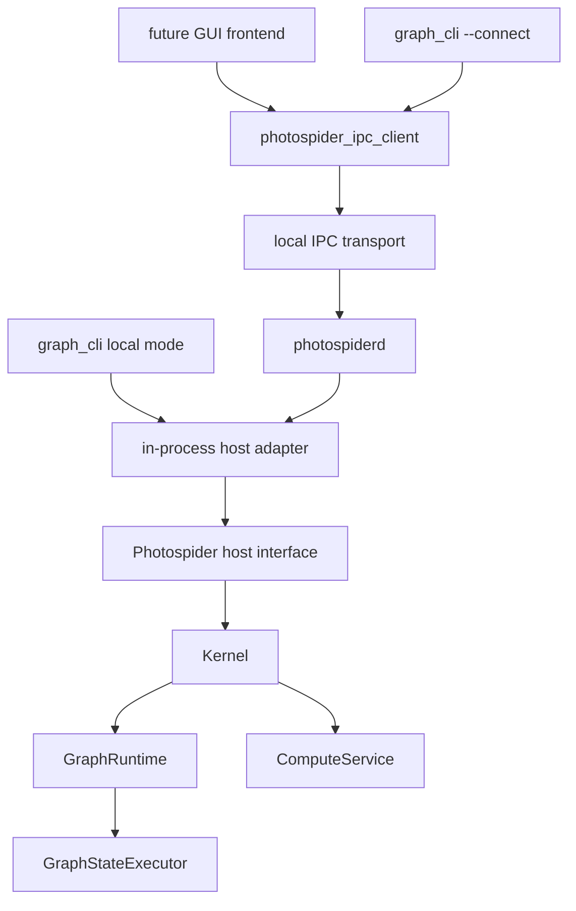

# Codebase Structure Direction

This document records Photospider's current public header/Host seam, static
product, role-owned source layout, implemented version 1 daemon/IPC slice, and
remaining internal-target direction. Current-state claims and future work are
distinguished explicitly below.

The goals are:

- `libphotospider` is the stable static-link target for embedded frontends.
- `photospiderd` runs as a foreground local daemon that owns graph sessions
  through one embedded `ps::Host`.
- `graph_cli` remains the basic interactive command-line frontend.
- Frontends can either link `libphotospider` in-process or use the typed client
  to talk to
  `photospiderd` through IPC.

## Current Friction

The current repository now has the public Host seam, installable static
product, migrated CLI application tree, role-owned backend source tree,
explicit production-plugin homes, unit/integration test ownership, and the
macOS/Linux version 1 daemon/IPC graph, inspection, polling-compute, protected
image-output, bounded event/trace observation, and process-global operation-
plugin router behavior. The installed typed IPC Client currently exposes the
eight-method subset, scheduler-control routes are unavailable, and the plugin
SDK follows the extension contracts documented below.

Observed build targets in the current root `CMakeLists.txt`:

| Current target | Current role | Friction |
| --- | --- | --- |
| `photospider_core_types` | Build-only static core data and operation-registry helper. | Its role-owned sources are also folded into the static product; target decomposition is separate from the completed physical move. |
| `photospider_graph` | Build-only static `GraphModel` and graph-services helper. | `GraphModel` is private under `src/lib/graph`, but these sources are also folded into the product. |
| `photospider_plugin` | Build-only static plugin manager and loader helper. | It is not exported; the transitional plugin SDK still uses legacy top-level source-tree headers. |
| `photospider_compute` | Build-only static compute, runtime, scheduler, and interaction helper. | Its implementation is physically role-owned, while later target decomposition may narrow link ownership. |
| `photospider` | Static installable backend product with archive name `libphotospider`. | Matches the desired static product and public Host shape while folding role-owned backend sources into one archive. |
| `photospider_cli_common` | Static CLI command/TUI/autocomplete code plus the reusable `run_graph_cli` boundary under `apps/graph_cli/`. | Uses application-private headers and remains a non-installable helper. |
| `graph_cli` | Process-policy-only entry point at `apps/graph_cli/main.cpp`. | Disables OpenCL, owns allocation-independent fatal exit policy, creates the embedded `Host` adapter, and has no daemon-client mode yet. |
| `photospider_ipc_client` | Installable static typed Unix IPC client. | Implements only the eight version 1 graph/inspection methods; it does not link the backend or expose JSON/POSIX types. |
| `photospider_ipc_server_internal` | Non-installable router, registry, and bounded Unix listener. | Serializes every Host call and intentionally remains outside the package export. |
| `photospiderd` | Installed foreground process shell under `apps/photospiderd/`. | Owns one embedded Host, self-pipe signal policy, protected socket, and deterministic cleanup. |

Remaining and recently resolved interface leaks:

- The former `include/graph_model.hpp` has moved to
  `src/lib/graph/graph_model.hpp`;
  graph model state, dirty-region snapshots, planner summaries, full task graph
  cache handles, and runtime generation state are now internal to the private
  include root.
- The internal `Kernel` and `InteractionService` facades now live under
  `src/lib/runtime/`. They include runtime, compute service, graph services, plugin
  manager, and dirty-control-lane implementation types, so they are not
  supported headers for linked consumers of `photospider`; repository
  targets that still include them must receive the private `src/lib/` include
  root.
  `ps::Host` is already the only supported frontend public seam. The embedded
  Host adapter translates `ps::HostComputeRequest` into the internal
  `Kernel::ComputeRequest` and then delegates through
  `InteractionService`/`Kernel`. Later phases preserve this ownership while
  changing internal targets or adding daemon/IPC adapters; they do not
  introduce a second frontend facade.
- `include/plugin_api.hpp` includes full `Node`, exposing node runtime/cache
  state to operation plugins instead of a smaller plugin contract. Issue #33
  narrows the registration path with `OperationPluginRegistrar`, but a future
  public plugin contract still needs a smaller node view.
- Benchmark and implementation-private backend headers now live with their
  owning roles under `src/lib/**`; CLI headers live in the application-private
  `apps/graph_cli/include/graph_cli/` tree. Exactly eight transitional
  source-tree extension headers remain for issue #38:
  `include/{plugin_api,node,ps_types,image_buffer}.hpp`,
  `include/adapter/buffer_adapter_opencv.hpp`, and
  `include/kernel/scheduler/{i_scheduler,scheduler_task_runtime,scheduler_plugin_api}.hpp`.
  They are build-only compatibility contracts, not installed Host headers.

Resolved seam tightening in the current branch:

- The former direct graph-state submission and runtime access escape hatches
  have been removed from the frontend contract. `Kernel` and
  `InteractionService` are internal facades, while tests that still need runtime
  or graph-state access explicitly include the internal-only
  `tests/support/kernel_test_access.hpp` helper and route those calls through
  `ps::testing::KernelTestAccess`.
- Graph, compute, runtime, Host, plugin, scheduler, benchmark, and adapter
  implementation files and private headers now live under role-owned
  `src/lib/**` directories. Internal targets compile with the private
  `src/lib/` root, while the installable public header inventory remains
  limited to `include/photospider/**`.
- Dirty-region diagnostics, compute planning diagnostics, and scheduler trace
  diagnostics are available through copied Host value snapshots. Public headers
  no longer need to name the backend graph/runtime/service/planning types or
  concrete scheduler classes to expose those diagnostics.
- The complete configured CLI closure now lives under `apps/graph_cli/`:
  `main.cpp`, private headers, implementation sources, command help resources,
  root configuration code, REPL/TUI, autocomplete, and terminal helpers. The
  old top-level CLI homes are not compatibility surfaces.
- Repository-owned operation and scheduler plugins now live under
  `plugins/ops/` and `plugins/schedulers/`; test-only DSOs remain fixtures.
  Maintained test translation units are classified under `tests/unit/` and
  `tests/integration/`, with explicit fixture, support, and manual-verification
  roles. Obsolete issue replay/result orchestration has been removed.

## External Interface Rule

The external seam should be:

```text
external frontend
  -> public ps::Host (the only frontend seam)
      -> embedded Host adapter
          -> internal InteractionService / Kernel boundary
              -> GraphRuntime / GraphModel / ComputeService implementation
```

External code should not include or name these implementation concepts:

- `GraphModel`
- `GraphRuntime`
- `GraphStateExecutor`
- `ComputeService`
- `DirtyControlLane`
- `ComputePlan`
- `FullTaskGraph`
- concrete scheduler classes such as `CpuWorkStealingScheduler`
- graph cache/traversal/io service classes

External code may depend on stable value contracts:

- graph/session identifiers
- compute request options
- error/result values
- graph and node inspection snapshots
- scheduler status and trace snapshots
- dirty-region inspection views
- image and tile buffer contracts
- plugin operation registration contracts

This keeps `InteractionService` as a deeper backend module behind the public
`ps::Host` seam: frontends get graph lifecycle, compute, inspection, events,
scheduler configuration, and plugin control without learning the implementation
topology behind them.

## Target Public Headers

Only install headers under `include/photospider/`. The eight source-tree
extension headers listed above remain only as explicit issue-#38 exceptions;
they are original contracts, not compatibility wrappers or duplicated
old/new surfaces. Other private headers follow complete-correction renames.

Target layout:

```text
include/photospider/core/
  image_buffer.hpp
  graph_error.hpp
  compute_intent.hpp
  result_types.hpp
  inspection_types.hpp

include/photospider/host/
  host.hpp
  graph_session.hpp
  compute_request.hpp
  event_stream.hpp

include/photospider/plugin/
  plugin_api.hpp
  op_registry.hpp
  op_contract.hpp
  node_view.hpp

include/photospider/scheduler/
  scheduler.hpp
  scheduler_task_runtime.hpp
  scheduler_plugin_api.hpp

include/photospider/ipc/
  client.hpp
  protocol.hpp
```

Header rules:

- Public headers must not include files from `src/`.
- Public headers must not include `kernel/services/...`.
- Public headers must not expose mutable implementation state owned by
  `GraphModel`, `GraphRuntime`, or `ComputeService`.
- Public headers should prefer value objects, opaque handles, small references,
  and request/result structs.
- OpenCV and yaml-cpp should be limited to contracts that truly require them.
  `ImageBuffer` may remain a public contract. YAML node parsing should not be
  required by host/IPC clients unless a method explicitly accepts YAML text.
- CLI, benchmark, and test-only headers are not public install headers.

## Current and Target Source Layout

The source tree should make ownership visible before reading a single file:

```text
include/photospider/
  core/
  host/
  plugin/
  scheduler/
  ipc/

src/lib/
  core/
  graph/
  compute/
  runtime/
  host/
  plugin/
  scheduler/
  benchmark/
  adapters/
    opencv/
    metal/
  ipc/

apps/
  graph_cli/
    main.cpp
    include/graph_cli/
    src/
      autocomplete/
      command/
    resources/help/
  photospiderd/

plugins/
  ops/
  schedulers/

tests/
  unit/
  integration/
  fixtures/
  support/
  verification/
```

All existing backend, plugin, maintained test, and version 1 IPC code now uses
this layout. Issue #36 created `src/lib/ipc/`, `include/photospider/ipc/`, and
`apps/photospiderd/` together with real daemon behavior. Issue #38 owns the
final `include/photospider/{plugin,scheduler}/` contracts and removal of the
eight transitional extension headers; this physical move does not add a shim
or duplicate them.

Naming rules:

- Directories, files, CMake targets, and free functions use `snake_case`.
- Types use `PascalCase`.
- Methods and fields use `snake_case`.
- Public target names use the product name directly, such as `photospider` or
  `libphotospider`; helper targets use role names such as
  `photospider_graph_internal`.
- Concrete implementations should not use vague suffixes such as `_module` when
  a domain name exists.

## Build Target Shape

Recommended final targets:

| Target | Kind | Installs? | Role |
| --- | --- | --- | --- |
| `photospider_core_internal` | Static | No | Core values, image buffer, graph errors, low-level helpers. |
| `photospider_graph_internal` | Static | No | `GraphModel`, graph IO, traversal, cache, inspection implementation. |
| `photospider_compute_internal` | Static | No | Compute planning, dirty-region state, dispatcher, scheduler interaction. |
| `photospider_plugin_host_internal` | Static | No | Host-side dynamic plugin loading and lifetime ownership. |
| `photospider_operation_plugin_shim` | Shared | Optional | Narrow runtime helper boundary for dynamic operation callback code, currently `ImageBuffer`/OpenCV adapter helpers with no registry state. |
| `photospider_scheduler_internal` | Static | No | Built-in scheduler implementations and factory. |
| `photospider` / `libphotospider` | Static | Yes | Public static library for in-process frontends. |
| `photospider_ipc_client` | Static | Yes | Client-side IPC adapter for daemon frontends. |
| `photospider_cli_common` | Static | No | CLI command parser, REPL, TUI, autocomplete. |
| `graph_cli` | Executable | Yes | Basic interactive frontend. |
| `photospider_ipc_server_internal` | Static | No | Version 1 router, session/admission registry, joined compute-request registry, protected listener, and worker lifecycle. |
| `photospiderd` | Executable | Yes | Foreground daemon that owns one embedded `ps::Host` and the IPC server. |
| operation plugins | Shared | Optional | Dynamically loaded operation extensions. |
| scheduler plugins | Shared | Optional | Dynamically loaded scheduler extensions. |

Target dependency direction:

```mermaid
graph TD
    public_headers["include/photospider/*"] --> libphotospider["libphotospider STATIC"]
    core["photospider_core_internal"] --> libphotospider
    graph["photospider_graph_internal"] --> libphotospider
    compute["photospider_compute_internal"] --> libphotospider
    plugin_host["photospider_plugin_host_internal"] --> libphotospider
    scheduler["photospider_scheduler_internal"] --> libphotospider
    ipc_client["photospider_ipc_client STATIC"] --> future_frontend["future daemon frontend"]
    libphotospider --> graph_cli
    libphotospider --> photospiderd
    ipc_server["daemon IPC server implementation"] --> photospiderd
```

CMake rules:

- Internal targets may use `src/lib/` as a `PRIVATE` include root.
- Installable targets expose only `include/photospider`.
- The installation boundary copies headers only from
  `include/photospider/**`. Implementation headers under `src/lib/` are
  excluded from the installed package, and the `photospider` product keeps
  `src/lib/` as a private include root.
- The install/export configuration makes `photospider` the installable
  `STATIC` target, installs only `include/photospider/**`, and exports
  `Photospider::photospider` through `PhotospiderConfig.cmake`. The archive is
  named `libphotospider.a` on Unix-like toolchains and `photospider.lib` with
  MSVC.
- Build-tree consumers of `photospider` receive a generated public include root
  containing only `photospider/` forwarding headers. The source-tree
  `include/photospider/**` inventory is tracked with `CONFIGURE_DEPENDS`, so
  additions and removals regenerate the forwarding tree without requiring
  symbolic-link privileges; header content is read directly from the live
  source file. The source-tree `include/` and `src/lib/` roots remain private
  implementation include paths for repository targets while the eight
  transitional extension headers await issue #38.
- The static product archive folds the product implementation sources directly
  into `photospider`. Repository-only static helper modules remain available
  for local build organization but are not exported to package consumers.
- A shared library can be added later as an explicit compatibility product, not
  as the primary backend.
- Current phase-7 operation plugins export `register_photospider_ops_v1` and
  receive `OperationPluginRegistrar` from the host. They do not link
  `photospider` merely to share `OpRegistry`; standard operation plugins
  link `photospider_operation_plugin_shim` only for narrow runtime helper
  symbols used by plugin callback code.
- OpenCV (`core`, `imgproc`, `imgcodecs`, `videoio`), `yaml-cpp`, and `Threads`
  are link-only implementation dependencies for the static archive. The
  installed `Photospider::photospider` target records them as
  `$<LINK_ONLY:...>` entries in `INTERFACE_LINK_LIBRARIES`.
  `PhotospiderConfig.cmake` finds them so embedded consumers can link the
  exported target, but public Host/core headers do not require OpenCV or
  `yaml-cpp` types. `${CMAKE_DL_LIBS}` adds the platform dynamic-loader library
  only where CMake requires one.
- On Apple, the static product carries system `Metal` and `Foundation` framework
  link flags for Objective-C++ runtime sources. Metal operation plugins and
  their `CoreImage`/`CoreVideo` dependencies remain optional runtime plugin
  artifacts rather than public package requirements.
- On Windows, the exported target propagates `PHOTOSPIDER_STATIC`, so public
  declarations do not acquire DLL import/export annotations when consumers link
  the `.lib` archive. Dynamic operation-plugin exports remain governed by
  `PLUGIN_API` and are separate from the static product boundary.
- FTXUI and `photospider_cli_common` are CLI-only dependencies and are not part
  of the embedded package export. Operation plugin shim libraries, operation
  plugins, and scheduler plugins remain runtime extension artifacts rather than
  dependencies of `Photospider::photospider`.
- `apps/graph_cli/include/graph_cli/**` is a private application include tree.
  CMake exposes it only to `photospider_cli_common`, `graph_cli`, and focused
  CLI tests; install rules continue to copy only `include/photospider/**`.
- `graph_cli` currently links only `libphotospider` and remains local/embedded;
  remote CLI mode is later work.
- `photospiderd` links `libphotospider` plus the non-installed IPC server and
  owns one embedded `ps::Host`. The installed client target contains its codec
  objects directly and exports no dependency on the backend, JSON target, or
  server-internal target.
- Operation plugins should not link to a broad shared backend merely to reach
  registry symbols. The current implementation uses host-provided
  `OperationPluginRegistrar` callbacks and the versioned
  `register_photospider_ops_v1` entry; long term, plugins should move from
  this C++ callback table to a pure C ABI or opaque handles. Scheduler plugin
  ABI cleanup remains a separate compatibility change.

## Daemon Shape

`photospiderd` is an executable with a small process shell and a deep Host-only
server module behind it.

Process responsibilities:

- create and own one embedded `ps::Host`
- expose ping/version, graph load/close/list, and graph/node/dependency-tree
  inspection through the installed typed version 1 client
- accept the documented typed graph reload/save/clear, node YAML, node-list,
  cache, dirty lifecycle, ROI, timing, last-IO, and last-error requests and
  route each through exactly one matching Host call
- own bounded polling compute jobs and materialize successful nonempty image
  results as protected metadata-only artifacts with stable delivery leases
- route bounded destructive compute-event drains and non-destructive scheduler
  trace pages directly through the matching Host observation APIs
- enforce per-user directory/socket permissions and safe live/stale handling
- translate SIGINT/SIGTERM through a self-pipe and perform deterministic worker,
  session, Host, and socket cleanup
- remain foreground-only, without a protocol shutdown method, pid file, TCP
  listener, or daemonizing fork

It should not duplicate graph or compute logic. All graph-state operations still
flow through the same host interface used by in-process frontends.

Recommended runtime diagram:



The important seam is the host interface, not the transport. If the in-process
adapter and IPC adapter both satisfy the same frontend-facing interface, then
frontends can choose local embedding or daemon mode without learning different
graph and compute semantics.

## IPC Protocol Direction

The exact maintained version 1 wire, typed client, opaque-session, socket, and
shutdown contract is `IPC-Protocol-v1.md`; this section places that implemented
slice in the longer migration direction.

Implemented version 1 transport:

- Unix domain socket on macOS/Linux.
- IPC is disabled outside macOS/Linux; named pipes remain later Windows work.
- No remote TCP listener by default.
- Socket path is per-user under a valid `$XDG_RUNTIME_DIR`, otherwise under
  `/tmp/photospider-<uid>`.
- Daemon-created directories are `0700`; the socket is `0600`.
- A persistent mode-`0600` `${socket}.lock` is opened without following
  symlinks and held with nonblocking exclusive `flock` from stale-path
  inspection through exact socket cleanup; the lock inode is never removed.

Implemented version 1 protocol:

- Four-byte big-endian bounded length followed by UTF-8 JSON object text.
- Every request has required integer `protocol_version`, nonempty bounded id,
  method name, and params object; duplicate keys are rejected.
- Every response has the same id, either a result object or an error object.
- Notifications can be added for event streams after request/response methods
  are stable.

Avoid newline-delimited JSON for long-term protocol framing because logs,
multi-line diagnostics, and future binary metadata make framing ambiguous.
Avoid gRPC as the first step unless the project intentionally accepts generated
code, a larger dependency surface, and a more complex plugin/build story.

Method groups and current wire availability:

| Group | Example methods | Notes |
| --- | --- | --- |
| daemon | `daemon.ping`, `daemon.version` | Implemented without Host locking. `daemon.version.methods` returns the exact eight-name metadata subset; the installed typed Client exposes only that subset and has no raw-JSON call. |
| graph | `graph.load`, `graph.close`, `graph.list`, `graph.reload`, `graph.save`, `graph.clear`, `graph.node_yaml.get`, `graph.node_yaml.set` | Implemented through Host. Status-only mutations use `result:{}`; clearing model state preserves the opaque session mapping. |
| inspect | `inspect.graph`, `inspect.node`, `inspect.dependency_tree`, `inspect.node_ids`, `inspect.ending_nodes`, `inspect.roi_forward`, `inspect.roi_backward`, `inspect.dirty_region`, `inspect.compute_planning`, `inspect.recent_compute_planning`, `inspect.traversal_orders`, `inspect.traversal_details`, `inspect.trees_containing_node` | Implemented through copied Host values. Full-value collections use stable bounded cursor pages; node/ROI/dirty/current-planning values remain indivisible direct results. Host order and duplicates are preserved. |
| dirty | `dirty.begin`, `dirty.update`, `dirty.end` | Implemented through one matching Host lifecycle mutation and return the copied dirty-region snapshot; the complete compact response size is preflighted before result-DOM allocation. |
| cache | `cache.clear_all`, `cache.clear_drive`, `cache.clear_memory`, `cache.cache_all_nodes`, `cache.free_transient`, `cache.synchronize_disk` | Implemented as status-only Host calls; no backend cache handle or path enters a result. |
| compute | `compute.submit`, `compute.status`, `compute.result`, `compute.release`, `compute.timing`, `compute.last_io_time`, `compute.last_error` | Polling jobs and diagnostics are routed. Submit/status/result use stable `{compute_id,session_id,state,cancellable,status,output}` values. Submit, status, status-mode result, empty-image result, and failed result keep `output` null. A terminal nonempty image result revalidates the protected artifact, refreshes one stable 60-second delivery lease, and returns the specified metadata object. Terminal release atomically returns `{compute_id,released:true}`, accepts an optional exact `delivery_id`, and can release its matching orphaned lease after normal job removal. Timing preflights its aggregate compact response size; last error is nested diagnostic data. |
| scheduler | `scheduler.trace` plus scheduler control names | Bounded trace paging is routed through Host. Scheduler control is unavailable. The current exact eight-name `daemon.version.methods` subset does not advertise these names. |
| plugins | `plugins.load_report`, `plugins.unload_all`, `plugins.seed_builtins`, `plugins.ops_sources`, `plugins.ops_combined_keys`, `plugins.ops_combined_sources` | Implemented only through matching Host calls. Control is process-global, views are key-sorted stable cursor snapshots, and client disconnect or Host-adapter destruction does not unload a successful DSO. The current exact eight-name `daemon.version.methods` subset does not advertise these names. |
| events | `events.drain` | Bounded destructive event draining is routed through Host. The current exact eight-name `daemon.version.methods` subset does not advertise this name. |

Image payload rule:

- Image bytes do not enter JSON.
- The private OutputStore materializes validated CPU images as exact tight-row
  mode-`0600` artifacts below a same-owner mode-`0700`
  `<socket>.outputs/instance-<server_instance_id>` directory. Publication is
  quota-bounded and atomic; live access and cleanup revalidate filesystem
  identity without following symlinks.
- The private compute registry retains move-only OutputStore ownership whose
  exact-once cleanup runs outside the registry mutex on optional lease-aware
  release, eviction, TTL expiry, or shutdown. A stable delivery id protects at
  most one refreshed 60-second lease after each successful image result.
- Submit/status and non-image, empty-image, or failed results keep the stable
  nullable `output` field null. A terminal nonempty image result returns only
  `output_id`, `delivery_id`, the protected absolute artifact path, width,
  height, channels, data type, CPU device, tight row step, byte size,
  filesystem device, and inode. The registry's opaque reference appears only
  as that normalized `output_id`; no extra `output_reference` field, backend
  handle, pixel bytes, backend cache path, image-library object, or
  caller-selected result path enters JSON.
- `compute.release` validates an optional stable delivery id before mutation.
  A matching id releases job ownership and the lease together; if normal job
  release, terminal eviction, or job TTL already removed the record, the same
  `(compute_id, delivery_id)` may still release the surviving orphan lease.

Collection snapshot rule:

- The router owns one private type-erased `CollectionSnapshotRegistry`; it does
  not add a Host page API, public ABI type, separate page route, or cursor
  release method. Runtime start enables registry admission, shutdown begins by
  stopping admission, and final shutdown clears its records and reservations.
- The private admission API reserves one slot plus 64 MiB. Production retains
  at most 64 records/256 MiB. Publication accepts a caller-measured value of at
  most 262,144 recursive public entries/64 MiB, moves a multi-page value into
  stable storage, and converts the worst-case reservation to exact measured
  bytes. Recursive entries include outer vector/map rows, node parameter maps,
  present spatial matrices, dependency roots/entries and nested nodes,
  traversal branch vectors, and planning sample/dependency vectors. Scalar
  object members do not count. The registry retains the actual top-level row
  count separately and rejects an under-reported recursive count. Rejection
  publishes no cursor or retained copy.
- After one Host call, dependency and traversal values are recursively
  pre-scanned before shared-header/root copies or map-to-vector allocation.
  Dependency byte accounting replaces the header's empty `entries: []` token
  with the exact measured entries array, so the array is counted once.
- A first request uses optional `limit`; a continuation invokes the same method
  with its frozen typed parameters plus `cursor`, exact next `offset`, and
  `limit`. Results retain their collection field and add
  `offset`/`has_more`/nullable `cursor`. A 32-hex cursor freezes exact
  method/session/original-parameter identity. Continuations use retained value
  only, require no live-session lookup, survive graph close, never refresh
  their 15-minute TTL, and atomically release the record on the final page.
- Row-by-row measurement computes and freezes a dynamic page ceiling whose
  every contiguous page fits the 16 MiB frame, including worst-case legal id
  escaping and page metadata. One indivisible oversize row is rejected before
  cursor publication; small values that fit remain complete single pages.
- Binding/type/offset mismatches and unknown well-formed cursors return
  private `CursorNotFound` without advancing a retained record. Malformed
  cursor/page arithmetic returns private `InvalidParams` without changing the
  record. TTL expiry erases the record and releases its measured quota.
  Injected limits, clock, and ids support deterministic race tests. Graph
  listing, node lists, graph/tree inspection, traversal branches, tree
  membership, and recent planning history reserve and page these records.

Error rule:

- Transport errors describe IPC failure.
- Host errors describe graph/load/compute/plugin/scheduler failures.
- Graph errors should carry stable error codes aligned with `GraphErrc`.
- Methods should not require clients to parse human-readable strings to decide
  behavior.

Concurrency rule:

- The daemon accepts at most 32 tracked client workers.
- Because Host does not promise thread safety, every Host call uses one
  daemon-owned mutex; socket IO never holds it.
- Ping/version and protocol validation do not acquire the Host mutex.
- A compute job is noncancellable, runs through the sole joined FIFO worker,
  and invokes exactly one matching synchronous Host compute call.
- Session close marks the row closing before it waits admitted Host calls and
  queued/running jobs; only then may it acquire the Host mutex.
- Process shutdown stops session/compute admission and new delivery leases,
  drains and joins compute, releases terminal job ownership, waits active
  leases to release or expire, and only then closes Host sessions.

## Migration State and Remaining Order

Frontend-boundary and existing physical-layout steps 1-5 are present in the
current repository. The remaining frontend migration adds daemon/IPC adapters
without changing `ps::Host` as the sole public seam. Plugin SDK tightening is a
separate extension-boundary change.

1. **Completed:** Establish public-header installation and self-containment
   boundaries.
   - Install only headers under `include/photospider/**`; implementation
     headers under `src/lib/` remain outside the package.
   - `PublicHeaderSelfContainment` builds the
     `public_header_self_containment` target through CTest. CMake generates one
     translation unit per header under `include/photospider/`, and the target
     compiles each header independently through the public include root with
     C++17.
   - `include/photospider/public_boundary.hpp` remains a marker header for the
     installable include root. Stable value contracts live under
     `include/photospider/core/`.
2. **Completed:** Introduce `include/photospider/*`.
   - Move stable value contracts first: errors, result/status values,
     compute intent, OpenCV-free image/tile buffer values, and inspection
     snapshots.
   - Keep `GraphModel`, `GraphRuntime`, and compute planning headers internal.
3. **Completed:** Create the host interface.
   - Keep `InteractionService` behind the stable public `ps::Host` module.
   - Remove external escape hatches such as raw `Kernel&`, `GraphRuntime&`, and
     templated `GraphModel&` submission from public headers.
4. **Completed:** Rename build output.
   - Make the installable static target `photospider`/`libphotospider`.
   - Keep internal static modules private.
5. **Completed for existing code:** Split application, backend, plugin, and
   test ownership.
   - The complete `graph_cli`/`photospider_cli_common` source, private-header,
     configuration, and resource closure now lives under `apps/graph_cli/`.
   - Existing backend implementation/private headers live under role-owned
     `src/lib/**`; production plugins live under `plugins/**`; maintained tests
     live under explicit unit/integration/fixture/support/verification roles.
   - Physical movement preserves existing target and test identity. Internal
     target renames or redesign are not implied.
6. **Completed daemon slice:** `apps/photospiderd/` now owns foreground process,
   self-pipe signal, protected socket, bounded workers, and deterministic
   cleanup behavior.
7. **In-progress IPC version 1 complete-Host slice:** The installable typed
   client still exposes the original bounded graph/inspection subset. The
   non-installed server additionally implements graph mutation, remaining
   inspection, polling compute, protected metadata-only image results with
   stable delivery leases, bounded destructive compute events, and bounded
   non-destructive scheduler traces. Process-global operation-plugin control,
   exact reports, builtin seeding, and sorted stable views are also routed
   through Host. Scheduler-control routes and a complete installed IPC Host are
   unavailable; cancellation is also unavailable.
8. **Separate plugin-boundary work:** Tighten plugin SDK in issue #38.
   - Replace direct plugin dependency on full `Node` and global registry symbols
     with a narrow operation contract and host-provided registration table.

## Verification Expectations

For any implementation change following this document:

- Match local validation to the changed boundary: use scoped static checks,
  affected build targets, and focused regressions during implementation. A
  local full build or complete CTest/JUnit pass is not a standing requirement.
  GitHub Actions is the remote integration environment; do not add Docker or
  local `linux/amd64` emulation as a routine preflight.
- Build `photospider_ipc_client`, `photospider_ipc_server_internal`,
  `photospiderd`, and focused IPC tests when the daemon boundary changes;
  `graph_cli` remains an embedded/local regression target.
- For static package work, keep the package consumer smoke test in CTest because
  it executes the real producer build/install, external find-package,
  public-header compile/link/run, installed export/dependency, platform, and
  multi-configuration boundaries. It evaluates those invariants in memory,
  streams commands and failure details to stdout/stderr for CTest to capture,
  and uses only transient install and consumer work directories below the build
  tree. It does not produce expected/actual/compare/summary reports and must not
  depend on Git identity, patch hashes, replay, provenance, or migration
  completion.
- Keep `PublicHeaderSelfContainment` in CTest as a long-lived compile-boundary
  check. It generates one translation unit per installable public header and
  compiles each through the public include root with C++17, failing when a
  header cannot compile independently.
- Treat CMake 3.16 as a compatibility floor, not a fixed version gate for every
  pull request. Guard newer policies, rely on the current CI package consumer,
  and run a targeted native old-version producer/install/consumer path only for
  a compatibility-sensitive change or release check. Do not substitute
  architecture emulation for a native runtime.
- Migration residue, phase completion, stale-term, and source-layout checks are
  temporary development checks, not software behavior tests. Do not register
  them with CTest or CI, and do not retain their issue-specific orchestration in
  the primary repository.
- Derive CLI catch-order and Doxygen audit inputs from the real CMake target
  closure and compilation database or CMake File API. The audit fails closed if
  a source in `photospider_cli_common` or `graph_cli`, including root
  translation units such as `apps/graph_cli/src/cli_config.cpp`,
  `apps/graph_cli/src/run_graph_cli.cpp`, and `apps/graph_cli/main.cpp`, is
  omitted or cannot be matched to a compile command.
  This Doxygen/source-quality audit is a documented manual tool and is not a
  CTest or CI entry.
- Maintain the real-process IPC integration test that starts `photospiderd`
  and exercises the public typed client plus malformed raw frames.
- Keep the non-installed `ipc_output_fixture_daemon` only as a dependency of
  that integration test, not as its own CTest entry. It runs the real internal
  Server/router/OutputStore/Unix-socket/worker stack in a separate process with
  a deterministic test Host, so protected image delivery, bounded observation
  multiclient behavior, and restart cleanup are covered without changing
  `photospiderd` startup or seeding plugins in the fixture. The real product
  daemon test separately loads the repository lifecycle operation DSO through
  the Host-only plugin routes and checks cross-client visibility. Its
  fixture-only CLI accepts a protected fixed-width
  monotonic-clock control file and supplies the private internal Server overload
  with small existing snapshot/job/output limits, clocks, and id generators;
  none of those controls belong to `photospiderd`, its environment, or the wire.
- For daemon lifecycle changes, cover startup, graph load, compute or
  inspection, client disconnect, signal shutdown, and socket cleanup behavior.

## Open Decisions

This decision remains for a later protocol slice:
- Whether `graph_cli` should default to local in-process mode forever, or should
  auto-connect to `photospiderd` when a daemon socket exists.

## Reference Repositories

The style direction follows these broad practices from mature C/C++ projects:

- LLVM keeps coding conventions and interface expectations explicit:
  <https://llvm.org/docs/CodingStandards.html>
- FFmpeg separates libraries, tools, and developer-facing contracts:
  <https://ffmpeg.org/developer.html>
- Krita separates application shells, plugins, and core libraries while keeping
  C++ conventions documented:
  <https://docs.krita.org/en/untranslatable_pages/intro_hacking_krita.html>
