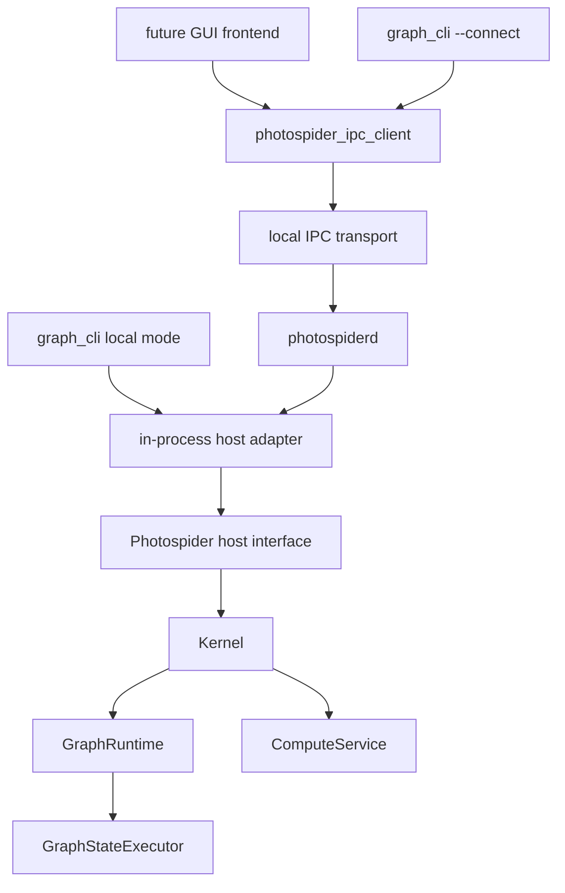

# Codebase Structure Direction

This document records Photospider's current public header/Host seam and static
product together with the remaining source layout, internal-target, and
daemon/IPC direction. Current-state claims and future work are distinguished
explicitly below.

The goals are:

- `libphotospider` is the stable static-link target for embedded frontends.
- `photospiderd` can run as a background daemon that owns graph runtimes.
- `graph_cli` remains the basic interactive command-line frontend.
- Future frontends can either link `libphotospider` in-process or talk to
  `photospiderd` through IPC.

## Current Friction

The current repository now has the public Host seam and installable static
product, while its source/application layout and transitional plugin SDK still
need later migration phases.

Observed build targets in the current root `CMakeLists.txt`:

| Current target | Current role | Friction |
| --- | --- | --- |
| `photospider_core_types` | Build-only static core data and operation-registry helper. | Its implementation sources are also folded into the static product until the later source-layout split. |
| `photospider_graph` | Build-only static `GraphModel` and graph-services helper. | `GraphModel` is private now, but the helper's implementation sources are also folded into the product. |
| `photospider_plugin` | Build-only static plugin manager and loader helper. | It is not exported; the transitional plugin SDK still uses legacy top-level source-tree headers. |
| `photospider_compute` | Build-only static compute, runtime, scheduler, and interaction helper. | Compute-planning headers are private now, but its implementation sources are also folded into the product. |
| `photospider` | Static installable backend product with archive name `libphotospider`. | Now matches the desired static product shape, but still folds legacy backend internals behind the public Host seam until later source-layout splits land. |
| `photospider_cli_common` | Static CLI command/TUI/autocomplete code plus the reusable `run_graph_cli` boundary. | Uses repository-only CLI headers and remains a non-installable application helper. |
| `graph_cli` | Process-policy-only CLI executable entry point. | Disables OpenCL, owns allocation-independent fatal exit policy, creates the embedded `Host` adapter, and has no daemon-client mode yet. |

Remaining and recently resolved interface leaks:

- The former `include/graph_model.hpp` has moved to `src/graph_model.hpp`;
  graph model state, dirty-region snapshots, planner summaries, full task graph
  cache handles, and runtime generation state are now internal to the private
  include root.
- The legacy internal `Kernel` and `InteractionService` facades now live under
  `src/kernel/`. They include runtime, compute service, graph services, plugin
  manager, and dirty-control-lane implementation types, so they are not
  supported headers for linked consumers of `photospider`; repository
  targets that still include them must receive the private `src/` include root.
  `ps::Host` is already the only supported frontend public seam. The embedded
  Host adapter translates `ps::HostComputeRequest` into the internal
  `Kernel::ComputeRequest` and then delegates through
  `InteractionService`/`Kernel`. Later phases preserve this ownership while
  changing directories/internal targets or adding daemon/IPC adapters; they do
  not introduce a second frontend facade.
- `include/plugin_api.hpp` includes full `Node`, exposing node runtime/cache
  state to operation plugins instead of a smaller plugin contract. Issue #33
  narrows the registration path with `OperationPluginRegistrar`, but a future
  public plugin contract still needs a smaller node view.
- Legacy CLI and benchmark headers still live under the source-tree `include/`
  root. The targeted install rule excludes them now, but the later application
  layout phase must still move them out of the legacy include tree.

Resolved seam tightening in the current branch:

- The former direct graph-state submission and runtime access escape hatches
  have been removed from the frontend contract. `Kernel` and
  `InteractionService` are internal facades, while tests that still need runtime
  or graph-state access explicitly include the internal-only
  `tests/support/kernel_test_access.hpp` helper and route those calls through
  `ps::testing::KernelTestAccess`.
- The phase-3 internal-header pass moves the graph model, graph runtime,
  graph-state executor, compute service, dirty-control lane, and built-in
  concrete scheduler headers out of `include/` and into the private `src/`
  include root. Internal targets still compile with that private root, while
  the installable public header inventory remains limited to
  `include/photospider/**`.
- Dirty-region diagnostics, compute planning diagnostics, and scheduler trace
  diagnostics are available through copied Host value snapshots. Public headers
  no longer need to name the backend graph/runtime/service/planning types or
  concrete scheduler classes to expose those diagnostics.

## External Interface Rule

The external seam should be:

```text
external frontend
  -> public ps::Host (the only frontend seam)
      -> embedded Host adapter
          -> internal InteractionService / Kernel boundary
              -> GraphRuntime / GraphModel / ComputeService implementation
```

External code should not include or name these implementation concepts:

- `GraphModel`
- `GraphRuntime`
- `GraphStateExecutor`
- `ComputeService`
- `DirtyControlLane`
- `ComputePlan`
- `FullTaskGraph`
- concrete scheduler classes such as `CpuWorkStealingScheduler`
- graph cache/traversal/io service classes

External code may depend on stable value contracts:

- graph/session identifiers
- compute request options
- error/result values
- graph and node inspection snapshots
- scheduler status and trace snapshots
- dirty-region inspection views
- image and tile buffer contracts
- plugin operation registration contracts

This keeps `InteractionService` as a deeper backend module behind the public
`ps::Host` seam: frontends get graph lifecycle, compute, inspection, events,
scheduler configuration, and plugin control without learning the implementation
topology behind them.

## Target Public Headers

Only install headers under `include/photospider/`. Legacy top-level headers can
remain during migration only if the migration explicitly allows compatibility
wrappers; the repository's current rename discipline otherwise prefers complete
corrections.

Target layout:

```text
include/photospider/core/
  image_buffer.hpp
  graph_error.hpp
  compute_intent.hpp
  result_types.hpp
  inspection_types.hpp

include/photospider/host/
  host.hpp
  graph_session.hpp
  compute_request.hpp
  event_stream.hpp

include/photospider/plugin/
  plugin_api.hpp
  op_registry.hpp
  op_contract.hpp
  node_view.hpp

include/photospider/scheduler/
  scheduler.hpp
  scheduler_task_runtime.hpp
  scheduler_plugin_api.hpp

include/photospider/ipc/
  client.hpp
  protocol.hpp
```

Header rules:

- Public headers must not include files from `src/`.
- Public headers must not include `kernel/services/...`.
- Public headers must not expose mutable implementation state owned by
  `GraphModel`, `GraphRuntime`, or `ComputeService`.
- Public headers should prefer value objects, opaque handles, small references,
  and request/result structs.
- OpenCV and yaml-cpp should be limited to contracts that truly require them.
  `ImageBuffer` may remain a public contract. YAML node parsing should not be
  required by host/IPC clients unless a method explicitly accepts YAML text.
- CLI, benchmark, and test-only headers are not public install headers.

## Target Source Layout

The source tree should make ownership visible before reading a single file:

```text
include/photospider/
  core/
  host/
  plugin/
  scheduler/
  ipc/

src/lib/
  core/
  graph/
  compute/
  runtime/
  plugin/
  scheduler/
  adapters/
    opencv/
    metal/
  ipc/

apps/
  graph_cli/
  photospiderd/

plugins/
  ops/
  schedulers/

tests/
  unit/
  integration/
  evidence/
```

Naming rules:

- Directories, files, CMake targets, and free functions use `snake_case`.
- Types use `PascalCase`.
- Methods and fields use `snake_case`.
- Public target names use the product name directly, such as `photospider` or
  `libphotospider`; helper targets use role names such as
  `photospider_graph_internal`.
- Concrete implementations should not use vague suffixes such as `_module` when
  a domain name exists.

## Build Target Shape

Recommended final targets:

| Target | Kind | Installs? | Role |
| --- | --- | --- | --- |
| `photospider_core_internal` | Static | No | Core values, image buffer, graph errors, low-level helpers. |
| `photospider_graph_internal` | Static | No | `GraphModel`, graph IO, traversal, cache, inspection implementation. |
| `photospider_compute_internal` | Static | No | Compute planning, dirty-region state, dispatcher, scheduler interaction. |
| `photospider_plugin_host_internal` | Static | No | Host-side dynamic plugin loading and lifetime ownership. |
| `photospider_operation_plugin_shim` | Shared | Optional | Narrow runtime helper boundary for dynamic operation callback code, currently `ImageBuffer`/OpenCV adapter helpers with no registry state. |
| `photospider_scheduler_internal` | Static | No | Built-in scheduler implementations and factory. |
| `photospider` / `libphotospider` | Static | Yes | Public static library for in-process frontends. |
| `photospider_ipc_client` | Static | Yes | Client-side IPC adapter for daemon frontends. |
| `photospider_cli_common` | Static | No | CLI command parser, REPL, TUI, autocomplete. |
| `graph_cli` | Executable | Yes | Basic interactive frontend. |
| `photospiderd` | Executable | Yes | Background daemon that owns `Kernel` and IPC server. |
| operation plugins | Shared | Optional | Dynamically loaded operation extensions. |
| scheduler plugins | Shared | Optional | Dynamically loaded scheduler extensions. |

Target dependency direction:

```mermaid
graph TD
    public_headers["include/photospider/*"] --> libphotospider["libphotospider STATIC"]
    core["photospider_core_internal"] --> libphotospider
    graph["photospider_graph_internal"] --> libphotospider
    compute["photospider_compute_internal"] --> libphotospider
    plugin_host["photospider_plugin_host_internal"] --> libphotospider
    scheduler["photospider_scheduler_internal"] --> libphotospider
    ipc_client["photospider_ipc_client STATIC"] --> graph_cli
    libphotospider --> graph_cli
    libphotospider --> photospiderd
    ipc_server["daemon IPC server implementation"] --> photospiderd
```

CMake rules:

- Internal targets may use `src/` as a `PRIVATE` include root.
- Installable targets expose only `include/photospider`.
- Current phase-3 guardrails enforce that the installable header scan only
  walks `include/photospider/**`, that moved implementation headers are present
  under `src/`, and that the `photospider` product keeps `src/` as a private
  include root.
- The phase-4 install/export pass makes `photospider` the installable `STATIC`
  target, installs only `include/photospider/**`, and exports
  `Photospider::photospider` through `PhotospiderConfig.cmake`. The archive is
  named `libphotospider.a` on Unix-like toolchains and `photospider.lib` with
  MSVC.
- Build-tree consumers of `photospider` receive a generated public include root
  containing only `photospider/` forwarding headers. The source-tree
  `include/photospider/**` inventory is tracked with `CONFIGURE_DEPENDS`, so
  additions and removals regenerate the forwarding tree without requiring
  symbolic-link privileges; header content is read directly from the live
  source file. The source-tree `include/` and `src/` roots remain private
  implementation include paths for repository targets.
- The static product archive folds the product implementation sources directly
  into `photospider`. Repository-only static helper modules remain available
  for local build organization but are not exported to package consumers.
- A shared library can be added later as an explicit compatibility product, not
  as the primary backend.
- Current phase-7 operation plugins export `register_photospider_ops_v1` and
  receive `OperationPluginRegistrar` from the host. They do not link
  `photospider` merely to share `OpRegistry`; standard operation plugins
  link `photospider_operation_plugin_shim` only for narrow runtime helper
  symbols used by plugin callback code.
- OpenCV (`core`, `imgproc`, `imgcodecs`, `videoio`), `yaml-cpp`, and `Threads`
  are link-only implementation dependencies for the static archive. The
  installed `Photospider::photospider` target records them as
  `$<LINK_ONLY:...>` entries in `INTERFACE_LINK_LIBRARIES`.
  `PhotospiderConfig.cmake` finds them so embedded consumers can link the
  exported target, but public Host/core headers do not require OpenCV or
  `yaml-cpp` types. `${CMAKE_DL_LIBS}` adds the platform dynamic-loader library
  only where CMake requires one.
- On Apple, the static product carries system `Metal` and `Foundation` framework
  link flags for Objective-C++ runtime sources. Metal operation plugins and
  their `CoreImage`/`CoreVideo` dependencies remain optional runtime plugin
  artifacts rather than public package requirements.
- On Windows, the exported target propagates `PHOTOSPIDER_STATIC`, so public
  declarations do not acquire DLL import/export annotations when consumers link
  the `.lib` archive. Dynamic operation-plugin exports remain governed by
  `PLUGIN_API` and are separate from the static product boundary.
- FTXUI and `photospider_cli_common` are CLI-only dependencies and are not part
  of the embedded package export. Operation plugin shim libraries, operation
  plugins, and scheduler plugins remain runtime extension artifacts rather than
  dependencies of `Photospider::photospider`.
- `graph_cli` should link `libphotospider` for local mode and
  `photospider_ipc_client` for daemon mode.
- `photospiderd` should link `libphotospider` and own the IPC server.
- Operation plugins should not link to a broad shared backend merely to reach
  registry symbols. The current implementation uses host-provided
  `OperationPluginRegistrar` callbacks and the versioned
  `register_photospider_ops_v1` entry; long term, plugins should move from
  this C++ callback table to a pure C ABI or opaque handles. Scheduler plugin
  ABI cleanup remains a separate compatibility change.

## Daemon Shape

`photospiderd` should be an executable with a small process shell and a deep
host module behind it.

Process responsibilities:

- load configuration
- create and own one `Kernel`
- initialize plugin directories and scheduler plugin discovery
- expose graph lifecycle, compute, inspection, scheduler, event, and plugin
  control through IPC
- enforce per-user socket permissions
- handle shutdown signals and graceful graph/runtime stop
- write logs, pid files, and runtime metadata outside graph cache directories

It should not duplicate graph or compute logic. All graph-state operations still
flow through the same host interface used by in-process frontends.

Recommended runtime diagram:



The important seam is the host interface, not the transport. If the in-process
adapter and IPC adapter both satisfy the same frontend-facing interface, then
frontends can choose local embedding or daemon mode without learning different
graph and compute semantics.

## IPC Protocol Direction

Recommended first transport:

- Unix domain socket on macOS/Linux.
- Named pipe or local TCP loopback can be added later for Windows.
- No remote TCP listener by default.
- Socket path should be per-user, for example under `$XDG_RUNTIME_DIR` when
  available or a macOS user cache/runtime directory.
- Socket permissions should be user-only.

Recommended first protocol:

- Length-prefixed JSON-RPC-style request/response frames.
- Every request has an id, method name, params object, and optional client
  capability version.
- Every response has the same id, either a result object or an error object.
- Notifications can be added for event streams after request/response methods
  are stable.

Avoid newline-delimited JSON for long-term protocol framing because logs,
multi-line diagnostics, and future binary metadata make framing ambiguous.
Avoid gRPC as the first step unless the project intentionally accepts generated
code, a larger dependency surface, and a more complex plugin/build story.

Initial method groups:

| Group | Example methods | Notes |
| --- | --- | --- |
| daemon | `daemon.ping`, `daemon.shutdown`, `daemon.version` | No graph required. |
| graph | `graph.load`, `graph.close`, `graph.list`, `graph.reload`, `graph.save` | Uses graph names or opaque session ids, never pointers. |
| compute | `compute.run`, `compute.run_async`, `compute.cancel`, `compute.status` | Async can start as polling before streaming. |
| inspect | `inspect.graph`, `inspect.node`, `inspect.dependency_tree`, `inspect.dirty` | Returns value snapshots. |
| scheduler | `scheduler.types`, `scheduler.get`, `scheduler.set`, `scheduler.trace` | Mirrors current CLI scheduler features. |
| plugins | `plugins.scan`, `plugins.load`, `plugins.unload_all`, `plugins.list` | Host retains plugin handles. |
| events | `events.next`, `events.drain` | Polling first; subscription later. |

Image payload rule:

- Do not put large images in JSON by default.
- First implementation can return image metadata plus a cache/output path, or
  write a requested output file.
- Later IPC can add shared-memory handles, memory-mapped files, or a binary
  side-channel for preview frames.

Error rule:

- Transport errors describe IPC failure.
- Host errors describe graph/load/compute/plugin/scheduler failures.
- Graph errors should carry stable error codes aligned with `GraphErrc`.
- Methods should not require clients to parse human-readable strings to decide
  behavior.

Concurrency rule:

- The daemon request router may accept concurrent clients.
- Per-graph graph-state mutation remains serialized by `GraphStateExecutor`.
- Read-only inspection can still use the host interface rather than direct
  access to `GraphModel`.
- Long-running compute should return request ids that can be polled and later
  cancelled when the compute commit policy supports it.

## Migration State and Remaining Order

Frontend-boundary steps 1-4 are present in the current repository. The remaining
frontend migration changes directory/internal-target organization and adds
daemon/IPC adapters without changing `ps::Host` as the sole public seam. Plugin
SDK tightening in step 7 is a separate extension-boundary change.

1. **Completed:** Add public-header dependency scans.
   - Fail when installable headers include `src/`, `kernel/services/...`, or
     implementation-only graph/runtime/compute planning headers.
   - Add one header self-containment compile test for public headers.
   - Phase 0 establishes a replayable public-header scan and the
     `public_header_self_containment` CMake target as the independent compile
     guard for each header under `include/photospider/`.
   - `include/photospider/public_boundary.hpp` remains a marker header for the
     installable include root. Phase 1 adds the first stable value contracts
     under `include/photospider/core/`.
2. **Completed:** Introduce `include/photospider/*`.
   - Move stable value contracts first: errors, result/status values,
     compute intent, OpenCV-free image/tile buffer values, and inspection
     snapshots.
   - Keep `GraphModel`, `GraphRuntime`, and compute planning headers internal.
3. **Completed:** Create the host interface.
   - Keep `InteractionService` behind the stable public `ps::Host` module.
   - Remove external escape hatches such as raw `Kernel&`, `GraphRuntime&`, and
     templated `GraphModel&` submission from public headers.
4. **Completed:** Rename build output.
   - Make the installable static target `photospider`/`libphotospider`.
   - Keep internal static modules private.
5. **Future directory/target work:** Split applications.
   - Move `cli/graph_cli.cpp` to `apps/graph_cli/`.
   - Add `apps/photospiderd/` with process lifecycle only.
6. **Future IPC work:** Add IPC client and server.
   - Start with local socket, length-prefixed JSON request/response, and graph
     lifecycle/inspection methods.
   - Add compute, events, and cancellation after basic lifecycle is stable.
7. **Separate plugin-boundary work:** Tighten plugin SDK.
   - Replace direct plugin dependency on full `Node` and global registry symbols
     with a narrow operation contract and host-provided registration table.

## Verification Expectations

For any implementation change following this document:

- Match local validation to the changed boundary: use scoped static checks,
  affected build targets, and focused regressions during implementation. A
  local full build or complete CTest/JUnit pass is not a standing requirement.
  GitHub Actions is the remote integration environment; do not add Docker or
  local `linux/amd64` emulation as a routine preflight.
- Build `libphotospider` or `graph_cli` when the change affects that target;
  `photospiderd` remains a future daemon target until the application split
  phase lands.
- For static package work, keep the package consumer smoke test in CTest because
  it executes the real producer build/install, external find-package,
  public-header compile/link/run, installed export/dependency, platform, and
  multi-configuration boundaries. It evaluates those invariants in memory,
  streams commands and failure details to stdout/stderr for CTest to capture,
  and uses only transient install and consumer work directories below the build
  tree. It does not produce expected/actual/compare/summary reports and must not
  depend on Git identity, patch hashes, replay, provenance, or migration
  completion.
- Treat CMake 3.16 as a compatibility floor, not a fixed version gate for every
  pull request. Guard newer policies, rely on the current CI package consumer,
  and run a targeted native old-version producer/install/consumer path only for
  a compatibility-sensitive change or release check. Do not substitute
  architecture emulation for a native runtime.
- Migration residue, phase completion, stale-term, and source-layout checks are
  temporary development checks, not software behavior tests. Do not register
  them with CTest or CI, and do not retain their issue-specific orchestration in
  the primary repository.
- Derive CLI catch-order and Doxygen audit inputs from the real CMake target
  closure and compilation database or CMake File API. The audit fails closed if
  a source in `photospider_cli_common` or `graph_cli`, including root
  translation units such as `src/cli_config.cpp`, `src/cli/run_graph_cli.cpp`,
  and `cli/graph_cli.cpp`, is omitted or cannot be matched to a compile command.
  This Doxygen/source-quality audit is a documented manual tool and is not a
  CTest or CI entry.
- Add an IPC integration test that starts `photospiderd`, sends requests, and
  checks response JSON against expected output.
- For daemon lifecycle changes, cover startup, graph load, compute or
  inspection, client disconnect, signal shutdown, and socket cleanup behavior.

## Open Decisions

These are the decisions that should be resolved before implementation:

- Whether the first daemon transport is Unix domain socket only, or whether
  Windows named-pipe support is required in the same change.
- Whether `graph_cli` should default to local in-process mode forever, or should
  auto-connect to `photospiderd` when a daemon socket exists.
- Whether compute image results should initially be file-only, or whether an
  IPC binary side-channel is required for the first GUI frontend.

## Reference Repositories

The style direction follows these broad practices from mature C/C++ projects:

- LLVM keeps coding conventions and interface expectations explicit:
  <https://llvm.org/docs/CodingStandards.html>
- FFmpeg separates libraries, tools, and developer-facing contracts:
  <https://ffmpeg.org/developer.html>
- Krita separates application shells, plugins, and core libraries while keeping
  C++ conventions documented:
  <https://docs.krita.org/en/untranslatable_pages/intro_hacking_krita.html>
