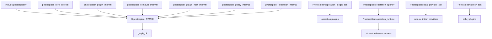

# Codebase Structure Direction

This document records Photospider's kernel repository structure: its public
Host seam, static embedded product, extension SDKs, role-owned source layout,
and source-private Job/worker vertical. Daemon IPC v2 is a separate installed
consumer of this package and is not owned by this repository.

The goals are:

- `libphotospider` is the stable static-link target for embedded frontends.
- `graph_cli` remains the basic embedded interactive frontend.
- Public extension authors use only the narrow installed SDK components.
- The external [photospider-daemon](https://github.com/kevin-zf1123/photospider-daemon)
  repository owns the typed IPC client, private protocol implementation,
  `photospiderd`, protocol documents, and daemon tests. It consumes an installed
  `Photospider::photospider` package without a source-tree dependency.

## Current Friction

The kernel repository now has the public Host seam, installable static product,
migrated CLI tree, role-owned private sources, production plugin homes,
unit/integration test ownership, narrow SDK exports, and the source-private
single-tenant Job/worker vertical. The daemon split removes duplicate protocol,
package, process-shell, and test ownership from this tree while preserving the
installed embedded Host dependency consumed by the external daemon.

Observed build targets in the current root `CMakeLists.txt`:

| Current target | Current role | Friction |
| --- | --- | --- |
| `photospider_core_internal` | Build-only core values, private conversion, and registry helper. | Role-owned sources are also folded into the static product. |
| `photospider_graph_internal` | Build-only `GraphModel` and graph-service helper. | `GraphModel` remains private under `src/lib/graph`. |
| `photospider_plugin_host_internal` | Build-only host-side pure-C operation ABI v1 loader, adapter, runtime router, and generation-lifetime helper. | It is not exported. |
| `photospider_policy_internal` | Build-only pure-C policy DSO registry/loader, built-in types, bindings, contexts, faults, and DSO leases. | It owns ordering contexts only; it owns no worker, queue, grant, Run, Graph, or execution route. |
| `photospider_execution_internal` | Build-only private physical-execution resources and accounting primitives. | `ResourceLedger`, the fixed `DeviceExecutorRegistry`, and platform executor factories are compiled here; each composition-root `ExecutionService` owns its sole Host-and-per-device authoritative ledger and registry. |
| `photospider_compute_internal` | Build-only compute, request-owned HP/RT `ComputeRun`, policy-aware ready store, reserved-start transaction, private route execution, runtime, and dirty-region helpers. | Runs and physical route mechanisms remain private. |
| `photospider_host_internal` | Build-only embedded Host adapter and Kernel facade closure. | It is not exported and exposes no private execution owner to consumers. |
| `photospider_operation_runtime` | Installable shared DenseTensor/ImageFacet/ImageView, provider-defined Value, portable-artifact, sample-conversion, Region, extension-digest, and data-definition registry implementation. | It owns the sole process-wide allocation/revision minting authority plus dependency-neutral registry/Region logic, with no external package or back-link to the operation SDK. |
| `photospider_operation_plugin_sdk` | Installable dependency-neutral pure-C operation ABI v1 interface SDK. | It exposes the C11 contract and header-only C++17 helper without a runtime link dependency. |
| `photospider_data_provider_sdk` | Installable dependency-neutral pure-C data-definition ABI v3 SDK. | It carries one C11/C++17-compatible header and no runtime, registry, loader, or optional dependency. |
| `photospider_openexr_deep_provider` | Optional installable OpenEXR deep data-definition provider module. | It is built and exported only when enabled, links the data-provider SDK plus OpenEXR 3, and keeps OpenEXR out of neutral package surfaces. |
| `photospider_openexr_deep_adapter` | Build-only source-private Host codec adapter. | It is a non-exported static target available only in the enabled build and links `operation_runtime` plus OpenEXR 3. |
| `photospider_operation_opencv` | Installable opt-in OpenCV adapter. | It discovers and links only OpenCV `core`. |
| `photospider_policy_sdk` | Installable dependency-neutral pure-C policy ABI v1 SDK. | It carries one C11/C++17-compatible header and no execution/runtime dependency. |
| `photospider` | Static installable backend product with archive name `libphotospider`. | Matches the desired static product and public Host shape while folding role-owned backend sources into one archive. |
| `photospider_single_tenant_job_internal` | Non-installed Issue #99/#100 canonical JobSpec, tenant quota, durable Job/artifact, explicit retry/checkpoint, private worker protocol, and WorkerManager authority. | Its independent gate defaults on only for Darwin/Linux, and its internal/worker/unit/integration target inventory is absent elsewhere; it exports no package/API and remains outside every daemon composition. |
| `photospider-worker` | Non-installed one-assignment process composition root for the source-private single-tenant Job vertical. | It is freshly execed per attempt, links the internal Job/Embedded Host closure, exposes no network listener or second assignment, and grants no durable Job/quota/artifact authority. |
| `photospider_cli_common` | Object-library CLI command/TUI/autocomplete code plus the reusable `run_graph_cli` boundary under `apps/graph_cli/` and two role-owned benchmark service translation units. | Object injection places all CLI references before the selected product archive on single-pass static linkers; the benchmark sources remain exclusive to this non-installable helper/complete CLI closure and absent from the installable product. |
| `graph_cli` | Process-policy-only entry point at `apps/graph_cli/main.cpp`. | Disables OpenCL, owns allocation-independent fatal exit policy, creates the embedded `Host` adapter, and has no daemon-client mode yet. |

Remaining and recently resolved interface leaks:

- The former `include/graph_model.hpp` has moved to
  `src/lib/graph/graph_model.hpp`;
  graph model state, dirty-region snapshots, planner summaries, full task graph
  cache handles, and runtime generation state are now internal to the private
  include root.
- The internal `Kernel` and `InteractionService` facades now live under
  `src/lib/runtime/`. They include runtime, compute service, graph services, plugin
  manager, and dirty-control-lane implementation types, so they are not
  supported headers for linked consumers of `photospider`; repository
  targets that still include them must receive the private `src/lib/` include
  root.
  `ps::Host` is already the only supported frontend public seam. The embedded
  Host adapter translates `ps::HostComputeRequest` into the internal
  `Kernel::ComputeRequest` and then delegates through
  `InteractionService`/`Kernel`. Later phases preserve this ownership while
  changing internal targets or adding daemon/IPC adapters; they do not
  introduce a second frontend facade.
- Benchmark and implementation-private backend headers now live with their
  owning roles under `src/lib/**`; CLI headers live in the application-private
  `apps/graph_cli/include/graph_cli/` tree. The eight former transitional
  source-tree extension headers were
  `include/{plugin_api,node,ps_types,image_buffer}.hpp`,
  `include/adapter/buffer_adapter_opencv.hpp`, and
  `include/kernel/scheduler/{i_scheduler,scheduler_task_runtime,scheduler_plugin_api}.hpp`.
  They are now deleted without compatibility forwarders; their public narrow
  contracts and private full declarations have distinct role-owned homes.

Resolved seam tightening in the current branch:

- The former direct graph-state submission and runtime access escape hatches
  have been removed from the frontend contract. `Kernel` and
  `InteractionService` are internal facades, while tests that still need runtime
  or graph-state access explicitly include the internal-only
  `tests/support/kernel_test_access.hpp` helper and route those calls through
  `ps::testing::KernelTestAccess`.
- Graph, compute, runtime, Host, plugin, policy, execution, benchmark, and adapter
  implementation files and private headers now live under role-owned
  `src/lib/**` directories. Internal targets compile with the private
  `src/lib/` root, while the installable public header inventory remains
  limited to `include/photospider/**`.
- The issue #69–#75 Run/policy/execution implementation lives under
  `src/lib/compute/`, `src/lib/policy/`, and `src/lib/execution/`, while the
  shared accounting primitive lives under
  `src/lib/runtime/resource_ledger.*`. `Kernel` injects the Host-owned
  `ExecutionService`; `ComputeService` creates one Run for each non-realtime HP
  call and separate HP `Full` plus RT `Interactive` child Runs for realtime
  calls. Full, dirty, preflight, initial, and dependency-released work crosses
  one bounded ready store as move-only lease-backed submissions. The Host fixes
  the service class and trusted frontier, invokes one built-in or pure-C policy
  binding, validates the decision, and commits a resource exchange before one
  of the closed `cpu`, `serial_debug`, or `gpu_pipeline` routes starts. Graphs
  retain only copied route ids/generations. Policy bindings retain their own
  contexts, nonzero generations, immutable first faults, and DSO leases but no
  physical authority. No installed Host value or operation ABI names these
  private objects; the installed policy ABI exposes only immutable scalar
  ranking snapshots.
- Dirty-region diagnostics, compute planning diagnostics, and execution trace
  diagnostics are available through copied Host value snapshots. Public headers
  no longer need to name the backend graph/runtime/service/planning types or
  physical route classes to expose those diagnostics.
- The configured CLI application surface now lives under `apps/graph_cli/`:
  `main.cpp`, private headers, implementation sources, command help resources,
  root configuration code, REPL/TUI, autocomplete, and terminal helpers. Its
  complete target closure additionally includes only
  `src/lib/benchmark/benchmark_service.cpp` and
  `src/lib/benchmark/benchmark_yaml_generator.cpp`; both belong exclusively to
  the non-installable `photospider_cli_common`/CLI closure and are not folded
  into the installable `photospider` static product. The old top-level CLI homes
  are not compatibility surfaces.
- Repository-owned operation and policy plugins now live under
  `plugins/ops/` and `plugins/policies/`; test-only DSOs remain fixtures.
  Maintained test translation units are classified under `tests/unit/` and
  `tests/integration/`, with explicit fixture, support, and manual-verification
  roles. Obsolete issue replay/result orchestration has been removed.
- Operation plugins compile against the exact pure-C operation ABI v1 records
  and may use the header-only C++ authoring helper. Neither surface exposes
  `Node`, `GraphModel`, `OpRegistry`, YAML, private cache ownership, or a C++
  callback object across the DSO boundary. Policy plugins compile against the
  self-contained C11 `policy_plugin_api.h`; exact ABI v1 records expose
  immutable bounded scalar candidates and no executor, allocation service,
  resource grant, Run, Graph, completion route, or logger. Both are trusted
  in-process contracts rather than isolation boundaries.

## External Interface Rule

The external seam should be:

```text
external frontend
  -> public ps::Host (the only frontend seam)
      -> embedded Host adapter
          -> internal InteractionService / Kernel boundary
              -> GraphRuntime / GraphModel / ComputeService implementation
```

External code should not include or name these implementation concepts:

- `GraphModel`
- `GraphRuntime`
- `GraphStateExecutor`
- `ComputeService`
- `DirtyControlLane`
- `ComputePlan`
- `FullTaskGraph`
- `PolicyRegistry`, `ExecutionTaskRuntime`, or concrete private route classes
- graph cache/traversal/io service classes

External code may depend on stable value contracts:

- graph/session identifiers
- compute request options
- error/result values
- graph and node inspection snapshots
- policy binding and execution trace snapshots
- dirty-region inspection views
- dense-image Value and tile contracts
- plugin operation registration contracts

This keeps `InteractionService` as a deeper backend module behind the public
`ps::Host` seam: frontends get graph lifecycle, compute, inspection, events,
policy/execution configuration, and plugin control without learning the implementation
topology behind them.

## Target Public Headers

Only headers under `include/photospider/` are installable. There are no
source-tree extension exceptions, compatibility wrappers, or duplicate old/new
declarations.

Target layout:

```text
include/photospider/core/
  export.hpp
  geometry.hpp
  device.hpp
  graph_error.hpp
  compute_intent.hpp
  result_types.hpp
  inspection_types.hpp

include/photospider/host/
  host.hpp
  graph_session.hpp
  compute_request.hpp
  event_stream.hpp
  value_result.hpp
  value_artifact_result.hpp

include/photospider/data/
  value.hpp
  extension.hpp
  image_metadata.hpp
  image_statistics.hpp
  image_view.hpp
  packed_dense_tensor_view.hpp
  parameter_value.hpp
  region.hpp
  sample_conversion.hpp
  value_artifact.hpp

include/photospider/memory/
  access_plan.hpp
  blocked_layout.hpp
  buffer_handle.hpp
  ready_fence.hpp
  strided_layout.hpp

include/photospider/plugin/
  data_definition_registry.hpp
  data_provider_api.h
  operation_plugin_api.h
  operation_plugin.hpp
  opencv_adapter.hpp

include/photospider/policy/
  policy_plugin_api.h

include/photospider/
  public_boundary.hpp
```

Header rules:

- Public headers must not include files from `src/`.
- Public headers must not include `kernel/services/...`.
- Public headers must not expose mutable implementation state owned by
  `GraphModel`, `GraphRuntime`, or `ComputeService`.
- Public headers should prefer value objects, opaque handles, small references,
  and request/result structs.
- OpenCV appears only in the opt-in `plugin/opencv_adapter.hpp` contract;
  operation SDK, policy SDK, Host, core, and IPC headers do not require it.
  No public header exposes yaml-cpp. Ordinary images use the dependency-neutral
  `Value`, `ImageView`, sample, artifact, and memory contracts; no second image
  compatibility type is installed.
- CLI, benchmark, and test-only headers are not public install headers.

## Current and Target Source Layout

The source tree should make ownership visible before reading a single file:

```text
include/photospider/
  core/
  host/
  data/
  memory/
  plugin/
  policy/

src/lib/
  core/
  graph/
  compute/
    dispatch/
    dirty/
    execution/
    request/
  runtime/
  host/
  plugin/
  policy/
  execution/
    device/
    isolation/
    transfer/
  benchmark/
    b1/
    i1/
    i2/
    m1/
    common/
  server/
    state/
    worker/
  adapters/
    opencv/
    metal/

apps/
  graph_cli/
    main.cpp
    include/graph_cli/
    src/
      autocomplete/
      command/
    resources/help/

plugins/
  ops/
  policies/

tests/
  unit/
  integration/
  fixtures/
  support/
  verification/
```

All kernel backend, plugin, Job/worker, and maintained kernel test code uses
this layout. Issue #242 moved the former daemon source/header subtrees and
process shell into the external daemon repository after a frozen
same-commit compatibility gate. Issue #38 completed the
operation extension contract and removed all eight transitional extension
headers without shims or duplicates. Issue #75 removes the worker-owning
scheduler SDK and adds the one-header `include/photospider/policy/` pure-C
contract. Policy registry/loading lives under `src/lib/policy/`; private
route/runtime contracts live under `src/lib/execution/`; the policy-aware store
and reserved-start logic live under `src/lib/compute/execution/`; request,
dispatch, and dirty-update collaborators live under their matching compute
subdirectories. Device, isolation, and transfer mechanics are separated below
`src/lib/execution/`; benchmark profiles are grouped by scenario; durable
server truth and worker supervision are separated below `src/lib/server/`.
The sole
Host-and-per-device authoritative ledger implementation remains under
`src/lib/runtime/`.
None of those private implementation owners becomes a public Host type.

Naming rules:

- Directories, files, CMake targets, and free functions use `snake_case`.
- Types use `PascalCase`.
- Methods and fields use `snake_case`.
- Public target names use the product name directly, such as `photospider` or
  `libphotospider`; helper targets use role names such as
  `photospider_graph_internal`.
- Concrete implementations should not use vague suffixes such as `_module` when
  a domain name exists.

## Build Target Shape

Current target shape:

| Target | Kind | Installs? | Role |
| --- | --- | --- | --- |
| `photospider_core_internal` | Static | No | Core Values, sample/artifact codecs, graph errors, and low-level helpers. |
| `photospider_graph_internal` | Static | No | `GraphModel`, graph IO, traversal, cache, inspection implementation. |
| `photospider_compute_internal` | Static | No | Compute planning, dirty-region state, dispatcher, policy-aware ready store, reserved start, and private-route execution. |
| `photospider_plugin_host_internal` | Static | No | Host-side dynamic plugin loading and lifetime ownership. |
| `photospider_policy_internal` | Static | No | Pure-C policy registry/loader, built-ins, bindings, contexts, faults, and DSO leases. |
| `photospider_execution_internal` | Static | No | Private `DeviceExecutorRegistry`, platform executor factories, physical-execution accounting, and `ResourceLedger` implementation. |
| `photospider_host_internal` | Static | No | Embedded Host adapter and Kernel facade closure. |
| `photospider_operation_runtime` | Shared | Yes | Public DenseTensor/ImageFacet/ImageView and provider-defined Value, portable-artifact/sample-conversion, Region, canonical extension metadata, and injected data-definition registry implementation plus sole process-wide allocation/revision minting authority, with no external-package dependency or SDK back-link. |
| `photospider_operation_plugin_sdk` | Interface | Yes | Dependency-neutral operation ABI v1 C11 header and header-only C++17 helper. |
| `photospider_data_provider_sdk` | Interface | Yes | One dependency-neutral pure-C ABI v3 header with C11/C++17 usage requirements and no link interface. |
| `photospider_openexr_deep_provider` | Module | Optional | Installed/exported as `Photospider::openexr_deep_provider`; this OpenEXR deep data-definition provider DSO is available only when explicitly enabled. |
| `photospider_openexr_deep_adapter` | Static | No | Source-private Host codec adapter for enabled OpenEXR builds; it is never installed or exported. |
| `photospider_operation_opencv` | Static | Yes | Opt-in public OpenCV adapter with only OpenCV `core`. |
| `photospider_policy_sdk` | Interface | Yes | One dependency-neutral pure-C ABI v1 header with C11/C++17 usage requirements. |
| `photospider` / `libphotospider` | Static | Yes | Public static library for in-process frontends. |
| `photospider_cli_common` | Object | No | CLI command parser, REPL, TUI, autocomplete, and the two CLI-only benchmark service translation units; object injection precedes the selected product archive and none enter the installable static product. |
| `graph_cli` | Executable | No | Basic interactive frontend. |
| operation plugins | Shared | Optional | Dynamically loaded operation extensions. |
| policy plugins | Shared | Optional | Pure-C policy-only ranking extensions. |

Target dependency direction:


```mermaid
graph TD
    public_headers["include/photospider/*"] --> libphotospider["libphotospider STATIC"]
    core["photospider_core_internal"] --> libphotospider
    graph_internal["photospider_graph_internal"] --> libphotospider
    compute["photospider_compute_internal"] --> libphotospider
    plugin_host["photospider_plugin_host_internal"] --> libphotospider
    policy["photospider_policy_internal"] --> libphotospider
    execution["photospider_execution_internal"] --> libphotospider
    operation_plugin_sdk["Photospider::operation_plugin_sdk"] --> operation_plugins["operation plugins"]
    operation_runtime["Photospider::operation_runtime"] --> value_consumers["Value/runtime consumers"]
    data_provider_sdk["Photospider::data_provider_sdk"] --> data_providers["data-definition providers"]
    operation_opencv["Photospider::operation_opencv"] --> operation_runtime
    policy_sdk["Photospider::policy_sdk"] --> policy_plugins["policy plugins"]
    libphotospider --> graph_cli
```

CMake rules:

- Internal targets may use `src/lib/` as a `PRIVATE` include root.
- `PHOTOSPIDER_BUILD_SINGLE_TENANT_JOB` independently gates the POSIX-backed
  Job internal target and its maintained unit/integration targets. It defaults
  on only for Darwin/Linux, defaults off on every other system, and rejects an
  explicit unsupported enable. Configure-time inventory assertions require all
  profile-appropriate Job targets when enabled and forbid them when disabled.
- Installable targets expose only `include/photospider`.
- The installation boundary copies headers only from
  `include/photospider/**`. Implementation headers under `src/lib/` are
  excluded from the installed package, and the `photospider` product keeps
  `src/lib/` as a private include root.
- The install/export configuration makes `photospider` the installable
  `STATIC` target, installs only `include/photospider/**`, and exports
  `Photospider::photospider` through `PhotospiderConfig.cmake`. The archive is
  named `libphotospider.a` on Unix-like toolchains and `photospider.lib` with
  MSVC.
- Build-tree consumers of `photospider` receive a generated public include root
  containing only `photospider/` forwarding headers. The source-tree
  `include/photospider/**` inventory is tracked with `CONFIGURE_DEPENDS`, so
  additions and removals regenerate the forwarding tree without requiring
  symbolic-link privileges; header content is read directly from the live
  source file. The source-tree `include/` and `src/lib/` roots remain private
  implementation include paths for repository targets; repository plugins
  receive only the generated public include root.
- The static product archive folds the product implementation sources directly
  into `photospider`. Repository-only static helper modules remain available
  for local build organization but are not exported to package consumers.
- A shared library can be added later as an explicit compatibility product, not
  as the primary backend.
- Current operation plugins export only
  `ps_operation_plugin_get_abi_version` and
  `ps_operation_plugin_get_api_v1`. The Host supplies exact prepared root and
  suite records, deep-copies validated metadata, and keeps `OpRegistry`
  private. Pure-C/header-only authors link
  `Photospider::operation_plugin_sdk`; users of public Value/runtime helpers
  link `Photospider::operation_runtime` explicitly, while an OpenCV-adapter
  user also links `Photospider::operation_opencv` and declares any
  algorithm-specific modules.
- OpenCV (`core`, `imgproc`, `imgcodecs`, `videoio`), `yaml-cpp`, and `Threads`
  are link-only implementation dependencies for the static archive. The
  installed `Photospider::photospider` target records them as
  `$<LINK_ONLY:...>` entries in `INTERFACE_LINK_LIBRARIES`.
  `PhotospiderConfig.cmake` finds them so embedded consumers can link the
  exported target, but public Host/core headers do not require OpenCV or
  `yaml-cpp` types. `${CMAKE_DL_LIBS}` adds the platform dynamic-loader library
  only where CMake requires one.
- Package components are `embedded`, `data_provider_sdk`,
  `operation_plugin_sdk`, `operation_runtime`, `operation_opencv`,
  `openexr_deep_provider`, and `policy_sdk`. Omitting components selects
  `embedded`. The external daemon obtains its full kernel through this
  installed component and publishes its client through its own package.
  Unknown required components fail discovery; there is no kernel-owned daemon
  or IPC component.
- On Apple, when the repository Metal-provider/OpenCV-operation-plugin profile is
  enabled, the static product carries system `Metal` and `Foundation`
  framework link flags for the process-owned Metal executor. The Metal
  operation provider borrows that executor's invocation context and has no
  `CoreImage` or `CoreVideo` dependency. The dependency-disabled profile
  compiles the stub factory, leaves the registry without a Metal executor, and
  adds no Metal framework requirement.
- On Windows, the exported target propagates `PHOTOSPIDER_STATIC`, so public
  declarations do not acquire DLL import/export annotations when consumers link
  the `.lib` archive. Dynamic operation-plugin exports use
  `PHOTOSPIDER_OPERATION_PLUGIN_EXPORT` and remain separate from the static
  product boundary.
- FTXUI and `photospider_cli_common` are CLI-only dependencies and are not part
  of the embedded package export. Operation and policy plugin DSOs remain
  runtime extension artifacts rather than dependencies of
  `Photospider::photospider`.
- `apps/graph_cli/include/graph_cli/**` is a private application include tree.
  CMake exposes it only to `photospider_cli_common`, `graph_cli`, and focused
  CLI tests; install rules continue to copy only `include/photospider/**`.
- `graph_cli` currently links the `photospider_cli_common` objects before
  `libphotospider` and remains local/embedded; remote CLI mode is later work.
- The external daemon repository links `photospiderd` only to an installed
  `Photospider::photospider` package plus its own private server/client targets.
  This repository exports no daemon target, protocol header, or raw transport.
- Operation plugins do not link to a broad shared backend merely to reach
  registry symbols. The current operation ABI is a separately versioned,
  exact-layout C11 contract. The Host stages each complete generation, then
  atomically publishes private callbacks retaining the exact DSO lease; no
  C++ callback, registry object, exception, or owner crosses the DSO boundary.
  Policy plugins link only `Photospider::policy_sdk` and export exactly
  `ps_policy_plugin_get_abi_version` plus `ps_policy_plugin_get_api_v1`.
  Their exact natural-layout records and callbacks form a C11 pure-C ABI;
  policy code receives no worker grant, executor, Run, Graph, allocator, or
  completion route. The removed scheduler SDK has no adapter, alias, forwarding
  header, or compatibility registration.
  Data-definition providers link only `Photospider::data_provider_sdk`, export
  exactly `ps_data_provider_get_abi_version` plus
  `ps_data_provider_get_api_v3`, and publish immutable Schema/Facet/Layout
  bundles. C++ registry consumers link `operation_runtime`; no installed
  provider scanner, mutable registry callback, or optional codec dependency is
  implied.

## Target Process-Execution Composition Boundary

[ADR 0007](../adr/0007-compute-runs-and-process-execution-have-separate-owners.md)
fixes the complete process-execution ownership. Its issue #69 private HP/RT
Runs, stable lease/composite identity, owned ready-submission, and injected
multi-Run CPU service slice is now current under `src/lib/compute/`. Issue #70's
complete resource admission and issue #71's built-in policy-aware ready store
are current there as well. Issue #72's exact-revision staged commit and issue
#73's private cooperative cancellation, Run-owned commit arbitration, and
RT-denies-HP behavior are current too. Issue #74's request-owned realtime
`RunGroup`, checked latest-wins generations, bounded ticket-backed coalescing,
and current-generation commit predicate are also current. `EmbeddedHostState`
constructs the
process execution owner before Kernel, and Kernel injects it into request-local
`ComputeService` instances without a static singleton. Issue #75's process
policy bindings, pure-C ABI, Host-authored frontier, reserved-start admission,
and closed private execution routes are current. Issue #76's lifecycle
fence, monotonic Graph close, explicit shutdown, exact settlement, and
source-private telemetry are current too.

In the current layout:

- `GraphRuntime` remains graph-scoped and owns Graph state, the graph-state lane,
  latest-wins coordinator, bounded compute-request lane, revision/generation
  capture and commit validation, stable graph-instance identity and lifetime
  anchor, events, and platform/session metadata;
- the current `ComputeRun` shared control owns non-realtime HP Runs and the
  separate HP `Full`/RT `Interactive` child Runs of realtime calls, including
  descriptor/phase/terminal and cancellation state, the Run-owned one-shot
  commit contender, and corresponding full-plan/temporary or standalone dirty
  staging storage; all full HP work retains non-forgeable read-only leases,
  composite task identity, Graph lifetime leases, and final lifecycle
  registration;
- current request-owned `RunGroup` coordination keeps HP and RT as independent Runs,
  returns RT output only after deterministic two-child settlement, and never
  creates cross-domain task dependencies;
- the current `ExecutionService` owns one fixed CPU worker pool, private
  `serial_debug` and `gpu_pipeline` behavior, one Host-and-per-device
  authoritative ledger, a fixed `DeviceExecutorRegistry`, and, in the enabled
  Apple repository Metal-provider profile, one process-owned Metal executor.
  That executor owns its command queue, invocation-scoped native-allocation
  facade, and validated persistent pipeline cache. GPU work enters it only
  after the common reserved-start transaction, and an operation borrows the
  installed invocation context rather than retaining native process resources.
  Explicit CPU/Metal transfer, bounded residency, coherency, exact stale
  completion, and revision-preserving publication are current from issue #85.
  Issue #86 now makes each concrete non-CPU `DeviceId` an isolated
  device-memory/scratch account. A native heap query supplies only an aligned
  descriptor minimum. Before allocation, one ledger root-mutex transaction
  validates that minimum plus exact scratch and reserves the device's complete
  currently available persistent-memory ceiling. The dedicated heap's
  positive `currentAllocatedSize` is the sole persistent actual; its texture
  suballocation is not counted again, while scratch uses each resource's
  positive `allocatedSize`. A fitting commit under the same sole mutex returns
  unused bytes and binds independent exact memory/scratch leases to persistent
  Value and completion lifetimes. Typed invalid/over-plan failure retires local
  native owners and rolls the uncommitted reservation back exactly once. The
  dependency-disabled profile installs no Metal executor and therefore makes
  no native utilization claim;
  `ExecutionService` also owns a
  policy-aware entry/byte-bounded ready store,
  checked full-vector Run admission, work/byte cost, class-local Graph and
  weighted-Run fairness, stable aging, a three-Interactive burst bound,
  Throughput-owned protected-headroom accounting with exact root lifetime,
  concurrent multi-Graph Runs, exact reservation/grant release, and per-Run
  completion, first-failure, trace, and Host-context routing. It also observes
  accepted Run cancellation, purges only that Run's queued entries, rejects
  dependent re-entry, and waits for running callbacks to drain. Interactive
  roots do not debit the Throughput class quota. Every Graph stores only copied
  route ids/generations, while every route uses the common policy and
  reserved-start boundary;
- its private `RunLifecycleRegistry` supplies the single process admission/
  graph-close/process-shutdown fence, pending-candidate tracking,
  graph-indexed registry-held `RunLease` entries, and process enumeration without
  owning Run plans, dispatchers, terminal state, Graph state, or resource tokens;
- its source-private `ExecutionLifecycleTelemetry` preallocates a fixed 65,536
  record ring, copies atomic-cut cursor pages and 15 post-transition counters,
  and grants no public or runtime authority;
- the internal `ResourceLedger` is the only Host reservation/grant and
  per-device plan/lease mint; and
- the current process policy registry owns built-in and pure-C DSO types. One
  binding per `PolicyClass` owns its context, nonzero generation, immutable
  first fault, and DSO leases. Host state selects the service class and trusted
  frontier; a policy ranks immutable scalar descriptors only and owns no
  worker, queue, token, native resource, Run, Graph, or start authority.

The former worker-only budget and worker-owning scheduler SDK are removed as
complete migrations without wrappers, aliases, duplicate authority, or stale
installed headers. Future general-resource or isolation slices must extend the
private Host boundary without reintroducing execution authority into policy.

## External Daemon Repository

The standalone [photospider-daemon](https://github.com/kevin-zf1123/photospider-daemon)
repository is the sole current owner of the foreground same-user Unix-domain
sidecar, `PhotospiderDaemon::client`, private IPC router/server, exact protocol
v2 document, and maintained daemon tests. Its dependency direction is strictly
one way:

```text
PhotospiderDaemon::client -> Photospider::operation_runtime + Threads
photospiderd -> installed Photospider::photospider + private daemon targets
```

This kernel repository contains no daemon option, source/header subtree,
process shell, package component/export, current protocol document, or daemon
CTest/CI inventory. `graph_cli` remains embedded and does not auto-connect.
Protocol v3, wire cancellation/shutdown, remote or multi-user service profiles,
and typed compiler compatibility remain separate work.

## Migration State and Remaining Order

Frontend-boundary, physical-layout, daemon, typed Client, and complete IPC Host
steps 1-8 are present in the current repository without changing `ps::Host` as
the sole public seam.

Issues #69–#74 establish Host-owned multi-Run execution, complete resource
vectors, bounded ready storage/fairness, exact-revision staging, cooperative
cancellation, latest-wins supersession, and realtime `RunGroup` ownership.
Issue #75 is now current: it removes every per-Graph scheduler owner and the
worker-owning SDK, adds process policy bindings plus a pure-C policy ABI,
reduces candidates through a Host-authored frontier, commits starts through a
resource-safe transaction, and routes all work through closed private
execution ids. Graph load/replacement now copies route values only. Issue #76
completes the lifecycle registry, graph-close/process-shutdown, exact
settlement, and telemetry invariants. Issues #84 through #86 are also current:
one repository Metal operation reaches a process-owned executor through the
fixed `DeviceExecutorRegistry`; explicit CPU/Metal transfer and bounded
residency preserve exact revision/completion identity; and the sole service
`ResourceLedger` now admits and reconciles isolated persistent-device-memory
and scratch bytes through their exact native-owner lifetimes. The authoritative
acyclic
dependency table is in the
[kernel evolution target](../roadmap/Kernel-Evolution.md#delivery-dependency-contract).

1. **Completed:** Establish public-header installation and self-containment
   boundaries.
   - Install only headers under `include/photospider/**`; implementation
     headers under `src/lib/` remain outside the package.
   - `PublicHeaderSelfContainment` builds the
     `public_header_self_containment` target through CTest. CMake generates one
     translation unit per header under `include/photospider/`. One object target
     compiles every non-OpenCV header through only the public include root with
     C++17; a separate object target compiles
     `plugin/opencv_adapter.hpp` with exactly the declared
     `Photospider::operation_opencv` usage requirements. The aggregate target
     requires both, so optional OpenCV dependencies cannot mask accidental
     coupling in core, Host, IPC, operation-SDK, or policy headers.
   - `include/photospider/public_boundary.hpp` remains a marker header for the
     installable include root. Stable value contracts live under
     `include/photospider/core/`.
2. **Completed:** Introduce `include/photospider/*`.
   - Move stable value contracts first: errors, result/status values,
     compute intent, dependency-neutral Value/image/tile contracts, and inspection
     snapshots.
   - Keep `GraphModel`, `GraphRuntime`, and compute planning headers internal.
3. **Completed:** Create the host interface.
   - Keep `InteractionService` behind the stable public `ps::Host` module.
   - Remove external escape hatches such as raw `Kernel&`, `GraphRuntime&`, and
     templated `GraphModel&` submission from public headers.
4. **Completed:** Rename build output.
   - Make the installable static target `photospider`/`libphotospider`.
   - Keep internal static modules private.
5. **Completed for existing code:** Split application, backend, plugin, and
   test ownership.
   - The `graph_cli`/`photospider_cli_common` application source,
     private-header, configuration, and resource surface now lives under
     `apps/graph_cli/`. Its complete target closure additionally owns exactly
     the two role-owned benchmark service translation units under
     `src/lib/benchmark/`; they remain exclusive to the non-installable CLI
     helper/closure and outside the installable static product.
   - Existing backend implementation/private headers live under role-owned
     `src/lib/**`; dense compute, benchmark, execution, and server roles use one
     additional responsibility directory rather than accumulating a flat set
     of translation units. The source-private single-tenant Job control plane
     remains at `src/lib/server/`, durable truth lives in `server/state/`,
     manager/protocol/artifact ownership lives in `server/worker/`, and its one-assignment
     composition root lives under `apps/photospider_worker/`; production
     plugins live under `plugins/**`; maintained tests live under explicit
     unit/integration/fixture/support/verification roles.
   - Physical movement preserves existing target, ABI, and test identity. The
     former monolithic execution-service and worker-manager implementations are
     compiled from responsibility-specific translation units with shared
     source-private state declarations; no forwarding header or duplicate old
     path remains.
6. **Completed daemon ownership migration:** Issue #242 froze the exact
   full-stack commit, extracted protocol v2 with history into the standalone
   daemon repository, passed old-old/old-new/new-old/new-new compatibility, and
   removed daemon targets, headers, sources, tests, and normative protocol docs
   from this kernel tree. The kernel keeps only its installed Host package.
7. **Completed extension-boundary work:** Issue #38 first narrowed the operation
   SDK, issue #75 replaced the scheduler SDK with the policy SDK, and issue
   #132 replaced the provisional operation surface with pure-C ABI v1.
   - Operation plugins use exact root/suite/semantic records plus Host-owned
     sinks and grants; the optional C++ helper emits only that C ABI. Policy
     plugins use exact natural-layout C ABI v1 records with
     metadata/create/select/destroy callbacks and receive no execution resource.
   - The eight old headers and five old internal helper target names are absent
     without compatibility wrappers or aliases. Installed external consumers
     build both DSOs from package SDKs and execute them through an embedded Host.
   - Durable kernel integration coverage runs installed extension DSOs through
     the embedded Host and `graph_cli`. The external daemon repository owns the
     corresponding real-process IPC coverage.
9. **Completed DI-4 external Value boundary:** Issue #131 removes the final
   ImageBuffer/DataType/Device and side-effecting `io:save` surfaces; Host,
   cache, IPC, worker protocol v3, durable recovery, OpenCV/OpenEXR codecs, and
   CLI save now retain exact Values or canonical portable archives. Identity
   conversion preserves 64-bit integers without floating promotion, OpenCV
   encode preflights its closed matrix, ordinary OpenEXR accepts UINT32/FP32,
   and durable restart checks control/archive/quota/length/sparse bounds before
   allocation.
10. **Implemented V-14 data-definition boundary:** Issue #117 adds the
   self-contained pure-C definition-suite ABI v3, the installed
   `data_provider_sdk`, public byte-preserving extension/registry contracts,
   and the runtime implementation without adding a second product or loader.
   The dependency-disabled install smoke builds exact-name C11 and C++17
   providers from the installed SDK, loads each through the real registry, and
   runs the dependency-neutral VariableSampleField contract matrix. OpenEXR
   and other optional provider dependencies remain absent.

## Verification Expectations

For any implementation change following this document:

- Match local validation to the changed boundary: use scoped static checks,
  affected build targets, and focused regressions during implementation. A
  local full build or complete CTest/JUnit pass is not a standing requirement.
  GitHub Actions is the remote integration environment; do not add Docker or
  local `linux/amd64` emulation as a routine preflight.
- Daemon-boundary changes are built and tested in the external daemon
  repository against an installed kernel package; `graph_cli` remains an
  embedded/local regression target here.
- Keep the embedded Host and `GraphCliPluginComputeSmoke` paths as long-lived
  kernel runtime tests. External real-daemon coverage is not registered here.
- For static package work, keep the package consumer smoke test in CTest because
  it executes the real producer build/install, external find-package,
  public-header compile/link/run, installed export/dependency, platform, and
  multi-configuration boundaries. It also builds operation and policy DSOs
  using only installed SDK targets, then makes an embedded Host load both,
  bind the external policy, select a private execution route, submit work, and
  compute through the external operation. It evaluates those invariants in memory,
  streams commands and failure details to stdout/stderr for CTest to capture,
  and uses only transient install and consumer work directories below the build
  tree. It does not produce expected/actual/compare/summary reports and must not
  depend on Git identity, patch hashes, replay, provenance, or migration
  completion.
- Keep the dependency-disabled install smoke as the installed data-definition
  SDK gate. Its clean OpenCV/YAML-disabled producer runs the V-14 synthetic
  multi-buffer/registry/digest/lifetime matrix, and its external project builds
  and executes separate exact-name C11 and C++17 provider producers against
  only `Photospider::data_provider_sdk` before Host-side registration through
  `Photospider::operation_runtime`. No CI test-name edit is required because the
  existing labelled smoke owns this long-lived boundary.
- Keep `PublicHeaderSelfContainment` in CTest as a long-lived compile-boundary
  check. It generates one translation unit per installable public header and
  compiles every non-OpenCV header through only the public include root with
  C++17. The opt-in OpenCV adapter compiles in a separate object target with
  exactly `Photospider::operation_opencv`; the aggregate fails when either
  dependency-isolated group cannot compile independently.
- Treat CMake 3.16 as a compatibility floor, not a fixed version gate for every
  pull request. Guard newer policies, rely on the current CI package consumer,
  and run a targeted native old-version producer/install/consumer path only for
  a compatibility-sensitive change or release check. Do not substitute
  architecture emulation for a native runtime.
- Migration residue, phase completion, stale-term, and source-layout checks are
  temporary development checks, not software behavior tests. Do not register
  them with CTest or CI, and do not retain their issue-specific orchestration in
  the primary repository.
- Derive CLI catch-order and Doxygen audit inputs from the real CMake target
  closure and compilation database or CMake File API. The audit fails closed if
  a source in `photospider_cli_common` or `graph_cli`, including root
  translation units such as `apps/graph_cli/src/cli_config.cpp`,
  `apps/graph_cli/src/run_graph_cli.cpp`, and `apps/graph_cli/main.cpp`, is
  omitted or cannot be matched to a compile command.
  This Doxygen/source-quality audit is a documented manual tool and is not a
  CTest or CI entry.
- The manual CLI Doxygen audit also maintains a fail-closed companion manifest
  for application-private headers that do not receive their own compilation
  database rows. The manifest covers dependency-tree formatting, traversal,
  both node editors, the CLI completer, every split autocomplete definition,
  their types and important fields, anonymous formatter helpers, and the
  documented `node_editor.cpp` local type, named lambdas, option callbacks,
  renderers, and `CatchEvent` callback. Repeated callback member names use
  explicit entity locators rather than first-name matching. Every
  required implementation must remain in the configured target closure and
  have an exact compile command; every manifest entity must retain an immediate
  complete Doxygen block. Callables require `@brief`, `@return`, `@throws`,
  `@note`, and one matching `@param` for every actual parameter; types require
  `@brief`, `@throws`, and `@note`; fields require `@brief`. A definition may
  instead use `@copydoc` only when its complete target is the manifest's exact
  global symbol or `CliAutocompleter` member/constructor. A missing file,
  inventory row, compile command, tag, parameter, or comment is an audit
  failure. The tool's negative self-checks copy real sources and the manifest
  under `/tmp`, then delete a comment, corrupt a copy target, delete a parameter
  tag, and delete an inventory row; every mutation must fail through the normal
  scanner and comparison path. Run the tool
  explicitly with a configured `compile_commands.json` and write its transient
  observations outside the repository; it must not be registered with CTest or
  CI and must not create `tests/results` artifacts.
- Maintain real-process daemon lifecycle, protocol, artifact, reconnect, and
  signal-drain coverage exclusively in the external daemon repository.

## Open Decisions

Any future `graph_cli` remote mode must consume the external daemon package
explicitly; the current CLI construction remains embedded and performs no
socket discovery or automatic connection.

## Reference Repositories

The style direction follows these broad practices from mature C/C++ projects:

- LLVM keeps coding conventions and interface expectations explicit:
  <https://llvm.org/docs/CodingStandards.html>
- FFmpeg separates libraries, tools, and developer-facing contracts:
  <https://ffmpeg.org/developer.html>
- Krita separates application shells, plugins, and core libraries while keeping
  C++ conventions documented:
  <https://docs.krita.org/en/untranslatable_pages/intro_hacking_krita.html>
