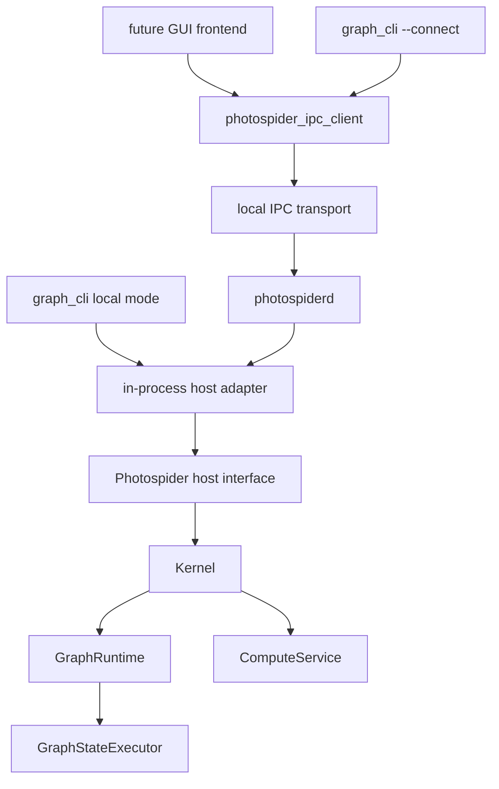

# 代码库结构方向

本文档同时记录 Photospider 当前已经具备的公开头/Host seam、静态产品和按角色归属的源码布局，
已经实现的 version 1 daemon/IPC slice，以及剩余 internal target 方向。下文会明确区分当前状态与
未来工作。

目标如下：

- `libphotospider` 是面向嵌入式前端的稳定静态链接目标。
- `photospiderd` 作为 foreground local daemon，通过一个 embedded `ps::Host` 拥有 graph session。
- `graph_cli` 保持为基础的交互式命令行前端。
- Frontend 既可以进程内链接 `libphotospider`，也可以用 typed client 通过 IPC 与
  `photospiderd` 交互。

## 当前摩擦

当前仓库已经具备 public Host seam、可安装静态产品、迁移后的 CLI application tree、按角色归属的
backend source tree、明确的 production plugin 目录、unit/integration 测试归属，以及 macOS/Linux
version 1 daemon/IPC graph-inspection slice。Compute/result IPC、最终 internal target 形态与过渡性
plugin SDK 仍需要后续迁移阶段完成。

当前根 `CMakeLists.txt` 中观察到的构建目标：

| 当前 target | 当前角色 | 摩擦 |
| --- | --- | --- |
| `photospider_core_types` | 仅用于构建的静态核心数据与 operation-registry helper。 | 按角色归属的源码也会折叠进静态产品；target decomposition 与已经完成的物理迁移彼此独立。 |
| `photospider_graph` | 仅用于构建的静态 `GraphModel` 与 graph-services helper。 | `GraphModel` 现在位于私有的 `src/lib/graph`，但这些源码也会折叠进产品。 |
| `photospider_plugin` | 仅用于构建的静态 plugin manager 与 loader helper。 | 它不会被导出；过渡性 plugin SDK 仍使用 source tree 中遗留的顶层头。 |
| `photospider_compute` | 仅用于构建的静态 compute、runtime、scheduler 与 interaction helper。 | 实现已经按物理角色归属；后续 target decomposition 可以进一步收窄链接所有权。 |
| `photospider` | 静态可安装后端产品，归档文件名为 `libphotospider`。 | 已符合目标静态产品和 public Host 形态，同时把按角色归属的后端源码折叠进单一归档。 |
| `photospider_cli_common` | `apps/graph_cli/` 下的静态 CLI 命令、TUI、自动补全代码，以及可复用 `run_graph_cli` 边界。 | 使用 application-private 头，仍是不可安装的 helper。 |
| `graph_cli` | 位于 `apps/graph_cli/main.cpp`、只负责 process policy 的入口。 | 禁用 OpenCL，拥有不依赖分配的 fatal exit policy，创建 embedded `Host` adapter，尚无 daemon-client 模式。 |
| `photospider_ipc_client` | 可安装 static typed Unix IPC client。 | 只实现 version 1 的八个 graph/inspection 方法；不链接 backend，也不暴露 JSON/POSIX type。 |
| `photospider_ipc_server_internal` | 不安装的 router、registry 与 bounded Unix listener。 | 串行化每个 Host call，并且刻意不进入 package export。 |
| `photospiderd` | `apps/photospiderd/` 下已安装的 foreground process shell。 | 拥有一个 embedded Host、self-pipe signal policy、protected socket 与 deterministic cleanup。 |

仍遗留和刚完成修复的接口泄漏：

- 原先的 `include/graph_model.hpp` 已移到 `src/lib/graph/graph_model.hpp`；graph model state、
  dirty-region snapshot、planner summary、full task graph cache handle 和 runtime generation
  state 现在都归入私有 include root。
- 内部 `Kernel` 和 `InteractionService` facade 现在位于 `src/lib/runtime/`。它们包含 runtime、
  compute service、图服务、插件管理器和 dirty-control-lane 实现类型，因此不是 `photospider`
  链接消费者可依赖的受支持头；仍包含它们的仓库内部 target 必须获得私有 `src/lib/` include root。
  `ps::Host` 现在已经是唯一受支持的 frontend public seam。Embedded Host adapter 会把
  `ps::HostComputeRequest` 转换为内部 `Kernel::ComputeRequest`，再通过
  `InteractionService`/`Kernel` 委托执行。后续阶段只会在保持这一所有权的前提下调整内部 target
  或增加 daemon/IPC adapter，不会再引入第二套 frontend facade。
- `include/plugin_api.hpp` 包含完整 `Node`，把节点运行时/cache 状态暴露给操作插件，而不是暴露更小的插件契约。Issue #33
  已通过 `OperationPluginRegistrar` 收窄注册路径，但后续 public plugin contract 仍需要更小的 node view。
- Benchmark 与实现私有 backend 头现在都随所属角色位于 `src/lib/**`；CLI 头位于
  application-private 的 `apps/graph_cli/include/graph_cli/` 树中。只有八个过渡性 source-tree
  extension header 明确保留给 issue #38：
  `include/{plugin_api,node,ps_types,image_buffer}.hpp`、
  `include/adapter/buffer_adapter_opencv.hpp`，以及
  `include/kernel/scheduler/{i_scheduler,scheduler_task_runtime,scheduler_plugin_api}.hpp`。
  它们是仅供构建的兼容契约，不是已安装的 Host header。

当前分支已经完成的 seam 收紧：

- 原先直接提交 graph-state 工作和访问 runtime 的 escape hatch 已从 frontend contract 中移除。
  `Kernel` 和 `InteractionService` 是内部 facade；仍需要 runtime 或 graph-state 访问的测试现在必须
  显式包含 internal-only 的 `tests/support/kernel_test_access.hpp` helper，并通过
  `ps::testing::KernelTestAccess` 进行这些访问。
- Graph、compute、runtime、Host、plugin、scheduler、benchmark 与 adapter 的实现文件和私有头
  现在都位于按角色归属的 `src/lib/**` 目录。内部 target 通过私有 `src/lib/` root 构建，
  可安装 public header inventory 则继续限定在 `include/photospider/**`。
- dirty-region 诊断、compute planning 诊断和 scheduler trace 诊断都通过 Host 的拷贝值
  snapshot 暴露。公开头不再需要命名后端 graph/runtime/service/planning 类型或具体 scheduler
  class，就能提供这些诊断。
- 完整配置后的 CLI closure 现在位于 `apps/graph_cli/`：其中包含 `main.cpp`、private header、
  implementation source、command help resource、root configuration code、REPL/TUI、自动补全和
  terminal helper。旧的顶层 CLI 归属位置不作为兼容 surface 保留。
- 仓库自有 operation 与 scheduler plugin 现在位于 `plugins/ops/` 和
  `plugins/schedulers/`；仅用于测试的 DSO 仍是 fixture。维护中的测试翻译单元归类到
  `tests/unit/` 与 `tests/integration/`，fixture、support 与手工 verification 各有明确角色；
  过时的 issue replay/result orchestration 已删除。

## 外部接口规则

外部 seam 应为：

```text
external frontend
  -> public ps::Host（唯一 frontend seam）
      -> embedded Host adapter
          -> internal InteractionService / Kernel boundary
              -> GraphRuntime / GraphModel / ComputeService implementation
```

外部代码不应包含或命名这些实现概念：

- `GraphModel`
- `GraphRuntime`
- `GraphStateExecutor`
- `ComputeService`
- `DirtyControlLane`
- `ComputePlan`
- `FullTaskGraph`
- `CpuWorkStealingScheduler` 等具体调度器类
- graph cache/traversal/io service 类

外部代码可以依赖稳定的值契约：

- graph/session 标识符
- compute request 选项
- error/result 值
- graph 和 node inspect snapshot
- scheduler status 和 trace snapshot
- dirty-region inspect view
- image 和 tile buffer 契约
- plugin operation 注册契约

这样 `InteractionService` 会作为 public `ps::Host` seam 背后的深层 backend 模块：前端可以获得
图生命周期、计算、inspect、事件、调度器配置和插件控制，而不需要学习背后的实现拓扑。

## 目标公开头

只安装 `include/photospider/` 下的头。上文列出的八个 source-tree extension header 仅作为明确的
issue-#38 例外保留；它们是原始契约，不是 compatibility wrapper 或重复的新旧 surface。其他私有头
遵守一次性完整 rename。

目标布局：

```text
include/photospider/core/
  image_buffer.hpp
  graph_error.hpp
  compute_intent.hpp
  result_types.hpp
  inspection_types.hpp

include/photospider/host/
  host.hpp
  graph_session.hpp
  compute_request.hpp
  event_stream.hpp

include/photospider/plugin/
  plugin_api.hpp
  op_registry.hpp
  op_contract.hpp
  node_view.hpp

include/photospider/scheduler/
  scheduler.hpp
  scheduler_task_runtime.hpp
  scheduler_plugin_api.hpp

include/photospider/ipc/
  client.hpp
  protocol.hpp
```

头文件规则：

- 公开头不得包含 `src/` 中的文件。
- 公开头不得包含 `kernel/services/...`。
- 公开头不得暴露 `GraphModel`、`GraphRuntime` 或 `ComputeService` 拥有的可变实现状态。
- 公开头应优先使用值对象、不透明 handle、小引用和 request/result 结构。
- OpenCV 和 yaml-cpp 应限制在真正需要它们的契约中。`ImageBuffer` 可以继续作为公共契约。
  除非某个方法明确接受 YAML 文本，否则 host/IPC client 不应被迫依赖 YAML node parsing。
- CLI、benchmark 和 test-only 头不是 public install header。

## 当前与目标源码布局

源码树应在读任何文件前就能看出所有权：

```text
include/photospider/
  core/
  host/
  plugin/
  scheduler/
  ipc/

src/lib/
  core/
  graph/
  compute/
  runtime/
  host/
  plugin/
  scheduler/
  benchmark/
  adapters/
    opencv/
    metal/
  ipc/

apps/
  graph_cli/
    main.cpp
    include/graph_cli/
    src/
      autocomplete/
      command/
    resources/help/
  photospiderd/

plugins/
  ops/
  schedulers/

tests/
  unit/
  integration/
  fixtures/
  support/
  verification/
```

所有现有 backend、plugin、维护中的测试与 version 1 IPC code 都已采用该布局。Issue #36 已创建
`src/lib/ipc/`、`include/photospider/ipc/` 与 `apps/photospiderd/`，并实现真实 daemon 行为。
Issue #38 负责最终的
`include/photospider/{plugin,scheduler}/` 契约并移除八个过渡性 extension header；本次物理迁移
不会新增 shim，也不会复制这些头。

命名规则：

- 目录、文件、CMake target 和自由函数使用 `snake_case`。
- 类型使用 `PascalCase`。
- 方法和字段使用 `snake_case`。
- 公开 target 名称直接使用产品名，例如 `photospider` 或 `libphotospider`；helper target 使用角色名，
  例如 `photospider_graph_internal`。
- 如果已有领域名称，具体实现不要使用 `_module` 这类含糊后缀。

## 构建目标形态

建议最终目标：

| Target | 类型 | 是否安装 | 角色 |
| --- | --- | --- | --- |
| `photospider_core_internal` | Static | 否 | 核心值、image buffer、graph error、低层 helper。 |
| `photospider_graph_internal` | Static | 否 | `GraphModel`、graph IO、traversal、cache、inspect 实现。 |
| `photospider_compute_internal` | Static | 否 | Compute planning、dirty-region state、dispatcher、scheduler interaction。 |
| `photospider_plugin_host_internal` | Static | 否 | Host 侧动态插件加载和生命周期所有权。 |
| `photospider_operation_plugin_shim` | Shared | 可选 | 面向动态 operation callback 代码的窄运行时 helper 边界，目前只包含 `ImageBuffer`/OpenCV adapter helper，不包含 registry 状态。 |
| `photospider_scheduler_internal` | Static | 否 | 内置调度器实现和 factory。 |
| `photospider` / `libphotospider` | Static | 是 | 面向进程内前端的公共静态库。 |
| `photospider_ipc_client` | Static | 是 | 面向 daemon 前端的客户端 IPC adapter。 |
| `photospider_cli_common` | Static | 否 | CLI 命令解析、REPL、TUI、自动补全。 |
| `graph_cli` | Executable | 是 | 基础交互式前端。 |
| `photospider_ipc_server_internal` | Static | 否 | Version 1 router、session/admission registry、joined compute-request registry、protected listener 与 worker lifecycle。 |
| `photospiderd` | Executable | 是 | 拥有一个 embedded `ps::Host` 与 IPC server 的 foreground daemon。 |
| operation plugins | Shared | 可选 | 动态加载的操作扩展。 |
| scheduler plugins | Shared | 可选 | 动态加载的调度器扩展。 |

Target 依赖方向：

```mermaid
graph TD
    public_headers["include/photospider/*"] --> libphotospider["libphotospider STATIC"]
    core["photospider_core_internal"] --> libphotospider
    graph["photospider_graph_internal"] --> libphotospider
    compute["photospider_compute_internal"] --> libphotospider
    plugin_host["photospider_plugin_host_internal"] --> libphotospider
    scheduler["photospider_scheduler_internal"] --> libphotospider
    ipc_client["photospider_ipc_client STATIC"] --> future_frontend["future daemon frontend"]
    libphotospider --> graph_cli
    libphotospider --> photospiderd
    ipc_server["daemon IPC server implementation"] --> photospiderd
```

CMake 规则：

- 内部 target 可以把 `src/lib/` 作为 `PRIVATE` include root。
- 可安装 target 只暴露 `include/photospider`。
- 安装边界只复制 `include/photospider/**` 下的头文件。`src/lib/` 下的实现头不会进入安装包，
  `photospider` 产品仍把 `src/lib/` 保持为 private include root。
- install/export 配置将 `photospider` 设为可安装的 `STATIC` target，只安装
  `include/photospider/**`，并通过 `PhotospiderConfig.cmake` 导出
  `Photospider::photospider`。Unix-like 工具链生成 `libphotospider.a`，MSVC 生成
  `photospider.lib`。
- `photospider` 的 build-tree consumer 会获得一个生成的 public include root，其中只包含
  `photospider/` forwarding header。源码树 `include/photospider/**` inventory 通过
  `CONFIGURE_DEPENDS` 跟踪，因此新增或删除 header 会重新生成 forwarding tree，不依赖 symlink
  权限；header 内容直接来自实时 source file。源码树的 `include/` 和 `src/lib/` root 仍是仓库
  target 的私有实现 include path，而八个过渡性 extension header 留待 issue #38 处理。
- 静态产品归档会把产品实现源码直接折叠进 `photospider`。仓库内部的静态 helper 模块仍可用于本地构建组织，
  但不会导出给 package consumer。
- 后续可以作为显式兼容产品添加共享库，但不应让共享库继续充当主要后端。
- 当前 phase-7 operation plugin 导出 `register_photospider_ops_v1`，并从 host 接收
  `OperationPluginRegistrar`。它们不再仅为了共享 `OpRegistry` 而链接 `photospider`；
  标准 operation plugin 只在插件 callback 代码需要窄运行时 helper 符号时链接
  `photospider_operation_plugin_shim`。
- OpenCV（`core`、`imgproc`、`imgcodecs`、`videoio`）、`yaml-cpp` 和 `Threads` 是静态归档的
  link-only 实现依赖。安装后的 `Photospider::photospider` target 会在
  `INTERFACE_LINK_LIBRARIES` 中把它们记录为 `$<LINK_ONLY:...>` entry。
  `PhotospiderConfig.cmake` 会寻找这些依赖，因而外部嵌入式 consumer
  可以链接导出的 target，但 public Host/core 头不要求 OpenCV 或 `yaml-cpp` 类型。
  `${CMAKE_DL_LIBS}` 只在 CMake 判断目标平台需要时加入 dynamic-loader 库。
- 在 Apple 平台，静态产品为 Objective-C++ runtime 源码携带系统 `Metal` 和 `Foundation` framework
  链接标志。Metal operation plugin 及其 `CoreImage`/`CoreVideo` 依赖仍是可选 runtime plugin artifact，
  不是 public package requirement。
- 在 Windows 上，导出 target 会传播 `PHOTOSPIDER_STATIC`，因此 consumer 链接 `.lib` 静态归档时，
  public declaration 不会带上 DLL import/export 标注。Dynamic operation plugin 的导出仍由
  `PLUGIN_API` 管理，与静态产品边界彼此独立。
- FTXUI 和 `photospider_cli_common` 是 CLI-only 依赖，不属于 embedded package export。
  Operation plugin shim、operation plugin 和 scheduler plugin 仍是 runtime extension artifact，
  不是 `Photospider::photospider` 的依赖。
- `apps/graph_cli/include/graph_cli/**` 是 private application include tree。CMake 只把它暴露给
  `photospider_cli_common`、`graph_cli` 和聚焦 CLI 测试；install rule 仍只复制
  `include/photospider/**`。
- `graph_cli` 当前只链接 `libphotospider`，保持 local/embedded；remote CLI mode 属后续工作。
- `photospiderd` 链接 `libphotospider` 与不安装的 IPC server，并拥有一个 embedded
  `ps::Host`。Installed client target 直接包含 codec object，不导出 backend、JSON target 或
  server-internal target dependency。
- Operation plugin 不应仅为了访问 registry 符号而链接宽泛共享后端。当前实现使用 host-provided
  `OperationPluginRegistrar` callback 和带版本的 `register_photospider_ops_v1` 入口；长期方向是从这个
  C++ callback table 迁移到纯 C ABI 或 opaque handle。Scheduler plugin ABI cleanup 仍是单独的兼容性变更。

## Daemon 形态

`photospiderd` 是一个带小型 process shell 的 executable，背后是深层 Host-only server module。

进程职责：

- 创建并拥有一个 embedded `ps::Host`
- 通过 typed version 1 IPC 暴露 ping/version、graph load/close/list 与 graph/node/
  dependency-tree inspection
- 强制 per-user directory/socket permission 与安全 live/stale handling
- 通过 self-pipe 转换 SIGINT/SIGTERM，并执行 deterministic worker、session、Host 与 socket
  cleanup
- 保持 foreground-only，不提供 protocol shutdown method、pid file、TCP listener 或 daemonizing
  fork

它不应重复 graph 或 compute 逻辑。所有 graph-state operation 仍通过进程内前端使用的同一个 host 接口流转。

推荐运行时图：



关键 seam 是 host interface，而不是 transport。如果 in-process adapter 和 IPC adapter 都满足同一个前端接口，
前端即可选择本地嵌入或 daemon 模式，而不用学习两套不同的 graph/compute 语义。

## IPC 协议方向

精确维护的 version 1 wire、typed client、opaque-session、socket 与 shutdown contract 位于
`IPC-Protocol-v1.zh.md`；本节把已实现 slice 放进更长期 migration direction。

已实现的 version 1 transport：

- macOS/Linux 使用 Unix domain socket。
- macOS/Linux 之外 IPC disabled；named pipe 保留为后续 Windows 工作。
- 默认不开放远程 TCP listener。
- Socket path 按用户隔离，优先使用合法 `$XDG_RUNTIME_DIR`，否则使用
  `/tmp/photospider-<uid>`。
- Daemon-created directory 为 `0700`，socket 为 `0600`。
- 持久 mode-`0600` `${socket}.lock` 会在不跟随 symlink 的前提下打开，并从 stale-path 检查到
  精确 socket cleanup 全程持有 nonblocking exclusive `flock`；lock inode 永不删除。

已实现的 version 1 协议：

- 使用 four-byte big-endian bounded length，随后是 UTF-8 JSON object text。
- 每个 request 都有 required integer `protocol_version`、nonempty bounded id、method name 与
  params object；duplicate key 会被拒绝。
- 每个 response 使用同一个 id，返回 result object 或 error object。
- 请求/响应方法稳定后，再添加事件流 notification。

不建议第一版使用 newline-delimited JSON，因为日志、多行诊断和未来二进制元数据会让 frame 解析变得含糊。
除非项目明确接受生成代码、更大的依赖面和更复杂的插件/构建故事，否则第一步不建议使用 gRPC。

Method group 与当前 wire availability：

| Group | 示例方法 | 说明 |
| --- | --- | --- |
| daemon | `daemon.ping`, `daemon.version` | 已实现，且不获取 Host lock；没有 `daemon.shutdown`。 |
| graph | `graph.load`, `graph.close`, `graph.list` | 已实现，保留 Host name 并另用 daemon-generated opaque id。 |
| inspect | `inspect.graph`, `inspect.node`, `inspect.dependency_tree` | 已通过 copied Host snapshot 实现。 |
| compute | polling job 与 image result transport | 当前八方法 wire inventory 不广告 compute method。Router 背后已经实现 private joined FIFO registry、bounded active/terminal retention、精确 nested status、session admission、TTL 与 shutdown 行为。 |
| scheduler | `scheduler.types`, `scheduler.get`, `scheduler.set`, `scheduler.trace` | 映射当前 CLI scheduler 功能。 |
| plugins | `plugins.scan`, `plugins.load`, `plugins.unload_all`, `plugins.list` | 唯一的进程级 `PluginManager` 保留 operation-plugin handle；Host 只暴露控制面，不拥有第二套 lifetime map。 |
| events | `events.next`, `events.drain` | 先轮询，后订阅。 |

图像 payload 规则：

- Image byte 不进入 JSON。
- Private compute registry 可以保留一个 abstract move-only output reference；release、eviction、
  TTL expiry 或 shutdown 时，其 exact-once cleanup 会在 registry mutex 外执行。
- 当前八方法 wire inventory 不暴露 image result、output artifact、delivery identity、lease、
  cache path 或 caller-selected result path。

错误规则：

- Transport error 描述 IPC 失败。
- Host error 描述 graph/load/compute/plugin/scheduler 失败。
- Graph error 应携带与 `GraphErrc` 对齐的稳定错误码。
- 方法不应要求 client 解析人类可读字符串来决定行为。

并发规则：

- Daemon 最多接受 32 个 tracked client worker。
- Host 不承诺 thread safety，因此每个 Host call 都使用一个 daemon-owned mutex；socket IO 绝不
  持有它。
- Ping/version 与 protocol validation 不获取 Host mutex。
- Compute job 不可取消，通过唯一 joined FIFO worker 执行，并且精确调用一次匹配的 synchronous
  Host compute call。
- Session close 会先把 row 标记为 closing，再等待 admitted Host call 与 queued/running job；只有
  此后才可以获取 Host mutex。
- Process shutdown 会停止 admission、drain job、join compute、释放 terminal output ownership，
  最后才关闭 Host session。

## 迁移状态与剩余顺序

Frontend boundary 与现有物理布局的第 1-5 步已经在当前仓库落地。剩余 frontend 迁移只增加
daemon/IPC adapter，不会改变 `ps::Host` 作为唯一 public seam 的地位。Plugin SDK 收紧属于
独立的 extension boundary 变更。

1. **已完成：** 建立 public header 安装与 self-containment 边界。
   - 只安装 `include/photospider/**` 下的头文件；`src/lib/` 下的实现头保持在 package 之外。
   - `PublicHeaderSelfContainment` 通过 CTest 构建
     `public_header_self_containment` target。CMake 为 `include/photospider/` 下的每个头文件生成
     一个 translation unit，该 target 通过 public include root 以 C++17 独立编译每个头文件。
   - `include/photospider/public_boundary.hpp` 仍是可安装 include root 的 marker 头。
     稳定值契约位于 `include/photospider/core/` 下。
2. **已完成：** 引入 `include/photospider/*`。
   - 先移动稳定值契约：error、result/status 值、compute intent、无 OpenCV 依赖的
     image/tile buffer 值和 inspect snapshot。
   - 保持 `GraphModel`、`GraphRuntime` 和 compute planning 头为内部实现。
3. **已完成：** 创建 host interface。
   - 将 `InteractionService` 保持在稳定 public `ps::Host` 模块背后。
   - 从公开头移除 raw `Kernel&`、`GraphRuntime&` 和模板化 `GraphModel&` submit 这类外部逃逸口。
4. **已完成：** 重命名构建输出。
   - 将可安装静态目标设为 `photospider`/`libphotospider`。
   - 内部静态模块保持 private。
5. **现有代码已完成：** 拆分 application、backend、plugin 与 test 所有权。
   - 完整 `graph_cli`/`photospider_cli_common` source、private-header、configuration 和
     resource closure 现在位于 `apps/graph_cli/`。
   - 现有 backend 实现/私有头位于按角色归属的 `src/lib/**`；production plugin 位于
     `plugins/**`；维护中的测试位于明确的 unit/integration/fixture/support/verification 角色。
   - 物理迁移保持现有 target 与 test 身份，不隐含内部 target rename 或重新设计。
6. **已完成 daemon slice：** `apps/photospiderd/` 现在拥有 foreground process、self-pipe
   signal、protected socket、bounded worker 与 deterministic cleanup。
7. **已完成 IPC version 1 graph slice：** Installable typed client 与 non-installed server 已实现
   bounded/correlated graph lifecycle 与 inspection。Compute、event、image result 与
   cancellation 保留给 issue #37。
8. **独立 plugin boundary 工作：** 在 issue #38 中收紧插件 SDK。
   - 用窄 operation contract 和 host-provided registration table，替换插件对完整 `Node` 和全局 registry 符号的直接依赖。

## 验证期望

任何根据本文档推进的实现变更，都应：

- 本地验证范围应匹配改动边界：实现期间运行 scoped static check、受影响 build target 与
  focused regression。本地 full build 或完整 CTest/JUnit 不是常设要求。GitHub Actions 是远程
  integration 环境；不要把 Docker 或本地 `linux/amd64` 模拟作为常规 preflight。
- Daemon boundary 改动时构建 `photospider_ipc_client`、
  `photospider_ipc_server_internal`、`photospiderd` 与 focused IPC test；`graph_cli` 保持
  embedded/local regression target。
- 对静态 package 工作，package consumer smoke test 应保留在 CTest 中，因为它执行真实 producer
  build/install、外部 find-package、public-header compile/link/run、安装后的 export/dependency、
  平台与 multi-configuration 边界。脚本在内存中检查这些不变量，把命令和失败详情直接输出到
  stdout/stderr 供 CTest 捕获，并且只在 build tree 下使用正常的临时 install/consumer 工作目录。
  它不生成 expected/actual/compare/summary 报告，也不得依赖 Git identity、patch hash、replay、
  provenance 或迁移完成度。
- 将 `PublicHeaderSelfContainment` 作为长期编译边界检查保留在 CTest 中。它为每个可安装 public
  header 生成一个 translation unit，并通过 public include root 以 C++17 分别编译；任一头文件
  无法独立编译时，检查即失败。
- CMake 3.16 是兼容性下限，不是每个 pull request 的固定版本门禁。应保护较新的 policy，依靠
  当前 CI package consumer，并且只在 compatibility-sensitive change 或 release check 确有需要时
  运行针对性的原生旧版本 producer/install/consumer 路径；不得用架构模拟替代原生 runtime。
- 迁移 residue、phase 完成度、陈旧术语和源码布局检查是临时开发检查，不是软件行为测试。
  不得把它们注册到 CTest 或 CI，也不得在 primary repository 中长期保留其 issue 专属编排。
- CLI catch-order 与 Doxygen audit 输入必须从真实 CMake target closure 与 compilation database
  或 CMake File API 派生。若 `photospider_cli_common` 或 `graph_cli` 的任一 source（包括
  `apps/graph_cli/src/cli_config.cpp`、`apps/graph_cli/src/run_graph_cli.cpp` 与
  `apps/graph_cli/main.cpp` 等 root translation unit）遗漏，或无法匹配 compile command，audit 应
  fail-closed。该 Doxygen/source-quality audit
  是有文档记录的手工工具，不属于 CTest 或 CI entry。
- 维护 real-process IPC integration test：启动 `photospiderd`，通过 public typed client 与
  malformed raw frame 验证行为。
- 对 daemon lifecycle 变更，覆盖 startup、graph load、compute 或 inspect、client disconnect、
  signal shutdown 和 socket cleanup 行为。

## 待决问题

以下决策保留给后续 protocol slice：
- `graph_cli` 是否永远默认本地进程内模式，还是在存在 daemon socket 时自动连接 `photospiderd`。
- compute 图像结果第一版是否只支持文件，还是第一个 GUI 前端就需要 IPC 二进制 side-channel。

## 参考仓库

这个结构方向借鉴成熟 C/C++ 项目的宽泛实践：

- LLVM 明确维护编码约定和接口期望：
  <https://llvm.org/docs/CodingStandards.html>
- FFmpeg 区分库、工具和开发者契约：
  <https://ffmpeg.org/developer.html>
- Krita 区分应用外壳、插件和核心库，同时维护 C++ 约定文档：
  <https://docs.krita.org/en/untranslatable_pages/intro_hacking_krita.html>
