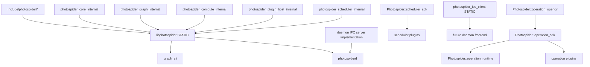
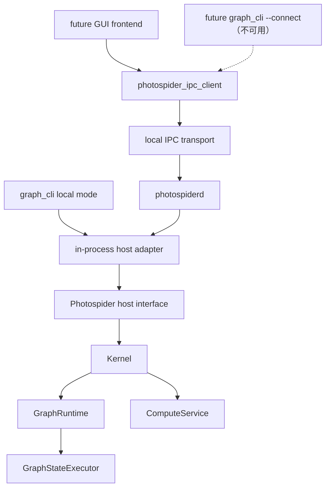

# 代码库结构方向

本文档同时记录 Photospider 当前已经具备的公开头/Host seam、静态产品和按角色归属的源码布局，
已经实现的 version 1 daemon/IPC slice，以及已完成的 extension-SDK/internal-target 拆分。下文会明确区分当前状态与
未来工作。

目标如下：

- `libphotospider` 是面向嵌入式前端的稳定静态链接目标。
- `photospiderd` 作为 foreground、同用户本地 Unix-domain sidecar，通过一个 embedded `ps::Host`
  拥有 graph session；它不是当前的 system-service、多用户、远程或 TCP 产品。
- `graph_cli` 保持为基础的交互式命令行前端。
- Frontend 既可以进程内链接 `libphotospider`，也可以用 typed client 通过 IPC 与
  `photospiderd` 交互。

## 当前摩擦

当前仓库已经具备 public Host seam、可安装静态产品、迁移后的 CLI application tree、按角色归属的
backend source tree、明确的 production plugin 目录、unit/integration 测试归属，以及 macOS/Linux
version 1 daemon/IPC graph、inspection、polling-compute、protected image-output 与 bounded
event/trace observation 以及 process-global operation-plugin router 行为。Installed typed IPC
Client 现在为精确 55-method surface 全部提供 owned call，会验证每个 typed result，并把 stable
cursor page 聚合为完整的 Host-shaped value。Installed IPC-backed Host 现在会通过 typed
short-lived connection、会等待结束的异步轮询和确定性的停止顺序，实现当前全部 53 个非析构
Host virtual。Image mode 当前会在 delivery lease 保护 result-to-open 的期间严格重新校验同用户
regular file，创建共享 read-only mapping，再释放匹配的 job/lease。最后一个 mapping owner 会且只会
执行一次 unmap 和 close。Installed IPC-only package consumer 现在已经闭合完整的
symbol/export/header contract；plugin SDK 遵循下文记录的 extension contract。

当前根 `CMakeLists.txt` 中观察到的构建目标：

| 当前 target | 当前角色 | 摩擦 |
| --- | --- | --- |
| `photospider_core_internal` | 仅用于构建的 core value、private conversion 与 registry helper。 | 按角色归属的源码也会折叠进静态产品。 |
| `photospider_graph_internal` | 仅用于构建的 `GraphModel` 与 graph-service helper。 | `GraphModel` 继续私有地位于 `src/lib/graph`。 |
| `photospider_plugin_host_internal` | 仅用于构建的 host-side operation v2 loader、adapter 与 lifetime helper。 | 不导出。 |
| `photospider_scheduler_internal` | 仅用于构建的 scheduler planning/factory、ABI-v2 loader、内置实现、纯 worker-limit planning、scheduler reservation owner 与共享 ledger primitive。 | `ResourceLedger` 实现在这里编译，但每个 composition-root `ExecutionService` 拥有唯一 Host 权威 instance。 |
| `photospider_compute_internal` | 仅用于构建的 compute、request-owned HP/RT `ComputeRun`、runtime、dirty-region 与 interaction helper。 | Run 保持私有；内建 CPU work 与 legacy scheduler owner 共享固定 multi-Run service ledger。 |
| `photospider_operation_runtime` | 可安装的静态 image-buffer factory 实现。 | 没有外部 package，也不反向链接 operation SDK。 |
| `photospider_operation_sdk` | 可安装的 operation v2 interface SDK。 | 传递链接 `operation_runtime`，是普通插件唯一所需 link target。 |
| `photospider_operation_opencv` | 可安装、显式 opt-in 的 OpenCV adapter。 | 只发现并链接 OpenCV `core`。 |
| `photospider_scheduler_sdk` | 可安装的 scheduler ABI-v2 interface SDK。 | 只携带 public include root 与 C++17 requirement；plugin 接收解析后的 `[1,8]` hard grant。 |
| `photospider` | 静态可安装后端产品，归档文件名为 `libphotospider`。 | 已符合目标静态产品和 public Host 形态，同时把按角色归属的后端源码折叠进单一归档。 |
| `photospider_cli_common` | `apps/graph_cli/` 下的静态 CLI 命令、TUI、自动补全代码、可复用 `run_graph_cli` 边界，以及两个按角色归属的 benchmark service 翻译单元。 | Benchmark 源只属于这个不可安装的 helper 与完整 CLI closure，不会进入可安装的 `photospider` 静态产品。 |
| `graph_cli` | 位于 `apps/graph_cli/main.cpp`、只负责 process policy 的入口。 | 禁用 OpenCL，拥有不依赖分配的 fatal exit policy，创建 embedded `Host` adapter，尚无 daemon-client 模式。 |
| `photospider_ipc_client` | 可安装 static typed Unix IPC client 与完整 Host adapter。 | 为 version 1 全部 55 个方法实现 typed owned call，并通过 `create_ipc_host` 实现当前全部 53 个非析构 Host virtual；不链接 backend，也不暴露 JSON/POSIX type。 |
| `photospider_ipc_server_internal` | 不安装的 router、registry 与 bounded Unix listener。 | 串行化每个 Host call，并且刻意不进入 package export。 |
| `photospiderd` | `apps/photospiderd/` 下已安装的 foreground process shell。 | 拥有一个 embedded Host、self-pipe signal policy、protected socket 与 deterministic cleanup。 |

仍遗留和刚完成修复的接口泄漏：

- 原先的 `include/graph_model.hpp` 已移到 `src/lib/graph/graph_model.hpp`；graph model state、
  dirty-region snapshot、planner summary、full task graph cache handle 和 runtime generation
  state 现在都归入私有 include root。
- 内部 `Kernel` 和 `InteractionService` facade 现在位于 `src/lib/runtime/`。它们包含 runtime、
  compute service、图服务、插件管理器和 dirty-control-lane 实现类型，因此不是 `photospider`
  链接消费者可依赖的受支持头；仍包含它们的仓库内部 target 必须获得私有 `src/lib/` include root。
  `ps::Host` 现在已经是唯一受支持的 frontend public seam。Embedded Host adapter 会把
  `ps::HostComputeRequest` 转换为内部 `Kernel::ComputeRequest`，再通过
  `InteractionService`/`Kernel` 委托执行。后续阶段只会在保持这一所有权的前提下调整内部 target
  或增加 daemon/IPC adapter，不会再引入第二套 frontend facade。
- Benchmark 与实现私有 backend 头现在都随所属角色位于 `src/lib/**`；CLI 头位于
  application-private 的 `apps/graph_cli/include/graph_cli/` 树中。原有八个过渡性 source-tree
  extension header 是：
  `include/{plugin_api,node,ps_types,image_buffer}.hpp`、
  `include/adapter/buffer_adapter_opencv.hpp`，以及
  `include/kernel/scheduler/{i_scheduler,scheduler_task_runtime,scheduler_plugin_api}.hpp`。
  它们现已删除且没有 compatibility forwarder；对应的窄 public 契约与完整 private declaration
  分别归入不同的 role-owned 目录。

当前分支已经完成的 seam 收紧：

- 原先直接提交 graph-state 工作和访问 runtime 的 escape hatch 已从 frontend contract 中移除。
  `Kernel` 和 `InteractionService` 是内部 facade；仍需要 runtime 或 graph-state 访问的测试现在必须
  显式包含 internal-only 的 `tests/support/kernel_test_access.hpp` helper，并通过
  `ps::testing::KernelTestAccess` 进行这些访问。
- Graph、compute、runtime、Host、plugin、scheduler、benchmark 与 adapter 的实现文件和私有头
  现在都位于按角色归属的 `src/lib/**` 目录。内部 target 通过私有 `src/lib/` root 构建，
  可安装 public header inventory 则继续限定在 `include/photospider/**`。
- 当前 issue #70/#71 Run/service 实现位于
  `src/lib/compute/{compute_run,execution_service}.*`，共享 accounting primitive 位于
  `src/lib/runtime/resource_ledger.*`。`Kernel` 把 session identity 与显式默认
  QoS 传给私有 request，并注入 composition-root CPU service。`ComputeService` 为每次非
  realtime HP call 创建一个 Run，并为 realtime call 创建彼此分离的 HP `Full` 与 RT
  `Interactive` 子 Run。共享 Run control 会持有对应的 full-plan/temporary storage 或
  standalone dirty staging storage，直到唯一 terminal publication。内建 CPU 的 HP/RT full、
  dirty 与 preflight work 会把具有 owned callback context 的 move-only、由 lease 支撑的
  submission 转移给固定的 multi-Run service。每个 Run 使用一个 checked complete vector
  admission；initial 与 dependent work 都会在 child grant 下进入同一个 policy-aware、受
  entry/byte 约束的 ready store，worker 再将其交换为 execution grant。每个 ready item 使用
  checked work-unit 加 4-KiB byte-quanta cost。私有无状态 Interactive/Throughput strategy 使用
  class-local Graph cost、每个 Run 不可变 class 内按 weight 归一化的 Run cost、八次成功 dispatch
  后的稳定 aging，以及 Throughput work ready 时最多连续三个 Interactive dispatch 的 burst 上限。
  可配置的受保护 headroom 只限制 active 内建 Throughput root reservation。Interactive 与过渡期
  Issue #70 legacy root 不会扣减这项 class quota，而同一个 service ledger 仍是最终物理权威；
  Throughput charge 会跟随 root，直到所有 child grant 结束。Legacy route 保留 owned callback，
  并从该 ledger 获取 CPU reservation。
  Installed header、Host value、operation ABI 与 scheduler ABI 都不会命名这些私有对象。
- dirty-region 诊断、compute planning 诊断和 scheduler trace 诊断都通过 Host 的拷贝值
  snapshot 暴露。公开头不再需要命名后端 graph/runtime/service/planning 类型或具体 scheduler
  class，就能提供这些诊断。
- 配置后的 CLI application surface 现在位于 `apps/graph_cli/`：其中包含 `main.cpp`、private
  header、implementation source、command help resource、root configuration code、REPL/TUI、
  自动补全和 terminal helper。它的完整 target closure 还只包含
  `src/lib/benchmark/benchmark_service.cpp` 与
  `src/lib/benchmark/benchmark_yaml_generator.cpp`；两者只属于不可安装的
  `photospider_cli_common`/CLI closure，不会折叠进可安装的 `photospider` 静态产品。旧的顶层 CLI
  归属位置不作为兼容 surface 保留。
- 仓库自有 operation 与 scheduler plugin 现在位于 `plugins/ops/` 和
  `plugins/schedulers/`；仅用于测试的 DSO 仍是 fixture。维护中的测试翻译单元归类到
  `tests/unit/` 与 `tests/integration/`，fixture、support 与手工 verification 各有明确角色；
  过时的 issue replay/result orchestration 已删除。
- Operation plugin 只针对 public `ps::plugin` v2 snapshot 与 host registrar 构建，不再接触 `Node`、
  `GraphModel`、`OpRegistry`、YAML 或 private cache ownership。Scheduler plugin 只针对继承式
  `IScheduler`、`SchedulerHostContext` 与 ABI-v2 handshake-gated SDK 构建，不再接触
  `GraphRuntime` 或具体 built-in scheduler header。ABI v1 会被拒绝；ABI v2 接收解析后的一到八
  hard worker grant，并且仍是受信任的 in-process contract，而不是 isolation boundary。

## 外部接口规则

外部 seam 应为：

```text
external frontend
  -> public ps::Host（唯一 frontend seam）
      -> embedded Host adapter
          -> internal InteractionService / Kernel boundary
              -> GraphRuntime / GraphModel / ComputeService implementation
```

外部代码不应包含或命名这些实现概念：

- `GraphModel`
- `GraphRuntime`
- `GraphStateExecutor`
- `ComputeService`
- `DirtyControlLane`
- `ComputePlan`
- `FullTaskGraph`
- `CpuWorkStealingScheduler` 等具体调度器类
- graph cache/traversal/io service 类

外部代码可以依赖稳定的值契约：

- graph/session 标识符
- compute request 选项
- error/result 值
- graph 和 node inspect snapshot
- scheduler status 和 trace snapshot
- dirty-region inspect view
- image 和 tile buffer 契约
- plugin operation 注册契约

这样 `InteractionService` 会作为 public `ps::Host` seam 背后的深层 backend 模块：前端可以获得
图生命周期、计算、inspect、事件、调度器配置和插件控制，而不需要学习背后的实现拓扑。

## 目标公开头

只安装 `include/photospider/` 下的头。当前没有 source-tree extension 例外、compatibility wrapper
或重复的新旧 declaration。

目标布局：

```text
include/photospider/core/
  export.hpp
  geometry.hpp
  device.hpp
  image_buffer.hpp
  graph_error.hpp
  compute_intent.hpp
  result_types.hpp
  inspection_types.hpp

include/photospider/host/
  host.hpp
  graph_session.hpp
  compute_request.hpp
  event_stream.hpp

include/photospider/plugin/
  plugin_api.hpp
  op_contract.hpp
  node_view.hpp
  opencv_adapter.hpp

include/photospider/scheduler/
  scheduler.hpp
  scheduler_task_runtime.hpp
  scheduler_plugin_api.hpp

include/photospider/ipc/
  client.hpp
  host.hpp
  protocol.hpp

include/photospider/
  public_boundary.hpp
```

头文件规则：

- 公开头不得包含 `src/` 中的文件。
- 公开头不得包含 `kernel/services/...`。
- 公开头不得暴露 `GraphModel`、`GraphRuntime` 或 `ComputeService` 拥有的可变实现状态。
- 公开头应优先使用值对象、不透明 handle、小引用和 request/result 结构。
- OpenCV 只出现在显式 opt-in 的 `plugin/opencv_adapter.hpp` 契约；operation SDK、scheduler SDK、
  Host、core 与 IPC header 都不需要它。任何 public header 都不暴露 yaml-cpp；`ImageBuffer` 继续作为
  public value contract。
- CLI、benchmark 和 test-only 头不是 public install header。

## 当前与目标源码布局

源码树应在读任何文件前就能看出所有权：

```text
include/photospider/
  core/
  host/
  plugin/
  scheduler/
  ipc/

src/lib/
  core/
  graph/
  compute/
  runtime/
  host/
  plugin/
  scheduler/
  benchmark/
  adapters/
    opencv/
    metal/
  ipc/

apps/
  graph_cli/
    main.cpp
    include/graph_cli/
    src/
      autocomplete/
      command/
    resources/help/
  photospiderd/

plugins/
  ops/
  schedulers/

tests/
  unit/
  integration/
  fixtures/
  support/
  verification/
```

所有现有 backend、plugin、维护中的测试与 version 1 IPC code 都已采用该布局。Issue #36 已创建
`src/lib/ipc/`、`include/photospider/ipc/` 与 `apps/photospiderd/`，并实现真实 daemon 行为。
Issue #38 已完成最终的 `include/photospider/{plugin,scheduler}/` 契约，把完整 private type 移入
role-owned 目录，并移除八个过渡性 extension header；没有新增 shim，也没有复制这些头。Issue #70
把纯 worker-request resolution 与 concrete instance planning 保持在 `src/lib/scheduler/`，但把唯一
Host 权威 ledger 与 move-only reservation/grant 实现放在 `src/lib/runtime/`。Issue #71 则把
内建 policy strategy 与 bounded policy store 保持为 `src/lib/compute/` 下的私有实现。这些
implementation owner 都不会成为 public Host、SDK 或 IPC type。

命名规则：

- 目录、文件、CMake target 和自由函数使用 `snake_case`。
- 类型使用 `PascalCase`。
- 方法和字段使用 `snake_case`。
- 公开 target 名称直接使用产品名，例如 `photospider` 或 `libphotospider`；helper target 使用角色名，
  例如 `photospider_graph_internal`。
- 如果已有领域名称，具体实现不要使用 `_module` 这类含糊后缀。

## 构建目标形态

当前 target 形态：

| Target | 类型 | 是否安装 | 角色 |
| --- | --- | --- | --- |
| `photospider_core_internal` | Static | 否 | 核心值、image buffer、graph error、低层 helper。 |
| `photospider_graph_internal` | Static | 否 | `GraphModel`、graph IO、traversal、cache、inspect 实现。 |
| `photospider_compute_internal` | Static | 否 | Compute planning、dirty-region state、dispatcher、scheduler interaction。 |
| `photospider_plugin_host_internal` | Static | 否 | Host 侧动态插件加载和生命周期所有权。 |
| `photospider_scheduler_internal` | Static | 否 | 内置 scheduler、ABI-v2 loader、factory/worker-limit planning、scheduler reservation ownership 与共享 `ResourceLedger` primitive。 |
| `photospider_operation_runtime` | Static | 是 | 无外部 package dependency、无 SDK 反向链接的 public image-buffer factory。 |
| `photospider_operation_sdk` | Interface | 是 | Operation v2 header，并传递链接 `operation_runtime`。 |
| `photospider_operation_opencv` | Static | 是 | 只使用 OpenCV `core` 的 opt-in public adapter。 |
| `photospider_scheduler_sdk` | Interface | 是 | 只携带 scheduler ABI-v2 header、解析后的 `[1,8]` plugin grant contract 与 C++17 usage requirement。 |
| `photospider` / `libphotospider` | Static | 是 | 面向进程内前端的公共静态库。 |
| `photospider_ipc_client` | Static | 是 | 面向 daemon 前端的客户端 IPC adapter。 |
| `photospider_cli_common` | Static | 否 | CLI 命令解析、REPL、TUI、自动补全，以及两个仅供 CLI 使用的 benchmark service 翻译单元；它们都不会进入可安装静态产品。 |
| `graph_cli` | Executable | 否 | 基础交互式前端。 |
| `photospider_ipc_server_internal` | Static | 否 | Version 1 router、session/admission registry、joined compute-request registry、protected listener 与 worker lifecycle。 |
| `photospiderd` | Executable | 是 | 拥有一个 embedded `ps::Host` 与 IPC server 的 foreground daemon。 |
| operation plugins | Shared | 可选 | 动态加载的操作扩展。 |
| scheduler plugins | Shared | 可选 | 动态加载的调度器扩展。 |

Target 依赖方向：



CMake 规则：

- 内部 target 可以把 `src/lib/` 作为 `PRIVATE` include root。
- 可安装 target 只暴露 `include/photospider`。
- 安装边界只复制 `include/photospider/**` 下的头文件。`src/lib/` 下的实现头不会进入安装包，
  `photospider` 产品仍把 `src/lib/` 保持为 private include root。
- install/export 配置将 `photospider` 设为可安装的 `STATIC` target，只安装
  `include/photospider/**`，并通过 `PhotospiderConfig.cmake` 导出
  `Photospider::photospider`。Unix-like 工具链生成 `libphotospider.a`，MSVC 生成
  `photospider.lib`。
- `photospider` 的 build-tree consumer 会获得一个生成的 public include root，其中只包含
  `photospider/` forwarding header。源码树 `include/photospider/**` inventory 通过
  `CONFIGURE_DEPENDS` 跟踪，因此新增或删除 header 会重新生成 forwarding tree，不依赖 symlink
  权限；header 内容直接来自实时 source file。源码树的 `include/` 和 `src/lib/` root 仍是仓库
  target 的私有实现 include path；仓库插件只获得 generated public include root。
- 静态产品归档会把产品实现源码直接折叠进 `photospider`。仓库内部的静态 helper 模块仍可用于本地构建组织，
  但不会导出给 package consumer。
- 后续可以作为显式兼容产品添加共享库，但不应让共享库继续充当主要后端。
- 当前 operation plugin 导出 `register_photospider_ops_v2`，并从 host 接收
  `ps::plugin::OperationPluginRegistrar`。它们不再仅为了共享 `OpRegistry` 而链接 `photospider`；
  普通插件只链接 `Photospider::operation_sdk`，使用 OpenCV adapter 的插件还链接
  `Photospider::operation_opencv`，并自行声明算法所需的其他 module。
- OpenCV（`core`、`imgproc`、`imgcodecs`、`videoio`）、`yaml-cpp` 和 `Threads` 是静态归档的
  link-only 实现依赖。安装后的 `Photospider::photospider` target 会在
  `INTERFACE_LINK_LIBRARIES` 中把它们记录为 `$<LINK_ONLY:...>` entry。
  `PhotospiderConfig.cmake` 会寻找这些依赖，因而外部嵌入式 consumer
  可以链接导出的 target，但 public Host/core 头不要求 OpenCV 或 `yaml-cpp` 类型。
  `${CMAKE_DL_LIBS}` 只在 CMake 判断目标平台需要时加入 dynamic-loader 库。
- Package component 为 `embedded`、`ipc_client`、`operation_sdk`、`operation_runtime`、
  `operation_opencv` 与 `scheduler_sdk`。省略 component 时使用 `embedded`，并保留上述 dependency
  行为。`scheduler_sdk`、`operation_sdk` 和 `operation_runtime` 不解析外部 package；
  `operation_opencv` 只解析 OpenCV `core`；显式 required `ipc_client` component 只解析 Threads；optional
  `embedded` 的 backend dependency 不可用时，该 component 会成为 not-found，但不会使 required
  IPC component 无效。Unknown required component 会失败；IPC-disabled install 中的 required
  IPC component 也会失败。
- 在 Apple 平台，静态产品为 Objective-C++ runtime 源码携带系统 `Metal` 和 `Foundation` framework
  链接标志。Metal operation plugin 及其 `CoreImage`/`CoreVideo` 依赖仍是可选 runtime plugin artifact，
  不是 public package requirement。
- 在 Windows 上，导出 target 会传播 `PHOTOSPIDER_STATIC`，因此 consumer 链接 `.lib` 静态归档时，
  public declaration 不会带上 DLL import/export 标注。Dynamic operation plugin 的导出使用
  `PHOTOSPIDER_OPERATION_PLUGIN_EXPORT`，与静态产品边界彼此独立。
- FTXUI 和 `photospider_cli_common` 是 CLI-only 依赖，不属于 embedded package export。
  Operation 与 scheduler plugin DSO 仍是 runtime extension artifact，不是
  `Photospider::photospider` 的依赖。
- `apps/graph_cli/include/graph_cli/**` 是 private application include tree。CMake 只把它暴露给
  `photospider_cli_common`、`graph_cli` 和聚焦 CLI 测试；install rule 仍只复制
  `include/photospider/**`。
- `graph_cli` 当前只链接 `libphotospider`，保持 local/embedded；remote CLI mode 属后续工作。
- `photospiderd` 链接 `libphotospider` 与不安装的 IPC server，并拥有一个 embedded
  `ps::Host`。Installed client target 直接包含 codec object，不导出 backend、JSON target 或
  server-internal target dependency。
- Operation plugin 不应仅为了访问 registry 符号而链接宽泛共享后端。当前实现使用 host-provided
  `ps::plugin::OperationPluginRegistrar` callback 和带版本的 `register_photospider_ops_v2` 入口。
  Scheduler plugin 在 discovery 前使用精确 ABI-v2 数字 handshake，接收解析后的 `[1,8]` hard
  worker grant，并且只通过 `SchedulerHostContext` attach。ABI v1 不提供 adapter 或 compatibility
  registration。两类当前接口仍是临时 C++ ABI：C linkage entrypoint/handshake 只拦截 identity 或
  generation，而 C++ value、callback、class/vtable object、allocator/runtime、exception 与 RTTI
  仍要求匹配 SDK 和兼容工具链。未来纯 C plugin ABI 仍应作为单独版本化 compatibility change。

## 目标进程执行组合边界

[ADR 0007](../../adr/zh/0007-compute-runs-and-process-execution-have-separate-owners.zh.md)
固定完整的进程执行所有权。其 issue #69 私有 HP/RT Run、稳定 lease/复合 identity、
owned ready-submission 与注入的 multi-Run CPU service 切片现在已经位于当前
`src/lib/compute/`。Issue #70 的完整 resource admission 与 issue #71 的内建 policy-aware ready
store 也已在该处成为当前实现。`EmbeddedHostState` 会在 Kernel 前构造该 owner，Kernel 再把它
注入 request-local `ComputeService`，不使用 static singleton。`RunGroup`、revision-safe commit、
cancellation、supersession 与最终 lifecycle fence 仍是目标布局。

在该目标中：

- `GraphRuntime` 仍以 graph 为作用域，拥有 Graph state、graph-state lane、revision capture/commit
  validation、稳定 graph-instance identity 与 lifetime anchor、event 与 platform/session
  metadata；
- 当前 `ComputeRun` 的共享 control 拥有非 realtime HP Run，以及 realtime call 中彼此分离的
  HP `Full`/RT `Interactive` 子 Run，包括 descriptor/phase/terminal state 与对应的
  full-plan/temporary storage 或 standalone dirty staging storage；scheduler-backed full HP
  work 会保留不可伪造的 lease 与复合 task identity，目标则会把该 owner 扩展到 cancellation
  与 reservation；
- request-owned `RunGroup` coordination 让 HP 与 RT 保持为独立 Run，只在两个 child 按确定性
  规则 settle 后返回 RT output，并且绝不创建 cross-domain task dependency；
- 当前 `ExecutionService` 拥有一个固定的内建 CPU worker pool、一个 Host 权威 ledger、
  policy-aware、受 entry/byte 约束的 ready store、checked full-vector Run admission、work/byte
  cost、class-local Graph/weighted-Run 公平性、稳定 aging、三个 Interactive dispatch 的 burst
  上限、与精确 root lifetime 一致的 Throughput-owned protected-headroom accounting、并发
  multi-Graph Run、exact reservation/grant release，以及按 Run 隔离的 completion、first-failure、
  trace 与 Host-context routing。Interactive 与过渡期 Issue #70 legacy root 不会扣减 Throughput
  class quota；后续 slice 会增加通用 resource execution 与最终 lifecycle fence，但不会移动 ledger
  authority；
- 其私有 `RunLifecycleRegistry` 提供唯一 process admission/Graph-close/process-shutdown
  fence、pending-candidate tracking、按 Graph 建索引且由 registry 持有的 `RunLease` entry 与
  process enumeration，同时不拥有 Run plan、dispatcher、terminal state、Graph state 或 resource
  token；
- 内部 Host 权威 `ResourceLedger` 是唯一的 reservation 与 grant mint；以及
- 当前私有无状态 `SchedulerPolicy` strategy 只排列 work：Interactive 会在已选 class 的
  class-local 公平 score 前考虑显式 deadline，Throughput 则直接使用自己 class-local 的 score。
  Policy 不拥有 worker、queue、token、native resource、Run 或 Graph state；替代用
  scheduler-policy ABI 仍是未来工作。

该所有权目标不为后续 policy/general-resource slice 选择新的源码目录、build target 或 plugin ABI
shape；这些选择属于对应 implementation work。旧的 worker-only budget 已经作为完整迁移被删除，
没有 wrapper、alias 或重复 authority。当前拥有 worker 的 scheduler SDK 会保留到另行排期的 ABI
replacement。

## Daemon 形态

`photospiderd` 是一个带小型 process shell 的 executable，背后是深层 Host-only server module。

其当前 capability profile 是同用户本地 workstation sidecar：保持前台运行，只监听受保护的
Unix-domain socket，并恰好创建一个 embedded Host。它不是后台 system service、多用户或
multi-tenant service、远程 endpoint 或 TCP server。这些角色需要独立的 control-plane、transport、
identity、authorization、isolation 与 lifecycle 设计。

进程职责：

- 创建并拥有一个 embedded `ps::Host`
- 通过已安装 typed version 1 client 暴露 ping/version、graph load/close/list 与 graph/node/
  dependency-tree inspection
- 接受文档定义的 typed graph reload/save/clear、node YAML、node-list、cache、dirty
  lifecycle、ROI、timing、last-IO 与 last-error request，并把每个 request 路由到恰好一次匹配的
  Host call
- 拥有 bounded polling compute job，并把成功的 nonempty image result materialize 为带 stable
  delivery lease 的 protected metadata-only artifact
- 通过匹配的 Host observation API 直接路由 bounded destructive compute-event drain 与
  non-destructive scheduler trace page
- 强制 per-user directory/socket permission 与安全 live/stale handling
- 通过 self-pipe 转换 SIGINT/SIGTERM，并执行 deterministic worker、session、Host 与 socket
  cleanup
- 保持 foreground-only，不提供 protocol shutdown method、pid file、TCP listener 或 daemonizing
  fork

它不应重复 graph 或 compute 逻辑。所有 graph-state operation 仍通过进程内前端使用的同一个 host 接口流转。

推荐运行时图：

GUI branch 是可用的 future consumer shape。虚线 CLI branch 仅表示方向：version 1 未实现
`graph_cli --connect`，当前 CLI construction 仍为 embedded。



关键 seam 是 host interface，而不是 transport。如果 in-process adapter 和 IPC adapter 都满足同一个前端接口，
前端即可选择本地嵌入或 daemon 模式，而不用学习两套不同的 graph/compute 语义。

## IPC 协议方向

精确维护的 version 1 wire、typed client、opaque-session、socket 与 shutdown contract 位于
`IPC-Protocol-v1.zh.md`；本节把已实现 slice 放进更长期 migration direction。

已实现的 version 1 transport：

- macOS/Linux 使用 Unix domain socket。
- macOS/Linux 之外 IPC disabled；named pipe 保留为后续 Windows 工作。
- 不实现 TCP listener 或 remote/multi-user access mode；这是同用户本地 sidecar，而不是通用
  service endpoint。
- Socket path 按用户隔离，优先使用合法 `$XDG_RUNTIME_DIR`，否则使用
  `/tmp/photospider-<uid>`。
- Daemon-created directory 为 `0700`；bind 在 umask `0177` 下直接以精确 `0600` 创建
  socket。
- 持久 mode-`0600` `${socket}.lock` 会在不跟随 symlink 的前提下打开，并从 stale-path 检查到
  经过 identity 检查的 socket cleanup 全程持有 nonblocking exclusive `flock`；lock inode
  永不删除。Listener ownership 只会按 Candidate capture、由原 accept queue 观察到的真实 framed
  pathname self-connect、最终 fixed-dirfd revalidation、无分配 cleanup activation 的顺序推进。
  Proof 期间的 connect/write/accept/prefix classification 共享单一可取消绝对 deadline；backlog
  不保留 proof slot。Non-probe client 保持有界，并且只在 router runtime 启动后进入普通
  admission。保存的 scalar parent identity 会使稳定 rename/recreation fail closed，Active cleanup
  会先 unlink 再关闭 listener。
  Portable POSIX 无法使最终 pathname revalidation 与 unlink 对 same-uid writer 保持原子性；
  权威边界见 `IPC-Protocol-v1.zh.md`。

已实现的 version 1 协议：

- 使用 four-byte big-endian bounded length，随后是 UTF-8 JSON object text。
- 每个 request 都有 required integer `protocol_version`、nonempty bounded id、method name 与
  params object；duplicate key 会被拒绝。
- 每个 response 使用同一个 id，返回 result object 或 error object。
- 请求/响应方法稳定后，再添加事件流 notification。

不建议第一版使用 newline-delimited JSON，因为日志、多行诊断和未来二进制元数据会让 frame 解析变得含糊。
除非项目明确接受生成代码、更大的依赖面和更复杂的插件/构建故事，否则第一步不建议使用 gRPC。

Method group 与当前 wire availability：

| Group | 示例方法 | 说明 |
| --- | --- | --- |
| daemon | `daemon.ping`, `daemon.version` | 已实现，且不获取 Host lock。`daemon.version.methods` 返回精确排序的 55-method inventory；installed typed Client 为每个 advertised method 提供 owned call，且没有 raw-JSON call。 |
| graph | `graph.load`, `graph.close`, `graph.list`, `graph.reload`, `graph.save`, `graph.clear`, `graph.node_yaml.get`, `graph.node_yaml.set` | 已通过 Host 实现。Status-only mutation 使用 `result:{}`；清空 model state 后保留 opaque session mapping。 |
| inspect | `inspect.graph`, `inspect.node`, `inspect.dependency_tree`, `inspect.node_ids`, `inspect.ending_nodes`, `inspect.roi_forward`, `inspect.roi_backward`, `inspect.dirty_region`, `inspect.compute_planning`, `inspect.recent_compute_planning`, `inspect.traversal_orders`, `inspect.traversal_details`, `inspect.trees_containing_node` | 已通过 copied Host value 实现。Full-value collection 使用 stable bounded cursor page；node/ROI/dirty/current-planning value 保持 indivisible direct result。Host order 与 duplicate 均保留。 |
| dirty | `dirty.begin`, `dirty.update`, `dirty.end` | 已通过一次匹配的 Host lifecycle mutation 实现，并返回 copied dirty-region snapshot；完整 compact response size 会在 result-DOM 分配前完成 preflight。 |
| cache | `cache.clear_all`, `cache.clear_drive`, `cache.clear_memory`, `cache.cache_all_nodes`, `cache.free_transient`, `cache.synchronize_disk` | 已作为 status-only Host call 实现；result 不包含 backend cache handle 或 path。 |
| compute | `compute.submit`, `compute.status`, `compute.result`, `compute.release`, `compute.timing`, `compute.last_io_time`, `compute.last_error` | Polling job 与 diagnostic 已路由。Submit/status/result 使用 stable `{compute_id,session_id,state,cancellable,status,output}` value；state 精确为 `queued`、`running`、`succeeded` 与 `failed`，每个 job 都报告 `cancellable:false`。Submit、status、status-mode result、empty-image result 与 failed result 的 `output` 保持 null。Terminal nonempty image result 会重新验证 protected artifact、刷新一个 stable 60-second delivery lease，并返回规定的 metadata object。Terminal release 原子返回 `{compute_id,released:true}`，接受 optional exact `delivery_id`，并且在 normal job removal 后仍能释放 matching orphaned lease。Timing 会对 aggregate compact response size 做 preflight；last error 是 nested diagnostic data。 |
| scheduler | `scheduler.types`、`scheduler.description`、`scheduler.scan`、`scheduler.load`、`scheduler.loaded_plugins`、`scheduler.configure_defaults`、`scheduler.info`、`scheduler.replace`、`scheduler.trace` | 只通过匹配 Host call 实现，并已在精确 55-method inventory 中公布。Default 只接受 `[0,8]` 内的精确 `worker_count`；router 会在访问 Host 前拒绝 malformed 或更大值，connected typed Client 则会在写 frame 前拒绝更大值。Discovery/default control 是 process-global；info/replacement 使用 opaque session admission，并与 compute/close 共享 graph-state 串行化。Embedded Host 会组合一个不可远程配置的 `ExecutionService`，其默认 ledger 有 32 个 CPU slot；Run callback 与 legacy scheduler owner 共享该 authority。Installed typed Client 暴露全部 route，会聚合 type/plugin snapshot，并严格验证 bounded non-destructive trace page，且不保留 scheduler/plugin ownership。 |
| plugins | `plugins.load_report`、`plugins.unload_all`、`plugins.seed_builtins`、`plugins.ops_sources`、`plugins.ops_combined_keys`、`plugins.ops_combined_sources` | 只通过匹配 Host call 实现，并已在精确 55-method inventory 中公布。Installed typed Client 暴露全部 route、解码 exact report，并聚合按 key 排序的 stable view；Client 断开不会 unload 成功的 process-owned DSO。 |
| events | `events.drain` | Bounded destructive event drain 已通过 Host 路由；installed typed Client 将其暴露为一次严格验证且不重试的 Host event batch。 |

图像 payload 规则：

- Image byte 不进入 JSON。
- Private OutputStore 会把通过验证的 CPU image materialize 为 exact tight-row mode-`0600`
  artifact，存放在 same-owner mode-`0700`
  `<socket>.outputs/instance-<server_instance_id>` directory 下。Publication 受 quota 限制且
  atomic；live access 与 cleanup 会在不跟随 symlink 的前提下重新验证 filesystem identity。
- Private compute registry 保留 move-only OutputStore ownership；optional lease-aware release、
  eviction、TTL expiry 或 shutdown 时，其 exact-once cleanup 会在 registry mutex 外执行。
  每次 image result 成功后，一个 stable delivery id 最多保护一个会被刷新为 60 秒的 lease。
- Submit/status，以及 non-image、empty-image 或 failed result 的 stable nullable `output` field
  保持 null。Terminal nonempty image result 只返回 `output_id`、`delivery_id`、protected
  absolute artifact path、width、height、channels、data type、CPU device、tight row step、byte
  size、filesystem device 与 inode。Registry 的 opaque reference 只会作为该规范化 `output_id`
  出现；JSON 中不会出现额外 `output_reference` field、backend handle、pixel byte、backend cache
  path、image-library object 或 caller-selected result path。
- `compute.release` 会在 mutation 前验证 optional stable delivery id。Matching id 会一起释放
  job ownership 与 lease；如果 normal job release、terminal eviction 或 job TTL 已经删除 record，
  同一 `(compute_id, delivery_id)` 仍可释放幸存的 orphan lease。

Collection snapshot 规则：

- Router 拥有一个 private type-erased `CollectionSnapshotRegistry`；它不新增 Host page API、
  public ABI type、独立 page route 或 cursor release method。Runtime start 会启用 registry
  admission，shutdown 开始时停止 admission，final shutdown 会清空其 record 与 reservation。
- Private admission API 会预留一个 slot 与 64 MiB。Production 最多保留 64 records/256 MiB。
  Publication 接受由 caller 测量且不超过 262,144 recursive public entries/64 MiB 的 value，把
  multi-page value move 进 stable storage，并把 worst-case reservation 换成精确 measured byte。
  Recursive entry 包含 outer vector/map row、node parameter map、存在的 spatial matrix、
  dependency root/entry 与 nested node、traversal branch vector，以及 planning sample/dependency
  vector；scalar object member 不计数。Registry 会独立保留真实 top-level row count，并拒绝少报的
  recursive count；被拒绝的 publication 不产生 cursor 或 retained copy。
- 唯一一次 Host call 返回后，dependency 与 traversal value 会在 shared-header/root copy 或
  map-to-vector allocation 前完成 recursive pre-scan。Dependency byte accounting 会以精确 measured
  entries array 替换 header 的 empty `entries: []` token，因此该 array 只计量一次。
- 首个 request 使用 optional `limit`；continuation 会调用同一 method，携带 frozen typed
  parameter，以及 `cursor`、精确 next `offset` 和 `limit`。Result 保留其 collection field，并新增
  `offset`/`has_more`/nullable `cursor`。32-hex cursor 会冻结精确
  method/session/original-parameter identity。Continuation 只使用 retained value，无需
  live-session lookup，在 graph close 后仍可读取，不刷新 15-minute TTL，final page 会原子释放
  record。
- 逐 row 测量会计算并冻结 dynamic page ceiling，保证每个连续 page 都能装入 16 MiB frame；
  计算包含合法 id 的最坏 escaping 与 page metadata。单个 indivisible oversize row 会在 cursor
  publication 前被拒绝；能够装入的小 value 保持完整 single page。
- Binding/type/offset mismatch 与 unknown well-formed cursor 会返回 private `CursorNotFound`，且
  不会推进 retained record；malformed cursor/page arithmetic 会返回 private `InvalidParams`，且
  不改变 record。TTL expiry 会删除 record 并释放其 measured quota。Injected limit、clock 与 id
  支持 deterministic race test。Graph listing、node list、graph/tree inspection、traversal branch、
  tree membership 与 recent planning history 会 reserve 并 page 这些 record。

错误规则：

- `OperationStatus` 与 `OperationErrorDomain` 是 embedded/IPC Host 唯一的 public status
  vocabulary。Canonical success 使用 domain `none`、signed code zero 与空 name/message。
- Recoverable failure 会精确保留 `transport`、`protocol`、`graph` 或 `daemon` 之一，并携带一个
  signed code 与 stable name。当前 Graph code 使用显式 `GraphErrc` 1..9 mapping；transport
  绝不会被改写为 Graph IO。
- Diagnostic `message` 只提供 bounded human-readable context。Client behavior 必须按
  domain/code/name 分支，绝不解析该文本。

并发规则：

- Daemon 最多接受 32 个 tracked client worker。
- Host 不承诺 thread safety，因此每个 Host call 都使用一个 daemon-owned mutex；socket IO 绝不
  持有它。
- Ping/version 与 protocol validation 不获取 Host mutex。
- Compute job 报告 literal `cancellable:false`，只会经过 `queued`、`running`、`succeeded` 或
  `failed`，通过唯一 joined FIFO worker 执行，并且精确调用一次匹配的 synchronous Host
  compute call。
- Session close 会先把 row 标记为 closing，再等待 admitted Host call 与 queued/running job；只有
  此后才可以获取 Host mutex。
- Process shutdown 会停止 session/compute admission 与新 delivery lease，drain 并 join compute，
  释放 terminal job ownership，等待 active lease 被释放或过期，最后才关闭 Host session。

## 迁移状态与剩余顺序

Frontend boundary、物理布局、daemon、typed Client、完整 IPC Host 与 extension SDK 的第 1-8 步都已
在当前仓库落地，且没有改变 `ps::Host` 作为唯一 public seam 的地位。

Issue #43 在 per-Graph scheduler model 外增加了 bounded migration gate，Issue #69 为来自多个
Graph 的内建 CPU HP/RT full、dirty 与 preflight work 增加了一个固定 `ExecutionService` pool。
Issue #70 现在已完全替换旧的 process-static worker counter。每个 embedded Host 都会组合一个
具有显式 limit 的 service-owned ledger；内建 CPU Run 与 legacy serial/GPU/plugin scheduler
owner 共享原子 CPU admission。Graph load 会原子预留 legacy HP/RT scheduler pair；replacement
会保留旧 reservation 直到 candidate 发布；scheduler destruction 先于精确释放。内建 CPU Run
会在发布前预留完整且经过 checked arithmetic 的 CPU、retained-memory、scratch、ready-entry 与
ready-byte vector；其 initial 与 dependent work 共享同一个受 entry/byte 约束的 ready store。
Issue #71 现在增加了私有无状态 Interactive/Throughput strategy、经过检查的 work/byte cost、
class-local Graph/weighted-Run 公平、稳定 aging、三个 Interactive dispatch 的 burst 上限，以及
与精确 root lifetime 一致的 Throughput-owned protected-headroom charge，且不改变 ledger 的最终
权威或 Issue #70 的 full-ledger legacy capacity。#72–#74 增加 revision、cancellation 与
supersession；#75 替换拥有 worker 的 ABI；#76 收束 lifecycle 与 telemetry 不变量。权威的无环
依赖表位于
[内核演进目标](../../roadmap/zh/Kernel-Evolution.zh.md#交付依赖契约)。

1. **已完成：** 建立 public header 安装与 self-containment 边界。
   - 只安装 `include/photospider/**` 下的头文件；`src/lib/` 下的实现头保持在 package 之外。
   - `PublicHeaderSelfContainment` 通过 CTest 构建
     `public_header_self_containment` target。CMake 为 `include/photospider/` 下的每个头文件生成
     一个 translation unit。一个 object target 仅通过 public include root 以 C++17 编译所有非
     OpenCV 头；另一个 object target 仅使用声明的 `Photospider::operation_opencv` usage
     requirements 编译 `plugin/opencv_adapter.hpp`。聚合 target 同时依赖两者，因此可选 OpenCV
     依赖不会掩盖 core、Host、IPC、operation-SDK 或 scheduler 头的意外耦合。
   - `include/photospider/public_boundary.hpp` 仍是可安装 include root 的 marker 头。
     稳定值契约位于 `include/photospider/core/` 下。
2. **已完成：** 引入 `include/photospider/*`。
   - 先移动稳定值契约：error、result/status 值、compute intent、无 OpenCV 依赖的
     image/tile buffer 值和 inspect snapshot。
   - 保持 `GraphModel`、`GraphRuntime` 和 compute planning 头为内部实现。
3. **已完成：** 创建 host interface。
   - 将 `InteractionService` 保持在稳定 public `ps::Host` 模块背后。
   - 从公开头移除 raw `Kernel&`、`GraphRuntime&` 和模板化 `GraphModel&` submit 这类外部逃逸口。
4. **已完成：** 重命名构建输出。
   - 将可安装静态目标设为 `photospider`/`libphotospider`。
   - 内部静态模块保持 private。
5. **现有代码已完成：** 拆分 application、backend、plugin 与 test 所有权。
   - `graph_cli`/`photospider_cli_common` 的 application source、private-header、configuration
     与 resource surface 现在位于 `apps/graph_cli/`。完整 target closure 还精确拥有
     `src/lib/benchmark/` 下两个按角色归属的 benchmark service 翻译单元；它们只属于不可安装的
     CLI helper/closure，不会进入可安装静态产品。
   - 现有 backend 实现/私有头位于按角色归属的 `src/lib/**`；production plugin 位于
     `plugins/**`；维护中的测试位于明确的 unit/integration/fixture/support/verification 角色。
   - 物理迁移保持现有 target 与 test 身份，不隐含内部 target rename 或重新设计。
6. **已完成 daemon slice：** `apps/photospiderd/` 现在拥有 foreground process、self-pipe
   signal、protected socket、bounded worker 与 deterministic cleanup。
7. **已完成 task 4.4 IPC Host adapter、制品与 package slice：** Installable typed
   client 为全部 55 个 method
   提供 owned call，严格验证 common 与 method-specific result shape，对每个 status 或 mutation
   RPC 只尝试一次，聚合全部 private stable cursor page，并保留 output/delivery lease metadata。
   `create_ipc_host(socket_path)` 通过为普通调用创建新的 typed connection，并为 async compute
   使用会等待结束的 worker，实现当前全部 53 个非析构 Host virtual。Polling 立即开始，随后按
   10/20/40/80/160/320/500 ms 等待，并以 500 ms 为上限；同步调用没有总超时。析构会发布
   stop、唤醒 waiter、shutdown 活动 worker descriptor、把未完成 future 解析为 Transport code 5
   `client_stopped`，再等待每个 worker 结束；不会重新提交、关闭 session、卸载 plugin 或回退到
   embedded execution。Image consumer 会在 delivery lease 有效期间以不跟随符号链接的方式打开
   制品，校验同用户 regular type、精确 mode、单链接、device/inode/size 与 tight layout，再创建
   共享 read-only mapping，随后执行匹配的 lease-aware release。最后一个 owner 会且只会执行一次
   unmap 和 close。Installed package 门禁会编译每个 public header，再使用
   `COMPONENTS ipc_client` 且禁用 backend package discovery，独立 configure 一个 IPC-only
   external consumer。该 consumer 覆盖每个 Client lifecycle symbol、精确且唯一的全部 55 个
   typed Client call、`create_ipc_host` 与全部 53 个 Host virtual 引用；export 只允许
   `Threads::Threads`。Installed IPC-header gate 正向只允许当前 C++ standard-library include set
   与已安装的 `photospider/` public include，并明确拒绝 raw JSON、socket address/descriptor、
   file identity、file mapping 与 backend declaration。这是精确的 tested boundary，不声称穷举
   POSIX vocabulary。Cancellation 仍不可用。
8. **已完成 plugin boundary 工作：** Issue #38 已收紧两套 extension SDK，issue #43 又把
   scheduler contract 推进到 ABI v2。
   - Operation plugin 使用与 host 无关的 v2 snapshot 和 host-provided registrar；scheduler plugin 使用
     继承式 minimal runtime、`SchedulerHostContext`、第一调用数字 ABI handshake，以及解析后的
     `[1,8]` hard grant。ABI v1 没有兼容路径。
   - 八个旧 header 和五个旧 internal helper target 名均已移除，没有 compatibility wrapper 或 alias。
     Installed external consumer 会从 package SDK 构建两种 DSO，并通过 embedded Host 实际执行它们。
   - 长期 integration coverage 还会通过仓库内 embedded Host、真实 `photospiderd` IPC 进程与真实
     `graph_cli` 进程分别运行一条 external operation、external scheduler 与 compute 链路。
     Operation 产生的 ROI 与 scheduler fixture gate 会证明实际调用，而不只是成功发现。

## 验证期望

任何根据本文档推进的实现变更，都应：

- 本地验证范围应匹配改动边界：实现期间运行 scoped static check、受影响 build target 与
  focused regression。本地 full build 或完整 CTest/JUnit 不是常设要求。GitHub Actions 是远程
  integration 环境；不要把 Docker 或本地 `linux/amd64` 模拟作为常规 preflight。
- Daemon boundary 改动时构建 `photospider_ipc_client`、
  `photospider_ipc_server_internal`、`photospiderd` 与 focused IPC test；`graph_cli` 保持
  embedded/local regression target。
- 将 embedded Host、真实 daemon IPC 与 `GraphCliPluginComputeSmoke` 路径作为长期 runtime test
  保留。每条路径都会加载 lifecycle operation v2 DSO 与 destroy-count scheduler DSO，选择 external
  HP scheduler，并执行 parallel compute。Host 与 daemon 路径会检查结果的 `11x7` absolute ROI；
  daemon 与 CLI 路径还要求 scheduler fixture 的 `compute_gate_wait`/`compute_gate_release` event。
  CLI smoke 还会要求输出中的 active scheduler 名与 compute 后 ROI。其 config、graph、cache、trace、
  FIFO 与 history home 都是 build tree 中的临时内容，不属于 overlay 或 issue-specific evidence。
- 对静态 package 工作，package consumer smoke test 应保留在 CTest 中，因为它执行真实 producer
  build/install、外部 find-package、public-header compile/link/run、安装后的 export/dependency、
  平台与 multi-configuration 边界。它还会仅用 installed SDK target 构建 operation/scheduler DSO，
  再让 embedded Host 加载两者、选择 external scheduler、提交工作并通过 external operation 完成计算。
  脚本在内存中检查这些不变量，把命令和失败详情直接输出到
  stdout/stderr 供 CTest 捕获，并且只在 build tree 下使用正常的临时 install/consumer 工作目录。
  它不生成 expected/actual/compare/summary 报告，也不得依赖 Git identity、patch hash、replay、
  provenance 或迁移完成度。
- 将 `PublicHeaderSelfContainment` 作为长期编译边界检查保留在 CTest 中。它为每个可安装 public
  header 生成一个 translation unit；所有非 OpenCV 头只通过 public include root 以 C++17 编译。
  Opt-in OpenCV adapter 在独立 object target 中仅使用 `Photospider::operation_opencv`；任一依赖隔离
  分组无法独立编译时，聚合检查即失败。
- CMake 3.16 是兼容性下限，不是每个 pull request 的固定版本门禁。应保护较新的 policy，依靠
  当前 CI package consumer，并且只在 compatibility-sensitive change 或 release check 确有需要时
  运行针对性的原生旧版本 producer/install/consumer 路径；不得用架构模拟替代原生 runtime。
- 迁移 residue、phase 完成度、陈旧术语和源码布局检查是临时开发检查，不是软件行为测试。
  不得把它们注册到 CTest 或 CI，也不得在 primary repository 中长期保留其 issue 专属编排。
- CLI catch-order 与 Doxygen audit 输入必须从真实 CMake target closure 与 compilation database
  或 CMake File API 派生。若 `photospider_cli_common` 或 `graph_cli` 的任一 source（包括
  `apps/graph_cli/src/cli_config.cpp`、`apps/graph_cli/src/run_graph_cli.cpp` 与
  `apps/graph_cli/main.cpp` 等 root translation unit）遗漏，或无法匹配 compile command，audit 应
  fail-closed。该 Doxygen/source-quality audit
  是有文档记录的手工工具，不属于 CTest 或 CI entry。
- 手工 CLI Doxygen audit 还要为没有独立 compilation database row 的 application-private header
  维护 fail-closed companion manifest。该清单覆盖 dependency-tree formatter、traversal、两套
  node editor、CLI completer、每个拆分的 autocomplete definition、相关类型与重要字段，以及匿名
  formatter helper，还包括 `node_editor.cpp` 中已有注释的局部类型、命名 lambda、option callback、
  renderer 和 `CatchEvent` callback。同名 callback member 必须使用显式实体定位，不能只匹配首个
  名称。每个必需实现都必须仍属于配置后的 target closure，并拥有精确 compile command；每个清单
  实体都必须保留紧邻的完整 Doxygen block。Callable 必须具备 `@brief`、`@return`、`@throws`、
  `@note`，且每个实际参数都要有唯一对应的 `@param`；type 必须具备 `@brief`、`@throws`、`@note`；
  field 只要求 `@brief`。Definition 只有在完整目标精确等于 manifest 中的 global symbol 或
  `CliAutocompleter` member/constructor 时，才可改用 `@copydoc`。缺文件、缺 inventory row、缺
  compile command、缺 tag、缺参数或缺注释都必须使 audit 失败。工具的负向自检必须在 `/tmp`
  复制真实源码和 manifest，分别删除注释、改错 copy target、删除参数 tag、删除 inventory row，
  并要求每个 mutation 都通过正常 scanner/compare 路径失败。
  应使用配置后的 `compile_commands.json` 显式运行该工具，并把临时 observation 写到仓库外；
  不得将它注册到 CTest/CI，也不得创建 `tests/results` artifact。
- 维护 real-process IPC integration test：启动 `photospiderd`，通过 public typed client 与
  malformed raw frame 验证行为。
- 将 non-installed `ipc_output_fixture_daemon` 只作为该 integration test 的 dependency，而不为
  它单独注册 CTest entry。它会在独立进程中使用 deterministic test Host 运行真实 internal
  Server/router/OutputStore/Unix-socket/worker stack，从而在不改变 `photospiderd` startup、也不
  在 fixture 中 seed plugin 的前提下，覆盖 protected image delivery、bounded observation
  multiclient behavior 与 restart cleanup。Real product daemon test 另行通过 Host-only plugin route
  加载仓库 lifecycle operation DSO，并检查 cross-client visibility。它的
  fixture-only CLI 接受 protected fixed-width monotonic-clock control file，并通过 private internal
  Server overload 注入较小的既有 snapshot/job/output limit、clock 与 id generator；这些 control
  都不属于 `photospiderd`、其 environment 或 wire。
- 对 daemon lifecycle 变更，覆盖 startup、graph load、compute 或 inspect、client disconnect、
  signal shutdown 和 socket cleanup 行为。

## 待决问题

以下决策属于 version 1 之外的未来工作；当前 `graph_cli` construction 始终为 embedded，不会
探测或自动连接 daemon：
- `graph_cli` 是否永远默认本地进程内模式，还是在存在 daemon socket 时自动连接 `photospiderd`。

## 参考仓库

这个结构方向借鉴成熟 C/C++ 项目的宽泛实践：

- LLVM 明确维护编码约定和接口期望：
  <https://llvm.org/docs/CodingStandards.html>
- FFmpeg 区分库、工具和开发者契约：
  <https://ffmpeg.org/developer.html>
- Krita 区分应用外壳、插件和核心库，同时维护 C++ 约定文档：
  <https://docs.krita.org/en/untranslatable_pages/intro_hacking_krita.html>
