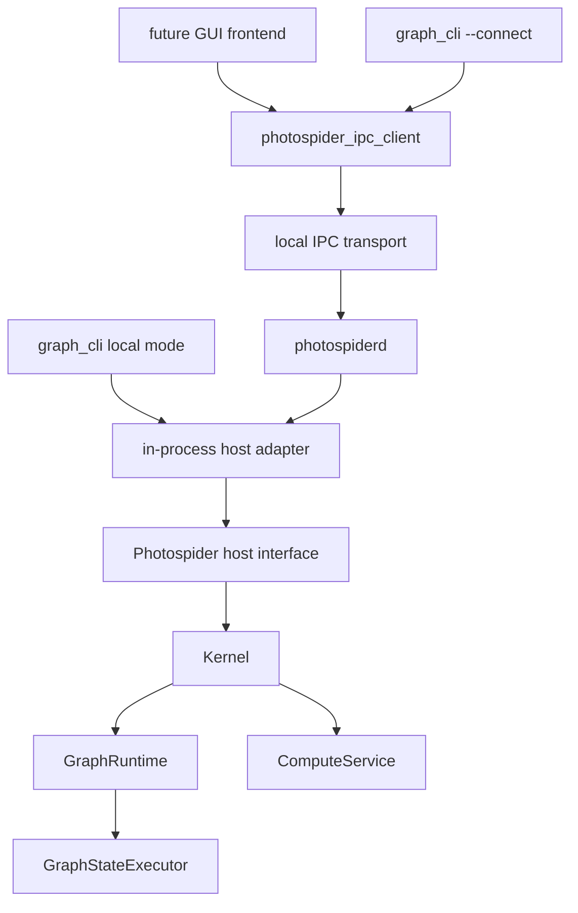

# 代码库结构方向

本文档记录 Photospider 的目标源码布局、公开头 seam、构建目标形态以及 daemon/IPC
方向。它是设计方向，不表示当前分支已经具备这些形态。

目标如下：

- `libphotospider` 是面向嵌入式前端的稳定静态链接目标。
- `photospiderd` 可以作为拥有图运行时的后台 daemon 运行。
- `graph_cli` 保持为基础的交互式命令行前端。
- 未来前端既可以进程内链接 `libphotospider`，也可以通过 IPC 与 `photospiderd` 交互。

## 当前摩擦

当前仓库已经具备有用的内部静态模块，但外部接口还不足以清晰支撑上述目标。

当前根 `CMakeLists.txt` 中观察到的构建目标：

| 当前 target | 当前角色 | 摩擦 |
| --- | --- | --- |
| `photospider_core_types` | 静态核心数据和操作 registry 源码。 | 同时把 `include/` 和 `src/` 发布为 include root。 |
| `photospider_graph` | 静态 `GraphModel` 和图服务。 | 通过公开头暴露 `GraphModel`。 |
| `photospider_plugin` | 静态插件管理器和加载器。 | 操作插件 SDK 与 host 侧插件所有权耦合。 |
| `photospider_compute` | 静态计算、运行时、调度器和交互代码。 | 内部 compute planning 头通过公开头泄漏。 |
| `photospider_lib` | CLI 和插件链接的共享后端库。 | 名称和链接形态都不符合目标中的静态 `libphotospider`。 |
| `photospider_cli_common` | 静态 CLI 命令、TUI、自动补全代码。 | 把 `src/` 作为 public include root，并依赖宽泛的内核头。 |
| `graph_cli` | CLI 可执行入口。 | 直接创建 `Kernel`，还没有 daemon-client 模式。 |

主要接口泄漏：

- `include/graph_model.hpp` 包含
  `kernel/services/compute-service/task_graph_planning.hpp`，而后者当前位于 `src/`。
- `GraphModel` 公开存储 dirty-region snapshot、compute plan、full task graph cache handle
  和运行时 generation 状态。
- `include/kernel/kernel.hpp` 包含 `GraphRuntime`、`ComputeService`、图服务、插件管理器和
  dirty-control-lane 实现类型。
- `Kernel::post()`、`Kernel::runtime()` 和 `InteractionService::kernel()` 允许外部代码绕过预期的
  `InteractionService` 接口。
- `include/plugin_api.hpp` 包含完整 `Node`，把节点运行时/cache 状态暴露给操作插件，而不是暴露更小的插件契约。
- CLI 和 benchmark 头与内核契约位于同一个 public include root 下，因此 install 规则会意外发布应用内部实现。

## 外部接口规则

外部 seam 应为：

```text
external frontend
  -> Photospider host interface
      -> Kernel Interaction Boundary
          -> Kernel / GraphRuntime / GraphModel / ComputeService implementation
```

外部代码不应包含或命名这些实现概念：

- `GraphModel`
- `GraphRuntime`
- `GraphStateExecutor`
- `ComputeService`
- `DirtyControlLane`
- `ComputePlan`
- `FullTaskGraph`
- `CpuWorkStealingScheduler` 等具体调度器类
- graph cache/traversal/io service 类

外部代码可以依赖稳定的值契约：

- graph/session 标识符
- compute request 选项
- error/result 值
- graph 和 node inspect snapshot
- scheduler status 和 trace snapshot
- dirty-region inspect view
- image 和 tile buffer 契约
- plugin operation 注册契约

这样 `InteractionService` 或其替代者才会成为更深的模块：前端可以获得图生命周期、计算、
inspect、事件、调度器配置和插件控制，而不需要学习背后的实现拓扑。

## 目标公开头

只安装 `include/photospider/` 下的头。迁移期间只有在变更明确允许兼容 wrapper 时，才保留旧的顶层头；
否则仓库当前的 rename discipline 更倾向一次性完成修正。

目标布局：

```text
include/photospider/core/
  image_buffer.hpp
  graph_error.hpp
  compute_intent.hpp
  result_types.hpp
  inspection_types.hpp

include/photospider/host/
  host.hpp
  graph_session.hpp
  compute_request.hpp
  event_stream.hpp

include/photospider/plugin/
  plugin_api.hpp
  op_registry.hpp
  op_contract.hpp
  node_view.hpp

include/photospider/scheduler/
  scheduler.hpp
  scheduler_task_runtime.hpp
  scheduler_plugin_api.hpp

include/photospider/ipc/
  client.hpp
  protocol.hpp
```

头文件规则：

- 公开头不得包含 `src/` 中的文件。
- 公开头不得包含 `kernel/services/...`。
- 公开头不得暴露 `GraphModel`、`GraphRuntime` 或 `ComputeService` 拥有的可变实现状态。
- 公开头应优先使用值对象、不透明 handle、小引用和 request/result 结构。
- OpenCV 和 yaml-cpp 应限制在真正需要它们的契约中。`ImageBuffer` 可以继续作为公共契约。
  除非某个方法明确接受 YAML 文本，否则 host/IPC client 不应被迫依赖 YAML node parsing。
- CLI、benchmark 和 test-only 头不是 public install header。

## 目标源码布局

源码树应在读任何文件前就能看出所有权：

```text
include/photospider/
  core/
  host/
  plugin/
  scheduler/
  ipc/

src/lib/
  core/
  graph/
  compute/
  runtime/
  plugin/
  scheduler/
  adapters/
    opencv/
    metal/
  ipc/

apps/
  graph_cli/
  photospiderd/

plugins/
  ops/
  schedulers/

tests/
  unit/
  integration/
  evidence/
```

命名规则：

- 目录、文件、CMake target 和自由函数使用 `snake_case`。
- 类型使用 `PascalCase`。
- 方法和字段使用 `snake_case`。
- 公开 target 名称直接使用产品名，例如 `photospider` 或 `libphotospider`；helper target 使用角色名，
  例如 `photospider_graph_internal`。
- 如果已有领域名称，具体实现不要使用 `_module` 这类含糊后缀。

## 构建目标形态

建议最终目标：

| Target | 类型 | 是否安装 | 角色 |
| --- | --- | --- | --- |
| `photospider_core_internal` | Static | 否 | 核心值、image buffer、graph error、低层 helper。 |
| `photospider_graph_internal` | Static | 否 | `GraphModel`、graph IO、traversal、cache、inspect 实现。 |
| `photospider_compute_internal` | Static | 否 | Compute planning、dirty-region state、dispatcher、scheduler interaction。 |
| `photospider_plugin_host_internal` | Static | 否 | Host 侧动态插件加载和生命周期所有权。 |
| `photospider_scheduler_internal` | Static | 否 | 内置调度器实现和 factory。 |
| `photospider` / `libphotospider` | Static | 是 | 面向进程内前端的公共静态库。 |
| `photospider_ipc_client` | Static | 是 | 面向 daemon 前端的客户端 IPC adapter。 |
| `photospider_cli_common` | Static | 否 | CLI 命令解析、REPL、TUI、自动补全。 |
| `graph_cli` | Executable | 是 | 基础交互式前端。 |
| `photospiderd` | Executable | 是 | 拥有 `Kernel` 和 IPC server 的后台 daemon。 |
| operation plugins | Shared | 可选 | 动态加载的操作扩展。 |
| scheduler plugins | Shared | 可选 | 动态加载的调度器扩展。 |

Target 依赖方向：

```mermaid
graph TD
    public_headers["include/photospider/*"] --> libphotospider["libphotospider STATIC"]
    core["photospider_core_internal"] --> libphotospider
    graph["photospider_graph_internal"] --> libphotospider
    compute["photospider_compute_internal"] --> libphotospider
    plugin_host["photospider_plugin_host_internal"] --> libphotospider
    scheduler["photospider_scheduler_internal"] --> libphotospider
    ipc_client["photospider_ipc_client STATIC"] --> graph_cli
    libphotospider --> graph_cli
    libphotospider --> photospiderd
    ipc_server["daemon IPC server implementation"] --> photospiderd
```

CMake 规则：

- 内部 target 可以把 `src/` 作为 `PRIVATE` include root。
- 可安装 target 只暴露 `include/photospider`。
- `libphotospider` 默认应为 `STATIC`。
- 后续可以作为显式兼容产品添加共享库，但不应让共享库继续充当主要后端。
- `graph_cli` 本地模式链接 `libphotospider`，daemon 模式链接 `photospider_ipc_client`。
- `photospiderd` 链接 `libphotospider` 并拥有 IPC server。
- 操作插件和调度器插件不应仅为了访问 registry 符号而链接宽泛的共享后端。长期方向是插件使用窄 SDK，
  通过 host 提供的 registration callback 或 opaque handle 注册。

## Daemon 形态

`photospiderd` 应是一个带有小型进程外壳的可执行文件，深层 host 模块位于其背后。

进程职责：

- 加载配置
- 创建并拥有一个 `Kernel`
- 初始化插件目录和 scheduler plugin discovery
- 通过 IPC 暴露 graph lifecycle、compute、inspect、scheduler、event 和 plugin control
- 强制每用户 socket 权限
- 处理 shutdown signal 和 graph/runtime 的优雅停止
- 将日志、pid 文件和运行时元数据写到 graph cache 目录之外

它不应重复 graph 或 compute 逻辑。所有 graph-state operation 仍通过进程内前端使用的同一个 host 接口流转。

推荐运行时图：



关键 seam 是 host interface，而不是 transport。如果 in-process adapter 和 IPC adapter 都满足同一个前端接口，
前端即可选择本地嵌入或 daemon 模式，而不用学习两套不同的 graph/compute 语义。

## IPC 协议方向

建议第一版 transport：

- macOS/Linux 使用 Unix domain socket。
- Windows 的 named pipe 或本地 TCP loopback 可以后续添加。
- 默认不开放远程 TCP listener。
- Socket 路径应按用户隔离，例如优先使用 `$XDG_RUNTIME_DIR`，否则使用 macOS 用户 cache/runtime 目录。
- Socket 权限应仅允许当前用户访问。

建议第一版协议：

- 使用长度前缀的 JSON-RPC 风格 request/response frame。
- 每个 request 有 id、method name、params object 和可选 client capability version。
- 每个 response 使用同一个 id，返回 result object 或 error object。
- 请求/响应方法稳定后，再添加事件流 notification。

不建议第一版使用 newline-delimited JSON，因为日志、多行诊断和未来二进制元数据会让 frame 解析变得含糊。
除非项目明确接受生成代码、更大的依赖面和更复杂的插件/构建故事，否则第一步不建议使用 gRPC。

初始 method group：

| Group | 示例方法 | 说明 |
| --- | --- | --- |
| daemon | `daemon.ping`, `daemon.shutdown`, `daemon.version` | 不需要 graph。 |
| graph | `graph.load`, `graph.close`, `graph.list`, `graph.reload`, `graph.save` | 使用 graph name 或 opaque session id，绝不使用指针。 |
| compute | `compute.run`, `compute.run_async`, `compute.cancel`, `compute.status` | Async 可以先轮询，后续再 streaming。 |
| inspect | `inspect.graph`, `inspect.node`, `inspect.dependency_tree`, `inspect.dirty` | 返回值 snapshot。 |
| scheduler | `scheduler.types`, `scheduler.get`, `scheduler.set`, `scheduler.trace` | 映射当前 CLI scheduler 功能。 |
| plugins | `plugins.scan`, `plugins.load`, `plugins.unload_all`, `plugins.list` | Host 保留 plugin handle。 |
| events | `events.next`, `events.drain` | 先轮询，后订阅。 |

图像 payload 规则：

- 默认不要把大图像放入 JSON。
- 第一版可以返回图像元数据加 cache/output path，或写入调用方请求的输出文件。
- 后续 IPC 可增加 shared-memory handle、memory-mapped file 或 preview frame 的二进制 side-channel。

错误规则：

- Transport error 描述 IPC 失败。
- Host error 描述 graph/load/compute/plugin/scheduler 失败。
- Graph error 应携带与 `GraphErrc` 对齐的稳定错误码。
- 方法不应要求 client 解析人类可读字符串来决定行为。

并发规则：

- Daemon request router 可以接受并发 client。
- 每图 graph-state mutation 仍由 `GraphStateExecutor` 序列化。
- 只读 inspect 仍应使用 host interface，而不是直接访问 `GraphModel`。
- 长时间 compute 应返回 request id；client 可以轮询，等 compute commit policy 支持后再取消。

## 迁移顺序

推荐顺序：

1. 添加公开头依赖扫描。
   - 当可安装头包含 `src/`、`kernel/services/...` 或实现专属的 graph/runtime/compute planning 头时失败。
   - 为公开头添加一个 header self-containment 编译测试。
   - Phase 0 建立可重放的 public header 扫描，并将
     `public_header_self_containment` CMake target 作为 `include/photospider/`
     下每个头文件的独立编译护栏。
   - `include/photospider/public_boundary.hpp` 只是可安装 include root 的 marker 头。
     稳定值契约仍属于下一阶段 core seam。
2. 引入 `include/photospider/*`。
   - 先移动稳定值契约：error、image buffer、compute request、inspect snapshot。
   - 保持 `GraphModel`、`GraphRuntime` 和 compute planning 头为内部实现。
3. 创建 host interface。
   - 将 `InteractionService` 转换为稳定 host-facing 模块，或隐藏在其背后。
   - 从公开头移除 raw `Kernel&`、`GraphRuntime&` 和模板化 `GraphModel&` submit 这类外部逃逸口。
4. 重命名构建输出。
   - 将可安装静态目标设为 `photospider`/`libphotospider`。
   - 内部静态模块保持 private。
5. 拆分应用。
   - 将 `cli/graph_cli.cpp` 移到 `apps/graph_cli/`。
   - 新增 `apps/photospiderd/`，其中只放进程生命周期。
6. 增加 IPC client 和 server。
   - 从本地 socket、长度前缀 JSON request/response，以及 graph lifecycle/inspect 方法开始。
   - 基础生命周期稳定后再添加 compute、events 和 cancellation。
7. 收紧插件 SDK。
   - 用窄 operation contract 和 host-provided registration table，替换插件对完整 `Node` 和全局 registry 符号的直接依赖。

## 验证期望

任何根据本文档推进的实现变更，都应：

- 运行公开头依赖扫描，并把证据保存到 `tests/results/...`。
- 构建 `libphotospider`、`graph_cli` 和 `photospiderd`。
- 运行 kernel、scheduler、plugin、interaction 和 CLI 相关 CTest。
- 增加 IPC 集成测试：启动 `photospiderd`，发送请求，并将响应 JSON 与 expected output 对比。
- 对 daemon lifecycle 变更，保存 startup、graph load、compute 或 inspect、client disconnect、signal shutdown
  和 socket cleanup 日志。

## 待决问题

实现前应解决这些决策：

- 第一版 daemon transport 是否只做 Unix domain socket，还是同一变更中也要求 Windows named-pipe 支持。
- `graph_cli` 是否永远默认本地进程内模式，还是在存在 daemon socket 时自动连接 `photospiderd`。
- compute 图像结果第一版是否只支持文件，还是第一个 GUI 前端就需要 IPC 二进制 side-channel。
- 操作插件 ABI 清理应在静态 `libphotospider` target rename 之前还是之后完成。

## 参考仓库

这个结构方向借鉴成熟 C/C++ 项目的宽泛实践：

- LLVM 明确维护编码约定和接口期望：
  <https://llvm.org/docs/CodingStandards.html>
- FFmpeg 区分库、工具和开发者契约：
  <https://ffmpeg.org/developer.html>
- Krita 区分应用外壳、插件和核心库，同时维护 C++ 约定文档：
  <https://docs.krita.org/en/untranslatable_pages/intro_hacking_krita.html>
