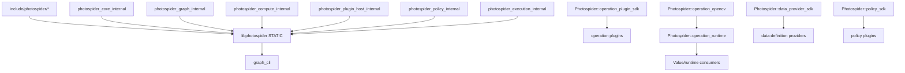

# 代码库结构方向

本文档记录 Photospider kernel 主仓的结构：public Host seam、static embedded product、
extension SDK、按角色归属的源码布局，以及源码私有的 Job/worker vertical。Daemon IPC v2
是本 package 的独立 installed consumer，不归本仓所有。

目标如下：

- `libphotospider` 是面向嵌入式前端的稳定静态链接目标。
- `graph_cli` 保持为基础的 embedded 交互式前端。
- Public extension author 只使用窄化后的 installed SDK component。
- 外部 [photospider-daemon](https://github.com/kevin-zf1123/photospider-daemon)
  仓库拥有 typed IPC client、private protocol implementation、`photospiderd`、protocol docs
  和 daemon tests。它只消费 installed `Photospider::photospider` package，不依赖源码树。

## 当前摩擦

kernel 主仓现在具备 public Host seam、可安装静态产品、迁移后的 CLI tree、按角色归属的私有源码、
production plugin 目录、unit/integration 测试归属、窄化后的 SDK export，以及源码私有的
single-tenant Job/worker vertical。Daemon 拆仓从本树移除了重复的 protocol、package、process-shell
和 test ownership，同时保留供外部 daemon 消费的 installed embedded Host dependency。

当前根 `CMakeLists.txt` 中观察到的构建目标：

| 当前 target | 当前角色 | 摩擦 |
| --- | --- | --- |
| `photospider_core_internal` | 仅用于构建的 core value、private conversion 与 registry helper。 | 按角色归属的源码也会折叠进静态产品。 |
| `photospider_graph_internal` | 仅用于构建的 `GraphModel` 与 graph-service helper。 | `GraphModel` 继续私有地位于 `src/lib/graph`。 |
| `photospider_plugin_host_internal` | 仅用于构建的 Host-side 纯 C operation ABI v1 loader、adapter、runtime router 与 generation-lifetime helper。 | 不导出。 |
| `photospider_policy_internal` | 仅用于构建的纯 C policy DSO registry/loader、built-in type、binding、context、fault 与 DSO lease。 | 只拥有 ordering context，不拥有 worker、queue、grant、Run、Graph 或 execution route。 |
| `photospider_execution_internal` | 仅用于构建的私有物理执行资源与 accounting primitive。 | `ResourceLedger`、固定 `DeviceExecutorRegistry` 和平台 executor factory 在这里编译；每个 composition-root `ExecutionService` 拥有唯一 Host 与逐设备权威 ledger 及 registry。 |
| `photospider_compute_internal` | 仅用于构建的 compute、request-owned HP/RT `ComputeRun`、policy-aware ready store、reserved-start transaction、私有 route execution、runtime 与 dirty-region helper。 | Run 与物理 route mechanism 保持私有。 |
| `photospider_host_internal` | 仅用于构建的 embedded Host adapter 与 Kernel facade closure。 | 不导出，也不会向 consumer 暴露私有 execution owner。 |
| `photospider_operation_runtime` | 可安装的 shared DenseTensor/ImageFacet/ImageView、provider-defined Value、portable-artifact、sample-conversion、Region、extension-digest 与 data-definition registry 实现。 | 持有唯一的进程级 allocation/revision minting authority 以及 dependency-neutral registry/Region 逻辑；没有外部 package，也不反向链接 operation SDK。 |
| `photospider_operation_plugin_sdk` | 可安装、dependency-neutral 的纯 C operation ABI v1 interface SDK。 | 暴露 C11 contract 与 header-only C++17 helper，不带 runtime link dependency。 |
| `photospider_data_provider_sdk` | 可安装、dependency-neutral 的纯 C data-definition ABI v3 SDK。 | 只携带一个兼容 C11/C++17 的 header，不带 runtime、registry、loader 或可选依赖。 |
| `photospider_openexr_deep_provider` | 可选安装的 OpenEXR deep data-definition provider module。 | 只在显式启用时构建并导出，链接 data-provider SDK 与 OpenEXR 3，并使中立 package surface 不依赖 OpenEXR。 |
| `photospider_openexr_deep_adapter` | 仅用于构建、source-private 的 Host codec adapter。 | 只在启用配置中存在，是不导出的 static target，链接 `operation_runtime` 与 OpenEXR 3。 |
| `photospider_operation_opencv` | 可安装、显式 opt-in 的 OpenCV adapter。 | 只发现并链接 OpenCV `core`。 |
| `photospider_policy_sdk` | 可安装、dependency-neutral 的纯 C policy ABI v1 SDK。 | 只携带一个兼容 C11/C++17 的 header，不带 execution/runtime dependency。 |
| `photospider` | 静态可安装后端产品，归档文件名为 `libphotospider`。 | 已符合目标静态产品和 public Host 形态，同时把按角色归属的后端源码折叠进单一归档。 |
| `photospider_single_tenant_job_internal` | 不安装的 Issue #99/#100 canonical JobSpec、tenant quota、durable Job/artifact、显式 retry/checkpoint、private worker protocol 与 WorkerManager authority。 | 独立 gate 默认关闭且只能在 Darwin/Linux 显式启用；关闭时不存在相关 target inventory，它不导出 package/API，且不进入任何 daemon composition。 |
| `photospider-worker` | 源码私有 single-tenant Job 纵向路径的不安装、单 assignment process composition root。 | 每个 attempt 都会全新 exec；它链接 internal Job/Embedded Host closure，不暴露 network listener 或第二个 assignment，也不获得 durable Job/quota/artifact authority。 |
| `photospider_cli_common` | `apps/graph_cli/` 下的 object-library CLI 命令、TUI、自动补全代码、可复用 `run_graph_cli` 边界，以及两个按角色归属的 benchmark service 翻译单元。 | Object 注入让所有 CLI reference 在 single-pass static linker 上位于所选 product archive 之前；benchmark 源仍只属于这个不可安装的 helper/完整 CLI closure，不会进入可安装产品。 |
| `graph_cli` | 位于 `apps/graph_cli/main.cpp`、只负责 process policy 的入口。 | 禁用 OpenCL，拥有不依赖分配的 fatal exit policy，创建 embedded `Host` adapter，尚无 daemon-client 模式。 |

仍遗留和刚完成修复的接口泄漏：

- 原先的 `include/graph_model.hpp` 已移到 `src/lib/graph/graph_model.hpp`；graph model state、
  dirty-region snapshot、planner summary、full task graph cache handle 和 runtime generation
  state 现在都归入私有 include root。
- 内部 `Kernel` 和 `InteractionService` facade 现在位于 `src/lib/runtime/`。它们包含 runtime、
  compute service、图服务、插件管理器和 dirty-control-lane 实现类型，因此不是 `photospider`
  链接消费者可依赖的受支持头；仍包含它们的仓库内部 target 必须获得私有 `src/lib/` include root。
  `ps::Host` 现在已经是唯一受支持的 frontend public seam。Embedded Host adapter 会把
  `ps::HostComputeRequest` 转换为内部 `Kernel::ComputeRequest`，再通过
  `InteractionService`/`Kernel` 委托执行。后续阶段只会在保持这一所有权的前提下调整内部 target
  或增加 daemon/IPC adapter，不会再引入第二套 frontend facade。
- Benchmark 与实现私有 backend 头现在都随所属角色位于 `src/lib/**`；CLI 头位于
  application-private 的 `apps/graph_cli/include/graph_cli/` 树中。原有八个过渡性 source-tree
  extension header 是：
  `include/{plugin_api,node,ps_types,image_buffer}.hpp`、
  `include/adapter/buffer_adapter_opencv.hpp`，以及
  `include/kernel/scheduler/{i_scheduler,scheduler_task_runtime,scheduler_plugin_api}.hpp`。
  它们现已删除且没有 compatibility forwarder；对应的窄 public 契约与完整 private declaration
  分别归入不同的 role-owned 目录。

当前分支已经完成的 seam 收紧：

- 原先直接提交 graph-state 工作和访问 runtime 的 escape hatch 已从 frontend contract 中移除。
  `Kernel` 和 `InteractionService` 是内部 facade；仍需要 runtime 或 graph-state 访问的测试现在必须
  显式包含 internal-only 的 `tests/support/kernel_test_access.hpp` helper，并通过
  `ps::testing::KernelTestAccess` 进行这些访问。
- Graph、compute、runtime、Host、plugin、policy、execution、benchmark 与 adapter 的实现文件和私有头
  现在都位于按角色归属的 `src/lib/**` 目录。内部 target 通过私有 `src/lib/` root 构建，
  可安装 public header inventory 则继续限定在 `include/photospider/**`。
- Issue #69–#75 的 Run/policy/execution 实现位于 `src/lib/compute/`、`src/lib/policy/` 与
  `src/lib/execution/`，共享 accounting primitive 位于 `src/lib/runtime/resource_ledger.*`。
  `Kernel` 注入 Host-owned `ExecutionService`；`ComputeService` 为每次非 realtime HP call 创建一个
  Run，并为 realtime call 创建彼此分离的 HP `Full` 与 RT `Interactive` 子 Run。Full、dirty、
  preflight、initial 与 dependency-released work 都以 move-only、由 lease 支撑的 submission 跨过
  同一个有界 ready store。Host 决定 service class 与可信 frontier，调用 built-in 或纯 C policy
  binding，验证 decision，再在封闭的 `cpu`、`serial_debug` 或 `gpu_pipeline` route 启动前提交
  resource exchange。Graph 只保留复制的 route id/generation。Policy binding 保留自己的 context、
  非零 generation、immutable first fault 与 DSO lease，但没有物理权威。Installed Host value 与
  operation ABI 不命名这些私有对象；installed policy ABI 只暴露不可变 scalar ranking snapshot。
- dirty-region 诊断、compute planning 诊断和 execution trace 诊断都通过 Host 的拷贝值
  snapshot 暴露。公开头不再需要命名后端 graph/runtime/service/planning 类型或具体物理 route
  class，就能提供这些诊断。
- 配置后的 CLI application surface 现在位于 `apps/graph_cli/`：其中包含 `main.cpp`、private
  header、implementation source、command help resource、root configuration code、REPL/TUI、
  自动补全和 terminal helper。它的完整 target closure 还只包含
  `src/lib/benchmark/benchmark_service.cpp` 与
  `src/lib/benchmark/benchmark_yaml_generator.cpp`；两者只属于不可安装的
  `photospider_cli_common`/CLI closure，不会折叠进可安装的 `photospider` 静态产品。旧的顶层 CLI
  归属位置不作为兼容 surface 保留。
- 仓库自有 operation 与 policy plugin 现在位于 `plugins/ops/` 和
  `plugins/policies/`；仅用于测试的 DSO 仍是 fixture。维护中的测试翻译单元归类到
  `tests/unit/` 与 `tests/integration/`，fixture、support 与手工 verification 各有明确角色；
  过时的 issue replay/result orchestration 已删除。
- Operation plugin 只针对精确的 pure-C operation ABI v1 record 构建，也可以使用 header-only
  C++ authoring helper。两个 surface 都不会跨 DSO 边界暴露 `Node`、`GraphModel`、`OpRegistry`、
  YAML、private cache ownership 或 C++ callback object。Policy plugin 只针对 self-contained C11
  `policy_plugin_api.h` 构建；精确 ABI v1 record 只暴露不可变有界 scalar candidate，不暴露
  executor、allocation service、resource grant、Run、Graph、completion route 或 logger。两者都是
  受信任的 in-process contract，而不是 isolation boundary。

## 外部接口规则

外部 seam 应为：

```text
external frontend
  -> public ps::Host（唯一 frontend seam）
      -> embedded Host adapter
          -> internal InteractionService / Kernel boundary
              -> GraphRuntime / GraphModel / ComputeService implementation
```

外部代码不应包含或命名这些实现概念：

- `GraphModel`
- `GraphRuntime`
- `GraphStateExecutor`
- `ComputeService`
- `DirtyControlLane`
- `ComputePlan`
- `FullTaskGraph`
- `PolicyRegistry`、`ExecutionTaskRuntime` 或具体私有 route class
- graph cache/traversal/io service 类

外部代码可以依赖稳定的值契约：

- graph/session 标识符
- compute request 选项
- error/result 值
- graph 和 node inspect snapshot
- policy binding 与 execution trace snapshot
- dirty-region inspect view
- dense-image Value 与 tile 契约
- plugin operation 注册契约

这样 `InteractionService` 会作为 public `ps::Host` seam 背后的深层 backend 模块：前端可以获得
图生命周期、计算、inspect、事件、policy/execution 配置和插件控制，而不需要学习背后的实现拓扑。

## 目标公开头

只安装 `include/photospider/` 下的头。当前没有 source-tree extension 例外、compatibility wrapper
或重复的新旧 declaration。

目标布局：

```text
include/photospider/core/
  export.hpp
  geometry.hpp
  device.hpp
  graph_error.hpp
  compute_intent.hpp
  result_types.hpp
  inspection_types.hpp

include/photospider/host/
  host.hpp
  graph_session.hpp
  compute_request.hpp
  event_stream.hpp
  value_result.hpp
  value_artifact_result.hpp

include/photospider/data/
  value.hpp
  extension.hpp
  image_metadata.hpp
  image_statistics.hpp
  image_view.hpp
  packed_dense_tensor_view.hpp
  parameter_value.hpp
  region.hpp
  sample_conversion.hpp
  value_artifact.hpp

include/photospider/memory/
  access_plan.hpp
  blocked_layout.hpp
  buffer_handle.hpp
  ready_fence.hpp
  strided_layout.hpp

include/photospider/plugin/
  data_definition_registry.hpp
  data_provider_api.h
  operation_plugin_api.h
  operation_plugin.hpp
  opencv_adapter.hpp

include/photospider/policy/
  policy_plugin_api.h

include/photospider/
  public_boundary.hpp
```

头文件规则：

- 公开头不得包含 `src/` 中的文件。
- 公开头不得包含 `kernel/services/...`。
- 公开头不得暴露 `GraphModel`、`GraphRuntime` 或 `ComputeService` 拥有的可变实现状态。
- 公开头应优先使用值对象、不透明 handle、小引用和 request/result 结构。
- OpenCV 只出现在显式 opt-in 的 `plugin/opencv_adapter.hpp` 契约；operation SDK、policy SDK、
  Host、core 与 IPC header 都不需要它。任何 public header 都不暴露 yaml-cpp。普通图像使用
  dependency-neutral 的 `Value`、`ImageView`、sample、artifact 与 memory 契约；不会安装第二种
  图像兼容类型。
- CLI、benchmark 和 test-only 头不是 public install header。

## 当前与目标源码布局

源码树应在读任何文件前就能看出所有权：

```text
include/photospider/
  core/
  host/
  data/
  memory/
  plugin/
  policy/

src/lib/
  core/
  graph/
  compute/
    dispatch/
    dirty/
    execution/
    request/
  runtime/
  host/
  plugin/
  policy/
  execution/
    device/
    isolation/
    transfer/
  benchmark/
    b1/
    i1/
    i2/
    m1/
    common/
  server/
    state/
    worker/
  adapters/
    opencv/
    metal/

apps/
  graph_cli/
    main.cpp
    include/graph_cli/
    src/
      autocomplete/
      command/
    resources/help/

plugins/
  ops/
  policies/

tests/
  unit/
  integration/
  fixtures/
  support/
  verification/
```

所有 kernel backend、plugin、Job/worker 与维护中的 kernel test code 都已采用该布局。Issue #242
在同一冻结提交的 compatibility gate 通过后，将原 daemon source/header subtree 与 process shell
迁入外部 daemon 仓库。Issue #38 已完成 operation extension contract，并移除
八个过渡性 extension header；没有 shim 或
重复 declaration。Issue #75 删除拥有 worker 的 scheduler SDK，并增加只含一个 header 的
`include/photospider/policy/` 纯 C contract。Policy registry/loading 位于 `src/lib/policy/`；私有
route/runtime contract 位于 `src/lib/execution/`；policy-aware store 与 reserved-start logic 位于
`src/lib/compute/execution/`，request、dispatch 与 dirty-update 协作者分别位于对应的 compute
子目录。设备、隔离与传输机制在 `src/lib/execution/` 下分开；benchmark profile 按场景分组；
server 持久真相与 worker supervision 在 `src/lib/server/` 下分开。唯一 Host 与逐设备权威 ledger
实现保持在 `src/lib/runtime/`。这些私有
implementation owner 都不会成为 public Host type。

命名规则：

- 目录、文件、CMake target 和自由函数使用 `snake_case`。
- 类型使用 `PascalCase`。
- 方法和字段使用 `snake_case`。
- 公开 target 名称直接使用产品名，例如 `photospider` 或 `libphotospider`；helper target 使用角色名，
  例如 `photospider_graph_internal`。
- 如果已有领域名称，具体实现不要使用 `_module` 这类含糊后缀。

## 构建目标形态

当前 target 形态：

| Target | 类型 | 是否安装 | 角色 |
| --- | --- | --- | --- |
| `photospider_core_internal` | Static | 否 | 核心 Value、sample/artifact codec、graph error 与低层 helper。 |
| `photospider_graph_internal` | Static | 否 | `GraphModel`、graph IO、traversal、cache、inspect 实现。 |
| `photospider_compute_internal` | Static | 否 | Compute planning、dirty-region state、dispatcher、policy-aware ready store、reserved start 与私有 route execution。 |
| `photospider_plugin_host_internal` | Static | 否 | Host 侧动态插件加载和生命周期所有权。 |
| `photospider_policy_internal` | Static | 否 | 纯 C policy registry/loader、built-in、binding、context、fault 与 DSO lease。 |
| `photospider_execution_internal` | Static | 否 | 私有 `DeviceExecutorRegistry`、平台 executor factory、物理 execution accounting 与 `ResourceLedger` 实现。 |
| `photospider_host_internal` | Static | 否 | Embedded Host adapter 与 Kernel facade closure。 |
| `photospider_operation_runtime` | Shared | 是 | Public DenseTensor/ImageFacet/ImageView、provider-defined Value、portable-artifact/sample-conversion、Region、canonical extension metadata 与注入式 data-definition registry 实现及唯一进程级 allocation/revision minting authority；无外部 package dependency，也无 SDK 反向链接。 |
| `photospider_operation_plugin_sdk` | Interface | 是 | Dependency-neutral 的 operation ABI v1 C11 header 与 header-only C++17 helper。 |
| `photospider_data_provider_sdk` | Interface | 是 | 一个 dependency-neutral 的纯 C ABI v3 header，携带 C11/C++17 usage requirement 且没有 link interface。 |
| `photospider_openexr_deep_provider` | Module | 可选 | 会安装并导出为 `Photospider::openexr_deep_provider`；该 OpenEXR deep data-definition provider DSO 仅在显式启用时可用。 |
| `photospider_openexr_deep_adapter` | Static | 否 | 启用 OpenEXR 的 build 所使用的 source-private Host codec adapter；不会安装或导出。 |
| `photospider_operation_opencv` | Static | 是 | 只使用 OpenCV `core` 的 opt-in public adapter。 |
| `photospider_policy_sdk` | Interface | 是 | 一个 dependency-neutral 的纯 C ABI v1 header，携带 C11/C++17 usage requirement。 |
| `photospider` / `libphotospider` | Static | 是 | 面向进程内前端的公共静态库。 |
| `photospider_cli_common` | Object | 否 | CLI 命令解析、REPL、TUI、自动补全，以及两个仅供 CLI 使用的 benchmark service 翻译单元；object 注入位于所选 product archive 之前，且都不会进入可安装静态产品。 |
| `graph_cli` | Executable | 否 | 基础交互式前端。 |
| operation plugins | Shared | 可选 | 动态加载的操作扩展。 |
| policy plugins | Shared | 可选 | 纯 C、仅负责排序的 policy 扩展。 |

Target 依赖方向：


```mermaid
graph TD
    public_headers["include/photospider/*"] --> libphotospider["libphotospider STATIC"]
    core["photospider_core_internal"] --> libphotospider
    graph_internal["photospider_graph_internal"] --> libphotospider
    compute["photospider_compute_internal"] --> libphotospider
    plugin_host["photospider_plugin_host_internal"] --> libphotospider
    policy["photospider_policy_internal"] --> libphotospider
    execution["photospider_execution_internal"] --> libphotospider
    operation_plugin_sdk["Photospider::operation_plugin_sdk"] --> operation_plugins["operation plugins"]
    operation_runtime["Photospider::operation_runtime"] --> value_consumers["Value/runtime consumers"]
    data_provider_sdk["Photospider::data_provider_sdk"] --> data_providers["data-definition providers"]
    operation_opencv["Photospider::operation_opencv"] --> operation_runtime
    policy_sdk["Photospider::policy_sdk"] --> policy_plugins["policy plugins"]
    libphotospider --> graph_cli
```

CMake 规则：

- 内部 target 可以把 `src/lib/` 作为 `PRIVATE` include root。
- `PHOTOSPIDER_BUILD_SINGLE_TENANT_JOB` 独立控制 POSIX-backed Job internal target 及其持续维护
  unit/integration target。它在所有系统默认关闭，只能在 Darwin/Linux 显式启用，并拒绝
  unsupported system 上的显式 enable。Configure-time inventory assertion 要求 enabled profile
  中存在所有适用的 Job target，并禁止它们出现在 disabled profile 中。
- 可安装 target 只暴露 `include/photospider`。
- 安装边界只复制 `include/photospider/**` 下的头文件。`src/lib/` 下的实现头不会进入安装包，
  `photospider` 产品仍把 `src/lib/` 保持为 private include root。
- install/export 配置将 `photospider` 设为可安装的 `STATIC` target，只安装
  `include/photospider/**`，并通过 `PhotospiderConfig.cmake` 导出
  `Photospider::photospider`。Unix-like 工具链生成 `libphotospider.a`，MSVC 生成
  `photospider.lib`。
- `photospider` 的 build-tree consumer 会获得一个生成的 public include root，其中只包含
  `photospider/` forwarding header。源码树 `include/photospider/**` inventory 通过
  `CONFIGURE_DEPENDS` 跟踪，因此新增或删除 header 会重新生成 forwarding tree，不依赖 symlink
  权限；header 内容直接来自实时 source file。源码树的 `include/` 和 `src/lib/` root 仍是仓库
  target 的私有实现 include path；仓库插件只获得 generated public include root。
- 静态产品归档会把产品实现源码直接折叠进 `photospider`。仓库内部的静态 helper 模块仍可用于本地构建组织，
  但不会导出给 package consumer。
- 后续可以作为显式兼容产品添加共享库，但不应让共享库继续充当主要后端。
- 当前 operation plugin 只导出 `ps_operation_plugin_get_abi_version` 与
  `ps_operation_plugin_get_api_v1`。Host 提供精确预备的 root/suite record、深拷贝经过验证的
  metadata，并保持 `OpRegistry` 私有。只使用纯 C/header-only contract 的作者链接
  `Photospider::operation_plugin_sdk`；使用公共 Value/runtime helper 的插件显式链接
  `Photospider::operation_runtime`，OpenCV adapter 用户还链接
  `Photospider::operation_opencv`，并自行声明算法所需的其他 module。
- OpenCV（`core`、`imgproc`、`imgcodecs`、`videoio`）、`yaml-cpp` 和 `Threads` 是静态归档的
  link-only 实现依赖。安装后的 `Photospider::photospider` target 会在
  `INTERFACE_LINK_LIBRARIES` 中把它们记录为 `$<LINK_ONLY:...>` entry。
  `PhotospiderConfig.cmake` 会寻找这些依赖，因而外部嵌入式 consumer
  可以链接导出的 target，但 public Host/core 头不要求 OpenCV 或 `yaml-cpp` 类型。
  `${CMAKE_DL_LIBS}` 只在 CMake 判断目标平台需要时加入 dynamic-loader 库。
- Package component 为 `embedded`、`data_provider_sdk`、`operation_plugin_sdk`、
  `operation_runtime`、`operation_opencv`、`openexr_deep_provider` 与 `policy_sdk`。省略 component
  时选择 `embedded`。外部 daemon 通过这个 installed component 获得完整 kernel，并通过自己的
  package 发布 client。Unknown required component 会失败；kernel 不再拥有 daemon 或 IPC component。
- 在 Apple 平台启用仓库 Metal-provider/OpenCV-operation-plugin profile 时，静态产品会为进程拥有的
  Metal executor 携带系统 `Metal` 与 `Foundation` framework 链接标志。Metal operation provider
  借用该 executor 的 invocation context，不再依赖 `CoreImage` 或 `CoreVideo`。Dependency-disabled
  profile 会编译 stub factory，不向 registry 安装 Metal executor，也不会增加 Metal framework
  requirement。
- 在 Windows 上，导出 target 会传播 `PHOTOSPIDER_STATIC`，因此 consumer 链接 `.lib` 静态归档时，
  public declaration 不会带上 DLL import/export 标注。Dynamic operation plugin 的导出使用
  `PHOTOSPIDER_OPERATION_PLUGIN_EXPORT`，与静态产品边界彼此独立。
- FTXUI 和 `photospider_cli_common` 是 CLI-only 依赖，不属于 embedded package export。
  Operation 与 policy plugin DSO 仍是 runtime extension artifact，不是
  `Photospider::photospider` 的依赖。
- `apps/graph_cli/include/graph_cli/**` 是 private application include tree。CMake 只把它暴露给
  `photospider_cli_common`、`graph_cli` 和聚焦 CLI 测试；install rule 仍只复制
  `include/photospider/**`。
- `graph_cli` 当前先链接 `photospider_cli_common` object，再链接 `libphotospider`，保持
  local/embedded；remote CLI mode 属后续工作。
- 外部 daemon 仓库让 `photospiderd` 只链接 installed `Photospider::photospider` package 和
  自己的 private server/client target。本仓不导出 daemon target、protocol header 或 raw transport。
- Operation plugin 不会仅为了访问 registry 符号而链接宽泛共享后端。当前 operation ABI 是
  单独版本化、精确布局的 C11 contract。Host 会暂存每个完整 generation，再原子发布持有精确
  DSO lease 的私有 callback；C++ callback、registry object、exception 或 owner 都不会跨越
  DSO 边界。Policy plugin 只链接 `Photospider::policy_sdk`，并且精确导出
  `ps_policy_plugin_get_abi_version` 与 `ps_policy_plugin_get_api_v1`。其自然布局的精确 record 与
  callback 构成 C11 纯 C ABI；policy code 不接收 worker grant、executor、Run、Graph、allocator 或
  completion route。已删除的 scheduler SDK 没有 adapter、alias、forwarding header 或 compatibility
  registration。
  Data-definition provider 只链接 `Photospider::data_provider_sdk`，精确导出
  `ps_data_provider_get_abi_version` 与 `ps_data_provider_get_api_v3`，并发布不可变
  Schema/Facet/Layout bundle。C++ registry consumer 链接 `operation_runtime`；这不意味着安装了
  provider scanner、mutable registry callback 或可选 codec dependency。

## 目标进程执行组合边界

[ADR 0007](../../adr/zh/0007-compute-runs-and-process-execution-have-separate-owners.zh.md)
固定完整的进程执行所有权。其 issue #69 私有 HP/RT Run、稳定 lease/复合 identity、
owned ready-submission 与注入的 multi-Run CPU service 切片现在已经位于当前
`src/lib/compute/`。Issue #70 的完整 resource admission 与 issue #71 的内建 policy-aware ready
store 也已在该处成为当前实现。Issue #72 的 exact-revision staged commit，以及 Issue #73 的
private cooperative cancellation、Run-owned commit arbitration 与 RT-denies-HP 行为也已成为当前
实现。Issue #74 的 request-owned realtime `RunGroup`、checked latest-wins generation、有界
ticket-backed coalescing 与 current-generation commit predicate 也已成为当前实现。
`EmbeddedHostState` 会在 Kernel 前构造 process execution owner，Kernel 再把它注入
request-local `ComputeService`，不使用 static singleton。Request-level `RunGroup` 与 latest-wins
supersession 已是当前布局；Issue #75 的 process policy binding、纯 C ABI、Host-authored frontier、
reserved-start admission 与封闭私有 execution route 都已成为当前行为。Issue #76 的 lifecycle
fence、单调 Graph close、显式 shutdown、精确 settlement 与 source-private telemetry 也已是当前
行为。

在当前布局中：

- `GraphRuntime` 仍以 graph 为作用域，拥有 Graph state、graph-state lane、latest-wins coordinator、
  有界 compute-request lane、revision/generation capture 与 commit validation、稳定 graph-instance
  identity 与 lifetime anchor、event 与 platform/session metadata；
- 当前 `ComputeRun` 的共享 control 拥有非 realtime HP Run，以及 realtime call 中彼此分离的
  HP `Full`/RT `Interactive` 子 Run，包括 descriptor/phase/terminal 与 cancellation state、
  Run-owned one-shot commit contender，以及对应的 full-plan/temporary storage 或 standalone
  dirty staging storage；所有 full HP work 都会保留不可伪造的 read-only lease、复合 task
  identity、Graph lifetime lease 与最终 lifecycle registration；
- 当前 request-owned `RunGroup` coordination 让 HP 与 RT 保持为独立 Run，只在两个 child 按确定性
  规则 settle 后返回 RT output，并且绝不创建 cross-domain task dependency；
- 当前 `ExecutionService` 拥有一个固定 CPU worker pool、私有 `serial_debug`/`gpu_pipeline` 行为、
  一个 Host 与逐设备权威 ledger、固定 `DeviceExecutorRegistry`，并且在启用仓库 Metal provider
  的 Apple profile 中拥有一个进程级 Metal executor。该 executor 拥有 command queue、
  invocation-scoped native-allocation facade 与经过验证的持久 pipeline cache。GPU work 只会在
  公共 reserved-start transaction 后进入该 executor；operation 只借用已安装的 invocation
  context，不保留进程级 native resource。Issue #85 交付的显式 CPU/Metal transfer、有界
  residency、coherency、准确 stale completion 与保留 revision 的 publication 已是当前行为。
  Issue #86 现在让每个具体非 CPU `DeviceId` 成为相互隔离的 device-memory/scratch 账户。
  Native heap query 只提供对齐后的 descriptor minimum。在 allocation 前，一次 ledger
  root-mutex transaction 会校验该 minimum 与精确 scratch，并预留该 device 当前全部可用的
  persistent-memory ceiling。Dedicated heap 的正值 `currentAllocatedSize` 是唯一 persistent
  actual；不会再次计入其 texture suballocation，而 scratch 会使用每项 resource 自身的正值
  `allocatedSize`。适配 plan 的 commit 会在同一套唯一 mutex 下归还未使用的 byte，并把彼此独立的
  精确 memory/scratch lease 分别绑定到持久 Value 与 completion 生命周期。Typed invalid/over-plan
  failure 会退役局部 native owner，并让尚未 commit 的 reservation 准确 rollback 一次。
  Dependency-disabled profile 不安装 Metal executor，因此不提出原生 utilization claim；
  `ExecutionService` 还拥有
  policy-aware、受 entry/byte 约束的 ready store、checked full-vector Run admission、work/byte
  cost、class-local Graph/weighted-Run 公平性、稳定 aging、三个 Interactive dispatch 的 burst
  上限、与精确 root lifetime 一致的 Throughput-owned protected-headroom accounting、并发
  multi-Graph Run、exact reservation/grant release，以及按 Run 隔离的 completion、first-failure、
  trace 与 Host-context routing。它还会观察已接受的 Run cancellation，只清除该 Run 的 queued
  entry、拒绝 dependent re-entry，并等待 running callback 排空。Interactive root 不会扣减
  Throughput class quota。每个 Graph 只存储复制的 route id/generation，而每条 route 都使用公共
  policy 与 reserved-start 边界；
- 其私有 `RunLifecycleRegistry` 提供唯一 process admission/Graph-close/process-shutdown
  fence、pending-candidate tracking、按 Graph 建索引且由 registry 持有的 `RunLease` entry 与
  process enumeration，同时不拥有 Run plan、dispatcher、terminal state、Graph state 或 resource
  token；
- 其 source-private `ExecutionLifecycleTelemetry` 会预分配固定 65,536 条 record 的 ring，复制
  atomic-cut cursor page 与 15 个 post-transition counter，且不授予 public 或 runtime authority；
- 内部 `ResourceLedger` 是唯一的 Host reservation/grant 与逐设备 plan/lease mint；以及
- 当前 process policy registry 拥有 built-in 与纯 C DSO type。每个 `PolicyClass` 的一个 binding
  拥有 context、非零 generation、immutable first fault 与 DSO lease。Host state 选择 service class
  与可信 frontier；policy 只排列不可变 scalar descriptor，不拥有 worker、queue、token、native
  resource、Run、Graph 或 start authority。

旧的 worker-only budget 与拥有 worker 的 scheduler SDK 都已完成删除，不保留 wrapper、alias、
重复 authority 或陈旧 installed header。未来 general-resource 或 isolation slice 必须扩展私有 Host
边界，不能把 execution authority 重新引入 policy。

## 外部 Daemon 仓库

独立的 [photospider-daemon](https://github.com/kevin-zf1123/photospider-daemon)
仓库是当前 foreground 同用户 Unix-domain sidecar、`PhotospiderDaemon::client`、private IPC
router/server、精确 protocol v2 文档与维护中的 daemon tests 的唯一所有者。它的依赖方向严格单向：

```text
PhotospiderDaemon::client -> Photospider::operation_runtime + Threads
photospiderd -> installed Photospider::photospider + private daemon targets
```

本 kernel 仓库不包含 daemon option、source/header subtree、process shell、package
component/export、当前 protocol 文档或 daemon CTest/CI inventory。`graph_cli` 保持 embedded，
不会自动连接。Protocol v3、wire cancellation/shutdown、remote 或 multi-user service profile，
以及 typed compiler compatibility 都是独立的后续工作。

## 迁移状态与剩余顺序

Frontend boundary、物理布局、extension SDK 与 daemon 所有权迁移均已完成，且没有改变
`ps::Host` 作为 kernel 唯一 public frontend seam 的地位。

Issue #69–#74 建立 Host-owned multi-Run execution、完整 resource vector、有界 ready store/fairness、
exact-revision staging、cooperative cancellation、latest-wins supersession 与 realtime `RunGroup`
ownership。Issue #75 现在已成为当前行为：删除所有 per-Graph scheduler owner 与拥有 worker 的 SDK，
增加 process policy binding 与纯 C policy ABI，通过 Host-authored frontier 收窄 candidate，以
resource-safe transaction 提交 start，并让所有 work 进入封闭的私有 execution id。Graph load/
replacement 现在只复制 route value。Issue #76 已收束 lifecycle registry、graph-close/
process-shutdown、精确 settlement 与 telemetry 不变量。Issue #84 至 #86 也已成为当前行为：
一条仓库 Metal operation 会通过固定 `DeviceExecutorRegistry` 进入进程拥有的 executor；显式
CPU/Metal transfer 与有界 residency 会保持准确的 revision/completion identity；唯一 service
`ResourceLedger` 现在会在准确原生 owner 生命周期内接纳并校准相互隔离的持久 device-memory 与
scratch 字节。权威的无环依赖表位于
[内核演进目标](../../roadmap/zh/Kernel-Evolution.zh.md#交付依赖契约)。

1. **已完成：** 建立 public header 安装与 self-containment 边界。
   - 只安装 `include/photospider/**` 下的头文件；`src/lib/` 下的实现头保持在 package 之外。
   - `PublicHeaderSelfContainment` 通过 CTest 构建
     `public_header_self_containment` target。CMake 为 `include/photospider/` 下的每个头文件生成
     一个 translation unit。一个 object target 仅通过 public include root 以 C++17 编译所有非
     OpenCV 头；另一个 object target 仅使用声明的 `Photospider::operation_opencv` usage
     requirements 编译 `plugin/opencv_adapter.hpp`。聚合 target 同时依赖两者，因此可选 OpenCV
     依赖不会掩盖 core、Host、operation-SDK 或 policy 头的意外耦合。
   - `include/photospider/public_boundary.hpp` 仍是可安装 include root 的 marker 头。
     稳定值契约位于 `include/photospider/core/` 下。
2. **已完成：** 引入 `include/photospider/*`。
   - 先移动稳定值契约：error、result/status 值、compute intent、无 OpenCV 依赖的
     Value/image/tile contract 与 inspect snapshot。
   - 保持 `GraphModel`、`GraphRuntime` 和 compute planning 头为内部实现。
3. **已完成：** 创建 host interface。
   - 将 `InteractionService` 保持在稳定 public `ps::Host` 模块背后。
   - 从公开头移除 raw `Kernel&`、`GraphRuntime&` 和模板化 `GraphModel&` submit 这类外部逃逸口。
4. **已完成：** 重命名构建输出。
   - 将可安装静态目标设为 `photospider`/`libphotospider`。
   - 内部静态模块保持 private。
5. **现有代码已完成：** 拆分 application、backend、plugin 与 test 所有权。
   - `graph_cli`/`photospider_cli_common` 的 application source、private-header、configuration
     与 resource surface 现在位于 `apps/graph_cli/`。完整 target closure 还精确拥有
     `src/lib/benchmark/` 下两个按角色归属的 benchmark service 翻译单元；它们只属于不可安装的
     CLI helper/closure，不会进入可安装静态产品。
   - 现有 backend 实现/私有头位于按角色归属的 `src/lib/**`；密集的 compute、benchmark、
     execution 与 server 角色再增加一层职责目录，避免翻译单元平铺堆积。源码私有
     single-tenant Job control plane 保持在 `src/lib/server/` 顶层，持久真相位于 `server/state/`，
     manager/protocol/artifact 所有权位于 `server/worker/`，其单 assignment composition
     root 位于 `apps/photospider_worker/`；production plugin 位于 `plugins/**`；维护中的测试位于
     明确的 unit/integration/fixture/support/verification 角色。
   - 物理迁移保持现有 target、ABI 与 test 身份。原先单体的 execution-service 与
     worker-manager 实现现在由按职责划分的翻译单元编译，并共享源码私有状态声明；没有遗留
     forwarding header 或重复旧路径。
6. **已完成 daemon 所有权迁移：** Issue #242 冻结精确 full-stack commit，将 protocol v2 连同
   历史提取到独立 daemon 仓库，通过 old-old/old-new/new-old/new-new compatibility gate，并从
   kernel 树移除 daemon target、header、source、test 与规范性 protocol docs。Kernel 只保留
   installed Host package。
7. **已完成 extension boundary 工作：** Issue #38 先收紧 operation SDK，Issue #75 用 policy
   SDK 替代 scheduler SDK，Issue #132 再以 pure-C ABI v1 替换临时 operation surface。
   - Operation plugin 使用精确 root/suite/semantic record 加 Host-owned sink 与 grant；可选 C++
     helper 只生成同一 C ABI。Policy plugin 使用精确自然布局的 C ABI v1 record，以及
     metadata/create/select/destroy callback，不接收执行资源。
   - 八个旧 header 和五个旧 internal helper target 名均已移除，没有 compatibility wrapper 或 alias。
     Installed external consumer 会从 package SDK 构建两种 DSO，并通过 embedded Host 实际执行它们。
   - 持久 kernel integration coverage 会通过 embedded Host 与 `graph_cli` 运行 installed extension
     DSO。外部 daemon 仓库拥有对应的真实进程 IPC coverage。
9. **已完成 DI-4 外部 Value 边界：** Issue #131 删除最终 ImageBuffer/DataType/Device 与
   side-effecting `io:save` surface；Host、cache、IPC、worker protocol v3、durable recovery、
   OpenCV/OpenEXR codec 与 CLI save 现在保留精确 Value 或 canonical portable archive。Identity
   conversion 不经 floating promotion 即保留 64-bit integer；OpenCV encode 会 preflight 封闭
   matrix；普通 OpenEXR 接受 UINT32/FP32；durable restart 在 allocation 前检查 control/archive/
   quota/length/sparse bound。
10. **已实现 V-14 data-definition 边界：** Issue #117 新增自包含纯 C definition-suite ABI v3、
   已安装 `data_provider_sdk`、保留 byte 的公共 extension/registry contract 与 runtime 实现，
   但不增加第二个 product 或 loader。Dependency-disabled install smoke 会从已安装 SDK 构建采用
   精确名称的 C11 与 C++17 provider，通过真实 registry 分别加载它们，并运行 dependency-neutral
   VariableSampleField contract matrix。OpenEXR 与其他可选 provider dependency 继续保持缺失。

## 验证期望

任何根据本文档推进的实现变更，都应：

- 本地验证范围应匹配改动边界：实现期间运行 scoped static check、受影响 build target 与
  focused regression。本地 full build 或完整 CTest/JUnit 不是常设要求。GitHub Actions 是远程
  integration 环境；不要把 Docker 或本地 `linux/amd64` 模拟作为常规 preflight。
- Daemon boundary 改动应在外部 daemon 仓库中针对 installed kernel package 构建并测试；
  `graph_cli` 在本仓保持 embedded/local regression target。
- 将 embedded Host 与 `GraphCliPluginComputeSmoke` 路径作为本仓持久的 kernel runtime test；
  外部真实 daemon coverage 不在本仓注册。
- 对静态 package 工作，package consumer smoke test 应保留在 CTest 中，因为它执行真实 producer
  build/install、外部 find-package、public-header compile/link/run、安装后的 export/dependency、
  平台与 multi-configuration 边界。它还会仅用 installed SDK target 构建 operation/policy DSO，
  再让 embedded Host 加载两者、绑定 external policy、选择私有 execution route、提交工作并通过
  external operation 完成计算。
  脚本在内存中检查这些不变量，把命令和失败详情直接输出到
  stdout/stderr 供 CTest 捕获，并且只在 build tree 下使用正常的临时 install/consumer 工作目录。
  它不生成 expected/actual/compare/summary 报告，也不得依赖 Git identity、patch hash、replay、
  provenance 或迁移完成度。
- 将 dependency-disabled install smoke 保持为已安装 data-definition SDK 门禁。其 clean、
  OpenCV/YAML-disabled producer 会运行 V-14 synthetic multi-buffer/registry/digest/lifetime matrix；
  其外部 project 会只针对 `Photospider::data_provider_sdk` 分别构建并执行采用精确名称的 C11 与
  C++17 provider producer，再通过 `Photospider::operation_runtime` 完成 Host-side registration。
  现有带 label 的 smoke 已拥有这条长期边界，因此不需要修改 CI test name。
- 将 `PublicHeaderSelfContainment` 作为长期编译边界检查保留在 CTest 中。它为每个可安装 public
  header 生成一个 translation unit；所有非 OpenCV 头只通过 public include root 以 C++17 编译。
  Opt-in OpenCV adapter 在独立 object target 中仅使用 `Photospider::operation_opencv`；任一依赖隔离
  分组无法独立编译时，聚合检查即失败。
- CMake 3.16 是兼容性下限，不是每个 pull request 的固定版本门禁。应保护较新的 policy，依靠
  当前 CI package consumer，并且只在 compatibility-sensitive change 或 release check 确有需要时
  运行针对性的原生旧版本 producer/install/consumer 路径；不得用架构模拟替代原生 runtime。
- 迁移 residue、phase 完成度、陈旧术语和源码布局检查是临时开发检查，不是软件行为测试。
  不得把它们注册到 CTest 或 CI，也不得在 primary repository 中长期保留其 issue 专属编排。
- CLI catch-order 与 Doxygen audit 输入必须从真实 CMake target closure 与 compilation database
  或 CMake File API 派生。若 `photospider_cli_common` 或 `graph_cli` 的任一 source（包括
  `apps/graph_cli/src/cli_config.cpp`、`apps/graph_cli/src/run_graph_cli.cpp` 与
  `apps/graph_cli/main.cpp` 等 root translation unit）遗漏，或无法匹配 compile command，audit 应
  fail-closed。该 Doxygen/source-quality audit
  是有文档记录的手工工具，不属于 CTest 或 CI entry。
- 手工 CLI Doxygen audit 还要为没有独立 compilation database row 的 application-private header
  维护 fail-closed companion manifest。该清单覆盖 dependency-tree formatter、traversal、两套
  node editor、CLI completer、每个拆分的 autocomplete definition、相关类型与重要字段，以及匿名
  formatter helper，还包括 `node_editor.cpp` 中已有注释的局部类型、命名 lambda、option callback、
  renderer 和 `CatchEvent` callback。同名 callback member 必须使用显式实体定位，不能只匹配首个
  名称。每个必需实现都必须仍属于配置后的 target closure，并拥有精确 compile command；每个清单
  实体都必须保留紧邻的完整 Doxygen block。Callable 必须具备 `@brief`、`@return`、`@throws`、
  `@note`，且每个实际参数都要有唯一对应的 `@param`；type 必须具备 `@brief`、`@throws`、`@note`；
  field 只要求 `@brief`。Definition 只有在完整目标精确等于 manifest 中的 global symbol 或
  `CliAutocompleter` member/constructor 时，才可改用 `@copydoc`。缺文件、缺 inventory row、缺
  compile command、缺 tag、缺参数或缺注释都必须使 audit 失败。工具的负向自检必须在 `/tmp`
  复制真实源码和 manifest，分别删除注释、改错 copy target、删除参数 tag、删除 inventory row，
  并要求每个 mutation 都通过正常 scanner/compare 路径失败。
  应使用配置后的 `compile_commands.json` 显式运行该工具，并把临时 observation 写到仓库外；
  不得将它注册到 CTest/CI，也不得创建 `tests/results` artifact。
- 真实进程 daemon lifecycle、protocol、artifact、reconnect 与 signal-drain coverage 只在外部
  daemon 仓库维护。

## 待决问题

未来的 `graph_cli` remote mode 必须显式消费外部 daemon package；当前 CLI construction 保持
embedded，不执行 socket discovery 或自动连接。

## 参考仓库

这个结构方向借鉴成熟 C/C++ 项目的宽泛实践：

- LLVM 明确维护编码约定和接口期望：
  <https://llvm.org/docs/CodingStandards.html>
- FFmpeg 区分库、工具和开发者契约：
  <https://ffmpeg.org/developer.html>
- Krita 区分应用外壳、插件和核心库，同时维护 C++ 约定文档：
  <https://docs.krita.org/en/untranslatable_pages/intro_hacking_krita.html>
