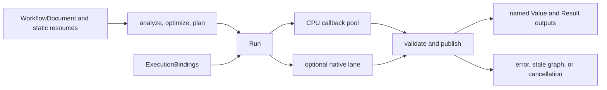

# Compiler and Local Execution

## Scope and ownership

The compiler validates a `WorkflowDocument`, resolves operation contracts, and produces immutable semantic, optimized, and physical plan objects. `ExecutionContext` owns the bounded CPU pool, optional native backend lane, caches, and, when `managed_resources` is configured, one resource root shared by its runs and surviving owners. A run owns its continuation state and publishes named Value and Result outputs only after callbacks, cancellation, and graph-currentness checks succeed.

## Planning and execution



`analyze` validates graph structure, operation availability, parameters, ports, and inferred metadata. `optimize` and `plan` preserve the selected named output and its input projection. The planner propagates requested footprints through the selected output's dependency contract. A run schedules ready host work, performs admitted I/O, and validates every publication against the plan.

```cpp
namespace ps {
class Compiler {
 public:
  Result<SemanticGraphIR> analyze(const GraphSnapshot&,
                                  ResourceBindings = {}) const;
  Result<OptimizedGraphIR> optimize(const SemanticGraphIR&) const;
  Result<ExecutionPlan> plan(const OptimizedGraphIR&,
                             const PlanningOptions& = {}) const;
};

class ExecutionContext {
 public:
  Result<ExecutionResult> execute(
      const ExecutionPlan&, ExecutionBindings = {},
      const CancellationToken& = CancellationToken(),
      const ExecutionOptions& = {});
};
}  // namespace ps
```

These are abbreviated member signatures in namespace `ps`. `ExecutionBindings` binds ordinary input Values, regional sources, snapshots, or structured `ResultRef` inputs as declared by each workflow port. A Result image input binds its owning Result according to the declared schema. The executor returns named Values in `ExecutionResult::values` and structured outputs in `ExecutionResult::results`.

## Unified operation scheduling

A node may expose named outputs with independent Value or Result contracts. The planner specializes the selected output and its input projection before execution. Result continuations request typed Value samples, Result fields, image samples, descriptors, or bounded I/O. The coordinator admits each request against the same execution-root limits for work, stages, I/O, relations/maps, payload, and retained owners. A callback can consume Control samples in one stage and request Data support chosen from those samples in a later stage. The published relation records the consumed controls and data support; dirty transpose uses that relation.

Whole CPU operations may use host parallel ranges. CPU tile callbacks execute as indivisible scheduled tasks and may use the coordinator's tile service where their contract permits it. Native operations use the configured native lane and services. Service calls stay on the callback entry thread; worker tasks may only query cancellation and write scratch already admitted for them. GPU submissions drain before callback retirement. A callback can report detailed native failure through the borrowed phase status reader.

The coordinator checks cancellation before stale graph state and then the first sticky failure at scheduling boundaries. It does not preempt in-process callbacks. Once callbacks enter, the run waits for them to retire before releasing borrowed phases and their owners. A failed run returns a typed status and does not publish partial output sets. Shared Result producers keep their captured publication while waiters remain; one waiter's cancellation does not cancel work still needed by another waiter.

## Storage and resources

Ordinary numeric Values retain their Value storage contract. Structured Results own their schema, descriptor facts, typed image backing, relations, and retained input owners. Image pixels use typed Result image slots backed by planar pages; they are not packed primitive Result fields. Captured Result references pin descriptor and relation evidence at one revision.

The execution root charges work, stage state, I/O, relation and map construction, payload capacity, and owner retention. A `ResourceMap` returned by dependency APIs keeps the same root ownership alive. Admission failures are sticky for the active operation. Releasing the final Result/read-window owner releases its backing and retained associations.

## Boundaries

Workflow/plan digests are identity contracts, not serialization or security boundaries. Native operation modules execute as trusted in-process code. The kernel does not own daemon IPC, durable jobs, process isolation, or recovery. Production image operations whose source still uses image Values or the retired planar callback route are not runnable through the unified Result image path; see [Image operations](Image-Operations.md).
