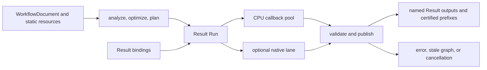

# Compiler and Local Execution

## Scope and ownership

The compiler validates a schema-5 `WorkflowDocument`, resolves Result operation contracts, and produces immutable semantic, optimized, and physical plans. `ExecutionContext` owns the bounded CPU pool, optional native backend lane, caches, and a resource root shared by runs and surviving owners. The context uses default `ResourceLimits` unless `managed_resources` supplies explicit limits; `maximum_live_bytes` also limits Payload. A Run owns continuation state and returns named Results only after callbacks retire and cancellation and graph-currentness checks permit publication.

`WorkflowInputDeclaration` stores an id, exact name, and required Result schema. `ExecutionBinding` stores a name and owning `ResultRef`. Value remains typed backing used by Result storage and codecs. Input metadata describes the Result schema; tensor shape, facets, and layout belong to `ResultTensorSpec`.

`FrozenExecution` shares immutable state containing its plan, binding snapshot, operation registry, and execution identity. `plan()` returns a borrowed reference valid while the handle retains that state. `for_region` creates a new state with an independent tile plan and the captured bindings, registry, and identity. Each frozen execution captures the handle before entering the Run and gives structured execution a shared owner for the plan. Ordinary `ExecutionPlan` calls borrow the plan unless the caller supplies a plan owner.

For a frozen-plan Result producer, cancellation may return while its top-level callback is pending only when another live caller still needs that producer. The Run retires the cancelled caller's subscription and registers a strong coordinator owner in the context's `SharedResults` registry. A peer's Result wait pumps that registry on the peer's calling thread; no worker is created for handoff. The coordinator waits for callback retirement before inspecting actor state or changing its driver thread. If registration fails or the peer leaves before ownership transfers, the original call withdraws temporary registration and drains synchronously. Borrowed-plan calls and runs without a live peer also drain synchronously. This handoff does not make synchronous cache replay or worker-internal paths independently cancellable.

Context shutdown cancels shared work, releases the registry table lock, and drains parked coordinators. The registry strongly owns parked coordinators, while producer entries do not own drivers. This keeps pending callback state alive without forming an entry-to-driver cycle. A `DemandHandle` request captures the current generation with a frozen plan; replacement advances the generation while older requests retain their original plan and input owners.

## Planning and execution



`analyze` validates graph structure, operation availability, parameters, ports, and inferred schemas. `optimize` and `plan` preserve the selected named output and its input projection. The planner propagates requested footprints through the selected output's dependency contract. A Run schedules ready work, performs admitted I/O, and validates each publication against the plan. `ExecutionOptions::result_publication` notifies the caller as certified Result prefixes become available. A prefix is not complete execution success; callback failure stops the Run and follows the existing failure, cancellation, and retirement path.

```cpp
namespace ps {
struct WorkflowInputDeclaration {
  std::uint64_t id;
  std::string name;
  std::shared_ptr<const SchemaTemplate> result_schema;
};
struct ExecutionBinding {
  std::string name;
  ResultRef result;
};
struct ExecutionOptions {
  std::function<Status(ValueRef, const ResultRef&)> result_publication;
};
struct ExecutionResult {
  ResourceMap<ResultRef> results;
};
}
```

The excerpt shows the Result fields relevant to callers; it omits default member values and unrelated diagnostics and execution controls. `ExecutionContext::execute` accepts these bindings and returns named Results. The C++ operation entry is `start_result`, which returns a `ResultContinuation`; optional joint callbacks group compatible Result work.

## Operation scheduling and errors

Result continuations request typed tensor samples, Result fields, descriptors, relations, or bounded I/O. The coordinator admits each request against the execution root's limits for work, stages, I/O, relations and maps, payload, and retained owners. A continuation may consume Control samples in one stage and request Data support selected from those samples in a later stage. Its published relation records the consumed controls and data support; dirty transpose uses that relation. Ordinary execution runs every non-side-effect-free operation as a mandatory root, even when no named output selects it. Fragment and atom execution do so when the query contains any nonempty demand; an empty query skips unrelated effect roots. Within a Run, the internal actor identity for an effectful tensor output uses slot zero with full coverage, so later requests reuse that actor. This identity normalization does not authorize other tensor slots: each slot still must satisfy its own Need and publication checks. Effectful work is not shared or cached across Runs, and failure or cancellation of a mandatory root fails the enclosing Run.

A `ResultContinuation` admits one poll at a time with nonblocking atomic admission. A concurrent or reentrant poll returns `InvalidArgument` with `Protocol/Group` detail without entering the callback or changing the admitted phase, first failure, or work accounting. Admission remains held through exception handling and publication checks. Callers must keep the continuation alive and inactive while moving or destroying it; continuation state is destroyed once. `OperationRegistry::start_result` checks cancellation before and after the operation factory. Cancellation observed after factory entry takes precedence over allocator failure, factory status, or invalid returned state; returned state is destroyed before the call returns, while the definition lease remains held through destruction.

Whole CPU operations may use host parallel ranges. CPU tile callbacks execute as indivisible scheduled tasks and can use the coordinator's tile service where their contract permits it. Native operations use the configured native lane and services. Service calls stay on the callback entry thread; worker tasks may query cancellation and write only scratch already admitted for them. GPU submissions drain before callback retirement. A callback can report native failure through the borrowed phase status reader.

`OperationTraits::allows_cpu_fallback` opts an operation into CPU retry after a GPU attempt reports `BackendUnavailable`; the operation must provide both implementations. Start-time retry requires CPU support, the trait flag, deterministic and side-effect-free traits, and clear cancellation, currentness, operation-failure, and host-service checks. Poll-time retry additionally requires deterministic and side-effect-free traits, a retry-safe attempt, no published output, no mandatory I/O, checkpoint or block callback, native dispatch, field I/O, actual cancellation, stale plan, or host stop. The retry status must be an unqualified `BackendUnavailable` (`reason=None`, origin unspecified or backend, scope unspecified or group). A separate host-service veto blocks retry if any later typed resource, protocol, callback, observer, or other nonretryable failure occurred, while the first recorded status remains the reported cause. The executor releases the failed GPU continuation and its read capabilities, switches the query to CPU, and starts a new attempt with fresh failure owners. Root work and stage usage remain charged. Other errors propagate without retry, and fallback-tainted results bypass optional checkpoint, block, and completed-result caches.

The coordinator checks cancellation before stale graph state and the first sticky failure at scheduling boundaries. It does not preempt in-process callbacks. Once a callback enters, the Run waits for it to retire before releasing borrowed phases and owners. A failed Run does not return a partial output set. Shared Result producers keep their captured publication while waiters remain; one waiter's cancellation does not cancel work required by another waiter.

## Cache statistics

`ExecutionContext::cache_statistics()` returns synchronized context-local observations. It preserves retained-result cache counters and adds observations from dependency Flights and structured Result sharing without combining their scopes. `shared_computations` is cumulative and records each successful non-producer acquire, including joins to active work and weak reuse of a completed Result. `in_flight` counts active work; for structured Results it tracks unfinished producer epochs while the producer lease exists. Weak Result references do not increase retained entries or bytes.

## Storage and resources

Structured Results own their schema, descriptor facts, typed tensor backing, relations, and retained input owners. Image pixels use typed Result tensor slots backed by planar pages; they are not packed primitive Result fields. Captured Result references pin descriptor and relation evidence at one revision. The execution root charges work, stage state, I/O, relation and map construction, payload capacity, and owner retention. A returned `ResourceMap` keeps the same root ownership alive. Releasing the final Result or read-window owner releases its backing and retained associations.

`ExecutionDiagnostics::peak_live_bytes` reports the maximum committed controlled Payload backing attributed to the current Run. It includes allocations made by parallel callbacks and its own shared producer while both contribute to that Run's observation, but excludes caller-preexisting input backing and prior completed-cache storage. `planned_peak_bytes` reports the peak reserved Payload capacity, including full CPU reservations and incremental native allocations; it is a capacity reservation measure, not committed bytes. `shared_peak_live_bytes` is the largest allocation peak among active shared producer epochs used by the call. A joint shared producer contributes its aggregate epoch peak. Reusing a completed cached Result adds no peak from the earlier producer epoch. These counters describe Root-controlled backing, including published planar pages, not process RSS.

## Boundaries

Workflow and plan digests identify compiler content; they are not serialization or security boundaries. Native operation modules execute as trusted in-process code. The kernel does not own daemon IPC, durable jobs, process isolation, or recovery. A registered production image operation is usable through the unified Result image path only when its implementation provides the required typed Result contract; see [Image operations](Image-Operations.md).
