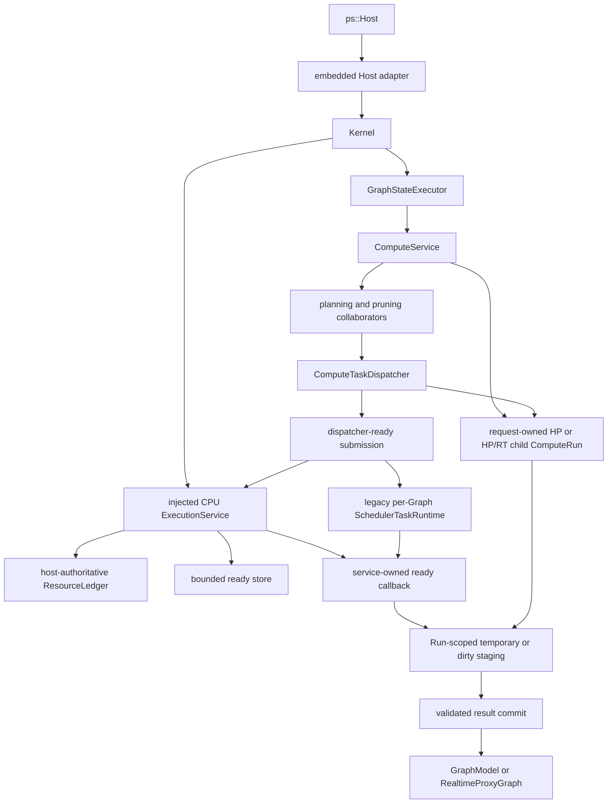

# Compute Boundaries

This document describes current software behavior and implementation ownership
inside the compute subsystem.

## Scope

The compute subsystem accepts one validated internal request, derives work for
one HP domain or coordinated HP/RT siblings, executes operations, and publishes
the intent-specific result. It does not own graph document persistence,
frontend rendering, daemon
transport, or process-wide operation plugin lifetime.

The public caller reaches compute only through `ps::Host`. The embedded adapter
translates public `HostComputeRequest` values into internal Kernel and
`ComputeService` requests. No public API exposes a `ComputeService`, plan, task
graph, or scheduler pointer. Request, propagation, planning, and execution
geometry remains `PixelRect`/`PixelSize` through `NodeExecutor`; OpenCV geometry
exists only inside a provider or algorithm implementation at the library call
that consumes it.

## Ownership Map

`GraphStateExecutor` owns current per-graph exclusion. Planning and dispatch
remain compute responsibilities even when ready callbacks execute on scheduler
workers.

The current exclusion mechanism is a bounded serial FIFO lane. Every accepting
`GraphStateExecutor` owns exactly one worker. Its queue holds at most 64 waiting
callbacks, excluding the at-most-one active callback, so a Graph owns at most
65 admitted graph-state callbacks. `submit()` blocks the caller while the queue
is full; it neither creates another lane worker nor drops or bypasses admitted
work. Producer fairness before admission is not guaranteed, but admitted work
executes FIFO.

Each submission returns a packaged-task future with the callable's exact value,
reference, `void` completion, or exception. Destroying that future neither
waits nor cancels the task; executor lifetime retains admitted work. A callback
cannot submit to or close its own lane: worker re-entry throws
`std::logic_error` before queue waiting. The sole worker owns the whole callback,
including scheduler submission, completion waits, and visible commit.

`close_and_drain()` is concurrent-call and repeat-call idempotent. It stops
admission, wakes full-queue producers with `std::runtime_error`, drains prior
work FIFO, and joins the worker before returning. Each caller waits for the
durable close generation that it joined; a failed-stop restart may reopen a
later accepting generation before a delayed caller wakes without trapping that
caller or creating a second worker. `GraphRuntime` performs the join before
scheduler teardown. If explicit close later fails in scheduler shutdown,
Kernel starts one replacement lane worker before returning the failure so the
retained session remains retryable. Different graphs have independent workers
and queues. The Host-composition resource ledger does not charge these lane
workers or fixed service threads; they remain infrastructure. Its CPU dimension
instead admits per-Run execution rights and conservative legacy
scheduler-owner slots.

## Current Collaborators

| Module | Current responsibility | Does not own |
| --- | --- | --- |
| `ComputeService` | Request validation, intent coordination, creation/settlement of one HP Run or separate HP/RT child Runs, collaborator construction, and final result selection | Frontend values, worker threads, graph documents, or target `RunGroup` policy |
| `ComputeRun` | Immutable single-domain HP/RT descriptor, monotonic phase, exact terminal outcome, shared-control ownership of full-plan/temporary or dirty-HP staging storage, stable leases, and composite task identity | Paired realtime grouping, Graph state, workers, authoritative revision commit, cancellation, or resource admission |
| `ComputeCachePolicy` | HP cache eligibility and cache-path decisions | Disk I/O ownership or operation execution |
| `NodeInputResolver` | Runtime parameters and ready image inputs | Graph traversal or output commit |
| `FullTaskGraphExpander` | Complete node/tile task shape for one graph generation and domain | Request target, cache pruning, dirty pruning |
| `NodeCacheTaskGraphPruner` | Target/dependency cone and cache-aware request plan | New node or tile task shapes |
| `ComputeDispatchPlanBuilder` | Cache-pruned high-precision plan and inspection record | Scheduler queues |
| `DirtyRegionPlanner` | Graph-scoped dirty propagation snapshot | Compute dependency counters |
| `DirtySnapshotTaskGraphPruner` | Active dirty work selected from an existing plan | Task expansion |
| `IntentUpdateCoordinator` | HP-only or HP/RT sibling semantics | Physical priority or worker ownership |
| `ComputeTaskDispatcher` | Dependency counters, ready release, temporary-result indexing, completion, exceptions, full HP commit, and dirty source-first submission helper | Run storage, graph topology derivation, dirty staged commit, or scheduler policy |
| `TaskSubmissionPlan` | Run-owned dense indexes, dependency state, exact-once task state, variants, result slots, and callback owner for one full HP request | Scheduler workers, Run terminal state, or dirty-path execution |
| `ReadyTaskSubmission` | Move-only immutable metadata, composite task identity, matching Run lease, and owned executable for one dependency-ready task | Planning, dependency derivation, Graph/cache authority, or commit |
| `ExecutionService` | One injected fixed built-in CPU worker domain, one host-authoritative `ResourceLedger`, entry/byte-bounded high/normal ready storage, atomic whole-Run resource admission, Run-local completion/failure/trace settlement, and HP/RT dirty/preflight execution | Planning, dependencies, Graph/cache state, fairness policy, GPU/plugin execution, lifecycle admission registry, or visible commit |
| `NodeExecutor` | Consistent monolithic and tiled operation invocation | Graph mutation policy |
| `ComputeMetricsRecorder` | Compute events, timing, benchmark events, and debug metadata | Scheduler trace ownership |
| `SchedulerFactory` | Resolve `0..8` worker requests and plan each scheduler's conservative slot charge before construction | Process capacity ownership or graph-state access |
| `ResourceLedger` | Atomically reserve checked CPU, retained-memory, scratch, ready-entry, and ready-byte vectors; mint bounded child grants; release exact vectors after parent/child ownership ends | Worker creation, ordering policy, task dependencies, device/I/O/plugin resource guesses, or lifecycle admission |
| `ReservationOwnedScheduler` | Keep a move-only reservation live through concrete scheduler shutdown and destruction | Capacity planning or task-graph correctness |

Compute collaborators live under `src/lib/compute/`; the ledger lives under
`src/lib/runtime/`, and legacy scheduler planning/ownership lives under
`src/lib/scheduler/`. These classes are private implementation modules and do
not form an installable API.

Current built-in CPU admission combines a mandatory checked service envelope
with an auditable adapter envelope. Shared Run/control/plan or phase-context
retained storage is charged once. Uniform per-task retained and scratch demand
is multiplied by maximum callback concurrency, while ready entries and bytes
are multiplied by every logical task so dependency release is already covered.
Initial and dependent entries use the same estimator and insertion boundary.
The estimator counts only visible Host-owned C++ storage; image pixels and
opaque backend, device, plugin, or allocator-owned allocations are not
fabricated. Current built-in adapters declare zero scratch only because they own
no separately metered fixed Host scratch.

Issue #70 deliberately removes the installed inline
`kSchedulerWorkerProcessMax` constant. Source consumers that referenced it must
stop depending on that policy constant; no alias or installed public
replacement is provided. Composition limits now use the private source-tree
`ExecutionResourceLimits`. The scheduler ABI v2 object layout, vtable, and
numeric plugin handshake remain unchanged; issue #75 owns the complete
scheduler ABI replacement.

## Request Behavior

1. `Kernel` resolves the session and enters the graph-state access boundary.
2. `ComputeService` validates target, intent, dirty ROI, cache flags, and the
   selected execution strategy.
3. For non-realtime HP, `ComputeService` creates one `ComputeRun` before
   planning. For realtime it creates separate HP and RT child Runs before
   preflight. Each captures a fresh id, session identity, topology-only
   submission revision, target, single-domain intent, full or interactive
   quality, and explicit QoS. No target `RunGroup` exists yet.
4. Connected parameter producers are stabilized into one request-local HP
   snapshot before extent, ROI, or task-shape decisions use them.
5. The planner expands the complete task shape for one domain and prunes it to
   the requested target and dependency cone.
6. A dirty request selects an active work set from that plan. Dirty state does
   not create new task shapes.
7. Sequential execution walks the same request semantics inline. Every
   built-in CPU parallel phase materializes move-only
   `ReadyTaskSubmission` values that retain a Run lease and
   `(RunId, RunLocalTaskId)`, then sends only ready work to the fixed
   `ExecutionService`. Full HP uses `TaskSubmissionPlan`; preflight and dirty
   HP/RT use heap-owned phase contexts. Serial, GPU, and plugin routes retain
   their selected per-Graph schedulers.
8. Workers write Run-owned full-plan temporary results or dirty-HP staging.
   RT staging remains sibling-callback-local but all service callbacks retain
   the RT child lease through synchronous settlement. Visible graph state is
   modified only by the appropriate commit path.
9. A single HP Run, or each realtime child independently, publishes one
   success or failure after validated output or exact exception capture. The
   coordinator returns RT output only after both children settle; result,
   events, timing, and errors then cross the Host value boundary.

## Planning Invariants

- Full expansion is keyed by graph topology generation, compute intent, and
  task-shape configuration.
- A force-recache request invalidates reusable expansion when current input or
  parameter state may change output extent without changing topology.
- Request target, cache availability, and dirty state prune existing task
  shapes; they do not redefine graph topology.
- A `ComputeTaskGraph` is immutable while a scheduler-visible callback derived
  from it may still execute.
- HP and RT are separate compute domains. One plan does not create cross-domain
  task dependencies.
- Host, graph, planning, dirty work-set, staged-write, and `NodeExecutor`
  boundaries carry kernel-owned `PixelRect`/`PixelSize`, never OpenCV geometry.
- Tiled input normalization occurs once per node invocation where possible,
  rather than once per tile callback.

These rules make planning deterministic and keep the scheduler independent of
graph semantics. Planning cost therefore follows full expansion before
pruning. Lazy task creation is not part of the current planning contract.

## Dispatcher and Scheduler Boundary

The dispatcher owns request correctness while `ComputeRun` owns the current
full HP storage:

- dependency counters and dependent maps;
- source-first dirty task release;
- task reference accounting;
- indexing and transitions over Run-owned temporary result slots;
- exception normalization and completion aggregation;
- validation of an empty plan;
- final target selection and full HP commit; dirty executors own their staged
  commit after reusing the source-first submission helper.

The selected physical domain owns the current mechanism:

- worker lifecycle and ready queues;
- Run-local settlement in the service or batch/epoch state in legacy
  schedulers;
- implementation-specific task ordering;
- completion and exception publication;
- bounded trace publication through the Host context.

Neither route receives `GraphModel`, `ComputeTaskGraph`,
`DirtyRegionSnapshot`, or cache authority. Newly ready dependent work is
released by `TaskSubmissionPlan`: the migrated route creates another
`ReadyTaskSubmission`, while legacy routes push another lease-backed callback
or dirty handle.

The issue #70 CPU service is explicitly composed before Kernel and owns one
direct fixed worker pool, one host-authoritative ledger, and one bounded ready
store. Configuration resolves and freezes `[1,8]` infrastructure workers once;
Graph load, replacement, Run execution, and dirty phases never resize it.
Every Run reserves its complete checked CPU/retained/scratch/ready vector
before publication. Initial and dependency-released work both require matching
ready-entry/byte grants and enter the same high/normal store. Queue removal
exchanges that grant for CPU/memory/scratch execution authority. Completion,
failure, and exceptional paths release the exact vector once. Independent Runs
remain isolated. High-before-normal is priority separation, not final
cross-Run fairness, cancellation, or policy authority.

Built-in CPU bindings are ownerless at `GraphRuntime` for both intents. Serial,
GPU, and plugin scheduler resources remain owned per Graph and intent, but
their conservative CPU-slot reservations come from the same
`ExecutionService` ledger used by Runs. Legacy replacement reserves candidate
headroom while the old owner remains live. Built-in serial charges zero;
registered ABI v2 plugins charge their resolved grant; built-in
GPU/heterogeneous also charges its potential device worker. The ledger does
not invent device, I/O, or plugin-specific dimensions.

## OpenCV Operation Concurrency

Repository-owned CPU OpenCV operations are reentrant provider work. The
built-in provider has no process-wide operation mutex. Its monolithic
`convolve`, `resize`, `crop`, `extract_channel`, `gaussian_blur`,
`add_weighted`, `abs_diff`, and `multiply` callbacks, together with tiled
`curve_transform`, `gaussian_blur`, `add_weighted`, `abs_diff`, and `multiply`,
may run concurrently across tiles, Graphs, and HP/RT intent routes. Callback
inputs are immutable; mutable `cv::Mat` headers, temporaries, and output regions
are callback-local or task-owned.

The same rule applies at the registry boundary. Registry locks serialize
ownership mutation, publication, coherent snapshot capture, and unload, but
they are released before callback invocation. Every provider must therefore
make its callback reentrant or synchronize its own shared mutable state. A
shared operation key, device, intent, or callback owner never implies
single-threaded execution.

The optional OpenCV provider calls `cv::setNumThreads(1)` exactly once before
publishing its callbacks. It uses `cv::Mat`, does not call
`cv::ocl::setUseOpenCL(false)`, and does not reconfigure OpenCV threading while
callbacks may be active. Its callback fence catches every `cv::Exception`
raised by a registered algorithm while still inside provider code. OpenCV
resource exhaustion becomes a fresh `std::bad_alloc`; every other OpenCV
failure becomes a host-owned `GraphError` with `GraphErrc::ComputeError`. The
admitted scheduler worker grant is therefore the repository-owned outer CPU
parallelism layer, while OpenCV internal CPU parallelism remains disabled.

`PHOTOSPIDER_BUILD_OPENCV_OPERATION_PROVIDER=OFF` omits this provider's
callbacks but leaves dependency-neutral core operations registered. The
registry and v2 registrar do not depend on OpenCV: another provider can publish
the absent operation, or replace an enabled OpenCV operation through the same
slots. Manager-driven unload retires the replacement and restores the captured
predecessor.

Synchronization around genuine backend state remains provider-local. The
Metal Perlin provider retains a DSO-private mutex around its shared Metal
device, queue, pipeline, and buffers; that mutex is neither an OpenCV operation
lock nor a scheduler exclusivity contract. OpenCV use outside repository-owned
providers, third-party internal threads, and platform runtime workers remain
outside scheduler worker accounting.

[ADR 0004](../adr/0004-opencv-cpu-operations-are-reentrant-provider-work.md)
records this decision. Durable integration coverage proves exact callback
overlap for `1/2/4/8` grants and bitwise-equal one-versus-eight-worker output;
the manual native scaling evidence is documented in
`../development/Testing-and-Validation.md`.
[ADR 0002](../adr/0002-external-libraries-are-kernel-adapters.md) and the exact
[dependency-neutral kernel target](../roadmap/Kernel-Evolution.md#dependency-neutral-kernel)
place OpenCV algorithms, codecs, exception translation, and process state
inside an optional provider/adapter instead of letting them define target
kernel semantics.

## Intent and Commit Boundaries

`GlobalHighPrecision` and `RealTimeUpdate` describe business semantics, not
resource policy. A real-time update coordinates an RT proxy sibling and an HP
authoritative sibling. Each sibling has its own domain plan, dirty snapshot,
staged output, and scheduler selection.

`IntentUpdateCoordinator` creates the current sibling concurrency with two
asynchronous calls. The selected schedulers execute ready work inside each
sibling; they do not create the sibling relationship or infer it from task
metadata.

The current normal compute policy holds per-graph exclusive access through
visible commit. Dirty paths already use narrower staged buffers:

- `RealtimeProxyWriteBuffer` commits only to `RealtimeProxyGraph`;
- `HighPrecisionDirtyWriteBuffer` commits authoritative HP output to
  `GraphModel` after the sibling commit gate opens.

This staging prevents partially assembled tile output from becoming visible.
It is not yet a general cancellation or graph-revision policy.

## Failure and Lifetime Semantics

- Invalid targets, intent/ROI combinations, planning contracts, and operation
  failures are reported through categorized graph errors and Host status
  values.
- Resource exhaustion may propagate as `std::bad_alloc` across documented
  non-destructor Host boundaries.
- An above-eight worker request, a positive request conflicting with the fixed
  service count, or an unknown scheduler type fails as `InvalidParameter`;
  ledger exhaustion while admitting a Run or legacy owner preserves
  `GraphErrc::ComputeError`.
- Fixed service workers remain uncharged infrastructure until service
  destruction. Active Run reservations and legacy scheduler reservations share
  the ledger CPU dimension. Legacy reservations outlive their concrete workers
  during teardown: candidate rollback returns only candidate capacity,
  successful graph close or Host destruction returns retained capacity exactly
  once, and legacy replacement requires transient headroom.
- Once built-in CPU selection successfully configures the fixed pool, even if
  that selecting load later fails during document ingestion, the unpublished
  Graph runtime and legacy candidate owners/reservations roll back while the
  uncharged Kernel-lifetime service configuration remains.
- An admitted scheduler batch is settled before its exception escapes the
  current request.
- Operation callbacks may already have external side effects; staged graph
  output does not roll those effects back.
- Scheduler-backed full HP work no longer borrows a raw `TaskExecutor`.
  `TaskSubmissionPlan` owns its runner. Built-in CPU ready work crosses the
  service boundary as `ReadyTaskSubmission`; legacy full HP uses an owned
  callback. Both retain a `ComputeRunLease`, and failure publication must match
  `(RunId, RunLocalTaskId)`. Only the legacy path uses an empty borrowed-handle
  batch to establish its scheduler epoch. Built-in CPU dirty/preflight work
  uses heap-owned phase contexts and child Run leases; only legacy dirty
  schedulers retain the synchronous borrowed-handle path.

## Boundary Rationale

Separating planning, ready detection, physical execution, and commit provides
four independent correctness points:

1. Graph and ROI semantics can be tested without a worker pool.
2. Scheduler implementations can change ordering without owning Graph state.
3. Temporary output can be validated before becoming visible.
4. Physical execution ownership remains separable from dependency correctness.

[ADR 0003](../adr/0003-process-owned-execution-resources.md),
[ADR 0007](../adr/0007-compute-runs-and-process-execution-have-separate-owners.md),
and the exact
[process execution domain target](../roadmap/Kernel-Evolution.md#process-execution-domain)
record the accepted replacement direction and detailed ownership contract.
This document is authoritative through issue #70: the fixed multi-Graph HP/RT
CPU service, ownerless built-in CPU bindings, separate realtime child Runs,
owned dirty/preflight submissions, atomic vector admission, bounded ready
storage, and retained legacy per-Graph schedulers sharing one host ledger.
Authoritative revision, `RunGroup`, lifecycle admission, cancellation,
supersession, and final policy remain future behavior.

## Implementation and Validation Entry Points

- `src/lib/compute/compute_service.*`
- `src/lib/compute/compute_run.*`
- `src/lib/compute/execution_service.*`
- `src/lib/compute/task_graph_planning.*`
- `src/lib/compute/compute_dispatch_plan_builder.*`
- `src/lib/compute/compute_task_submission.*`
- `src/lib/compute/compute_task_dispatcher.*`
- `src/lib/compute/dirty_region_planner.*`
- `src/lib/compute/dirty_update_executor.*`
- `src/lib/compute/intent_update_coordinator.*`
- `src/lib/core/ops.cpp`
- `src/lib/providers/configured_operation_providers.*`
- `src/lib/providers/opencv/*`
- `src/lib/runtime/resource_ledger.*`
- `src/lib/scheduler/scheduler_factory.*`
- `src/lib/scheduler/scheduler_worker_limits.*`
- `src/lib/scheduler/scheduler_reservation_owner.*`
- `tests/integration/test_compute_service_split.cpp`
- `tests/integration/test_scheduler.cpp`
- `tests/integration/test_resource_admission.cpp`
- `tests/unit/test_scheduler_factory_plan.cpp`
- `tests/unit/test_scheduler_reservation_owner.cpp`
- `tests/unit/test_resource_ledger.cpp`
- `tests/unit/test_compute_run.cpp`
- `tests/unit/test_propagation_contracts.cpp`
