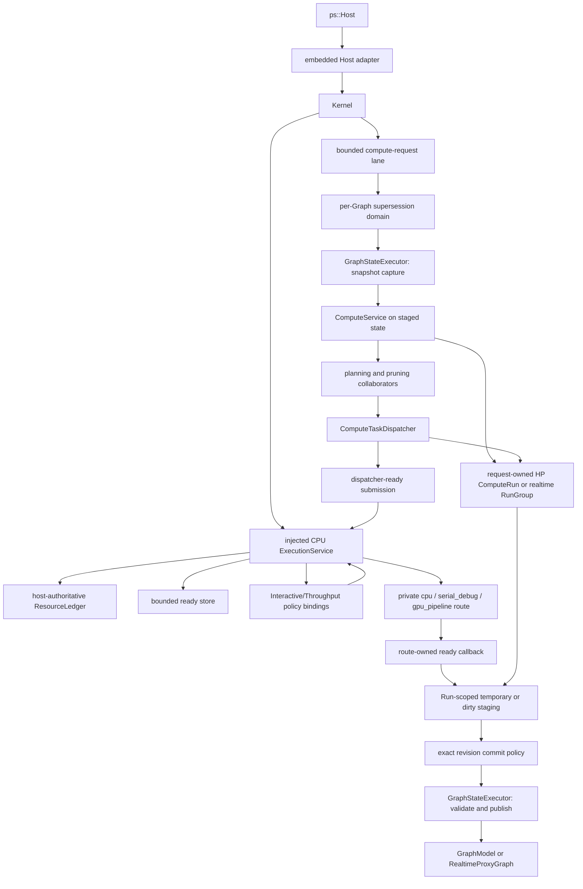

# Compute Boundaries

This document describes current software behavior and implementation ownership
inside the compute subsystem.

## Scope

The compute subsystem accepts one validated internal request, derives work for
one HP domain or coordinated HP/RT siblings, executes operations, and publishes
the intent-specific result. It does not own graph document persistence,
frontend rendering, daemon
transport, or process-wide operation plugin lifetime.

The public caller reaches compute only through `ps::Host`. The embedded adapter
translates public `HostComputeRequest` values into internal Kernel and
`ComputeService` requests. No public API exposes a `ComputeService`, plan, task
graph, or physical executor/policy pointer. A public compute request may carry
an optional positive `maximum_parallelism` Run ceiling; it cannot resize or
select the process executor. Request, propagation, planning, and execution
geometry remains `PixelRect`/`PixelSize` through `NodeExecutor`; OpenCV geometry
exists only inside a provider or algorithm implementation at the library call
that consumes it.

## Ownership Map

`GraphStateExecutor` owns visible Graph capture, mutation, predicate, and
publication exclusion. The separate compute-request lane owns same-Graph
compute and route-replacement order. Planning and dispatch remain compute
responsibilities even when ready callbacks execute on private route workers.

The current exclusion mechanism is a bounded serial FIFO lane. Every accepting
`GraphStateExecutor` owns exactly one worker. The graph-state lane retains its
historical bound of 64 waiting callbacks plus at most one active callback. The
compute-request lane instead charges exactly 64 total queued, running, or
parked one-shot/ticket admissions; active work is not a hidden sixty-fifth
unit. Each key adopts one reserved continuation with one persistent FIFO node.
`wake()` and worker-tail handoff reuse that token/node without allocation,
self-submit, or capacity waiting. Ordinary `submit()` and new-key reservation
block at the selected bound; they neither create another lane worker nor drop
or bypass admitted work. Producer fairness before admission is not guaranteed,
but queued work executes FIFO.

Both lanes reuse the same executor lifecycle. Each one-shot submission returns a
packaged-task future with the callable's exact value,
reference, `void` completion, or exception. Destroying that future neither
waits nor cancels the task; executor lifetime retains admitted work. A callback
cannot submit to or close its own lane: worker re-entry throws
`std::logic_error` before queue waiting. The existing compute-request worker is
the sole logical active-request runner: each reserved-ticket turn materializes
at most one generation and runs the existing Kernel/ComputeService path. It
enters graph-state only for generation publication, snapshot capture, or the
final exact revision/generation transaction; no per-Graph background runner or
per-generation thread is created.

`close_and_drain()` is concurrent-call and repeat-call idempotent. It stops
admission, wakes full-queue producers with `std::runtime_error`, drains prior
work FIFO, and joins the worker before returning. Each caller waits for the
durable close generation that it joined; a failed-stop restart may reopen a
later accepting generation before a delayed caller wakes without trapping that
caller or creating a second worker. `GraphRuntime` stops and drains compute
requests first while graph-state remains available for accepted commits, then
drains graph-state before releasing Graph-local state. Different graphs have
independent workers and queues. The Host-composition resource ledger does not
charge these lane workers or fixed service threads; they remain infrastructure.
Its CPU dimension instead admits per-Run execution rights committed by the
Host-owned reserved-start transaction.

## Current Collaborators

| Module | Current responsibility | Does not own |
| --- | --- | --- |
| `ComputeRequestCoordinator` | Per-live-Graph checked generation allocation, graph-state publication, one latest mailbox and reserved ticket per admitted key, active-source supersession notification, exact pending settlement, and one logical active-runner slot | Run plans, staging, execution workers, Graph lifetime leases, lifecycle registry, telemetry, or public ABI |
| `ComputeService` | Request validation, intent coordination, creation/settlement of one HP Run or one realtime `RunGroup` with separate HP/RT children, staged commit-policy invocation, collaborator construction, and final result selection | Frontend values, worker threads, graph documents, live Graph revision/generation authority, or public cancellation policy |
| `RunGroup` | One realtime request identity, distinct HP/RT child Runs and observation leases, request-wide cancellation fan-out, RT-first gate, and deterministic aggregate outcome | Child plans/dispatchers, Graph state, workers, resource reservations, lifecycle registry, or public controls |
| `ComputeRun` | Immutable single-domain HP/RT descriptor with exact Graph identity/revision and request supersession identity, monotonic phase, a private weak-lifetime cancellation source, read-only lease observation, one terminal/commit arbiter, shared-control ownership of full-plan/temporary or dirty-HP staging storage, stable leases, and composite task identity | Paired realtime grouping, Graph state, workers, revision/generation mint or publication authority, public cancellation control, or resource admission |
| `ComputeCommitPolicy` | Product-only validation of exact Run/staged/live provenance and current supersession generation, a retained read-only Run lease, in-transaction cancellation observation and Run-owned commit-contender resolution, deferred HP cache persistence, and serialized visible publication before Run success | Planning, execution workers, a cancellation source or arbitrary cancellation authority, final lifecycle registry, or public ABI |
| `ComputeCachePolicy` | HP cache eligibility and cache-path decisions | Disk I/O ownership or operation execution |
| `NodeInputResolver` | Runtime parameters and ready image inputs | Graph traversal or output commit |
| `FullTaskGraphExpander` | Complete node/tile task shape for one graph generation and domain | Request target, cache pruning, dirty pruning |
| `NodeCacheTaskGraphPruner` | Target/dependency cone and cache-aware request plan | New node or tile task shapes |
| `ComputeDispatchPlanBuilder` | Cache-pruned high-precision plan and inspection record | Ready-store or route ordering |
| `DirtyRegionPlanner` | Graph-scoped dirty propagation snapshot | Compute dependency counters |
| `DirtySnapshotTaskGraphPruner` | Active dirty work selected from an existing plan | Task expansion |
| `IntentUpdateCoordinator` | HP-only or HP/RT sibling semantics | Physical priority or worker ownership |
| `ComputeTaskDispatcher` | Dependency counters, ready release, temporary-result indexing, completion, exceptions, full HP commit, and dirty source-first submission helper | Run storage, graph topology derivation, dirty staged commit, policy ranking, or physical execution |
| `TaskSubmissionPlan` | Run-owned dense indexes, dependency state, exact-once task state, frozen implementation/device snapshots, result slots, and callback owner for one full HP request | Execution-route workers, Run terminal state, or dirty-path execution |
| `ReadyTaskSubmission` | Move-only immutable metadata, selected `Device`, composite task identity, matching Run lease, and owned executable for one dependency-ready task | Planning, dependency derivation, Graph/cache authority, or commit |
| `ExecutionService` | One Host-owned fixed CPU pool, one service-owned Metal lane, private `serial_debug` and `gpu_pipeline` routes, one host-authoritative `ResourceLedger`, policy-aware bounded ready storage, process policy bindings, reserved-start transactions, exact-Run queued purge/running drainage, and Run-local completion/failure/trace settlement | Planning, dependencies, Graph/cache state, cancellation authority, lifecycle admission registry, or visible commit |
| `NodeExecutor` | Consistent monolithic and tiled operation invocation | Graph mutation policy |
| `ComputeMetricsRecorder` | Compute events, timing, benchmark events, and debug metadata | Execution-trace ownership |
| `PolicyRegistry` and policy bindings | Validate built-in/DSO policy types, own process-scoped contexts and DSO leases, and rank immutable Host-authored candidate snapshots | Workers, queues, resource grants, Runs, Graphs, completion, or start authority |
| `ResourceLedger` | Atomically reserve checked CPU, retained-memory, scratch, ready-entry, and ready-byte vectors; mint bounded child grants; release exact vectors after parent/child ownership ends | Worker creation, ordering policy, task dependencies, device/I/O/plugin resource guesses, or lifecycle admission |
| `GraphRuntime::ExecutionRouteBinding` | Store one copied private route id and nonzero generation per intent | Physical route ownership, policy context, workers, queues, or reservations |

Compute collaborators live under `src/lib/compute/`; the ledger and Graph route
bindings live under `src/lib/runtime/`; policy loading/binding lives under
`src/lib/policy/`; and private route execution lives under
`src/lib/execution/`. These classes are private implementation modules and do
not form an installable API. The only installed extension contract in this
area is the pure-C policy ABI declared by
`include/photospider/policy/policy_plugin_api.h`.

Current built-in CPU admission combines a mandatory checked service envelope
with an auditable adapter envelope. Shared Run/control/plan or phase-context
retained storage is charged once. Uniform per-task retained and scratch demand
is multiplied by maximum callback concurrency: the minimum of the fixed worker
count, logical task count, and the Run's optional positive
`maximum_parallelism`. Ready entries and bytes are multiplied by every logical
task so dependency release is already covered. The same cap is enforced again
against Run in-flight state at reserved start; it does not resize the fixed
pool. Initial and dependent entries use the same estimator and insertion
boundary.
Copied graph-identity metadata is charged by actual string capacity plus its
terminator. After every initial value and ready grant has moved into a staged
queue entry, `ExecutionService` destroys the caller-side submission-vector
backing before active-Run publication and settlement waiting; only the staged
entries and then the bounded store retain those submissions. Before each dirty
or connected-preflight service segment, the adapter adds current
staging/snapshot storage and deduplicated missing staging-map entries,
including ordered-map linkage and deterministic empty or seeded visible output
metadata. HP downstream demand reads the current Run-owned write buffer through
the live `ComputeRunLease`, then its phase-local estimator adds only still
missing entries, so source-created entries remain charged without being
counted twice.

Dirty HP and RT demand also charges the complete request-owned
`DirtyNodeSynchronization`: the shared allocation, unordered-map buckets,
values and linkage, every `unique_ptr`-owned `std::mutex`, and visible object
storage. Allocator-private map metadata and opaque platform mutex allocation
remain excluded. Concurrent HP/RT siblings conservatively include the same
shared synchronization object in both independent phase reservations. This
intentional double reservation lets either sibling settle first without
leaving the surviving Run's shared ownership unaccounted. The estimator counts
only visible Host-owned C++ storage; future operation-produced image pixels,
named-value growth, and opaque backend, device, plugin, or allocator-owned
allocations are not fabricated. Current built-in adapters declare zero scratch
only because they own no separately metered fixed Host scratch.

During a process-service dirty source segment, the outer task
`std::function` remains live while its lvalue copy is owned by the source
context. Source demand therefore adds one audited callable payload alongside
the context-owned target. The downstream context receives that outer callable
by move. Because C++17 does not require a moved-from `std::function` to be
empty, one private context-construction helper makes destination construction
and outer release inseparable: the factory must return the owned context
successfully, then the helper explicitly clears the outer holder before any
submission construction, phase retained-demand calculation, or admission can
run. Construction failure instead unwinds the outer owner and factory
temporaries normally. Downstream demand consequently covers only the
context-owned target without relying on a standard-library moved-from
representation. A durable regression invokes that same production helper with
an adversarial holder whose move preserves its source target, so deleting the
explicit release fails independently of the active standard library.

The former installed `kSchedulerWorkerProcessMax` constant and worker-owning
scheduler ABI are removed. Source consumers receive no compatibility alias or
installed replacement. Composition limits use the private source-tree
`ExecutionResourceLimits`; third-party policy selection uses the independent
pure-C policy ABI v1 and receives no execution resource.

## Request Behavior

1. `Kernel` resolves the session, normalizes missing intent to HP, forms
   `(target, canonical request intent)`, allocates a checked graph-wide
   generation, and adopts the key's reserved compute-lane ticket outside
   graph-state. A graph-state work item then publishes that generation as
   current, coalesces one pending value, and wakes the ticket.
2. `ComputeService` validates target, intent, dirty ROI, cache flags, and the
   selected execution strategy.
3. One reserved-ticket turn captures request-owned Graph/proxy snapshots in a
   graph-state work item. For non-realtime HP, `ComputeService` creates one
   `ComputeRun` before planning. For realtime it creates one request-owned
   `RunGroup` with separate HP Full and RT Interactive children before
   preflight. Each child captures a fresh Run id, session label, strong Graph
   instance identity, authoritative revision, target, explicit QoS, and the
   request's immutable supersession key/generation. The request cancellation
   source fans its stable first reason to both realtime children; HP-only child
   cancellation remains local.
4. Connected parameter producers are stabilized into one request-local HP
   snapshot before extent, ROI, or task-shape decisions use them.
5. The planner expands the complete task shape for one domain and prunes it to
   the requested target and dependency cone.
6. A dirty request selects an active work set from that plan. Dirty state does
   not create new task shapes.
7. Every execution phase materializes move-only
   `ReadyTaskSubmission` values that retain a Run lease and
   `(RunId, RunLocalTaskId)`, then sends only ready work to the Host-owned
   `ExecutionService`. Full HP uses `TaskSubmissionPlan`; preflight and dirty
   HP/RT use heap-owned phase contexts. All three closed private routes enter
   the common ready store, policy selection, reserved-start transaction, and
   Run-lease completion path. Explicit cancellation or an expired injected
   monotonic deadline is observed at existing planning, queue, callback,
   dependency, phase, and commit boundaries. The service closes and purges
   only the matching Run's queued entries; already entered callbacks drain
   without releasing new dependents or publishing staged output.
8. Workers write only request-owned Graph/proxy state, including Run-owned
   full-plan temporary results or dirty-HP staging. RT staging remains
   sibling-callback-local, and all service callbacks retain the RT child lease
   through synchronous settlement.
9. After validated output, each Run reaches `CommitPending`. The product policy
   retains a read-only Run lease, enters the graph-state work item, observes
   cancellation, and tries to claim the Run-owned one-shot commit contender.
   Cancellation accepted before that claim publishes no Graph, proxy, or
   deferred cache state. Once the contender wins, later cancellation is a
   terminal no-op; the policy validates exact staged/live identity,
   authoritative revision, and current supersession key/generation before
   optionally persisting changed HP artifacts, publishes complete Graph/proxy
   state, and resolves success or exact failure in the same work item. The
   coordinator returns RT output only after both children settle; result,
   events, timing, and errors then cross the Host value boundary.

## Planning Invariants

- Full expansion is keyed by graph topology generation, compute intent, and
  task-shape configuration.
- A force-recache request invalidates reusable expansion when current input or
  parameter state may change output extent without changing topology.
- Request target, cache availability, and dirty state prune existing task
  shapes; they do not redefine graph topology.
- A `ComputeTaskGraph` is immutable while an execution-visible callback derived
  from it may still execute.
- HP and RT are separate compute domains. One plan does not create cross-domain
  task dependencies.
- Host, graph, planning, dirty work-set, staged-write, and `NodeExecutor`
  boundaries carry kernel-owned `PixelRect`/`PixelSize`, never OpenCV geometry.
- Tiled input normalization occurs once per node invocation where possible,
  rather than once per tile callback.

These rules make planning deterministic and keep policy/physical execution
independent of graph semantics. Planning cost therefore follows full expansion before
pruning. Lazy task creation is not part of the current planning contract.

## Dispatcher, Policy, and Execution Boundary

The dispatcher owns request correctness while `ComputeRun` owns the current
full HP storage:

- dependency counters and dependent maps;
- source-first dirty task release;
- task reference accounting;
- indexing and transitions over Run-owned temporary result slots;
- exception normalization and completion aggregation;
- validation of an empty plan;
- final target selection and full HP commit; dirty executors own their staged
  commit after reusing the source-first submission helper.

`ExecutionService` owns the physical mechanism:

- bounded ready storage and private-route worker/device lifecycle;
- Run-local settlement and route-specific in-flight state;
- service-class arbitration, Host-authored frontier reduction, and validated
  policy selection;
- reserved-start resource exchange and implementation-specific execution;
- completion and exception publication;
- bounded trace publication through the Host context.

Neither a policy callback nor a private route receives `GraphModel`,
`ComputeTaskGraph`, `DirtyRegionSnapshot`, or cache authority. Newly ready
dependent work is released by `TaskSubmissionPlan` as another
`ReadyTaskSubmission`; the Host alone validates the candidate, commits its
start, and transfers callback ownership to the copied Graph route binding.

The CPU service delivered by Issues #70 and #71 is explicitly composed before
Kernel and owns one direct fixed CPU worker pool, one private Metal worker lane,
one host-authoritative ledger, and one bounded ready store. Configuration
resolves and freezes `[1,8]` CPU infrastructure workers once; Graph load,
replacement, Run execution, and dirty phases never resize either lane.
Benchmark `execution.threads` is a per-Run ceiling rather than an execution
configuration request. Missing or zero chooses a bounded automatic cap and
`1..8` chooses an exact cap. `BenchmarkService` prepares the process service at
most once with `worker_count=0`, then `RunAll` executes valid mixed caps on the
same pool while omitting disabled-session thread-range validation and execution
after configuration parsing and logging/skipping invalid enabled sessions.
Every Run reserves its complete checked CPU/retained/scratch/ready vector
before publication. Initial and dependency-released work both require matching
ready-entry/byte grants and enter the same policy route. Queue removal
exchanges that grant for CPU/memory/scratch execution authority. Completion,
failure, and exceptional paths release the exact vector once. Independent Runs
remain isolated.

The ready store charges each dispatch
`work_units + ceil(complete_ready_grant_bytes / 4096)`. Each Graph accrues raw
cost in a separate accumulator for the selected service class; each Run has one
immutable class and accrues `ceil(cost / weight)` there. Explicit interactive
QoS prefers an earlier present monotonic deadline, while throughput ordering is
weighted and deterministic. The store first chooses the service class,
forcing Throughput after at most three consecutive Interactive dispatches
while both remain ready. It then applies eight-dispatch aging only within the
chosen class; aging cannot replace that class decision. Run rows remain
installed across temporary emptiness so dependent re-entry cannot reset
fairness history.

Configured interactive headroom caps only active Throughput root reservations
at `limits - interactive_headroom`. Interactive Runs do not debit that class
quota, although both classes still share final physical capacity in the sole
ledger. Throughput
quota check, ledger commit, and class charge form one serialized transaction;
the charge remains until the matching root vector is physically returned after
both parent and child-grant ownership end. The private policy strategies own no
worker, ready entry, resource token, budget, Run, or Graph. Revision preference
and supersession are not scheduling-policy inputs. Cancellation is instead a
Run-terminal correctness rule: `ExecutionService` observes the matching Run,
closes only its ready admission, purges only its queued entries, and waits for
its already running callbacks to drain.

Both intent bindings are ownerless at `GraphRuntime`: each stores only a copied
route id and nonzero generation. The Host-owned `ExecutionService` owns the
closed `cpu`, `serial_debug`, and `gpu_pipeline` implementations and applies the
same ledger/reserved-start boundary to all of them. Route replacement validates
and publishes a fresh generation without constructing a per-Graph executor or
reservation. The ledger does not invent device, I/O, or plugin-specific
dimensions.

The canonical inventory is route and Host aware: `cpu` and `serial_debug`
expose CPU only; `gpu_pipeline` exposes Metal then CPU when Metal is available,
otherwise CPU only. Full, dirty HP/RT, and connected-preflight planning freeze
the chosen implementation and device before admission. CPU work enters the
fixed pool and Metal work enters the single GPU lane, while both consume the
same Run root grants and maximum-parallelism ceiling. An unavailable device is
rejected before active-Run publication, and completion, exception, cancellation,
reuse, shutdown, and drainage retire the exact common ledger/Run state.

## OpenCV Operation Concurrency

Repository-owned CPU OpenCV operations are reentrant provider work. The
built-in provider has no process-wide operation mutex. Its monolithic
`convolve`, `resize`, `crop`, `extract_channel`, `gaussian_blur`,
`add_weighted`, `abs_diff`, and `multiply` callbacks, together with tiled
`curve_transform`, `gaussian_blur`, `add_weighted`, `abs_diff`, and `multiply`,
may run concurrently across tiles, Graphs, and HP/RT intent routes. Callback
inputs are immutable; mutable `cv::Mat` headers, temporaries, and output regions
are callback-local or task-owned.

The same rule applies at the registry boundary. Registry locks serialize
ownership mutation, publication, coherent snapshot capture, and unload, but
they are released before callback invocation. Every provider must therefore
make its callback reentrant or synchronize its own shared mutable state. A
shared operation key, device, intent, or callback owner never implies
single-threaded execution.

The optional OpenCV provider calls `cv::setNumThreads(1)` exactly once before
publishing its callbacks. It uses `cv::Mat`, does not call
`cv::ocl::setUseOpenCL(false)`, and does not reconfigure OpenCV threading while
callbacks may be active. Its callback fence catches every `cv::Exception`
raised by a registered algorithm while still inside provider code. OpenCV
resource exhaustion becomes a fresh `std::bad_alloc`; every other OpenCV
failure becomes a host-owned `GraphError` with `GraphErrc::ComputeError`. The
committed execution CPU grant is therefore the repository-owned outer CPU
parallelism layer, while OpenCV internal CPU parallelism remains disabled.

`PHOTOSPIDER_BUILD_OPENCV_OPERATION_PROVIDER=OFF` omits this provider's
callbacks but leaves dependency-neutral core operations registered. The
registry and v2 registrar do not depend on OpenCV: another provider can publish
the absent operation, or replace an enabled OpenCV operation through the same
slots. Manager-driven unload retires the replacement and restores the captured
predecessor.

Synchronization around genuine backend state remains provider-local. The
Metal Perlin provider retains a DSO-private mutex around its shared Metal
device, queue, pipeline, and buffers; that mutex is neither an OpenCV operation
lock nor a scheduler exclusivity contract. OpenCV use outside repository-owned
providers, third-party internal threads, and platform runtime workers remain
outside Host execution accounting.

[ADR 0004](../adr/0004-opencv-cpu-operations-are-reentrant-provider-work.md)
records this decision. Durable integration coverage proves exact callback
overlap for `1/2/4/8` Run caps on one fixed pool and bitwise-equal
one-versus-eight-cap output;
the manual native scaling evidence is documented in
`../development/Testing-and-Validation.md`.
[ADR 0002](../adr/0002-external-libraries-are-kernel-adapters.md) and the exact
[dependency-neutral kernel target](../roadmap/Kernel-Evolution.md#dependency-neutral-kernel)
place OpenCV algorithms, codecs, exception translation, and process state
inside an optional provider/adapter instead of letting them define target
kernel semantics.

## Intent and Commit Boundaries

`GlobalHighPrecision` and `RealTimeUpdate` describe business semantics, not
resource policy. A real-time update coordinates an RT proxy sibling and an HP
authoritative sibling. Each sibling has its own domain plan, dirty snapshot,
staged output, and copied execution-route binding.

`IntentUpdateCoordinator` creates the current sibling concurrency with two
asynchronous calls. Policy selection and the private route execute ready work
inside each sibling; neither creates the sibling relationship nor infers it
from task metadata.

Every product path computes against a request-owned Graph snapshot; intent-aware
paths also use a request-owned RT proxy snapshot. Full/dirty HP and RT route
workers cannot modify the live Graph or proxy during operation work. Snapshot
disk writes are suppressed.

After local output validation, the matching Run reaches `CommitPending` and a
private `ComputeCommitPolicy` materializes complete publication copies. The
policy owns no cancellation source; it retains a read-only Run lease and, in
one graph-state work item, observes explicit/deadline cancellation before
trying to claim the Run-owned commit contender. Cancellation accepted before
that claim leaves the Run `Cancelled` and publishes no Graph, proxy, or
deferred disk output. An accepted contender makes later cancellation a no-op,
then requires the exact staged owner, Run domain/label, strong Graph identity,
and authoritative revision to match both the descriptor and live Graph. Only a
valid HP transaction may persist changed staged cache artifacts; complete
Graph/proxy publication is a no-throw state swap and preserves the revision.
The contender resolves `Succeeded` after publication or preserves the exact
predicate/persistence failure as `Failed` before the work item returns.

RT applies that predicate and publishes its proxy before opening the sibling
gate. HP later validates independently. A newer Graph revision can therefore
reject HP without rolling back an RT publication that already won. RT
cancellation while the gate is `Pending` permanently denies HP commit and
requests cancellation of the HP child. HP cancellation remains child-local and
cannot roll back an RT proxy that already committed. A newer realtime
generation supersedes both old children and denies an old pending gate; if the
old RT proxy committed first it remains visible while the old HP sibling is
still generation-stale. Failure of the newest generation never reactivates an
older commit right. The installed Host, CLI, and IPC protocol version 2
surfaces expose no cancellation entry; IPC jobs continue to report
`cancellable: false`.

## Failure and Lifetime Semantics

- Invalid targets, intent/ROI combinations, planning contracts, and operation
  failures are reported through categorized graph errors and Host status
  values.
- Resource exhaustion may propagate as `std::bad_alloc` across documented
  non-destructor Host boundaries.
- An above-eight worker request, a positive request conflicting with the fixed
  service count, an unknown private execution route, or an unavailable policy
  type fails without changing the current binding; ledger exhaustion while
  admitting a Run preserves `GraphErrc::ComputeError`.
- A present zero public `maximum_parallelism` is rejected as
  `GraphErrc::InvalidParameter` before graph execution. Absence means no
  caller-supplied ceiling below the fixed service lanes.
- Fixed service workers remain uncharged infrastructure until service
  destruction. Active Run reservations from both policy classes and all private
  routes share the ledger CPU dimension. A failed reserved-start transaction
  returns staged capacity exactly once and changes no ready/fairness state.
- Once built-in CPU selection successfully configures the fixed pool, even if
  that selecting load later fails during document ingestion, the unpublished
  Graph runtime and copied route bindings roll back while the uncharged
  Kernel-lifetime service configuration remains.
- An admitted Run and every committed route callback settle before their
  exception escapes the current request.
- Operation callbacks may already have external side effects; staged graph
  output does not roll those effects back.
- Same-key publication replaces at most one pending generation and settles the
  displaced owner exactly once. Generation overflow rejects the new request
  without changing the current generation, and failure of a newer admitted
  generation never restores an older commit right.
- `Cancelled` terminal publication may precede physical quiescence. Matching
  queued work is purged, while an entered non-preemptible callback may finish
  only to release its lease, completion ownership, and grants. Close/drain
  waits for that cleanup; no cancelled Run releases new dependents or commits
  request-owned staging.
- Full HP work never borrows a raw `TaskExecutor`.
  `TaskSubmissionPlan` owns its runner and every ready task crosses the common
  service boundary as `ReadyTaskSubmission`. Full, dirty, and preflight paths
  retain the matching `ComputeRunLease`; failure publication must match
  `(RunId, RunLocalTaskId)`. Dirty/preflight work uses heap-owned phase contexts
  and child Run leases through the same policy, reserved-start, and completion
  boundary.
- Graph close stops coordinator admission before draining the compute lane,
  lets accepted ticket owners retire their pending/active state exactly once,
  and keeps graph-state available for their final settlement. Issue #76 still
  owns the broader graph-close/process-shutdown cancellation and lifecycle
  lease model.

## Boundary Rationale

Separating planning, ready detection, physical execution, and commit provides
four independent correctness points:

1. Graph and ROI semantics can be tested without a worker pool.
2. Policy implementations can change ordering without owning Graph state or
   execution resources.
3. Temporary output can be validated before becoming visible.
4. Physical execution ownership remains separable from dependency correctness.

[ADR 0003](../adr/0003-process-owned-execution-resources.md),
[ADR 0007](../adr/0007-compute-runs-and-process-execution-have-separate-owners.md),
and the exact
[process execution domain target](../roadmap/Kernel-Evolution.md#process-execution-domain)
record the accepted direction and detailed ownership contract. This document
is authoritative through issue #75: all HP/RT ready work enters one Host-owned
bounded store, the Host chooses a service class and trusted frontier, a built-in
or pure-C policy ranks immutable candidates, and a reserved-start transaction
commits resources before a closed private route starts execution. Graphs retain
only copied route ids/generations; no worker-owning scheduler SDK, scheduler
plugin, per-Graph physical owner, or compatibility adapter remains. Separate
realtime child Runs, request-owned staging, strong identity/revision checks,
latest-wins supersession, cancellation observation, exact-Run queued purge,
dependent suppression, and Run-owned commit arbitration remain unchanged.
Final lifecycle admission/leases with graph-close/process-shutdown cancellation
and telemetry (#76), and public Host/CLI/IPC cancellation entry points remain
future behavior.

## Implementation and Validation Entry Points

- `src/lib/compute/compute_service.*`
- `src/lib/compute/compute_commit_policy.hpp`
- `src/lib/compute/compute_supersession.*`
- `src/lib/compute/compute_request_coordinator.*`
- `src/lib/compute/compute_run.*`
- `src/lib/compute/run_group.*`
- `src/lib/compute/execution_service.*`
- `src/lib/compute/task_graph_planning.*`
- `src/lib/compute/compute_dispatch_plan_builder.*`
- `src/lib/compute/compute_task_submission.*`
- `src/lib/compute/compute_task_dispatcher.*`
- `src/lib/compute/dirty_region_planner.*`
- `src/lib/compute/dirty_update_executor.*`
- `src/lib/compute/intent_update_coordinator.*`
- `src/lib/core/ops.cpp`
- `src/lib/execution/execution_task_runtime.hpp`
- `src/lib/policy/policy_registry.*`
- `src/lib/providers/configured_operation_providers.*`
- `src/lib/providers/opencv/*`
- `src/lib/runtime/resource_ledger.*`
- `src/lib/runtime/graph_runtime.*`
- `src/lib/runtime/kernel_compute.cpp`
- `src/lib/host/embedded_host.cpp`
- `src/lib/benchmark/benchmark_service.*`
- `src/lib/ipc/request_router.cpp`
- `src/lib/graph/graph_state_executor.*`
- `tests/integration/test_compute_service_split.cpp`
- `tests/integration/test_resource_admission.cpp`
- `tests/unit/test_policy_registry.cpp`
- `tests/unit/test_resource_ledger.cpp`
- `tests/unit/test_compute_run.cpp`
- `tests/unit/test_compute_supersession.cpp`
- `tests/integration/test_kernel_contracts.cpp`
- `tests/integration/test_opencv_operation_concurrency.cpp`
- `tests/unit/test_ipc_protocol.cpp`
- `tests/unit/test_propagation_contracts.cpp`
