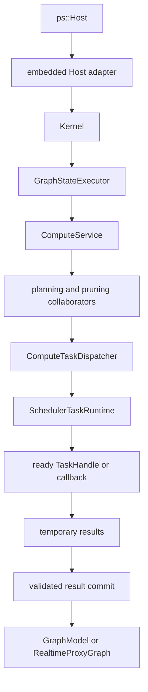

# Compute Boundaries

This document describes current software behavior and implementation ownership
inside the compute subsystem.

## Scope

The compute subsystem accepts one validated internal request, derives work for
one HP domain or coordinated HP/RT siblings, executes operations, and publishes
the intent-specific result. It does not own graph document persistence,
frontend rendering, daemon
transport, or process-wide operation plugin lifetime.

The public caller reaches compute only through `ps::Host`. The embedded adapter
translates public `HostComputeRequest` values into internal Kernel and
`ComputeService` requests. No public API exposes a `ComputeService`, plan, task
graph, or scheduler pointer.

## Ownership Map

`GraphStateExecutor` owns current per-graph exclusion. Planning and dispatch
remain compute responsibilities even when ready callbacks execute on scheduler
workers.

The current exclusion mechanism is not a bounded serial queue. Every
`GraphStateExecutor::submit()` launches one
`std::async(std::launch::async)` operation, and the launched operation waits on
the executor mutex. Concurrent submissions can therefore create multiple OS
threads waiting for the same graph. The mutex provides exclusion, not FIFO
ordering, cancellation, admission control, or a thread budget.
The mutex remains held for the whole callback, including scheduler submission,
completion waits, and visible commit. Different graphs have independent
executors and mutexes.

## Current Collaborators

| Module | Current responsibility | Does not own |
| --- | --- | --- |
| `ComputeService` | Request validation, intent coordination, collaborator construction, and final result selection | Frontend values, worker threads, graph documents |
| `ComputeCachePolicy` | HP cache eligibility and cache-path decisions | Disk I/O ownership or operation execution |
| `NodeInputResolver` | Runtime parameters and ready image inputs | Graph traversal or output commit |
| `FullTaskGraphExpander` | Complete node/tile task shape for one graph generation and domain | Request target, cache pruning, dirty pruning |
| `NodeCacheTaskGraphPruner` | Target/dependency cone and cache-aware request plan | New node or tile task shapes |
| `ComputeDispatchPlanBuilder` | Cache-pruned high-precision plan and inspection record | Scheduler queues |
| `DirtyRegionPlanner` | Graph-scoped dirty propagation snapshot | Compute dependency counters |
| `DirtySnapshotTaskGraphPruner` | Active dirty work selected from an existing plan | Task expansion |
| `IntentUpdateCoordinator` | HP-only or HP/RT sibling semantics | Physical priority or worker ownership |
| `ComputeTaskDispatcher` | Dependency counters, ready release, temporary results, completion, exceptions, full HP commit, and dirty source-first submission helper | Graph topology derivation, dirty staged commit, or scheduler policy |
| `TaskSubmissionPlan` | Request-local task handles, dense indexes, dependency state, variants, and result slots | Lifetime beyond the current dispatch contract |
| `NodeExecutor` | Consistent monolithic and tiled operation invocation | Graph mutation policy |
| `ComputeMetricsRecorder` | Compute events, timing, benchmark events, and debug metadata | Scheduler trace ownership |

The implementation lives under `src/lib/compute/`. These classes are private
implementation modules and do not form an installable API.

## Request Behavior

1. `Kernel` resolves the session and enters the graph-state access boundary.
2. `ComputeService` validates target, intent, dirty ROI, cache flags, and the
   selected execution strategy.
3. Connected parameter producers are stabilized into one request-local HP
   snapshot before extent, ROI, or task-shape decisions use them.
4. The planner expands the complete task shape for one domain and prunes it to
   the requested target and dependency cone.
5. A dirty request selects an active work set from that plan. Dirty state does
   not create new task shapes.
6. Sequential execution walks the same request semantics inline. Parallel
   execution materializes concrete handles and submits only ready handles or
   callbacks to the selected scheduler runtime.
7. Workers write request-local temporary or staged outputs. Visible graph state
   is modified only by the appropriate commit path.
8. The result, events, timing, and errors are copied back through the Host
   value boundary.

## Planning Invariants

- Full expansion is keyed by graph topology generation, compute intent, and
  task-shape configuration.
- A force-recache request invalidates reusable expansion when current input or
  parameter state may change output extent without changing topology.
- Request target, cache availability, and dirty state prune existing task
  shapes; they do not redefine graph topology.
- A `ComputeTaskGraph` is immutable while a scheduler-visible callback derived
  from it may still execute.
- HP and RT are separate compute domains. One plan does not create cross-domain
  task dependencies.
- Tiled input normalization occurs once per node invocation where possible,
  rather than once per tile callback.

These rules make planning deterministic and keep the scheduler independent of
graph semantics. Planning cost therefore follows full expansion before
pruning. Lazy task creation is not part of the current planning contract.

## Dispatcher and Scheduler Boundary

The dispatcher owns request correctness:

- dependency counters and dependent maps;
- source-first dirty task release;
- task reference accounting;
- temporary result slots;
- exception normalization and completion aggregation;
- validation of an empty plan;
- final target selection and full HP commit; dirty executors own their staged
  commit after reusing the source-first submission helper.

The scheduler owns the current physical execution mechanism:

- worker lifecycle and ready queues;
- batch state and scheduler-local epoch filtering;
- implementation-specific task ordering;
- scheduler completion and exception publication;
- bounded trace publication through the Host context.

The scheduler never receives `GraphModel`, `ComputeTaskGraph`,
`DirtyRegionSnapshot`, or cache authority. Newly ready dependent work is
released by the dispatcher and pushed as another ready handle or callback.
Threaded scheduler resources are owned per `GraphRuntime` and per intent route;
there is no process-wide worker pool or cross-graph admission/fairness
authority.

## Current OpenCV Operation Serialization

The built-in operation translation unit declares one process-scope
`g_opencv_op_mutex`. The following 13 operation entry points hold that mutex
across their OpenCV and data-processing path until return. `convolve`,
`resize`, `crop`, and `extract_channel` perform initial input checks before
acquiring it; the remaining entries acquire it at the callback start:

- monolithic `convolve`, `resize`, `crop`, `extract_channel`,
  `gaussian_blur`, `add_weighted`, `abs_diff`, and `multiply`;
- tiled `curve_transform`, `gaussian_blur`, `add_weighted`, `abs_diff`, and
  `multiply`.

Scheduler workers may issue these callbacks concurrently, but calls in this
set serialize across tiles, Graphs, and HP/RT intent routes inside the process.
Worker count therefore does not establish tile-level scaling for these
operations. This mutex does **not** protect every OpenCV use in the product;
other cache, normalization, metrics, downsample, adapter, or plugin paths may
use OpenCV outside it.

`register_builtin()` also calls `cv::ocl::setUseOpenCL(false)` and
`cv::setNumThreads(1)` once, so the built-in registry currently establishes
library-level OpenCV execution settings from core code. The lock and these
settings are current implementation facts, not the target boundary. The
merge-gate decision and scaling benchmark are tracked by issue #46; ADR 0002
places future OpenCV state, exception translation, algorithms, and codecs in
an optional provider/adapter.

## Intent and Commit Boundaries

`GlobalHighPrecision` and `RealTimeUpdate` describe business semantics, not
resource policy. A real-time update coordinates an RT proxy sibling and an HP
authoritative sibling. Each sibling has its own domain plan, dirty snapshot,
staged output, and scheduler selection.

`IntentUpdateCoordinator` creates the current sibling concurrency with two
asynchronous calls. The selected schedulers execute ready work inside each
sibling; they do not create the sibling relationship or infer it from task
metadata.

The current normal compute policy holds per-graph exclusive access through
visible commit. Dirty paths already use narrower staged buffers:

- `RealtimeProxyWriteBuffer` commits only to `RealtimeProxyGraph`;
- `HighPrecisionDirtyWriteBuffer` commits authoritative HP output to
  `GraphModel` after the sibling commit gate opens.

This staging prevents partially assembled tile output from becoming visible.
It is not yet a general cancellation or graph-revision policy.

## Failure and Lifetime Semantics

- Invalid targets, intent/ROI combinations, planning contracts, and operation
  failures are reported through categorized graph errors and Host status
  values.
- Resource exhaustion may propagate as `std::bad_alloc` across documented
  non-destructor Host boundaries.
- An admitted scheduler batch is settled before its exception escapes the
  current request.
- Operation callbacks may already have external side effects; staged graph
  output does not roll those effects back.
- Current task handles borrow request-local executor state. Their lifetime ends
  at the current completion wait, which is why they cannot be moved unchanged
  into a process-wide asynchronous queue.

## Boundary Rationale

Separating planning, ready detection, physical execution, and commit provides
four independent correctness points:

1. Graph and ROI semantics can be tested without a worker pool.
2. Scheduler implementations can change ordering without owning Graph state.
3. Temporary output can be validated before becoming visible.
4. Physical execution ownership remains separable from dependency correctness.

ADR 0003 records a different accepted ownership decision for later
implementation. This document is authoritative for the current per-graph
scheduler behavior.

## Implementation and Validation Entry Points

- `src/lib/compute/compute_service.*`
- `src/lib/compute/task_graph_planning.*`
- `src/lib/compute/compute_dispatch_plan_builder.*`
- `src/lib/compute/compute_task_submission.*`
- `src/lib/compute/compute_task_dispatcher.*`
- `src/lib/compute/dirty_region_planner.*`
- `src/lib/compute/dirty_update_executor.*`
- `src/lib/compute/intent_update_coordinator.*`
- `src/lib/core/ops.cpp`
- `tests/integration/test_compute_service_split.cpp`
- `tests/integration/test_scheduler.cpp`
- `tests/unit/test_propagation_contracts.cpp`
