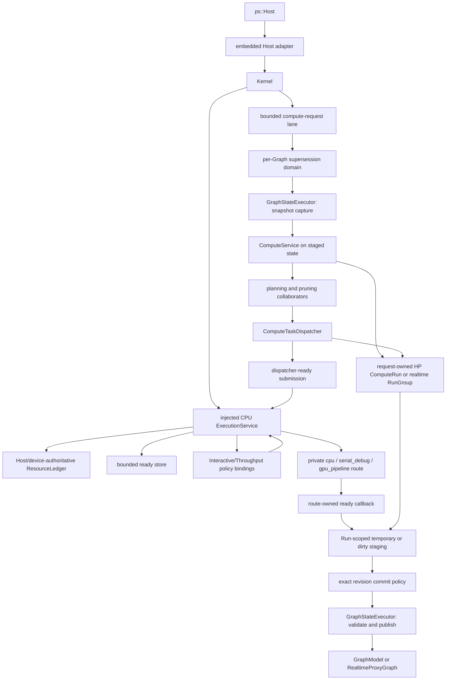

# Compute Boundaries

This document describes current software behavior and implementation ownership
inside the compute subsystem.

## Scope

The compute subsystem accepts one validated internal request, derives work for
one HP domain or coordinated HP/RT siblings, executes operations, and publishes
the intent-specific result. It does not own graph document persistence,
frontend rendering, daemon
transport, or process-wide operation plugin lifetime.

The public caller reaches compute only through `ps::Host`. The embedded adapter
translates public `HostComputeRequest` values into internal Kernel and
`ComputeService` requests. No public API exposes a `ComputeService`, plan, task
graph, or physical executor/policy pointer. A public compute request may carry
an optional positive `maximum_parallelism` Run ceiling; it cannot resize or
select the process executor. Logical dirty work and cache validity remain
normalized `RegionSet` through planning, staging, and the Region-aware core
dense path. Current image tile shapes, Host/IPC v2 inspection, ImageBuffer
helpers, and operation ABI v2 use checked derived `PixelRect`/`PixelSize`.
OpenCV geometry exists only inside a provider or algorithm implementation at
the library call that consumes it.

[ADR 0012](../adr/0012-operation-plugins-use-a-separately-versioned-pure-c-abi.md)
also freezes the accepted operation-plugin ABI v1 target. Target paragraphs in
this document are explicitly labeled and do not override the current v2 facts
above or imply an installed v1 loader.

## Ownership Map

```mermaid
flowchart TD
  HOST["ps::Host"] --> ADAPTER["embedded Host adapter"]
  ADAPTER --> KERNEL["Kernel"]
  KERNEL --> EXEC["injected CPU ExecutionService"]
  EXEC --> LEDGER["Host/device-authoritative ResourceLedger"]
  EXEC --> STORE["bounded ready store"]
  EXEC --> POLICY["Interactive/Throughput policy bindings"]
  KERNEL --> REQUEST["bounded compute-request lane"]
  REQUEST --> DOMAIN["per-Graph supersession domain"]
  DOMAIN --> CAPTURE["GraphStateExecutor: snapshot capture"]
  CAPTURE --> SERVICE["ComputeService on staged state"]
  SERVICE --> RUN["request-owned HP ComputeRun or realtime RunGroup"]
  SERVICE --> PLAN["planning and pruning collaborators"]
  PLAN --> DISPATCH["ComputeTaskDispatcher"]
  DISPATCH --> RUN
  DISPATCH --> READY["dispatcher-ready submission"]
  READY --> EXEC
  POLICY --> EXEC
  EXEC --> ROUTE["private cpu / serial_debug / gpu_pipeline route"]
  ROUTE --> CALLBACK["route-owned ready callback"]
  CALLBACK --> TEMP["Run-scoped temporary or dirty staging"]
  RUN --> TEMP
  TEMP --> COMMIT["exact revision commit policy"]
  COMMIT --> PUBLISH["GraphStateExecutor: validate and publish"]
  PUBLISH --> GRAPH["GraphModel or RealtimeProxyGraph"]
```

`GraphStateExecutor` owns visible Graph capture, mutation, predicate, and
publication exclusion. The separate compute-request lane owns same-Graph
compute and route-replacement order. Planning and dispatch remain compute
responsibilities even when ready callbacks execute on private route workers.

The current exclusion mechanism is a bounded serial FIFO lane. Every accepting
`GraphStateExecutor` owns exactly one worker. The graph-state lane retains its
historical bound of 64 waiting callbacks plus at most one active callback. The
compute-request lane instead charges exactly 64 total queued, running, or
parked one-shot/ticket admissions; active work is not a hidden sixty-fifth
unit. Each key adopts one reserved continuation with one persistent FIFO node.
`wake()` and worker-tail handoff reuse that token/node without allocation,
self-submit, or capacity waiting. Ordinary `submit()` and new-key reservation
block at the selected bound; they neither create another lane worker nor drop
or bypass admitted work. Producer fairness before admission is not guaranteed,
but queued work executes FIFO.

Both lanes reuse the same executor lifecycle. Each one-shot submission returns a
packaged-task future with the callable's exact value,
reference, `void` completion, or exception. Destroying that future neither
waits nor cancels the task; executor lifetime retains admitted work. A callback
cannot submit to or close its own lane: worker re-entry throws
`std::logic_error` before queue waiting. The existing compute-request worker is
the sole logical active-request runner: each reserved-ticket turn materializes
at most one generation and runs the existing Kernel/ComputeService path. It
enters graph-state only for generation publication, snapshot capture, or the
final exact revision/generation transaction; no per-Graph background runner or
per-generation thread is created.

An optional source-private accepted-boundary coordinate may accompany an I1
request through Host and Kernel into this coordinator. The coordinator stores
the complete current `SupersessionIdentity`. A coordinate-bound candidate may
replace another coordinate-bound current identity exactly when its accepted
coordinate advances strictly; equal admission timestamps use the row-local
accepted sequence as the tie-breaker. Generation remains a unique preparation
identity and Run join key, so it may move numerically backward at a bound
current publication and cannot veto the newer coordinate. An older coordinate
cannot replace current even with a higher generation. Legacy callers without
either binding retain generation-only ordering. Mixed bound/unbound identities
also retain generation ordering so this private evidence seam does not alter
public or non-I1 behavior. The process residency registry stores the exact
coordinator-managed current generation instead of applying a numeric maximum,
so late native work from a numerically higher stale generation cannot restore
itself after coordinate-authorized replacement.

Public and I1 asynchronous requests also share one embedded-Host admission
transaction. Before entering Kernel, Host constructs every fallible caller-side
resource: the caller promise/future, the successful `Result` envelope, the
backend-delivery bridge, the joined status worker, and close-visible tracking.
This ordering is required because coordinator publication may make the product
identity current concurrently before the Kernel call returns. Once Kernel may
have published that identity, the accepted Host tail contains only no-throw
future sharing, single-producer bridge delivery, and movement of the prebuilt
result. Preparation failure, including the deterministic source-private test
injection, therefore occurs before Kernel entry and cannot create a current
identity, accepted product binding, or visible output. Violating the structural
one-delivery/one-settlement invariant is fail-stop rather than a recoverable
post-publication rejection.

`close_and_drain()` is concurrent-call and repeat-call idempotent. It stops
admission, wakes full-queue producers with `std::runtime_error`, drains prior
work FIFO, and joins the worker before returning. Each caller waits for the
durable close generation that it joined. A joined lane never reopens admission
or creates a replacement worker; delayed callers observe the same completed
generation. `GraphRuntime` stops and drains compute requests first while
graph-state remains available for accepted commits, then drains graph-state
before releasing Graph-local state. Different graphs have independent workers
and queues. The Host-composition resource ledger does not charge these lane
workers or fixed service threads; they remain infrastructure. Its CPU dimension
instead admits per-Run execution rights committed by the Host-owned
reserved-start transaction.

## Current Collaborators

| Module | Current responsibility | Does not own |
| --- | --- | --- |
| `ComputeRequestCoordinator` | Per-live-Graph checked generation allocation, complete current-identity graph-state publication, optional source-private accepted-coordinate ordering, one latest mailbox and reserved ticket per admitted key, active-source supersession notification, exact pending settlement, and one logical active-runner slot | Run plans, staging, execution workers, Graph lifetime leases, lifecycle registry, telemetry, or public ABI |
| `ComputeService` | Request validation, intent coordination, creation/settlement of one HP Run or one realtime `RunGroup` with separate HP/RT children, staged commit-policy invocation, collaborator construction, and final result selection | Frontend values, worker threads, graph documents, live Graph revision/generation authority, or public cancellation policy |
| `RunGroup` | One realtime request identity, distinct HP/RT child Runs and observation leases, request-wide cancellation fan-out, RT-first gate, and deterministic aggregate outcome | Child plans/dispatchers, Graph state, workers, resource reservations, lifecycle registry, or public controls |
| `ComputeRun` | Immutable single-domain HP/RT descriptor with exact Graph identity/revision and request supersession identity, monotonic phase, a private weak-lifetime cancellation source, read-only lease observation, one terminal/commit arbiter that also owns progressive HP trigger permission plus observation, shared-control ownership of full-plan/temporary or dirty-HP staging storage, stable leases, and composite task identity | Paired realtime grouping, Graph state, workers, revision/generation mint or publication authority, public cancellation control, or resource admission |
| `ComputeCommitPolicy` | Product-only validation of exact Run/staged/live provenance and current supersession generation, a retained read-only Run lease, in-transaction cancellation observation and Run-owned commit-contender resolution, deferred HP cache persistence, and serialized visible publication before Run success | Planning, execution workers, a cancellation source or arbitrary cancellation authority, final lifecycle registry, or public ABI |
| `ComputeCachePolicy` | HP cache eligibility and cache-path decisions | Disk I/O ownership or operation execution |
| `NodeInputResolver` | Runtime parameters and ready image inputs | Graph traversal or output commit |
| `FullTaskGraphExpander` | Complete node/tile task shape for one graph generation and domain | Request target, cache pruning, dirty pruning |
| `NodeCacheTaskGraphPruner` | Target/dependency cone, ordinary cache cut, and dirty request-cone retention | New node or tile task shapes |
| `ComputeDispatchPlanBuilder` | Cache-pruned high-precision plan and inspection record | Ready-store or route ordering |
| `DirtyRegionPlanner` | Graph-scoped dirty propagation snapshot | Compute dependency counters |
| `DirtySnapshotTaskGraphPruner` | Active dirty work selected from an existing plan | Task expansion |
| `IntentUpdateCoordinator` | HP-only or HP/RT sibling semantics | Physical priority or worker ownership |
| `ComputeTaskDispatcher` | Dependency counters, ready release, temporary-result indexing, completion, exceptions, full HP commit, and dirty source-first submission helper | Run storage, graph topology derivation, dirty staged commit, policy ranking, or physical execution |
| `TaskSubmissionPlan` | Run-owned dense indexes, dependency state, exact-once task state, frozen implementation/device snapshots, result slots, callback owner, and cancellation owner for pending-Value fence waits for one full HP request | Execution-route workers, Run terminal state, native completion freshness, or dirty-path execution |
| `ReadyTaskSubmission` | Move-only immutable metadata, selected `Device`, exact operation constraints, composite task identity, matching Run lease, and owned executable for one dependency-ready task | Planning, dependency derivation, Graph/cache authority, or commit |
| `ExecutionService` | One Host-owned fixed CPU pool, one service-owned Metal lane, one fixed `DeviceExecutorRegistry` with process-owned native resources and shared exact `ResidencyManager`, private `serial_debug` and `gpu_pipeline` routes, one Host/device-authoritative `ResourceLedger`, one process-domain operation gate, one private lifecycle-admission registry, policy-aware bounded ready storage, Run-scoped ReadyFence continuation routing, process policy bindings, reserved-start transactions, exact-Run queued purge/running drainage, and Run-local completion/failure/trace settlement | Planning, dependencies, Graph/cache state, cancellation authority, visible commit, access-plan selection, residency eviction, or resource ordering/fairness |
| `NodeExecutor` | Consistent monolithic and tiled operation invocation | Graph mutation policy |
| `ComputeMetricsRecorder` | Compute events, timing, benchmark events, and debug metadata | Execution-trace ownership |
| `PolicyRegistry` and policy bindings | Validate built-in/DSO policy types, own process-scoped contexts and DSO leases, and rank immutable Host-authored candidate snapshots | Workers, queues, resource grants, Runs, Graphs, completion, or start authority |
| `ResourceLedger` | Atomically reserve checked Host vectors and isolated per-`DeviceId` memory/scratch plans; reconcile native actual bytes; mint bounded Host grants and split device leases; release exact authority after its true owner ends; copy deterministic diagnostics | Worker creation, ordering policy, task dependencies, queue/in-flight/I/O/plugin guesses, residency eviction, or lifecycle admission |
| `GraphRuntime::ExecutionRouteBinding` | Store one copied private route id and nonzero generation per intent | Physical route ownership, policy context, workers, queues, or reservations |

Compute collaborators live under `src/lib/compute/`; the ledger and Graph route
bindings live under `src/lib/runtime/`; policy loading/binding lives under
`src/lib/policy/`; and private route execution lives under
`src/lib/execution/`. These classes are private implementation modules and do
not form an installable API. The only installed extension contract in this
area is the pure-C policy ABI declared by
`include/photospider/policy/policy_plugin_api.h`.

V-4 kept the public monolithic registry slot, registrar entry, and callback
signatures unchanged while one source-private core lookup bridge recognizes
only the exact selected core dense callback. V-5 retains those entry/callback
shapes but intentionally extends the provisional C++ v2 metadata layout; an
operation DSO therefore requires a matching-SDK rebuild. Each scalar HP/RT
registry slot now owns callback, metadata, and nonzero identity as one atomic
implementation value; registering another callback shape cannot overwrite its
sibling's scheduling declarations. The private core
runner reuses a
valid sealed CPU image Value or snapshots the legacy ImageBuffer when no Value
exists, deep-copies the request-effective ParameterMap into a configuration
that omits Node output/cache/topology state, invokes pure inference with only
that configuration and logical DenseTensor/Image descriptors, invokes execute
with the same configuration, checked ImageViews, and inferred descriptor, and
validates the complete Value result. It also receives the normalized Region
from planning/`NodeExecutor`, copies unselected logical coordinates, and
inverts exact ImageRect or rank-general TensorSlice coordinates through
checked strides. A same-key plugin override cannot inherit this private
contract; generic v2 monolithic callbacks retain complete-output behavior.
Publication preserves the exact sealed result allocation/revision and derives
a separate ImageBuffer compatibility snapshot.

HP compute-service, result-committer, dirty-write, and disk-load boundaries
normalize missing CPU image Values before formal publication. Mutable dirty
clones clear old Value authority and reseal settled bytes. V-5 adds no new
callback slot or general planner inference. It does add a callback-free
implementation identity/metadata route to planned work and requires exact
identity re-resolution before provider entry.

V-6 adds a bounded source-private physical task without inserting transfer
nodes into graph planning or a `ComputeRun`. `ValueTransferTask` prepares a
distinct pending CPU Value and registers one asynchronous source-ReadyFence
wait with a shared executor. The preconstructed continuation retains that
executor while pending or queued and transfers the owner to callback-local
retention on entry, so a sole executor owner survives through callback
completion while an executor-owned queue self-reference is released. The queued
callback alone acquires source payload access, copies the validated envelope,
retires destination producer access, and publishes the terminal state. The
fence and task own no worker, queue, route, ledger grant, or device identity.
The deterministic thread-safe fake executor and test-only C++17 mutex/CV race
rendezvous are test-owned.

V-7 adds a source-private fixed `DeviceExecutorRegistry` to
`ExecutionService`. In the enabled repository Metal-plugin profile, the Apple
executor owns and reuses its device, command queue, and validated
compute-pipeline cache; one callback-scoped
allocator retains textures and buffers until provider return. A reserved-start
Metal submission enters the matching executor synchronously and uses the same
Run completion/exception/retirement path. A non-virtual source-private executor
entry installs an exact-identity callback frame before concrete admission.
Direct recursion and indirect cycles such as `A -> B -> A` fail with a stable
`std::logic_error` before submission/entry counters, context installation, or
provider entry, while a distinct executor may nest synchronously. Scoped frame
restoration preserves the outer context and propagates provider exceptions
unchanged.

V-8 adds explicit device/binding observations and AccessPlan classification,
revision-preserving CPU/Metal transfer, and exact residency without inserting
implicit payload work into `Value` accessors. A Metal provider publishes a
pending source-private Value and returns immediately after command commit.
CPU-copy and injected external-device transfer preparation reuse one core
positive, zero-offset, exact-envelope, non-overlap producer validator. The
external path completes that check before retaining its owner, minting
destination identities, creating a ReadyFence, invoking its provider, or
publishing a Pending destination. This preparation boundary does not narrow
the general native publisher's checked signed immutable aliases.
`TaskSubmissionPlan` increments completion before registering the fence wait;
the production ReadyFence executor retains the exact Run, lease, task, and
ready-store route, parks an early callback until the original QueueEntry and
grant retire, and keeps terminal settlement blocked until every continuation
owner retires. A successful continuation materializes the CPU compatibility
snapshot and only then releases dependants. Failed, ProducerCancelled, stale,
or mismatched completion releases none.

V-13 extends the same explicit task boundary by layout family rather than by
implicit conversion. A packed FP4 source is validated against the version-1
Blocked producer envelope: rank-matched complete quantization blocks,
nibble-aligned bit offset/strides, non-overlapping complete block spans, and an
exact retained byte size. CPU and injected external-device destinations retain
the full descriptor/scale schema, Blocked layout, bit order/offset, unused
nibble bits, and logical revision while receiving fresh binding/producer
identity. An oversized immutable BufferHandle alias remains a valid bounded
view but is not an exact transfer producer; preparation rejects it before
destination publication or provider effects. The transfer performs no
dequantization, requantization, ImageBuffer adaptation, or implicit wait.

The registry's shared `ResidencyManager` admits complete Graph/target/intent/
generation/Run/task/producer/revision/binding identity before native commit.
Before coordinator publication is submitted, Kernel fallibly pretracks the
request lineage with an internal zero-generation placeholder. Only an accepted
current publication assigns the manager's exact generation without allocation
while the coordinator mutex still excludes `is_current()`; rejected and
born-stale candidates do not change it. Consequently, if a newer accepted
request becomes current before an older accepted request starts its physical
Run, the older Run's later observation cannot overwrite the manager's current
identity, regardless of either generation's numeric magnitude, and its
transfer admission is stale.
Current-generation validation, producer Ready transitions, and resident
insertion form one manager-locked linearization interval. For a coordinator-
managed lineage, a current-identity update therefore either precedes an old
callback and gives its destination a typed failure before Ready, or follows a
completion already published against the then-current exact generation.
Standalone lineages separately retain numeric-maximum generation order.
Duplicate and proper-subset identities cannot consume another admission. The
published-Value acquisition path additionally stores the complete successful
`DeviceCompletionIdentity` beside each resident. Its exact lookup holds the
manager mutex while checking live managed lineage, completion use and seed,
the source Ready identity, saved publication identity, and resident Ready
identity. Lineage retirement that wins before lookup rejects even if ordinary
broad revision/device residency still exists; a lookup that wins first returns
a legal immutable `Value` copy. The ordinary broad lookup, retention,
replacement, capacity, and eviction paths are unchanged. The
Perlin provider encodes an explicit texture-to-buffer blit and calls neither
`waitUntilCompleted` nor `getBytes`; CPU-to-Metal uses the inverse explicit
blit. `GraphRuntime` still owns no native Metal state, #74 remains the final
visible-commit gate, and #86 keeps device-memory/scratch authority inside the
service ledger rather than residency or the Run.

Metal obtains a complete preallocation plan from native heap texture/buffer
size-and-alignment queries before its first allocation. Actual
`MTLResource::allocatedSize` values must fit that atomic plan before command
commit. The plan then becomes two unique owners: persistent memory follows the
type-erased native `Value` owner across copies and residency, while scratch
follows the exact command-completion object across success, native failure,
stale/rejected publication, and callback unwind. Unused planned bytes return
at actual commit. Device accounts are isolated by complete `DeviceId`, do not
borrow Host capacity, and provide copied limits/reserved/available snapshots.
Command queues, fixed lanes, and pipeline cache entries remain infrastructure,
not per-invocation scratch.

Current built-in CPU admission combines a mandatory checked service envelope
with an auditable adapter envelope. Shared Run/control/plan or phase-context
retained storage is charged once. Uniform per-task retained and scratch demand
is multiplied by maximum callback concurrency: the minimum of the fixed worker
count, logical task count, and the Run's optional positive
`maximum_parallelism`. Ready entries and bytes are multiplied by every logical
task so dependency release is already covered. The same cap is enforced again
against Run in-flight state at reserved start; it does not resize the fixed
pool. Initial and dependent entries use the same estimator and insertion
boundary.
For a mixed-operation physical Run, the adapter component-wise maximizes the
selected operations' declared `retained_memory_bytes` and `scratch_bytes`, then
checked-adds its existing owned-callback envelope. The resulting conservative
uniform task vector is used for full HP, dirty HP/RT, and connected preflight.
Zero is an explicit provider declaration; absent or malformed metadata does not
silently become zero and is rejected before provider entry.
Copied graph-identity metadata is charged by actual string capacity plus its
terminator. Every independently retained operation/constraint key follows the
same rule. The full-plan adapter preallocates one independently owned,
already-charged constraint record per logical task, including every tile, and
moves each record exactly once into that task's unique submission. The dirty
adapter applies the same rule to every active task. Both freeze the shared
charge before moving any record. Connected preflight and direct leases charge
their independent copies, while the operation gate borrows a stable view
instead of duplicating the string. A queued gate view borrows from the owning
`QueueEntry`. Direct acquisition first copies the caller constraints into the
returned lease state; every gate query, wait predicate, start, and finish then
borrows that state-owned copy, so a helper-local caller may retire or mutate
its input after acquisition returns without changing active gate identity.
After every initial value and ready grant has moved into a staged queue entry,
`ExecutionService` destroys the caller-side submission-vector backing before
active-Run publication and settlement waiting; only the staged entries and then
the bounded store retain those submissions. Before each dirty or
connected-preflight service segment, the adapter adds current
staging/snapshot storage and deduplicated missing staging-map entries,
including ordered-map linkage and deterministic empty or seeded visible output
metadata. HP downstream demand reads the current Run-owned write buffer through
the live `ComputeRunLease`, then its phase-local estimator adds only still
missing entries, so source-created entries remain charged without being
counted twice.

Connected-preflight preparation separates shared and per-node ownership. One
umbrella reservation charges the shared Run control, prepared result, and
anticipated missing staging entries exactly once across the whole connected
closure, plus its own private carrier and ledger reservation-state envelope.
Each node reservation charges only that node's unique callback, ready-entry,
ready-byte, and service-envelope ownership. The umbrella is prepared only
after every node root and the final cancellation-slot capacity are known. An
exact combined limit therefore admits the closure, while a one-byte
retained-memory shortfall rejects it before provider entry; rollback,
installation failure, or provider failure releases every node root and the
umbrella exactly once.

Dirty HP and RT demand also charges the complete request-owned
`DirtyNodeSynchronization`: the shared allocation, unordered-map buckets,
values and linkage, every `unique_ptr`-owned `std::mutex`, and visible object
storage. Allocator-private map metadata and opaque platform mutex allocation
remain excluded. Concurrent HP/RT siblings conservatively include the same
shared synchronization object in both independent phase reservations. This
intentional double reservation lets either sibling settle first without
leaving the surviving Run's shared ownership unaccounted. The estimator counts
only visible Host-owned C++ storage; future operation-produced image pixels,
named-value growth, and opaque backend, device, plugin, or allocator-owned
allocations are not fabricated. Current built-in adapters declare zero scratch
only because they own no separately metered fixed Host scratch.

During a process-service dirty source segment, the outer task
`std::function` remains live while its lvalue copy is owned by the source
context. Source demand therefore adds one audited callable payload alongside
the context-owned target. The downstream context receives that outer callable
by move. Because C++17 does not require a moved-from `std::function` to be
empty, one private context-construction helper makes destination construction
and outer release inseparable: the factory must return the owned context
successfully, then the helper explicitly clears the outer holder before any
submission construction, phase retained-demand calculation, or admission can
run. Construction failure instead unwinds the outer owner and factory
temporaries normally. Downstream demand consequently covers only the
context-owned target without relying on a standard-library moved-from
representation. A durable regression invokes that same production helper with
an adversarial holder whose move preserves its source target, so deleting the
explicit release fails independently of the active standard library.

The former installed `kSchedulerWorkerProcessMax` constant and worker-owning
scheduler ABI are removed. Source consumers receive no compatibility alias or
installed replacement. Composition limits use the private source-tree
`ExecutionResourceLimits`; third-party policy selection uses the independent
pure-C policy ABI v1 and receives no execution resource.

### Accepted operation-plugin v1 compute adapter target

The future operation-v1 loader still publishes immutable implementations into
the process-owned registry; the plugin receives no `ComputeService`,
`ExecutionService`, `OpRegistry`, scheduler, cache, Graph, Run, ledger, device
owner, or commit callback. One Host adapter converts private compute snapshots
into borrowed exact-size C records and converts copied sink output back into
private plans, Regions, dependencies, and temporary results. That adapter is
the only place where the public ABI and private compute model meet.

Each invocation-scoped callback is bound to Host-minted generation and
invocation handles, permanently identified operation/implementation,
configured plugin context, intent, and accepted descriptors. Definition,
configuration-lifetime, root-query, and destroy callbacks instead bind to the
exact leased DSO generation and their explicit identities/contexts; they have
no fabricated invocation handle. Those opaque 128-bit handles are correlation
facts, never pointers, lookup APIs, resource grants, durable identities, or
wire values. Configuration and descriptor views are immutable and callback-
local; no payload pointer is present during inference, Region propagation, or
dependency construction.

The call sequence is fixed:

1. configuration validation and context creation happen before the configured
   operation becomes invocable;
2. inference returns every immutable output descriptor, extent, buffer size,
   and access requirement before allocation;
3. backward dirty and forward active-edge Region callbacks derive checked
   planning facts;
4. a declared data-dependent implementation produces copied, validated
   dependency records before cache use; and
5. monolithic or tiled execution receives immutable inputs and only the exact
   Host-owned mutable CPU ranges derived from the accepted inference plan.

Operation ABI v1 is synchronous and CPU-addressable. Callback return ends all
borrowed descriptors and write grants. It carries no native device handle,
device-resident buffer, fence, completion owner, delayed sink, or asynchronous
lease. Private device work must stage into the Host CPU binding before return;
otherwise it belongs behind a Host-private adapter or a future separately
versioned native/async suite.

The Host owns output allocation and exposes no allocator callback. Planning
and diagnostics flow through a callback-local Host sink whose first failure is
sticky. The Host validates and deep-copies emitted records before return and
rejects missing, duplicate, stale, malformed, out-of-plan, out-of-range, or
overlapping writes before any cache or Run-visible commit.

Future v1 publication preserves the current strong transaction and per-slot
revision/predecessor rules. Every callback and configured context retains its
exact DSO generation through validation, status normalization, and exactly one
destroy attempt. Retirement removes visibility before waiting, destroys in
reverse order, and unmaps last. No registry, scheduler, execution, or
publication lock is held while plugin code runs.

An in-process callback can still ignore cancellation forever. The Host may
make its result ineligible, but cannot fabricate return, reclaim its write
grant, destroy its context, or unload its DSO safely. Operation v1 is therefore
an operator-trusted compatibility boundary. Issue #102 now implements a
source-private, pointer-free Darwin/Linux protocol-v1 invocation slice over a
framed Unix stream, ordered `SCM_RIGHTS` descriptors, and unlinked POSIX shared
memory. Issue #103 now implements the source-private bounded supervision
composition around that transport, while Issue #104 still owns trust,
sandboxing, and enforceable resource policy for tenant code; ABI pointer
records are never their wire protocol.

`NonSupervisedIsolatedCpuInvocationExecutor` validates the invocation identity,
generation/operation binding, scalar parameters, resource declarations,
readiness/ownership, descriptor geometry, access direction, ranges, and
canonical descriptor/content digest before spawning. The one-call runtime
performs the same independent checks before mapping a callback-local view. The
Host waits for normal zero exit, then revalidates every FD, capability header,
response, descriptor, and output range, snapshots output into a fresh Host
allocation, and validates the binding over the actual copied bytes before
sealing the `Value`. RAII owners close mappings, descriptors, channels, and
reap the exact child on success or failure. This slice deliberately has no
supervisor, authentication, deadline, heartbeat, restart, sandbox, or resource
enforcement, so a callback that never returns remains unbounded.

Issue #103 adds `PluginRuntimeSupervisor` and `PluginInvocationExecutor` to the
same source-private product module without changing the #102 request/response
wire. Every supervised call uses a fresh execed child and a dedicated Unix
datagram lifecycle channel on fixed descriptor 5. The Host sends a fixed hello
containing an OS-random 128-bit nonce, the complete six-part invocation identity
plus worker/plugin generations, and the selected heartbeat interval. The child
must echo those facts in strictly sequenced `RuntimeStarted`, `Heartbeat`, and
`InvocationCompleted` events. This binds liveness to the exact private launch;
because the child learns the nonce, it is session authentication rather than
plugin attestation or output truth.

The supervisor applies absolute monotonic startup, invocation, heartbeat-gap,
response, graceful-termination, kill, and reap bounds. Complete request
transfer receives one independent full invocation-duration window. It finishes
only after every byte and descriptor right is sent, Host `SHUT_WR` succeeds,
and the same absolute transfer deadline is observed again. The precise
monotonic sample that passes that observation is `accepted_at`; both the
callback invocation deadline and initial heartbeat-gap deadline derive
directly from it. A late successful shutdown is an invocation-deadline fault
and cannot arm fresh callback or heartbeat budgets; a failed shutdown remains
a channel fact. Scheduling after acceptance consumes those two budgets, and a
later caller clock sample cannot grant another window. A large bounded send
still cannot consume the callback-liveness budget;
the absolute invocation deadline still ends a callback that continues to emit
heartbeats. Construction validates every configured duration for positivity,
the inclusive 24-hour cap, exact steady-clock representation, and heartbeat
ordering before child ownership; that validation cannot prove any future
time-point sum. Every actual startup, transfer, callback, heartbeat, response,
termination, reap, observation, or restart-backoff derivation therefore checks
the same captured base against `time_point::max() - duration` before adding. An
exact fit is valid. Before ownership, one tick beyond it fails closed through a
controlled exception. After ownership, a pre-cleanup lifecycle or short exact-
status-observation overflow maps to the current phase-typed fault and exact
cleanup; arithmetic failure while deriving a termination/reap-cleanup or
restart-backoff deadline instead preserves an already established primary
fault. That arithmetic rule does not weaken ownership priority: when the
cleanup deadlines are representable but the exact PID is still not waitable at
the final bound, sole ownership moves to the deferred reaper and the resulting
`ReapPending` fault outranks the earlier phase fact. No path wraps, saturates,
clamps, or samples a replacement clock. A real channel/status-observation
syscall failure remains `Channel` when no stronger process or deadline fact is
available. Faults expose exact observable
deadline, lifecycle-protocol, channel, bad-output, natural exit, signal, and
termination-stage facts. A matching `SIGKILL` is only marked
memory-pressure-compatible; it does not prove an OOM cause. Failure closes both
channels, escalates `SIGTERM` to `SIGKILL` when necessary, and retains exact PID
ownership through reap or the quarantined deferred-reaper integrity path.
An already reaped child does not prove its lifecycle datagram queue is empty:
before classifying retained status as exit without callback completion, the
monitor drains queued in-sequence events. An authenticated completion advances
to the unchanged response/EOF/decode/publication checks while the retained wait
status remains available; a zero exit without that completion and a valid
response remains bad output.

`PluginInvocationExecutor` never falls back to an in-process or non-supervised
call. After bounded restart backoff, the next invocation receives a fresh PID,
nonce, lifecycle channel, and data channel. Product-linked real-exec tests prove
success, startup authentication, each deadline class, queued completion before
normal-exit classification, natural exit and signal classification, malformed
output, exact descriptor/PID retirement, no fallback, and later healthy
recovery. One test invokes the executor inside a production
`ExecutionService` ready callback: the original `PluginRuntimeFault` reaches the
request boundary, that boundary publishes only the owning Run as Failed, and
the fixed service worker executes a later unrelated Run.

The adapter, runtime endpoint, supervisor, and executor are compiled into the
installable product archive, but this remains an internal composition proof,
not an end-user route. No current `ExecutionService`, `WorkerManager`, embedded
Host/CLI, `photospider-worker`, or operation loader constructs an isolated
request from a Graph operation. Current operation ABI v2 cannot cross this
wire, target-only operation ABI v1 is neither implemented nor shimmed here, and
#104 still owns allowlist/signature, sandbox/capability, and enforceable
resource policy.

## Request Behavior

1. `Kernel` resolves the session, normalizes missing intent to HP, forms
   `(target, canonical request intent)`, allocates a checked graph-wide
   generation, and adopts the key's reserved compute-lane ticket outside
   graph-state. A graph-state work item then publishes that generation as
   current, coalesces one pending value, and wakes the ticket. For the private
   I1 path, Kernel also carries the pre-call accepted-boundary coordinate into
   the immutable supersession identity before that publication.
2. `ComputeService` validates target, intent, dirty ROI, cache flags, and the
   selected execution strategy.
3. One reserved-ticket turn captures request-owned Graph/proxy snapshots in a
   graph-state work item. For non-realtime HP, `ComputeService` creates one
   `ComputeRun` before planning. For realtime it creates one request-owned
   `RunGroup` with separate HP Full and RT Interactive children before
   preflight. Each child captures a fresh Run id, session label, strong Graph
   instance identity, authoritative revision, target, explicit QoS, and the
   request's immutable supersession key/generation. The request cancellation
   source fans its stable first reason to both realtime children; HP-only child
   cancellation remains local.
4. Connected parameter producers are stabilized into one request-local HP
   snapshot before extent, ROI, or task-shape decisions use them.
5. The planner expands the complete task shape for one domain and limits it to
   the requested target and dependency cone. Ordinary full HP planning may
   consume exact formal cache immediately; dirty planning records that
   observation but retains the complete callback-free cone.
6. A dirty request keeps every snapshot-selected task executable, treats old
   exact cache only as a possible staging merge base, and applies
   current-request external-satisfaction demand cuts across the retained
   dependency universe. Dirty state does not create new task shapes.
7. Every execution phase materializes move-only
   `ReadyTaskSubmission` values that retain a Run lease and
   `(RunId, RunLocalTaskId)`, then sends only ready work to the Host-owned
   `ExecutionService`. Full HP uses `TaskSubmissionPlan`; preflight and dirty
   HP/RT use heap-owned phase contexts. All three closed private routes enter
   the common ready store, policy selection, reserved-start transaction, and
   Run-lease completion path. Explicit cancellation or an expired injected
   monotonic deadline is observed at existing planning, queue, callback,
   dependency, phase, and commit boundaries. The service closes and purges
   only the matching Run's queued entries; already entered callbacks drain
   without releasing new dependents or publishing staged output.
8. Workers write only request-owned Graph/proxy state, including Run-owned
   full-plan temporary results or dirty-HP staging. RT staging remains
   sibling-callback-local, and all service callbacks retain the RT child lease
   through synchronous settlement.
9. After validated output, each Run reaches `CommitPending`. The product policy
   retains a read-only Run lease, enters the graph-state work item, observes
   cancellation, and tries to claim the Run-owned one-shot commit contender.
   Cancellation accepted before that claim publishes no Graph, proxy, or
   deferred cache state. Once the contender wins, later cancellation is a
   terminal no-op; the policy validates exact staged/live identity,
   authoritative revision, and current supersession key/generation before
   optionally persisting changed HP artifacts, publishes complete Graph/proxy
   state, and resolves success or exact failure in the same work item. The
   coordinator returns RT output only after both children settle; result,
   events, timing, and errors then cross the Host value boundary.

## Planning Invariants

- Full expansion is keyed by graph topology generation, compute intent,
  canonical route-visible device inventory, operation-registry generation, and
  task-shape configuration.
- A force-recache request invalidates reusable expansion when current input or
  parameter state may change output extent without changing topology. It also
  disables request-time cache satisfaction before task population; fallible
  preparation does not clear visible Graph output.
- Request target, cache availability, and dirty state prune existing task
  shapes; they do not redefine graph topology. For ordinary HP planning, exact
  complete formal cache is consumed immediately as a read boundary. Dirty
  planning instead retains the complete callback-free target cone and records
  only the planning-time observation. Selection never omits a node explicitly
  selected by the dirty snapshot merely because old output still has exact
  complete validity: those bytes may seed staging and preserve unselected
  coordinates, but the selected Region must execute. Removal or partial
  reduction after planning likewise leaves the retained dirty provider cone
  active. Force-recache disables even staging reuse, and RT intent never
  promotes formal HP cache into task satisfaction.
- Dirty demand traversal uses the complete retained node/dependency universe,
  including inactive connector nodes and external-satisfaction boundaries.
  Traversal stops at a satisfied boundary but final emission is
  restricted to dirty candidates. Thus `A(dirty) -> B(satisfied, inactive) ->
  C(dirty)` executes C without A, while another unsatisfied consumer of A still
  preserves A as shared demand.
- A `ComputeTaskGraph` is immutable while an execution-visible callback derived
  from it may still execute.
- Planned node work retains only selected implementation identity, device,
  metadata, and callback shape. Submission must re-resolve the same nonzero
  identity before retaining a callback, so cached plans own no DSO lease.
- TensorSlice HP Region planning uses its eligibility selection once per
  executable target/upstream node and retains a callback-free operation key
  plus complete identity/device/shape/metadata route. Immediately after dirty
  active-task selection, an empty active view completes route validation before
  comparing intent, device inventory, task ids, or node routes because no
  planned operation can execute. Otherwise preparation compares each active
  task-population route with that Region-plan authority. A mismatch is
  `NoOperation` before ROI mutation, task materialization, callable resolution,
  or any provider/gate/grant/reservation/ledger ownership.
- Dirty HP/RT revalidates every unique active task node after planning and
  selection. The Graph or realtime-bundle logical lifecycle may already be
  installed at that point, but revalidation precedes constraint construction,
  resource estimation, source-first physical preparation, provider entry, and
  operation/resource/physical admission. A missing or changed active route
  fails with `NoOperation`, and the installed logical lifecycle must then
  finalize without gate, grant, root-reservation, or ledger residue. Inactive
  tasks and nodes already satisfied by connected preflight are deliberately
  excluded from this check. If request-local external satisfaction removes
  every task, context drift is irrelevant and preparation remains a successful
  no-work result; if any task remains active, the complete context and every
  active route are still required to match. The no-work
  shortcut is inside the already installed outer request lifecycle: the
  candidate, standalone/RunGroup bundle, successful terminal, quiescence,
  resource settlement, and unregistration still occur, while ready entries,
  callbacks, operation gates, policy invocations, root reservations, child
  grants, provider entry, and ledger demand remain zero.
- HP and RT are separate compute domains. One plan does not create cross-domain
  task dependencies.
- Logical propagation, dirty planning, source history, per-node state, edge
  mappings, staged-write validity, and the Region-aware dense callback carry
  normalized `RegionSet`.
- Region propagation and dirty planning gate TensorSlice by selecting the
  actual revisioned implementation with the same canonical route-visible
  device inventory and compute-domain intent as execution. Only an exact
  selected core dense monolithic callback has the private tensor contract; a
  selected same-key device replacement is Unsupported, without scalar
  fallback.
- Current image tiling, ImageBuffer processing, Host/IPC v2 inspection, and
  operation ABI v2 carry checked derived `PixelRect`/`PixelSize`, never OpenCV
  geometry. TensorSlice is HP-only monolithic work and never gets a rectangle.
- Tiled input normalization occurs once per node invocation where possible,
  rather than once per tile callback.
- The V-3 dense invert inference callback cannot inspect payload bytes, and its
  execute result must match the inferred DenseTensor descriptor and Image
  Facet before publication preserves the exact sealed result revision.

These rules make planning deterministic and keep policy/physical execution
independent of graph semantics. Planning cost therefore follows full expansion before
pruning. Lazy task creation is not part of the current planning contract.

## Dispatcher, Policy, and Execution Boundary

The dispatcher owns request correctness while `ComputeRun` owns the current
full HP storage:

- dependency counters and dependent maps;
- source-first dirty task release;
- task reference accounting;
- indexing and transitions over Run-owned temporary result slots;
- exception normalization and completion aggregation;
- validation of an empty plan;
- final target selection and full HP commit; dirty executors own their staged
  commit after reusing the source-first submission helper.

`ExecutionService` owns the physical mechanism:

- bounded ready storage and private-route worker/device lifecycle;
- Run-local settlement and route-specific in-flight state;
- service-class arbitration, Host-authored frontier reduction, and validated
  policy selection;
- reserved-start resource exchange and implementation-specific execution;
- completion and exception publication;
- bounded trace publication through the Host context.

Neither a policy callback nor a private route receives `GraphModel`,
`ComputeTaskGraph`, `DirtyRegionSnapshot`, or cache authority. Newly ready
dependent work is released by `TaskSubmissionPlan` as another
`ReadyTaskSubmission`; the Host alone validates the candidate, commits its
start, and transfers callback ownership to the copied Graph route binding.

The process service is explicitly composed before Kernel and owns one direct
fixed CPU worker pool, one private Metal worker lane, one fixed
device-executor registry, one Host-and-per-device authoritative ledger, and one
bounded ready store. Configuration
resolves and freezes `[1,8]` CPU infrastructure workers once; Graph load,
replacement, Run execution, and dirty phases never resize either lane.
Benchmark `execution.threads` is a per-Run ceiling rather than an execution
configuration request. Missing or zero chooses a bounded automatic cap and
`1..8` chooses an exact cap. `BenchmarkService` prepares the process service at
most once with `worker_count=0`, then `RunAll` executes valid mixed caps on the
same pool while omitting disabled-session thread-range validation and execution
after configuration parsing and logging/skipping invalid enabled sessions.
Every Run reserves its complete checked CPU/retained/scratch/ready vector
before publication. Initial and dependency-released work both require matching
ready-entry/byte grants and enter the same policy route. Queue removal
exchanges that grant for CPU/memory/scratch execution authority. Completion,
failure, and exceptional paths release the exact vector once. Independent Runs
remain isolated.

### Current benchmark boundary

The current `BenchmarkResult` is a diagnostic aggregate, not an SLO record. It
retains total wall duration, a trimmed typical duration from selected operation
events, mean I/O duration, raw operation execution durations, image dimensions,
and the resolved Run cap. `BenchmarkService` has no warmup ownership,
nearest-rank percentile contract, current-generation visibility timestamp,
completed service window, discarded-work accounting, authoritative high-water
sampling, stable result/artifact/trace digest, reference digest, or independent
dimension verdict.

The maintained manual OpenCV concurrency tool adds warmups and raw wall samples
for one fixed synthetic graph. Long-lived tests additionally prove exact
callback overlap at Run caps 1/2/4/8 and bitwise output equality for one cap-1/
cap-8 fixture. Those observations demonstrate mechanism reachability and one
machine's scaling; they do not establish an Interactive, batch, or mixed-load
SLO.

[ADR 0010](../adr/0010-execution-profile-slos-are-six-independent-benchmark-verdicts.md)
freezes the target workloads, six metric formulas, invalidation rules, and
downstream evidence ownership. Issues #93 through #96 now add their assigned
source-private collectors at the actual admission, visibility,
cancellation/quiescence, artifact, trace, completed-service, and
resource-lifetime boundaries. #96 additionally supplies the exact manual M1
protocol implementation and the existing canonical outer-envelope
materializer/resolver. This is implementation availability, not a claim that a
timed machine corpus or its external authority graph passed. No placeholder
zero value is a substitute for a missing observation source.

Those profile collectors have precise boundary obligations. Edit ordinals
`1..12` map to `edit_index=0..11`; nominal monotonic admission starts and their
bounded lateness are distinct timestamps. I2 records preview admission/visible,
final trigger/admission/visible, and generation-current checks using the legal
RT-preview/HP-final child descriptors. Logical equality is a typed available
`ContentDigest`. B1 records every `ComputeIoExecutor` task charge, accepted
admission/settlement event with its executor-authored exact delta/linkage/
sequence and same-lock process snapshot, planned-byte high-water, ADR 0009
requested and achieved durability, complete output receipt, raw payload/
manifest hashes, and the separate canonical semantic trace. Its raw ready
observation retains the callback's adapter-owned byte declaration independently
from logical ROI bytes mapped into the canonical resource vector, so declaration
drift cannot be hidden by recomputation. Every active Compute I/O snapshot task
occupies exactly one constructing/queued/running phase. Retained global event
sequences may contain numeric gaps for omitted unrelated work, while every
required task-local transition remains mandatory. Applicable B1/M1
environment evidence also retains exactly one
`execution-profile-b1-storage-raw-proof-v1` document: six fields in the shared
manifest grammar carry the backend and all 21 raw field observations, native
mount evidence, both 37-component performance cuts, transaction/receipt events,
and root/destination ownership. It retains no derived proof boolean. Each
compatibility side strictly parses those bytes and independently replays every
adapter, normalizer, mapper, binding, and containment predicate before exact-
matching eligibility. M1 records two same-ordinal isolated pair references in
addition to candidate/reference comparison provenance.

The source-private #96 M1 implementation checked-derives `C^M1`, `W^M1`,
`B^M1`, and `U^M1`; retains the exact 1/7/40 I1 origin grid, fixed A252 and
B253/A254/B255 offers, final-warmup current hold, carryover/FIFO snapshot,
independent Graph producer cycles, U cutoff, and final-zero settlement; and
evaluates non-substitutable latency, progress, fairness, waste, and memory
axes. Fairness includes the nearest-rank p05 over exactly 30 paired Throughput
windows, Graph A/B completed-service Jain p05, at most three applicable
Interactive starts, and complete classification of all 480 measured I1
admissions. Environment pairing delegates unchanged to the base-only I1 and
full eligible B1-cap-eight relations.

First measured admission and final-warmup current hold are source-derived, not
runner-minted. One shared producer/reader projection exact-joins the retained
final-warmup and measured-zero Issue #93 inputs, derives the accepted coordinate,
Host success, product-bound current/visible replacement, boundary-only
cancellation, and old settlement facts, and closes those facts before protocol
evaluation can return early. Direct, canonical, and fully rehashed outer replay
therefore reject the same raw-source contradiction and recompute the same six
verdicts.

Equal-time displacement uses that same source authority. If measured current
is observed at `(B,n)`, cancellation of the displaced warmup Run at `(B,n+1)`
follows current in the replicate-wide observer domain, preserves current hold,
and is not boundary-only. Cancellation strictly before B, or at `(B,m)` with
`m<=n`, fails closed. This observer sequence is never compared with the
independent accepted-row sequence. M1 source closure also does not make a Run
with both visible success and accepted cancellation valid under Issue #93.

Applicability at each service start is a product-authored evidence cut, not a
reconstruction from nominal I1/B1 intervals and not the scheduler-selection
cut. `ExecutionService` first treats a ready lane head as scheduler-selectable
when its Run lifecycle, operation gate, and physical route permit selection;
transient child-grant capacity does not filter that policy frontier. A selected
entry whose child grant is unavailable reaches reserved start, receives only a
worker-cycle grant-block mark, and leaves policy/fairness counters unchanged
while that worker searches the remaining candidates.

Immediately before a physical start commits, the separate evidence-startable
probe adds remaining child-grant capacity for both classes. The observation is
published only after the selected operation gate, route, ready removal,
counters, and execution grant commit. The M1 collector retains both capacity-
aware class facts and the committed-grant bit in its existing preallocated,
allocation-free, nonblocking, lock-free callback store. The scheduler's
three-to-one `consecutive_interactive_` accounting continues to use scheduler-
selectable Throughput competition, not these narrower evidence facts. Nominal
intervals remain useful only for Graph-demand diagnostics and cannot reset or
excuse either rule.

One preallocated `M1FairnessObservationCollector` gives tagged I1/B1 Runs one
bounded observer-causal domain. `ComputeRunObservationFanout` forwards the
same authority-owned product coordinate to that collector and the reused I1 or
B1 collector; it does not merge that observer clock with I1's independent
accepted-row sequence. Every fanout product callback publishes to the reused
source collector first and enters the M1 sequence authority last. The authority
callback return is the reservation-completion edge, so a stable M1 cut cannot
precede publication of the source-history record carrying the same coordinate;
coordinate reservation and explicit abort remain authority-only. Overflow,
sequence exhaustion, or tag/QoS disagreement is sticky fail-closed evidence.
Coordinate allocation samples steady time and assigns the next sequence in one
bounded lock-free atomic section, so increasing causal sequence guarantees
nondecreasing `observed_at` under concurrency. Local task identity is zero-based:
task zero is valid for start and terminal events, while only non-task event kinds
use zero as their scalar sentinel. The source-private `M1Host` adds no compute
route: it joins Host/device ledger, Compute I/O, class-partitioned ready,
lifecycle, and immutable Throughput capacity/reserved snapshots from the same
service. Its only mutation is an idempotent evidence-finalization seam that is
legal after every Graph and Host operation has closed. That seam shuts down the
same execution service so the runner can retain the terminal `ServiceStopped`
cut; it is not a general compute, phase, or lifecycle control surface.

The collector's boundary snapshot closes both coordinate reservation lifetime
and slot publication. A bounded reservation-entry frontier advances before
route commit; the matching completion advances only after callback delivery or
explicit abort when commit rejects. Claimed and contiguous release-
published frontiers track event slots. A cut is stable only when all four
frontiers reconcile and remain unchanged before and after copying; equal copied-
vector sizes cannot hide a pause after reserve, after commit, or after claim.

M1 Compute I/O high-water is likewise event-derived. Every protocol B1 offer
must resolve to exactly one complete Issue #95 job stream containing Initial,
each executor-authored admission, each matching settlement, and Final, with
task identity, immutable charge, status, phase counters, same-lock snapshots,
and globally unique accounting sequences. Missing, duplicate, reordered,
unknown, over-limit, or arithmetically contradictory transitions are
structural `Invalid`. Sparse `M1Host` cuts retain only current-state diagnostics
and cannot increase or repair high-water; the final process cut must still be
zero. Consequently a short I/O task that starts and settles between two sparse
cuts remains visible in the event-derived maximum.

The Host ledger and every stable configured-device identity also retain a
componentwise lifetime envelope. Every temporal cut must satisfy
`reserved <= lifetime_high_water <= limit`, and lifetime high-water must be
nondecreasing for the same authority. Reserved above high-water or a declining
high-water is structural `Invalid` evidence; high-water above limit remains an
independent memory failure.

Lifecycle evidence is replayed with the same fail-closed discipline. Each
temporal snapshot retains its capture ordinal and requested `after_cursor`.
Validation starts at cursor zero and requires the exact page chain, contiguous
lossless event sequence, stable service/epoch identity, producer cursor/state
semantics, and the complete service/Graph/admission/terminal/quiescence/
resource/close effects required by nonempty M1 work. The replay maintains
Graph, candidate, bundle, Run, group, and generation identity, including
registration rollback, candidate rollback, group admission order, each child
terminal-to-quiescent-to-resource-settled-to-unregistered chain, whole-bundle
detachment, Graph close, shutdown cancellation, and final service stop. Because
`BundleAdmitted` does not carry a candidate id, candidate commit is assigned
existentially to one still-pending candidate of the same Graph; no evidence
field is invented.

At every event and retained page cut, the replay recomputes and exact-checks all
nine registry-derived counters. The six physical counters remain independent
producer samples: validation checks configured ready capacity, ready-plus-
entered child-grant reachability, child-to-root ownership, policy-invocation-to-
binding reachability, and that physical owners belong either to an admitted
child or to a pending prepublication candidate. It does not infer exact physical
deltas from event kinds. Worker joins and policy-binding retirement publish the
registry counter cut under the registry lifecycle fence while sampling those
six physical values independently. The runner closes every Graph before using
the terminal M1 seam; `ServiceStopped` must be last and all 15 counters must be
zero. Missing, duplicated, reordered, identity-spliced, counter-inconsistent,
cursor-inconsistent, or post-stop records make memory `Invalid`.

The manual `m1_shared_benchmark` target is `EXCLUDE_FROM_ALL` and absent from
CTest/CI. It runs all three Graphs through one `EmbeddedHost`, emits a closed M1
inner row, and materializes six retained sections plus the existing canonical
15-field row and five-field bundle. Exact-one/DAG validation, pair direction,
and actual environment authority remain mandatory. The inner row retains all
30 raw progress/Jain windows, all 480 raw admission outcomes, committed
service-start facts, complete temporal/lifecycle records, event-aligned B1 I/O,
and the complete reused Issue #93/#95 source rows through their existing closed
verification encoders. The Issue #93 and #95 manual producers now each
materialize one closed source-private denominator-only pair-object pack. I1
retains its schema/version and exactly 200 latency samples; B1 retains schema
version one, exactly one cold, three warmup, and thirty measured unique job
occurrences, and thirty ordered outcomes. Their output/verdict sections
explicitly claim no portable output or conformance authority beyond the I1 p99
or B1 rate denominator. Process-private actual storage authority is
intentionally excluded.

The nested v2 manifest has exactly 20 ordered fields. Its
`interactive_sources` field retains exactly 48 complete post-freeze
`I1EpisodeEvidenceInput` values and binds each one by phase, phase-local
ordinal, and origin. Its `batch_sources` field retains exactly one source per
protocol offer: immutable offer identity/cuts, the complete physical Run
trace, output status, an authority-free copy of receipt observations when
present, golden values, semantic trace bytes plus digest, and complete Compute
I/O observations. Replay derives each I1 latency/service/four-verdict projection
and each B1 verified-endpoint/waste projection. One shared checked runner/reader
rule then source-derives and exact-matches all thirty progress windows, all
thirty Graph A/B service/demand windows, all 480 measured headroom outcomes,
and their attempted/classified/failure aggregate. Cardinality, identity,
endpoint, ordering, or checked-arithmetic failure keeps source closure false.
Source closure is mandatory independently of the six final verdicts, so a
source mismatch cannot be materialized merely because another protocol fact
already made the row `Invalid`. Copied receipt fields
never reconstruct the store-private receipt capability or current storage
authority.

Before deriving its timed boundary, the M1 runner requires both pack paths plus
their exact row/bundle addresses. POSIX validates and reads through one
`O_NOFOLLOW` descriptor; Windows uses one `CreateFileW` handle opened with
`FILE_FLAG_OPEN_REPARSE_POINT`. Type/reparse status, bounded size, exact bytes,
growth check, and close are all evaluated on that same opened object. The
runner rematerializes every denominator source, checks the same-role/
ordinal/cap/fixture and base-only-I1/full-B1 environment relations, and
recomputes I1 nearest-rank p99 plus the B1 successful-operation/interval tuple.
Digest text alone is rejected and no caller-provided p99 or throughput scalar
is accepted. The loaded pair rows, bundles, and sections are inserted exactly
once into the local corpus before M1 sealing, and the recomputed values must
equal both M1 claims. Missing, ambiguous, omitted, substituted, tampered, or
mismatched pair evidence fails before timing or is `Invalid` on replay.
Incomplete portable storage authority remains an independent canonical
`Invalid`; the existence or successful build of this runner is not a timed
machine-conformance result.

Required-storage actual authority is an opaque copyable capability, not the
serialized root, receipt, or probe fields. `B1OutputStore` alone duplicates the
held root descriptor and mints immutable typed receipts; a trusted adapter owns
the live complete-probe source. Each compatibility check re-observes all three
sources. Copying `B1InnerRowInput` or `B1InnerRow` shares that capability and may
extend the root descriptor, advisory lock, and adapter lifetime. JSON receives
only construction-time diagnostics and a probe digest, so it cannot mint or
rehydrate validation authority.

These remain profile harness/evidence semantics. Exact per-job planned-byte
charges and executor-authored admission/settlement deltas are mandatory,
authoritative evidence for Compute I/O admission, planned-byte high-water, and
that task's settlement. A same-lock process snapshot may include unrelated work
and may be nonzero at one job's final observation; row teardown still returns to
its required baseline. A provisional lazy-factory reservation that throws or
returns empty, or whose task/queue-entry allocation fails, rolls back before
Accepted publication and therefore contributes no orphan admission identity.
Successful construction publishes Accepted either with queue ownership or,
when external shutdown won, atomically with the exactly linked Cancelled
settlement before callback entry. A reconciled output receipt contains empty
`io_observations` because it ran no new task; it cannot synthesize the current
two-task FSM, so the earlier new-work stream must be retained or the evaluator
fails closed. These facts do not add fields to the current
`BenchmarkResult`, change `ComputeRun`, prove physical memory ownership, replace
diagnostic RSS or ledger/device ownership evidence, or promote the current IPC
delivery store to durable output authority.

The ready store charges each dispatch
`work_units + ceil(complete_ready_grant_bytes / 4096)`. Each Graph accrues raw
cost in a separate accumulator for the selected service class; each Run has one
immutable class and accrues `ceil(cost / weight)` there. Explicit interactive
QoS prefers an earlier present monotonic deadline, while throughput ordering is
weighted and deterministic. The store first chooses the service class,
forcing Throughput after at most three consecutive Interactive dispatches
while both remain ready. It then applies eight-dispatch aging only within the
chosen class; aging cannot replace that class decision. Run rows remain
installed across temporary emptiness so dependent re-entry cannot reset
fairness history.

Configured interactive headroom caps only active Throughput root reservations
at `limits - interactive_headroom`. Interactive Runs do not debit that class
quota, although both classes still share final physical capacity in the sole
ledger. Throughput
quota check, ledger commit, and class charge form one serialized transaction;
the charge remains until the matching root vector is physically returned after
both parent and child-grant ownership end. The private policy strategies own no
worker, ready entry, resource token, budget, Run, or Graph. Revision preference
and supersession are not scheduling-policy inputs. Cancellation is instead a
Run-terminal correctness rule: `ExecutionService` observes the matching Run,
closes only its ready admission, purges only its queued entries, and waits for
its already running callbacks to drain.

Both intent bindings are ownerless at `GraphRuntime`: each stores only a copied
route id and nonzero generation. The Host-owned `ExecutionService` owns the
closed `cpu`, `serial_debug`, and `gpu_pipeline` implementations and applies the
same ledger/reserved-start boundary to all of them. Route replacement validates
and publishes a fresh generation without constructing a per-Graph executor or
reservation. Service composition validates candidate device limits and creates
native memory/scratch accounts only for devices represented by the frozen
executor registry. It invents no unregistered-device, I/O, or plugin
utilization dimension, and keeps I/O/plugin dimensions outside ledger
authority.

The canonical inventory is route and registry aware: `cpu` and `serial_debug`
expose CPU only; `gpu_pipeline` exposes Metal then CPU when a Metal executor is
registered, otherwise CPU only. Full, dirty HP/RT, and connected-preflight planning freeze
the chosen implementation identity, metadata, shape, and device before
admission. Submission re-resolves the same identity; replacement or unload
racing a cached plan therefore fails before provider entry instead of mixing
callback and metadata revisions. CPU work enters the
fixed pool and Metal work enters the single GPU lane and then the matching
registry executor. Both consume the same Host Run-root grants and
maximum-parallelism ceiling; native allocation additionally consumes only the
selected concrete device account. An unavailable device is
rejected before active-Run publication, and completion, exception, cancellation,
reuse, shutdown, and drainage retire the exact Host, device, and Run state.

Every operation ready submission also carries the exact implementation
identity plus `reentrant`, `maximum_parallelism`, and `exclusive_key`.
Candidate startability checks the implementation counter and nonempty key in
the process execution domain. Reserved start commits those gates with the
resource child grant, physical route, ready removal, fairness charge, and
in-flight ownership. Before route commitment, the service holds
`pool -> RunState`; the resource-reservation mutex used to stage the grant is
released before entering the Run-owned terminal arbiter. That arbiter performs
the irreversible route commit under the same authority as cancellation
acceptance. Cancellation first prevents route commitment and rolls back the
staged grant and operation gate; route commitment first fixes the lower causal
coordinate. Cancellation cleanup enters the service pool only after releasing
the terminal arbiter, so neither direction inverts the lock order. The worker
delivers service-start observation after releasing the pool, Run-state, and
terminal-arbiter locks. Worker retirement releases the resource grant and both
operation gates after provider exit or callback skip, then wakes blocked work.
Provider entry that does not run inside a physical-service worker still uses
the same authority. Sequential compute, nonparallel dirty HP/RT, and
connected-parameter preflight acquire a move-only direct lease around the exact
provider invocation. Dependencies and image inputs are resolved first; dirty
tiled output storage is also prepared before acquisition. The lease commits
the selected implementation/key gate and one-callback CPU, retained-memory,
and scratch vector through the common ledger, then releases them on ordinary
return, throw, or accepted cancellation. Physical workers already own the
equivalent ready-entry grant and gates and therefore never double-acquire the
direct lease.

## OpenCV Operation Concurrency

Repository-owned CPU OpenCV operations are reentrant provider work. The
built-in provider has no process-wide operation mutex. Its monolithic
`convolve`, `resize`, `crop`, `extract_channel`, `gaussian_blur`,
`add_weighted`, `abs_diff`, and `multiply` callbacks, together with tiled
`curve_transform`, `gaussian_blur`, `add_weighted`, `abs_diff`, and `multiply`,
may run concurrently across tiles, Graphs, and HP/RT intent routes. Callback
inputs are immutable; mutable `cv::Mat` headers, temporaries, and output regions
are callback-local or task-owned.

Registry locks still serialize only ownership mutation, publication, coherent
snapshot capture, and unload, and are released before callback invocation.
Repository OpenCV operations explicitly retain the default `reentrant=true`
metadata with no implementation cap or exclusive key. Other providers may
declare non-reentrancy, a positive cap, or a shared exclusive key, which the
Host enforces across Graphs and Runs. A shared operation registry key, device,
intent, or callback owner alone never implies single-threaded execution.

The optional OpenCV provider calls `cv::setNumThreads(1)` exactly once before
publishing its callbacks. It uses `cv::Mat`, does not call
`cv::ocl::setUseOpenCL(false)`, and does not reconfigure OpenCV threading while
callbacks may be active. Its callback fence catches every `cv::Exception`
raised by a registered algorithm while still inside provider code. OpenCV
resource exhaustion becomes a fresh `std::bad_alloc`; every other OpenCV
failure becomes a host-owned `GraphError` with `GraphErrc::ComputeError`. The
committed execution CPU grant is therefore the repository-owned outer CPU
parallelism layer, while OpenCV internal CPU parallelism remains disabled.

`PHOTOSPIDER_BUILD_OPENCV_OPERATION_PROVIDER=OFF` omits this provider's
callbacks but leaves dependency-neutral core operations registered. The
registry and v2 registrar do not depend on OpenCV: another provider can publish
the absent operation, or replace an enabled OpenCV operation through the same
slots. Manager-driven unload retires the replacement and restores the captured
predecessor.

Synchronization around genuine backend state remains backend-owned. The
process Metal executor serializes access to its command queue, invocation
allocator counters, and pipeline cache. Initial acquisition of its admission
mutex may propagate `std::system_error` before a submission is published. The
C++17 non-timed condition-variable wait uses a non-throwing predicate; it is
not an exception-propagating synchronization boundary, and failure to re-lock
and satisfy its postcondition terminates the process. The Metal Perlin provider
retains no static native state or DSO-private executor mutex; it borrows
executor resources only for the callback scope. This executor lock is neither
an OpenCV operation lock nor a scheduler exclusivity contract. OpenCV use
outside repository-owned providers, third-party internal threads, and platform
runtime workers remain outside Host execution accounting.

[ADR 0004](../adr/0004-opencv-cpu-operations-are-reentrant-provider-work.md)
records this decision. Durable integration coverage proves exact callback
overlap for `1/2/4/8` Run caps on one fixed pool and bitwise-equal
one-versus-eight-cap output;
the manual native scaling evidence is documented in
`../development/Testing-and-Validation.md`.
[ADR 0002](../adr/0002-external-libraries-are-kernel-adapters.md) and the exact
[dependency-neutral kernel target](../roadmap/Kernel-Evolution.md#dependency-neutral-kernel)
place OpenCV algorithms, codecs, exception translation, and process state
inside an optional provider/adapter instead of letting them define target
kernel semantics.

## Intent and Commit Boundaries

`GlobalHighPrecision` and `RealTimeUpdate` describe business semantics, not
resource policy. A real-time update coordinates an RT proxy sibling and an HP
authoritative sibling. Each sibling has its own domain plan, dirty snapshot,
staged output, and copied execution-route binding.

`IntentUpdateCoordinator` creates the current sibling concurrency with two
asynchronous calls. Policy selection and the private route execute ready work
inside each sibling; neither creates the sibling relationship nor infers it
from task metadata.

Every product path computes against a request-owned Graph snapshot; intent-aware
paths also use a request-owned RT proxy snapshot. Full/dirty HP and RT route
workers cannot modify the live Graph or proxy during operation work. Snapshot
disk writes are suppressed.

After local output validation, the matching Run reaches `CommitPending` and a
private `ComputeCommitPolicy` materializes complete publication copies. The
policy owns no cancellation source; it retains a read-only Run lease and, in
one graph-state work item, observes explicit/deadline cancellation before
trying to claim the Run-owned commit contender. Cancellation accepted before
that claim leaves the Run `Cancelled` and publishes no Graph, proxy, or
deferred disk output. An accepted contender makes later cancellation a no-op,
then requires the exact staged owner, Run domain/label, strong Graph identity,
and authoritative revision to match both the descriptor and live Graph. Only a
valid HP transaction may persist changed staged cache artifacts; complete
Graph/proxy publication is a no-throw state swap and preserves the revision.
The contender resolves `Succeeded` after publication or preserves the exact
predicate/persistence failure as `Failed` before the work item returns.

RT applies that predicate and publishes its proxy before opening the sibling
gate. HP later validates independently. A newer Graph revision can therefore
reject HP without rolling back an RT publication that already won. RT
cancellation while the gate is `Pending` permanently denies HP commit and
requests cancellation of the HP child. HP cancellation remains child-local and
cannot roll back an RT proxy that already committed. A newer realtime
generation supersedes both old children and denies an old pending gate; if the
old RT proxy committed first it remains visible while the old HP sibling is
still generation-stale. Failure of the newest generation never reactivates an
older commit right. The installed Host, CLI, and IPC protocol version 2
surfaces expose no cancellation entry; IPC jobs continue to report
`cancellable: false`.

For progressive requests, the HP callback does not manipulate the gate or
observer separately. It invokes one `ComputeRunLease` operation that first
observes deadline cancellation, then holds the HP Run terminal-arbiter mutex
across the Open check, shared-gate consume, causal-coordinate reservation, and
final-trigger observer callback. Matching HP cancellation therefore either
wins first and suppresses the trigger or waits until the trigger observation is
complete. `ComputeService` starts HP work only after that operation returns
success. The shared gate remains the cross-child atomic decision, and sibling
cleanup callbacks remain outside both Run mutexes.

### Current compute-I/O completion limits

The current HP product transaction performs eligible configured disk-cache
writes after revision validation and before the no-throw live Graph swap.
Graph-state policy now submits the cache codec/filesystem mechanism through
the process-owned `ComputeIoExecutor`, whose independent worker atomically
bounds task count and estimated retained bytes. The prepared transaction is
retained until typed completion, and CPU compute workers cannot synchronously
wait for that completion. Consequently, admission or cache
codec/filesystem failure can still resolve that Run as `Failed` with no live
Graph publication. This is an implemented commit-policy ordering rule, not a
claim that disk cache is durable user output.

The V-12 generic-data matrix also submits admitted observation work that
retains an immutable image or latent `Value` directly. Under a non-null
lifetime token and exact planned-byte charge, the I/O worker observes the same
descriptor, optional Image Facet, layout, binding, allocation, logical
revision, and complete storage envelope, then returns both budgets at typed
settlement. This proves that the bounded execution mechanism does not itself
narrow FP64, channels, rank, or strides. It does not define generic
serialization: the current product cache still crosses an image-only
`ImageBuffer`/selected-precision codec boundary, and latent Values have no such
artifact path.

V-13 does not widen that persistence boundary. Formal HP memory-cache state may
retain a packed Value and exact TensorSlice validity, but configured image disk
save validates ImageBuffer compatibility before estimating or admitting a
`ComputeIoExecutor` task. Packed, quantized, or latent formal Values raise
`GraphError{InvalidParameter}` before filesystem paths or codecs are touched.
This fail-closed result is a typed boundary observation, not a generic artifact
format, digest, manifest, or durable-output completion state.

Provider return, pending-Value readiness, Run terminal publication, Host result
return, daemon job terminal state, result delivery, cache save, Graph-document
save, and user-visible file side effects are separate observations. In
particular:

- a pending producer can return before `ValueReady`;
- an operation callback such as legacy `io/save` can expose an external side
  effect before the enclosing staged Run commits;
- protocol-v2 `compute.submit` reports only accepted queued work;
- an image daemon job becomes terminal after Host compute and protected
  artifact publication, but that artifact is process-scoped and lease/TTL
  retained rather than crash durable; and
- the source-private Issue #99 Job becomes `Succeeded` only after its fresh
  Embedded Host closes, the separate artifact authority returns a fully bound
  crash-durable receipt, retained quota is settled, and durable Job truth is
  published; this receipt is neither daemon delivery nor cache persistence; and
- Graph-document save is a different graph-state operation and never a Run
  phase.

[ADR 0009](../adr/0009-compute-io-durability-and-completion-semantics.md)
accepts a target in which optional cache persistence and durable output commit
have independent outcomes after Run publication. The source-private Issue #99
Job vertical now implements one narrow restart-persistent image-output path:
stable artifact/commit identity, manifest-last filesystem publication,
idempotent reconciliation, retained quota, durable Job records, and restart
recovery. This does not turn cache save, daemon delivery, Graph-document save,
or arbitrary runtime Values into that artifact authority. The bounded executor,
its first staged HP cache-save vertical, and the source-private Job vertical are
current code; synchronous cache administration/load and the other persistence
owners listed above are unchanged.

## Failure and Lifetime Semantics

- Invalid targets, intent/ROI combinations, planning contracts, and operation
  failures are reported through categorized graph errors and Host status
  values.
- Resource exhaustion may propagate as `std::bad_alloc` across documented
  non-destructor Host boundaries.
- An above-eight worker request, a positive request conflicting with the fixed
  service count, an unknown private execution route, or an unavailable policy
  type fails without changing the current binding; ledger exhaustion while
  admitting a Run preserves `GraphErrc::ComputeError`.
- A present zero public `maximum_parallelism` is rejected as
  `GraphErrc::InvalidParameter` before graph execution. Absence means no
  caller-supplied ceiling below the fixed service lanes.
- Fixed service workers remain uncharged infrastructure until service
  destruction. Active Run reservations from both policy classes and all private
  routes share the ledger CPU dimension. A failed reserved-start transaction
  returns staged capacity exactly once and changes no ready/fairness state.
- Once built-in CPU selection successfully configures the fixed pool, even if
  that selecting load later fails during document ingestion, the unpublished
  Graph runtime and copied route bindings roll back while the uncharged
  Kernel-lifetime service configuration remains.
- An admitted Run and every committed route callback settle before their
  exception escapes the current request.
- Operation callbacks may already have external side effects; staged graph
  output does not roll those effects back.
- Same-key publication replaces at most one pending generation and settles the
  displaced owner exactly once. Generation overflow rejects the new request
  without changing the current generation, and failure of a newer admitted
  generation never restores an older commit right.
- `Cancelled` terminal publication may precede physical quiescence. Matching
  queued work is purged, while an entered non-preemptible callback may finish
  only to release its lease, completion ownership, and grants. Close/drain
  waits for that cleanup; no cancelled Run releases new dependents or commits
  request-owned staging.
- Full HP work never borrows a raw `TaskExecutor`.
  `TaskSubmissionPlan` owns its runner and every ready task crosses the common
  service boundary as `ReadyTaskSubmission`. Full, dirty, and preflight paths
  retain the matching `ComputeRunLease`; failure publication must match
  `(RunId, RunLocalTaskId)`. Dirty/preflight work uses heap-owned phase contexts
  and child Run leases through the same policy, reserved-start, and completion
  boundary.
- Connected-preflight candidate preparation freezes operation/device/callable,
  DSO lease, and every complete service root without provider entry. Providers
  enter only after the complete lifecycle bundle installs and reserved start
  commits; their output then drives dirty planning inside the installed Run.
  One umbrella root charges shared Run/result/anticipated-staging ownership
  once, while node roots contain only unique callback and service-envelope
  demand.
- A worker destroys its local queue/submission/callable/lease owners outside
  locks while `in_flight` still blocks settlement, then decrements
  `in_flight` and notifies quiescence. Bundle finalization retains one
  synchronized retryable/idempotent authority until unregistration.
- Graph close first marks the exact lifecycle-registry row `Closing`, rejects
  and settles pending candidates, and requests `GraphClose` cancellation for
  every installed Run in that row. Finalization waits for terminal outcome,
  physical quiescence, graph commit/discard, exact root/child grant release,
  and registry unregistration. Only after the empty row is removed does Kernel
  stop and drain the compute-request lane, retire exact-Graph residency lineage
  rows, stop the graph-state lane, and destroy Graph state. The request lane
  joins first because a prepared candidate owns a reserved ticket before
  fallible lineage pretracking. After Closing linearizes, cleanup callback
  failures are contained and synchronization/structural failure that could
  lose cancellation authority fails stop. Unrelated Graphs and process-owned
  routes continue running.
- Process execution shutdown uses the same registry fence to stop global
  admission and close every Graph row, requests `ProcessShutdown`
  cancellation, drains every admitted Run, then retires ready work, routes,
  policy invocations/bindings, and physical workers. Same-service worker or
  policy-callback shutdown is rejected before mutation, leaving the Kernel
  publication gate open and the service `Accepting` at generation zero.
  Closing that gate starts the irreversible region; later unexpected
  transition failure is fail-stop. Repeated external shutdown joins the one
  monotonic generation.

[ADR 0011](../adr/0011-server-control-plane-workers-and-plugin-runtimes-are-separate-security-domains.md)
adds a higher-level target without changing these Kernel execution owners. The
current [single-tenant Job vertical](Single-Tenant-Job-Vertical.md) implements
the Issue #99 durable Job/quota/artifact/retry authority and the Issue #100
source-private WorkerManager in the same authority process. Every product
attempt runs in one fresh, never-reused `photospider-worker` process that owns
one attempt-local instance of the process execution domain described here.
WorkerManager owns its private bounded protocol, heartbeat/runtime deadlines,
exact lease/PID fencing, cooperative cancellation, TERM/KILL escalation, and
exact nonblocking `waitpid` reaping. Partial protocol headers and payloads are
retained across short poll deadlines; cancellation-send failure is drained to
the worker report/EOF/exit deadline rather than treated as forced cancellation.
Product construction rejects `SIGCHLD=SIG_IGN` and `SA_NOCLDWAIT` before the
durable root is opened, and WorkerManager revalidates that waitable policy
immediately before every `fork`. A later process-global policy mutation, a
competing reaper, or any non-`EINTR` exact-`waitpid` error including `ECHILD`
fail-stops the authority before a completion callback, completed-record mark,
or record deletion. After exact reaping, the manager still retains its record
until one typed terminal fact is constructed and its control-plane callback
returns. The actual first external/in-process `Report`, `Failure`, and
`ForcedCancellation` constructors each include fault injection plus all
identity/message/report retention in a local no-throw boundary. A
`std::bad_alloc` or any other exception in that boundary or callback delivery
takes a fixed allocation-free fail-stop path before record completion/deletion;
construction failure cannot escape to generic reclassification and invokes no
callback, callback failure is not retried, and neither path fabricates an
ordinary completion or releases ownership. Successful `kill()` delivery alone
does not prove that a zombie died from that signal: forced cancellation
requires an exact `WIFSIGNALED` status matching the delivered `SIGTERM` or
`SIGKILL`, while a normal zero exit remains report/channel/exit truth.
If exact reaping remains unobservable after the final kill/reap deadline, the
authority process fails stop instead of entering an unbounded wait or returning
with live ownership.

The accepted CPU and host-memory envelope bounds Embedded Host parallelism and
the supported POSIX address space; configured-device bytes remain server
admission accounting rather than an OS/device sandbox. The control plane still
owns durable Job truth, the artifact service owns durable bytes and receipts,
and this slice does not add a network endpoint, multi-tenant authorization,
standalone artifact data plane, syscall/device sandbox, or untrusted-plugin
profile planned by Issues #101-#106.

## Boundary Rationale

Separating planning, ready detection, physical execution, and commit provides
four independent correctness points:

1. Graph and ROI semantics can be tested without a worker pool.
2. Policy implementations can change ordering without owning Graph state or
   execution resources.
3. Temporary output can be validated before becoming visible.
4. Physical execution ownership remains separable from dependency correctness.

[ADR 0003](../adr/0003-process-owned-execution-resources.md),
[ADR 0007](../adr/0007-compute-runs-and-process-execution-have-separate-owners.md),
[ADR 0009](../adr/0009-compute-io-durability-and-completion-semantics.md),
[ADR 0012](../adr/0012-operation-plugins-use-a-separately-versioned-pure-c-abi.md),
and the exact
[process execution domain target](../roadmap/Kernel-Evolution.md#process-execution-domain)
record the accepted direction and detailed ownership contract. This document
is authoritative for the currently implemented compute boundary, including
Issue #89's V-12 verification scope: all HP/RT ready work enters one Host-owned
bounded store, the Host chooses a service class and trusted frontier, a built-in
or pure-C policy ranks immutable candidates, and a reserved-start transaction
commits resources plus exact implementation/key gates before a closed private
route starts execution. Every `GPU_METAL` start then enters the matching fixed,
process-owned registry executor and borrows its queue, invocation allocator,
and pipeline cache through provider return. Before native allocation, its
complete memory/scratch plan must fit the account for that same executable
device; a CPU fallback or empty registry creates no Metal account, and a
registered executor without a configured account cannot bypass admission.
Sequential provider entry uses the same ledger and gates through a direct
lease. Pending device work returns a Value whose Run-scoped continuation
re-enters this same ready store; exact freshness gates destination Ready and
process residency before dependency release, while the graph-state transaction
remains final publication authority. Graphs retain only copied route
ids/generations and no native device owner; no worker-owning scheduler SDK,
scheduler plugin, per-Graph physical owner, or compatibility adapter remains.
Separate realtime child Runs, request-owned staging, strong identity/revision
checks,
latest-wins supersession, cancellation observation, exact-Run queued purge,
dependent suppression, and Run-owned commit arbitration remain unchanged.
`RunLifecycleRegistry` now supplies the atomic candidate/close/shutdown fence,
Graph lifetime leases, standalone and realtime-bundle installation, exact
finalization/unregistration, and monotonic close generations.
`ExecutionLifecycleTelemetry` supplies source-private bounded lifecycle proof;
it is not a public Host/CLI/IPC control surface. Public cancellation entry
points remain future behavior. One independent process I/O worker additionally
bounds staged HP cache-save mechanism by task count and estimated retained
bytes; graph-state policy waits for its typed completion, while CPU workers
cannot.

Issue #94 composes these existing authorities through optional source-private
request state only. The accepted coordinate remains the product supersession
identity; RT preview and HP final are distinct child Runs with exact descriptors
and Interactive QoS; the graph-state/currentness gate remains the only visible-
commit authority. `ProgressiveFinalGate` adds a request-scoped atomic decision
between current-preview publication and final submission, while one HP Run-
owned operation keeps successful consumption and trigger observation inside
terminal arbitration. Cancellation and supersession continue through the
existing Run and generation authorities. Observation callbacks copy facts and
freeze immutable Values but provide no control capability. Successful I2
visible-output capture is one-way and sticky; failed cleanup preserves any
captured prefix and explicit missing facts while releasing the Value without
retry. I2 Host/conditional-Metal acquisition uses the existing AccessPlan,
process residency manager, device registry, and resource ledger, with exact
published-identity lookup separate from ordinary broad residency access.
None of these private seams adds an installed Host field, IPC message, CLI
command, plugin callback, scheduler route, or second resource/residency owner.

## Implementation and Validation Entry Points

- `include/photospider/data/value.hpp`
- `include/photospider/data/image_view.hpp`
- `include/photospider/data/region.hpp`
- `include/photospider/core/device.hpp`
- `include/photospider/memory/access_plan.hpp`
- `include/photospider/memory/ready_fence.hpp`
- `src/lib/compute/compute_service.*`
- `src/lib/compute/progressive_compute.*`
- `src/lib/compute/compute_commit_policy.hpp`
- `src/lib/compute/compute_supersession.*`
- `src/lib/compute/compute_request_coordinator.*`
- `src/lib/compute/compute_run.*`
- `src/lib/compute/run_group.*`
- `src/lib/compute/execution_service.*`
- `src/lib/benchmark/i2_host.hpp`
- `src/lib/benchmark/i2_profile.*`
- `src/lib/benchmark/i2_evidence.*`
- `src/lib/compute/run_lifecycle_registry.*`
- `src/lib/compute/execution_lifecycle_telemetry.*`
- `src/lib/execution/compute_io_executor.*`
- `src/lib/compute/task_graph_planning.*`
- `src/lib/compute/compute_dispatch_plan_builder.*`
- `src/lib/compute/compute_task_submission.*`
- `src/lib/compute/compute_task_dispatcher.*`
- `src/lib/compute/dirty_region_planner.*`
- `src/lib/compute/dirty_update_executor.*`
- `src/lib/compute/intent_update_coordinator.*`
- `src/lib/core/cpu_dense_image_operation.*`
- `src/lib/core/packed_dense_tensor.cpp`
- `src/lib/core/region.*`
- `src/lib/core/region_image_adapter.*`
- `src/lib/core/ops.cpp`
- `src/lib/core/exact_box_downsample.cpp`
- `src/lib/graph/graph_cache_service.*`
- `src/lib/ipc/output_store.*`
- `plugins/ops/save_op.cpp`
- `src/lib/execution/execution_task_runtime.hpp`
- `src/lib/execution/device_completion.*`
- `src/lib/execution/residency_manager.*`
- `src/lib/execution/value_transfer_task.*`
- `src/lib/execution/value_transfer_task.*`
- `src/lib/execution/isolated_cpu_invocation.*`
- `src/lib/execution/plugin_runtime_supervisor.hpp`
- `src/lib/policy/policy_registry.*`
- `src/lib/providers/configured_operation_providers.*`
- `src/lib/providers/opencv/*`
- `src/lib/runtime/resource_ledger.*`
- `src/lib/runtime/graph_runtime.*`
- `src/lib/runtime/kernel_compute.cpp`
- `src/lib/host/embedded_host.cpp`
- `src/lib/benchmark/benchmark_service.*`
- `src/lib/ipc/request_router.cpp`
- `src/lib/graph/graph_state_executor.*`
- `tests/integration/test_compute_service_split.cpp`
- `tests/integration/test_resource_admission.cpp`
- `tests/unit/test_policy_registry.cpp`
- `tests/unit/test_resource_ledger.cpp`
- `tests/unit/test_compute_run.cpp`
- `tests/unit/test_compute_io_executor.cpp`
- `tests/unit/test_compute_supersession.cpp`
- `tests/integration/test_kernel_contracts.cpp`
- `tests/integration/test_opencv_operation_concurrency.cpp`
- `tests/integration/test_cpu_dense_tensor_image_operation.cpp`
- `tests/integration/test_packed_fp4_dense_tensor.cpp`
- `tests/unit/test_ipc_protocol.cpp`
- `tests/unit/test_propagation_contracts.cpp`
- `tests/unit/test_region_contracts.cpp`
- `tests/unit/test_progressive_compute.cpp`
- `tests/unit/test_i2_profile.cpp`
- `tests/unit/test_i2_evidence.cpp`
- `tests/integration/test_i2_product_path.cpp`
- `tests/integration/test_plugin_runtime_supervisor.cpp`
