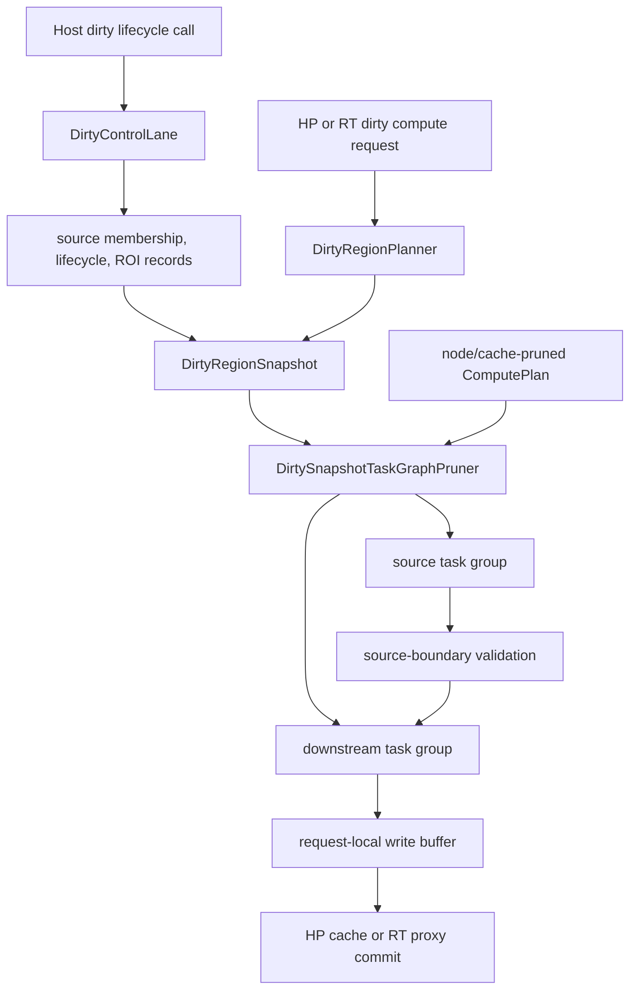

# Dirty Region Propagation and Work Selection

This document describes the dirty-region behavior implemented by the current
kernel. It separates graph-scoped dirty facts, request planning, task selection,
scheduler filtering, and output commit. Proposed Macro retile, adaptive
coarsening, Run cancellation, and dependency-neutral geometry belong in the
kernel evolution roadmap, not in this current-state contract.

## Terms and Ownership

**Dirty source** is a graph node identified as the origin of dirty work for one
snapshot. A lifecycle event may name it explicitly; a request planner may infer
it as an upstream root of the selected dependency cone.

**Dirty ROI** is a rectangular affected or demanded region. The current private
kernel representation is `cv::Rect`; output extents use `cv::Size`.

**Dirty generation** is the value stored in a `DirtyRegionSnapshot` and copied
into selected task metadata. It identifies dirty inspection and source-commit
state. It is not a graph revision, a `ComputeRun`, or a scheduler batch epoch.

**Dirty domain** is either `HighPrecision` (HP full-resolution coordinates) or
`RealTime` (RT proxy coordinates for execution records). HP and RT are separate
compute domains; dirty planning does not create task dependencies between them.

Ownership is divided as follows:

| Owner | Current responsibility | Does not own |
| --- | --- | --- |
| `DirtyControlLane` | Apply explicit begin/update/end source events on the serialized graph-state path and derive wake/cutoff hints | Compute tasks or scheduler queues |
| `DirtyRegionPlanner` | Build HP or RT request snapshots and update lifecycle snapshots | Worker execution or result commit |
| `DirtyRegionSnapshotBuilder` | Normalize source ROIs and materialize snapshot-only Micro tile or monolithic records | Graph traversal or compute requests |
| `RoiPropagationService` | Compute operator-specific forward inspection and backward demand projections | Graph topology ownership |
| `DirtySnapshotTaskGraphPruner` | Select and clip active tasks from an existing request plan | New task shapes |
| dirty executors and write buffers | Execute source-first work and stage HP/RT output | General cancellation or graph revision policy |

## Current Flow

Dirty lifecycle calls update graph state; they do not automatically start a
compute request. Parallel execution always begins from a separately constructed
node/cache-pruned `ComputePlan`.

## `DirtyRegionSnapshot`

The graph stores the latest snapshot, a debug summary, and at most 16 recent
snapshots. A snapshot contains value records, not graph or task pointers:

- `graph_generation`;
- `dirty_source_nodes`;
- per-source lifecycle state and accumulated source ROI records;
- `dirty_updating_count`;
- `dirty_tiles` and `dirty_monolithic_nodes`;
- `per_node_dirty_rois` and `actual_dirty_rois`;
- edge-level ROI mappings.

It intentionally excludes dependency counters, ready queues, scheduler queues,
task reference counts, resource policy, cancellation state, and commit policy.
The snapshot is an inspection/execution input, not an undo log or durable event
history.

### Lifecycle-produced snapshots

`begin_dirty_source()` and `update_dirty_source()` validate the node and a
non-empty source ROI, add the node to source membership, append the ROI, and set
the source state to `Updating`. `end_dirty_source()` changes that source to
`Settled` without appending an ROI. Source membership and previous ROI records
remain in the snapshot; an end followed by another begin does not itself open a
new generation. The state is cleared by graph runtime-state reset.
`dirty_updating_count` is recomputed from all source states after every event.

The planner copies the graph's latest snapshot. It allocates a generation only
when the copied snapshot has generation zero, then rebuilds the derived ROI,
tile, monolithic, and edge containers from stored source records for the domain
of the current event. The current lifecycle rebuild is source-local: it
normalizes recorded source nodes but does not traverse downstream graph edges.
Consequently its edge mapping list is cleared and remains empty.

`DirtyControlLaneResult` reports the snapshot, lifecycle event, generation,
updating-source count, `should_wake_dispatcher`, and
`cutoff_after_downstream`. These are control hints, not a public subscription or
an automatic compute trigger.

### Request-planned snapshots

`plan_high_precision()` and `plan_real_time()` create a new request snapshot for
one target and dirty ROI. The planner validates the target and ROI, obtains a
target-rooted topological postorder, resolves HP-authoritative extents, and
walks the selected graph backwards to derive upstream demand. Upstream roots of
the resulting plan become settled dirty sources.

The planner records `BackwardDemand` edge mappings. Forward affected-region
projection exists as a separate `RoiPropagationService` inspection behavior; it
is not the traversal used to materialize the current dirty execution plan.

## ROI Propagation

For each image-input edge, `RoiPropagationService` asks the registered operation
for an upstream projection. Static operation formulas cover identity,
neighborhood, crop, resize, and other geometric behavior. Data-dependent
operations may provide a validated dependency LUT. Multiple demands for the
same parent are combined as one bounding rectangle and clipped to the resolved
extent; the current representation does not retain a sparse ROI set.

Connected parameter producers affect geometry. When the request has not first
stabilized those values, the planner conservatively expands the affected
consumer, connected parameter producers, and relevant image parents to their
full extents. Dirty execution can instead build a request-local stabilized
planning graph so extent, halo, propagation, and task-shape decisions observe
one parameter snapshot.

An operation with a monolithic HP callback and no tiled HP callback is treated
as a monolithic boundary. Its local dirty ROI is promoted to the whole output
and recorded as one `DirtyMonolithicRegion`. This test is registry-based and is
also used when the requested domain is RT. Propagation outside that local node
may still yield a narrower ROI.

## Coordinate and Grid Rules

Current constants are implementation parameters, not public ABI:

| Rule | Value | Coordinate space |
| --- | --- | --- |
| RT downscale factor | 4 | HP-to-proxy projection |
| HP dirty Micro tile | 64 x 64 | HP full-resolution space |
| RT dirty Micro tile | 16 x 16 | RT proxy space |
| preferred HP Macro task size | 256 x 256 | task-shape planning, not dirty snapshot materialization |

HP request planning aligns and clips propagated ROIs to 64 pixels. RT request
planning retains HP-space propagation ROIs aligned to 64, then divides extents
and work ROIs by four with conservative rounding, aligns them to 16, and clips
them in proxy space.

Coordinate interpretation therefore depends on how the snapshot was produced:

- in a request-planned RT snapshot, `per_node_dirty_rois` and edge mappings are
  HP-space planning records, while RT tile and monolithic work records are in
  proxy space;
- in a lifecycle-produced RT snapshot, source ROIs are first clipped in HP
  space, then `per_node_dirty_rois`, `actual_dirty_rois`, and work records are
  normalized to RT proxy space.

Every currently materialized `DirtyTileKey` has
`DirtyTileLevel::Micro`. `DirtyTileLevel::Macro` exists in the value model, but
the snapshot builder does not emit it. The builder outward-aligns an already
clipped ROI and does not clip the resulting key again, so a boundary
`DirtyTileKey::pixel_roi` may extend beyond the output extent. Expanded
execution tasks retain their own clipped boundary shapes.

## Task Selection and Execution

Dirty execution first obtains the immutable node/cache-pruned plan for the
requested domain. `DirtySnapshotTaskGraphPruner::select()` overlays the snapshot
on already-expanded tasks, clips execution ROIs, preserves task ids, derives
task-level dependencies, and separates source-boundary and downstream task ids.
It does not expand nodes, create a new tile shape, or insert a retile task.

The dispatcher submits the selected source group and waits for it to settle,
validates that required source outputs exist in the relevant staged or committed
store, then submits the initially ready downstream group. Dependency completion
releases additional ready downstream work.

The two initial groups are separate scheduler batches and receive scheduler-
owned epochs. Although dirty generation is present in request/task metadata, the
current source-first dispatch does not pass that generation as the scheduler
epoch. Scheduler epoch filtering can discard stale queued callbacks for its own
active batch; it does not cancel a callback that is already running.

Source node execution additionally compares its dirty generation with the
generation already committed for that source. Work older than the committed
source generation is skipped and traced; equal generations may run again, and
downstream nodes do not perform this comparison. This is a narrow stale-source
guard, not general revision validation, supersession, deadline handling, or
cooperative cancellation.

## Staging and Commit

HP dirty tasks stage output in `HighPrecisionDirtyWriteBuffer`; RT dirty tasks
stage output in `RealtimeProxyWriteBuffer`. A successful request commits staged
HP state to `GraphModel` or RT state to `RealtimeProxyGraph` through the
intent-specific commit path.

For a `RealTimeUpdate`, RT and HP are sibling computations. The RT sibling may
commit proxy state first, while the HP sibling observes the sibling commit gate
before publishing authoritative HP state. This coordination does not create an
HP-to-RT task edge and does not make RT output an authoritative HP cache. It is
not a cross-domain atomic transaction: an HP failure after a successful RT
commit does not roll the proxy commit back.

Before scheduler-backed siblings start, `ComputeService` creates one
request-owned per-node synchronization object and shares it with both domains.
Only live `Node` snapshot/YAML parameter resolution and short staging sections
for the same node are serialized; different nodes and operation execution
remain concurrent. The owner survives sibling failure cleanup and scheduler
drain, then is destroyed with that request. It is not retained by `GraphModel`,
`GraphRuntime`, or process-wide state.

## Boundaries and Rationale

The current implementation does not provide:

- `ReTileTask` insertion or Micro-to-Macro/Macro-to-Micro dirty conversion;
- Macro dirty-key materialization or dynamic Micro/Macro coarsening;
- sparse ROI sets, dirty-area caps, time-window merging, or adaptive batching;
- a node-to-backend dirty subscription that automatically launches compute;
- a general `ComputeRun`, graph revision, deadline, supersession, or
  cooperative cancellation contract.

Current dirty geometry also depends directly on OpenCV types in graph,
propagation, planning, snapshot, and execution interfaces. This is an accepted
current limitation. [ADR 0002](../adr/0002-external-libraries-are-kernel-adapters.md)
and the exact
[dependency-neutral kernel target](../roadmap/Kernel-Evolution.md#dependency-neutral-kernel)
define the accepted replacement with kernel-owned checked geometry and
adapter-only OpenCV use.

Keeping dirty facts, static task shape, ready dispatch, and staged commit as
separate values prevents ROI updates from rewriting topology or transferring
graph ownership into a scheduler queue. The explicit limitations above bound
what generation and epoch checks can currently guarantee.

## Implementation and Validation Entry Points

- `src/lib/compute/compute_geometry.hpp`
- `src/lib/compute/dirty_region_snapshot.hpp`
- `src/lib/compute/dirty_region_snapshot_builder.cpp`
- `src/lib/compute/dirty_region_planner.cpp`
- `src/lib/compute/dirty_region_planning_policy.hpp`
- `src/lib/compute/dirty_control_lane.cpp`
- `src/lib/compute/task_graph_planning.cpp`
- `src/lib/compute/dirty_execution_common.cpp`
- `src/lib/compute/dirty_update_executor.cpp`
- `src/lib/graph/roi_propagation_service.cpp`
- `tests/integration/test_scheduler.cpp`
- `tests/integration/test_compute_service_split.cpp`
- `tests/integration/test_host_adapter.cpp`
- `tests/unit/test_propagation_contracts.cpp`
