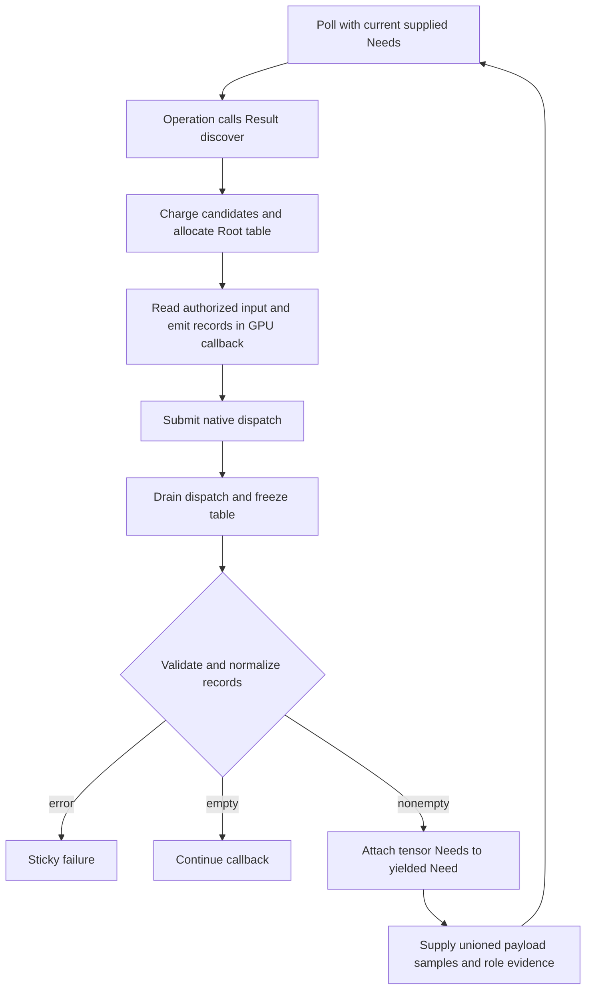

# Bounded GPU request discovery

## Result tensor discovery

### Scope and ownership

Result GPU discovery lets an operation use a native GPU callback to inspect already supplied tensor samples and report a bounded set of additional tensor regions. The executor owns the table, drains native work, validates each record, and attaches the resulting typed Needs to the operation's yielded `ResultProgramNeed`. Discovery does not trace arbitrary shader reads. Both the C Result ABI 2 service and the C++ `ResultProgramPhase::discover` entry use this Result path. `Value` can provide private backing storage, but it does not expose a separate public dependency-discovery phase.

A C Result operation calls `ps_result_services_v2::discover` from its ordinary `poll` callback. The discovery callback receives only current Need reads, native atlas access, scratch, work, cancellation, and GPU dispatch services. It returns an ordinary status and must submit real native work. The outer operation callback returns `PS_RESULT_NEED_V2` when the receipt contains requests. The host rejects publication while discovered Needs remain unresolved. An empty receipt adds no Need and can be followed by further callback work.

```c
uint64_t receipt = 0;
if (services->discover(services->context, capacity, candidates,
                       compute_requests, user, &receipt))
  return 1;
return PS_RESULT_NEED_V2;
```

The callback stores the receipt handle in operation state when it needs the normalized records during a later poll. It releases that handle after reading the records. `discovery_requests` supports a count query with `output == NULL` and `capacity == 0`, followed by a copy into initialized records. The C handle remains owned by that plugin instance across polls until explicit release or operation destruction. The C++ `ResultProgramPhase::discover` API returns a `shared_ptr<const ResultDiscoveryReceipt>` containing the same kind of typed footprint metadata. A receipt retains no source payload.

### Data layout and memory

The Result v2 table preserves the 16-byte header and 144-byte records. The header contains four little-endian `uint32_t` values: attempted record count, overflow flag, and two zero reserved words. Each record contains four `uint32_t` values followed by eight `uint64_t` offsets and eight `uint64_t` extents:

| Offset | Contents |
| --- | --- |
| 0..3 | Input port index |
| 4..7 | Data, Control, and Validation role mask |
| 8..11 | Full sample rank |
| 12..15 | Tensor slot index |
| 16..79 | `uint64_t offsets[8]` |
| 80..143 | `uint64_t extents[8]` |

The rank and coordinates use the tensor's complete sample shape: batch axes first, then cell axes. Each raw rectangle must fit that selected slot and satisfy its complete tuple/channel closure before grouping. Roles are a nonempty combination of Data, Control, and Validation. The decoder groups records by input port, tensor slot, and role mask, then normalizes their rectangles under shared work and metadata bounds.

The Result helper is `PS_RESULT_GPU_DISCOVERY_MSL_V2`, which defines this Metal function signature:

```metal
bool ps_result_discovery_emit(device atomic_uint* table, uint capacity,
                              uint input, uint slot, uint roles, uint rank,
                              thread const ulong* offsets,
                              thread const ulong* extents);
```

It writes the record fields in the order input, roles, rank, and tensor slot. The legacy `PS_GPU_DISCOVERY_MSL_V11` helper remains available and writes zero in the fourth record word instead of a tensor slot. Both helpers use the same header and record size, but only the Result v2 record selects a tensor member.

For capacity `K`, the logical table size is:

$$
S = 16 + 144K.
$$

The executor charges `candidates + 2S` work before allocating the zeroed Root table. The table uses Root-accounted native storage, not the operation's workspace allocation. The device's rounded table capacity is admitted separately. The host freezes the table only after the synchronous callback and its submitted GPU work drain, then decodes it. No table or service pointer survives the discovery callback.

### Execution and Need state



The discovery callback is synchronous and GPU-only. It may read tensor samples covered by the current Need, acquire an atlas for that Need, allocate or release scratch, charge work, check cancellation, and submit GPU commands. The host requires at least one actual native dispatch for a successful discovery call. A missing device, table overflow, malformed record, invalid slot, out-of-domain rectangle, tuple-closure omission, or resource-limit failure returns a typed failure; it never widens coverage to a bounding box.

The executor attaches the discovered Needs to the `ResultProgramNeed` returned by the operation's poll callback. The operation can request more Needs in that same yielded Need. The combined stage entry count is limited by the smaller of 65,536 and the dependency set's `maximum_boxes`. Same-input, same-slot tensor Needs with multiple roles share one payload supply over the union of payload-readable samples. Each role's original coverage remains separately validated and recorded as dependency evidence. This avoids rereading the same slot while preserving role-specific history.

A C receipt contains normalized `ps_result_discovery_request_v2` records with input, slot, role mask, and sample-space region. Use a count-only query when the record count is not known, then provide initialized `struct_size` values and enough capacity for the copy. Receipt metadata is immutable and carries no tensor bytes. Each `candidates` value bounds one table, while work and metadata are charged across discovery calls in the active poll. The actor's discovery-work allowance persists across polls; each call also consumes Run and Root work. Duplicate records still consume emission and normalization work.

### Limits and failure handling

`capacity` is positive and cannot exceed 65,536, `DependencyLimits::maximum_gpu_requests`, or the applicable `maximum_boxes`. A zero `maximum_gpu_requests` disables discovery. `candidates` is positive and bounds every emit attempt, including duplicates and attempts beyond table capacity. The shader must not dispatch more emitter invocations than that bound. The table sets overflow only when an attempted record has no free slot; filling the last slot is valid. The host rejects overflow and also checks attempted count against `candidates`.

Table bytes, rounded native capacity, candidate work, decoding work, and request metadata are charged independently to their Root and dependency bounds. Read and atlas access remain limited to current Needs. Discovery cannot issue another Need, publish output, enter a block callback, or recursively invoke discovery. A native callback that submits no work fails with `OperationFailed`. Submitted dispatches drain before table owners retire.

### G4 Result discovery workflow

`examples/g4_gpu_workflow/discovery_plugin.c` registers a Result ABI 2 C operation. Its inputs are rank-one Float32 data and Int64 control Results with 8,192 samples. The GPU callback reads an already supplied Control sample through its atlas, emits the selected data rectangles, and dispatches the Result discovery shader. The host attaches those rectangles as tensor Needs; the next poll reads the newly supplied data and publishes the output tensor.

The current workflow returns `8,24` on CPU and Metal; the Metal path submits four dispatches. Its real GPU query uses rank-one tensors at slot 0. Editing Control changes the first result to 24 and replaces its Data support with `{1,4097}`. A frozen execution still returns 8. The workflow checks invalid Control values, table overflow, premature publication, and discovery disabled with `maximum_gpu_requests=0`.

`test_result_gpu_discovery` separately checks the decoder with rank-8 coordinates, tensor slot 1, batch/channel closure, and distinct role groups. Those are decoder cases; they are not the shape or slot used by the native workflow.

Discovery must be invoked on the active callback entry thread. In the C++ API, `ResultProgramPhase::consume_work` may charge from worker threads; C discovery services remain entry-thread-only. A worker-thread call to `discover` fails before running its compute callback. The thread fixture charges 4,096 units through `consume_work` from each of two workers: the 8,512 limit rejects the request and 8,513 admits it with one native dispatch. The workflow also tests both discovery-work and Run-work limits across poll boundaries: a one-sample request fits an 8,192-unit limit, while a two-sample request exhausts it on later polling rather than receiving a fresh budget.

The C workflow holds its receipt handle in operation state until the resumed poll copies the normalized request records and releases the handle. The request-table pointer is borrowed only during the synchronous discovery callback. The GPU token follows the enclosing poll lifetime, but the host freezes the table when discovery returns; a later write through that token fails. Failure fixtures confirm that discovery table/atlas owners return to the original source-only Root Payload level, do not seed the result cache, and allow a fresh native retry.

Run the native workflow and standalone decoder test with:

```sh
cmake --build build --target test_gpu_discovery_workflow test_result_gpu_discovery -j 8
ctest --test-dir build -R '^(test_gpu_discovery_workflow|test_result_gpu_discovery)$' --output-on-failure
```

The installed workflow consumer is `installed_gpu_discovery_workflow` in the configured `build/consumer-build` tree. Its test uses the installed kernel package; it exercises the same rank-one, slot-zero native workflow.

The capacity-128 admission case uses a Root live-payload boundary of 132,400 bytes: 98,304 bytes of bound inputs, 1,160 bytes of continuation state, 32,768 bytes of rounded table storage, and 168 bytes for the Control atlas. It rejects 132,399 and admits 132,400 for this fixture. After the failed admission, the table owners retire and a new native query succeeds at the admitted capacity.

## MSL discovery emitters and wire compatibility

`PS_RESULT_GPU_DISCOVERY_MSL_V2` is the Result emitter and writes input, tensor slot, roles, and rank into the first four words of each record. `PS_GPU_DISCOVERY_MSL_V11` remains as a wire-compatible emitter for slot-zero records: its fourth word is always zero. The v11 macro defines the record layout; execution and Need attachment use the Result APIs above.

Both emitters use the 16-byte header and 144-byte records described above. The Result decoder interprets the fourth word as a tensor slot and validates the input, slot, rank, roles, extents, unused axes, sample-domain bounds, and tuple/channel closure against the selected Result schema. A v11-emitted record therefore addresses slot 0; operations that need another tensor slot use the Result v2 emitter. Table capacity, candidate bounds, overflow handling, native-work draining, resource accounting, and receipt ownership follow the Result discovery contract above.

The native GPU service is independently versioned as `PS_GPU_ABI_VERSION_1`; it supplies the synchronous buffer and dispatch operations used by discovery. Result discovery itself remains part of Operation Plugin ABI 2. Vulkan support is optional at build time. Native GPU behavior depends on an enabled backend and a usable device; protocol mocks cover validation and failure paths but do not establish native execution.
