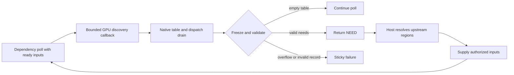

# Bounded GPU dependency discovery

## Scope & Ownership

GPU discovery lets a registered dependency program inspect already supplied inputs on the selected GPU and return a bounded set of additional input regions. The host owns the table allocation, native dispatch lifetime, decoding, validation, and attachment of discovered needs to the current poll. Discovery is explicit; it does not trace arbitrary shader reads.

```c
#include "photospider/plugin/dependency_plugin_api.h"

int request_discovery(ps_dependency_services_v11* services,
                      uint32_t capacity, uint32_t candidates,
                      ps_dependency_discovery_compute_v11 compute,
                      void* user) {
  return services->discover(services->context, capacity, candidates, compute,
                            user);
}
```

These callback and service types are declared in `dependency_plugin_api.h` under dependency service ABI v11. The table layout is defined by `PS_GPU_DISCOVERY_MSL_V11` in `gpu_discovery_msl.h`. The callback may use ready-input reads, accounted scratch, cancellation and synchronous GPU buffer/dispatch services. It returns success or an error; it never returns `NEED` itself. Every service failure is sticky, including when the callback ignores its return value.

## Data Layout & Memory

The host allocates and zeroes a bounded native table through the active execution resource budget. Its wire layout begins with four little-endian `uint32_t` words: attempted emit count, overflow flag, and two reserved zero words. The header is followed by `capacity` fixed 144-byte records:

| Offset | Contents |
| --- | --- |
| 0, 4, 8, 12 | `uint32_t` port, role mask, rank, reserved zero |
| 16..79 | `uint64_t offsets[8]` |
| 80..143 | `uint64_t extents[8]` |

The callback borrows the table until it returns. The host drains submitted native work before freezing the table; frozen buffers cannot be written through retained native views. The host validates each record's port, rank, Data/Control/Validation roles, positive extents, zeroed unused axes, and descriptor bounds. For image inputs, every raw record must include all channels before normalization; separate partial-channel records cannot combine to bypass channel closure.

`capacity` is positive and no greater than 65536. `candidates` bounds every emit attempt, including duplicates and attempts beyond capacity, and is charged before callback execution. The table sets overflow only when an emit attempt has no available record slot; filling the final slot alone is not overflow. An out-of-capacity attempt does not write a record. Overflow returns `ResourceExhausted`; malformed records fail the callback. Discovery table bytes, native allocation capacity, decoding work, request metadata, and candidate work are charged to their applicable limits. Table, atlas, scratch, state, and output owners remain charged until their last owner retires.

## Execution & State



After a nonempty table validates, the dependency program must return `NEED`. The host preserves each request's association with its current Atomic observation or complete terminal `RequestRecord`, resolves upstream inputs, supplies them, and polls again. Returning numerical completion while discovered requests remain unresolved is a protocol error. An empty table adds no dependency and can precede a constant or control-only completion.

`DependencyLimits::maximum_gpu_requests` bounds one discovery table; its default and hard maximum are 65536, and zero disables discovery. The setting participates in dependency Flight identity. Each poll's request metadata and each Run's work budget are shared across discovery calls and normalization groups. The host charges raw rows and association lookup before deduplicating requests, so duplicate output does not erase performed work. A `Footprint::from_regions` call can report consumed work on success, failure, or exception; the decoder subtracts that usage before processing the next group. Exceeding the discovery request limit or shared work/metadata bounds returns a finite resource failure.

Discovery cannot run recursively, inside a pure dependency block, or while a discovery callback invokes a pure block. Discovery callbacks are synchronous and trusted; cancellation is cooperative, and submitted dispatches drain before native owners retire. The table pointer and discovery-service table expire when compute returns. Other dependency service/context/input/scratch pointers expire when poll returns. A `retain_input` handle keeps its exact authorization and original owner until `release_owner` or dependency state destruction; it does not expire at poll return.

Discovery service functions return Boolean `1` for success and `0` for failure. The discovery compute callback returns ordinary operation result codes, never `NEED`. The enclosing dependency callback returns `NEED` only after the host validates a nonempty discovery table and attaches the resulting requests.

## Algorithms & Math

The wire table reserves 16 bytes for its header and 144 bytes per record. For a table of capacity `K`, the logical size is:

$$
S = 16 + 144K.
$$

The host checks the multiplication and addition before allocation, then admits the queried native backing capacity, which can exceed `S`. The candidate bound is independent of table capacity because overflow and duplicate attempts still consume work.

## Limitations & Non-Goals

- Discovery is an explicit trusted callback protocol, not page-fault handling, implicit shader tracing, or a sandbox for arbitrary shader loops.
- The discovery service exposes no output publication, association editing, checkpoint, or pure-block service of its own.
- Only already supplied inputs are available to a discovery callback. Missing samples must become declared needs before numerical completion.
- Native GPU discovery requires a build with an enabled native backend and a usable device. `PHOTOSPIDER_ENABLE_METAL` is enabled by default on Apple platforms; `PHOTOSPIDER_ENABLE_VULKAN` is optional and defaults off.
- Protocol mocks exercise validation and failure paths but do not establish native GPU behavior.
