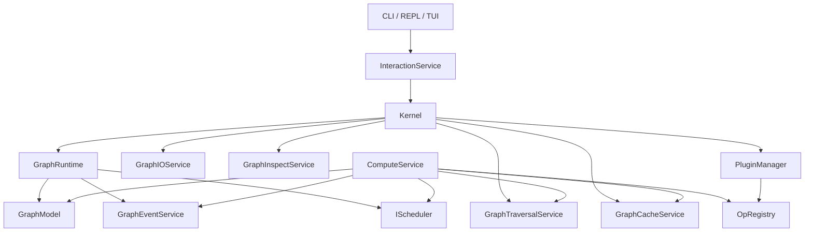

# Kernel Architecture Overview

This document describes the architecture present in the current branch. Older
phase plans and milestone reports have been moved to `docs/outdated/`.

This directory is the maintained developer documentation for the kernel. Treat
it as the source of truth for public contracts used by operators, schedulers,
plugins, and kernel services. OpenSpec change artifacts are planning material
and are not assumed to be committed with the repository.

## Current State

Photospider is built around a graph runtime with a service split, operation
registry, cache layer, and scheduler abstraction. The implementation is still in
transition: legacy recursive and `GraphRuntime` queue paths coexist with the
formal `IScheduler` target interface and newer intent-driven RT/HP model.

The code is useful and testable, but some boundaries are not final. In
particular, `Kernel` and `ComputeService` still coordinate a large amount of
behavior that may eventually move into narrower services.

## Build Modules

The root `CMakeLists.txt` builds these internal modules:

| Target | Role |
| --- | --- |
| `photospider_core_types` | Core data types, OpenCV adapter, YAML node parsing, builtin op registry source. |
| `photospider_graph` | `GraphModel` plus graph IO, traversal, cache, and inspect services. |
| `photospider_plugin` | Dynamic operation plugin manager and loader. |
| `photospider_compute` | Kernel facade, interaction runtime, schedulers, compute service, events. |
| `photospider_lib` | Shared backend library linked by CLI and plugins. |
| `photospider_cli_common` | REPL commands, TUI editors, autocomplete, CLI config. |
| `graph_cli` | End-user executable. |

Output directories:

| Output | Path |
| --- | --- |
| executable | `build/bin` |
| libraries | `build/lib` |
| operation plugins | `build/plugins` |
| scheduler plugins | `build/schedulers` |
| tests | `build/tests` |

## Runtime Ownership

## Main Components

| Component | Role |
| --- | --- |
| `Kernel` | Multi-graph facade, service owner, runtime bootstrapper, top-level graph/cache/compute API. |
| `GraphRuntime` | Per-graph execution container with model, events, schedulers, worker state, and platform context. |
| `GraphModel` | Graph state holder: nodes, cache root, timing data, quiet/skip-save flags. |
| `InteractionService` | CLI-facing wrapper around `Kernel`; keeps command code thin. |
| `ComputeService` | Resolves dependencies, checks caches, executes ops, coordinates RT/HP/tiled paths and timing events. |
| `GraphTraversalService` | Dependency trees, traversal orders, graph validity, ROI projection helpers. |
| `GraphCacheService` | Memory/disk cache operations and cache synchronization. |
| `GraphInspectService` | Human-readable cache and spatial metadata inspection. |
| `GraphEventService` | Per-node compute event collection. |
| `PluginManager` | Loads operation plugins and records operation sources. |
| `OpRegistry` | Global operation implementation registry, including HP/RT, tiled/monolithic, device metadata, and ROI propagators. |

## Maintained Documents

| Document | Scope |
| --- | --- |
| `Overview.md` | Top-level module ownership and current architecture state. |
| `Data-Model.md` | `GraphModel`, `Node`, YAML schema, inputs, outputs, parameters, and cache fields. |
| `Compute-Flow.md` | Sequential, parallel, RT, HP, ROI update, and event/timing flow. |
| `Cache-Model.md` | HP/RT memory cache semantics, legacy HP cache rename, and disk cache behavior. |
| `Graph-Lifecycle.md` | Graph runtime ownership, graph load/reload/edit failure semantics, and `GraphModel::clear()`. |
| `ImageBuffer-Memory-Contract.md` | Public `ImageBuffer` memory/device contract, alignment, stride, and adapter rules. |
| `Dirty-Region-Propagation.md` | ROI propagation, tile mapping, and current tunable tile defaults. |
| `Scheduler-Architecture.md` | Formal `IScheduler` target model, built-in schedulers, and migration state. |
| `Plugin-ABI.md` | Operation plugin and scheduler plugin ABI contracts. |
| `Development-Validation.md` | Mainline macOS architecture, CTest expectations, and follow-up refactor boundaries. |

## Compute Flow

Typical REPL compute flow:

1. A REPL command calls `InteractionService`.
2. `InteractionService` calls `Kernel`.
3. `Kernel` resolves the active `GraphRuntime`.
4. `Kernel` creates or uses services needed by `ComputeService`.
5. `ComputeService` resolves dependencies with `GraphTraversalService`.
6. `ComputeService` checks memory and disk cache with `GraphCacheService`.
7. `ComputeService` selects operation implementations from `OpRegistry`.
8. Work executes recursively or through the configured scheduler path.
9. `GraphEventService` records per-node events and timing data.
10. Results are exposed back through `Kernel` and `InteractionService`.

## Scheduler Model

The runtime recognizes two compute intents:

| Intent | Meaning |
| --- | --- |
| `GlobalHighPrecision` / HP | Full-quality compute path. |
| `RealTimeUpdate` / RT | Lower-latency update path for interactive workflows. |

Built-in scheduler types:

| Type | Role |
| --- | --- |
| `cpu_work_stealing` | Multi-threaded CPU execution. |
| `serial_debug` | Single-threaded deterministic debugging path. |
| `gpu_pipeline` | Heterogeneous pipeline with CPU/GPU routing. |
| `heterogeneous` | Alias for `gpu_pipeline`. |

The CLI exposes scheduler controls through the `scheduler` REPL command. Default
types and plugin directories are configured in `config.yaml`.

`IScheduler` is the formal target interface. The worker queues still present in
`GraphRuntime` are migration support for paths that have not yet been routed
cleanly through scheduler instances.

## Operation Registry

Operations are keyed by `type:subtype`. The registry supports:

- legacy monolithic operation registration
- HP monolithic implementations
- HP tiled implementations
- RT tiled implementations
- per-device implementations such as CPU and Metal
- dirty ROI propagators
- forward ROI propagators
- dependency builders

Built-in operations are registered in `src/ops.cpp`. Runtime plugin examples
live in `custom_ops/`.

## Cache Model

The cache layer currently spans older and newer state:

- `Node::cached_output_high_precision`: formal HP cache.
- `Node::cached_output_real_time`: formal RT cache.
- `Node::cached_output`: mistaken legacy name for the HP cache; migrate away.
- RT/HP version and ROI fields
- disk cache files under the configured cache root

This mixed model is one of the main migration areas. `GraphCacheService` keeps
cache commands centralized, but some compute paths still need to know about the
specific cache flavor they are reading or writing.

New code should not introduce additional dependencies on `cached_output`. HP
code should use `cached_output_high_precision`; RT code should use
`cached_output_real_time`.

## ImageBuffer Contract

`ImageBuffer` is a public kernel contract, not an internal implementation
detail. Operators, schedulers, plugins, adapters, and cache code may depend on
its documented fields and invariants.

CPU buffers owned by the kernel must provide 64-byte aligned row starts. `step`
is the row stride in bytes and may be larger than the packed row size to
preserve alignment. ARM Mac high-performance paths may need or benefit from
128-byte alignment, but 128-byte alignment is an optimization target rather than
the portable minimum.

## Dirty Region Propagation

ROI propagation is handled through registry-provided propagators and traversal
helpers. The active propagation notes are in
`docs/kernel-architecture/Dirty-Region-Propagation.md`.

Important current behavior:

- identity propagation for source/generator/analyzer/math-style nodes
- specific propagation for `resize`, `crop`, `convolve`, and `gaussian_blur`
- forward propagation for downstream dirty-region projection
- tiled compute metadata for operators that can execute in tile space
- current tile defaults are tunable implementation parameters, not permanent ABI

## Known Architecture Tensions

These are implementation realities, not immediate blockers:

- `Kernel` is broad and acts as graph manager, service owner, runtime manager,
  cache API, compute API, and editing API.
- `ComputeService` contains planning, cache coordination, execution, ROI update,
  scheduler interaction, and metrics emission.
- `GraphTraversalService` mixes topology traversal with ROI and spatial
  propagation helpers.
- Cache APIs still expose legacy and newer RT/HP concepts together.
- Not every built test executable is registered with CTest.

The `ComputeService` split and `GraphTraversalService` topology/ROI split are
explicit follow-up refactors, not part of the current kernel-contract cleanup.

## Maintained Documentation Boundary

Active docs should describe current behavior. Historical planning artifacts,
phase reviews, dated state reports, and speculative diagrams belong in
`docs/outdated/`.
