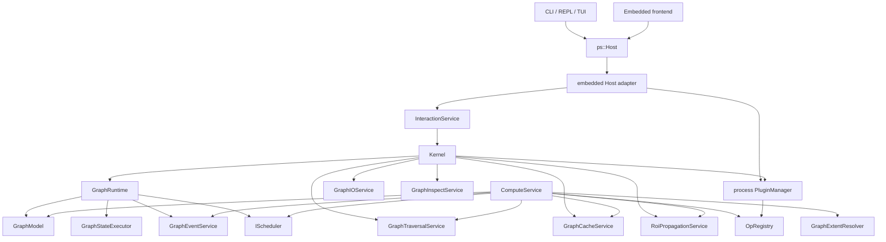

# Kernel Architecture Overview

This document describes the architecture present in the current branch. Older
phase plans and milestone reports have been moved to `docs/outdated/`.

This directory is the maintained developer documentation for the kernel. Treat
it as the source of truth for public contracts used by operators, schedulers,
plugins, and kernel services. OpenSpec change artifacts are planning material
and are not assumed to be committed with the repository.

## Current State

Photospider is built around a graph runtime with a service split, operation
registry, cache layer, scheduler abstraction, and a frontend-facing Host seam.
Parallel planned work now dispatches through scheduler-owned task runtimes.
Graph-state commands and compute requests that mutate visible graph state enter
an explicit per-graph `GraphStateExecutor` boundary instead of the scheduler
dispatch path. Scheduler-backed parallel compute uses the scheduler runtime for
ready task callbacks inside that graph-state boundary.

The code is useful and testable, but some boundaries are not final. In
particular, `Kernel` and `ComputeService` still coordinate a large amount of
behavior that may eventually move into narrower services.

## Build Modules

The root `CMakeLists.txt` builds these internal modules:

| Target | Role |
| --- | --- |
| `photospider_core_types` | Core data types, OpenCV adapter, YAML node parsing, builtin op registry source. |
| `photospider_operation_plugin_shim` | Narrow shared helper library for dynamic operation callback code that needs `ImageBuffer`/OpenCV adapter symbols without registry state. |
| `photospider_graph` | `GraphModel` plus graph IO, traversal, cache, and inspect services. |
| `photospider_plugin` | Dynamic operation plugin manager and loader. |
| `photospider_compute` | Build-only interaction runtime, schedulers, compute service, and events helper. |
| `photospider` | Static installable backend product, archived as `libphotospider`, linked by CLI and embedded Host frontends. It installs only `include/photospider/**` and exports `Photospider::photospider`; operation plugins register through `OperationPluginRegistrar` and `register_photospider_ops_v1` instead of linking this product for registry state. |
| `photospider_cli_common` | Non-installable application helper built from `apps/graph_cli/src/`: REPL commands, TUI editors, autocomplete, and CLI config. |
| `graph_cli` | End-user executable whose process entry point is `apps/graph_cli/main.cpp`. |

The complete CLI application closure is private to `apps/graph_cli/`, including
its `include/graph_cli/` headers and `resources/help/` text. Backend graph,
compute, runtime, scheduler, plugin, cache, and Host implementations remain in
role-owned `src/lib/**` library/internal modules rather than being copied into
the application. Repository-owned plugins live under `plugins/{ops,schedulers}`;
maintained test translation units are classified under `tests/{unit,integration}`.

Output directories:

| Output | Path |
| --- | --- |
| executable | `build/bin` |
| libraries | `build/lib` |
| operation plugins | `build/plugins` |
| scheduler plugins | `build/schedulers` |
| tests | `build/tests` |

Package boundary:

- `cmake --install` installs the static `photospider` archive, the
  `include/photospider/**` public header tree, `PhotospiderTargets.cmake`, and
  `PhotospiderConfig.cmake`. The archive is `libphotospider.a` on Unix-like
  toolchains and `photospider.lib` with MSVC.
- `Photospider::photospider` carries `PHOTOSPIDER_STATIC` for consumers and
  keeps the `src/lib/` include root private to repository builds. In the build tree,
  the target's generated public include root contains only `photospider/`
  forwarding headers. CMake tracks additions and removals and the wrappers read
  live source headers without directory symlinks.
- OpenCV (`core`, `imgproc`, `imgcodecs`, `videoio`), `yaml-cpp`, `Threads`,
  platform dynamic-loader libraries, and Apple `Metal`/`Foundation` framework
  flags are implementation link dependencies of the static archive. Library
  dependencies appear as `$<LINK_ONLY:...>` entries on the installed target;
  Apple framework flags are propagated from a private Apple-only product link
  block. Public Host/core headers avoid OpenCV and `yaml-cpp` types; Windows
  consumers receive `PHOTOSPIDER_STATIC` so declarations do not use DLL
  import/export attributes.
- FTXUI, `photospider_cli_common`, operation plugin shim libraries, operation
  plugins, and scheduler plugins are not exported as dependencies of the
  embedded static package.
- CLI headers under `apps/graph_cli/include/graph_cli/**` are private build
  inputs and are not installed; the public install inventory remains exactly
  `include/photospider/**`.
- Eight transitional extension headers remain source-tree-only until issue
  #38: `include/{plugin_api,node,ps_types,image_buffer}.hpp`, the OpenCV adapter
  header, and the three scheduler extension headers. They are not installed and
  have no duplicate `src/lib` forwarders.

## Runtime Ownership

Each embedded Host owns its Kernel, graph runtimes, and async coordination, but
operation plugins are different: every Host and Kernel reaches the same
process-lifetime `PluginManager` and `OpRegistry`. Host destruction never
unloads operation plugins. A load or explicit unload through any Host changes
the process-global operation view seen by all Hosts; callback and returned-value
leases keep plugin code mapped after registry removal until in-flight state is
destroyed.

## Main Components

| Component | Role |
| --- | --- |
| `Kernel` | Multi-graph facade, service owner, runtime bootstrapper, top-level graph/cache/compute API. |
| `ps::Host` | Public frontend interface under `include/photospider/host`; returns copied request/result/snapshot values and hides Kernel, GraphModel, and GraphRuntime. |
| `embedded Host adapter` | In-process Host implementation backed by per-adapter `Kernel` and `InteractionService` state; all adapters share the process operation plugin owner. |
| `GraphRuntime` | Per-graph resource container with model, graph-state executor, fixed-capacity scheduler trace ring, schedulers, and platform context. |
| `GraphModel` | Graph state holder: private node storage, topology adjacency index, cache root, timing data, quiet/skip-save flags. |
| `InteractionService` | Internal wrapper around `Kernel` used by the embedded Host adapter and backend code; frontends, including the CLI, use the public Host seam. |
| `ComputeService` | Resolves dependencies, checks caches, executes ops, coordinates RT/HP/tiled paths and timing events. |
| `GraphTraversalService` | Topology-only traversal orders, ending-node discovery, ancestor checks, upstream dependency queries, and downstream dependent queries backed by `GraphModel` adjacency. |
| `RoiPropagationService` | ROI/spatial propagation boundary for upstream ROI computation and graph-level forward/backward ROI projection. |
| `GraphExtentResolver` | HP-authoritative output extent resolver used by ROI propagation and dirty-region planning. |
| `GraphCacheService` | Memory/disk cache operations and cache synchronization. |
| `GraphInspectService` | Structured cache/spatial metadata inspection and dependency-tree snapshots built from graph topology. |
| `GraphEventService` | Thread-safe, fixed-capacity per-node compute-event ring with sequenced destructive batches and saturating drop accounting. |
| `PluginManager` | Unique process-lifetime operation plugin owner; serializes load/seed/unload/inspection and owns source/restoration/handle state. Load registers and records dynamic plugins, seed initializes or reconciles built-ins, and only explicit global unload removes dynamic plugins. |
| `OpRegistry` | Process-global operation implementation registry with coherent copied callback snapshots, including HP/RT, tiled/monolithic, device metadata, and ROI propagators. |

## Maintained Documents

| Document | Scope |
| --- | --- |
| `Overview.md` | Top-level module ownership and current architecture state. |
| `Data-Model.md` | `GraphModel`, `Node`, YAML schema, inputs, outputs, parameters, and cache fields. |
| `Compute-Flow.md` | Sequential, parallel, RT, HP, ROI update, and event/timing flow. |
| `Compute-Service-Split.md` | Planned `ComputeService` facade/internal split and TODO boundaries. |
| `Cache-Model.md` | HP/RT memory cache semantics and disk cache behavior. |
| `Graph-Lifecycle.md` | Graph runtime ownership, graph load/reload/edit failure semantics, and `GraphModel::clear()`. |
| `ImageBuffer-Memory-Contract.md` | Public `ImageBuffer` memory/device contract, alignment, stride, and adapter rules. |
| `Dirty-Region-Propagation.md` | ROI propagation, tile mapping, and current tunable tile defaults. |
| `Scheduler-Architecture.md` | Formal `IScheduler` lifecycle, built-in schedulers, and task-runtime dispatch boundary. |
| `Plugin-ABI.md` | Operation plugin and scheduler plugin ABI contracts. |
| `Development-Validation.md` | Mainline macOS architecture, CTest expectations, and follow-up refactor boundaries. |
| `Benchmark-Spikes.md` | Metal adapter and ARM alignment benchmark plans and follow-up status. |

## Compute Flow

Typical REPL compute flow:

1. A REPL command calls the public `ps::Host` interface.
2. The embedded Host adapter translates public values to internal
   `InteractionService` / `Kernel` requests.
3. `Kernel` resolves the active `GraphRuntime`.
4. `Kernel` creates or uses services needed by `ComputeService`.
5. `ComputeService` resolves topology order with `GraphTraversalService`.
6. `ComputeService` checks memory and disk cache with `GraphCacheService`.
7. Dirty-region paths use `RoiPropagationService` and `GraphExtentResolver`
   for ROI demand and HP-authoritative extents.
8. `ComputeService` selects operation implementations from `OpRegistry`.
9. Work executes recursively or through the configured scheduler path.
10. `GraphEventService` records per-node events and timing data.
11. The embedded Host adapter copies results into public Host value snapshots,
    and the CLI renders those values.

Typical embedded Host compute flow:

1. A local frontend creates `ps::Host` through `create_embedded_host()`.
2. The frontend sends `GraphLoadRequest`, `HostComputeRequest`, or inspection
   requests using public value types from `include/photospider/host` and
   `include/photospider/core`.
3. The embedded Host adapter converts those values into existing
   `InteractionService` / `Kernel` requests.
4. Kernel and service execution follows the same graph-state, compute, cache,
   scheduler, and plugin paths used by the CLI.
5. Results are copied back as `OperationStatus`, `GraphInspectionView`,
   `DirtyRegionInspectionSnapshot`, timing/event snapshots, scheduler info, or
   other Host value snapshots. Host callers never receive `Kernel`,
   `GraphModel`, `GraphRuntime`, OpenCV rectangles, or YAML nodes.
6. For Host-submitted async compute, the Kernel work item returns an owned exact
   outcome. A joined adapter worker maps that outcome without consulting shared
   `LastError`, fulfills the caller-visible `OperationStatus` promise, and only
   then notifies `close_graph()` that status publication is complete.
7. Embedded close admission rejects new compute/scheduler work, waits accepted
   synchronous calls and ready async status promises, and then stops the runtime
   through the same `GraphStateExecutor` used by compute, scheduler information,
   and scheduler replacement. A retained scheduler cannot be replaced or
   destroyed while active work uses it.
8. Recoverable backend failures become Host status/result values, while
   resource exhaustion remains exceptional: non-destructor Host methods and
   consumed async futures may propagate `std::bad_alloc` as documented by the
   installable interface.

## Bounded Event and Trace Observation

The public Host observation boundary never returns an unbounded compute-event
or scheduler-trace vector. `ComputeEventSnapshot` and
`SchedulerTraceEventSnapshot` each carry a per-session `sequence`.
`ComputeEventBatch` and `SchedulerTracePage` each carry bounded `events`,
`next_sequence`, `has_more`, and `dropped_count` values.

Compute events use an 8,192-entry production ring and destructive Host pages of
1 through 1,024 entries. Scheduler traces use a 65,536-entry production ring
and non-destructive cursor pages of 1 through 4,096 entries. Valid publication
sequences are `1..UINT64_MAX-1`; `UINT64_MAX` is reserved for terminal
exhaustion. Both rings have injectable smaller capacities and initial sequence
state inside backend construction for deterministic tests, without adding
public Host configuration.

Compute-event names and sources are limited to 1,024 UTF-8 bytes before
retention. Oversized publications are dropped whole, and all overflow,
oversize, and exhaustion accounting saturates instead of wrapping. Invalid
Host limits and trace cursors return `GraphErrc::InvalidParameter` without
mutating retained observations; a missing session remains
`GraphErrc::NotFound` for a valid request.

## Scheduler Model

The runtime recognizes two compute intents:

| Intent | Meaning |
| --- | --- |
| `GlobalHighPrecision` / HP | Full-quality compute path. |
| `RealTimeUpdate` / RT | Lower-latency update path for interactive workflows. |

Built-in scheduler types:

| Type | Role |
| --- | --- |
| `cpu_work_stealing` | Multi-threaded CPU execution. |
| `serial_debug` | Single-threaded deterministic debugging path. |
| `gpu_pipeline` | Heterogeneous pipeline with CPU/GPU routing. |
| `heterogeneous` | Alias for `gpu_pipeline`. |

The CLI exposes scheduler controls through the `scheduler` REPL command. Default
types and plugin directories are configured in the local `config.yaml`; the root
file is ignored by the repository and should be treated as a per-worktree
override. Startup scans `scheduler_dirs` before graph load so plugin-provided
scheduler types are discoverable during per-graph scheduler injection. Discovery
does not select a scheduler by itself: the active graph uses the configured
`scheduler_hp_type` / `scheduler_rt_type` values, or a later
`scheduler set <hp|rt> <type>` command.

`IScheduler` is the formal lifecycle interface, and scheduler-owned
`SchedulerTaskRuntime` is the dispatch contract for compute-service planned
parallel work. `GraphStateExecutor` is the separate access boundary for
graph-state operations and compute requests that read or mutate the visible
`GraphModel`.

## Operation Registry

Operations are keyed by `type:subtype`. The registry supports:

- legacy monolithic operation registration
- HP monolithic implementations
- HP tiled implementations
- RT tiled implementations
- per-device implementations such as CPU and Metal
- dirty ROI propagators
- forward ROI propagators
- dependency builders

Built-in operations are registered in `src/lib/core/ops.cpp`. Runtime plugin
examples live in `plugins/ops/`; the Metal operation implementation is private
to `plugins/ops/metal/`.

## Cache Model

The cache layer uses one node-local formal cache plus one runtime-owned RT
proxy graph:

- `Node::cached_output_high_precision`: formal reusable HP cache.
- `RealtimeProxyGraph`: transient low-resolution RT preview/update state keyed
  by node id, not formal cache authority.
- HP version/ROI fields on `Node`; RT version/ROI fields on proxy node state.
- disk cache files under the configured cache root

`GraphCacheService` keeps cache commands centralized. HP code should use
`cached_output_high_precision`; RT code should use `RealtimeProxyGraph` only as
interactive state. Dirty RT worker writes are staged through
`RealtimeProxyWriteBuffer` before proxy commit; dirty HP worker writes are
staged through `HighPrecisionDirtyWriteBuffer` before graph commit. Formal
cache save, load, synchronization behavior, subsequent HP compute, and
long-term storage use HP output.

## ImageBuffer Contract

`ImageBuffer` is a public kernel contract, not an internal implementation
detail. Operators, schedulers, plugins, adapters, and cache code may depend on
its documented fields and invariants.

CPU buffers owned by the kernel must provide 64-byte aligned row starts. `step`
is the row stride in bytes and may be larger than the packed row size to
preserve alignment. ARM Mac high-performance paths may need or benefit from
128-byte alignment, but 128-byte alignment is an optimization target rather than
the portable minimum.

## Dirty Region Propagation

ROI propagation is handled through `RoiPropagationService` using
registry-provided propagators, `GraphModel` topology adjacency, and
`GraphExtentResolver`. The active propagation notes are in
`docs/kernel-architecture/Dirty-Region-Propagation.md`.

Important current behavior:

- identity propagation for source/generator/analyzer/math-style nodes
- specific propagation for `resize`, `crop`, `convolve`, and `gaussian_blur`
- forward propagation for downstream dirty-region projection
- tiled compute metadata for operators that can execute in tile space
- current tile defaults are tunable implementation parameters, not permanent ABI

## Known Architecture Tensions

These are implementation realities, not immediate blockers:

- `Kernel` is broad and acts as graph manager, service owner, runtime manager,
  cache API, compute API, and editing API.
- `ComputeService` contains planning, cache coordination, execution, ROI update,
  scheduler interaction, and metrics emission.
- Cache APIs expose HP and RT concepts, while compute boundary cleanup is still
  ongoing.

The `ComputeService` split is now tracked by the `split-compute-service`
OpenSpec change and the maintained `Compute-Service-Split.md` plan. The
`GraphTraversalService` topology/ROI split has landed: traversal is topology
only, ROI propagation is a separate service, extent resolution is explicit, and
dependency-tree data is structured by the inspection boundary, exposed through
the internal `InteractionService` to the embedded Host adapter, copied into
public Host snapshots, and rendered by CLI/TUI/frontend code.

## Maintained Documentation Boundary

Active docs should describe current behavior. Historical planning artifacts,
phase reviews, dated state reports, and speculative diagrams belong in
`docs/outdated/`.
