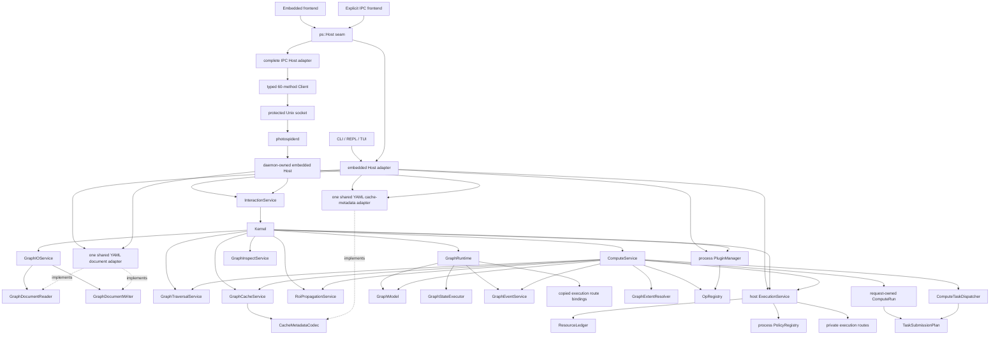

# Kernel Architecture Overview

This document summarizes the architecture present in the current source tree.
The documentation roles and recommended reading order are defined in
`README.md` under the information architecture fixed by
[ADR 0006](../adr/0006-kernel-documentation-separates-facts-decisions-targets-and-status.md);
domain terms are defined in `Terminology.md`.

## Architecture Summary

Photospider is built around a graph runtime with a service split, operation
registry, cache layer, process policy registry, private execution routes, and a
frontend-facing Host seam. All planned work crosses one fixed Host-composed
`ExecutionService`: a policy ranks authority-free candidates, the Host
performs reserved start, and one private route executes the committed work. Each Graph has one bounded serial
compute-request lane and one explicit visible-state `GraphStateExecutor`, each
with one worker and at most 64 waiting callbacks plus one active callback.
Compute captures request-owned Graph/proxy snapshots through graph-state, runs
planning and operations outside it through the selected execution route, and
re-enters it only for exact-revision validation and no-throw publication.

On macOS/Linux the same public Host seam also has a complete installed IPC
adapter. `create_ipc_host(socket_path)` implements all 58 current
non-destructor virtuals through the exact typed 60-method version 2 protocol;
`photospiderd` owns a separate embedded Host and admits every backend operation
through it. This remote path adds polling jobs, bounded registries, and
protected output artifacts without exposing backend ownership. `graph_cli`
continues to construct the embedded adapter and does not auto-connect to the
daemon.

`Kernel` is the internal multi-graph composition facade. `ComputeService` is
the internal compute facade, while narrower collaborators own planning,
pruning, dispatch, propagation, cache decisions, execution, and metrics. Their
current responsibilities are defined in `Compute-Boundaries.md`.

## Build Modules

The root `CMakeLists.txt` builds these internal modules:

| Target | Role |
| --- | --- |
| `photospider_core_internal` | Build-only dependency-neutral core values and neutral parameter formatting plus the build-selected image-processing and image-artifact implementations. `PHOTOSPIDER_ENABLE_OPENCV=ON` selects OpenCV processing/codec adapters; `OFF` selects the standard-library processing implementation and an unavailable codec without discovering OpenCV. |
| `photospider_graph_internal` | Build-only dependency-neutral core operation source, `GraphModel`, registry behavior, graph IO, traversal, cache, propagation, and inspection services. |
| `photospider_yaml_adapter_internal` | Build-only YAML adapter present only with `PHOTOSPIDER_ENABLE_YAML=ON`. It owns shared parameter-value translation, graph-document parsing/emission, cache-metadata parsing/emission, and their direct filesystem behavior; format-neutral GraphIO, Kernel, runtime, and cache contracts do not declare parser values. |
| `photospider_opencv_operation_provider_internal` | Build-only, optional repository OpenCV CPU operation provider. It owns operation algorithms, OpenCV process initialization, and OpenCV exception translation, and exists only with `PHOTOSPIDER_BUILD_OPENCV_OPERATION_PROVIDER=ON`. |
| `photospider_plugin_host_internal` | Build-only host-side operation plugin manager, configured-provider composition, v2 loader, value adapter, and DSO lifetime ownership. |
| `photospider_policy_internal` | Build-only process policy registry, pure-C ABI-v1 DSO loader, immutable bindings, sticky faults, and DSO leases. |
| `photospider_execution_internal` | Build-only private physical-resource accounting and execution-domain support. |
| `photospider_compute_internal` | Build-only compute, dirty-region, runtime, interaction, event, fixed worker service, reserved-start, and private route implementation; it depends one-way on policy and execution internals. |
| `photospider_host_internal` | Build-only Kernel/Interaction facades and embedded Host composition root. It selects real YAML persistence adapters or explicit unavailable adapters according to the producer capability. |
| `photospider_kernel` | Buildable aggregate target that compiles the real selected core, graph, operation-plugin, policy, execution, compute, Host, and optional provider/adapter modules; it is not an install artifact or a placeholder library. |
| `photospider_operation_runtime` | Installable static implementation of public image-buffer factories with no OpenCV, yaml-cpp, Threads, graph, registry, or embedded-product dependency. |
| `photospider_operation_sdk` | Installable interface target for operation v2 headers; it transitively links `operation_runtime`. |
| `photospider_operation_opencv` | Installable opt-in OpenCV adapter using only the OpenCV `core` component; it exists only with `PHOTOSPIDER_ENABLE_OPENCV=ON`. |
| `photospider_policy_sdk` | Installable dependency-neutral interface target carrying the self-contained pure-C policy ABI header plus C11/C++17 requirements. |
| `photospider` | Static installable backend product, archived as `libphotospider`, linked by enabled CLI and embedded Host frontends. It exports `Photospider::photospider` and remains buildable with OpenCV and YAML disabled; operation plugins register through `ps::plugin::OperationPluginRegistrar` and `register_photospider_ops_v2` instead of linking the product for registry state. |
| `photospider_ipc_client` | Installed static typed Unix IPC client plus the complete IPC Host adapter. It exports `Photospider::photospider_ipc_client`, implements all 60 direct Client methods and all 58 current Host virtuals, and does not link the backend or expose JSON/POSIX implementation types. |
| `photospider_ipc_server_internal` | Non-installed bounded Unix listener, typed router, and private session/job/snapshot/output registries. It serializes all backend access through one daemon-owned Host. |
| `photospiderd` | Installed foreground macOS/Linux daemon that owns one embedded Host, a protected per-user socket and output store, and deterministic joined shutdown. |
| `photospider_cli_common` | Non-installable application helper, present only with `PHOTOSPIDER_BUILD_GRAPH_CLI=ON`, built from `apps/graph_cli/src/` plus `src/lib/benchmark/benchmark_service.cpp` and `src/lib/benchmark/benchmark_yaml_generator.cpp`: REPL commands, TUI editors, autocomplete, CLI config, and CLI benchmark services. |
| `graph_cli` | End-user executable whose process entry point is `apps/graph_cli/main.cpp`; its derived default is `ON` only when both OpenCV and YAML capabilities are enabled. |

The CLI-owned application surface is private to `apps/graph_cli/`, including
its `include/graph_cli/` headers and `resources/help/` text. The complete CLI
target closure additionally includes exactly the two role-owned benchmark
translation units named above. They are linked only into the non-installable
`photospider_cli_common` helper and complete CLI closure, not folded into the
installable `photospider` static product. Backend graph, compute, runtime,
policy, execution, plugin, cache, and Host implementations remain in role-owned
`src/lib/**` library/internal modules rather than being copied into the
application. Repository-owned plugins live under `plugins/{ops,policies}`;
maintained test translation units are classified under `tests/{unit,integration}`.

Output directories:

| Output | Path |
| --- | --- |
| executable | `build/bin` |
| libraries | `build/lib` |
| operation plugins | `build/plugins` |
| policy plugins | `build/policies` |
| tests | `build/tests` |

Package boundary:

- `cmake --install` installs the static `photospider`, operation-runtime,
  operation/policy interface SDKs, the enabled public-header inventory under
  `include/photospider/**`, the base `PhotospiderTargets.cmake`,
  `PhotospiderEmbeddedTargets.cmake`, and `PhotospiderConfig.cmake`. When
  OpenCV is enabled it additionally installs the operation-OpenCV archive,
  header, and `PhotospiderOpenCVTargets.cmake`; otherwise none of that surface
  is installed or advertised. The main
  archive is `libphotospider.a` on Unix-like toolchains and `photospider.lib`
  with MSVC. The config completes dependency and required-component checks
  before importing the base export set. It imports only export sets created by
  the producer and discovers only producer-enabled dependencies. The selected
  explicit components or component-less embedded default still control which
  available sets are imported.
- On macOS/Linux with `PHOTOSPIDER_BUILD_IPC=ON`, installation also exports
  `Photospider::photospider_ipc_client`, installs exactly the three
  `include/photospider/ipc/` headers and `photospiderd`, and keeps the server
  library private. An IPC-only consumer requests `COMPONENTS ipc_client` and
  resolves only `Threads`; component-less discovery preserves the embedded
  default and its backend dependencies.
- `Photospider::photospider` carries `PHOTOSPIDER_STATIC` for consumers and
  keeps the `src/lib/` include root private to repository builds. In the build tree,
  the target's generated public include root contains only `photospider/`
  forwarding headers. CMake tracks additions and removals and the wrappers read
  live source headers without directory symlinks.
- Package components are `embedded`, `ipc_client`, `operation_sdk`,
  `operation_runtime`, `operation_opencv`, and `policy_sdk`. Omitting
  components preserves the embedded default. `policy_sdk` discovers no
  external package; `operation_sdk`/`operation_runtime` discover none;
  `operation_opencv` discovers only OpenCV `core`; and `ipc_client` resolves
  only Threads. If optional `operation_opencv` discovery cannot find OpenCV
  `core`, the package remains found, `Photospider_operation_opencv_FOUND` is
  false, its target is not imported, and dependency-free requested targets
  remain available. Requiring that component instead makes package discovery
  fail.
- Producer capability values are recorded in the package config. An
  OpenCV-disabled install reports `operation_opencv` unavailable without
  discovering OpenCV. An embedded consumer of the OpenCV/YAML-disabled product
  discovers neither package and links/runs the real Host product.
- When enabled, OpenCV (`core`, `imgproc`, `imgcodecs`, `videoio`) and
  `yaml-cpp`, plus always-required `Threads`,
  platform dynamic-loader libraries, and Apple `Metal`/`Foundation` framework
  flags are implementation link dependencies of the static archive. Library
  dependencies appear as `$<LINK_ONLY:...>` entries on the installed target;
  Apple framework flags are propagated from a private Apple-only product link
  block. Public Host/core headers avoid OpenCV and `yaml-cpp` types; Windows
  consumers receive `PHOTOSPIDER_STATIC` so declarations do not use DLL
  import/export attributes.
  `PHOTOSPIDER_ENABLE_OPENCV` selects image processing, image codec, public
  adapter, and the derived provider/plugin defaults.
  `PHOTOSPIDER_ENABLE_YAML` selects graph-document and cache-metadata
  persistence. Invalid explicit target/capability combinations fail at
  configure time.
- FTXUI, `photospider_cli_common`, operation plugins, policy plugins, and
  their implementation-specific dependencies are not exported as dependencies
  of the embedded static package.
- CLI headers under `apps/graph_cli/include/graph_cli/**` are private build
  inputs and are not installed; the public install inventory remains exactly
  `include/photospider/**`.
- Source-tree extension headers are not part of the public inventory and no
  forwarding headers are provided. Operation contracts live only under
  `include/photospider/plugin`, policy contracts only under
  `include/photospider/policy`, shared device labels under
  `include/photospider/core/device.hpp`, and full mutable/private declarations
  under their role-owned `src/lib` homes.

## Runtime Ownership

`create_embedded_host()` is the configured persistence composition root. With
YAML enabled, it constructs one `YamlGraphDocumentAdapter` and one
`YamlCacheMetadataCodec`; with YAML disabled, it constructs explicit
unavailable graph-document and cache-metadata adapters. It converts the
document owner to the format-neutral reader and writer contracts and injects
all three contracts together with the configured real or unavailable image
codec into `Kernel`. Empty and in-memory session lifecycles remain usable in
the disabled profile; explicit representation IO returns `GraphErrc::Io`.
`GraphIOService` retains the document owners, while `GraphCacheService` retains
the image and metadata owners. Kernel and those services have no default
persistence constructors or implicit fallback adapters. The private
explicit-dependency Host root is used by substitution
tests. The IPC Host remains a client-side transport adapter; only the
daemon-owned embedded Host composes backend persistence.

Each embedded Host owns its Kernel, graph runtimes, and async coordination, but
operation plugins are different: every Host and Kernel reaches the same
process-lifetime `PluginManager` and `OpRegistry`. Host destruction never
unloads operation plugins. A load or explicit unload through any Host changes
the process-global operation view seen by all Hosts; callback and returned-value
leases keep plugin code mapped after registry removal until in-flight state is
destroyed.

Each embedded Host owns one fixed-worker `ExecutionService`, an independent
resource ledger whose default CPU dimension is 32, and one Interactive plus one
Throughput policy binding. Every Run reserves a complete
CPU/memory/scratch/ready vector. Graph runtimes retain only copied HP/RT route
ids and nonzero generations; `cpu`, `serial_debug`, and `gpu_pipeline`
remain private process execution routes. Reserved-start transactions exchange
ready grants for execution grants exactly once before entering a route.

The IPC Host owns only client-side connections, interruptible polling workers,
and mapped image lifetimes. Daemon sessions, accepted jobs, snapshots, output
leases, and the backend Host remain daemon-owned. Destroying the adapter wakes
and joins its pollers but does not close sessions, unload plugins, or repeat a
mutation. The exact socket, protocol, status, quota, and artifact lifecycle is
defined in `../codebase-structure/IPC-Protocol-v2.md`.

## Main Components

| Component | Role |
| --- | --- |
| `Kernel` | Multi-graph facade, service owner, runtime bootstrapper, top-level graph/cache/compute API. |
| `ps::Host` | Public frontend interface under `include/photospider/host`; returns copied request/result/snapshot values and hides Kernel, GraphModel, and GraphRuntime. |
| `embedded Host adapter` | In-process Host implementation backed by per-adapter `Kernel` and `InteractionService` state; all adapters share the process operation plugin owner. |
| `IPC Host adapter` | Complete installed Host implementation backed only by typed short-lived Client calls. It composes polling compute, joins async workers, preserves exact status domains, and maps protected image artifacts read-only. |
| `ps::ipc::Client` | Move-only direct client with owned values for the exact sorted 60-method version 2 inventory; it validates correlated result shapes and exposes no raw JSON call. |
| `photospiderd` | Foreground local service that owns one embedded Host and serializes all Host calls while independently serving metadata and job polling. |
| daemon registries | Private bounded ownership for opaque sessions, compute jobs, stable collection snapshots, protected outputs, and delivery leases; none are public backend handles. |
| `GraphRuntime` | Per-graph resource container with model, graph-state lane, exact-64-total compute-request lane, one latest-wins coordinator, fixed-capacity execution trace ring, copied HP/RT route bindings, and platform context. |
| `GraphModel` | Graph state holder with a non-reused strong instance identity, checked authoritative revision, private node/topology storage, cache root, timing data, quiet/skip-save flags, and complete compute snapshot/publication primitives. |
| `InteractionService` | Internal wrapper around `Kernel` used by the embedded Host adapter and backend code; frontends, including the CLI, use the public Host seam. |
| `ComputeService` | Resolves dependencies, checks caches, executes ops, coordinates RT/HP/tiled paths and timing events. |
| `ComputeRequestCoordinator` | Per-live-Graph latest-wins owner for checked generations, exact-key pending coalescing, one persistent ticket per admitted key, active cancellation notification, and exact pending settlement on the existing compute-lane worker. |
| `RunGroup` | Realtime request owner for distinct HP Full and RT Interactive child Runs, their observation leases, shared cancellation source, RT-first gate, and deterministic aggregate outcome. |
| `ComputeRun` | Private request owner for one non-realtime HP domain or one realtime HP/RT child domain. Each Run owns an immutable descriptor with exact Graph identity/revision and supersession identity, monotonic phase, one terminal arbiter, stable cooperative-cancellation reason, and shared-control full-plan/temporary or dirty staging storage. Built-in CPU full, dirty, and preflight work retains stable leases and composite task identity through the fixed multi-Graph service. Public cancellation control and the final lifecycle registry remain future. |
| `GraphTraversalService` | Topology-only traversal orders, ending-node discovery, ancestor checks, upstream dependency queries, and downstream dependent queries backed by `GraphModel` adjacency. |
| `RoiPropagationService` | ROI/spatial propagation boundary for upstream ROI computation and graph-level forward/backward ROI projection. |
| `GraphExtentResolver` | HP-authoritative output extent resolver used by ROI propagation and dirty-region planning. |
| `GraphCacheService` | Memory/disk cache operations and cache synchronization; disk images and neutral metadata cross required injected codec contracts. |
| `GraphInspectService` | Structured cache/spatial metadata inspection and dependency-tree snapshots built from graph topology. |
| `GraphEventService` | Thread-safe, fixed-capacity per-node compute-event ring with sequenced destructive batches and saturating drop accounting. |
| `PluginManager` | Unique process-lifetime operation plugin owner; serializes load/seed/unload/inspection and owns source/restoration/handle state. Load registers and records dynamic plugins, seed initializes or reconciles built-ins, and only explicit global unload removes dynamic plugins. |
| `OpRegistry` | Process-global operation implementation registry with coherent copied callback snapshots, including HP/RT, tiled/monolithic, device metadata, and ROI propagators. |

## Observable Behavior

### Compute Flow

Typical REPL compute flow:

1. A REPL command calls the public `ps::Host` interface.
2. The embedded Host adapter translates public values to internal
   `InteractionService` / `Kernel` requests.
3. `Kernel` resolves the active `GraphRuntime`, normalizes the supersession key,
   allocates a checked graph-wide generation, and publishes one latest pending
   candidate through the runtime coordinator.
4. `Kernel` creates or uses services needed by `ComputeService`.
5. For non-realtime HP, `ComputeService` creates one `ComputeRun`; a realtime
   request creates one `RunGroup` with independent HP `Full` and RT
   `Interactive` child Runs. Each child captures session label, strong Graph
   instance identity, authoritative revision, target, intent, quality, explicit
   QoS, and the immutable supersession key/generation.
6. `ComputeService` resolves topology order with `GraphTraversalService`.
7. `ComputeService` checks memory and disk cache with `GraphCacheService`.
8. Dirty-region paths use `RoiPropagationService` and `GraphExtentResolver`
   for ROI demand and HP-authoritative extents.
9. `ComputeService` selects operation implementations from `OpRegistry`.
10. Full, dirty, and preflight ready work crosses the fixed multi-Graph
    `ExecutionService` after complete ledger admission, Host policy
    selection, and reserved start; the selected private route then executes it. Full
    plans/temporary results and dirty staging remain owned by the matching Run
    until exact terminal publication. Private cancellation is observed at
    planning, queue, callback, dependency, phase, and commit boundaries;
    entered non-preemptible providers drain without authorizing publication.
11. After staged output validation, the private product commit policy validates
    the exact Run/staged/live identity, authoritative revision, and current
    supersession key/generation, then publishes complete state in one
    graph-state transaction before Run success.
12. `GraphEventService` records per-node events and timing data.
13. The embedded Host adapter copies results into public Host value snapshots,
    and the CLI renders those values.

Typical embedded Host compute flow:

1. A local frontend creates `ps::Host` through `create_embedded_host()`.
2. The frontend sends `GraphLoadRequest`, `HostComputeRequest`, or inspection
   requests using public value types from `include/photospider/host` and
   `include/photospider/core`.
3. The embedded Host adapter converts those values into existing
   `InteractionService` / `Kernel` requests.
4. Kernel and service execution follows the same graph-state, compute, cache,
   policy, execution-route, and plugin paths used by the CLI.
5. Results are copied back as `OperationStatus`, `GraphInspectionView`,
   `DirtyRegionInspectionSnapshot`, timing/event snapshots, policy or execution info, or
   other Host value snapshots. Host callers never receive `Kernel`,
   `GraphModel`, `GraphRuntime`, OpenCV rectangles, or YAML nodes.
6. For Host-submitted async compute, the Kernel work item returns an owned exact
   outcome. A joined adapter worker maps that outcome without consulting shared
   `LastError`, fulfills the caller-visible `OperationStatus` promise, and only
   then notifies `close_graph()` that status publication is complete.
7. Embedded close admission first publishes a lifecycle marker that rejects new
   compute and execution-route work plus required graph save, node-YAML replacement, and
   ROI projection work, timing inspection, and all-cache clearing. Calls
   admitted before that marker finish caller-visible result/status translation.
   Kernel then stops compute-request admission, which wakes a producer blocked
   on that full FIFO; only then does Host wait for async submission placeholders
   and status promises. Accepted compute requests drain while graph-state stays
   available for final commit. Kernel next drains `GraphStateExecutor`, marks the runtime stopped, and
   removes it. Process-owned workers and policy bindings outlive the Graph;
   copied route bindings carry no physical owner to stop. Close callers already
   joined to the completed generation still return, and admitted work must
   finish before the runtime is erased.
8. Recoverable backend failures become Host status/result values, while
   resource exhaustion remains exceptional: non-destructor Host methods and
   consumed async futures may propagate `std::bad_alloc` as documented by the
   installable interface.

Typical IPC Host compute flow:

1. An explicit daemon frontend creates `ps::Host` through
   `create_ipc_host(socket_path)`; construction does not contact or start a
   daemon.
2. A compute call opens a short-lived typed Client, submits once, and receives
   `queued` with `cancellable:false`. The sole daemon worker advances the job
   through `running` to immutable `succeeded` or `failed` after exactly one
   embedded Host compute call.
3. The adapter polls immediately and then waits
   10/20/40/80/160/320/500 ms, repeating the 500-ms cap without a synchronous
   total timeout. Each status RPC is attempted once; terminal state, the first
   exact RPC failure, or adapter stop ends polling.
4. Terminal Host/output failure is a normal correlated job value whose nested
   `OperationStatus` preserves exact Graph or Daemon semantics; RPC,
   admission, and lookup failures remain separate. Across the public Host
   boundary the sole status vocabulary distinguishes `none`, `transport`,
   `protocol`, `graph`, and `daemon`, and transport never becomes graph IO.
5. Image mode validates a same-user mode-`0600` artifact under its delivery
   lease, maps its tight rows read-only, and then attempts matching
   job/lease release. The final shared image owner unmaps and closes exactly
   once.
6. Async adapter destruction signals stop, wakes waits, interrupts active
   descriptors, completes unfinished futures as Transport
   `client_stopped` (5), and joins workers without resubmitting or closing
   daemon-owned sessions.

Production bounds include 64 active and 256 retained terminal compute jobs;
64 artifacts, one GiB total retained bytes, and 512 MiB per artifact; 8,192
compute events; and 65,536 execution-trace entries. The full method mapping and
all string/page/snapshot/frame limits live in the maintained protocol document.

### Bounded Event and Trace Observation

The public Host observation boundary never returns an unbounded compute-event
or execution-trace vector. `ComputeEventSnapshot` and
`ExecutionTraceEventSnapshot` each carry a per-session `sequence`.
`ComputeEventBatch` and `ExecutionTracePage` each carry bounded `events`,
`next_sequence`, `has_more`, and `dropped_count` values.

Compute events use an 8,192-entry production ring and destructive Host pages of
1 through 1,024 entries. Execution traces use a 65,536-entry production ring
and non-destructive cursor pages of 1 through 4,096 entries. Valid publication
sequences are `1..UINT64_MAX-1`; `UINT64_MAX` is reserved for terminal
exhaustion. Both rings have injectable smaller capacities and initial sequence
state inside backend construction for deterministic tests, without adding
public Host configuration.

Compute-event names and sources are limited to 1,024 UTF-8 bytes before
retention. Oversized publications are dropped whole, and all overflow,
oversize, and exhaustion accounting saturates instead of wrapping. Invalid
Host limits and trace cursors return `GraphErrc::InvalidParameter` without
mutating retained observations; a missing session remains
`GraphErrc::NotFound` for a valid request.

### Policy and Execution Model

Compute intent and policy class are independent:

| Domain | Values | Meaning |
| --- | --- | --- |
| Compute intent | `GlobalHighPrecision`, `RealTimeUpdate` | Selects the HP or RT product path and its copied route binding. |
| Policy class | `Interactive`, `Throughput` | Selects one process ranking binding before execution. |

The immutable built-in policy types are `interactive` and `throughput`.
A pure-C ABI-v1 policy DSO may add canonical ranking types, but receives only
immutable Host-admissible scalar candidates and owns no resource or execution
capability. The Host retains one binding per class, validates every decision,
records the first sticky fault per generation, and falls back through the
Host-authored frontier.

Private execution routes are exactly:

| Route | Role |
| --- | --- |
| `cpu` | Fixed Host-lifetime worker pool and reusable multi-entry execution. |
| `serial_debug` | Deterministic one-callback-at-a-time private route. |
| `gpu_pipeline` | Private GPU/CPU pipeline and completion adapter. |

The CLI exposes `policy` and `execution` REPL commands. Local configuration
uses `policy_dirs`, `policy_interactive_type`,
`policy_throughput_type`, `execution_hp_type`, `execution_rt_type`, and
`execution_worker_count`. Removed `scheduler` commands and
`scheduler_*` keys are rejected rather than translated.

`GraphStateExecutor` remains the separate visible-state access boundary. The
runtime's bounded compute-request lane serializes same-Graph requests and route
replacement; GraphRuntime stores copied route ids/generations, not physical
workers or policy contexts. The process service owns the ready store, both
policy bindings, class arbitration, resource exchange, private routes, and
completion callbacks.

The public worker request range is zero through eight. Zero resolves to a
bounded automatic value; explicit one through eight remain exact. Once the
process CPU pool is fixed, zero or an equal request preserves it and a
different positive request is rejected transactionally. Every Run pays its
complete CPU, retained-memory, scratch, ready-entry, and ready-byte vector.
Capacity exhaustion is Graph `ComputeError`; invalid policy or route values
are `InvalidParameter`. Policies cannot reserve or start work.

### Operation Registry

Operations are keyed by `type:subtype`. The registry supports:

- legacy monolithic operation registration
- HP monolithic implementations
- HP tiled implementations
- RT tiled implementations
- per-device implementations such as CPU and Metal
- dirty ROI propagators
- forward ROI propagators
- dependency builders

Dependency-neutral core analyzer/math operations and their propagation
contracts are registered in `src/lib/core/ops.cpp`. The build-configured
composition entry point is
`src/lib/providers/configured_operation_providers.cpp`; when enabled, the
optional provider under `src/lib/providers/opencv/` registers the OpenCV image
algorithms and owns their process policy and exception translation. Runtime
plugin examples live in `plugins/ops/`; the Metal operation implementation is
private to `plugins/ops/metal/`. Dynamic operation plugins register through the
exact v2 registrar using `ps::plugin` snapshots; public callbacks receive no
mutable `Node`, `GraphModel`, `OpRegistry`, YAML tree, or private cache owner.

### Cache Model

The cache layer uses one node-local formal cache plus one runtime-owned RT
proxy graph:

- `Node::cached_output_high_precision`: formal reusable HP cache.
- `RealtimeProxyGraph`: transient low-resolution RT preview/update state keyed
  by node id, not formal cache authority.
- HP version/ROI fields on `Node`; RT version/ROI fields on proxy node state.
- disk cache files under the configured cache root

`GraphCacheService` keeps cache commands centralized. HP code should use
`cached_output_high_precision`; RT code should use `RealtimeProxyGraph` only as
interactive state. Dirty RT worker writes are staged through
`RealtimeProxyWriteBuffer` before proxy commit; dirty HP worker writes are
staged through `HighPrecisionDirtyWriteBuffer` before graph commit. Formal
cache save, load, synchronization behavior, subsequent HP compute, and
long-term storage use HP output. The service requires non-null
`ImageArtifactCodec` and `CacheMetadataCodec` owners and never constructs or
declares a YAML value. The configured `YamlCacheMetadataCodec` is responsible
for YAML syntax, filesystem metadata IO, and translating parser/emitter
failures into the existing graph error taxonomy.

### ImageBuffer Contract

`ImageBuffer` is a public kernel contract, not an internal implementation
detail. Operators, executors, plugins, adapters, and cache code may depend on
its documented fields and invariants.

CPU buffers owned by the kernel must provide 64-byte aligned row starts. `step`
is the row stride in bytes and may be larger than the packed row size to
preserve alignment. ARM Mac high-performance paths may need or benefit from
128-byte alignment, but 128-byte alignment is an optimization target rather than
the portable minimum.

### Dirty Region Propagation

ROI propagation is handled through `RoiPropagationService` using
registry-provided propagators, `GraphModel` topology adjacency, and
`GraphExtentResolver`. The active behavior is documented in
[Dirty Region Propagation and Work Selection](Dirty-Region-Propagation.md).

Important current behavior:

- Host, graph, dirty-region, planning, and task geometry is represented by
  `PixelRect` and `PixelSize`, not OpenCV value types
- identity propagation for source/generator/analyzer/math-style nodes
- specific propagation for `resize`, `crop`, `convolve`, and `gaussian_blur`
- forward propagation for downstream dirty-region projection
- tiled compute metadata for operators that can execute in tile space
- current tile defaults are tunable implementation parameters, not permanent ABI

## Boundaries and Rationale

- `Kernel` composes graph-scoped services and exposes no installable API.
- `ComputeService` coordinates private collaborators; its module boundaries are
  implementation details behind `ps::Host`.
- The current `ComputeRun` owns one non-realtime HP domain or one realtime
  HP/RT child domain. A realtime `RunGroup` owns the pair's observation leases,
  shared cancellation source, RT-first gate, and aggregate outcome. Each child
  descriptor retains strong Graph instance identity, authoritative revision,
  and immutable supersession identity; topology generation remains a separate
  planning cache key. Built-in CPU full, dirty, and preflight work
  executes owned callbacks under stable Run leases and routes failure by
  `(RunId, RunLocalTaskId)`; all dirty routes retain owned Run leases through completion. One private request source fans its stable
  first reason into both realtime child Runs, while HP-only child cancellation
  remains local.
- Each live Graph coordinator owns checked graph-wide generations, one latest
  pending mailbox and persistent continuation ticket per exact key, and one
  logical active-runner marker. The existing bounded compute-lane worker runs
  each ticket turn; supersession creates no background runner or extra thread.
  Current generation is required at commit, so a failed newest generation does
  not restore an older commit right.
- `GraphTraversalService` owns topology queries only.
- `RoiPropagationService` and `GraphExtentResolver` own spatial propagation and
  HP-authoritative extent resolution.
- Dependency-tree data is built by the inspection boundary, copied through the
  embedded Host adapter, and rendered by frontend code without exposing backend
  objects.
- Repository-owned CPU OpenCV providers use reentrant `cv::Mat` callbacks with
  OpenCV internal CPU threading fixed at one before publication. Every
  `cv::Exception` raised by a registered algorithm is translated inside the
  provider to a host-owned `GraphError`, or to a fresh `std::bad_alloc` for
  OpenCV resource exhaustion. Admitted execution grants own outer callback
  parallelism, while genuine shared backend state remains synchronized inside
  its provider.
- `PHOTOSPIDER_BUILD_OPENCV_OPERATION_PROVIDER=OFF` omits those built-in image
  operation callbacks while retaining dependency-neutral core operations.
  A v2 operation plugin may then supply the absent key. With the provider
  enabled, the same registration transaction can replace an active key and
  unload restores the built-in predecessor.
- Built-in CPU work from multiple graphs/intents shares one fixed
  `ExecutionService` per embedded Host. Its ledger atomically admits complete
  Run vectors; its policy-aware ready
  store is bounded by entries and bytes. Ready work pays checked work-unit plus
  4-KiB byte-quanta cost. Graph scores are local to the selected service class
  and weight-normalized Run scores remain in each Run's immutable class,
  preserving multi-tenant fairness without cross-class history leakage. Class
  arbitration forces Throughput after at most three consecutive Interactive
  dispatches while both classes are ready. Eight-dispatch aging applies only
  within the class that arbitration selected and cannot replace that decision.
  The protected headroom caps active Throughput root reservations only;
  Interactive work does not debit that class quota, while the ledger remains
  final authority for shared physical capacity. A Throughput charge remains
  until its exact root release after all child grants. Policies own no capacity
  and private routes cannot bypass reserved start. ADR 0003 and ADR 0007 record
  the accepted ownership/lifetime contract.

- [ADR 0001](../adr/0001-graph-state-access-is-not-scheduler-dispatch.md)
  separates graph-state access from scheduler dispatch.
- [ADR 0002](../adr/0002-external-libraries-are-kernel-adapters.md)
  defines the external-library adapter target.
- [ADR 0003](../adr/0003-process-owned-execution-resources.md) defines the
  accepted process execution domain.
- [ADR 0004](../adr/0004-opencv-cpu-operations-are-reentrant-provider-work.md)
  defines current OpenCV CPU provider concurrency.
- [ADR 0005](../adr/0005-graph-document-ingestion-is-a-classified-transaction.md)
  defines the implemented graph-document ingestion transaction.
- [ADR 0006](../adr/0006-kernel-documentation-separates-facts-decisions-targets-and-status.md)
  defines how current facts, decisions, targets, and implementation status
  remain distinct.
- [ADR 0007](../adr/0007-compute-runs-and-process-execution-have-separate-owners.md)
  fixes the complete target Run, completion, execution-service, ledger, and
  lifecycle ownership. Its issue #67 Run-lease foundation, issue #69 fixed
  multi-Graph HP/RT service and child Runs, and issue #70 ledger admission and
  bounded ready store are current. Issue #71's private stateless Interactive
  and Throughput policies, hierarchy, aging, burst bound, and protected
  headroom are also current. Issue #72's strong Graph identity/revision,
  request-owned product staging, exact-revision visible commit, and independent
  RT-first child publication are current. Issue #73's private cooperative Run
  cancellation, deadline observation, exact queue/resource drainage, and
  cancellation/commit arbitration are also current. Issue #74's request-owned
  `RunGroup`, checked latest-wins generations, bounded ticket-backed coalescing,
  and current-generation commit predicate are current. Issue #75's pure-C
  policy ABI, Host-authored frontier, reserved start, private execution routes,
  and protocol-v2 control surface are current. Issue #76's lifecycle
  registry/close/shutdown fence and public cancellation control remain future.

The [kernel evolution roadmap](../roadmap/Kernel-Evolution.md) combines the
target decisions into a long-term direction without changing the meaning of
this current-state document.

## Implementation and Validation Entry Points

- `CMakeLists.txt`
- `include/photospider/host/host.hpp`
- `src/lib/graph/graph_document_reader.hpp`
- `src/lib/graph/graph_document_writer.hpp`
- `src/lib/adapters/yaml/yaml_graph_document_adapter.*`
- `src/lib/adapters/yaml/parameter_value_yaml.*`
- `src/lib/adapters/yaml/yaml_cache_metadata_codec.*`
- `src/lib/core/cache_metadata_codec.hpp`
- `src/lib/core/image_buffer_processing.*`
- `src/lib/core/parameter_value_text.*`
- `src/lib/adapters/opencv/image_buffer_processing_opencv.cpp`
- `src/lib/providers/configured_image_artifact_codec.*`
- `src/lib/providers/configured_persistence_adapters.*`
- `src/lib/graph/graph_io_service.*`
- `src/lib/runtime/kernel.*`
- `src/lib/runtime/graph_runtime.*`
- `src/lib/compute/compute_run.*`
- `src/lib/host/embedded_host.cpp`
- `tests/integration/test_host_adapter.cpp`
- `tests/integration/test_graph_document_injection.cpp`
- `tests/integration/test_kernel_contracts.cpp`
- `tests/integration/test_ipc_daemon.cpp`
- `tests/integration/static_product_consumer_smoke.py`
- `tests/integration/ipc_disabled_install_smoke.py`
- `tests/integration/dependency_disabled_install_smoke.py`
- `tests/unit/test_compute_run.cpp`
- `tests/unit/test_stdlib_image_buffer_processing.cpp`
