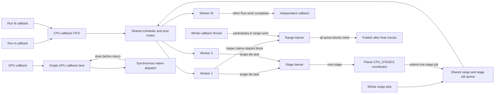

# Parallel execution model

## 1. Core summary (TL;DR)

An `ExecutionContext` owns a fixed CPU worker pool, separate CPU and GPU callback lanes, and one shared waiting-callback bound. Whole CPU callbacks can share range work with idle pool workers, while planar staged callbacks submit single-threaded tiles and join each stage. Cancellation stops future claims and publication, then waits for work already running or submitted to the device.

## 2. Mental model & intuition

Independent Runs compete for the same context worker capacity. A Whole callback's calling thread processes range blocks while idle workers may claim other blocks; a worker occupied by another callback cannot help until it returns. The shared scheduler alternates ordinary callback and range-block opportunities and rotates eligible range jobs after claims.



Ordinary callbacks use the CPU callback FIFO. Whole range jobs and planar `CPU_STAGES` jobs use a separate shared range/stage job list. Both structures share the scheduler mutex and worker pool, so callbacks, range jobs, and staged jobs compete for worker capacity. The scheduler alternates callback and range opportunities; range workers claim disjoint blocks, while the stage coordinator submits tile work and waits at each stage barrier. The Whole callback thread also participates directly in its range barrier. The GPU callback lane has a separate queue but shares the context's aggregate waiting allowance. Range blocks and stage tiles can increase an ordinary callback's wait.

## 3. Formal contracts & APIs

### CPU Whole range service

```c
#include <stdint.h>

typedef int (*ps_cpu_range_callback_v1)(
    void* user, uint64_t begin, uint64_t end, uint32_t slot);

typedef struct ps_cpu_parallel_service_v1 {
  uint32_t struct_size;
  uint32_t abi_version;
  uint32_t maximum_workers;
  void* context;
  int (*run)(void* context, uint64_t count, uint64_t grain,
             uint32_t workers, ps_cpu_range_callback_v1 callback,
             void* user);
} ps_cpu_parallel_service_v1;
```

The service is borrowed by a CPU Whole callback. It partitions `[0, count)` into finite, disjoint intervals no larger than `grain`. `workers == 0` selects the grant maximum; a positive value requests between one and that maximum participants, including the calling thread. The service may run fewer blocks concurrently than the grant. Each active block receives a unique live scratch slot. Inputs and callback user data remain borrowed until the synchronous barrier returns; scratch must not escape the call.

Before a nonempty run starts any block callback, the host reserves the job record against Root Host and Metadata capacity and one Root Entry, then charges `work=count` and `stages=ceil(count/grain)`. These charges use the same Root budget as work already issued by the execution, so prior work reduces the remaining allowance. If reservation or charging fails, the run returns a sticky resource failure and invokes zero block callbacks. A zero-count run creates no job and charges no work or stages; the ordinary argument and cancellation checks still apply.

A one-participant grant or a range that fits in one block executes inline on the caller. Long blocks poll the supplied cancellation token. The service stops future claims and drains active blocks before returning. A block uses immutable inputs and preallocated outputs; row, allocation, publication, preparation, and diagnostics services belong to the callback thread and are unavailable to range blocks. Nested range calls are rejected, and service violations remain sticky.

For count `N` and positive grain `B`, the block count avoids overflow from `N + B - 1`:

$$
N_{blocks}=N/B + (N\bmod B\ne0),\qquad
end=begin+\min(B,N-begin).
$$

Structured CPU Result Whole polls receive this borrowed service as `ResultProgramPhase::cpu_parallel`. It schedules blocks within the active Whole callback; it does not parallelize a Result dependency graph independently. `tests/integration/test_cpu_parallel.cpp` exercises a `UINT64_MAX` range after earlier Root work and verifies resource rejection before any block callback. `tests/unit/test_cpu_range.cpp` checks endpoint arithmetic without a Root budget and therefore does not establish Root admission behavior.

### Structured Result callback waves

The structured coordinator registers requested named Result roots and advances their dependency Actors. Potential CPU contract-1 joint candidate roots remain deferred until their consuming Actor validates its Need and registers the producer inputs, allowing peer C1 inputs to join before candidate start. A validated Need adds eligible computed inputs to the pending frontier. Each Need input has an independent cursor; the coordinator rotates among inputs that can make progress, and an Actor is visited at most once per traversal. This keeps a deep dependency chain from being recursively revisited for every peer input.

When the frontier has queued callback work, the coordinator submits up to `maximum_parallelism` tasks from its Root-owned pending list. It waits for submitted callbacks to retire before reading their phase results and applying them serially, then advances the next dependency frontier. The limit applies to submitted callback tasks, not a second scheduler for the Result graph. CPU staged-tile coordination and GPU callbacks keep their existing inline/controller and single-lane paths.

Submission-local transfer, tile and native observations remain with each task until retirement, when the coordinator merges them. Joint workers mark callback entry and execute the shared callback; the coordinator accounts for the group once at retirement. Result poll timing spans phase creation through coordinator retirement, including queue and wave waiting, so it is not a compute-only duration. Shutdown and synchronous Run completion drain submitted work before releasing borrowed callback state.

### Planar staged tile service

```c
#include <stdint.h>

#define PS_CPU_TILES_ABI_VERSION_1 1U

typedef struct ps_cpu_tile_v1 {
  uint32_t struct_size, slot;
  uint64_t index, begin[3], end[3];
} ps_cpu_tile_v1;

typedef int (*ps_cpu_tile_callback_v1)(void* user,
                                       const ps_cpu_tile_v1* tile);

typedef struct ps_cpu_tile_stage_v1 {
  uint32_t struct_size;
  uint64_t extent[3], tile[3];
  uint32_t workers;
} ps_cpu_tile_stage_v1;

typedef struct ps_cpu_tiles_service_v1 {
  uint32_t struct_size, abi_version, maximum_workers;
  void* context;
  int (*run)(void*, const ps_cpu_tile_stage_v1*,
             ps_cpu_tile_callback_v1, void*);
} ps_cpu_tiles_service_v1;
```

The coordinator submits one three-dimensional work-item grid and waits for every tile callback before starting the next stage. Each callback receives one half-open tile box and runs as one indivisible task on a shared CPU worker. The coordinator performs allocation, row access, and stage transitions. `workers == 0` uses the Run grant maximum; a positive value caps parallel participation without changing tile geometry.

For a tensor shaped `(height, width, channel)`, an operation may keep the channel extent in one tile so each pixel tile contains all RGBA samples. These work-item coordinates describe computation, not physical planar storage pages. A zero extent creates zero tile callbacks. The host checks positive tile sizes, ceil-divisions, and the three-axis product before queueing work. A stage holds its waiting admission and managed Queue lease until callbacks retire and its job leaves the queue.

### Cancellation, resources, and publication

The context's CPU worker count is fixed at construction; zero `cpu_workers` resolves to a bounded hardware count. CPU execution is always available, while native GPU execution is optional. `maximum_queued_tasks` bounds waiting callbacks across CPU and GPU lanes. An ordinary callback releases its waiting slot when a worker starts it; a planar `CPU_STAGES` job retains its admission and managed Queue lease until all submitted tiles retire and the job is unlinked, as described above. Active jobs retain their input owners, callback state, scratch, and output storage until they retire.

Cancellation closes future range or tile claims and prevents later device submissions. A synchronous range call joins active blocks, and the GPU service drains submitted work before returning. Final cancellation and currentness checks precede output publication. Sticky host-service failures take precedence over a callback success code. The host cannot preempt arbitrary plugin code or a submitted native dispatch.

CPU helpers save and restore the floating-point environment and execute with nearest-even rounding and gradual underflow. Each operation defines its reduction order and the block geometries compatible with that order.

`ExecutionContextConfig::collect_scheduler_timing` defaults to false. When enabled, `scheduler_statistics()` returns separately synchronized CPU and GPU lane snapshots. Accepted counts successful FIFO insertions; started counts worker removals. `submission_ns` measures entry through FIFO insertion, including mutex acquisition and queue storage. `queue_wait_ns` measures successful insertion through worker removal. Timing excludes callback runtime and device execution. FIFO statistics exclude range and tile claims, although those jobs can keep a worker busy and increase measured wait. Cumulative counters include all Runs sharing the context. Count and duration deltas can describe a selected interval only when snapshots are unsaturated; `maximum_queue_wait_ns` and `maximum_queued_callbacks` are context-lifetime maxima and cannot be differenced to obtain interval maxima. Lane snapshots can represent different instants.

## 4. Non-goals & explicit boundaries

- Whole range callbacks and planar CPU staged callbacks use mutually exclusive services for one invocation.
- Tile callbacks do not receive the coordinator's row, allocation, publication, diagnostics, or preparation services.
- The scheduler does not promise work stealing, preemption, or a worker grant equal to observed concurrent execution.
- GPU callbacks submit synchronously through one callback lane per context; a submitted dispatch runs to completion before its owners retire.
- Planar GPU callbacks use host row windows at graph boundaries. Device-resident planar pages shared across graph nodes are outside this interface.
- Managed accounting excludes thread stacks, driver-private allocations, and unmodeled container storage.

## 5. Consequences

When every CPU worker is busy, a ready callback waits in its lane queue. If the shared waiting allowance is full, submission returns `ResourceExhausted` and the executor does not retry automatically. Callers that retry must first release capacity or reduce concurrent work.

Cancellation latency is bounded by the remaining time in active blocks and submitted dispatches. Long CPU blocks must poll cancellation; slow callbacks delay result cleanup and context shutdown. A single GPU callback lane serializes callbacks for that context, and planar boundary copies add transfer cost.

The waiting-queue limit and managed memory/work limits govern separate resources. Runs retain inputs, intermediates, callback state, and result storage through their documented owner lifetimes. Operation ABI compatibility is specified in [Plugin ABI](Plugin-ABI.md).
