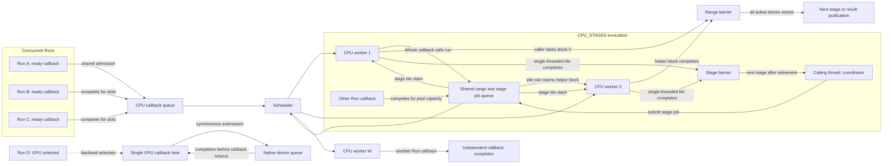

# Parallel execution model

## Executive summary

The kernel runs independent work on a fixed thread pool and keeps each request's storage alive through completion. Whole callbacks can share range work with helper workers, while staged callbacks submit single-threaded tiles and join at each stage boundary. Cancellation stops new claims, drains active work, and gates result publication.

## Mental model and intuition

Each execution context has a fixed pool of CPU threads. A Whole callback splits its range into blocks and processes blocks on its calling thread while idle pool threads claim more blocks from the range queue. Other Runs use the same pool, so a busy thread may finish an unrelated callback before becoming a helper. The caller continues claiming blocks and can complete the entire range itself; it waits at the barrier only after all blocks have been claimed or a failure has stopped further claims.



The scheduler uses centralized queue claiming under the pool mutex. It alternates opportunities between ordinary callbacks and eligible range blocks, then rotates a range job after a claim so concurrent Whole calls share helper opportunities. The calling thread and its helpers claim successive disjoint intervals from the job cursor. A CPU_STAGES invocation uses its calling thread as a coordinator: it submits one stage at a time to the same pool, joins every tile callback, then advances to the next stage. The coordinator performs setup and row access while kernel workers execute single-threaded tile callbacks; even a one-worker grant keeps kernel work on that worker. Other Runs compete for the same worker capacity. A context with GPU support also owns one GPU callback lane. A GPU callback submits native work synchronously and keeps its buffers and service state alive through device completion.

## Formal contracts and invariants

### Work readiness, observations, and regions

A planned stage becomes ready when its declared prerequisites have completed successfully. The executor submits ready callbacks to the selected backend lane; a dependency edge orders stages within a Run, while independent Runs can occupy the pool at the same time.

An observation is the unit associated with dependency evidence and invalidation. The kernel records Data, Control, Validation, and Descriptor roles separately. A regional request authorizes declared input support for its requested observations; a Whole request uses the operation's complete dependency group. An empty request validates static metadata and returns empty coverage.

For an input edit, the kernel intersects the edit with each retained dependency relation, maps affected input support back to the observations that consumed it, and propagates those output regions to downstream records. For example, an edit to one source rectangle marks only cached output rectangles whose recorded dependency support intersects that edit; an unbounded or whole-input relation marks the complete output. This is the concrete transpose of the retained input-to-output relation.

The planner forms tile bounds only along axes declared splittable by the operation. If a tensor is laid out as `(height, width, channel)` and its contract declares the channel axis atomic, a tile may cover a rectangle of pixels while retaining all four RGBA values for every pixel. The host authorizes the input regions for that tile and publishes only the output coverage the callback produced. Logical dependency regions remain separate from storage layout and tile bounds.

### CPU callback and range service

An execution context owns a fixed CPU worker pool. A CPU Whole callback requests a synchronous grant; the calling thread participates directly and idle pool workers may claim helper blocks. The Whole CPU range service is exposed to CPU Whole callbacks, while each CPU tile callback runs as one callback task.

| Symbol | Meaning | C API field or argument |
| --- | --- | --- |
| **W** | CPU pool capacity and service maximum | `maximum_workers` |
| **G** | Granted participants, including the caller; `1 <= G <= W` | `workers` (`0` selects **W**) |
| **B** | Maximum elements in one range block; `B > 0` | `grain` |
| **N** | Number of elements in the range | `count` |

```cpp
#include <stdint.h>

typedef int (*ps_cpu_range_callback_v1)(
    void* user, uint64_t begin, uint64_t end, uint32_t slot);

typedef struct ps_cpu_parallel_service_v1 {
  uint32_t struct_size;
  uint32_t abi_version;
  uint32_t maximum_workers;
  void* context;
  int (*run)(void* context, uint64_t count, uint64_t grain,
             uint32_t workers, ps_cpu_range_callback_v1 callback, void* user);
} ps_cpu_parallel_service_v1;
```

The service advances a shared job cursor through `[0, N)` and offers successive finite claims of at most `B` elements. For shared claims, the calling thread and its helpers advance that cursor under the pool mutex. A one-participant grant or a range that fits in one block runs inline on the caller. A zero worker request selects the service maximum `W`; a positive request selects `G` from one through `W`. For an uncancelled invocation, `N = 0` completes successfully with zero blocks. The host may run fewer blocks concurrently than `G`.

Each active block receives a unique live scratch slot and a disjoint index interval. The operation maps those indices to its input data and output storage, with shared inputs held immutable and writes assigned to separate output locations. The caller keeps user data and scratch alive until the synchronous barrier returns. Long blocks poll invocation cancellation themselves; the service checks cancellation between blocks and drains blocks that already started.

The range queue and ordinary callback queue share the pool mutex and worker threads. The caller keeps processing its own blocks whether helpers are available or busy. The scheduler alternates ordinary callback and range-block opportunities, and rotates eligible range jobs to share helper claims. Range blocks operate on their supplied inputs and preallocated buffers.

### CPU staged tile service

The planar `CPU_STAGES` model gives an operation a coordinator-thread `ps_cpu_tiles_service_v1`. The coordinator submits a stage containing a three-dimensional work-item grid and joins the stage before preparing the next one. Each callback receives one half-open tile box and runs as a single indivisible task on a shared kernel worker. The coordinator handles allocation, buffer construction, row access and stage transitions; shared workers execute tile callbacks. CPU staged execution remains separate from output `RegionRule`: an operation may require the complete image for correct results while dividing its internal calculation into bounded work items.

For extent `E_i` and positive tile size `T_i`, the grid has `C_i` coordinates per axis. The checked product determines callback count. Flattened indices advance with axis 0 fastest; an RGBA-like trailing channel axis can use one tile spanning the entire channel extent while height and width are divided into rectangles. These work-item coordinates describe computation, not tensor axes or physical planar storage tiles.

For a nonempty grid, the host decomposes each flattened index in axis order, dividing the remaining quotient after each axis:

$$
C_i=\left\lceil\frac{E_i}{T_i}\right\rceil,\quad
N_{tiles}=C_0C_1C_2,\quad
q_0=index\bmod C_0,\ r_1=\left\lfloor\frac{index}{C_0}\right\rfloor,\quad
q_1=r_1\bmod C_1,\ q_2=\left\lfloor\frac{r_1}{C_1}\right\rfloor,\quad
begin_i=q_iT_i,\quad
end_i=begin_i+\min(T_i,E_i-begin_i).
$$

The implementation computes each ceil division as `extent / tile + (extent % tile != 0)` after checking `tile > 0`, and checks the three-axis product before queue publication. A zero extent produces zero callbacks. The `end` expression subtracts before adding, so the final partial tile stays within its extent. Each stage uses pre-reserved buffers; callbacks write disjoint assigned regions, while allocation and row services remain with the coordinator.

The caller and tile service share the context's waiting admission and managed queue leases. One admission and its queue lease remain held until the stage has drained and its job has been unlinked. `maximum_parallelism` caps the stage grant while tile geometry stays fixed. Cancellation closes future claims and waits for active callbacks. A Whole callback may use the range service with caller participation; a staged invocation uses the tile service, and the two services are mutually exclusive for one invocation.

### Cancellation, publication, and numerical environment

Cancellation prevents new range claims and later device submissions. A range call joins active blocks before returning. A GPU service drains submitted work before returning. The executor performs its final cancellation and currentness checks before publishing output. Requested output is published only after callback success and final checks; sticky host-service failures take precedence over a callback's success code.

CPU range helpers save and restore their floating-point environment and execute with nearest-even rounding and gradual underflow. The scheduler preserves the numerical properties declared by the selected operation profile. Each operation contract defines its reduction order and the block geometries that preserve that order.

### Resource accounting and ownership

The execution context applies shared admission limits to concurrent Runs. A callback admission consumes a waiting-queue slot until a worker begins it. Input owners, callback state, scratch, dependency metadata, and output storage remain alive for their documented owner lifetime. The result retains the leases needed by its storage after the Run releases temporary owners.

`OperationPreparation::additional_workspace_bytes` contributes a checked static increment to the registered workspace bound. Preparation derives that increment from metadata and parameter sizes; the resolved bound participates in operation identity. Runtime construction and computation use the callback's allocator and work-accounting service.

`BufferAllocator::limited()` caps aggregate live backing capacity, while `limited_requested()` caps aggregate live requested bytes. Allocators can nest both scopes: the request quota remains separate from the root capacity charge, and native allocations charge their actual backing capacity to the root. `CpuStorage` retains both leases and allocation provenance through publication; its native owner retires before either lease is released when the last storage owner goes away. Failure observers are carried through allocator scopes and native conversion.

For generic Value `ExecutionRun` GPU steps, the callback allocator caps live requests at the step's planned logical byte bound, and the root admits each native allocation using its queried actual capacity without waiting. The Run attempts pending disk-write and memory-cache reclamation before admission; the root reservation remains the atomic authority. Ordinary CPU Run steps keep their complete reservation. `planned_peak_bytes` reports the observed reservation peak, including both complete CPU and incremental native reservations.

GPU execution uses a distinct callback lane and native buffer tokens. Dispatch submission and completion are synchronous at the plugin boundary. A token keeps its view owner alive through dispatch, and releasing a token retires that view after its final dispatch. Planar row windows are host storage; the callback copies data at explicit device boundaries and may keep intermediate buffers on the device during that callback.

### Bounds and performance evidence

For the `N` elements and block grain `B` defined above, checked integer arithmetic gives the claim count. The `min` in the end expression keeps each addition within `N`:

$$
N_{blocks}=\left\lceil\frac{N}{B}\right\rceil,\qquad
end=begin+\min(B,N-begin),\quad B>0,\ begin\le N.
$$

```cpp
#include <algorithm>
#include <cstdint>

std::uint64_t block_count(std::uint64_t count, std::uint64_t grain) {
  // Precondition: grain > 0.
  return count / grain + (count % grain != 0);
}

std::uint64_t block_end(std::uint64_t begin, std::uint64_t count,
                        std::uint64_t grain) {
  // Preconditions: grain > 0 and begin <= count.
  return begin + std::min(grain, count - begin);
}
```

The code uses `count` for `N` and `grain` for `B`; the worker grant `G` controls concurrency, while `N` and `B` determine the block count.

Shape products, byte widths, page rounding, and metadata capacity use checked arithmetic before allocation or publication. Each range call has one invocation-local job record with a bit mask tracking occupied scratch slots; concurrent jobs link that record into the range queue. The record stays alive through the synchronous join. The waiting-callback limit and managed-memory limits govern separate admission decisions.

Performance measurements separate graph construction, validation, allocation, integer metadata work, queue wait, callback work, device submission, completion, and publication. Representative workloads include small-task saturation, concurrent Runs, changing bindings, and cold and warm execution. Report latency distributions and QPS with worker count, queue limits, managed bytes, RSS, context switches, and available hardware counters; these quantities describe different resource costs.

`ExecutionContextConfig::collect_scheduler_timing` optionally records callback FIFO observations; it defaults to `false`. When enabled, `ExecutionContext::scheduler_statistics()` returns per-lane `CallbackQueueStatistics` for CPU and GPU under their respective pool mutexes. Each snapshot reports accepted and started callbacks, cumulative `submission_ns` and `queue_wait_ns`, and the context-lifetime `maximum_queue_wait_ns` and `maximum_queued_callbacks`. The saturated flag is set if an additive counter or duration sum would overflow `UINT64_MAX`.

`accepted_callbacks` counts successful FIFO insertions, and `started_callbacks` counts worker removals; rejected submissions contribute neither. `submission_ns` runs from `ThreadPool::submit` entry to the timestamp taken immediately after FIFO insertion, including mutex acquisition and queue storage. It ends before queue notification and mutex unlock. `queue_wait_ns` starts at that timestamp and ends at worker removal, so it includes notification, mutex release and the worker's subsequent wait to acquire the pool mutex. When enabled, the scheduler reads a submit-entry timestamp for every submission attempt, a publication timestamp after successful insertion, and a worker-removal timestamp when the callback starts. A successful callback uses three reads; a rejected submission still uses the entry read but contributes no counters. The disabled path reads no timing clock. FIFO counters exclude CPU range-block claims and staged tile claims. A worker busy with those jobs can still increase a queued callback's measured wait. Queue waits do not measure image transfer time, callback runtime or device execution.

Submission and worker-removal counters update under the existing pool mutex; callback completion does not acquire an additional timing lock.

Each lane snapshot is synchronized separately, so CPU and GPU values can describe different instants. Multiple Runs sharing one context contribute to the same cumulative counters. Count and sum deltas can describe a caller-selected interval when both snapshots are unsaturated; lifetime maxima cannot be differenced to obtain an interval maximum. Their values include warmup and earlier context activity.

## Non-goals and explicit boundaries

- This document specifies shared kernel scheduling and ownership. Operation-specific algorithms, parameters, and numerical profiles belong in their operation specifications.
- The CPU staged interface is a planar C extension. Other callback families retain their declared execution models.
- Range blocks do not use callback-thread-only allocation, row mutation, publication, diagnostics, or preparation services.
- A missing input region grants no payload access, and empty coverage grants no sample reads.
- The concurrent tile window covers the documented deterministic CPU streaming path. Frozen caches, checkpoints, request and fragment flights, joint operations, structured outputs, preserved views, and GPU stages use their own paths; collected execution currently processes bounded CPU tiles serially.
- GPU cancellation is cooperative at dispatch boundaries. A submitted device dispatch runs to completion before its owners can retire; this interface does not provide device preemption.
- Planar GPU callbacks use host row windows at graph boundaries. Cross-node device-resident planar output pages require a different interface.
- Thread stacks, driver-private memory, and unmodeled container storage sit outside declared managed capacity.

## Consequences

If all **W** CPU workers are occupied, another ready callback waits in the shared queue. Once the context's waiting-callback allowance is full, a new submission fails with `ResourceExhausted`; the executor makes no retry attempt. A caller that chooses to retry must release capacity or reduce concurrent work first. CPU and GPU callbacks share the context's waiting allowance, even though they use separate callback lanes.

Cancellation stops future claims, then waits for every active CPU block and submitted GPU dispatch to finish. Long block callbacks must poll their cancellation token because the host cannot interrupt arbitrary plugin code. A slow callback therefore delays cancellation, result cleanup, and pool shutdown by its remaining run time.

Long-lived Runs keep their inputs, scratch allocations, intermediate buffers, and queued callback state alive until their owners retire. A run can fail admission when a configured waiting, workspace, or managed-memory limit is exhausted. Managed capacity excludes thread stacks, driver-private allocations, and some container overhead, so process RSS can exceed the configured managed limit.

Device execution adds host-to-device and device-to-host copies at planar graph boundaries. Keeping intermediates on device can reduce repeated transfers inside one callback, while a one-callback GPU lane serializes GPU callbacks within that context.

The public CPU range, operation, planar, and GPU tables are versioned interfaces. An ABI mismatch is rejected during plugin validation; consumers must rebuild against the matching SDK to use the new table layout. The version and rejection behavior are specified in [Plugin ABI](Plugin-ABI.md).
