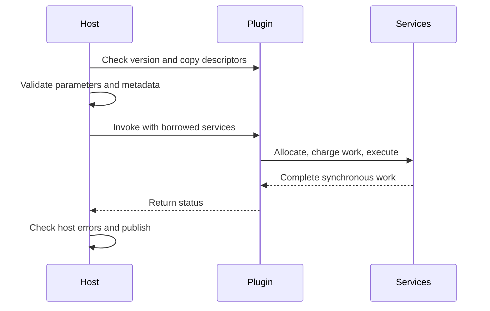

# Operation and Data-Definition ABI

## Executive summary

Applications need a defined way to load extensions and exchange data with them. The kernel validates versioned records and lends execution services for each call. Operation ABI v11 supports versioned native GPU modules while preserving explicit ownership and synchronous completion.

## Mental model and intuition

## Formal contracts and invariants

Photospider installs two narrow same-trust extension headers:

- operation ABI v11: copied semantic traits, closed typed parameter schema, ordered scalar/image port constraints, plan-derived input demands, one synchronous Value callback, and a versioned native GPU service;
- data-provider ABI v1: copied schema key, element type, and maximum rank.

The installed C++ convenience wrapper `operation_plugin.hpp` is a direct, self-contained header: it includes its own `<cstdint>` dependency and the operation C ABI before exposing `element_type_value`. It does not depend on a consumer including another Photospider header first. The exported `Photospider::operation_sdk` interface target propagates `cxx_std_17`, so a C++ consumer receives the wrapper's actual language requirement from the package instead of having to restate it privately.

The maintained consumer proves that propagation with a compiler-appropriate dialect assertion: `_MSVC_LANG` when an MSVC-compatible frontend defines it, and `__cplusplus` otherwise. It adds no private standard flag and does not require `/Zc:__cplusplus`.

The provider contract remains pure C. `Photospider::data_provider_sdk` propagates include directories but no C++ compile feature, so a C11 translation unit may consume it without acquiring a C++ language requirement. The package does not publish a separate `data_definition_sdk` alias.

### Operation records

An operation descriptor has a length-framed key, input count, flags, estimated bytes, output element type, closed scalar/preserve/match/fixed shape and Whole/Elementwise/Halo Region rules, halo radius, cacheability, a bounded parameter-schema pointer/count, input-schema pointer/count, output port constraint, callback, and opaque plugin state. Parameter records publish unique keys, exact Int64/Float64/Bool/String types, and required presence. The compiler rejects unknown, missing, wrong-type, and conflicting parameters before semantic IR; callbacks receive only validated canonical values and there is no hidden default fallback.

The callback receives regional strided input views with separate storage origin, byte offset, signed strides, valid coverage and planned demand. Pointers expire at callback return. The output sink declares exact output descriptor/Region and packed byte size; allocate_output supplies host-owned bytes, and allocate_scratch supplies host-owned callback-local scratch.

Publishing the allocated output freezes it without copying. Publishing stack/caller data copies it through the same host allocator. Callbacks must allocate computation buffers through the host, and must not free or retain borrowed pointers.

The first publish attempt claims the sink even on failure. A second attempt sets a sticky violation and cannot replace the first result. It produces OperationFailed after the callback, subject to host cancellation priority.

Null context has no side effects. Resource allocation failures remain typed. Generic input views may include backing padding; callbacks address only valid coverage via the supplied origin and strides.

The synchronous callback retains its `int` signature but returns one closed version-seven result: success, ordinary failure, cancellation, or backend unavailable. Backend unavailable is distinct from ordinary failure and may request CPU fallback only from a GPU attempt whose copied traits allow it. Unknown nonzero integers are ordinary `OperationFailed` results.

A callback reporting backend unavailable must not invoke the output sink. If it does, an accepted output is a terminal `OperationFailed` contract violation and a rejected generic output retains the sink's exact typed failure. A malformed image output is OperationFailed; explicit callback cancellation and resource exhaustion retain their categories.

Neither path exposes `BackendUnavailable` or triggers CPU fallback, while host cancellation remains the highest-priority result. After that cancellation check, a duplicate sink violation outranks success, backend unavailability, ordinary failure, callback-reported cancellation, and unknown results. It therefore never publishes the first Value or requests CPU fallback.

Every operation declares at least one available backend. GPU-only registrations are permitted; CPU planning and direct CPU invocation reject them before callback entry. CPU fallback requires both CPU and GPU capabilities.

An unavailable device cannot silently invoke a GPU-only callback on the CPU. These capability rules also apply to the corresponding C ABI flags; specialized CPU/planar protocols retain their narrower backend constraints.

Before any C++ or DSO callback entry, `OperationRegistry::invoke` validates the operation/input/demand counts, checks each input `Value::valid()` before reading its descriptor, validates every demand and parameter, observes host cancellation, rejects any backend value other than CPU or GPU, and then checks backend capability. A known but unsupported backend remains `BackendUnavailable`; an unknown numeric backend is `InvalidArgument` and is never translated to GPU by the DSO adapter.

After those higher-priority checks, the registry uses `resolve_operation_traits` and `infer_operation_output` to compute dtype, shape and canonical output facets through the same implementation as semantic lowering. Preserve/Match compare shapes independently of dtype; input dtype restrictions are explicit port constraints. A mismatch is rejected before callbacks.

Callback output validation reuses the precomputed descriptor; a successful callback that returns a default-invalid generic `Value` remains a safe `TypeMismatch`; invalid image output is `OperationFailed`. Direct invocation and physical planning share the checked input-demand rule. The registry rejects insufficient Value/halo coverage, partial-channel image output and mismatched mask shape before callback entry.

Computed mask numeric failures are OperationFailed; bound mask numeric failures remain InvalidArgument.

A C++ `OperationTraits::Fixed` record describes only the logical output descriptor. Registration validates a nonzero rank-1..8 shape, closed element type/rules, and the ordinary trait combinations without evaluating a dense element or byte product. The callback may return any Value layout that passes normal publication validation, including an eight-byte zero-stride broadcast over a huge logical shape.

`estimated_bytes` is an independent modeled admission estimate. A synchronous C DSO Fixed descriptor is stricter because its sink carries no output strides: loading separately requires representable contiguous signed strides and uint64 byte count. For total dense bytes `B`, the loader also requires `B > 0`, zero-based last byte `B - 1 <= INT64_MAX`, and `B <= SIZE_MAX`.

Thus a UInt8 `{INT64_MAX + 1}` descriptor and `{2, 2^62}` are representable on a 64-bit host, while adding one element to either boundary is rejected. The copied `requires_dense_output` trait also checks the complete output using the resolved dtype before semantic IR publication, including Fixed outputs whose dtype comes from an input or static parameter. C++ Fixed broadcast semantics remain available when that requirement is false.

Staged C dependency programs also leave it false: their host output service validates each actual fragment. A logical Fixed domain need not have a representable full dense byte product when the query only materializes valid bounded fragments. See [Dependency Data](Dependency-Data.md#c-staged-programs) for the staged C contract.

### Validation

Before any Windows, Linux, or Darwin native-loader call, operation and provider loading validates the exact `std::string` path as nonempty, at most 4096 bytes, and free of embedded NUL. A malformed path is `InvalidArgument`; a legal exact path that the platform cannot load remains `NotFound`. No truncated prefix is opened, no registry key/schema is published, and no native-owner lifecycle is started for a rejected path.

Loading validates exact ABI version/structure sizes, pointer and array alignment, pointer/count pairs, bounded key/count/rank/parameter values, strict UTF-8 operation/parameter-schema/provider-schema keys, duplicate parameter declarations, closed enum/flag/type combinations, required callbacks, logical C++ fixed descriptors, dense C DSO fixed stride/byte representability including signed last-byte and host allocation-size bounds, output element/shape/byte count, facet arrays/key/version/payload, arithmetic overflow, and exactly-once destroy ownership.

Key validation rejects invalid continuation bytes, truncation, overlong encodings, UTF-16 surrogates, values above U+10FFFF, embedded nulls, and ASCII controls before publication; it does not normalize Unicode. Ordinary facet payload and Value bytes remain opaque binary data. This ABI version rejects trailing structure bytes and publishes no old operation compatibility entry point.

Malformed registration publishes nothing. A built-in/embedding definition and every DSO definition are fully constructed before publication, then retained by a private immutable owning handle. The registry map, DSO transaction staging, and invocation snapshot copy only that handle: no embedding callable copy or execution occurs while the registry mutex is held.

Multi-record publication uses copy-then-swap over the handle map, so allocation failure cannot expose a prefix; the replaced map retires after unlock. An invocation's handle keeps its callback and any captured DSO lease alive until callback completion. An embedding C++ operation callback's `std::bad_alloc` propagates so the caller can preserve resource-exhaustion policy.

Every other `std::exception` becomes `OperationFailed`; a null `what()` pointer is normalized to an empty diagnostic without constructing a string from null. Nonstandard exceptions receive a stable generic `OperationFailed` diagnostic. Output is frozen or copied before callback return.

Plugin-owned descriptor tables are destroyed before library unload.

Dense layout products use checked uint64 division before multiplication, then validate the complete byte range. Boundary fixtures load real DSOs and require transactional rejection when a later descriptor is unrepresentable, with one destroy and one native close. A compile-time-width helper instantiates the
32-bit allocation-size path even on a 64-bit test builder.

Immediately after native open, a move-only stack owner holds each operation or provider handle. Once an exact API structure prefix is readable, that owner also assumes its available destroy callback. Symbol, table, schema, heap-owner, or later staging failure therefore calls every acquired destroy callback and native close exactly once.

Successful loading explicitly moves the same owner into the published heap lease.

The provider registry declares native leases before copied schema records so reverse destruction retires every registry-owned schema before the final provider destroy callback and native unload. A `find()` result owns its copied key and contains no DSO pointer, so it may outlive registry teardown without borrowing mapped provider memory.

### Lifecycle and boundary

Paths come only from embedding-process startup configuration and are consumed as exact NUL-free byte sequences. Registries are assembled and then frozen before compiler/executor use. DSOs execute in process with the same trust as the host.

ABI checks are correctness validation, not a sandbox, signature, certificate, package-admission, or process-isolation system.

There is no policy ABI/SDK/DSO, external scheduling plugin, or plugin path over IPC. The data-definition ABI does not construct Values or provide storage.

### Static preparation and ownership

The public C++ operation definition may provide `prepare_static` for a pure, deterministic preparation. `OperationRegistry::prepare_operation` validates static input metadata and parameters, including exact copied IEEE-754 bits, then calls it once outside registry synchronization. The returned `OperationPreparation` is wrapped by an immutable `PreparedOperation` whose state contains only metadata/static-program data; it contains no Value payload, Run data, I/O state or mutable private cache.

Preparation is valid only for the same registry definition, static metadata and parameters.

Static preparation can provide `additional_workspace_bytes`, a checked size increment to the runtime workspace bound. It performs no runtime payload construction; the resolved bound participates in planning and operation identity. Runtime allocation/work and cancellation obligations remain with callbacks.

See [static sizing and ownership](Parallel-Execution-Model.md#static-sizing-and-runtime-ownership).

Compiler nodes and plan steps own the prepared handle across executions. Direct requests reuse an explicitly supplied matching handle or prepare once during preflight; a joint request prepares once for its compatible members. Separate calls do not share state implicitly.

A request owns its copied request record and the `DependencyQuery` supplied to a continuation is borrowed. Preparation and plan allocations use ordinary host storage outside per-Atom runtime scratch admission; no separate preparation budget is enforced. Static source/program size must be bounded by the operation.

There is no global preparation cache or dynamic preparation state. Callback retirement precedes destruction of its continuation. The session then releases its prepared owner, whose program is destroyed before the definition/library lease.

External registry owners may be released earlier. Runtime callback pointers and DSO handles do not enter semantic or cache identity.

### Version-nine semantic and output contracts

Package 0.9.0/operation ABI and traits 9 replace 0.8/8. The host checks version before `get_api_v10`; no old table, symbol alias or image-v1 reader remains. WorkflowDocument schema 2/provider ABI 1/C++17 remain.

`SemanticDescriptor` in `data/semantic.hpp` encodes image-v2 and semantic-v1 facets with a 4096-byte canonical payload. Helpers construct RGBA/coverage semantics, validate metadata and regional samples, and convert to/from the
8192-character lowercase-hex static `semantic` parameter. Callers use typed
helpers rather than writing hex. Channel names/roles/units, color/white/transfer/ reference/association and sampling axis/value units are separate. Images are Float32 HWC; finite signed/HDR values are supported by typed image validation.

Vector coordinate tokens distinguish pixel/normalized displacement/position; complex fields declare full unshifted spectra, DC zero, negative unnormalized forward transform and inverse /N. This describes data without implementing FFT. Generic opaque facets and unrestricted generic floating bytes remain available.

Malformed known typed facets are rejected when constructing Value metadata.

Each C port has an optional exact-sized semantic constraint record for kind, facets, dtype and rank. `element_type_mask` optionally accepts a dtype set: low bits 0..3 mean UInt8/Int64/Float64/Float32, zero is unrestricted, and it is mutually exclusive with nonzero exact `element_type`. Unknown bits and conflicting fields reject registration.

The copied mask enters compiler and result identities. Each output contract selects declared/input/ static-parameter dtype, rank-1..8 axes (constant, positive Int64 parameter, input axis or actual input count) with checked nonnegative offset, and output semantics (drop, preserve input, establish facets or static semantic parameter). The fixed input prefix may be followed by one homogeneous group; active groups have minimum>=1 and bounded maximum, with total input count <=1024.

The loader copies all records before atomic publication. Lowering expands a template to its exact ordered input table. Output-specific Region rules and staged dependency programs determine spatial reads; a Whole contract retains conservative Whole demand.

The closed semantic vocabulary additionally infers channel extraction/selection/ merging, alpha association and RGB/XYZ/Lab transformations from input metadata. `IndexListCount` shares the public canonical index-list parser with swizzle:
1..64 decimal indices in [0,63], comma-separated without spaces or leading zeros.
These rules use the existing source/parameter fields, reject malformed combinations before publication and never dispatch inference by operation key. See [channel and color operations](Channel-and-Color-Operations.md) for exact role, white-point, alpha-removal and generic-output behavior.

The closed `SampleExpression`/`ApplyLut1d` rules share bounded expression parsing and uniform-domain validation across compiler, direct calls and C declarations. SampleExpression consumes generic Float64 `[K]` (1..256), requires finite start and positive finite step, and validates resolved Float32 `[count]` (1..1048576). Its output has dimensionless value/axis units; a multi-sample endpoint must be finite and greater than start.

ApplyLut1d accepts a SampledSignal query and SampledSignal/Lut table with N>=2, matches query sample units to table axis units, and drops output semantics. Both use Whole. See [expression and LUT operations](Expression-and-LUT-Operations.md).

SemanticNode and PlanStep retain real output facets. The C sink supplies the same resolved dtype/shape/facets to callbacks. Published output is validated against these facts; a typed facet mismatch is OperationFailed.

Drop removes known typed semantic guarantees; registration rejects Drop (including the implicit rule of a null C contract) with RgbaFloat32, Float32Mask or Typed output ports. Such outputs require an explicit preserve, establish or transform rule; port kind alone never establishes semantics. Unrelated opaque generic facets retain their existing publication rules.

Planning and tile derivation identify images from inferred output facets and require all logical C channels, including generic ports and Whole outputs. Spatial HW Regions remain valid for RGB/XYZ/Lab images with three or four channels. Direct invocation applies the same channel-coverage check before the callback; execution, frozen Regions and streaming inherit planned coverage.

Complete constraints and output rules enter v8 compiler identities and v4 result-region keys.

The shared contract and the eight existing operations now support image-v2 signed/HDR RGB with canonical coverage-premultiplied D65 semantics, including eligible native Metal execution. The eight operations explicitly preserve the first input's semantic facet. Snapshots and memory/native/disk caches retain supported image-v2 representations and real canonical facets; disk format 2 rejects old formats.

Bounded scalars accept compatible computed Float32 `{1}` results, including dimensionless Scalar/single-sample Signal facets. Each consumer validates its range before callback entry, including cache hits; direct bindings retain preflight checks. Logical scalar addresses support padded and strided views.

The default registry also supplies the CPU Whole [numeric operations](Numeric-Operations.md). The general typed image validator also accepts straight representations; the eight existing operation ports require canonical RGBA.

### S3 scaled ports

Operation ABI 11 includes the S3 Shrink shape/Region rules and a required spatial_factor_parameter pointer/length pair. The bounded Int64 parameter resolves in [1,16], producing ceil-divided H/W and clipped box input demand. Masks can be outputs.

Unknown layouts, pointer/count mismatch, invalid bounds and old ABI 7 fail before publication.

### S4 host GPU service (operation ABI 11)

The ABI 11 output sink carries an invocation-local `ps_gpu_service_v11` pointer, null on CPU. `buffer()` creates a bounded token for host allocation and keeps frozen inputs read-only. `execute()` validates source/entry, bindings, constants and grid, then returns after native completion. Failures are sticky and override callback success. Tokens and pointers expire at callback return.

Submitted device execution errors terminate the Run; unpublished numeric or backend rejection may use trait-permitted CPU fallback. Both built-ins and the independent C module use this service without exposing Objective-C types. See the public C header and [S4 Workflow](S4-Workflow.md).

GPU dispatches optionally specify a complete three-dimensional `group` shape. All zero selects host geometry for independent threads. Otherwise every dimension is positive, its product is checked by division against native pipeline limits, and complete groups use `grid/group + (grid%group != 0)` without ceil-add overflow.

Padded threads must be guarded by the shader; group barriers see complete groups.

GPU `release(token)` drops a bounded view owner after synchronous completion. The table holds at most 1024 live slots. Each reuse advances a checked generation; stale or double-released tokens reject before any native buffer access.

Generation exhaustion retires the slot rather than wrapping. Valid release remains available after a sticky service failure. All GPU services enforce the callback thread and exclude host range workers.

Acquired tokens keep buffers alive independently of the plugin's scratch references until release or invocation retirement.

### Operation ABI 11 code formats and Vulkan bindings

The current DSO entry points are `ps_operation_plugin_get_abi_version()` returning `PS_OPERATION_ABI_VERSION_11` and `ps_operation_plugin_get_api_v11()`. The loader checks the version before reading the table and rejects ABI 10 modules; operation descriptor, parameter, input-view, output-sink, GPU dispatch/service, callback-result and table records use the `_v11` type family. Provider ABI v1 and planar extension v3 remain independently versioned. Plugins and installed C++ consumers must rebuild against the matching ABI 11 SDK.

`ps_gpu_dispatch_v11::code_format` selects MSL (`PS_GPU_CODE_MSL_V11`, zero/default) or SPIR-V (`PS_GPU_CODE_SPIRV_V11`). The selected device accepts its matching format and returns `BackendUnavailable` for the other format. MSL retains host-enforced safe math and disabled FP contraction. SPIR-V modules carry their operation's numerical execution modes and the operator specification owns their math profile; ABI v11 does not assert that Metal and Vulkan arithmetic are equivalent.

The GPU service reports the selected backend (`PS_GPU_BACKEND_METAL_V11` or `PS_GPU_BACKEND_VULKAN_V11`) and `minimum_buffer_offset_alignment`. A token binds a bounded host-owned view. For each storage binding, the host checks `view.offset + binding.offset` for overflow and requires divisibility by the reported alignment. A shader may address finer logical subregions with its constants and integer indexing. Vulkan uses descriptor set 0, storage-buffer descriptors at the binding indexes and a separate uniform-buffer descriptor for nonempty constants, capped at 4096 bytes. The constant layout must match the trusted SPIR-V module.

SPIR-V input is a byte span with a naturally aligned `uint32_t` address, a size divisible by four, and the little-endian module magic `0x07230203`. The Vulkan pipeline requires a reflected fixed `LocalSize`; an explicit dispatch group must match it. All-zero group dimensions select that reflected size. The host computes complete workgroups with checked ceil division and device limits; shaders guard padded invocations. Push constants are outside ABI v11.

The optional `PHOTOSPIDER_ENABLE_VULKAN` native backend and core dispatch tests pass on an NVIDIA GeForce RTX 3090 and Intel UHD Graphics 770. Those tests validate the native service; public Vulkan operator behavior is recorded separately in the operator implementation evidence linked from [the Vulkan execution report](../../out/gpu-whole-tiled/VULKAN_MODEL.md). Standard structural planar scratch and generic Value GPU callbacks charge requested bytes under a scoped quota and actual backing capacity to the execution root; UBO constants use the host command allocator and are separately charged at actual capacity. Generic Value `ExecutionRun` GPU steps use nonblocking per-allocation admission after pending disk-write and memory-cache reclaim attempts. Ordinary CPU `ExecutionRun` steps retain their complete reservation. Dependency GPU phases admit public `DependencySession` workspace against queried actual capacity and limit legacy Value GPU callbacks by requested bytes; output, constants, discovery and fragment-atlas allocations use separate root charges. CMake selects one native GPU backend per kernel build.

### G4 observation and continuation contract

ABI/Traits 9 adds Atomic versus terminal RequestRecord and explicit RequestFailureOnly delivery. The current C descriptor copies and validates these fields; its synchronous invocation remains available. `dependency_plugin_api.h` adds the alternative C staged program table with host-owned continuation, exact associations, fragment reads and cross-poll owner handles.

ABI 10 adds the optional `ps_dependency_joint_program_v10` table and validates per-member outcomes through the same services and completion rules. See the M4 section in Dependency-Data.

The C++ registry accepts an alternative `start_dependency` with bounded host continuation, poll and supply phases. The compiler checks EffectiveAtomic on each selected result's relevant input ancestry and rejects active consumer edges from RequestRecord. Excluded ports retain static metadata and cause no producer execution.

Actual protocol, allocator lifetime and CPU Run behavior are documented in [Dependency data and execution](Dependency-Data.md).

### ABI 11 selected outputs and joint execution

`OperationTraits::outputs` is an ordered nonempty table (at most 64) of `OperationOutputTraits`. Each entry names its port and owns schema, shape, facets, input projection, Region, observation and failure rules. Names are unique; singleton built-ins declare `value`.

The C ABI embeds the bounded output table and its count. Shape axes support checked ceil-div, parameter subtraction and `CeilParameter` scaling for noninteger radius. Multi-output operations must be deterministic and free of external side effects.

Invocation/query/sink carry the original `output_index`. Projected input views retain their original `input_index`; no invalid Value fills an omitted input. Complete static input metadata remains available for inference.

`DependencyJointContinuation` and the C joint callbacks optionally process one Atomic observation per selected output. Services, coverage, handles, read associations and terminal errors remain member-specific. The host rejects duplicate, missing or unknown members and expired/cross-member handles.

A shared work service charges common arithmetic once, with sticky failure. The singleton entry remains mandatory. RequestRecord is never joint.

See [ADR 0021](../adr/0021-independent-node-results.md) and the [multi-output operator guide](Multi-Output-Operations.md) for scheduling, resource, cache and numerical contracts. Provider ABI remains 1.

### Prepared Whole callbacks

Deterministic, side-effect-free CPU or GPU Whole callbacks may use immutable static preparation. The executor passes `OperationInvocation::prepared` from the plan. The registry validates its definition, complete metadata and exact parameter bits before any callback validation, then lends the owning handle to the normalized invocation.

Direct calls without a handle prepare once. No runtime bytes enter prepared state.

`OperationOutputSpecialization::input_indices` may narrow a CPU Whole output's registered runtime projection from static metadata/parameters. Absent retains the registered projection; an empty vector reads no payload. Duplicate/out-of-range ports and broadening a registered projection reject.

Complete metadata remains mandatory. Resolved projections use the existing trait/digest fields. CPU Whole Atomic outputs may retain generic trailing-axis tuple identity; GPU, image tuple and other invalid combinations remain rejected.

A callback wrapper forwarding an invocation to a different registry must clear `prepared` and let that registry prepare its own definition. Forwarding the foreign handle correctly returns `Stale`; seals are not transferable.

#### CPU Whole input views

CPU Whole callbacks can publish input views. A view output preserves one affine owner covering each complete input demand, retaining its strides, storage and resources. Compatible fragments of that same owner may be joined after an address-map proof.

If no such view exists, Auto may collect; `requires_input_views=true` instead returns Domain/Run InvalidArgument/InvalidDomain with ViewUnavailable before callback. It requires CPU Whole `preserve_output_views`, excludes GPU/joint/Result and participates in compiled identity. Typed validation still covers all active input samples.

The ordinary and structured execution bridges follow the same rule.

Explicit output payload bounds and on-demand view allocation apply to Whole. Borrowed input owners remain charged independently; callback allocation is limited to declared output payload plus workspace, with sticky failure. Returned new backing storage must also fit the output bound.

Direct calls already supply one Value per input and preserve that physical representation.

Current public layouts require a matching installed package. The [version contract](../development/Compiler-Version-Contract.md) identifies the independently versioned interfaces.

### Structural planar extension v3 (package 0.28)

`planar_operation_plugin_api.h` supplies the optional `ps_operation_plugin_get_planar_api_v3` entry point. The current base operation ABI is v11. Every base descriptor in an extended module corresponds to one planar record; mixing Value and planar records is rejected.

Exact table sizes, version 3, counts, alignment and callbacks are validated before registration. The loader rejects modules that expose only planar v1 or v2 with `InvalidArgument`; there is no compatibility shim. Base destroy owns both tables, and the library lease retains inference, execution and all active host work.

Installed planar plugins and C++ consumers must rebuild.

The extension supports CPU/GPU Whole operations and CPU staged operations with one result, static metadata inference and bounded row access to continuous/tiled images. Its base operation descriptors use ABI v11. The host copies and validates inferred metadata before execution. Row, parameter, facet and service pointers expire at callback return.

The standard structural planar callback derives a workspace bound from its declared workspace and input-demand sizes, then places `ps_planar_services_v3::allocate_scratch` under `BufferAllocator::limited_requested(bound)`. The quota limits aggregate live requested bytes. The execution root separately charges the actual capacity of each backing allocation, including native Vulkan capacity. Nested capacity and request scopes retain their provenance and failure observers through native allocator conversion.

`ps_planar_services_v3::cpu_parallel` supplies the independently versioned, exact-sized `ps_cpu_parallel_service_v1`. Whole callbacks request a synchronous range, with grain, count and optional worker quota. The calling worker participates; helpers come from the same context pool. A planar record may instead select `PS_PLANAR_EXECUTION_CPU_STAGES_V3` and receive the mutually exclusive `cpu_tiles` service. Its calling thread coordinates a sequence of stages and joins each stage before advancing; single-threaded tile callbacks run on shared kernel workers. `RegionRule` continues to describe data dependency, independently of internal work-item geometry.

There is no private pool or nested admission dependency. Blocks have disjoint output ranges and unique live scratch slots. A block may read immutable inputs and use preallocated storage.

It cannot call row, allocation or release services, even when it runs on the original caller. Only cancellation observation is worker-safe. Thread violations are sticky.

Nested range calls reject. No borrowed block/user state survives the synchronous barrier, including on failure and cancellation.

The host restores each block's floating environment and sets nearest-even with gradual underflow. Plugins must compile arithmetic without fast math or implicit FMA contraction and preserve their declared reduction order. SIMD remains available within blocks.

`ps_cpu_tile_stage_v1` describes a three-dimensional work-item grid. The host checks positive tile sizes, computes ceil-divided counts and their checked product, then enumerates half-open boxes with axis 0 changing fastest. A zero extent produces zero callbacks. These coordinates describe computation independently of tensor axes and physical planar storage tiles. `maximum_parallelism` caps worker grant without changing geometry. A stage retains shared waiting admission and its managed Queue lease through callback retirement and queue unlink; cancellation stops new claims and drains active callbacks. Allocation and row services remain coordinator-owned, while each tile callback executes as one task on one shared CPU worker. C++ Whole Value and planar invocations expose the range service; CPU staged invocations expose the tile service. See [the execution model](Parallel-Execution-Model.md) for capacity and happens-before invariants. Service failures are checked before writer commit; cancellation and currentness are checked again before publication.

GPU Whole callbacks run on the context GPU queue and receive native-bindable scratch, `backend=2` and a GPU service. CPU calls receive `backend=1` and no GPU service. Planar row windows remain host storage; plugins perform explicit boundary copies and retain native intermediates across stages.

This does not promise device-resident planar output pages across graph nodes. GPU planar registration excludes joint results and CPU fallback. A successful nonempty GPU callback must have performed actual native dispatch.

Native sticky failures are checked before writer commit, including ignored errors.

`consume_work` precharges algorithm work and checks cancellation/currentness; zero checks only external stop. It returns one on success and zero on sticky failure. GPU allocation capacity uses the actual native capacity under the same execution-root resource budget. The two admission amounts attached to planar scratch retire only after the native allocation owner has released its backing memory. Invocation-level Vulkan uniform-buffer constants are allocated by the host command allocator and charged there at actual capacity; they are outside the plugin scratch quota. Token release and scratch release retire separate owner references, so each must be released for prompt reclamation. Generic Value GPU callbacks also receive a `limited_requested(step.planned_bytes)` scope; their enclosing `ExecutionRun` root performs nonblocking admission for each native allocation at its queried capacity after reclaim attempts. Ordinary CPU `ExecutionRun` steps retain their complete reservation. Dependency GPU phases use queried actual capacity for `DependencySession` workspace admission and a requested-byte limit for legacy Value GPU callbacks; auxiliary allocations use independent root charges.

The C++ planar preparation contract uses OperationTraits **20** and requires rebuilding C++ consumers. `PlanarOperationInvocation::prepared` borrows an immutable owning preparation: the registry checks definition/key identity, parameter variants and exact floating bits, descriptors/facets, result schema, atomic axes, and complete planar layout before callback entry. Preparation state is destroyed before its definition and DSO lease.

Cancellation and currentness are checked before writer creation and after the callback, before publication.

`BitwiseMapped` separately promises output bits equal the static source mapping. Identity read dependencies alone do not grant this capability. Validated v1 pieces each have one same-dtype Data source, spatial identity, and partition output channels; a fixed rank-one scalar can broadcast.

The host validates the complete coverage, sorts pieces by destination channel, and honors Auto, RequireView, or Materialize. Views retain source owners and output facet resource bindings. Native plugins remain responsible for the truth of their declared value relation; structural checks are not a semantic oracle or sandbox.

The public `visit_value_runs`, `copy_value_region`, and `copy_planar_region` utilities preserve logical sample bits and leave publication to the caller. Generic copy requires a disjoint dense destination; planar copy requires the whole mapped source ROI and permits different tile geometries. The DAG executor still requires one uniform geometry.

Failure can leave an unpublished prefix. These C++ services do not change C operation ABI **9** or add a C service table. Semantic/physical identities use v16; the optimizer is still the v5 no-op.
## Non-goals and explicit boundaries

- Native modules are trusted process code; ABI validation does not sandbox plugins.
- Service pointers and tokens cannot escape their documented callback or continuation lifetime.
- Old operation ABI entrypoints and compatibility aliases are not provided.
- GPU planar callbacks do not support staged execution, joint results, or CPU fallback.
- Device-resident planar output pages across graph nodes and independent Device/Shared allocation sublimits remain outside the current planar interface.

## Consequences

- **Rebuild:** operation ABI 11 and planar v3 require matching plugin tables and rebuilt installed consumers; ABI 10 and planar v1/v2 modules are rejected during loading.
- **Execution cost:** descriptor validation, resource accounting, boundary copies, and synchronous device completion contribute to latency.
- **Retained state:** library, input, buffer, and token owners remain live until their final consumer or native command retires.
