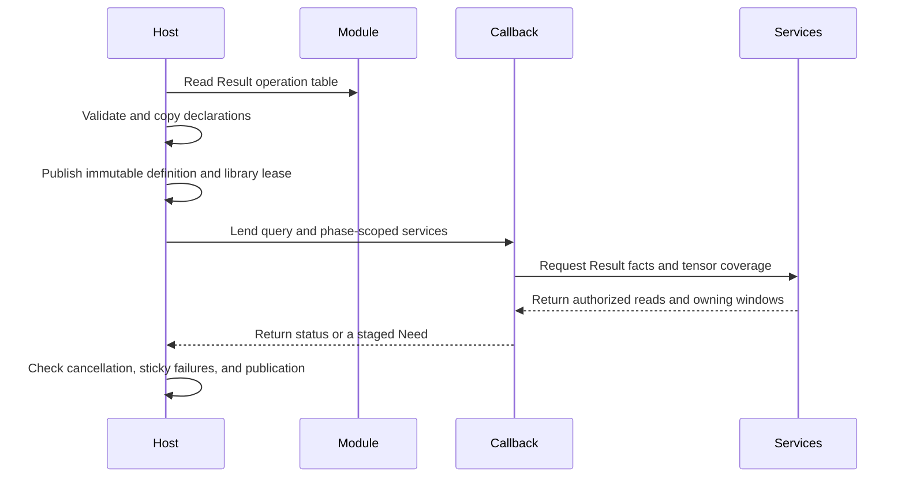

# Plugin ABI and ownership

## 1. Core summary (TL;DR)

Photospider loads trusted operation modules through versioned C tables and copies declarations before publishing them. The structured Result C ABI uses one Result object per port; typed tensor members carry numeric and image samples, while fields carry primitive records. Package 0.33.0 uses the Result operation C ABI 2 and OperationTraits 25.

## 2. Mental model & intuition



The registry owns each immutable definition and its dynamic-library lease. An invocation snapshot retains the definition while callbacks run. The Result coordinator resolves named outputs, tensor projections, field I/O, dependency relations, and backend services. Result owns the schema and tensor storage; a tensor may use affine CPU storage or another backing described by its physical layout.

## 3. Formal contracts & APIs

### Entry points and core model

```c
#include "photospider/plugin/result_operation_plugin_api.h"

const ps_result_operation_plugin_api_v2*
ps_result_operation_plugin_get_api_v2(void);
```

`result_operation_plugin_api.h` is the standalone C11 operation-plugin SDK. It owns the Result element-type and parameter-type enums, parameter descriptor/value records, facet view, capability flags. `PS_RESULT_EXPORT` is defined here and uses the shared `PHOTOSPIDER_OPERATION_PLUGIN_BUILD` producer switch. Native GPU declarations come from the separate `native_gpu_api.h` and use their own ABI version.

```cpp
#include <utility>
#include "photospider/data/result.hpp"

ps::SchemaTemplate schema;
ps::ResultTensorSpec pixels;
pixels.key = "pixels";
pixels.batch_axes = {2, 3};
pixels.descriptor = {ps::ElementType::Float32, {1080, 1920, 4}};
pixels.layout.spatial = true;
pixels.layout.height_axis = 0;
pixels.layout.width_axis = 1;
pixels.layout.channel_axis = 2;
schema.tensors.push_back(std::move(pixels));
```

A Result schema declares tensor members, primitive fields, a domain, and metadata, with at most 16 combined tensor and field members. A tensor descriptor describes cell axes and element type; `batch_axes` prefixes those axes to form its complete sample shape, whose rank is at most eight. Spatial axis indices in `ResultTensorLayout` are cell-relative. Storage order and row pitch describe physical layout, not semantic schema identity. Tensor payload is separate from packed field records. For a non-spatial tensor, every batch and cell extent must be positive and the complete sample rank must be 1 through 8; schema validation does not require a dense byte allocation or a representable product of all extents. A packed field has a record rank of at most 7. Schema validation computes its row byte size and rejects a product above `INT64_MAX`, but it does not allocate dense storage for the field's complete row count.

Result object identity, schema, descriptor facts, fields, tensor members, relations, and resource bindings belong to an owning Result reference. An association retains ordered source ObjectIds as history; dependency support belongs to relation rows. An association does not itself retain source payload. A retained Result, tensor window, or published view keeps the backing owners required for its reads.

Result operation ABI 2 is an independent C table. A module exports `ps_result_operation_plugin_get_api_v2`; the loader checks table alignment, exact structure size, and ABI version before attaching the table destroy hook. Import validates pointer/count pairs and alignment, record sizes, operation constraints, and bounded strict UTF-8 operation and parameter names. Facet keys must be printable ASCII, facet versions positive, each facet list contain at most 64 entries, and each facet payload be at most 65,536 bytes. The loader imports and validates every record into a private registry candidate before it swaps the complete candidate into the live registry. A repeated input with `repeated_maximum` set is rejected when both `repeated_match` and `resolve_metadata` are absent. Any validation or duplicate-key failure leaves the live registry unchanged. Successful imported definitions retain the plugin table owner while their records may be used; the table destroy callback runs when that retained lifetime ends. A failed import, duplicate key, or owner allocation releases the attached table through its destroy hook before closing the native library. The loader accepts the Result ABI 2 entry point and rejects a module that does not provide it. `Value` is typed numeric backing used by Result storage and codecs; it does not define an operation or workflow input/output type. C++ and C operation interfaces both use Result ports. Dependency records describe Result support evidence rather than an alternate operation callback table. `test_result_plugin.cpp::continuation_owns_library` starts a Result Object Need, lets the registry leave scope without a publication observer, and then resumes the continuation successfully; the imported definition retains its module owner through callback completion.

Each Result output descriptor declares its name, Result port, input projection, Whole or Regional execution mode, and output policies. Input ports constrain Result schemas or selected tensor-member predicates. The optional `resolve_metadata` callback receives borrowed compiled input metadata, parameters, and output prototypes. It calls the synchronous metadata sink once per output index; the sink copies and validates nested schema records before returning. The resolver may refine a Result port/schema but cannot change the output flags or payload bound. The `output` view supplied to each `start` and `poll` reflects those registered policies. Sink failures are sticky, and preparation fails if an output is omitted. Operation keys, output names and projections, Result schema identity, and declared constraints remain fixed.

The output flags select view and payload policies:

| Flag | Contract |
| --- | --- |
| `PS_RESULT_OUTPUT_PRESERVE_VIEWS_V2` | Allows a CPU, non-joint Atomic output to preserve a compatible immutable input view. In compiled structured CPU Whole execution, the coordinator prepares payload-authorized Need boxes before the computation poll. Auto may collect only when an affine view is unavailable. Direct callback entry does not synthesize Needs or prepare views. |
| `PS_RESULT_OUTPUT_REQUIRE_INPUT_VIEWS_V2` | Requires `PRESERVE_VIEWS` and CPU Whole execution. The coordinator rejects an unavailable affine view before the computation callback. |
| `PS_RESULT_OUTPUT_PAYLOAD_BOUND_V2` | Enables `maximum_output_payload_bytes`. The bound applies to CPU Whole or staged output; a zero value is an explicit zero-byte bound. |

Unknown bits are rejected. If `PAYLOAD_BOUND` is clear, the byte field must be zero. The host checks each published Result's physical backing, deduplicates owners, and excludes backing that remains live through exposed Results or authorized tensor grants. Root still accounts for source and collected input backing, workspace, metadata, and referenced resources. The check occurs at publication, so it does not prevent earlier callback allocations. Singleton and joint callback queries expose the registered output policy; contract-2 joint execution scopes an output-cap failure to its member.

The nested `ps_result_output_v2` record carries these output fields within operation table ABI 2. The importer requires the exact current output-structure size and rejects a record with any other `struct_size`, so C modules are built against the current header. The development package version is not frozen.

A `start` or `poll` callback receives resolved ports, the selected output index, requested coverage, tile geometry, parameters, and backend. `need_result` requests Result descriptor and field facts. `need_tensor` requests bounded sample coverage with Data, Control, Validation, or Descriptor roles (mask 1 through 15). Descriptor-only tensor coverage authorizes facts, not payload reads. `read_tensor` copies authorized samples. A query kind of `0` requests the complete Result object; kind `2` describes tensor coverage. A kind-2 query with zero boxes is Empty, never Whole. Temporary field reads use a Need/poll/reply sequence and `read_io` consumes the reply. Retained tensor handles preserve their certified tensor capability until release or operation-state destruction.

Ordinary Result C callbacks and services return `int` values defined by `ps_result_status_v2`: codes 0 through 6 mean success, failure, cancellation, backend unavailable, resource exhausted, type mismatch, and invalid argument. Poll yield codes and `VIEW_UNAVAILABLE` follow their respective service contracts. Contract-2 Atom failure details use the separate `ps_result_error_code_v2` and failure-detail records; those typed details are not callback status values. Native GPU services use their separate GPU result codes. Operation capability flags are `PS_RESULT_FLAG_DETERMINISTIC_V2`, `PS_RESULT_FLAG_SIDE_EFFECT_FREE_V2`, `PS_RESULT_FLAG_CPU_V2`, `PS_RESULT_FLAG_GPU_V2`, and `PS_RESULT_FLAG_CPU_FALLBACK_V2`. The fallback flag requires both CPU and GPU capability flags.

The callback can publish tensor regions with support rows and finality, append and publish primitive fields, bind descriptor support, publish a tensor view, and seal the Result. Both Result C table callbacks, `start` and `poll`, execute within the structured executor's poll-phase fallback gate. A retry requires deterministic, side-effect-free traits and a retry-safe attempt with no published output, field I/O, native dispatch, or sticky operation/service, cancellation, or stale-state failure. Other errors remain terminal. The separate C++ `OperationRegistry::start_result` entry point validates the operation's declared backend support before it creates a continuation; it does not determine whether an execution context has a usable GPU lane or device. During structured execution, the coordinator checks GPU lane and device availability before entering a GPU-targeted start factory, then handles `BackendUnavailable` through its ordinary fallback rules. After successful tensor/view/field/Result publication, a callback return of `BackendUnavailable` is converted to `OperationFailed`; `begin_result` alone does not count as publication. `publish_result` accepts only `complete` values 0 or 1 and permits one successful publication per poll; the next poll can publish another prefix. A valid duplicate in one poll latches `OperationFailed`. An earlier invalid service failure remains sticky if the callback then attempts a valid publication or reports success. Actual host cancellation may supersede a valid duplicate-publication failure at the execution boundary; a callback-returned `Cancelled` does not. Relation targets distinguish fields, tensors, and descriptor observations. Exact, Conservative, and Unknown guarantees retain their dependency-propagation meaning; Exact is a registration claim, not a numeric proof by the host. `make_mapping` constructs support from an output tensor to an input tensor using full sample coordinates, including batch axes. `make_reshape`, `make_prefix`, and `make_neighborhood` construct other retained tensor relations. `make_tensor_cartesian` maps every output tensor sample to the same input tensor span `[first, first + count)` in the flattened domain, ordered by batch axes and then cell axes. Its roles are a nonempty Data (1), Control (2), and Validation (4) mask (1 through 7), and its guarantee is Exact or Conservative. The service checks tensor slots and source bounds; cardinality overflow returns `ResourceExhausted`. It returns a relation handle for publication, which the callback releases with `release_relation`. Relations describe dependency support and never authorize payload reads; the callback separately requests sample coverage with `need_tensor`. Service errors remain sticky.

### Callback lifetime, resources, and execution

The query and service table are borrowed for one `start` or `poll` callback. A saved phase context expires when that callback returns; C services are callable only during that callback. The poll lease invalidates its translated service handles at callback return and keeps tombstones until the continuation is destroyed, so stale handles can be rejected without reusing their addresses. Operation state and joint state remain owned by the continuation and are destroyed before the retained operation definition releases its DSO lease. Retained tensor windows and relations keep their own explicit release and destruction lifetimes. Entry-thread services run on the callback entry thread. CPU range and tile workers may call `cancelled` and write admitted scratch; owning window `row` and `rectangle` access may also run concurrently on CPU workers without reentering execution services. Window data pointers remain valid until the final corresponding handle is released; release follows worker completion. The metadata sink is borrowed only during resolver entry. The host keeps service failures sticky even if the callback later reports success.

C++ Result operation factories and scalar or joint poll callbacks are exception-fenced at their registry and continuation boundaries. `std::bad_alloc` becomes `ResourceExhausted`; a standard exception becomes `OperationFailed` with `HostException` and its `what()` text, or an empty message when `what()` is null. A non-standard exception becomes `OperationFailed` with a fixed `HostException` diagnostic. A failure already recorded by phase services takes precedence; exceptions from a host failure observer do not replace that selected failure. A failed joint poll remains latched rather than re-entering its callback.

`ResultProgramPhase::acquire_native_tensor` and the C service `acquire_native_tensor_window` expose the current GPU callback's authorized tensor Need as an owning window backed for native access. The GPU callback then binds its row or rectangle to a native dispatch; the API does not dispatch on the caller's behalf. Without a GPU lane, acquisition returns `BackendUnavailable`. Missing slots, uncovered regions, and Descriptor-only authorization fail as sticky `InvalidArgument` protocol errors. CPU or incompatible-device backing is packed as needed and uploaded under Root accounting. A compatible same-device affine backing can be reused without upload. Fragmented backing may require both materialization and upload, which are counted separately. The window keeps the source Result owner, schema, descriptor, cancellation state, and native storage alive across callback phases and external owner release. C callers release the returned handle through the ordinary window release service. The executor may reuse raw native backing within one Run when a live weak proof still identifies the same CPU storage and the complete physical view key matches; this reuse does not retain the source CPU owner, Result facets, resources, or association. Across Runs, an optional byte-bounded content cache keys device instance/build and the logical samples, Region, dtype, and shape. The key excludes Result facets and resources; a hit is rebound to the current Result metadata and association. Optional hashing consumes the coordinator shared cache-work budget, and insufficient optional work skips cache lookup/retention. Capacity pressure can reclaim retransmittable Run entries and then evict context-retained native entries. `host_access_count` records actual CPU exposure of live native-backed storage, deduplicated within the callback scope; ordinary metadata inspection, native-address acquisition, view forwarding, and upload hashing do not count as host reads.

Whole CPU callbacks can use the CPU range service. CPU tile callbacks use the coordinator's tile service. When a native GPU lane is available, callbacks receive its native services subject to the operation capability. GPU calls run on the active callback thread, and dispatch retains referenced owners until completion. C++ `ResultProgramPhase::gpu_status` reads the active invocation's host status and expires with the phase. CPU tile callbacks run as indivisible tile tasks.

The execution Root accounts admitted work, stages, I/O, relation/map metadata, payload capacity, and retained owners. A callback that exceeds a bound receives a resource or stage failure; issued work is not refunded. Result publication validates schema, sample coordinates, relation coverage, finality, cancellation, and resource ownership before exposing an immutable result.

Owning tensor-window reads also debit the captured execution Root. C row and rectangle services charge an upper bound computed by `ResultWindowAccess::read_work` before reading; a row uses factor 1 and a rectangle factor 2. This is Root-lifetime work because a retained window outlives the borrowed poll phase. It is separate from the per-run dependency/program work limit configured for one execution.

The shared `Photospider::operation_sdk` target provides C++ Result helpers, including `ps::plugin::element_type_value`; `Photospider::data_provider_sdk` provides pure-C provider headers. The Result operation table remains a standalone C11 interface, and its DSO callbacks do not require C++. Native GPU services are separately declared in `native_gpu_api.h` under ABI 1. Callback outcome codes do not carry C-supplied error strings; host status, timing, and count diagnostics remain separate from the numeric detail supplied through `report_numeric`.

## 4. Non-goals & explicit boundaries

- Operation modules are trusted in-process code. ABI validation does not sandbox or authenticate them.
- C++ consumers build against the installed package 0.33.0 headers. Resource facilities are declared in `photospider/core/`: `core/cancellation.hpp`, `core/resources.hpp`, `core/resource_allocator.hpp`, and `core/data_movement.hpp`, which holds the data-movement enums. WorkflowDocument schema 5 and OperationTraits 25 define the current compiler contract. The Result operation C table is ABI 2; provider ABI 1 is independently versioned. The C import boundary rejects invalid external records, and internal execution states are represented only after validation.
- Production image operation availability follows the source and registry classifications in [Image operations](Image-Operations.md).
- GPU execution requires a native-backend build and an available device. A table or capability declaration alone does not prove hardware execution.
- The Result C table exposes Result ports and tensor members only. IPC plugin loading and daemon protocol remain outside this ABI.

## 5. Consequences

Malformed or incompatible tables fail before registry publication. A module rejected after native loading releases its library owner. A published definition keeps the library loaded until its final invocation or state owner retires. Service, resource, and cancellation failures remain terminal. Backend failures also remain terminal except for the explicitly opted-in, retry-safe GPU `BackendUnavailable` case described above.

Synchronous native dispatch retains input owners until device completion, so cancellation can wait for an in-flight call. Long CPU callbacks must observe cancellation through the services. Native modules run with host-process privileges, so only trusted code should be loaded.
