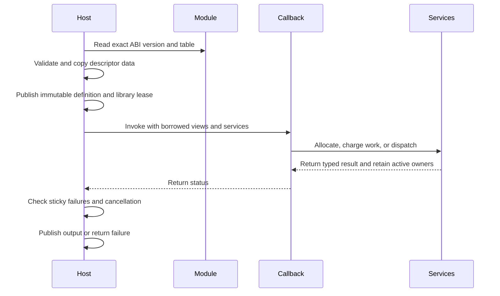

# Plugin ABI and ownership

## 1. Core summary (TL;DR)

Photospider loads trusted operation and data-provider modules into the host process through versioned C tables. The host validates and copies descriptors before publishing them, then lends callback-scoped services with explicit memory and cancellation rules. Current package 0.28 uses operation ABI 11, data-provider ABI 1, and optional planar extension ABI 3.

## 2. Mental model & intuition



The registry owns a published definition and its dynamic-library lease. An invocation snapshot retains that definition while user code runs, so unloading waits for every callback owner to retire. Callback arguments and service tables are borrowed for the documented call; output storage and explicit handles have their own owners.

## 3. Formal contracts & APIs

### Current entry points

```c
#include "photospider/plugin/operation_plugin_api.h"
#include "photospider/plugin/data_provider_api.h"
#include "photospider/plugin/planar_operation_plugin_api.h"

const ps_operation_plugin_api_v11* operation_api(void) {
  return ps_operation_plugin_get_api_v11();
}
```

The planar table is an optional extension to operation ABI 11. Its operation records map one-to-one to the base operation table. Every record in an extended module is planar and replaces the ordinary Value callback. Provider ABI 1 independently publishes copied schema keys, element type, and maximum rank.

Operation ABI 11 carries versioned descriptors for key, flags, input/output traits, parameter schema, callbacks, and opaque module state. The copied traits include backend capability, determinism and side-effect declarations, shape and Region rules, input constraints, output facets and cache policy. The C table uses exact structure sizes and closed enum values. Unknown, missing, wrong-type, or conflicting parameters fail before callback entry; callbacks receive validated canonical values.

An operation may publish up to 64 ordered output descriptors. Each output has its own name, dtype and shape contract, Region rule, semantic constraints, observation/failure policy, and input projection. The host copies all active records before registry publication. Multi-output definitions must be deterministic and side-effect-free. Invocation and query records carry the selected `output_index`; projected views retain original `input_index` values.

Operation callbacks receive input views with storage origin, byte offset, signed strides, valid coverage, and exact demand. Input bytes are borrowed through callback return. The output sink describes the expected descriptor, Region, and packed size. `allocate_output` returns host-owned storage; `allocate_scratch` returns callback-local storage. Publishing a host output freezes it without copying. Publishing caller or stack memory copies through the same host allocator. A first publish attempt claims the sink, even when it fails; later attempts become sticky `OperationFailed` violations.

The C operation result codes distinguish success, ordinary failure, cancellation, backend unavailable, resource exhaustion, type mismatch, and invalid argument. Unknown nonzero values map to `OperationFailed`. A GPU callback may report backend unavailable for CPU fallback only when its descriptor advertises both backends and permits fallback, and only before output publication. Host cancellation and sticky service failures retain their own priority. GPU-only descriptors are rejected before a CPU callback can run.

C++ `OperationTraits::Fixed` represents a logical output descriptor. The C++ registry can publish sparse or zero-stride broadcast Values with very large logical shape because it does not require a dense byte product unless the operation requests dense output. A synchronous C DSO output sink is denser: its fixed descriptor must have representable contiguous signed strides, a nonzero `uint64_t` byte count, a last byte within `INT64_MAX`, and a size within `SIZE_MAX`. Staged dependency outputs are checked per fragment and can represent a large logical domain when each requested fragment is bounded.

Pure static C++ preparation may specialize output traits and add a checked runtime workspace bound from metadata and parameters. A `PreparedOperation` is immutable, safe to share concurrently, and holds its registered definition/library through its state destructor. It contains no Value payload, Run data, I/O state, or mutable cache. The resolved workspace and output specialization participate in operation identity; separate calls do not share preparation implicitly.

### Planar extension and synchronous services

```c
#include "photospider/plugin/planar_operation_plugin_api.h"

int charge_work(const ps_planar_services_v3* services, uint64_t units) {
  return services->consume_work(services->context, units);
}
```

Whole planar callbacks use the selected CPU or GPU lane. CPU Whole callbacks may use the synchronous range service; GPU Whole callbacks use the synchronous native GPU service. CPU staged callbacks receive the coordinator-only `cpu_tiles` service, while the coordinator performs row access and allocation. Scratch is host-owned, zero-initialized, 8-byte aligned, limited by aggregate live requested bytes, and released explicitly or at callback return. Native backing capacity is separately charged to the context root. Service failures are sticky and override callback success. Output commits only after callback success and final cancellation checks.

Planar extension ABI 3 supports single-output Whole CPU/GPU and CPU staged operations. Staged execution requires CPU-only capability. GPU services are callback-thread-only; tokens keep view owners alive through synchronous dispatch and expire at callback return. Planar row pointers refer to host storage and require explicit device-boundary copies.

The C++ dependency `start_dependency` protocol is the staged counterpart for Value operations. ABI 11 publishes finite per-poll services for exact associations, authorized reads/fragments, retained input owners, output publication, scratch, cancellation, work, checkpoints, pure blocks, native atlas/dispatch, and bounded GPU discovery. Service errors are sticky. Borrowed service/view pointers expire at poll return; retained input handles remain valid until explicit release or state destruction. Joint polling groups independent Atomic outputs, while singleton callbacks remain required. See [Dependency Data](Dependency-Data.md) for the complete service lifecycle.

### Validation, lifetime, and errors

Before opening a module, the loader validates the exact nonempty path, byte-length bound, and absence of embedded NUL. It then validates ABI versions, exact table sizes, pointer/count pairs, alignment, bounded counts, UTF-8 keys, enums, flags, traits, and required callbacks before publishing any definition. Rejection leaves the registry unchanged and releases acquired native handles. A later descriptor failure in a multi-record table rejects the whole table.

The registry copies schema and descriptor data it needs. It retains the module lease with each immutable definition. Invocation handles keep the module loaded through callbacks; descriptor tables are destroyed before unload. Provider lookup results own their copied keys and do not borrow mapped provider memory. C++ embedding callbacks use the same immutable definition ownership model. DSO registration uses a private transaction: loading the library alone does not publish operations. A later bad record rejects the complete module table and invokes every acquired destroy/close action once. Registry snapshots retain shared definition handles; callbacks and callable destructors do not run under the registry mutex.

The installed `Photospider::operation_sdk` target propagates `cxx_std_17` and the wrapper headers. `Photospider::data_provider_sdk` supplies the provider include directory without a C++ language feature, so C11 providers do not inherit a C++ requirement.

The ABI is same-process trusted code. Callback exceptions cannot cross C boundaries. Host service errors remain sticky, allocation failures keep their resource classification, and unexpected callback failures become `OperationFailed`. No callback may free or retain borrowed pointers beyond their declared lifetime.

## 4. Non-goals & explicit boundaries

- ABI validation checks structure and behavior contracts; it does not sandbox, authenticate, or isolate modules.
- There is no plugin scheduling ABI, policy DSO, provider storage service, or IPC plugin-loading path.
- Operation ABI 11 and planar extension ABI 3 have no older-entry compatibility path. Installed C++ consumers and modules must be rebuilt against matching public headers.
- GPU support depends on the build's selected native backend. ABI availability does not imply that a device or every operation can execute on GPU.
- Planar GPU supports Whole callbacks, not staged callbacks or CPU fallback.

## 5. Consequences

Malformed or incompatible modules fail during loading before registry publication. Callers receive a status and may choose another module; the loader does not silently reinterpret an old table. A callback that ignores a failed allocation or another service violation still receives the sticky host failure after it returns.

Synchronous dispatch keeps callback owners alive until device completion and can delay cancellation by the dispatch duration. Long CPU callbacks must poll cancellation. Resource and queue exhaustion are finite errors; callbacks are not retried automatically. Native modules run with host-process privileges, so only trusted code should be loaded.
