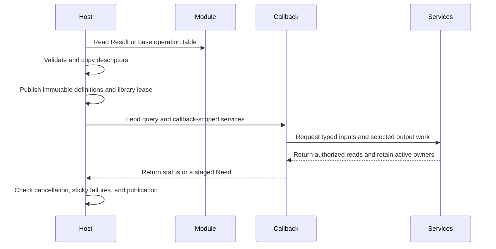

# Plugin ABI and ownership

## 1. Core summary (TL;DR)

Photospider loads trusted operation modules through versioned C tables and copies their declarations before publishing them. Structured `Result` is the only image-facing input and output contract; each image slot stores typed planar samples inside its Result object. The package is 0.29.0, the base operation table is ABI 11, and the independent structured Result table is ABI 1.

## 2. Mental model & intuition



The registry owns each immutable definition and its dynamic-library lease. An invocation snapshot retains the definition while callbacks run. The structured coordinator resolves named outputs, selected input projections, Result image sample requests, field I/O, dependency evidence, and backend services; the `PlanarImage` allocations remain backing owned by the Result.

## 3. Formal contracts & APIs

### Entry points and core model

```c
#include "photospider/plugin/result_operation_plugin_api.h"

const ps_result_operation_plugin_api_v1*
ps_result_operation_plugin_get_api_v1(void);
```

```cpp
#include <utility>
#include "photospider/data/result.hpp"

ps::SchemaTemplate schema;
ps::ResultImageSpec pixels;
pixels.key = "pixels";
pixels.frames = 2;
pixels.layers = 3;
pixels.descriptor = {ps::ElementType::Float32, {1080, 1920, 4}};
pixels.layout.height_axis = 0;
pixels.layout.width_axis = 1;
pixels.layout.channel_axis = 2;
schema.images.push_back(std::move(pixels));
```

A Result schema keeps primitive records and image slots as separate typed members, with at most 16 combined fields and image slots. Each image slot is limited to 4096 frame/layer backing pairs and describes a bounded `{frame, layer, ...sample}` domain; `descriptor` describes one frame/layer and `layout` describes planar storage. Primitive record bytes live in `ResultFieldSpec`; image pixels live in the image slot's typed planar backing. Result object identity, schema, descriptor facts, fields, image backing, relations, and source association share one owning Result reference. Numeric `Value` outputs remain available through the Value path.

Result operation ABI 1 is a separate C table. A module exports `ps_result_operation_plugin_get_api_v1`; the loader requires the exact table size and ABI version, imports every record into a private registry candidate, and publishes the complete candidate atomically. A failed record leaves the registry unchanged. The base operation ABI 11 remains available for operations that use its Value/dependency callback contract. The loader does not load the former planar callback table.

Each Result output descriptor has a name, a typed Value or Result port, input projection, and Whole or Regional execution declaration. Input ports can constrain ordinary Values, numeric scalar bounds, typed Values, or a Result schema. The optional `resolve_metadata` callback receives borrowed compiled input metadata, parameters, and output prototypes. During this pure metadata step, it calls the synchronous `ps_result_metadata_sink_v1::set_output` once for each output using that output's registry index. The sink copies and validates every nested descriptor before `set_output` returns, so the callback can use local schema, image, and facet records. Sink errors are sticky, and preparation fails if any output is omitted. The operation key, output names/projections, output kind, Result schema id/version, and declared output constraints stay fixed. A start/poll callback receives actual resolved input/output metadata, selected `output_index`, requested Regions, tile geometry, parameters, and backend. `need_value` and `need_image` add bounded sample requests; `need_result` requests field facts, while field reads use a Need/poll/reply sequence around temporary-storage I/O. `read_image` is limited to the captured image capability granted by `need_image`. `requested_kind` distinguishes a complete Result object query (`0`) from a Value footprint (`1`) or image footprint (`2`). A kind-1 or kind-2 query with zero Regions describes Empty coverage. A retained image handle preserves that same selected slot and coverage until release or state destruction.

The callback can publish a typed Result image with relation rows and finality, append and publish primitive fields, bind descriptor support, publish an ordinary Value output, and seal its Result. `ResultSupportTarget` separates Value samples, fields, image slots, and descriptor observations. `Exact`, `Conservative`, and `Unknown` preserve their declared dirty-propagation strength; Exact is a registration claim about support, not a numeric theorem proved by the host. Association is monotone and retains consumed source objects through the derived output lifetime. `ResultRef::capture()` freezes one descriptor revision together with its image/field coverage, relations, and dependency evidence; a shared waiter consumes that captured publication. `ResultRef::resources()` exposes the schema-selected ICC/OCIO bindings retained with its typed image facets and Result metadata.

### Callback lifetime, resources, and execution

The query and service table are borrowed for one `start` or `poll`. A saved phase context expires when that call returns. Retained image handles and operation state have explicit release/destruction lifetimes. Result C service calls run on the callback entry thread. CPU work scheduled through `cpu_parallel` or `cpu_tiles` may call only `cancelled` from worker callbacks; workers may write scratch bytes that the entry thread already allocated for them. The metadata sink is borrowed only during resolver entry, and `set_output` runs on that entry thread. Callbacks check service return codes; the host keeps service failures sticky even if a callback later reports success.

Whole CPU callbacks can use the CPU range service. CPU tile callbacks use the coordinator's tile service. When a native GPU lane exists, Whole and staged Result callbacks receive its native services subject to the operation's declared capability. GPU service calls are restricted to the active callback thread and their dispatch retains referenced owners until completion. C++ `ResultProgramPhase::gpu_status` is a borrowed reader for the active native invocation. The callback calls it on the entry thread after a GPU service call to recover the specific host status, including errors that the numeric GPU table otherwise reports as a general failure. The reader expires with the phase. CPU tile callbacks run as indivisible tile tasks.

A configured resource root accounts admitted work, stages, I/O, relation/map metadata, payload capacity, and retained owners. A callback that exceeds a bound receives a resource or stage failure; issued work is not refunded. Result publication validates schema, sample coordinates, relation coverage, finality, cancellation, and resource ownership before exposing the immutable result.

Base operation ABI 11 keeps its separate Value/dependency entry points and existing multi-output projection rules. The public C SDK targets are `Photospider::operation_sdk` for C++ operation helpers and `Photospider::data_provider_sdk` for the pure-C provider headers. The Result ABI header is a C11 interface and its DSO callback table does not inherit the operation SDK's C++ requirement.

## 4. Non-goals & explicit boundaries

- Operation modules are trusted in-process code. ABI validation does not sandbox or authenticate them.
- The removed planar extension ABI v1, v2, and v3 are rejected. The old planar header and separate image executor are removed; no compatibility adapter is provided.
- Package 0.29 requires C++ consumers to rebuild. WorkflowDocument schema 4 and OperationTraits version 21 reject older contracts. The base C operation table remains ABI 11; the independent Result operation table is ABI 1.
- Production image operation availability follows the source and registry classifications in [Image operations](Image-Operations.md).
- GPU execution requires a build with a native backend and an available device. A table or capability declaration alone does not prove hardware execution.
- The C image descriptor carries planar storage order and row pitch as physical layout inputs. The C Result table exposes the declared Value and Result ports; IPC plugin loading and daemon protocol remain outside this ABI.

## 5. Consequences

Malformed or incompatible tables fail before registry publication, and the loader does not reinterpret an older planar table. A module rejected after native loading releases its library owner; a published definition keeps the library loaded until the last invocation or state owner retires. Callbacks are not retried automatically after service, resource, cancellation, or backend errors.

Synchronous native dispatch retains input owners until device completion, so cancellation can wait for an in-flight call. Long CPU callbacks must observe cancellation through the services. Native modules run with host-process privileges, so only trusted code should be loaded.
