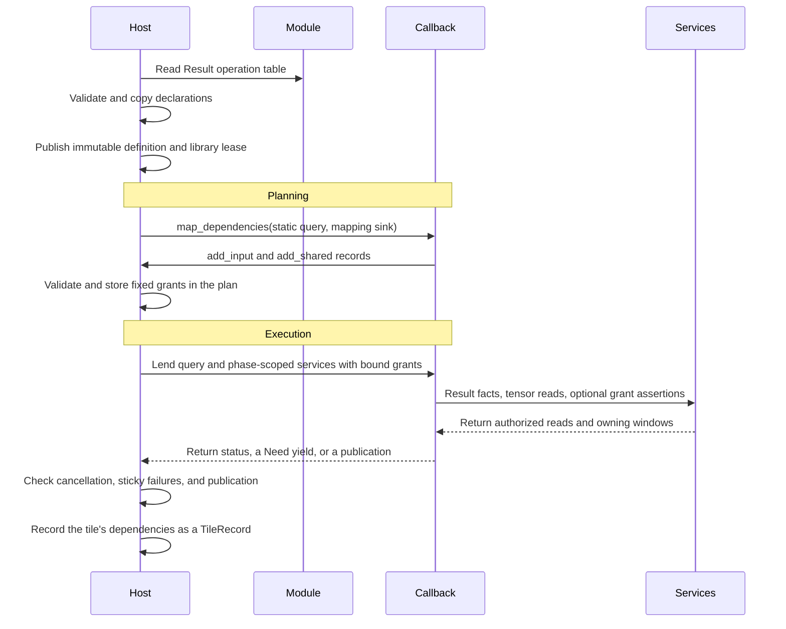

# Plugin ABI and ownership

## 1. Core summary (TL;DR)

Photospider loads trusted operation modules through an exact-size versioned C table and copies declarations before publishing them; built-in operations register through the C++ `OperationRegistry` instead. The structured Result C ABI uses one Result object per port, and every Result is a static directory of 1..16 typed Tensor members that carry numeric and image samples. A Result stores structure and data only. The planner calls each operation's pure static mapping hook to fix, per output tile, the member tiles it may read; at run time callbacks read only those compiled grants, and the host records each executed tile's dependencies outside the Result. Package 0.38.0 uses the Result operation C ABI 7 and OperationTraits 29. ABI 7 provides member-local tile intervals, a synchronous static mapping sink, static publication scopes, Run-shared stages, validator and diagnostic registration, explicit resource selection during metadata resolution, authorized validation reads, and `fail_domain`; Result records carry no facet or domain metadata.

## 2. Mental model & intuition


```mermaid
sequenceDiagram
    participant Host
    participant Module
    participant Callback
    participant Services
    Host->>Module: Read Result operation table
    Host->>Host: Validate and copy declarations
    Host->>Host: Publish immutable definition and library lease
    Note over Host,Callback: Planning
    Host->>Callback: map_dependencies(static query, mapping sink)
    Callback->>Host: add_input and add_shared records
    Host->>Host: Validate and store fixed grants in the plan
    Note over Host,Callback: Execution
    Host->>Callback: Lend query and phase-scoped services with bound grants
    Callback->>Services: Result facts, tensor reads, optional grant assertions
    Services-->>Callback: Return authorized reads and owning windows
    Callback-->>Host: Return status, a Need yield, or a publication
    Host->>Host: Check cancellation, sticky failures, and publication
    Host->>Host: Record the tile's dependencies as a TileRecord
```

The registry owns each immutable definition and its dynamic-library lease. An invocation snapshot retains the definition while callbacks run. The planner resolves named outputs, input projections, mapped input tiles, shared stages, and backend placement into fixed instructions. The Result coordinator binds those grants, supplies backend services, and records the dependencies of each executed tile in a `TileRecord`. The Result owns the schema and tensor storage; a tensor may use tiled CPU storage, affine CPU storage, or another backing described by its physical layout.

## 3. Formal contracts & APIs

### Entry points and core model

```c
#include "photospider/plugin/result_operation_plugin_api.h"

typedef struct ps_result_operation_plugin_api_v7 {
  uint32_t struct_size, abi_version;
  const ps_result_operation_v7* operations;
  uint32_t operation_count;
  void* context;
  void (*destroy)(void*);
  const ps_result_validation_definition_v7* validators;
  uint32_t validator_count;
  const ps_result_diagnostic_definition_v7* diagnostics;
  uint32_t diagnostic_count;
} ps_result_operation_plugin_api_v7;

const ps_result_operation_plugin_api_v7*
ps_result_operation_plugin_get_api_v7(void);
```

`result_operation_plugin_api.h` is the standalone C11 operation-plugin header. It owns the Result element-type and parameter-type enums, parameter descriptor/value records, schema, tensor, tile-grid, tile-Need, tile-selection, static-query, mapping-sink and shared-stage records, extension identity and resource identity/view records, validator and diagnostic definitions, and capability flags. `PS_RESULT_EXPORT` is defined here and uses the shared `PHOTOSPIDER_OPERATION_PLUGIN_BUILD` producer switch. Native GPU declarations come from the separate `native_gpu_api.h` and use their own ABI version. The C tile helpers in `result_tile_helpers.h` build member tile intervals from borrowed grid records.

```cpp
#include <utility>
#include "photospider/data/result.hpp"

ps::SchemaTemplate schema;
ps::ResultTensorSpec pixels;
pixels.key = "pixels";
pixels.batch_axes = {2, 3};
pixels.descriptor = {ps::ElementType::Float32, {4, 1080, 1920}};
pixels.layout.spatial = true;
pixels.layout.channel_axis = 0;
pixels.layout.height_axis = 1;
pixels.layout.width_axis = 2;
schema.tensors.push_back(std::move(pixels));
```

A Result schema declares 1..16 Tensor members and optional publication scopes. A tensor descriptor describes cell axes and element type; `batch_axes` prefixes those axes to form its complete sample shape, whose rank is at most eight. Spatial axis indices in `ResultTensorLayout` are cell-relative. Every batch and cell extent must be positive and every member shape is fixed before execution; schema validation does not require a dense byte allocation or a representable product of all extents.

Result object identity, schema, captured descriptor facts, and tensor members belong to an owning Result reference. Operation resources belong to the prepared operation and plan, not to the Result. Dependency facts belong to the execution's `TileRecord` table, which records the compiled reads of each executed tile. `ResultObjectInputs` and grant-authorized tensor capabilities retain actual input Results; a retained read window or published view directly owns the required source backing. Result object identity is distinct from dependency proof and physical owner retention.

Result operation ABI 7 is an independent C table, and a module exports `ps_result_operation_plugin_get_api_v7`. Before calling it, the loader looks up the older Result getters `ps_result_operation_plugin_get_api_v1` through `_v6` and the planar image getters; a module that exports any of them fails with `TypeMismatch`, even when it also exports the ABI 7 getter.

The loader then calls the ABI 7 getter and checks for a non-NULL table, its alignment, exact `struct_size`, and `abi_version == 7` before attaching the table destroy hook; a failed check returns `InvalidArgument`. No compatibility header or forwarding entry point exists, and older record layouts have no compatibility prefix.

Import validates pointer/count pairs and alignment, record sizes (the outer record size is checked before any nested pointer is read), operation constraints, and bounded strict UTF-8 operation and parameter names. A repeated input with `repeated_maximum` set is rejected when both `repeated_match` and `resolve_metadata` are absent.

Validator and diagnostic definitions in the table are registered together with the operations. Each port's `validators` array, each shared stage's `validators` array, and each operation's `diagnostics` array name extension identities (key, version, implementation) that must resolve to a definition in the same import or in the registry; a missing identity or a version/implementation conflict rejects the import.

The loader imports and validates every record into a private registry candidate before it swaps the complete candidate into the live registry. Any validation or duplicate-key failure leaves the live registry unchanged.

Successful imported definitions retain the plugin table owner while their records may be used; the table destroy callback runs when that retained lifetime ends. A failed import, duplicate key, or owner allocation releases the attached table through its destroy hook before closing the native library. C++ and C operation interfaces both use Result ports and the same static mapping and fixed-grant model.

### Outputs, shared stages, and metadata

Each `ps_result_output_v7` declares its name, Result port, input projection, flags, and payload bound. Every output executes as one plan instruction per member tile of its compiled grid; there is no execution-granularity field. C import sets `cacheable` only when both purity flags are present. An operation without the side-effect-free flag must declare at least one mandatory shared stage, and it is then uncached. Input ports constrain Result schemas or selected tensor-member predicates.

`ps_result_shared_stage_v7` declares one Run-shared stage: key, schema, sorted input projection, backend, `mandatory`, cumulative `state_bytes`, `workspace_bytes`, `maximum_work`, `maximum_output_payload_bytes`, `maximum_stages`, and validators. A stage has no public output identity. The host copies these declarations during registration and preparation. The planner emits stage instructions only for stages that a mapper names or that are mandatory, and the VM keeps at most one stage state per call and stage within one block activation; re-entering the block starts a fresh activation. The `start` and `poll` callbacks select a stage through `ps_result_query_v7::shared_stage`; a tile callback sees `UINT32_MAX` there. A stage callback ignores `output_index`, `tensor_slot`, and `tile_unit`. The executor's stage contract is described in [Run-shared stages](Global-Results.md#run-shared-stages).

The optional `resolve_metadata` callback receives borrowed compiled input metadata, parameters, and output prototypes. It calls the synchronous metadata sink once per output index; the sink copies and validates nested schema records before returning. The resolver may refine a Result port/schema but cannot change the output flags or payload bound. `set_shared_stages` replaces all stage prototypes once with owned static declarations. `set_resources` lists the `ps_result_resource_identity_v7` entries (byte length and SHA-256) that the operation needs; the compiler selects them from the caller's `ResourceSet`, `map_dependencies` sees only the identities, and `start`, `poll`, and validator `prepare` later receive those bytes as borrowed `ps_result_resource_view_v7` records. There is no ambient resource lookup. Sink failures are sticky, and preparation fails if an output is omitted. Operation keys, output names and projections, Result schema identity, and declared constraints remain fixed.

`PS_RESULT_OUTPUT_PAYLOAD_BOUND_V7` is the only output flag. It enables `maximum_output_payload_bytes`; an explicit zero bound permits borrowed storage only. Unknown bits are rejected. If the flag is clear, the byte field must be zero. The host counts unique physical owners once per output per Run, cumulatively across its tile instructions, and excludes input and shared-stage owners. Root still accounts for source backing, workspace, metadata, and operation resources. The check occurs at publication, so it does not prevent earlier callback allocations.

### Static dependency mapping

```c
typedef struct ps_result_static_query_v7 {
  uint32_t struct_size, output_index, backend, tensor_slot, shared_stage;
  uint64_t tile_unit, tile_extent;
  const ps_result_port_v7* inputs;
  uint32_t input_count;
  const ps_result_tile_grids_v7* input_tile_grids;
  const ps_result_output_v7* output;
  const ps_result_tile_grids_v7* output_tile_grids;
  const ps_result_shared_stage_v7* shared_stages;
  uint32_t shared_stage_count;
  const ps_result_parameter_value_v7* parameters;
  uint32_t parameter_count;
  const ps_result_tile_selection_v7* publication;  /* complete target */
  uint32_t publication_count;
  const ps_result_resource_identity_v7* resource_ids;
  uint32_t resource_count;
} ps_result_static_query_v7;

typedef struct ps_result_static_mapping_sink_v7 {
  uint32_t struct_size;
  void* context;
  int (*add_input)(void*, const ps_result_tile_need_v7*);
  int (*add_shared)(void*, uint32_t stage, uint32_t all_members,
                    const ps_result_tile_selection_v7*, uint32_t member_count);
} ps_result_static_mapping_sink_v7;

/* Last member of ps_result_operation_v7. */
int (*map_dependencies)(void* user, const ps_result_static_query_v7*,
                        const ps_result_static_mapping_sink_v7*);
```

The planner calls `map_dependencies` once for each output tile or shared-stage target it emits; calls for different targets may run concurrently. The query carries fixed metadata only: ports, compiled grids, the selected output or stage, parameters, the complete publication target, and resource identities without resource bytes. No payload, execution service, continuation or I/O is available, and operation state must not be used. All nested views expire when the hook returns.

The hook reports each read through the sink, which copies nested records before returning. `add_input` takes a `ps_result_tile_need_v7`; a descriptor-only record uses `tensor_slot=0` and no intervals. `add_shared(stage, 1, NULL, 0)` selects a complete stage, `add_shared(stage, 0, NULL, 0)` explicitly requests no stage payload, and otherwise the selection lists member intervals. At most 65,536 records and 65,536 intervals may be supplied across one call. Sink errors are sticky, only the entry thread may call the sink, and the hook must not retain it.

A NULL `map_dependencies` selects the complete projected original inputs, the same baseline as C++ `complete_input_dependencies`. Shared-stage edges are never implicit: a consumer of a stage must call `add_shared`. A non-NULL hook that returns success without any sink call declares that the target reads nothing. Plan import and execution use the saved mapping and never call this hook. For a GPU placement with CPU fallback, the planner calls the hook a second time with `backend` set to CPU to prove that the CPU reads fit inside the GPU grants.

### Queries and grant assertions

A `start` or `poll` callback receives a `ps_result_query_v7` with resolved ports, the selected output index, backend, the selected member `tensor_slot`, `tile_unit` and `tile_extent`, the shared-stage selector and declarations, one compiled grid group per input plus the output grid group, parameters, and selected resource views. A grid group holds one `ps_result_tile_grid_v7` per member in schema order. A grid record gives the member's full shape, batch rank and `batch_axis_mask`, the height and width axes (the rank value marks a missing tiled axis), the tile extent, tile rows and columns, and the tile count. The instruction's compiled grants are bound before the first poll, so `read_tensor`, `result_descriptor` and window acquisition work immediately inside those grants. Retained tensor handles preserve their certified tensor capability until release or operation-state destruction.

A callback may still call `need_tiles` and return `PS_RESULT_NEED_V7`:

```c
typedef struct ps_result_tile_interval_v7 {
  uint64_t begin, end;
} ps_result_tile_interval_v7;

typedef struct ps_result_tile_need_v7 {
  uint32_t struct_size, input, tensor_slot, descriptor_only;
  const ps_result_tile_interval_v7* intervals;
  uint64_t interval_count;
} ps_result_tile_need_v7;
```

| Form | Meaning at run time |
| --- | --- |
| `descriptor_only = 0`, `interval_count > 0` | Asserts that the listed member tiles lie inside a compiled payload grant for that input and slot. |
| `descriptor_only = 0`, `interval_count = 0` | No-op. No dependency, grant or work is created. |
| `descriptor_only = 1` | Asserts a compiled descriptor or payload grant for the input. `tensor_slot` must be zero and there are no intervals. |

Intervals are half-open local tile indices in the producer member's compiled grid. One call accepts at most 65,536 intervals. Overlapping and adjacent intervals coalesce; a reversed or out-of-grid interval fails. The host validates the complete envelope and fails with a sticky protocol `InvalidArgument` if any request falls outside the compiled grants. A valid assertion only lets the next poll proceed: it starts no producer, narrows no grant and never converts descriptor-only access into payload access. The same records serve as `add_input` records during mapping. C modules derive intervals from the borrowed grid records, and C++ operations can use `photospider/plugin/tile_helpers.hpp`.

`result_tile_helpers.h` provides `ps_result_need_descriptor_v7`, `ps_result_to_whole_v7` (all members as complete intervals), and `ps_result_need_regions_v7` (tiles intersecting explicit rectangles of one member). `ps_result_need_regions_v7` closes atomic axes, turns contiguous rows and batches into intervals, and admits at most 65,536 intervals before scratch allocation. When every supplied rectangle is empty, it submits a zero-interval Need, which is a no-op. `ps_result_output_region_v7` resolves the selected output member tile. Because grants are already bound, a callback that uses `ps_result_to_whole_v7` and returns Need finds the same grants on the next poll, and it can also read directly in the first poll. The C API provides tile publication through window acquire/retain/release and `publish_tensor_view`; it has no `ps_result_to_tile_v7` convenience function.

### Shared-stage services

`need_shared_stage(stage)` asserts that the instruction's compiled shared grant covers every member tile of a prepared stage. `need_shared_tiles(stage, slot, intervals, count)` asserts member-local stage tile intervals within that grant; repeat it for distinct members. A call with zero intervals is a no-op. Neither call starts the stage or adds stage work; the stage instructions ran earlier in the block. The two calls cannot both name the same stage in one poll, and a repeated or unknown ordinal fails. `acquire_shared_window(stage, slot, region, ...)` returns a retained window from a supplied stage Result. It grants no access to the stage's original inputs, and the window follows the ordinary retain and release lifetime. When the current target is itself a shared stage, the planner checks each mapped read against that stage's prepared `input_indices` projection.

### Explicit zero-copy view services (ABI 7)

```c
// Excerpts from result_operation_plugin_api.h.
typedef struct ps_result_tensor_transform_v7 {
  uint32_t struct_size, reshape, source_rank;
  const ps_result_view_axis_v7* axes;
} ps_result_tensor_transform_v7;
typedef struct ps_result_tensor_view_piece_v7 {
  uint32_t struct_size;
  uint64_t window_handle;
  ps_result_region_v7 region;
  ps_result_tensor_transform_v7 transform;
} ps_result_tensor_view_piece_v7;
```

`ps_result_tensor_transform_v7` contains an exact `struct_size`, `reshape`, `source_rank` and the `axes` pointer. Each `ps_result_view_axis_v7` supplies `output_axis`, `source_origin`, signed `step` and `output_origin`. For affine publication, it provides one map for each full source axis, including batch axes, using the anchored absolute-coordinate mapping in [Result views](Global-Results.md#explicit-tensor-views-and-publication-ownership).

`publish_tensor_view` requires a non-NULL explicit transform even for an identity view. The single-source reshape form `reshape=1, source_rank=0, axes=NULL` is valid: the implementation checks equal logical sample counts and physical affine feasibility. A physically unrepresentable but logically valid view can report `PS_RESULT_VIEW_UNAVAILABLE_V7` for an explicit copy retry.

`ps_result_tensor_view_piece_v7` contains an exact `struct_size`, an acquired `window_handle`, a target-coordinate `region` and an explicit `ps_result_tensor_transform_v7`. The C service `publish_tensor_view_pieces` accepts 1..16 records, each with an exact nested transform size and `reshape=0`. Pieces form a disjoint, complete partition of the supplied total region. **The total region and the union of pieces must satisfy atomic closure; individual pieces may split an atomic tuple.** For a `[1,2]` target with an atomic final channel axis, pieces for channels `[0,1)` and `[1,2)` together publish one complete tuple.

The bridge retains the window records and borrowed axis metadata for the entire synchronous call. The builder validates the full logical envelope, maps physical spans, checks cycles among all source owners and publishes coverage once. Published Results retain source backing after C window-handle release and callback retirement; backing remains charged to the original Root.

An unrepresentable *physical* view may report the nonsticky `PS_RESULT_VIEW_UNAVAILABLE_V7` so the caller can explicitly materialize. An absent/expired handle, NULL transform, wrong record size, source authorization or partition failure, owner cycle, resource failure, and cancellation cannot be treated as a copy retry. A failed transaction does not advance coverage or revision or expose an early piece; ordinary service errors are sticky.

### Status, fallback, and publication

Ordinary Result C callbacks and services return `int` values defined by `ps_result_status_v7`: codes 0 through 6 mean success, failure, cancellation, backend unavailable, resource exhausted, type mismatch, and invalid argument. Poll yield codes (`PS_RESULT_NEED_V7`, `PS_RESULT_PUBLISH_V7`) and `PS_RESULT_VIEW_UNAVAILABLE_V7` follow their respective service contracts. Native GPU services use their separate GPU result codes. Operation capability flags are `PS_RESULT_FLAG_DETERMINISTIC_V7`, `PS_RESULT_FLAG_SIDE_EFFECT_FREE_V7`, `PS_RESULT_FLAG_CPU_V7`, `PS_RESULT_FLAG_GPU_V7`, `PS_RESULT_FLAG_CPU_FALLBACK_V7`, and `PS_RESULT_FLAG_SHARE_BLOCKS_ACROSS_OUTPUTS_V7`. The fallback flag requires both CPU and GPU capability flags.

CPU fallback is compiled into the plan. The planner sets `cpu_fallback` on a GPU tile instruction only when the operation declares `PS_RESULT_FLAG_CPU_FALLBACK_V7` with CPU and GPU support, is deterministic and side-effect-free, has no shared-stage reads, and its CPU mapping fits inside the GPU grants. Both Result C table callbacks, `start` and `poll`, execute within the structured executor's fallback gate. A retry requires that compiled flag and a retry-safe attempt with no published output, input read, checkpoint, block or discovery callback, native dispatch, non-retryable sticky operation/service failure, cancellation, or stale-state failure. Other errors remain terminal. A retry discards the attempt's continuation and failure owners, then restarts the same tile instruction on CPU with the same grants; spent Root work remains charged. The retried tile is fallback-tainted and does not enter the checkpoint, block-state, or completed-result caches. Shared-stage computation is never retried; that path needs explicit IR control flow. The separate C++ `OperationRegistry::start_result` entry point validates the operation's declared backend support before it creates a continuation; it does not determine whether an execution context has a usable GPU lane or device. During structured execution, the coordinator checks GPU lane and device availability before entering a GPU-targeted start factory, then handles `BackendUnavailable` through its ordinary fallback rules. After successful tensor, view, or Result publication, a callback return of `BackendUnavailable` is converted to `OperationFailed`; `begin_result` alone does not count as publication. `publish_result` accepts only `complete` values 0 or 1 and permits one successful publication per poll; a shared-stage continuation can publish another prefix on a later poll. An ordinary tile publication must be complete and cover exactly its selected member tile, with other members empty. A valid duplicate in one poll latches `OperationFailed`. An earlier invalid service failure remains sticky if the callback then attempts a valid publication or reports success. Actual host cancellation may supersede a valid duplicate-publication failure at the execution boundary; a callback-returned `Cancelled` does not.

### Callback lifetime, resources, and execution

The query and service table are borrowed for one `start` or `poll` callback. A saved phase context expires when that callback returns; C services are callable only during that callback. The poll lease invalidates its translated service handles at callback return and keeps tombstones until the continuation is destroyed, so stale handles can be rejected without reusing their addresses. Operation state remains owned by the continuation and is destroyed before the retained operation definition releases its DSO lease. Retained tensor windows keep their own explicit release and destruction lifetimes. Entry-thread services run on the callback entry thread. CPU range and tile workers may call `cancelled` and write admitted scratch; owning window `row` and `rectangle` access may also run concurrently on CPU workers without reentering execution services. Window data pointers remain valid until the final corresponding handle is released; release follows worker completion. The metadata sink is borrowed only during resolver entry. The host keeps service failures sticky even if the callback later reports success.

C++ Result operation factories and scalar poll callbacks are exception-fenced at their registry and continuation boundaries. `std::bad_alloc` becomes `ResourceExhausted`; a standard exception becomes `OperationFailed` with `HostException` and its `what()` text, or an empty message when `what()` is null. A non-standard exception becomes `OperationFailed` with a fixed `HostException` diagnostic. A failure already recorded by phase services takes precedence; exceptions from a host failure observer do not replace that selected failure. A direct shared-stage continuation whose validator rejects a later tile retires its projected producer with the final guarded poll failure; an escaped earlier prefix reports that failure through `production_status()` and still reads its certified tiles.

`ResultProgramPhase::acquire_native_tensor` and the C service `acquire_native_tensor_window` expose a region of the current GPU callback's compiled payload grant as an owning window backed for native access. The GPU callback then binds its row or rectangle to a native dispatch; the API does not dispatch on the caller's behalf. Without a GPU lane, acquisition returns `BackendUnavailable`. Missing slots, uncovered regions, and descriptor-only authorization fail as sticky `InvalidArgument` protocol errors. CPU or incompatible-device backing is packed as needed and uploaded under Root accounting. A compatible same-device affine backing can be reused without upload. Fragmented backing may require both materialization and upload, which are counted separately. The window keeps the source Result owner, schema, descriptor, cancellation state, and native storage alive across callback phases and external owner release. C callers release the returned handle through the ordinary window release service. Native upload reuse and caching are described in [Native GPU input access](Global-Results.md#native-gpu-input-access).

Ordinary CPU poll callbacks can use the CPU range service, `ps_cpu_parallel_service_v2`. CPU-staged coordinators submit tile computations through `ps_cpu_tiles_service_v2`; CPU tile callbacks run as indivisible tile tasks. CPU tile workers and GPU callbacks do not receive the range service. Parallel work completes before its service call returns, and nested parallel submission is prohibited. Kernel callbacks inherit the floating-point environment of their worker and restore it on return; numeric operations establish their own environment inside executing workers. When a native GPU lane is available, callbacks receive its native services subject to the operation capability. GPU calls run on the active callback thread, and dispatch retains referenced owners until completion. C++ `ResultProgramPhase::gpu_status` reads the active invocation's host status and expires with the phase.

The execution Root accounts admitted work, stages, metadata, payload capacity, and retained owners. A callback that exceeds a bound receives a resource or stage failure; issued work is not refunded. Result publication validates schema, sample coordinates, cancellation, and resource ownership before exposing an immutable result.

Owning tensor-window reads also debit the captured execution Root. C row and rectangle services charge an upper bound computed by `ResultWindowAccess::read_work` before reading; a row uses factor 1 and a rectangle factor 2. This is Root-lifetime work because a retained window outlives the borrowed poll phase. It is separate from the per-run dependency/program work limit configured for one execution.

### C validators, diagnostics, and domain failures

A `ps_result_validation_definition_v7` supplies an extension identity, `scratch_bytes`, `requires_complete`, and three callbacks. `prepare` receives a `ps_result_validation_preparation_v7` (output flag, port, shared-stage ordinal, schema, parameters, selected resource views) and returns an owned state pointer; `destroy_prepared` releases it, including after a failed `prepare`, and always runs before the module owner retires. `validate` receives a `ps_result_validation_context_v7` whose services exist only on the entry thread until the call returns: `tensor_regions` describes the newly authorized coverage of a member, `read_tensor` copies at most 65,536 bytes per call in logical order, and `consume_work`/`cancelled` connect to the host budget. `complete` reports whether the validated coverage is complete, as defined in [Port validators](Global-Results.md#port-validators-and-diagnostic-reports). A read outside the authorized coverage fails and stays sticky even if the callback ignores the return code. The C bridge preserves the first service or `fail_domain` failure over a later callback status or exception.

A `ps_result_diagnostic_definition_v7` declares a fixed `payload_bytes` record with `validate` and `merge` callbacks; `merge` writes a complete destination and must not modify its inputs. An operation lists the diagnostic identities it may emit in `ps_result_operation_v7::diagnostics` and reports through `report_diagnostic(type_index, bytes, size)` on its run services.

`fail_domain(status_code, domain_code)` on the run services and on the validation context records the first domain failure with a nonzero status code and an opaque 64-bit domain code. The host copies the code into `FailureDetail::domain_code` without interpreting it.

### SDK targets

The shared `Photospider::operation_sdk` target provides C++ Result helpers, including `ps::plugin::element_type_value`, `tile_helpers.hpp`, `tensor_helpers.hpp` (`sdk::to_whole`, `sdk::to_tile`, `sdk::collect`, `sdk::publish_dense_tensor`), and `whole_stage.hpp` (`sdk::with_whole_stage`, `sdk::shared_result_tile`). These helpers are described in [SDK acquisition helpers](Global-Results.md#sdk-acquisition-helpers). The Result operation table remains a standalone C11 interface, and its DSO callbacks do not require C++. Native GPU services are separately declared in `native_gpu_api.h` under ABI 1, and the CPU parallel and CPU tiles services are ABI 2. Callback outcome codes do not carry C-supplied error strings; host status, timing, and count diagnostics remain separate from the bounded reports supplied through `report_diagnostic`.

`Photospider::ops_sdk` is the operations-domain SDK. It links only `Photospider::kernel` and installs public headers under `include/photospider/ops/` (export macro `PHOTOSPIDER_OPS_SDK_API`): color descriptions and ICC/OCIO resources, explicit `TensorColorGroup` configuration, transfer/RGB/white codecs, exact domain arithmetic, description editing, the `ops.scalar-range` validator, the 3D LUT bake contract and quality reports, numeric diagnostics, and the Layer composite type. CMake option `PHOTOSPIDER_BUILD_OPS_SDK` defaults to the value of `PHOTOSPIDER_BUILD_OPS`; bundled operations require it. `PHOTOSPIDER_BUILD_OPS` defaults to `OFF`, so a default kernel-only configuration builds neither. The kernel itself contains none of these domain types.

## 4. Non-goals & explicit boundaries

- Operation modules are trusted in-process code. ABI validation does not sandbox or authenticate them.
- C++ consumers build against the installed package 0.38.0 headers. Resource facilities are declared in `photospider/core/`: `core/cancellation.hpp`, `core/resources.hpp`, and `core/resource_allocator.hpp`. WorkflowDocument schema 7 and OperationTraits 29 define the current compiler contract. The Result operation C table is ABI 7. The C import boundary rejects invalid external records, and internal execution states are represented only after validation.
- Built-in operations register through the unfrozen C++ `OperationDefinition` registration path in the installed headers, and the C importer accepts only exact ABI 7 structure sizes. A C operation has no persistent operation-owned preparation state. Its metadata resolver can replace static shared-stage declarations, including their input projections and workspace bounds, through `set_shared_stages`. C validators keep their own prepared state. [ADR 0022](../adr/0022-freeze-operation-c-abi-v3.md) (Proposed) records the target: one prefix-negotiated C ABI shared by built-in and external modules, separately versioned service tables, and a module-side header-only C++ SDK.
- The ABI carries no semantic kind, facet, or attached description. Domain interpretation is an operation parameter or operation-domain configuration, and domain legality is a bound validator.
- The ABI has no whole-result execution mode, no runtime member count, no dynamic tile End, and no run-time dependency expansion. Complete-input algorithms map every member tile or read a shared stage; data-dependent reads declare a finite static superset.
- Production image operation availability follows the source and registry classifications in [Image operations](Image-Operations.md).
- GPU execution requires a native-backend build and an available device. A table or capability declaration alone does not prove hardware execution.
- The Result C table exposes Result ports and tensor members only. IPC plugin loading and daemon protocol remain outside this ABI.

## 5. Consequences

Malformed or incompatible tables fail before registry publication. A module built against an earlier Result ABI (versions 1 through 6) is rejected and must be rebuilt against the ABI 7 header. Changing the exported getter name or `abi_version` alone is insufficient: `ps_result_operation_v7` gains the trailing `map_dependencies` member, which changes its `struct_size`, and run-time Needs now only assert compiled grants, so a module that relied on Needs to obtain inputs must declare those reads in its mapping hook or accept the complete-input baseline. A module rejected after native loading releases its library owner. A published definition keeps the library loaded until its final invocation or state owner retires. Service, resource, and cancellation failures remain terminal. Backend failures also remain terminal except for the explicitly opted-in, retry-safe GPU `BackendUnavailable` case described above.

Synchronous native dispatch retains input owners until device completion, so cancellation can wait for an in-flight call. Long CPU callbacks must observe cancellation through the services. Native modules run with host-process privileges, so only trusted code should be loaded.
