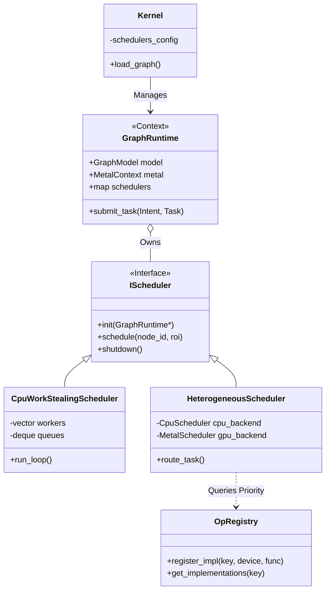

#### 1. 核心类图 (Class Diagram)



#### 2. 组件详解

##### 2.1. OpRegistry 2.0 (异构支持)
不再是一对一映射，而是支持同一算子的多种实现变体。

**数据结构**:
```cpp
enum class Device { CPU, GPU_METAL, GPU_CUDA, ASIC_NPU };

struct OpMetadata {
    Device device = Device::CPU;
    int cost_score = 100; // 启发式调度权重
    // TileSizePreference 等现有字段...
};

struct OpImplementation {
    // 统一函数签名，内部处理 Monolithic/Tiled 差异
    std::function<NodeOutput(...)> func; 
    OpMetadata metadata;
};

// 注册表改为存储列表
std::unordered_map<std::string, std::vector<OpImplementation>> impl_table_;
```

##### 2.2. IScheduler (调度策略接口)
定义了调度器必须具备的行为。注意，调度器**不拥有**数据，只操作数据。

```cpp
class IScheduler {
public:
    virtual ~IScheduler() = default;
    
    // 初始化：绑定到特定的 GraphRuntime (获取 Model, Cache 等资源的访问权)
    virtual void attach(GraphRuntime* runtime) = 0;
    
    // 核心调度入口
    // intent: 用于区分这是 RT 预览还是 HP 导出
    virtual std::future<NodeOutput> schedule(
        int node_id, 
        const ComputeOptions& opts
    ) = 0;
    
    // 状态查询 (用于 CLI 监控)
    virtual std::string get_stats() const = 0;
};
```

##### 2.3. GraphRuntime (资源容器)
`GraphRuntime` 退化为类似 PCB (Process Control Block) 的角色。

*   **持有**: `GraphModel` (内存), `GraphCacheService` (磁盘), `MetalContext` (设备句柄).
*   **持有**: `std::map<ComputeIntent, std::unique_ptr<IScheduler>> schedulers_`。
*   **职责**: 当 `Kernel` 发起 `compute(intent, node)` 时，它负责将请求路由给对应的 `IScheduler`。

#### 3. 调度与路由逻辑

##### 3.1. 算子选择算法 (Operator Selection)
当 `HeterogeneousScheduler` 拿到一个 Node 时：

1.  **查询**: 向 `OpRegistry` 查询该 Node 类型（如 `gaussian_blur`）的所有实现。
2.  **过滤**: 移除当前硬件不支持的实现（如在非 Apple 设备上移除 Metal）。
3.  **排序**: 根据 `DevicePriority` 表排序。
    *   *HP 模式*: GPU > CPU (Monolithic) > CPU (Tiled)
    *   *RT 模式*: CPU (Tiled, Micro) > GPU (如果数据传输开销低)
4.  **回退**: 如果首选失败（如显存不足），自动降级到下一优先级的实现。

##### 3.2. 动态切换
用户可以在 CLI 中实时更改调度绑定：
```bash
# 将实时预览切换为串行调试模式
ps> config scheduler.real_time = "serial_debug"
# 立即生效，无需重载图
```
实现原理：`Kernel` 调用 `GraphRuntime::replace_scheduler(Intent::RT, new SerialScheduler())`。

#### Q&A
> Q: 当前方案中，能够实现一个runtime掌握并同时运行多个scheduler吗？比如说，rt和hp的调度器以及对应的算子同时运行。

> A: 
> 
> 这是一个非常关键的问题。答案是：**是的，不仅能够实现，而且这是本架构重构的核心目标之一。**
> 目前的方案（Phase 3）通过将 `GraphRuntime` 转变为资源容器，并引入 `std::map<ComputeIntent, IScheduler*>`，从架构层面天然支持了**多调度器并发运行**。
> 以下是详细的可行性分析与实现机制说明：
> ### 1. 架构可行性验证
> #### 1.1 数据结构的支撑
> 在新的设计中，`GraphRuntime` 持有的是一个调度器映射表，而不是单一的调度器实例：
>
> ```cpp
> // include/kernel/graph_runtime.hpp
>
> class GraphRuntime {
>     // ... 资源 (Model, MetalContext) ...
> 
>     // 关键点：Intent 到 Scheduler 的映射
>     // 这意味着 RT 和 HP 可以分别对应不同的 C++ 对象实例
>     std::map<ComputeIntent, std::unique_ptr<IScheduler>> > schedulers_; 
> 
> public:
>     // 路由逻辑
>     std::future<NodeOutput> compute(ComputeIntent intent, int > node_id, ...) {
>         // 并发点：RT 请求走 RT 调度器，HP 请求走 HP 调度器
>         // 两个调度器在 C++ 层面是完全独立的线程/任务流
>         return schedulers_.at(intent)->schedule(node_id, ...);
>     }
> };
> ```
> 
> #### 1.2 数据的物理隔离 (关键)
> 为了让两个调度器同时运行而不发生数据竞争（Data Race），Phase 2 引入的 **双缓> 存机制** 起到了决定性作用：
> 
> *   **RT Scheduler**:
>     *   读取：`Node` 参数、上游节点的 `cached_output_real_time`。
>     *   写入：**仅写入** `cached_output_real_time` 和 `rt_version`。
> *   **HP Scheduler**:
>     *   读取：`Node` 参数、上游节点的 `cached_output_high_precision`。
>     *   写入：**仅写入** `cached_output_high_precision` 和 > `hp_version`。
> 
> **结论**：由于读写的目标内存地址物理分离，只要图的拓扑结构（连接关系）不发生变> 更，RT 和 HP 调度器可以安全地并行工作。
> 
> ---
> 
> ### 2. 运行时行为分析
> 
> 假设用户正在快速拖动滑块调整参数：
> 
> 1.  **T0 (用户拖动)**: 前端触发 `compute(Intent::RT)`。
>     *   `RtScheduler` (High Priority, CPU) 启动。
>     *   它只计算受影响区域的 **Proxy Micro Tiles (16x16)**。
>     *   更新 `rt_cache`，UI 刷新预览。
> 
> 2.  **T1 (用户暂停)**: 前端触发 `compute(Intent::HP)`。
>     *   `HpScheduler` (Background, Heterogeneous) 启动。
>     *   它开始规划全图的 **Macro Tiles (256x256)** 或提交 GPU 任务。
> 
> 3.  **T2 (用户再次拖动)**: `HpScheduler` 尚未完成，前端再次触发 `compute> (Intent::RT)`。
>     *   **并发发生**：此时，后台的 GPU/HP 线程仍在跑，前台的 RT 线程立即响> 应新的输入。
>     *   **资源竞争**：
>         *   **CPU**: 操作系统负责调度。由于 `RtScheduler` 线程优先级高> （QoS），它会抢占 CPU 时间片，保证流畅。
>         *   **GPU**: 如果 HP 正在占用 GPU，RT 可能会稍有延迟（取决于 > Metal 的驱动调度），或者 RT 调度器策略配置为“纯 CPU”以避免此竞争。
> 
> ---
> 
> ### 3. 实现细节与挑战
> 
> 为了完美实现这一点，我们需要在开发文档中补充以下规范：
> 
> #### 3.1 锁的设计 (Locking Strategy)
> 目前的 `GraphModel` 使用一把大锁 `graph_mutex_` 是不够的，会造成 RT 阻塞 > HP 或者反之。
> 
> *   **改进**：引入 `std::shared_mutex` (读写锁)。
>     *   **调度器 (RT/HP)**：持有 **Shared Lock (读锁)**。因为它们只修改 > `Node` 内部的 Cache 字段（这些字段应被标记为 `mutable` 或通过内部原子> 性保护），而不修改图的拓扑（增删节点）。
>     *   **图编辑 (User)**：持有 **Unique Lock (写锁)**。添加/删除节点> 时，必须暂停所有调度器。
> 
> #### 3.2 参数快照 (Parameter Snapshotting)
> *   **问题**：如果在 HP 计算过程中，RT 修改了 `Node::parameters`，HP 可能> 会读到一半旧一半新的参数，导致画面撕裂。
> *   **解决**：我们在 `ComputeService::compute_internal` 中已经实施了 **> 参数克隆**：
>     ```cpp
>     // 调度器在任务开始瞬间，深拷贝一份参数到栈上
>     node.runtime_parameters = YAML::Clone(node.parameters);
>     ```
>     这确保了即便两个调度器同时运行，它们各自持有的“本次计算参数视图”是一致且隔> 离的。
> 
> #### 3.3 调度器间的通信 (收敛逻辑)
> 在 Phase 2 中，我们提到 HP 完成后要更新 RT（收敛）。在双调度器模型下，这变成> 了跨调度器通信。
> 
> *   **机制**：`HpScheduler` 完成任务后，不直接修改 RT Cache，而是生成一个 > `DownsampleTask` 并提交给 `RtScheduler`。
> *   **代码示意**:
>     ```cpp
>     // HpScheduler 内部
>     void on_task_complete(NodeOutput hp_result) {
>         // ... 写入 hp_cache ...
>         
>         // 跨调度器投递：请求 RT 更新
>         // 注意：这里需要通过 GraphRuntime 中转，或者持有 RtScheduler 的> 弱引用
>         runtime_->get_scheduler(Intent::RT)->submit_task> ([hp_result](){
>             // Downsample hp_result -> rt_cache
>         });
>     }
>     ```
> 
> ---
> 
> ### 4. 总结
> 
> 你的构想是完全可行的，目前的架构设计（Phase 3）已经为此做好了铺垫：
> 
> 1.  **Runtime 是容器**：容纳多个 Scheduler 实例。
> 2.  **Intent 是路由键**：区分 RT 和 HP 的流量。
> 3.  **Cache 是隔离的**：物理内存分离保证线程安全。
> 4.  **Parameter 是快照的**：保证逻辑一致性。
> 
> **建议**：在 `GraphRuntime` 初始化时，默认实例化两个调度器：
> *   `schedulers_[Intent::RealTime]` = `new CpuWorkStealingScheduler> (HighPrio)`;
> *   `schedulers_[Intent::GlobalHighPrecision]` = `new > HeterogeneousScheduler(BackgroundPrio)`;
> 
> 这样一来，你的内核就真正成为了一个支持多模态并发计算的现代化图形引擎。