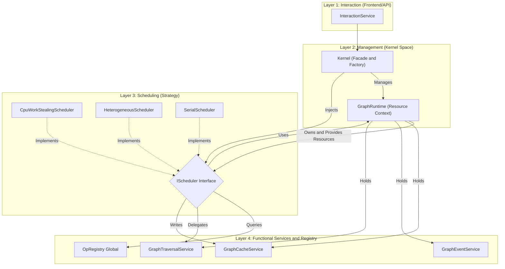

```mermaid
graph TD
    subgraph "Layer 1: Interaction (Frontend/API)"
        InteractionService[InteractionService]
    end

    subgraph "Layer 2: Management (Kernel Space)"
        Kernel["Kernel (Facade and Factory)"]
        GraphContext["GraphRuntime (Resource Context)"]
    end

    subgraph "Layer 3: Scheduling (Strategy)"
        IScheduler{IScheduler Interface}
        CpuScheduler[CpuWorkStealingScheduler]
        HeteroScheduler[HeterogeneousScheduler]
        SerialScheduler[SerialScheduler]
    end

    subgraph "Layer 4: Functional Services and Registry"
        Traversal[GraphTraversalService]
        Cache[GraphCacheService]
        Events[GraphEventService]
        OpRegistry[OpRegistry Global]
    end

    %% Dependencies
    InteractionService --> Kernel
    
    Kernel -->|Manages| GraphContext
    Kernel -->|Injects| IScheduler
    
    GraphContext -->|"Owns and Provides Resources"| IScheduler
    GraphContext -->|Holds| Cache
    GraphContext -->|Holds| Events
    GraphContext -->|Holds| Traversal
    
    IScheduler -->|Uses| GraphContext
    IScheduler -->|Queries| OpRegistry
    IScheduler -->|Delegates| Traversal
    IScheduler -->|Writes| Cache
    
    CpuScheduler -.->|Implements| IScheduler
    HeteroScheduler -.->|Implements| IScheduler
    SerialScheduler -.->|Implements| IScheduler
```