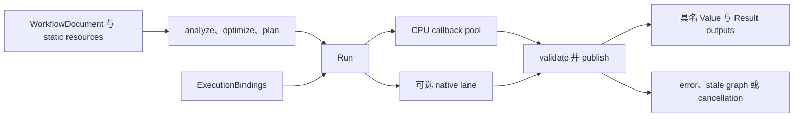

# Compiler 与本地执行

## 范围与 ownership

Compiler 验证 `WorkflowDocument`、解析 operation contracts，并生成 immutable semantic、optimized 和 physical plan 对象。`ExecutionContext` 拥有有界 CPU pool、可选 native backend lane、caches；配置 `managed_resources` 时，context 创建一个由其 runs 和仍存活 owners 共享的 resource root。Run 拥有 continuation state，只有在 callbacks、cancellation 和 graph-currentness checks 成功后才发布具名 Value 与 Result outputs。

## Planning 与 execution



`analyze` 验证 graph structure、operation availability、parameters、ports 和推导出的 metadata。`optimize` 与 `plan` 保留选中的 named output 及其 input projection。Planner 按所选 output 的 dependency contract 反向传播请求的 footprints。Run 调度已就绪的 host work，执行获准的 I/O，并按 plan 验证每次 publication。

```cpp
namespace ps {
class Compiler {
 public:
  Result<SemanticGraphIR> analyze(const GraphSnapshot&,
                                  ResourceBindings = {}) const;
  Result<OptimizedGraphIR> optimize(const SemanticGraphIR&) const;
  Result<ExecutionPlan> plan(const OptimizedGraphIR&,
                             const PlanningOptions& = {}) const;
};

class ExecutionContext {
 public:
  Result<ExecutionResult> execute(
      const ExecutionPlan&, ExecutionBindings = {},
      const CancellationToken& = CancellationToken(),
      const ExecutionOptions& = {});
};
}  // namespace ps
```

这些是 `ps` namespace 中省略其他成员的签名。`ExecutionBindings` 按 workflow port 声明绑定普通 input Values、regional sources、snapshots 或 structured `ResultRef` inputs。Result 图像输入按已声明 schema 绑定其 owning Result。Executor 将具名 Values 放入 `ExecutionResult::values`，将 structured outputs 放入 `ExecutionResult::results`。

## 统一 operation 调度

一个 node 可公开具名 outputs，每个 output 独立声明 Value 或 Result 契约。Planner 在执行前专门化所选 output 及其 input projection。Result continuation 可请求 typed Value samples、Result fields、image samples、descriptors 或有界 I/O。Coordinator 按相同 execution-root 限制准入 work、stages、I/O、relations/maps、payload 和 retained owners。Callback 可在一个 stage 消费 Control samples，再在后续 stage 请求由这些值选出的 Data support。发布的 relation 记录已消费 controls 和 data support；dirty transpose 使用同一 relation。

Whole CPU operations 可使用 host parallel ranges。CPU tile callbacks 是不可拆分的调度任务，并可在其契约允许时使用 coordinator 的 tile service。Native operations 使用已配置 native lane。Service calls 在 callback entry thread 执行；worker tasks 只能查询 cancellation 并写入已经为其准入的 scratch。GPU submissions 在 callback 退出前排空。Callback 可通过借用的 phase status reader 返回具体 native failure。

Coordinator 在调度边界依次检查 cancellation、stale graph state 和首个 sticky failure。它不会抢占进程内 callback。Callback 一旦进入，Run 会等待其退出后再释放借用 phase 和 owners。失败的 Run 返回 typed status，不会发布部分 output set。只要仍有 waiter，共享 Result producer 就保留其 captured publication；一个 waiter 的 cancellation 不会取消其他 waiter 仍需要的工作。

## 存储与资源

普通 numeric Values 保留 Value storage 契约。Structured Results 拥有 schema、descriptor facts、typed image backing、relations 和 retained input owners。图像像素使用由 planar pages backing 的 typed Result image slots，不会编码为 packed primitive Result fields。Captured Result references 固定一个 revision 下的 descriptor 与 relation evidence。

Execution root 统一计入 work、stage state、I/O、relation/map 构造、payload capacity 和 owner retention。Dependency API 返回的 `ResourceMap` 保留同一 root ownership。Admission failure 对当前 operation 是 sticky 的。释放最后一个 Result/read-window owner 后，其 backing 和 retained associations 才释放。

## 边界

Workflow/plan digests 是 identity contracts，不是 serialization 或 security boundaries。Native operation modules 作为受信任的进程内代码执行。Kernel 不拥有 daemon IPC、durable jobs、process isolation 或 recovery。源码仍使用 image Values 或已退役 planar callback 路径的 production image operations 不能经统一 Result 图像路径运行，详见[图像 operations](Image-Operations.zh.md)。
