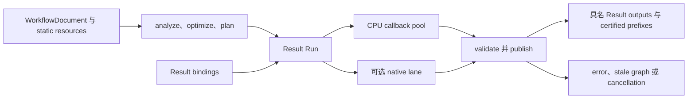

# Compiler 与本地执行

## 范围与 ownership

Compiler 验证 schema-5 `WorkflowDocument`、解析 Result operation contracts，并生成 immutable semantic、optimized 和 physical plans。当前 package 为 0.33.0，OperationTraits version 为 25；规范 identity 使用 semantic graph v20、physical plan v20 和 outer plan-cache key v16。`ExecutionContext` 拥有有界 CPU pool、可选 native backend lane、caches，以及由 runs 和仍存活 owners 共享的 resource root。未设置 `managed_resources` 时，context 使用默认 `ResourceLimits`；设置后使用显式 limits。`maximum_live_bytes` 也限制 Payload。Run 拥有 continuation state，只有 callbacks 退出且 cancellation 与 graph-currentness checks 允许 publication 后才返回具名 Results。

`WorkflowInputDeclaration` 保存 id、精确 name 和必需的 Result schema。`ExecutionBinding` 保存 name 和 owning `ResultRef`。Value 是 Result storage 和 codecs 使用的 typed backing。输入 metadata 描述 Result schema；tensor shape、facets 和 layout 属于 `ResultTensorSpec`。

`FrozenExecution` 共享包含 plan、binding snapshot、operation registry 和 execution identity 的 immutable state。只要 handle 仍持有 state，`plan()` 返回的借用引用就有效。`for_region` 建立独立 tile plan 和新 state，同时保留捕获的 bindings、registry 和 identity。每次 frozen execution 在进入 Run 前捕获 handle，并为 structured execution 提供 plan 的 shared owner。调用方未提供 plan owner 时，普通 `ExecutionPlan` 调用借用该 plan。

对于 frozen-plan Result producer，只有在另一个 live caller 仍需要该 producer 时，取消才可能在顶层 callback 仍运行时返回。Run 会关闭已取消 caller 的 subscription，并向 context 的 `SharedResults` registry 注册 coordinator 强引用。Peer 等待 Result 时，会在 peer 当前调用线程 pump 该 registry；handoff 不创建 worker。Coordinator 等 callback 退出后才检查 actor state 或更改 driver thread。如果注册失败，或 ownership 转交前 peer 已离开，原调用撤销临时注册并同步 drain。借用 plan 的调用及没有 live peer 的 Run 也会同步 drain。这种 handoff 不会让同步 cache replay 或 worker 内部路径获得独立取消能力。

Context shutdown 会取消 shared work、释放 registry table lock，再 drain parked coordinators。Registry 强持有 parked coordinators，而 producer entries 不持有 drivers，因此 pending callback 所需 state 可保持存活，同时不会形成 entry 到 driver 的引用环。`DemandHandle` 请求会用当前 generation 捕获 frozen plan；replacement 推进 generation，旧请求仍保留原 plan 和输入 owners。`replace_bindings` 在 handle mutex 内复制 frozen bundle 的 owning Root，建立其 Root allocation scope 后再获取 call lease。这样 setup work 仍由 Root 计费，并防止 context shutdown 在 Root 读取和 call admission 之间退休该 bundle。

Structured execution 的 coordinator Host 在 Run 内持有 actor 与 Run 操作。`StructuredResultCache` 拥有 completed-result proof、replay、snapshot 和 quota 状态；它通过单次调用的借用 context/actor views 工作，并通过同步 Host 请求 Need supply 和 candidate adoption。`PublicationValidationServices` 也只借用于一次 validation：它提供 work 准入、cancellation、stop 状态和 limits，供 validator 检查 publication facts。Validator 返回 status 与 retirement intent，只有 coordinator 会退休 actor。这些组件明确了所有权边界，但 Need dependency graph 仍由 coordinator 管理。

Joint continuation state 是非模板的编译组件。它保存弱 `JointParticipant` 引用，这些引用与各 Actor 共用同一 control block；Run 内的 `JointHost` 则拥有 Actor 和 Run 的状态修改。Detach 或 retirement 期间，coordinator 持有强 cohort guard。Fallback release 按以下顺序执行：恢复 baseline、导入已完成 member 的 ancestry、清理 continuation state、detach members、丢弃活动 attempt，最后将活动 member 标记为 restart。该顺序保留已完成 evidence，并确保清理结束前 participant state 仍然存活。Joint 组件还负责常规 submission retirement、启动失败与 fallback 处理，以及接受 cohort continuation。Submission 在 carrier 退休前取得各 participant 的强 owner，因为 carrier 退休可能释放持有它们的 task capture。组件通过借用的 `StructuredJointHost` 退休 carrier：Host 执行 coordinator 的 actor finish 并原样返回其状态，随后组件清除每个 participant 的 pending submission。C2 Waiting 与 domain finality、Need 预检、publication transaction 和调度仍由 coordinator 负责。

## Planning 与 execution



`analyze` 验证 graph structure、operation availability、parameters、ports 和推导出的 schemas。静态 metadata closure 沿相关 operation output 的全部输入展开，使 compiler 能校验 schema、保留静态 specialization，并让这些输入参与 semantic identity。Executable closure 从具名 outputs 和 side-effect roots 开始，再沿各选定 output 的 `input_indices` 展开；未指定 projection 时使用全部输入。Planner 按所选 output 的 dependency contract 传播 requested footprints。Backend 选择和准入只针对 executable outputs。仅用于 metadata 校验或 specialization 的 side-effect-free GPU-only producer 不会运行；在 `CpuExact` 下直接请求该 GPU-only output 仍返回 `BackendUnavailable`。Run 调度已就绪工作，执行获准的 I/O，并按 plan 验证每次 publication。`ExecutionOptions::result_publication` 在 Result prefix 获得认证后通知调用方。Prefix 不代表整次 execution 成功；callback failure 会停止 Run，并遵循现有 failure、cancellation 和 retirement 路径。

```cpp
namespace ps {
struct WorkflowInputDeclaration {
  std::uint64_t id;
  std::string name;
  std::shared_ptr<const SchemaTemplate> result_schema;
};
struct ExecutionBinding {
  std::string name;
  ResultRef result;
};
struct ExecutionOptions {
  std::function<Status(ValueRef, const ResultRef&)> result_publication;
};
struct ExecutionResult {
  ResourceMap<ResultRef> results;
};
}
```

片段展示调用方相关的 Result 字段，省略默认成员值、其他 diagnostics 和 execution controls。`ExecutionContext::execute` 接收这些 bindings 并返回具名 Results。C++ operation 入口为 `start_result`，它返回 `ResultContinuation`；可选 joint callbacks 会组合兼容的 Result 工作。

## Operation 调度与错误

Result continuations 请求 typed tensor samples、Result fields、descriptors、relations 或有界 I/O。Coordinator 按 execution root 的 work、stages、I/O、relations/maps、payload 和 retained owners 限制准入请求。Continuation 可以先在一个 stage 消费 Control samples，再在后续 stage 请求由它们选出的 Data support。Publication relation 记录已消费的 controls 和 data support；dirty transpose 使用该 relation。普通 execution 会将每个非 side-effect-free operation 作为强制 root 执行，即使没有具名 output 选择它。Fragment 和 atom execution 仅在 query 包含非空 demand 时执行这些 roots；空 query 会跳过无关副作用 roots。同一 Run 内，副作用 tensor output 的内部 actor identity 使用 slot 0 和完整 coverage，因此后续请求复用该 actor。这个 identity 规范化不授权其他 tensor slots；每个 slot 仍须通过自己的 Need 和 publication 检查。副作用工作不会跨 Run 共享或缓存；强制 root failure 或 cancellation 会使整个 Run 失败。

`ResultContinuation` 以非阻塞 atomic admission 保证同一时刻只执行一个 poll。并发或重入 poll 返回带 `Protocol/Group` detail 的 `InvalidArgument`，不会进入 callback，也不会修改活动 phase、首个 failure 或 work accounting。Admission 会一直保持到异常处理与 publication 检查结束。调用方必须在 continuation 处于 inactive 时才移动或销毁它；state 只销毁一次。`OperationRegistry::start_result` 在 operation factory 前后检查 cancellation。Factory 已进入后观察到 cancellation 时，取消优先于 allocator failure、factory status 和无效返回 state；返回的 state 会在函数返回前销毁，definition lease 保持到销毁完成。

Whole CPU operations 可使用 host parallel ranges。CPU tile callbacks 是不可拆分的调度任务，并可在契约允许时使用 coordinator tile service。Native operations 使用配置的 native lane 和 services。Service calls 在 callback entry thread 执行；worker tasks 可查询 cancellation，且只能写入已准入 scratch。GPU submissions 在 callback 退出前排空。Callback 可通过借用的 phase status reader 报告 native failure。

具有 Dependency region rule 的 Result operation 也可以声明 `OperationTraits::cpu_staged_tiles`，并在其发布 callback 内使用 planar staged tile 服务。`image.stmap` 对至少 65,536 像素的请求这样做：coordinator 准备有界的输出像素 span，提交一个几何只取决于 span 数的 tile stage，把 stage 上限设为四个 worker，并在发布提交前 join 所有 tile。Tile callback 只获得不可变输入和互不相交的原始输出 run；Needs、window 服务、分配、work 计费和发布都留在 coordinator 上。`ExecutionDiagnostics::cpu_stage_count` 和 `cpu_tile_callback_count` 汇总这些 stage 和 tile，与 continuation poll 分开计数。见[依赖采样](Dependency-Sampling.zh.md)和[并行执行模型](Parallel-Execution-Model.zh.md)。

`OperationTraits::allows_cpu_fallback` 允许 GPU attempt 返回 `BackendUnavailable` 后改用 CPU 重试；operation 必须同时提供两种实现。Start-time retry 要求 CPU support、trait flag 开启、traits 为 deterministic 且 side-effect-free，并且 cancellation、currentness、operation failure 与 host service 检查均通过。Poll-time retry 还要求 traits 为 deterministic 且 side-effect-free、attempt 可安全重试，并且没有已发布 output、mandatory I/O、checkpoint 或 block callback、native dispatch、field I/O、实际 cancellation、stale plan 或 host stop。重试状态必须是未限定的 `BackendUnavailable`（`reason=None`，origin 为未指定或 backend，scope 为未指定或 group）。Host service 单独记录 retry veto：即使首个错误仍作为最终报告，之后出现的 typed resource、protocol、callback、observer 或其他不可重试错误也会阻止回退。Executor 释放失败的 GPU continuation 与读取能力，切换 query 到 CPU，并用新的 failure owners 启动下一次 attempt。Root work 与 stage 用量继续累计。其他错误直接传播，不触发重试；带 fallback-taint 的结果不进入可选 checkpoint、block 和 completed-result caches。

Coordinator 在调度边界依次检查 cancellation、stale graph state 和首个 sticky failure。它不会抢占进程内 callback。Callback 进入后，Run 等它退出再释放借用 phase 和 owners。失败的 Run 不会返回部分 output set。只要仍有 waiter，共享 Result producer 就保留 captured publication；一个 waiter 的 cancellation 不会取消其他 waiter 仍需的工作。

## Cache 统计

`ExecutionContext::cache_statistics()` 返回 retained-result cache 和 structured Result sharing 的同步 context-local 观察值；每项计数保留其来源范围。Structured Result 的 `shared_computations` 只在 non-producer 成功 acquire 后增加，例如 waiter 加入活动工作或复用完成的 weak Result。同一 Run 再次查询同一 actor 不会重复计数。`in_flight` 包含 producer lease 存活期间尚未完成的 structured producer epochs。Weak Result references 不增加 retained entries 或 bytes。复用路径不会为未运行的 callback 生成计时数据。

## 存储与资源

Structured Results 拥有 schema、descriptor facts、typed tensor backing、relations 和 retained input owners。图像像素使用由 planar pages 支撑的 typed Result tensor slots，不会编码成 packed primitive Result fields。Captured Result references 固定一个 revision 下的 descriptor 与 relation evidence。Execution root 计入 work、stage state、I/O、relation/map 构造、payload capacity 和 owner retention。内部 dependency-evidence records 保留不可变 ancestry 与 support facts，但不保留输入 payload；每 Run recorder、导入集合和冻结查询 bundle 分别拥有自己的状态。返回的 `ResourceMap` 保留相同 root ownership。释放最后一个 Result 或 read-window owner 后，其 backing 和 retained associations 才会释放。

`ExecutionDiagnostics::peak_live_bytes` 表示当前 Run 归属的受控 Payload backing 已提交容量峰值。并行 callback 和该 Run 自己的 shared producer 都会计入其 Run observation；调用方执行前已有的输入 backing 与先前完成 cache 中的 storage 不计入。`planned_peak_bytes` 表示预留 Payload capacity 峰值，包括完整 CPU reservation 和增量 native allocation；这是容量预留值，不是已提交字节数。`shared_peak_live_bytes` 是该调用使用过的活动 shared producer epochs 中最大的分配峰值。Joint shared producer 按其 epoch 的 aggregate peak 统计。复用已完成的 cache Result 不会带入之前 producer epoch 的峰值。这些计数描述 Root 控制的 backing，包括已发布的 planar pages，不代表进程 RSS。

## 边界

Workflow 和 plan digests 标识 compiler content，不是 serialization 或 security boundaries。Native operation modules 作为受信任的进程内代码执行。Kernel 不拥有 daemon IPC、durable jobs、process isolation 或 recovery。已注册的 production image operation 只有在实现所需 typed Result contract 后，才能使用统一 Result image 路径；详见[图像 operations](Image-Operations.zh.md)。
