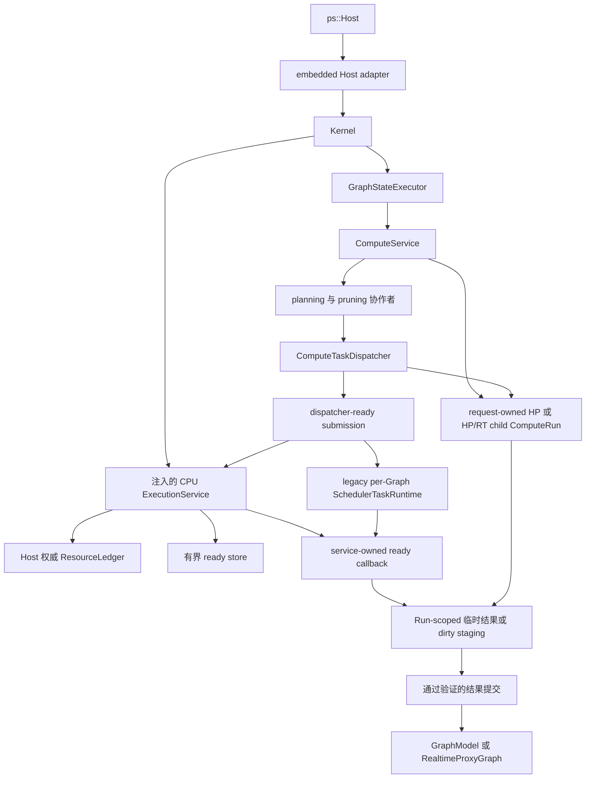

# 计算边界

本文说明当前计算子系统内部的软件行为和实现所有权。

## 范围

计算子系统接收一个通过验证的内部请求，为一个 HP domain 或协调后的 HP/RT sibling 派生工作，
执行 operation，并发布 intent-specific result。它不拥有图文档持久化、前端渲染、daemon
transport 或进程级 operation plugin
生命周期。

公共调用方只能通过 `ps::Host` 进入计算。Embedded adapter 把公共 `HostComputeRequest` 值
转换为内部 Kernel 和 `ComputeService` 请求。公共 API 不暴露 `ComputeService`、plan、任务图
或 scheduler pointer。Request、propagation、planning 与 execution geometry 直到
`NodeExecutor` 都保持为 `PixelRect`/`PixelSize`；OpenCV geometry 只存在于 provider 或
算法实现内部，并且位于真正消费它的 library call 处。

## 所有权图

`GraphStateExecutor` 拥有当前每图排他性。即使 ready callback 在 scheduler worker 上执行，
规划和派发仍属于 compute 职责。

当前排他机制是有界串行 FIFO lane。每个处于 accepting 状态的 `GraphStateExecutor` 恰好拥有一个
worker。其队列最多容纳 64 个等待 callback，不包括至多一个正在执行的 callback，因此每个 Graph
最多拥有 65 个已经 admission 的 graph-state callback。队列已满时，`submit()` 会阻塞 caller；它
不会创建额外 lane worker，也不会丢弃或绕过已经 admission 的 work。Admission 之前不保证 producer
fairness，但已经 admission 的 work 会按 FIFO 执行。

每次 submission 都会返回 packaged-task future，精确保留 callable 的 value、reference、`void`
completion 或 exception。销毁 future 不会等待或取消 task；executor lifetime 会保留已经 admission
的 work。Callback 不能向自己的 lane submit，也不能关闭自己的 lane：worker re-entry 会在等待队列
之前抛出 `std::logic_error`。唯一的 worker 拥有整个 callback，包括 scheduler submission、
completion wait 和 visible commit。

`close_and_drain()` 对并发调用与重复调用都保持幂等。它会停止 admission，让被满队列阻塞的
producer 以 `std::runtime_error` 被唤醒，按 FIFO 排空已有 work，并在返回前 join worker。每个
caller 都等待自己加入的持久 close generation；失败 stop 后的 restart 可以在延迟 caller 被唤醒前
重新开放后续 accepting generation，但不会困住该 caller，也不会创建第二个 worker。
`GraphRuntime` 会在 scheduler teardown 前完成该 join。如果显式 close 随后在 scheduler shutdown
中失败，Kernel 会先启动一个 replacement lane worker 再返回失败，使保留的 session 仍可重试。
不同 graph 具有独立的 worker 和队列。Host composition 的 resource ledger 不对这些 lane
worker 或固定 service thread 计费；它们保持为基础设施。其 CPU 维度改为准入每个 Run 的执行权，
以及 legacy scheduler owner 的保守 slot。

## 当前协作者

| 模块 | 当前职责 | 不拥有 |
| --- | --- | --- |
| `ComputeService` | 请求验证、intent 协调、创建/settle 一个 HP Run 或不同的 HP/RT child Run、协作者构造和最终结果选择 | 前端值、worker thread、图文档或目标 `RunGroup` policy |
| `ComputeRun` | 不可变的单 domain HP/RT descriptor、单调 phase、唯一 terminal outcome、通过共享 control 对 full-plan/temporary storage 或 dirty-HP staging storage 的所有权、稳定 lease，以及复合 task identity | 配对 realtime grouping、Graph state、worker、权威 revision commit、cancellation 或 resource admission |
| `ComputeCachePolicy` | HP cache eligibility 与缓存路径决定 | 磁盘 I/O 所有权或 operation 执行 |
| `NodeInputResolver` | runtime parameter 和 ready image input | 图遍历或输出提交 |
| `FullTaskGraphExpander` | 一个 graph generation/domain 的完整 node/tile task 形态 | 请求目标、cache pruning、dirty pruning |
| `NodeCacheTaskGraphPruner` | 目标/依赖锥和 cache-aware 请求 plan | 新 node 或 tile task 形态 |
| `ComputeDispatchPlanBuilder` | cache-pruned HP plan 和 inspection record | scheduler queue |
| `DirtyRegionPlanner` | 图级 dirty propagation snapshot | 计算依赖计数 |
| `DirtySnapshotTaskGraphPruner` | 从既有 plan 选择活动 dirty work | task expansion |
| `IntentUpdateCoordinator` | HP-only 或 HP/RT sibling 语义 | 物理优先级或 worker 所有权 |
| `ComputeTaskDispatcher` | Dependency counter、ready release、temporary-result indexing、completion、exception、full HP commit 与 dirty source-first submission helper | Run storage、Graph topology derivation、dirty staged commit 或 scheduler policy |
| `TaskSubmissionPlan` | 一个 full HP request 的 Run-owned dense index、依赖状态、exact-once task state、variant、结果槽与 callback owner | Scheduler worker、Run terminal state 或 dirty-path execution |
| `ReadyTaskSubmission` | 一个 dependency-ready task 的 move-only 不可变 metadata、复合 task identity、匹配 Run lease 与 owned executable | Planning、dependency derivation、Graph/cache authority 或 commit |
| `ExecutionService` | 一个注入的固定内建 CPU worker domain、一个 Host 权威 `ResourceLedger`、按 entry/byte 有界的 high/normal ready storage、完整 Run resource vector 的原子准入、按 Run 隔离的 completion/failure/trace settlement，以及 HP/RT dirty/preflight 执行 | Planning、dependency、Graph/cache state、公平性 policy、GPU/plugin 执行、lifecycle admission registry 或 visible commit |
| `NodeExecutor` | 一致的 monolithic/tiled operation 调用 | 图变更策略 |
| `ComputeMetricsRecorder` | compute event、timing、benchmark event 和 debug metadata | scheduler trace 所有权 |
| `SchedulerFactory` | 在构造前解析 `0..8` worker 请求，并规划每个 scheduler 的保守 slot 计费 | 进程容量所有权或 graph-state access |
| `ResourceLedger` | 原子预留经过检查的 CPU、retained-memory、scratch、ready-entry 与 ready-byte vector；签发有界 child grant；在 parent/child ownership 结束后精确释放 vector | worker 构造、ordering policy、task dependency、对 device/I/O/plugin resource 的猜测或 lifecycle admission |
| `ReservationOwnedScheduler` | 让 move-only reservation 保持到 concrete scheduler shutdown 与销毁完成 | 容量 planning 或 task-graph correctness |

Compute collaborator 位于 `src/lib/compute/`；ledger 位于 `src/lib/runtime/`，legacy
scheduler planning/ownership 位于 `src/lib/scheduler/`。这些类都是私有实现模块，不构成可安装 API。

当前内建 CPU 准入会把强制、经检查的 service envelope 与可审计的 adapter envelope 组合起来。
Run/control/plan 或 phase-context 共享的 retained storage 只计费一次。统一的逐任务 retained 与
scratch demand 按最大 callback 并发数相乘，ready entry 与 byte 则按所有逻辑任务相乘，因此
dependency release 已被预先覆盖。初始与 dependent entry 使用同一个 estimator 和 insertion
boundary。复制的 graph-identity metadata 按实际 string capacity 加终止空字符计费。在每个 dirty
每个 initial value 与 ready grant 都移动到暂存 queue entry 后，`ExecutionService` 会在发布
active Run 和等待 settlement 之前销毁 caller-side submission vector 的 backing；此后只有暂存
entry 以及 bounded store 保留这些 submission。在每个 dirty 或 connected-preflight service
segment 之前，adapter 会加入当前 staging/snapshot storage 与去重后的缺失 staging-map entry，
其中包括有序 map linkage，以及确定性的空 output metadata 或 seeded 可见 output metadata。
HP downstream demand 会通过仍存活的 `ComputeRunLease` 读取当前 Run-owned write buffer，再由
phase-local estimator 只加入仍缺失的 entry；这样 source 创建的 entry 会继续被计费，同时不会
重复计费。

Dirty HP 与 RT demand 还会计入完整的 request-owned `DirtyNodeSynchronization`：shared
allocation、unordered-map bucket、value 与 linkage、每个由 `unique_ptr` 拥有的
`std::mutex`，以及可见 object storage。Allocator-private map metadata 与不透明的 platform
mutex allocation 仍排除在外。并发 HP/RT sibling 会在两个独立 phase reservation 中保守地
计入同一个 shared synchronization object。这种有意的双 reservation 允许任一 sibling 先
settle，同时不会让仍存活 Run 的 shared ownership 失去计费覆盖。Estimator 只计算所有权与
大小均可见的 Host-owned C++ storage；不会伪造未来由 operation 产生的 image pixel、
named-value 增长，以及不透明的 backend、device、plugin 或 allocator-owned allocation。
当前内建 adapter 声明 scratch 为零，仅因为它们不拥有需要独立计量的固定 Host scratch。

在 process-service dirty source segment 期间，source context 拥有外层 task
`std::function` 的左值副本，而该外层 function 仍保持存活。因此 source demand
会在 context-owned target 之外额外加入一份经审计的 callable payload。Downstream
context 通过 move 接收该外层 callable。由于 C++17 不要求 moved-from
`std::function` 为空，adapter 会在 context 构造成功后、submission 构造、phase
retained-demand 计算或准入前显式清空外层 holder；构造失败则通过正常栈展开释放
外层 owner。因此 downstream demand 只覆盖 context-owned target，不依赖标准库的
moved-from 表示。

Issue #70 有意删除已安装的 inline `kSchedulerWorkerProcessMax` 常量。引用该常量的源码 consumer
必须停止依赖这项 policy constant；不提供 alias 或已安装 public replacement。组合 limits 现在使用
source tree 私有的 `ExecutionResourceLimits`。Scheduler ABI v2 的 object layout、vtable 与数字
plugin handshake 保持不变；完整的 scheduler ABI replacement 仍由 issue #75 负责。

## 请求行为

1. `Kernel` 解析 session 并进入图状态访问边界。
2. `ComputeService` 验证 target、intent、dirty ROI、cache flag 和 execution strategy。
3. 对于非 realtime HP，`ComputeService` 在 planning 前创建一个 `ComputeRun`；对于 realtime，
   它会在 preflight 前创建不同的 HP 与 RT child Run。每个 Run 都捕获 fresh id、session
   identity、只表示提交时拓扑的 revision、target、单 domain intent、full 或 interactive
   quality 与显式 QoS。目前尚无目标 `RunGroup`。
4. 在 extent、ROI 或 task-shape 决定使用连接参数之前，parameter producer 会稳定为一个
   request-local HP snapshot。
5. Planner 展开一个 domain 的完整 task 形态，再裁剪到请求目标和依赖锥。
6. Dirty request 从该 plan 选择活动 work set；dirty 状态不会创建新的 task 形态。
7. 顺序执行 inline 遍历同一请求语义。每个内建 CPU 并行阶段都会 materialize 保留 Run lease
   与 `(RunId, RunLocalTaskId)` 的 move-only `ReadyTaskSubmission`，并且只把 ready work 发送到
   固定 `ExecutionService`。Full HP 使用 `TaskSubmissionPlan`；preflight 与 dirty HP/RT 使用
   heap-owned phase context。Serial、GPU 与 plugin route 保留各自选定的 per-Graph scheduler。
8. Worker 写入 Run-owned full-plan 临时结果或 dirty-HP staging。RT staging 仍由 sibling
   callback 局部持有，但所有 service callback 都会在同步 settlement 前保留 RT child lease。
   只有相应 commit path 能修改可见图状态。
9. 单个 HP Run 或每个 realtime child 会在输出验证或精确异常捕获后独立发布唯一
   success/failure。Coordinator 只有在两个 child 都 settle 后才返回 RT output；随后结果、事件、
   计时和错误通过 Host value 边界复制返回。

## 规划不变量

- Full expansion 以 graph topology generation、compute intent 和 task-shape configuration 为键。
- 当当前 input/parameter 可能在拓扑不变时改变 output extent，force-recache 会使可复用 expansion
  失效。
- 请求目标、cache availability 和 dirty 状态裁剪既有 task 形态，不会重定义图拓扑。
- 只要仍有由 `ComputeTaskGraph` 派生的 scheduler-visible callback 可能执行，该图就不可变。
- HP 与 RT 是独立 compute domain；一个 plan 不创建跨 domain task 依赖。
- Host、graph、planning、dirty work-set、staged-write 与 `NodeExecutor` 边界携带内核自有的
  `PixelRect`/`PixelSize`，绝不携带 OpenCV geometry。
- 在可行时，tiled input normalization 每次 node invocation 只执行一次，而不是每个 tile callback
  执行一次。

这些规则使规划保持确定性，并让 scheduler 独立于图语义。因此，规划成本遵循先 full
expansion、再 pruning；lazy task creation 不属于当前 planning contract。

## Dispatcher 与 Scheduler 边界

Dispatcher 拥有请求正确性，而 `ComputeRun` 拥有当前 full HP storage：

- dependency counter 和 dependent map；
- source-first dirty task release；
- task reference accounting；
- 对 Run-owned 临时结果槽的 indexing 与 transition；
- exception normalization 和 completion aggregation；
- 空 plan 验证；
- 最终 target 选择与 full HP commit；dirty executor 在复用 source-first submission helper 后拥有
  自己的 staged commit。

选定的物理 domain 拥有当前机制：

- worker lifecycle 和 ready queue；
- service 中按 Run 隔离的 settlement，或 legacy scheduler 中的 batch/epoch state；
- 实现特定 task ordering；
- completion 和 exception publication；
- 通过 Host context 发布有界 trace。

两条 route 都不会收到 `GraphModel`、`ComputeTaskGraph`、`DirtyRegionSnapshot` 或 cache
authority。新就绪的 dependent work 由 `TaskSubmissionPlan` 释放：迁移 route 会创建另一个
`ReadyTaskSubmission`，legacy route 则推送另一条 lease-backed callback 或 dirty handle。

Issue #70 的 CPU service 在 Kernel 之前显式组合，并直接拥有一个固定 worker pool、一个 Host
权威 ledger 和一个有界 ready store。配置只会解析并冻结一次 `[1,8]` 个基础设施 worker；Graph
load、replacement、Run execution 与 dirty 阶段都不会调整其大小。每个 Run 在发布前原子预留
完整且经过检查的 CPU/retained/scratch/ready vector。Initial 与 dependency-released work 都
必须持有匹配的 ready-entry/byte grant，并进入同一个 high/normal store；从队列移除时会把该 grant
交换为 CPU/memory/scratch 执行权。Completion、failure 与所有异常路径都恰好释放一次精确 vector。
独立 Run 仍相互隔离。High-before-normal 只是 priority separation，不是最终 cross-Run fairness、
cancellation 或 policy authority。

两个 intent 的内建 CPU binding 在 `GraphRuntime` 中都不拥有 owner。Serial、GPU 与 plugin
scheduler resource 仍按 Graph 和 intent 拥有，但其保守 CPU-slot reservation 来自 Run 共用的
同一个 `ExecutionService` ledger。Legacy replacement 会在旧 owner 保持存活时预留 candidate
headroom。内建 serial 计费为零；已注册 ABI v2 plugin 按解析后的 grant 计费；内建
GPU/heterogeneous 还要计入潜在 device worker。Ledger 不会虚构 device、I/O 或 plugin-specific
dimension。

## OpenCV Operation 并发

仓库自有 CPU OpenCV operation 是可重入的 provider 工作。Builtin provider 不再具有进程范围的
operation mutex。其 monolithic `convolve`、`resize`、`crop`、`extract_channel`、
`gaussian_blur`、`add_weighted`、`abs_diff` 与 `multiply` callback，以及 tiled
`curve_transform`、`gaussian_blur`、`add_weighted`、`abs_diff` 与 `multiply`，可以跨 tile、
Graph 和 HP/RT intent route 并发运行。Callback input 不可变；可变 `cv::Mat` header、temporary
与 output region 由 callback 局部拥有或 task 独占。

Registry 边界遵循同一规则。Registry lock 会串行化 ownership mutation、发布、一致 snapshot
capture 与卸载，但会在 callback invocation 前释放。因此，每个 provider 都必须保证 callback
可重入，或自行同步其共享可变状态。共享 operation key、device、intent 或 callback owner 绝不
意味着单线程执行。

可选 OpenCV provider 会在发布自身 callback 前恰好一次调用 `cv::setNumThreads(1)`。它使用
`cv::Mat`，不调用 `cv::ocl::setUseOpenCL(false)`，也不会在 callback 可能活跃时重新配置
OpenCV threading。其 callback fence 会在仍处于 provider 代码内部时捕获注册算法抛出的每个
`cv::Exception`。OpenCV 资源耗尽会变成新建的 `std::bad_alloc`；其他 OpenCV failure 会变成
携带 `GraphErrc::ComputeError` 的 host-owned `GraphError`。因此，已准入的 scheduler worker
grant 是仓库自有的外层 CPU parallelism，而 OpenCV 内部 CPU parallelism 保持禁用。

`PHOTOSPIDER_BUILD_OPENCV_OPERATION_PROVIDER=OFF` 会省略该 provider 的 callback，但依赖中立
core operation 仍保持注册。Registry 与 v2 registrar 不依赖 OpenCV：其他 provider 可以发布
缺失 operation，也可以通过相同 slot 替换已启用的 OpenCV operation。由 manager 驱动的卸载会
退役 replacement，并恢复已捕获的 predecessor。

围绕真实 backend state 的同步仍由 provider 局部负责。Metal Perlin provider 保留一个
DSO-private mutex，保护其共享 Metal device、queue、pipeline 与 buffer；该 mutex 既不是 OpenCV
operation lock，也不是 scheduler exclusivity contract。仓库自有 provider 之外的 OpenCV 使用、
第三方内部 thread 与 platform runtime worker 仍不计入 scheduler worker accounting。

[ADR 0004](../../adr/zh/0004-opencv-cpu-operations-are-reentrant-provider-work.zh.md)记录本项决策。
长期 integration coverage 会证明 `1/2/4/8` grant 对应精确 callback overlap，以及单 worker 与
八 worker 输出按位相同；手工原生扩展性证据记录在
`../../development/zh/Testing-and-Validation.zh.md`。
[ADR 0002](../../adr/zh/0002-external-libraries-are-kernel-adapters.zh.md)与精确的
[依赖中立内核目标](../../roadmap/zh/Kernel-Evolution.zh.md#依赖中立内核)会把 OpenCV algorithm、
codec、exception translation 与 process state 放入可选 provider/adapter，而不再让它们定义目标
kernel 语义。

## Intent 与提交边界

`GlobalHighPrecision` 和 `RealTimeUpdate` 描述业务语义，而不是资源策略。Real-time update
协调一个 RT proxy sibling 和一个 HP authoritative sibling；每个 sibling 都有自己的 domain plan、
dirty snapshot、staged output 和 scheduler selection。

`IntentUpdateCoordinator` 通过两个 asynchronous call 建立当前 sibling concurrency。选中的
scheduler 只执行每个 sibling 内部的 ready work；它不会创建 sibling relationship，也不会从 task
metadata 推导该关系。

当前普通 compute policy 会持有每图独占访问直到可见提交。Dirty path 已使用更窄的 staged buffer：

- `RealtimeProxyWriteBuffer` 只提交到 `RealtimeProxyGraph`；
- `HighPrecisionDirtyWriteBuffer` 在 sibling commit gate 打开后，把权威 HP output 提交到
  `GraphModel`。

该 staging 会防止尚未组装完成的 tile output 可见，但它还不是通用 cancellation 或 graph revision
策略。

## 故障与生命周期语义

- 非法 target、intent/ROI 组合、planning contract 和 operation failure 通过分类图错误和 Host
  status value 报告。
- 资源耗尽可以按已记录的非析构 Host 边界传播为 `std::bad_alloc`。
- 超过八的 worker 请求、与固定 service 数量冲突的正数请求，或未知 scheduler type 会作为
  `InvalidParameter` 失败；准入 Run 或 legacy owner 时的 ledger 耗尽会保留
  `GraphErrc::ComputeError`。
- 固定 service worker 作为不计费的基础设施一直存活到 service 析构。Active Run reservation 与
  legacy scheduler reservation 共用 ledger CPU 维度。Legacy reservation 在 teardown 期间比
  concrete worker 活得更久：candidate rollback 只归还 candidate 容量，成功的 graph close 或
  Host 销毁恰好一次归还 retained capacity，legacy replacement 需要 transient headroom。
- 一旦内建 CPU 选择成功配置固定 pool，即使发起该选择的 load 随后在 document ingestion
  阶段失败，未发布的 Graph runtime 与 legacy candidate owner/reservation 仍会回滚，而
  不计费的 Kernel-lifetime service 配置会继续保留。
- 已 admission 的 scheduler batch 会在异常离开当前请求前 settle。
- Operation callback 可能已经产生外部副作用；staged graph output 不会回滚这些副作用。
- Scheduler-backed full HP work 不再借用 raw `TaskExecutor`。`TaskSubmissionPlan` 拥有其
  runner。内建 CPU ready work 以 `ReadyTaskSubmission` 跨越 service boundary；legacy full HP
  使用 owned callback。两者都保留 `ComputeRunLease`，failure publication 必须匹配
  `(RunId, RunLocalTaskId)`。只有 legacy 路径会用空 borrowed-handle batch 建立 scheduler epoch。
  内建 CPU dirty/preflight 工作使用 heap-owned phase context 与 child Run lease；只有 legacy
  dirty scheduler 保留同步 borrowed-handle 路径。

## 边界原理

把 planning、ready detection、physical execution 和 commit 分离，会得到四个独立正确性点：

1. 无需 worker pool 即可测试 Graph 与 ROI 语义。
2. Scheduler 可以改变 ordering，而不拥有 Graph 状态。
3. 临时输出可以在可见前验证。
4. 物理执行所有权与 dependency correctness 保持可分离。

[ADR 0003](../../adr/zh/0003-process-owned-execution-resources.zh.md)、
[ADR 0007](../../adr/zh/0007-compute-runs-and-process-execution-have-separate-owners.zh.md)与精确的
[进程执行域目标](../../roadmap/zh/Kernel-Evolution.zh.md#进程执行域)记录了已接受替代方向和详细
所有权契约。本文是截至 issue #70 的权威说明：固定多 Graph HP/RT CPU service、ownerless 内建
CPU binding、不同的 realtime child Run、owned dirty/preflight submission、原子 resource
vector admission、有界 ready storage，以及共用一个 Host ledger 的 legacy per-Graph scheduler。
权威 revision、`RunGroup`、lifecycle admission、cancellation、supersession 与最终 policy
仍是未来行为。

## 实现与验证入口

- `src/lib/compute/compute_service.*`
- `src/lib/compute/compute_run.*`
- `src/lib/compute/execution_service.*`
- `src/lib/compute/task_graph_planning.*`
- `src/lib/compute/compute_dispatch_plan_builder.*`
- `src/lib/compute/compute_task_submission.*`
- `src/lib/compute/compute_task_dispatcher.*`
- `src/lib/compute/dirty_region_planner.*`
- `src/lib/compute/dirty_update_executor.*`
- `src/lib/compute/intent_update_coordinator.*`
- `src/lib/core/ops.cpp`
- `src/lib/providers/configured_operation_providers.*`
- `src/lib/providers/opencv/*`
- `src/lib/runtime/resource_ledger.*`
- `src/lib/scheduler/scheduler_factory.*`
- `src/lib/scheduler/scheduler_worker_limits.*`
- `src/lib/scheduler/scheduler_reservation_owner.*`
- `tests/integration/test_compute_service_split.cpp`
- `tests/integration/test_scheduler.cpp`
- `tests/integration/test_resource_admission.cpp`
- `tests/unit/test_scheduler_factory_plan.cpp`
- `tests/unit/test_scheduler_reservation_owner.cpp`
- `tests/unit/test_resource_ledger.cpp`
- `tests/unit/test_compute_run.cpp`
- `tests/unit/test_propagation_contracts.cpp`
