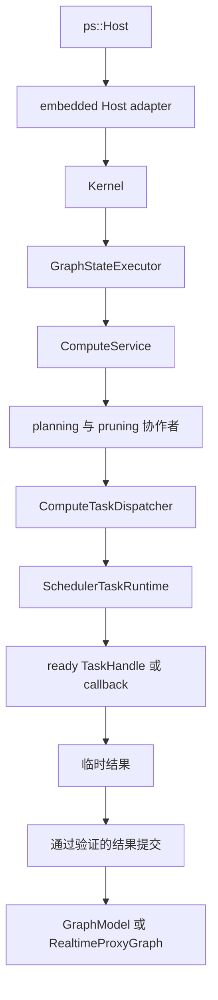

# 计算边界

本文说明当前计算子系统内部的软件行为和实现所有权。

## 范围

计算子系统接收一个通过验证的内部请求，为一个 HP domain 或协调后的 HP/RT sibling 派生工作，
执行 operation，并发布 intent-specific result。它不拥有图文档持久化、前端渲染、daemon
transport 或进程级 operation plugin
生命周期。

公共调用方只能通过 `ps::Host` 进入计算。Embedded adapter 把公共 `HostComputeRequest` 值
转换为内部 Kernel 和 `ComputeService` 请求。公共 API 不暴露 `ComputeService`、plan、任务图
或 scheduler pointer。

## 所有权图

`GraphStateExecutor` 拥有当前每图排他性。即使 ready callback 在 scheduler worker 上执行，
规划和派发仍属于 compute 职责。

当前排他机制不是有界串行队列。每次 `GraphStateExecutor::submit()` 都会启动一个
`std::async(std::launch::async)` operation，启动后的 operation 再等待 executor mutex。因此，并发
submission 可能创建多个等待同一 graph 的 OS thread。该 mutex 只提供排他性，不提供 FIFO
ordering、cancellation、admission control 或 thread budget。
该 mutex 会在整个 callback 期间保持锁定，包括 scheduler submission、completion wait 与 visible
commit。不同 graph 具有独立 executor 与 mutex。

## 当前协作者

| 模块 | 当前职责 | 不拥有 |
| --- | --- | --- |
| `ComputeService` | 请求验证、intent 协调、协作者构造和最终结果选择 | 前端值、worker thread、图文档 |
| `ComputeCachePolicy` | HP cache eligibility 与缓存路径决定 | 磁盘 I/O 所有权或 operation 执行 |
| `NodeInputResolver` | runtime parameter 和 ready image input | 图遍历或输出提交 |
| `FullTaskGraphExpander` | 一个 graph generation/domain 的完整 node/tile task 形态 | 请求目标、cache pruning、dirty pruning |
| `NodeCacheTaskGraphPruner` | 目标/依赖锥和 cache-aware 请求 plan | 新 node 或 tile task 形态 |
| `ComputeDispatchPlanBuilder` | cache-pruned HP plan 和 inspection record | scheduler queue |
| `DirtyRegionPlanner` | 图级 dirty propagation snapshot | 计算依赖计数 |
| `DirtySnapshotTaskGraphPruner` | 从既有 plan 选择活动 dirty work | task expansion |
| `IntentUpdateCoordinator` | HP-only 或 HP/RT sibling 语义 | 物理优先级或 worker 所有权 |
| `ComputeTaskDispatcher` | Dependency counter、ready release、temporary result、completion、exception、full HP commit 与 dirty source-first submission helper | Graph topology derivation、dirty staged commit 或 scheduler policy |
| `TaskSubmissionPlan` | 请求级 task handle、dense index、依赖状态、variant 和结果槽 | 超出当前 dispatch contract 的生命周期 |
| `NodeExecutor` | 一致的 monolithic/tiled operation 调用 | 图变更策略 |
| `ComputeMetricsRecorder` | compute event、timing、benchmark event 和 debug metadata | scheduler trace 所有权 |

实现位于 `src/lib/compute/`。这些类是私有实现模块，不构成可安装 API。

## 请求行为

1. `Kernel` 解析 session 并进入图状态访问边界。
2. `ComputeService` 验证 target、intent、dirty ROI、cache flag 和 execution strategy。
3. 在 extent、ROI 或 task-shape 决定使用连接参数之前，parameter producer 会稳定为一个
   request-local HP snapshot。
4. Planner 展开一个 domain 的完整 task 形态，再裁剪到请求目标和依赖锥。
5. Dirty request 从该 plan 选择活动 work set；dirty 状态不会创建新的 task 形态。
6. 顺序执行 inline 遍历同一请求语义；并行执行 materialize 具体 handle，只把 ready handle 或
   callback 提交给选定 scheduler runtime。
7. Worker 写入请求级临时或 staged output；只有相应 commit path 能修改可见图状态。
8. 结果、事件、计时和错误通过 Host value 边界复制返回。

## 规划不变量

- Full expansion 以 graph topology generation、compute intent 和 task-shape configuration 为键。
- 当当前 input/parameter 可能在拓扑不变时改变 output extent，force-recache 会使可复用 expansion
  失效。
- 请求目标、cache availability 和 dirty 状态裁剪既有 task 形态，不会重定义图拓扑。
- 只要仍有由 `ComputeTaskGraph` 派生的 scheduler-visible callback 可能执行，该图就不可变。
- HP 与 RT 是独立 compute domain；一个 plan 不创建跨 domain task 依赖。
- 在可行时，tiled input normalization 每次 node invocation 只执行一次，而不是每个 tile callback
  执行一次。

这些规则使规划保持确定性，并让 scheduler 独立于图语义。因此，规划成本遵循先 full
expansion、再 pruning；lazy task creation 不属于当前 planning contract。

## Dispatcher 与 Scheduler 边界

Dispatcher 拥有请求正确性：

- dependency counter 和 dependent map；
- source-first dirty task release；
- task reference accounting；
- 临时结果槽；
- exception normalization 和 completion aggregation；
- 空 plan 验证；
- 最终 target 选择与 full HP commit；dirty executor 在复用 source-first submission helper 后拥有
  自己的 staged commit。

Scheduler 拥有当前物理执行机制：

- worker lifecycle 和 ready queue；
- batch state 与 scheduler-local epoch filtering；
- 实现特定 task ordering；
- scheduler completion 和 exception publication；
- 通过 Host context 发布有界 trace。

Scheduler 不会收到 `GraphModel`、`ComputeTaskGraph`、`DirtyRegionSnapshot` 或 cache authority。
新就绪的 dependent work 由 dispatcher 释放，并作为另一条 ready handle 或 callback 推送。Threaded
scheduler resource 按 `GraphRuntime`、按 intent route 拥有；当前不存在 process-wide worker pool
或 cross-graph admission/fairness authority。

## 当前 OpenCV operation 串行化

内置 operation translation unit 声明了一个进程范围的 `g_opencv_op_mutex`。以下 13 个
operation entrypoint 会在 OpenCV 与数据处理路径中持有该 mutex 直至返回。`convolve`、
`resize`、`crop` 与 `extract_channel` 会先完成初步输入校验再获取锁，其余入口在 callback
开始处获取锁：

- monolithic `convolve`、`resize`、`crop`、`extract_channel`、
  `gaussian_blur`、`add_weighted`、`abs_diff` 和 `multiply`；
- tiled `curve_transform`、`gaussian_blur`、`add_weighted`、`abs_diff` 和
  `multiply`。

Scheduler worker 可以并发发出这些 callback，但该集合内的调用会在同一进程的 tile、Graph 和
HP/RT intent route 之间串行。因此，worker 数量本身不能证明这些 operation 具有 tile-level
scaling。这个 mutex **并不**保护产品内全部 OpenCV 使用；其他 cache、normalization、metrics、
downsample、adapter 或 plugin 路径可能在锁外使用 OpenCV。

`register_builtin()` 还会一次性调用 `cv::ocl::setUseOpenCL(false)` 和
`cv::setNumThreads(1)`，因此当前 built-in registry 会从 core code 建立 library-level OpenCV
execution setting。该锁和这些设置是当前实现事实，不是目标边界。Issue #46 跟踪合并门禁裁定与
scaling benchmark；ADR 0002 则把未来 OpenCV state、exception translation、algorithm 和 codec
放入可选 provider/adapter。

## Intent 与提交边界

`GlobalHighPrecision` 和 `RealTimeUpdate` 描述业务语义，而不是资源策略。Real-time update
协调一个 RT proxy sibling 和一个 HP authoritative sibling；每个 sibling 都有自己的 domain plan、
dirty snapshot、staged output 和 scheduler selection。

`IntentUpdateCoordinator` 通过两个 asynchronous call 建立当前 sibling concurrency。选中的
scheduler 只执行每个 sibling 内部的 ready work；它不会创建 sibling relationship，也不会从 task
metadata 推导该关系。

当前普通 compute policy 会持有每图独占访问直到可见提交。Dirty path 已使用更窄的 staged buffer：

- `RealtimeProxyWriteBuffer` 只提交到 `RealtimeProxyGraph`；
- `HighPrecisionDirtyWriteBuffer` 在 sibling commit gate 打开后，把权威 HP output 提交到
  `GraphModel`。

该 staging 会防止尚未组装完成的 tile output 可见，但它还不是通用 cancellation 或 graph revision
策略。

## 故障与生命周期语义

- 非法 target、intent/ROI 组合、planning contract 和 operation failure 通过分类图错误和 Host
  status value 报告。
- 资源耗尽可以按已记录的非析构 Host 边界传播为 `std::bad_alloc`。
- 已 admission 的 scheduler batch 会在异常离开当前请求前 settle。
- Operation callback 可能已经产生外部副作用；staged graph output 不会回滚这些副作用。
- 当前 task handle 借用请求级 executor 状态，其生命周期在当前 completion wait 结束；因此不能
  原样移入进程级异步队列。

## 边界原理

把 planning、ready detection、physical execution 和 commit 分离，会得到四个独立正确性点：

1. 无需 worker pool 即可测试 Graph 与 ROI 语义。
2. Scheduler 可以改变 ordering，而不拥有 Graph 状态。
3. 临时输出可以在可见前验证。
4. 物理执行所有权与 dependency correctness 保持可分离。

ADR 0003 记录了供后续实现的另一项已接受 ownership decision。本文是当前每图 scheduler
行为的权威说明。

## 实现与验证入口

- `src/lib/compute/compute_service.*`
- `src/lib/compute/task_graph_planning.*`
- `src/lib/compute/compute_dispatch_plan_builder.*`
- `src/lib/compute/compute_task_submission.*`
- `src/lib/compute/compute_task_dispatcher.*`
- `src/lib/compute/dirty_region_planner.*`
- `src/lib/compute/dirty_update_executor.*`
- `src/lib/compute/intent_update_coordinator.*`
- `src/lib/core/ops.cpp`
- `tests/integration/test_compute_service_split.cpp`
- `tests/integration/test_scheduler.cpp`
- `tests/unit/test_propagation_contracts.cpp`
