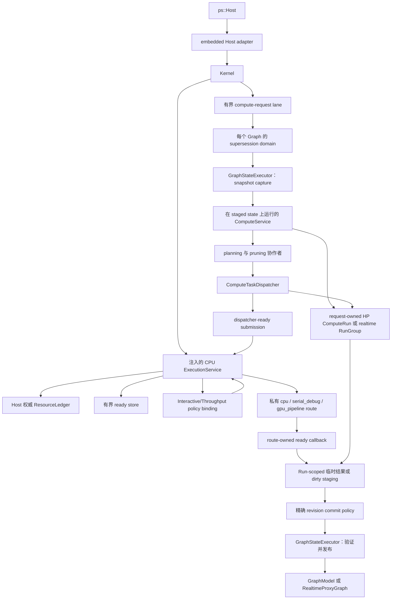

# 计算边界

本文说明当前计算子系统内部的软件行为和实现所有权。

## 范围

计算子系统接收一个通过验证的内部请求，为一个 HP domain 或协调后的 HP/RT sibling 派生工作，
执行 operation，并发布 intent-specific result。它不拥有图文档持久化、前端渲染、daemon
transport 或进程级 operation plugin
生命周期。

公共调用方只能通过 `ps::Host` 进入计算。Embedded adapter 把公共 `HostComputeRequest` 值
转换为内部 Kernel 和 `ComputeService` 请求。公共 API 不暴露 `ComputeService`、plan、任务图，
也不暴露物理 executor/policy pointer。Public compute request 可以携带一个可选正值
`maximum_parallelism` 作为 Run 上限；它不能调整进程 executor 的大小，也不能选择该 executor。
Request、propagation、planning 与 execution geometry 直到
`NodeExecutor` 都保持为 `PixelRect`/`PixelSize`；OpenCV geometry 只存在于 provider 或
算法实现内部，并且位于真正消费它的 library call 处。

## 所有权图

`GraphStateExecutor` 拥有可见 Graph capture、mutation、predicate 与 publication 的排他性。
独立 compute-request lane 拥有 same-Graph compute 与 route-replacement 顺序。即使 ready
callback 在私有 route worker 上执行，规划和派发仍属于 compute 职责。

当前排他机制是有界串行 FIFO lane。每个处于 accepting 状态的 `GraphStateExecutor` 恰好拥有一个
worker。Graph-state lane 保留历史边界：64 个等待 callback 加至多一个 active callback。
Compute-request lane 改为精确计费 64 个 queued、running 或 parked 的 one-shot/ticket admission；
active work 不再是隐藏的第 65 个单元。每个 key 会采用一个 reserved continuation 及其持久 FIFO
node。`wake()` 与 worker-tail handoff 复用该 token/node，不分配内存、不 self-submit，也不等待
容量。普通 `submit()` 与新 key reservation 会在所选边界阻塞；它们不会创建额外 lane worker，
也不会丢弃或绕过已经 admission 的 work。Admission 之前不保证 producer fairness，但 queued
work 会按 FIFO 执行。

两条 lane 复用相同的 executor lifecycle。每次 one-shot submission 都会返回 packaged-task
future，精确保留 callable 的 value、reference、`void` completion 或 exception。销毁 future
不会等待或取消 task；executor lifetime 会保留已经 admission 的 work。Callback 不能向自己的
lane submit，也不能关闭自己的 lane：worker re-entry 会在等待队列之前抛出
`std::logic_error`。现有 compute-request worker 是唯一的 logical active-request runner：每次
reserved-ticket turn 最多 materialize 一个 generation，并运行既有 Kernel/ComputeService path。
它只会为 generation publication、snapshot capture 或最终精确 revision/generation transaction
进入 graph-state；不会创建每个 Graph 的 background runner 或每个 generation 的 thread。

`close_and_drain()` 对并发调用与重复调用都保持幂等。它会停止 admission，让被满队列阻塞的
producer 以 `std::runtime_error` 被唤醒，按 FIFO 排空已有 work，并在返回前 join worker。每个
caller 都等待自己加入的持久 close generation；失败 stop 后的 restart 可以在延迟 caller 被唤醒前
重新开放后续 accepting generation，但不会困住该 caller，也不会创建第二个 worker。
`GraphRuntime` 会先停止并排空 compute request，同时保持 graph-state 可供已接受 request commit；
随后排空 graph-state，再释放 Graph-local state。不同 graph 具有独立的 worker 和队列。
Host composition 的 resource ledger 不对这些 lane worker 或固定 service thread 计费；它们保持为
基础设施。其 CPU 维度改为准入由 Host-owned reserved-start transaction 提交的每个 Run 执行权。

## 当前协作者

| 模块 | 当前职责 | 不拥有 |
| --- | --- | --- |
| `ComputeRequestCoordinator` | 每个 live Graph 的 checked generation allocation、graph-state publication、每个 admitted key 的一个 latest mailbox 与 reserved ticket、active-source supersession notification、精确 pending settlement，以及一个 logical active-runner slot | Run plan、staging、execution worker、Graph lifetime lease、lifecycle registry、telemetry 或 public ABI |
| `ComputeService` | 请求验证、intent 协调、创建/settle 一个 HP Run 或一个包含独立 HP/RT child 的 realtime `RunGroup`、调用 staged commit policy、协作者构造和最终结果选择 | 前端值、worker thread、图文档、live Graph revision/generation authority 或 public cancellation policy |
| `RunGroup` | 一个 realtime request identity、不同的 HP/RT child Run 与 observation lease、request-wide cancellation fan-out、RT-first gate 和确定性 aggregate outcome | Child plan/dispatcher、Graph state、worker、resource reservation、lifecycle registry 或 public control |
| `ComputeRun` | 带精确 Graph identity/revision 与 request supersession identity 的不可变单 domain HP/RT descriptor、单调 phase、私有弱生命周期 cancellation source、read-only lease observation、唯一 terminal/commit arbiter、通过共享 control 对 full-plan/temporary storage 或 dirty-HP staging storage 的所有权、稳定 lease，以及复合 task identity | 配对 realtime grouping、Graph state、worker、revision/generation mint 或 publication authority、公开 cancellation control 或 resource admission |
| `ComputeCommitPolicy` | 仅产品使用的精确 Run/staged/live provenance 与 current supersession generation 验证、保留的 read-only Run lease、transaction 内 cancellation observation 与 Run-owned commit-contender resolution、延迟 HP cache persistence，以及在 Run success 前串行发布可见状态 | Planning、execution worker、cancellation source 或任意 cancellation authority、最终 lifecycle registry 或 public ABI |
| `ComputeCachePolicy` | HP cache eligibility 与缓存路径决定 | 磁盘 I/O 所有权或 operation 执行 |
| `NodeInputResolver` | runtime parameter 和 ready image input | 图遍历或输出提交 |
| `FullTaskGraphExpander` | 一个 graph generation/domain 的完整 node/tile task 形态 | 请求目标、cache pruning、dirty pruning |
| `NodeCacheTaskGraphPruner` | 目标/依赖锥和 cache-aware 请求 plan | 新 node 或 tile task 形态 |
| `ComputeDispatchPlanBuilder` | cache-pruned HP plan 和 inspection record | ready-store 或 route ordering |
| `DirtyRegionPlanner` | 图级 dirty propagation snapshot | 计算依赖计数 |
| `DirtySnapshotTaskGraphPruner` | 从既有 plan 选择活动 dirty work | task expansion |
| `IntentUpdateCoordinator` | HP-only 或 HP/RT sibling 语义 | 物理优先级或 worker 所有权 |
| `ComputeTaskDispatcher` | Dependency counter、ready release、temporary-result indexing、completion、exception、full HP commit 与 dirty source-first submission helper | Run storage、Graph topology derivation、dirty staged commit、policy ranking 或物理执行 |
| `TaskSubmissionPlan` | 一个 full HP request 的 Run-owned dense index、依赖状态、exact-once task state、冻结的 implementation/device snapshot、结果槽与 callback owner | execution-route worker、Run terminal state 或 dirty-path execution |
| `ReadyTaskSubmission` | 一个 dependency-ready task 的 move-only 不可变 metadata、selected `Device`、复合 task identity、匹配 Run lease 与 owned executable | Planning、dependency derivation、Graph/cache authority 或 commit |
| `ExecutionService` | 一个 Host-owned 固定 CPU pool、一个由 service 拥有的 Metal lane、私有 `serial_debug`/`gpu_pipeline` route、一个 Host 权威 `ResourceLedger`、policy-aware 有界 ready storage、进程级 policy binding、reserved-start transaction、精确 Run queued purge/running drainage，以及按 Run 隔离的 completion/failure/trace settlement | Planning、dependency、Graph/cache state、cancellation authority、lifecycle admission registry 或 visible commit |
| `NodeExecutor` | 一致的 monolithic/tiled operation 调用 | 图变更策略 |
| `ComputeMetricsRecorder` | compute event、timing、benchmark event 和 debug metadata | execution trace 所有权 |
| `PolicyRegistry` 与 policy binding | 验证 built-in/DSO policy type，拥有进程级 context 与 DSO lease，并为 Host-authored 不可变 candidate snapshot 排序 | worker、queue、resource grant、Run、Graph、completion 或 start authority |
| `ResourceLedger` | 原子预留经过检查的 CPU、retained-memory、scratch、ready-entry 与 ready-byte vector；签发有界 child grant；在 parent/child ownership 结束后精确释放 vector | worker 构造、ordering policy、task dependency、对 device/I/O/plugin resource 的猜测或 lifecycle admission |
| `GraphRuntime::ExecutionRouteBinding` | 按 intent 存储一个复制的私有 route id 与非零 generation | 物理 route 所有权、policy context、worker、queue 或 reservation |

Compute collaborator 位于 `src/lib/compute/`；ledger 与 Graph route binding 位于
`src/lib/runtime/`；policy loading/binding 位于 `src/lib/policy/`；私有 route execution 位于
`src/lib/execution/`。这些类都是私有实现模块，不构成可安装 API。本区域唯一已安装的扩展契约是
`include/photospider/policy/policy_plugin_api.h` 声明的纯 C policy ABI。

当前内建 CPU 准入会把强制、经检查的 service envelope 与可审计的 adapter envelope 组合起来。
Run/control/plan 或 phase-context 共享的 retained storage 只计费一次。统一的逐任务 retained 与
scratch demand 按最大 callback 并发数相乘；该并发数是固定 worker 数、逻辑 task 数与 Run 可选
正值 `maximum_parallelism` 三者的最小值。Ready entry 与 byte 仍按所有逻辑任务相乘，因此
dependency release 已被预先覆盖。Reserved start 会针对 Run in-flight state 再次执行同一上限；
该上限不会调整固定 pool 的大小。初始与 dependent entry 使用同一个 estimator 和 insertion
boundary。复制的 graph-identity metadata 按实际 string capacity 加终止空字符计费。在所有
initial value 与 ready grant 都移动到暂存 queue entry 后，`ExecutionService` 会在发布
active Run 和等待 settlement 之前销毁 caller-side submission vector 的 backing；此后只有暂存
entry 以及 bounded store 保留这些 submission。在每个 dirty 或 connected-preflight service
segment 之前，adapter 会加入当前 staging/snapshot storage 与去重后的缺失 staging-map entry，
其中包括有序 map linkage，以及确定性的空 output metadata 或 seeded 可见 output metadata。
HP downstream demand 会通过仍存活的 `ComputeRunLease` 读取当前 Run-owned write buffer，再由
phase-local estimator 只加入仍缺失的 entry；这样 source 创建的 entry 会继续被计费，同时不会
重复计费。

Dirty HP 与 RT demand 还会计入完整的 request-owned `DirtyNodeSynchronization`：shared
allocation、unordered-map bucket、value 与 linkage、每个由 `unique_ptr` 拥有的
`std::mutex`，以及可见 object storage。Allocator-private map metadata 与不透明的 platform
mutex allocation 仍排除在外。并发 HP/RT sibling 会在两个独立 phase reservation 中保守地
计入同一个 shared synchronization object。这种有意的双 reservation 允许任一 sibling 先
settle，同时不会让仍存活 Run 的 shared ownership 失去计费覆盖。Estimator 只计算所有权与
大小均可见的 Host-owned C++ storage；不会伪造未来由 operation 产生的 image pixel、
named-value 增长，以及不透明的 backend、device、plugin 或 allocator-owned allocation。
当前内建 adapter 声明 scratch 为零，仅因为它们不拥有需要独立计量的固定 Host scratch。

在 process-service dirty source segment 期间，source context 拥有外层 task
`std::function` 的左值副本，而该外层 function 仍保持存活。因此 source demand
会在 context-owned target 之外额外加入一份经审计的 callable payload。Downstream
context 通过 move 接收该外层 callable。由于 C++17 不要求 moved-from
`std::function` 为空，一个私有 context-construction helper 会把 destination
构造与外层释放变成不可拆分的操作：factory 必须先成功返回 owned context，随后
helper 会在任何 submission 构造、phase retained-demand 计算或准入运行之前显式
清空外层 holder。构造失败时，外层 owner 与 factory 临时对象仍通过正常栈展开
释放。因此 downstream demand 只覆盖 context-owned target，不依赖标准库的
moved-from 表示。一个长期回归会用 move 后仍保留 source target 的对抗性 holder
调用同一个 production helper，因此删除显式 release 时，无论当前使用哪一种标准库，
该回归都会失败。

原已安装的 `kSchedulerWorkerProcessMax` 常量与拥有 worker 的 scheduler ABI 均已删除。
源码 consumer 不会获得 compatibility alias 或已安装 replacement。组合 limit 使用 source tree
私有的 `ExecutionResourceLimits`；第三方 policy selection 使用独立的纯 C policy ABI v1，且不会
获得任何执行资源。

## 请求行为

1. `Kernel` 解析 session，把缺失 intent 规范化为 HP，形成 `(target, canonical request intent)`，
   分配经检查的 graph-wide generation，并在 graph-state 之外采用该 key 的 reserved compute-lane
   ticket。随后一个 graph-state work item 把该 generation 发布为 current，合并一个 pending value，
   并唤醒 ticket。
2. `ComputeService` 验证 target、intent、dirty ROI、cache flag 和 execution strategy。
3. 一次 reserved-ticket turn 会在 graph-state work item 中捕获 request-owned Graph/proxy
   snapshot。对于非 realtime HP，`ComputeService` 在 planning 前创建一个 `ComputeRun`；对于
   realtime，它会在 preflight 前创建一个 request-owned `RunGroup`，其中包含独立的 HP Full 与
   RT Interactive child。每个 child 都捕获 fresh Run id、session label、强 Graph instance
   identity、权威 revision、target、显式 QoS，以及该 request 不可变的 supersession
   key/generation。Request cancellation source 会把其稳定的首个 reason 扇出到两个 realtime
   child；HP-only child cancellation 保持局部。
4. 在 extent、ROI 或 task-shape 决定使用连接参数之前，parameter producer 会稳定为一个
   request-local HP snapshot。
5. Planner 展开一个 domain 的完整 task 形态，再裁剪到请求目标和依赖锥。
6. Dirty request 从该 plan 选择活动 work set；dirty 状态不会创建新的 task 形态。
7. 每个执行阶段都会 materialize 保留 Run lease 与 `(RunId, RunLocalTaskId)` 的 move-only
   `ReadyTaskSubmission`，并且只把 ready work 发送到 Host-owned `ExecutionService`。Full HP 使用
   `TaskSubmissionPlan`；preflight 与 dirty HP/RT 使用 heap-owned phase context。三个封闭的私有
   route 全部进入公共 ready store、policy selection、reserved-start transaction 与 Run-lease
   completion path。Explicit cancellation 或过期的 injected monotonic deadline 会在既有 planning、
   queue、callback、dependency、phase 与 commit boundary 被观察。Service 只关闭并清除匹配 Run
   的 queued entry；已进入的 callback 会排空，但不会释放新的 dependent 或发布 staged output。
8. Worker 只写 request-owned Graph/proxy state，包括 Run-owned full-plan 临时结果或 dirty-HP
   staging。RT staging 仍由 sibling callback 局部持有，但所有 service callback 都会在同步
   settlement 前保留 RT child lease。
9. 输出验证后，每个 Run 到达 `CommitPending`。产品 policy 验证精确 staged/live identity、
   权威 revision 与 current supersession key/generation。它会保留 read-only Run lease、进入
   graph-state work item、观察 cancellation，
   再尝试取得 Run-owned one-shot commit contender。该 claim 之前被接受的 cancellation 不会发布
   Graph、proxy 或 deferred cache state；contender 获胜后，后续 cancellation 成为 terminal
   no-op。Policy 会可选持久化变化的 HP artifact、发布完整 Graph/proxy state，并在同一个 work
   item 中解析 success 或精确 failure。Coordinator 只有在两个 child 都 settle 后才返回 RT
   output；随后结果、事件、计时和错误通过 Host value 边界复制返回。

## 规划不变量

- Full expansion 以 graph topology generation、compute intent 和 task-shape configuration 为键。
- 当当前 input/parameter 可能在拓扑不变时改变 output extent，force-recache 会使可复用 expansion
  失效。
- 请求目标、cache availability 和 dirty 状态裁剪既有 task 形态，不会重定义图拓扑。
- 只要仍有由 `ComputeTaskGraph` 派生的 execution-visible callback 可能执行，该图就不可变。
- HP 与 RT 是独立 compute domain；一个 plan 不创建跨 domain task 依赖。
- Host、graph、planning、dirty work-set、staged-write 与 `NodeExecutor` 边界携带内核自有的
  `PixelRect`/`PixelSize`，绝不携带 OpenCV geometry。
- 在可行时，tiled input normalization 每次 node invocation 只执行一次，而不是每个 tile callback
  执行一次。

这些规则使规划保持确定性，并让 policy/物理执行独立于图语义。因此，规划成本遵循先 full
expansion、再 pruning；lazy task creation 不属于当前 planning contract。

## Dispatcher、Policy 与 Execution 边界

Dispatcher 拥有请求正确性，而 `ComputeRun` 拥有当前 full HP storage：

- dependency counter 和 dependent map；
- source-first dirty task release；
- task reference accounting；
- 对 Run-owned 临时结果槽的 indexing 与 transition；
- exception normalization 和 completion aggregation；
- 空 plan 验证；
- 最终 target 选择与 full HP commit；dirty executor 在复用 source-first submission helper 后拥有
  自己的 staged commit。

`ExecutionService` 拥有物理机制：

- 有界 ready storage 与私有 route 的 worker/device lifecycle；
- 按 Run 隔离的 settlement 与 route-specific in-flight state；
- service-class arbitration、Host-authored frontier reduction 与经过验证的 policy selection；
- reserved-start resource exchange 与实现特定的 execution；
- completion 和 exception publication；
- 通过 Host context 发布有界 trace。

Policy callback 与私有 route 都不会收到 `GraphModel`、`ComputeTaskGraph`、
`DirtyRegionSnapshot` 或 cache authority。新就绪的 dependent work 由
`TaskSubmissionPlan` 作为另一个 `ReadyTaskSubmission` 释放；只有 Host 能验证 candidate、提交
start，并把 callback 所有权转移到复制的 Graph route binding。

Issue #70 与 #71 的 CPU service 在 Kernel 之前显式组合，并直接拥有一个固定 CPU worker pool、
一个私有 Metal worker lane、一个 Host 权威 ledger 和一个有界 ready store。配置只会解析并
冻结一次 `[1,8]` 个 CPU 基础设施 worker；Graph load、replacement、Run execution 与 dirty
阶段都不会调整任一 lane 的大小。Benchmark `execution.threads` 是单次 Run 上限，不是
execution configuration request。缺失或零会选择一个有界自动 cap，`1..8` 会选择精确 cap。
`BenchmarkService` 最多以 `worker_count=0` 准备进程 service 一次；随后 `RunAll` 会在同一个
pool 上运行采用混合 cap 的有效 session；配置文件解析完成后，它不会校验 disabled session 的
thread 范围，也不会运行这些 session；它还会记录和跳过无效 enabled session。每个 Run 在发布前原子预留
完整且经过检查的 CPU/retained/scratch/ready vector。Initial 与 dependency-released work 都
必须持有匹配的 ready-entry/byte grant，并进入同一个 policy route；从队列移除时会把该 grant
交换为 CPU/memory/scratch 执行权。Completion、failure 与所有异常路径都恰好释放一次精确 vector。
独立 Run 仍相互隔离。

Ready store 对每次 dispatch 按
`work_units + ceil(complete_ready_grant_bytes / 4096)` 计费。每个 Graph 都在已选 service class
各自独立的 accumulator 中累加原始 cost；每个 Run 只有一个不可变 class，并在其中累加
`ceil(cost / weight)`。显式 interactive QoS 会偏好存在且更早的单调时钟 deadline；throughput
排序采用加权且确定的规则。Store 会先选择 service class；两个 class 都持续 ready 时，它会在
至多三次连续 Interactive dispatch 后强制选择 Throughput。随后，八次 dispatch aging 只在已选
class 内生效，不能替换该 class 决策。Run row 会跨越临时为空的阶段保持安装，因此 dependent
re-entry 无法重置公平性历史。

配置的 interactive headroom 只把 active Throughput root reservation 限制在
`limits - interactive_headroom`。Interactive Run 不会扣减这项 class quota，但两个 class 仍在
唯一 ledger 中共享最终物理容量。Throughput quota check、ledger
commit 与 class charge 构成一个串行 transaction；该 charge 会一直保留到 parent 与所有 child
grant ownership 都结束、匹配的 root vector 被物理归还。私有 policy 策略不拥有 worker、ready
entry、resource token、budget、Run 或 Graph。Revision 偏好与 supersession 不是 scheduling-policy
输入。Cancellation 属于 Run terminal correctness：`ExecutionService` 会观察匹配 Run，只关闭其
ready admission、只清除其 queued entry，并等待已经运行的 callback 排空。

两个 intent binding 在 `GraphRuntime` 中都不拥有 owner：每个 binding 只存储复制的 route id 与
非零 generation。Host-owned `ExecutionService` 拥有封闭的 `cpu`、`serial_debug` 与
`gpu_pipeline` 实现，并对三者应用相同的 ledger/reserved-start 边界。Route replacement 会验证
并发布新的 generation，不构造 per-Graph executor 或 reservation。Ledger 不会虚构 device、I/O
或 plugin-specific dimension。

规范 inventory 同时感知 route 与 Host：`cpu` 和 `serial_debug` 只暴露 CPU；Metal 可用时，
`gpu_pipeline` 依次暴露 Metal、CPU，否则只暴露 CPU。Full、dirty HP/RT 与 connected-preflight
planning 会在准入前冻结选中的 implementation 与 device。CPU work 进入固定 pool，Metal work
进入单一 GPU lane；二者仍消耗同一个 Run root grant 和 maximum-parallelism ceiling。不可用
device 会在 active Run 发布前被拒绝；completion、exception、cancellation、reuse、shutdown 与
drainage 会退役精确的公共 ledger/Run state。

## OpenCV Operation 并发

仓库自有 CPU OpenCV operation 是可重入的 provider 工作。Builtin provider 不再具有进程范围的
operation mutex。其 monolithic `convolve`、`resize`、`crop`、`extract_channel`、
`gaussian_blur`、`add_weighted`、`abs_diff` 与 `multiply` callback，以及 tiled
`curve_transform`、`gaussian_blur`、`add_weighted`、`abs_diff` 与 `multiply`，可以跨 tile、
Graph 和 HP/RT intent route 并发运行。Callback input 不可变；可变 `cv::Mat` header、temporary
与 output region 由 callback 局部拥有或 task 独占。

Registry 边界遵循同一规则。Registry lock 会串行化 ownership mutation、发布、一致 snapshot
capture 与卸载，但会在 callback invocation 前释放。因此，每个 provider 都必须保证 callback
可重入，或自行同步其共享可变状态。共享 operation key、device、intent 或 callback owner 绝不
意味着单线程执行。

可选 OpenCV provider 会在发布自身 callback 前恰好一次调用 `cv::setNumThreads(1)`。它使用
`cv::Mat`，不调用 `cv::ocl::setUseOpenCL(false)`，也不会在 callback 可能活跃时重新配置
OpenCV threading。其 callback fence 会在仍处于 provider 代码内部时捕获注册算法抛出的每个
`cv::Exception`。OpenCV 资源耗尽会变成新建的 `std::bad_alloc`；其他 OpenCV failure 会变成
携带 `GraphErrc::ComputeError` 的 host-owned `GraphError`。因此，已提交的 execution CPU grant
是仓库自有的外层 CPU parallelism，而 OpenCV 内部 CPU parallelism 保持禁用。

`PHOTOSPIDER_BUILD_OPENCV_OPERATION_PROVIDER=OFF` 会省略该 provider 的 callback，但依赖中立
core operation 仍保持注册。Registry 与 v2 registrar 不依赖 OpenCV：其他 provider 可以发布
缺失 operation，也可以通过相同 slot 替换已启用的 OpenCV operation。由 manager 驱动的卸载会
退役 replacement，并恢复已捕获的 predecessor。

围绕真实 backend state 的同步仍由 provider 局部负责。Metal Perlin provider 保留一个
DSO-private mutex，保护其共享 Metal device、queue、pipeline 与 buffer；该 mutex 既不是 OpenCV
operation lock，也不是 scheduler exclusivity contract。仓库自有 provider 之外的 OpenCV 使用、
第三方内部 thread 与 platform runtime worker 仍不计入 Host execution accounting。

[ADR 0004](../../adr/zh/0004-opencv-cpu-operations-are-reentrant-provider-work.zh.md)记录本项决策。
长期 integration coverage 会证明同一个固定 pool 上 `1/2/4/8` Run cap 对应精确 callback
overlap，以及单 cap 与八 cap 输出按位相同；手工原生扩展性证据记录在
`../../development/zh/Testing-and-Validation.zh.md`。
[ADR 0002](../../adr/zh/0002-external-libraries-are-kernel-adapters.zh.md)与精确的
[依赖中立内核目标](../../roadmap/zh/Kernel-Evolution.zh.md#依赖中立内核)会把 OpenCV algorithm、
codec、exception translation 与 process state 放入可选 provider/adapter，而不再让它们定义目标
kernel 语义。

## Intent 与提交边界

`GlobalHighPrecision` 和 `RealTimeUpdate` 描述业务语义，而不是资源策略。Real-time update
协调一个 RT proxy sibling 和一个 HP authoritative sibling；每个 sibling 都有自己的 domain plan、
dirty snapshot、staged output 和复制的 execution-route binding。

`IntentUpdateCoordinator` 通过两个 asynchronous call 建立当前 sibling concurrency。选中的
policy 与私有 route 只执行每个 sibling 内部的 ready work；二者都不会创建 sibling relationship，
也不会从 task metadata 推导该关系。

每条产品 path 都针对 request-owned Graph snapshot 计算；intent-aware path 还会使用
request-owned RT proxy snapshot。Full/dirty HP 与 RT route worker 在 operation work 期间都不能
修改 live Graph 或 proxy。Snapshot 磁盘写入保持关闭。

本地 output validation 后，匹配 Run 到达 `CommitPending`，私有 `ComputeCommitPolicy` 会
materialize 完整 publication copy。Policy 不拥有 cancellation source；它会保留 read-only Run
lease，并在一个 graph-state work item 中先观察 explicit/deadline cancellation，再尝试取得
Run-owned commit contender。该 claim 之前被接受的 cancellation 会使 Run 保持 `Cancelled`，且
不发布 Graph、proxy 或延迟磁盘输出。Contender 一旦被接受，后续 cancellation 成为 no-op；随后
要求精确 staged owner、Run domain/label、强 Graph identity 与权威 revision 同时匹配 descriptor
和 live Graph。只有有效 HP transaction 可以持久化变化的 staged cache artifact；完整 Graph/proxy
publication 使用 no-throw state swap，并保留 revision。Contender 会在 publication 后解析为
`Succeeded`，或在 work item 返回前把精确 predicate/persistence failure 保留为 `Failed`。

RT 会先应用该 predicate 并发布 proxy，再打开 sibling gate。HP 随后独立验证。因此，较新的 Graph
revision 可以拒绝 HP，而不会回滚已经胜出的 RT publication。Gate 仍为 `Pending` 时发生的 RT
cancellation 会永久拒绝 HP commit 并请求取消 HP child。HP cancellation 保持 child-local，不能
回滚已经提交的 RT proxy。更新的 realtime generation 会 supersede 两个旧 child，并拒绝旧的
pending gate；如果旧 RT proxy 先完成 commit，它会保持可见，但旧 HP sibling 仍因 generation
过期而被拒绝。最新 generation 失败绝不会重新激活旧 generation 的 commit right。Installed
Host、CLI 与 IPC protocol version 2 surface 不暴露 cancellation entry；IPC job 继续报告
`cancellable: false`。

## 故障与生命周期语义

- 非法 target、intent/ROI 组合、planning contract 和 operation failure 通过分类图错误和 Host
  status value 报告。
- 资源耗尽可以按已记录的非析构 Host 边界传播为 `std::bad_alloc`。
- 超过八的 worker 请求、与固定 service 数量冲突的正数请求、未知私有 execution route 或不可用
  policy type 都会在不改变当前 binding 的情况下失败；准入 Run 时的 ledger 耗尽会保留
  `GraphErrc::ComputeError`。
- Public `maximum_parallelism` 显式为零会在图执行前以
  `GraphErrc::InvalidParameter` 被拒绝。该字段缺失表示调用方没有在固定 service lane
  以下再提供上限。
- 固定 service worker 作为不计费的基础设施一直存活到 service 析构。两个 policy class 与所有
  私有 route 的 active Run reservation 共用 ledger CPU 维度。失败的 reserved-start transaction
  会恰好一次归还 staged capacity，且不改变 ready/fairness state。
- 一旦内建 CPU 选择成功配置固定 pool，即使发起该选择的 load 随后在 document ingestion
  阶段失败，未发布的 Graph runtime 与复制的 route binding 仍会回滚，而
  不计费的 Kernel-lifetime service 配置会继续保留。
- 已准入的 Run 与每个已提交 route callback 都会在异常离开当前请求前 settle。
- Operation callback 可能已经产生外部副作用；staged graph output 不会回滚这些副作用。
- Same-key publication 最多替换一个 pending generation，并恰好一次 settle 被替换的 owner。
  Generation overflow 会拒绝新请求且不改变 current generation；较新的 admitted generation 失败
  绝不会恢复旧 generation 的 commit right。
- `Cancelled` terminal publication 可以先于 physical quiescence。匹配的 queued work 会被清除，
  而已经进入的 non-preemptible callback 只能在完成后释放其 lease、completion ownership 与 grant。
  Close/drain 会等待这些 cleanup；已取消 Run 不会释放新的 dependent，也不会提交 request-owned
  staging。
- Full HP work 绝不借用 raw `TaskExecutor`。`TaskSubmissionPlan` 拥有其 runner，每个 ready task
  都以 `ReadyTaskSubmission` 跨越公共 service boundary。Full、dirty 与 preflight 路径都保留
  匹配的 `ComputeRunLease`；failure publication 必须匹配 `(RunId, RunLocalTaskId)`。
  Dirty/preflight work 使用 heap-owned phase context 与 child Run lease，并经过相同的 policy、
  reserved-start 与 completion 边界。
- Graph close 会先停止 coordinator admission，再排空 compute lane；已接受的 ticket owner 可以恰好
  一次 retire 其 pending/active state，同时 graph-state 保持可用以完成最终 settlement。更广泛的
  graph-close/process-shutdown cancellation 与 lifecycle lease 模型仍由 Issue #76 负责。

## 边界原理

把 planning、ready detection、physical execution 和 commit 分离，会得到四个独立正确性点：

1. 无需 worker pool 即可测试 Graph 与 ROI 语义。
2. Policy 可以改变 ordering，而不拥有 Graph 状态或执行资源。
3. 临时输出可以在可见前验证。
4. 物理执行所有权与 dependency correctness 保持可分离。

[ADR 0003](../../adr/zh/0003-process-owned-execution-resources.zh.md)、
[ADR 0007](../../adr/zh/0007-compute-runs-and-process-execution-have-separate-owners.zh.md)与精确的
[进程执行域目标](../../roadmap/zh/Kernel-Evolution.zh.md#进程执行域)记录了已接受方向和详细所有权
契约。本文是截至 issue #75 的权威说明：所有 HP/RT ready work 都进入一个 Host-owned 有界 store；
Host 选择 service class 与可信 frontier；built-in 或纯 C policy 对不可变 candidate 排序；
reserved-start transaction 在封闭私有 route 启动执行前提交资源。Graph 只保留复制的 route
id/generation；不再存在拥有 worker 的 scheduler SDK、scheduler plugin、per-Graph 物理 owner 或
compatibility adapter。独立 realtime child Run、request-owned staging、强 identity/revision check、
latest-wins supersession、cancellation observation、精确 Run queued purge、dependent suppression 与
Run-owned commit arbitration 保持不变。带 graph-close/process-shutdown cancellation 与 telemetry
的最终 lifecycle admission/lease（#76），以及 public Host/CLI/IPC cancellation entry point 仍是
未来行为。

## 实现与验证入口

- `src/lib/compute/compute_service.*`
- `src/lib/compute/compute_commit_policy.hpp`
- `src/lib/compute/compute_supersession.*`
- `src/lib/compute/compute_request_coordinator.*`
- `src/lib/compute/compute_run.*`
- `src/lib/compute/run_group.*`
- `src/lib/compute/execution_service.*`
- `src/lib/compute/task_graph_planning.*`
- `src/lib/compute/compute_dispatch_plan_builder.*`
- `src/lib/compute/compute_task_submission.*`
- `src/lib/compute/compute_task_dispatcher.*`
- `src/lib/compute/dirty_region_planner.*`
- `src/lib/compute/dirty_update_executor.*`
- `src/lib/compute/intent_update_coordinator.*`
- `src/lib/core/ops.cpp`
- `src/lib/execution/execution_task_runtime.hpp`
- `src/lib/policy/policy_registry.*`
- `src/lib/providers/configured_operation_providers.*`
- `src/lib/providers/opencv/*`
- `src/lib/runtime/resource_ledger.*`
- `src/lib/runtime/graph_runtime.*`
- `src/lib/runtime/kernel_compute.cpp`
- `src/lib/host/embedded_host.cpp`
- `src/lib/benchmark/benchmark_service.*`
- `src/lib/ipc/request_router.cpp`
- `src/lib/graph/graph_state_executor.*`
- `tests/integration/test_compute_service_split.cpp`
- `tests/integration/test_resource_admission.cpp`
- `tests/unit/test_policy_registry.cpp`
- `tests/unit/test_resource_ledger.cpp`
- `tests/unit/test_compute_run.cpp`
- `tests/unit/test_compute_supersession.cpp`
- `tests/integration/test_kernel_contracts.cpp`
- `tests/integration/test_opencv_operation_concurrency.cpp`
- `tests/unit/test_ipc_protocol.cpp`
- `tests/unit/test_propagation_contracts.cpp`
