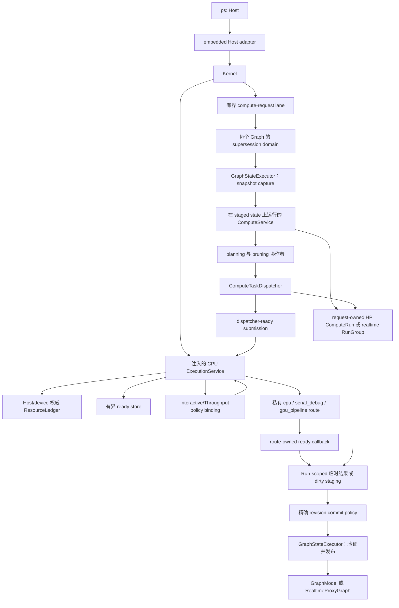

# 计算边界

本文说明当前计算子系统内部的软件行为和实现所有权。

## 范围

计算子系统接收一个通过验证的内部请求，为一个 HP domain 或协调后的 HP/RT sibling 派生工作，
执行 operation，并发布 intent-specific result。它不拥有图文档持久化、前端渲染、daemon
transport 或进程级 operation plugin
生命周期。

公共调用方只能通过 `ps::Host` 进入计算。Embedded adapter 把公共 `HostComputeRequest` 值
转换为内部 Kernel 和 `ComputeService` 请求。公共 API 不暴露 `ComputeService`、plan、任务图，
也不暴露物理 executor/policy pointer。Public compute request 可以携带一个可选正值
`maximum_parallelism` 作为 Run 上限；它不能调整进程 executor 的大小，也不能选择该 executor。
逻辑 dirty work 与 cache validity 在 planning、staging 和 Region-aware core dense path 中
保持为规范化 `RegionSet`。当前 image tile shape、Host/IPC v2 inspection、dense Value helper
与 operation ABI v1 adapter 使用 checked derived `PixelRect`/`PixelSize`。私有 dirty/tile
PixelRect 是零基 storage geometry；逻辑 Region 与 Host grant 使用有符号 data-window domain。
跨越这条边界必须先做 containment，再进行 checked origin subtraction/addition。OpenCV geometry 只存在于
provider 或算法实现内部，并且位于真正消费它的 library call 处。

[ADR 0012](../../adr/zh/0012-operation-plugins-use-a-separately-versioned-pure-c-abi.zh.md)
定义已实现的纯 C operation ABI v1、Host-owned output grant 与 trusted/supervised routing 边界。

## 所有权图

```mermaid
flowchart TD
  HOST["ps::Host"] --> ADAPTER["embedded Host adapter"]
  ADAPTER --> KERNEL["Kernel"]
  KERNEL --> EXEC["注入的 CPU ExecutionService"]
  EXEC --> LEDGER["Host/device 权威 ResourceLedger"]
  EXEC --> STORE["有界 ready store"]
  EXEC --> POLICY["Interactive/Throughput policy binding"]
  KERNEL --> REQUEST["有界 compute-request lane"]
  REQUEST --> DOMAIN["每个 Graph 的 supersession domain"]
  DOMAIN --> CAPTURE["GraphStateExecutor：snapshot capture"]
  CAPTURE --> SERVICE["在 staged state 上运行的 ComputeService"]
  SERVICE --> RUN["request-owned HP ComputeRun 或 realtime RunGroup"]
  SERVICE --> PLAN["planning 与 pruning 协作者"]
  PLAN --> DISPATCH["ComputeTaskDispatcher"]
  DISPATCH --> RUN
  DISPATCH --> READY["dispatcher-ready submission"]
  READY --> EXEC
  POLICY --> EXEC
  EXEC --> ROUTE["私有 cpu / serial_debug / gpu_pipeline route"]
  ROUTE --> CALLBACK["route-owned ready callback"]
  CALLBACK --> TEMP["Run-scoped 临时结果或 dirty staging"]
  RUN --> TEMP
  TEMP --> COMMIT["精确 revision commit policy"]
  COMMIT --> PUBLISH["GraphStateExecutor：验证并发布"]
  PUBLISH --> GRAPH["GraphModel 或 RealtimeProxyGraph"]
```

`GraphStateExecutor` 拥有可见 Graph capture、mutation、predicate 与 publication 的排他性。
独立 compute-request lane 拥有 same-Graph compute 与 route-replacement 顺序。即使 ready
callback 在私有 route worker 上执行，规划和派发仍属于 compute 职责。

当前排他机制是有界串行 FIFO lane。每个处于 accepting 状态的 `GraphStateExecutor` 恰好拥有一个
worker。Graph-state lane 保留历史边界：64 个等待 callback 加至多一个 active callback。
Compute-request lane 改为精确计费 64 个 queued、running 或 parked 的 one-shot/ticket admission；
active work 不再是隐藏的第 65 个单元。每个 key 会采用一个 reserved continuation 及其持久 FIFO
node。`wake()` 与 worker-tail handoff 复用该 token/node，不分配内存、不 self-submit，也不等待
容量。普通 `submit()` 与新 key reservation 会在所选边界阻塞；它们不会创建额外 lane worker，
也不会丢弃或绕过已经 admission 的 work。Admission 之前不保证 producer fairness，但 queued
work 会按 FIFO 执行。

两条 lane 复用相同的 executor lifecycle。每次 one-shot submission 都会返回 packaged-task
future，精确保留 callable 的 value、reference、`void` completion 或 exception。销毁 future
不会等待或取消 task；executor lifetime 会保留已经 admission 的 work。Callback 不能向自己的
lane submit，也不能关闭自己的 lane：worker re-entry 会在等待队列之前抛出
`std::logic_error`。现有 compute-request worker 是唯一的 logical active-request runner：每次
reserved-ticket turn 最多 materialize 一个 generation，并运行既有 Kernel/ComputeService path。
它只会为 generation publication、snapshot capture 或最终精确 revision/generation transaction
进入 graph-state；不会创建每个 Graph 的 background runner 或每个 generation 的 thread。

I1 request 可以通过 Host 与 Kernel 把一个可选的 source-private accepted-boundary coordinate
带入 coordinator。Coordinator 会保存完整 current `SupersessionIdentity`。一个已绑定 coordinate
的 candidate 只有在其 accepted coordinate 严格推进时，才能替换另一个已绑定 coordinate 的
current identity；admission timestamp 相等时，使用 row-local accepted sequence 打破平局。
Generation 仍是唯一 preparation identity 与 Run join key，因此在已绑定 current publication 时
数值可以向后移动，不能否决较新的 coordinate。较旧 coordinate 即使拥有更高 generation 也不能
替换 current。两端都没有 binding 的旧 caller 保持仅按 generation 排序；bound/unbound 混合
identity 同样保持 generation ordering，因此这条私有 evidence seam 不会改变 public 或非 I1
行为。进程 residency registry 会存储 coordinator-managed current generation 的精确值，而不是
取数值最大值，因此数值更高的 stale generation 所产生的迟到 native work 无法在 coordinate
授权 replacement 后恢复自身。

Public 与 I1 asynchronous request 也会共享同一个 embedded-Host admission transaction。
Host 在进入 Kernel 前构造所有可能失败的 caller-side resource：caller promise/future、成功
`Result` envelope、backend-delivery bridge、已 join 的 status worker，以及 close-visible tracking。
之所以必须采用该顺序，是因为 coordinator publication 可能在 Kernel call 返回前并发地令产品
identity 成为 current。一旦 Kernel 可能已经发布该 identity，Host 的 accepted tail 就只包含
no-throw future sharing、single-producer bridge delivery，以及 prebuilt result 的移动。因而
preparation failure（包括确定性的 source-private test injection）发生在进入 Kernel 前，不能创建
current identity、accepted product binding 或 visible output。若违反 one-delivery/one-settlement
结构性 invariant，则会 fail-stop，而不会成为可恢复的 post-publication rejection。

`close_and_drain()` 对并发调用与重复调用都保持幂等。它会停止 admission，让被满队列阻塞的
producer 以 `std::runtime_error` 被唤醒，按 FIFO 排空已有 work，并在返回前 join worker。每个
caller 都等待自己加入的持久 close generation。已 join 的 lane 永远不会重新开放 admission 或创建
replacement worker；延迟 caller 会观察同一个已完成 generation。`GraphRuntime` 会先停止并排空
compute request，同时保持 graph-state 可供已接受 request commit；随后排空 graph-state，再释放
Graph-local state。不同 graph 具有独立的 worker 和队列。Host composition 的 resource ledger
不对这些 lane worker 或固定 service thread 计费；它们保持为基础设施。其 CPU 维度改为准入由
Host-owned reserved-start transaction 提交的每个 Run 执行权。

## 当前协作者

| 模块 | 当前职责 | 不拥有 |
| --- | --- | --- |
| `ComputeRequestCoordinator` | 每个 live Graph 的 checked generation allocation、完整 current-identity graph-state publication、可选 source-private accepted-coordinate ordering、每个 admitted key 的一个 latest mailbox 与 reserved ticket、active-source supersession notification、精确 pending settlement，以及一个 logical active-runner slot | Run plan、staging、execution worker、Graph lifetime lease、lifecycle registry、telemetry 或 public ABI |
| `ComputeService` | 请求验证、intent 协调、创建/settle 一个 HP Run 或一个包含独立 HP/RT child 的 realtime `RunGroup`、调用 staged commit policy、协作者构造和最终结果选择 | 前端值、worker thread、图文档、live Graph revision/generation authority 或 public cancellation policy |
| `RunGroup` | 一个 realtime request identity、不同的 HP/RT child Run 与 observation lease、request-wide cancellation fan-out、RT-first gate 和确定性 aggregate outcome | Child plan/dispatcher、Graph state、worker、resource reservation、lifecycle registry 或 public control |
| `ComputeRun` | 带精确 Graph identity/revision 与 request supersession identity 的不可变单 domain HP/RT descriptor、单调 phase、私有弱生命周期 cancellation source、read-only lease observation、同时拥有 progressive HP trigger permission 与 observation 的唯一 terminal/commit arbiter、通过共享 control 对 full-plan/temporary storage 或 dirty-HP staging storage 的所有权、稳定 lease，以及复合 task identity | 配对 realtime grouping、Graph state、worker、revision/generation mint 或 publication authority、公开 cancellation control 或 resource admission |
| `ComputeCommitPolicy` | 仅产品使用的精确 Run/staged/live provenance 与 current supersession generation 验证、保留的 read-only Run lease、transaction 内 cancellation observation 与 Run-owned commit-contender resolution、延迟 HP cache persistence，以及在 Run success 前串行发布可见状态 | Planning、execution worker、cancellation source 或任意 cancellation authority、最终 lifecycle registry 或 public ABI |
| `ComputeCachePolicy` | HP cache eligibility 与缓存路径决定 | 磁盘 I/O 所有权或 operation 执行 |
| `NodeInputResolver` | runtime parameter 和 ready image input | 图遍历或输出提交 |
| `FullTaskGraphExpander` | 一个 graph generation/domain 的完整 node/tile task 形态 | 请求目标、cache pruning、dirty pruning |
| `NodeCacheTaskGraphPruner` | 目标/依赖锥、普通 cache cut 与 dirty request-cone 保留 | 新 node 或 tile task 形态 |
| `ComputeDispatchPlanBuilder` | cache-pruned HP plan 和 inspection record | ready-store 或 route ordering |
| `DirtyRegionPlanner` | 图级 dirty propagation snapshot | 计算依赖计数 |
| `DirtySnapshotTaskGraphPruner` | 从既有 plan 选择活动 dirty work | task expansion |
| `IntentUpdateCoordinator` | HP-only 或 HP/RT sibling 语义 | 物理优先级或 worker 所有权 |
| `ComputeTaskDispatcher` | Dependency counter、ready release、temporary-result indexing、completion、exception、full HP commit 与 dirty source-first submission helper | Run storage、Graph topology derivation、dirty staged commit、policy ranking 或物理执行 |
| `TaskSubmissionPlan` | 一个 full HP request 的 Run-owned dense index、依赖状态、exact-once task state、冻结的 implementation/device snapshot、结果槽、callback owner 与 pending-Value fence wait cancellation owner | execution-route worker、Run terminal state、native completion freshness 或 dirty-path execution |
| `ReadyTaskSubmission` | 一个 dependency-ready task 的 move-only 不可变 metadata、selected `DeviceBackend`、精确 operation constraint、复合 task identity、匹配 Run lease 与 owned executable | Planning、dependency derivation、Graph/cache authority 或 commit |
| `ExecutionService` | 一个 Host-owned 固定 CPU pool、一个由 service 拥有的 Metal lane、一个带 process-owned native resource 与共享精确 `ResidencyManager` 的固定 `DeviceExecutorRegistry`、私有 `serial_debug`/`gpu_pipeline` route、一个 Host/device 权威 `ResourceLedger`、一个 process-domain operation gate、一个私有 lifecycle-admission registry、policy-aware 有界 ready storage、Run-scoped ReadyFence continuation routing、进程级 policy binding、reserved-start transaction、精确 Run queued purge/running drainage，以及按 Run 隔离的 completion/failure/trace settlement | Planning、dependency、Graph/cache state、cancellation authority、visible commit、access-plan selection、residency eviction 或 resource ordering/fairness |
| `NodeExecutor` | 一致的 monolithic/tiled operation 调用 | 图变更策略 |
| `ComputeMetricsRecorder` | compute event、timing、benchmark event 和 debug metadata | execution trace 所有权 |
| `PolicyRegistry` 与 policy binding | 验证 built-in/DSO policy type，拥有进程级 context 与组合 native-handle/精确-capability lease，并为 Host-authored 不可变 candidate snapshot 排序 | worker、queue、resource grant、Run、Graph、completion 或 start authority |
| `ResourceLedger` | 原子预留经过检查的 Host vector、隔离的 per-`DeviceId` memory/scratch plan，以及显式 plugin process/CPU/address-space/shared-memory/descriptor vector；校准 native actual byte；签发有界 Host grant、拆分 device lease 与一次性 identity-bound plugin token；保留 replay tombstone，并在真实 owner 结束后释放精确 authority；复制确定性 diagnostic | worker 构造、ordering policy、task dependency、对 queue/in-flight/I/O 的猜测、residency eviction 或 lifecycle admission |
| `GraphRuntime::ExecutionRouteBinding` | 按 intent 存储一个复制的私有 route id 与非零 generation | 物理 route 所有权、policy context、worker、queue 或 reservation |

Compute collaborator 位于 `src/lib/compute/`；ledger 与 Graph route binding 位于
`src/lib/runtime/`；policy loading/binding 位于 `src/lib/policy/`；私有 route execution 位于
`src/lib/execution/`。这些类都是私有实现模块，不构成可安装 API。本区域唯一已安装的扩展契约是
`include/photospider/policy/policy_plugin_api.h` 声明的纯 C policy ABI。

V-4 与 V-5 建立 private monolithic registry slot，以及只识别当前选中精确 core dense callback
的 source-private lookup bridge。DI-3 现在把经过验证的 pure-C operation ABI v1 suite 投影进这些
private slot；每个 operation DSO 因而都必须使用当前 SDK，且不会有 C++ registrar 或 callback
object 跨越该边界。每个 scalar HP/RT registry slot 现在把 callback、metadata 与非零 identity
作为一个原子的 implementation value 拥有；注册另一种 callback shape 不能覆盖 sibling slot
的调度声明。
Private core runner 要求规范 named sealed CPU image Value。它把 request-effective
ParameterMap 深拷贝到一个不含 Node output/cache/topology state 的 configuration，只以该
configuration 与 logical DenseTensor/Image descriptor 调用 pure inference，再以同一
configuration、checked ImageView 与 inferred descriptor 调用 execute，并校验完整 Value
result。它还从
planning/`NodeExecutor` 接收规范化 Region，复制未选中的逻辑 coordinate，并通过 checked
stride 对精确 ImageRect 或 rank-general TensorSlice coordinate 执行 invert。同 key plugin
override 使用自身经过验证的 operation ABI v1 descriptor、Region、plan 与 grant contract，而不
继承这份 private core contract。Publication 会保留该精确 sealed result allocation/revision。
Host 与 codec adapter 保留该精确 Value 或捕获 portable artifact；它们不会派生替代 image snapshot。

DI-2 使 HP compute-service、result-committer、dirty-write、RT 与 disk-load boundary 在正式
publication 前只使用 Value。一个 immutable `DenseImageOutputPlan` 会在单次 Host binding
allocation 前固定 name、descriptor/facet、layout、storage、alignment 与 Region。whole/tile
producer entry 使用该 binding 上经过检查的 move-only grant；所有 executable grant 都必须成功
retirement 后才能完成一次 seal。validation、overlap、range、alignment、overflow、exception、
cancellation、duplicate 或 omitted-retirement failure 都是 sticky failure，并阻止 publication。
Operation ABI v1 与 codec staging 会在各自入站 adapter 处规范化；正式 commit 绝不合成缺失 Value。
V-5 不新增 callback slot 或 general planner inference；它会在 planned work 中新增 callback-free
implementation identity/metadata route，并要求 provider entry 前重新解析且精确 identity 相同。

`OutputTile::roi` 保持为零基 storage-relative callback projection，而
`HostOutputWriteGrant::image_region()` 保持为有符号 logical data-window Region。Adapter 会先按
plan width/height 校验前者，用 checked arithmetic 把两个 endpoint 经 plan origin 翻译，再与 grant
比较。Byte offset 与 OpenCV matrix view 继续使用零基 ROI 和已规划 stride。

V-6 新增一个有界、source-private 的 physical task，但不会把 transfer node 插入 graph
planning 或 `ComputeRun`。`ValueTransferTask` 会准备一个独立 pending CPU Value，并向共享的
executor 注册一次异步 source-ReadyFence wait。预先构造的 continuation 会在 pending 或 queued
时保留该 executor，并在 callback 进入时把 owner 转移到 callback-local retention；因此唯一
executor owner 能存活到 callback 完成，同时释放 executor-owned queue 的 self-reference。只有
queued callback 才会取得 source payload access、复制已验证的 envelope、退役 destination
producer access 并发布 terminal state。Fence 与 task 都不拥有 worker、queue、route、ledger
grant 或 device identity。确定性且线程安全的 fake executor 与仅用于测试的 C++17 mutex/CV
竞争 rendezvous 归测试所有。

V-7 在 `ExecutionService` 中增加 source-private 的固定 `DeviceExecutorRegistry`。仓库 Metal
plugin 启用时，Apple executor 拥有并复用 device、command queue 与经过校验的
compute-pipeline cache；一个
callback-scoped allocator 会保留 texture 与 buffer，直到 provider 返回。经过 reserved start 的
Metal submission 会同步进入匹配 executor，并使用同一条 Run completion/exception/retirement
path。一个 non-virtual、source-private 的 executor 入口会在 concrete admission 前安装按确切
身份识别的 callback frame。直接递归与 `A -> B -> A` 之类的间接环会在
submission/entry counter、context 安装或 provider 入口之前以稳定的 `std::logic_error` 失败，
而不同 executor 可以同步嵌套。作用域化 frame 恢复会保留外层 context，并原样传播 provider
异常。

V-8 新增显式 device/binding observation、AccessPlan classification、保留 revision 的 CPU/Metal
transfer 与精确 residency，同时不会把隐式 payload work 插入 `Value` accessor。Metal provider
会发布 pending source-private Value，并在 command commit 后立即返回。
CPU-copy 与注入式 external-device transfer preparation 会复用同一个 core 正向、零 offset、
精确 envelope、non-overlap producer validator。External path 会在保留 owner、生成 destination
identity、创建 ReadyFence、调用 provider 或发布 Pending destination 前完成该检查。这条
preparation boundary 不会收紧通用 native publisher 对 checked signed immutable alias 的支持。
`TaskSubmissionPlan` 会先递增 completion，再注册 fence wait；生产 ReadyFence executor 会保留精确 Run、lease、
task 与 ready-store route，把早到 callback 停放到原始 QueueEntry 与 grant 退役之后，并在所有
continuation owner 退役前阻止 terminal settlement。成功 continuation 会重新验证 canonical
named Value 与每个 declared generic named Value，并在不创建 compatibility storage 的情况下
释放 dependant。多个 Pending name 会按 canonical 顺序等待，且全部精确 staged Value 必须在
release 前为 Ready。Generic Value 会保留自身 representation 与 indexed binding identity，绝不
进入 parameter data。Failed、ProducerCancelled、stale 或 mismatched completion 不释放任何
dependant。

V-13 会按 layout family 扩展同一条显式 task boundary，而不是引入隐式 conversion。Packed FP4
source 会按照 version-1 Blocked producer envelope 校验：rank-matched 完整 quantization block、
nibble-aligned bit offset/stride、互不重叠的完整 block span，以及精确 retained byte size。CPU 与
注入式 external-device destination 会保留完整 descriptor/scale schema、Blocked layout、bit
order/offset、unused nibble bit 与逻辑 revision，同时取得 fresh binding/producer identity。
Oversized immutable BufferHandle alias 仍可作为有效 bounded view，但不是精确 transfer producer；
preparation 会在 destination publication 或 provider effect 前拒绝它。Transfer 不执行
dequantization、requantization、替代 image adaptation 或 implicit wait。

Registry 共享的 `ResidencyManager` 会在 native commit 前准入完整
Graph/target/intent/generation/Run/task/producer/revision/binding identity。Current-generation
publication 被提交给 coordinator 之前，Kernel 会先以可失败方式预跟踪 request lineage，
并建立内部零 generation 占位。只有被接受的 current publication 才会在 coordinator mutex
仍排除 `is_current()` 的期间，以无 allocation 方式把精确 generation 赋给 manager；被拒绝或
born-stale 的 candidate 不会改变它。因此，如果更新的 accepted request 在较旧 accepted request
启动其物理 Run 前成为 current，旧 Run 随后的 observation 就无法覆盖 manager 的 current
identity，无论两者的 generation 数值大小如何，其 transfer admission 都会被视为 stale。
Current-generation
校验、producer Ready transition 与 resident 插入形成同一个 manager-locked 线性化区间。对于
coordinator-managed lineage，current-identity update 要么先于旧 callback，使 destination 在
Ready 前进入 typed failure；要么发生在一个已经按当时 exact current generation 发布的
completion 之后。Standalone lineage 另行保留 numeric-maximum generation order。Duplicate 与
proper-subset identity 不能消费另一条 admission。Published-Value acquisition path 还会在每个
resident 旁保存成功 publication 的完整 `DeviceCompletionIdentity`。其精确 lookup 持有 manager
mutex，并验证仍存活的 managed lineage、completion use 与 seed、source Ready identity、已保存
的 publication identity，以及 resident Ready identity。Lineage retirement 如果先于 lookup，
即使普通 broad revision/device residency 仍存在也会拒绝；lookup 如果先完成，则返回合法的
immutable `Value` copy。普通 broad lookup、retention、replacement、capacity 与 eviction path
保持不变。Perlin provider 会编码显式
texture-to-buffer blit，不调用
`waitUntilCompleted` 或 `getBytes`；CPU-to-Metal 使用相反方向的显式 blit。`GraphRuntime`
仍不拥有 native Metal state，#74 仍是最终 visible-commit gate，而 #86 把 device-memory/scratch
authority 保留在 service ledger 内，而不是放进 residency 或 Run。

Metal 会在首个 allocation 前通过 native heap texture/buffer size-and-alignment query 得到完整
preallocation plan。Actual `MTLResource::allocatedSize` 必须在 command commit 前适配这份原子
plan。随后该 plan 会变成两个唯一 owner：persistent memory 随 type-erased native `Value`
owner 跨副本与 residency 延续，scratch 则随精确 command-completion object 跨 success、
native failure、stale/rejected publication 与 callback unwind 延续。未使用的 planned byte 会在
actual commit 时归还。Device account 按完整 `DeviceId` 隔离，不借用 Host 容量，并提供复制式
limits/reserved/available snapshot。Command queue、fixed lane 与 pipeline cache entry 仍是
infrastructure，不是 per-invocation scratch。

当前内建 CPU 准入会把强制、经检查的 service envelope 与可审计的 adapter envelope 组合起来。
Run/control/plan 或 phase-context 共享的 retained storage 只计费一次。统一的逐任务 retained 与
scratch demand 按最大 callback 并发数相乘；该并发数是固定 worker 数、逻辑 task 数与 Run 可选
正值 `maximum_parallelism` 三者的最小值。Ready entry 与 byte 仍按所有逻辑任务相乘，因此
dependency release 已被预先覆盖。Reserved start 会针对 Run in-flight state 再次执行同一上限；
该上限不会调整固定 pool 的大小。初始与 dependent entry 使用同一个 estimator 和 insertion
boundary。对于 mixed-operation physical Run，adapter 会对选中 operation 声明的
`retained_memory_bytes` 与 `scratch_bytes` 分别取最大值，再以 checked-add 合并既有
owned-callback envelope。由此得到的保守统一 task vector 同时用于 full HP、dirty HP/RT 与
connected preflight。零是 provider 的显式声明；缺失或格式错误的 metadata 不会被静默解释成零，
而是在 provider entry 前被拒绝。复制的 graph-identity metadata 按实际 string capacity 加终止
空字符计费。每个独立 retained operation/constraint key 遵循同一规则。Full-plan adapter
会为每个逻辑 task（包括每个 tile）预先分配一份独立拥有、已经计费的 constraint record，并把
每份 record 恰好一次移入对应 task 的唯一 submission。Dirty adapter 会对每个 active task
采用相同规则。二者都在移动任何 record 之前冻结 shared charge。Connected preflight 与 direct
lease 对各自独立副本计费，而 operation gate 会借用 stable view，不再复制 string。Queued gate
view 借用 owning `QueueEntry` 中的值。Direct acquisition 会先把 caller constraints 复制进
返回的 lease state；此后的每一次 gate query、wait predicate、start 与 finish 都借用该
state-owned 副本，因此 helper-local caller 可以在 acquisition 返回后退出或修改自身输入，而
不会改变 active gate identity。在所有 initial value 与 ready grant 都移动到暂存 queue entry 后，
`ExecutionService` 会在发布 active Run 和等待 settlement 之前销毁 caller-side submission
vector 的 backing；此后只有暂存 entry 以及 bounded store 保留这些 submission。在每个 dirty
或 connected-preflight service segment 之前，adapter 会加入当前 staging/snapshot storage 与
去重后的缺失 staging-map entry，
其中包括有序 map linkage，以及确定性的空 output metadata 或 seeded 可见 output metadata。
HP downstream demand 会通过仍存活的 `ComputeRunLease` 读取当前 Run-owned write buffer，再由
phase-local estimator 只加入仍缺失的 entry；这样 source 创建的 entry 会继续被计费，同时不会
重复计费。

Connected-preflight preparation 会分离共享所有权与逐 node 所有权。一个 umbrella reservation
会在整个 connected closure 中把共享 Run control、prepared result 与预计缺失的 staging entry
恰好计费一次，并计入自身私有 carrier 与 ledger reservation-state envelope。每个 node
reservation 只计入该 node 独有的 callback、ready-entry、ready-byte 与 service-envelope
所有权。只有在全部 node root 与最终 cancellation-slot 容量均已确定后，才会准备 umbrella。
因而精确的组合上限可以准入该 closure；retained-memory 少一个 byte 就会在进入 provider 前
拒绝。Rollback、安装失败或 provider 失败都会恰好一次释放全部 node root 与 umbrella。

Dirty HP 与 RT demand 还会计入完整的 request-owned `DirtyNodeSynchronization`：shared
allocation、unordered-map bucket、value 与 linkage、每个由 `unique_ptr` 拥有的
`std::mutex`，以及可见 object storage。Allocator-private map metadata 与不透明的 platform
mutex allocation 仍排除在外。并发 HP/RT sibling 会在两个独立 phase reservation 中保守地
计入同一个 shared synchronization object。这种有意的双 reservation 允许任一 sibling 先
settle，同时不会让仍存活 Run 的 shared ownership 失去计费覆盖。Estimator 只计算所有权与
大小均可见的 Host-owned C++ storage；当前 demand record 未表示的 operation-produced image
pixel 与 named-value 增长，以及不透明的 backend、device、plugin 或 allocator-owned
allocation，都不会被虚构。当前内建 adapter 声明 scratch 为零，仅因为它们不拥有需要独立计量
的固定 Host scratch。

在 process-service dirty source segment 期间，source context 拥有外层 task
`std::function` 的左值副本，而该外层 function 仍保持存活。因此 source demand
会在 context-owned target 之外额外加入一份经审计的 callable payload。Downstream
context 通过 move 接收该外层 callable。由于 C++17 不要求 moved-from
`std::function` 为空，一个私有 context-construction helper 会把 destination
构造与外层释放变成不可拆分的操作：factory 必须先成功返回 owned context，随后
helper 会在任何 submission 构造、phase retained-demand 计算或准入运行之前显式
清空外层 holder。构造失败时，外层 owner 与 factory 临时对象仍通过正常栈展开
释放。因此 downstream demand 只覆盖 context-owned target，不依赖 moved-from
implementation detail。一个长期回归会用 move 后仍保留 source target 的对抗性 holder
调用同一个 production helper，因此删除显式 release 时，该回归都会失败。

原已安装的 `kSchedulerWorkerProcessMax` 常量与拥有 worker 的 scheduler ABI 均已删除。
源码 consumer 不会获得 compatibility alias 或已安装 replacement。组合 limit 使用 source tree
私有的 `ExecutionResourceLimits`；第三方 policy selection 使用独立的纯 C policy ABI v1，且不会
获得任何执行资源。

### 当前 operation-plugin v1 compute adapter

Operation-v1 loader 会把 immutable implementation 发布到 process-owned registry；
plugin 不获得 `ComputeService`、`ExecutionService`、`OpRegistry`、scheduler、cache、
Graph、Run、ledger、device owner 或 commit callback。一个 Host adapter 把 private compute
snapshot 转为 borrowed exact-size C record，再把 copied sink output 转回 private plan、
Region、dependency 与 temporary result。该 adapter 是 public ABI 与 private compute model
唯一交汇点。

每个 invocation-scoped callback 绑定到 Host-minted generation/invocation handle、
permanently identified operation/implementation、configured plugin context、intent 与
accepted descriptor。Definition、configuration-lifetime、root-query、destroy callback 则绑定
到精确 leased DSO generation 与显式 identity/context，不虚构 invocation handle。这些 opaque
128-bit handle 是 correlation fact，不是 pointer、lookup API、resource grant、durable identity
或 wire value。Configuration/descriptor view immutable 且只在 callback 内有效；inference、
Region propagation、dependency construction 期间没有 payload pointer。

调用顺序固定为：

1. configured operation 可调用前，完成 configuration validation 与 context creation；
2. allocation 前，inference 返回全部 immutable output descriptor、extent、buffer size 与
   access requirement；
3. backward dirty 与 forward active-edge Region callback 派生 checked planning fact；
4. 声明 data dependence 的 implementation 在 cache 前生成 copied/validated dependency
   record；
5. monolithic/tiled execution 只接收 immutable input，以及从 accepted inference plan 派生
   的精确 Host-owned mutable CPU range。

Operation ABI v1 同步且只支持 CPU-addressable buffer。Callback return 结束全部 borrowed
descriptor/write grant。它不携带 native device handle、device-resident buffer、fence、
completion owner、delayed sink 或 asynchronous lease。Private device work 必须在 return
前 stage 到 Host CPU binding；否则应位于 Host-private adapter 后面，或等待未来独立版本化
native/async suite。

Host 拥有 output allocation，且不公开 allocator callback。Planning/diagnostic 通过一个
callback-local Host sink 流动，其第一次 failure 为 sticky。Host 在 return 前验证并 deep-copy
emitted record；missing、duplicate、stale、malformed、out-of-plan、out-of-range 或 overlapping
write 都会在 cache/Run-visible commit 前被拒绝。

当前 v1 publication 保留 strong transaction 与 per-slot revision/predecessor rule。每个
callback/configured context 在 validation、status normalization 与一次 destroy attempt 完成前
保留精确 DSO generation。Retirement 先移除 visibility，再等待，reverse destroy，最后 unmap。
调用 plugin code 时不持有 registry、scheduler、execution 或 publication lock。

进程内 callback 仍可永久忽略 cancellation。Host 可令其 result 失去资格，却不能虚构 return、
回收 write grant、destroy context 或安全卸载 DSO。因此 operation v1 是 operator-trusted
compatibility boundary。Issue #102 最初引入源码私有、无指针的 Darwin/Linux protocol-v1
invocation 切片，它使用 framed Unix stream、有序 `SCM_RIGHTS` descriptor 与已 unlink 的 POSIX
shared memory。DI-3 后续把这套独立 wire contract 推进到 isolation protocol v2，使 supervised
operation ABI v1 record 精确保留 descriptor identity、version、digest、Region 与 immutable
plan。Issue #103 围绕该 transport 提供源码私有的有界 supervision 组合；Issue #104 则为长期
维护的直接与受监督入口增加签名 immutable-snapshot admission 与可执行 Host resource policy。
Linux 通过 sealed descriptor 支持这些 runtime 入口；Darwin 会在 invocation 副作用前拒绝构造。
ABI pointer record 与 Host 铸造的 resource token 永远不是其 wire protocol。通用
syscall/network sandbox 仍在本切片之外。

`NonSupervisedIsolatedCpuInvocationExecutor` 会在 spawn 前验证 invocation identity、
generation/operation binding、scalar parameter、resource declaration、readiness/ownership、
descriptor geometry、access direction、range 与 canonical descriptor/content digest。
One-call runtime 会在映射 callback-local view 前独立执行同样检查。Host 等待进程正常以零状态
退出，随后重新验证每个 FD、capability header、response、descriptor 与 output range，把
output snapshot 复制到全新 Host allocation，并在 seal `Value` 前针对实际 copied byte 验证
binding。RAII owner 会在成功或失败时关闭 mapping、descriptor、channel 并精确 reap child。
直接使用仍有意不包含 supervisor、authentication、deadline、heartbeat、restart 或有界 hang
recovery。它会获得 #104 package trust、Host resource admission 与 process rlimit，但这些能力
不会把原始 transport 子角色变成受监督执行或通用 sandbox。

Issue #103 在同一个源码私有 product module 中加入 `PluginRuntimeSupervisor` 与
`PluginInvocationExecutor`，但不改变 #102 request/response wire。每次受监督调用都使用一个
全新 exec child，并在固定 descriptor 5 上使用专用 Unix datagram lifecycle channel。Host 会
发送一个定长 hello，其中包含 OS 随机 128-bit nonce、完整六部分 invocation identity 加
worker/plugin generation，以及选中的 heartbeat interval。Child 必须在严格有序的
`RuntimeStarted`、`Heartbeat` 与 `InvocationCompleted` event 中回显这些事实。这样会把
liveness 绑定到精确私有 launch；由于 child 会知道 nonce，它是 session authentication，而不是
plugin attestation 或 output truth。

Supervisor 会强制绝对单调的 startup、invocation、heartbeat-gap、response、graceful-
termination、kill 与 reap bound。完整 request transfer 会获得一个独立、完整的 invocation-
duration window。只有在每个 byte 与 descriptor right 都已发送、Host `SHUT_WR` 成功，
并且再次观察同一绝对 transfer deadline 后，该传输才结束。通过该观察的精确单调时钟样本
就是 `accepted_at`；callback invocation deadline 与初始 heartbeat-gap deadline 都直接从它
派生。迟到但成功的 shutdown 是 invocation-deadline fault，且不得启用全新 callback 或
heartbeat budget；失败的 shutdown 仍是 channel 事实。验收后的调度停顿会消耗这两个 budget，
后续 caller 重新读取时钟不得再赠送一个窗口。有界的大 request send 仍不会消耗
callback-liveness budget；即使 callback 继续发送
heartbeat，绝对 invocation deadline 仍会终止它。构造阶段会在取得 child ownership 前，验证
每个配置 duration 为正、未超过包含式 24 小时上限、可由 steady clock 精确表示，并满足
heartbeat 字段顺序；这种验证无法证明任何未来 time-point 求和。因而，每次实际派生 startup、
transfer、callback、heartbeat、response、termination、reap、observation 或 restart-backoff
deadline 时，都会在加法前以同一个已捕获 base 检查
`base <= time_point::max() - duration`。精确贴合上界有效。取得 ownership 前超出一个
tick 会通过受控异常 fail closed；取得 ownership 后，在 cleanup 前发生的 lifecycle 或短暂
精确 status-observation 溢出会映射为当前按阶段类型化的 fault 并执行精确 cleanup，而
派生 termination/reap-cleanup 或 restart-backoff deadline 时发生的算术失败会保留已经建立的
primary fault。这条算术规则不会削弱 ownership 优先级：如果 cleanup deadline 可以表示，但
精确 PID 在最终 bound 时仍不可等待，则唯一 ownership 会转移给 deferred reaper，最终产生的
`ReapPending` fault 优先于更早的 phase fact。任何路径都绝不回绕、饱和、截断，亦不重新采样
时钟来替换 base。如果没有更强的 process 或 deadline 事实，真实 channel/status-observation
syscall failure 仍为 `Channel`。Fault 会暴露精确可观测的
deadline、
lifecycle-protocol、channel、bad-output、natural exit、signal 与 termination-stage 事实。
匹配的 `SIGKILL` 只会标记为 memory-pressure-compatible，不能证明 OOM 因果。Failure 会关闭两条 channel，必要时
从 `SIGTERM` 升级到 `SIGKILL`，并在 reap 或 quarantined deferred-reaper integrity path 完成前
保留精确 PID ownership。
已经回收 child 并不能证明其 lifecycle datagram 队列为空：在把已保留 status 分类为
callback 未完成便退出之前，monitor 会排空已经排队且序号连续的 event。经过认证的
completion 会推进到未改变的 response/EOF/decode/publication 检查，同时已保留 wait
status 仍可使用；缺少该 completion 与有效 response 的零退出仍是错误输出。

`PluginInvocationExecutor` 绝不会回退到 in-process 或 non-supervised call。有界 restart
backoff 后，下一次 invocation 会获得全新 PID、nonce、lifecycle channel 与 data channel。
链接产品的真实 exec 测试会证明 success、startup authentication、各类 deadline、排队
completion 先于正常退出分类、natural exit 与 signal classification、malformed output、
descriptor/PID 精确 retirement、无 fallback 与后续健康恢复。一项测试会在 production
`ExecutionService` ready callback 中调用该 executor：原始
`PluginRuntimeFault` 到达 request boundary，该 boundary 只把 owning Run 发布为 Failed，固定
service worker 随后会执行无关 Run。

Issue #104 已经在两个长期维护的 Host entry materialize invocation 前执行无副作用 preflight。它
导出精确 shared-memory 与 descriptor demand，再与一个 runtime process、一个 CPU slot 和已配置
address-space policy 合并。Attempt-local `ResourceLedger` 会原子预留该
`PluginResourceVector`，并铸造 move-only token；该 token 绑定完整 tenant/Job/attempt/worker-
lease/package-generation/invocation identity 的 domain-separated SHA-256 digest。Executor 会在
shared-memory、FD、mapping、socket、fork 或 exec 副作用前，针对相同 identity/resource fact
消费 token，并把产生的 RAII lease 保留到 response validation 与 publication 结束。Token 或 lease
只归还一次 vector；replay tombstone 会保持 spent，直到 ledger 销毁。

同一份进程 trust policy 还会在 native mapping 前 gate operation 与 policy DSO。当前只有 Linux
提供所需的不可逆 sealed-memfd exact-object 边界。进程内 mapping 成功后，会把这份精确 capability
与 native handle 放在同一共享 lease 中，并保留到最后一个 operation callback/generation 或 policy
record/binding owner 退役；最终释放会先 unmap DSO，再关闭 sealed descriptor，因此复用某个
`/proc/self/fd/N` 编号也不能改变 resident 对象的授权身份。Darwin、当前 Windows 与其他所有不支持的
native profile 都会对 operation、policy 与 isolated-runtime role 在候选 path 访问前返回
`ExactObjectUnsupported`；该拒绝之后不会发生 initializer、ABI callback、token 或 OS invocation
副作用。

隔离 executable 构造还使用由 `PHOTOSPIDER_PLUGIN_TRUST_MANIFEST`、
`PHOTOSPIDER_PLUGIN_TRUST_SIGNATURE` 与
`PHOTOSPIDER_PLUGIN_TRUST_PUBLIC_KEY` 配置的进程不可变 Ed25519 签名 manifest。获批 entry 会绑定
`isolated-runtime`、package id、generation 与 SHA-256 byte。Linux 会把获批候选复制到 anonymous
`memfd`，应用完整 immutable seal set，在 seal 后确认 digest，再通过 `fexecve` 执行该 descriptor。
Darwin 会在 executor 构造时报告 `ExactObjectUnsupported`，先于候选访问、token 发放、capability
materialization、socket 创建或 fork，并且不会创建 runtime pathname snapshot。

Native exec 前，child 会应用已经准入的 `RLIMIT_AS`、正值 `RLIMIT_CPU`、经过检查的
`RLIMIT_NOFILE` 与零 `RLIMIT_CORE`；setup failure 会在 plugin code 运行前报告。Environment 仍为
空，stdio 指向 `/dev/null`，只有固定 private channel 与已准入 invocation capability 会保留。
Aggregate ledger admission 与 per-process rlimit 是独立 Host 检查；它们既不建立 syscall/network
sandbox，也不会把 `SIGKILL` 变成 OOM 证明。

Adapter、runtime endpoint、supervisor 与 executor 都会编入 installable product archive。
Operation ABI v1 supervised descriptor 现在通过 matching signed-package
`PluginInvocationExecutor` route；request/response 使用 isolation protocol v2，且没有 direct
callback fallback。Public `ExecutionService`、`WorkerManager`、embedded Host/CLI 与
`photospider-worker` 仍不暴露终端用户 runtime selector；更强 platform sandbox profile 仍是
独立工作。Issue #106 现在通过两个手工 opt-in、
调用生产 decoder 的 harness 负责范围收窄的长期 codec evidence，并负责 execution observation
join `(page session, GraphRevision, RunId, RunLocalTaskId)`。该 tuple 在每个 event 上可缺省、大小
固定，并从已校验的 ready submission 复制；它绝不参与 scheduling、cache reuse、cancellation、
retry choice、settlement、quota、artifact 或 commit authority。

## 请求行为

1. `Kernel` 解析 session，把缺失 intent 规范化为 HP，形成 `(target, canonical request intent)`，
   分配经检查的 graph-wide generation，并在 graph-state 之外采用该 key 的 reserved compute-lane
   ticket。随后一个 graph-state work item 把该 generation 发布为 current，合并一个 pending value，
   并唤醒 ticket。对于 private I1 path，Kernel 还会在 publication 之前把 pre-call
   accepted-boundary coordinate 带入 immutable supersession identity。
2. `ComputeService` 验证 target、intent、dirty ROI、cache flag 和 execution strategy。
3. 一次 reserved-ticket turn 会在 graph-state work item 中捕获 request-owned Graph/proxy
   snapshot。对于非 realtime HP，`ComputeService` 在 planning 前创建一个 `ComputeRun`；对于
   realtime，它会在 preflight 前创建一个 request-owned `RunGroup`，其中包含独立的 HP Full 与
   RT Interactive child。每个 child 都捕获 fresh Run id、session label、强 Graph instance
   identity、权威 revision、target、显式 QoS，以及该 request 不可变的 supersession
   key/generation。Request cancellation source 会把其稳定的首个 reason 扇出到两个 realtime
   child；HP-only child cancellation 保持局部。
4. 在 extent、ROI 或 task-shape 决定使用连接参数之前，parameter producer 会稳定为一个
   request-local HP snapshot。
5. Planner 展开一个 domain 的完整 task 形态，再限制到请求目标和依赖锥。普通 full HP
   planning 可以立即消费 exact formal cache；dirty planning 只记录该观察，同时保留完整的
   callback-free 锥。
6. Dirty request 会让每个 snapshot-selected task 保持 executable，只把旧 exact cache 当作可能的
   staging merge base，并在保留的 dependency universe 上应用 current-request external-satisfaction
   demand cut；dirty 状态不会创建新的 task 形态。
7. 每个执行阶段都会 materialize 保留 Run lease 与 `(RunId, RunLocalTaskId)` 的 move-only
   `ReadyTaskSubmission`，并且只把 ready work 发送到 Host-owned `ExecutionService`。Full HP 使用
   `TaskSubmissionPlan`；preflight 与 dirty HP/RT 使用 heap-owned phase context。三个封闭的私有
   route 全部进入公共 ready store、policy selection、reserved-start transaction 与 Run-lease
   completion path。Explicit cancellation 或过期的 injected monotonic deadline 会在既有 planning、
   queue、callback、dependency、phase 与 commit boundary 被观察。Service 只关闭并清除匹配 Run
   的 queued entry；已进入的 callback 会排空，但不会释放新的 dependent 或发布 staged output。
8. Worker 只写 request-owned Graph/proxy state，包括 Run-owned full-plan 临时结果或 dirty-HP
   staging。RT staging 仍由 sibling callback 局部持有，但所有 service callback 都会在同步
   settlement 前保留 RT child lease。
9. 输出验证后，每个 Run 到达 `CommitPending`。产品 policy 验证精确 staged/live identity、
   权威 revision 与 current supersession key/generation。它会保留 read-only Run lease、进入
   graph-state work item、观察 cancellation，
   再尝试取得 Run-owned one-shot commit contender。该 claim 之前被接受的 cancellation 不会发布
   Graph、proxy 或 deferred cache state；contender 获胜后，后续 cancellation 成为 terminal
   no-op。Policy 会可选持久化变化的 HP artifact、发布完整 Graph/proxy state，并在同一个 work
   item 中解析 success 或精确 failure。Coordinator 只有在两个 child 都 settle 后才返回 RT
   output；随后结果、事件、计时和错误通过 Host value 边界复制返回。

## 规划不变量

- Full expansion 以 graph topology generation、compute intent、规范化 route-visible device
  inventory、operation-registry generation 与 task-shape configuration 为键。
- 当当前 input/parameter 可能在拓扑不变时改变 output extent，force-recache 会使可复用 expansion
  失效。它还会在 task population 前禁用 request-time cache satisfaction；可失败的 preparation
  不会清除 Graph 的可见 output。
- 请求目标、cache availability 和 dirty 状态裁剪既有 task 形态，不会重定义图拓扑。普通 HP
  planning 会立即把 exact complete formal cache 作为 read boundary 消费。Dirty planning 则保留
  完整的 callback-free target cone，只记录 planning-time observation。Selection 绝不会仅因旧
  output 仍具有 exact complete validity 就省略 dirty snapshot 明确选择的 node：这些 byte 可以
  seed staging 并保留未选中的坐标，但选中的 Region 必须执行。Planning 后删除 cache 或把它降为
  partial，同样会让保留的 dirty provider cone 保持 active。Force-recache 连 staging reuse 也会
  禁用；RT intent 绝不会把 formal HP cache 提升为 task satisfaction。
- Dirty demand traversal 使用完整保留的 node/dependency universe，其中包括 inactive connector
  node 与 external-satisfaction boundary。遍历会在 satisfied boundary 处停止，但最终发出
  结果只限于 dirty candidate。因此 `A(dirty) -> B(satisfied, inactive) -> C(dirty)` 只执行 C
  而不执行 A；如果另一个未满足 consumer 仍需要 A，则 A 会作为 shared demand 被保留。
- 只要仍有由 `ComputeTaskGraph` 派生的 execution-visible callback 可能执行，该图就不可变。
- Planned node work 只保留选中的 implementation identity、device、metadata 与 callback shape。
  Submission 必须重新解析同一个非零 identity 后才能保留 callback，因此 cached plan 不拥有 DSO lease。
- TensorSlice HP Region planning 会为每个 executable target/upstream node 只执行一次 eligibility
  selection，并保留 callback-free operation key 与完整 identity/device/shape/metadata route。
  Dirty active-task selection 一完成，如果 active view 为空，route validation 会在比较 intent、
  device inventory、task id 或 node route 前完成，因为不会执行任何 planned operation。否则
  preparation 会把每个 active task-population route 与该 Region-plan authority 比较。任一不匹配
  都会在 ROI mutation、task materialization、callable resolution 或任何
  provider/gate/grant/reservation/ledger ownership 前以 `NoOperation` 失败。
- Dirty HP/RT 会在 planning 与 selection 后，对每个唯一 active task node 执行重新验证。此时
  Graph 或 realtime-bundle 的逻辑生命周期可能已经安装，但重新验证仍发生在 constraint 构造、
  resource estimation、source-first 物理准备、provider entry 以及 operation/resource/physical
  admission 之前。缺失或变化的 active route 会以 `NoOperation` 失败；随后必须 finalize 已安装的
  逻辑生命周期，不得留下 gate、grant、root reservation 或 ledger 残留。Inactive task 以及已由
  connected preflight 满足的 node 会被明确排除在该检查之外。如果 request-local external
  satisfaction 移除了全部 task，context drift 已无关且 preparation 保持成功 no-work；只要仍有
  任一 active task，完整 context 与每条 active route 仍必须匹配。No-work
  shortcut 位于已经安装的外层 request lifecycle 内：candidate、standalone/RunGroup bundle、
  successful terminal、quiescence、resource settlement 与 unregistration 仍会发生，而 ready
  entry、callback、operation gate、policy invocation、root reservation、child grant、
  provider entry 与 ledger demand 均保持为零。
- HP 与 RT 是独立 compute domain；一个 plan 不创建跨 domain task 依赖。
- 逻辑 propagation、dirty planning、source history、per-node state、edge mapping、
  staged-write validity 与 Region-aware dense callback 携带规范化 `RegionSet`。
- Region propagation 与 dirty planning 会使用和 execution 相同的规范 route-visible device
  inventory 与 compute-domain intent，选择实际的 revisioned implementation 后再判断
  TensorSlice eligibility。只有选中的精确 core dense monolithic callback 具有 private tensor
  contract；选中的 same-key device replacement 会返回 Unsupported，不会回退到 scalar。
- 当前 image tiling、dense Value processing、Host/IPC v2 inspection 与 operation ABI v1 adapter
  携带 checked derived `PixelRect`/`PixelSize`，绝不携带 OpenCV geometry。Dirty/tile
  rectangle 是零基 storage projection；有符号 logical Region metadata 通过所属 data window
  翻译。TensorSlice 是 HP-only monolithic work，绝不会获得 rectangle。
- 在可行时，tiled input normalization 每次 node invocation 只执行一次，而不是每个 tile callback
  执行一次。
- V-3 dense invert inference callback 无法检查 payload byte；其 execute result 必须与
  inferred DenseTensor descriptor 及 Image Facet 一致，之后 publication 才可保留精确的
  sealed result revision。

这些规则使规划保持确定性，并让 policy/物理执行独立于图语义。因此，规划成本遵循先 full
expansion、再 pruning；lazy task creation 不属于当前 planning contract。

## Dispatcher、Policy 与 Execution 边界

Dispatcher 拥有请求正确性，而 `ComputeRun` 拥有当前 full HP storage：

- dependency counter 和 dependent map；
- source-first dirty task release；
- task reference accounting；
- 对 Run-owned 临时结果槽的 indexing 与 transition；
- exception normalization 和 completion aggregation；
- 空 plan 验证；
- 最终 target 选择与 full HP commit；dirty executor 在复用 source-first submission helper 后拥有
  自己的 staged commit。

`ExecutionService` 拥有物理机制：

- 有界 ready storage 与私有 route 的 worker/device lifecycle；
- 按 Run 隔离的 settlement 与 route-specific in-flight state；
- service-class arbitration、Host-authored frontier reduction 与经过验证的 policy selection；
- reserved-start resource exchange 与实现特定的 execution；
- completion 和 exception publication；
- 通过 Host context 发布有界 trace。

Policy callback 与私有 route 都不会收到 `GraphModel`、`ComputeTaskGraph`、
`DirtyRegionSnapshot` 或 cache authority。新就绪的 dependent work 由
`TaskSubmissionPlan` 作为另一个 `ReadyTaskSubmission` 释放；只有 Host 能验证 candidate、提交
start，并把 callback 所有权转移到复制的 Graph route binding。

进程 service 在 Kernel 之前显式组合，并直接拥有一个固定 CPU worker pool、一个私有 Metal
worker lane、一个固定 device-executor registry、一个 Host 与逐设备权威 ledger，以及一个有界
ready store。配置只会解析并
冻结一次 `[1,8]` 个 CPU 基础设施 worker；Graph load、replacement、Run execution 与 dirty
阶段都不会调整任一 lane 的大小。Benchmark `execution.threads` 是单次 Run 上限，不是
execution configuration request。缺失或零会选择一个有界自动 cap，`1..8` 会选择精确 cap。
`BenchmarkService` 最多以 `worker_count=0` 准备进程 service 一次；随后 `RunAll` 会在同一个
pool 上运行采用混合 cap 的有效 session；配置文件解析完成后，它不会校验 disabled session 的
thread 范围，也不会运行这些 session；它还会记录和跳过无效 enabled session。每个 Run 在发布前原子预留
完整且经过检查的 CPU/retained/scratch/ready vector。Initial 与 dependency-released work 都
必须持有匹配的 ready-entry/byte grant，并进入同一个 policy route；从队列移除时会把该 grant
交换为 CPU/memory/scratch 执行权。Completion、failure 与所有异常路径都恰好释放一次精确 vector。
独立 Run 仍相互隔离。

### 当前 benchmark 边界

当前 `BenchmarkResult` 是 diagnostic aggregate，不是 SLO record。它保留 total
wall duration、从所选 operation event 得到的 trimmed typical duration、平均 I/O
duration、原始 operation execution duration、image dimension 与解析后的 Run cap。
`BenchmarkService` 不拥有 warmup、nearest-rank percentile 契约、current-generation
visibility timestamp、completed service window、discarded-work accounting、权威
high-water sampling、稳定 result/artifact/trace digest、reference digest 或独立
dimension verdict。

长期维护的手工 OpenCV concurrency 工具会针对一个固定合成 graph 增加 warmup 与
原始 wall sample。长期测试还证明 Run cap 1/2/4/8 下的精确 callback overlap，
以及一个 cap-1/cap-8 fixture 的逐位 output equality。这些观测证明机制可达和一台
机器的 scaling，不构成 Interactive、batch 或 mixed-load SLO。

[ADR 0010](../../adr/zh/0010-execution-profile-slos-are-six-independent-benchmark-verdicts.zh.md)
冻结目标 workload、六项 metric 公式、失效规则与下游证据归属。Issues #93 至 #96
现在已经在真实 admission、visibility、cancellation/quiescence、artifact、trace、
completed-service 与 resource-lifetime 边界增加各自负责的 source-private collector。
#96 还提供精确手工 M1 protocol 实现与现有 canonical outer-envelope materializer/
resolver。这表示实现已经存在，并不声明 timed machine corpus 或其 external authority graph
已经通过。任何 placeholder zero value 都不能替代缺失的 observation source。

这些画像 collector 具有精确 boundary 义务。Edit ordinal `1..12` 映射为
`edit_index=0..11`；nominal monotonic admission start 与其 bounded lateness 是不同
timestamp。I2 使用合法 RT-preview/HP-final child descriptor，记录 preview
admission/visible、final trigger/admission/visible 与 generation-current check。Logical
equality 是 typed available `ContentDigest`。B1 记录每个 `ComputeIoExecutor` task
charge、带 executor 签发的精确 delta/linkage/sequence 与同锁 process snapshot 的
accepted admission/settlement event、planned-byte high-water、ADR 0009 requested/
achieved durability、完整 output receipt、raw payload/manifest hash，以及独立 canonical
semantic trace。其 raw ready observation 会把 callback 的 adapter-owned byte declaration 与映射进
canonical resource vector 的 logical ROI byte 分开保留，因此 declaration drift 不能被重新计算所
掩盖。每个 active Compute I/O snapshot task 必须精确位于一个 constructing/queued/running phase。
Retained global event sequence 可以因省略无关 work 而存在数值 gap，但每个必需 task-local
transition 仍是强制项。适用 B1/M1 environment evidence 还会保留唯一的
`execution-profile-b1-storage-raw-proof-v1` document：共享 manifest grammar 下的六个
field 承载 backend 与全部 21 个 raw field observation、native mount evidence、两次
37-component performance cut、transaction/receipt event 以及 root/destination ownership。
它不保留 derived proof boolean。每一侧 compatibility 都严格解析这些 byte，并独立 replay
每个 adapter、normalizer、mapper、binding 与 containment predicate，之后才精确匹配
eligibility。M1 除 candidate/reference comparison provenance 外，还记录两个 same-ordinal
isolated pair reference。

Source-private 的 #96 M1 实现以 checked arithmetic 推导 `C^M1`、`W^M1`、`B^M1` 与
`U^M1`；保留精确 1/7/40 I1 origin grid、固定 A252 与 B253/A254/B255 offer、final-warmup
current hold、carryover/FIFO snapshot、Graph producer 独立 cycle、U cutoff 与 final-zero
settlement；并评估不可互相替代的 latency、progress、fairness、waste 与 memory 轴。
Fairness 包含精确 30 个 paired Throughput window 的 nearest-rank p05、Graph A/B completed-
service Jain p05、至多三次适用的 Interactive start，以及全部 480 次 measured I1 admission
的完整分类。Environment pairing 原样委托给 base-only I1 与完整 eligible B1-cap-eight
relation。

第一次 measured admission 与 final-warmup current hold 来自 source 推导，而不是 runner
铸造。一条共享 producer/reader projection 会精确 join 保留的 final-warmup 与 measured-zero
Issue #93 input，推导 accepted coordinate、Host success、product-bound current/visible
replacement、boundary-only cancellation 与旧 settlement fact，并在 protocol evaluation 可能
提前返回之前关闭这些 fact。因此 direct、canonical 与完整重新 hash 的 outer replay 会拒绝
同一个 raw-source 矛盾，并重新计算同样六个 verdict。

同时间 displacement 使用同一个 source authority。若 measured current 被观察为 `(B,n)`，
则被替换 warmup Run 的 cancellation `(B,n+1)` 在 replicate-wide observer domain 中晚于
current，会保持 current hold，且不是 boundary-only。严格早于 B 的 cancellation，或在
`(B,m)` 且 `m<=n` 的 cancellation，都会 fail closed。该 observer sequence 绝不与独立的
accepted-row sequence 比较。M1 source closure 也不会使同时具有 visible success 与 accepted
cancellation 的 Run 绕过 Issue #93 validity。

每次 service start 的 applicability 来自产品签发的 evidence cut，而不是根据 I1/B1 nominal
interval 事后重建，也不是 scheduler-selection cut。`ExecutionService` 首先在 Run lifecycle、
operation gate 与 physical route 允许选择时，把 ready lane 头视为 scheduler-selectable；暂时性的
child-grant capacity 不会筛除 policy frontier。若所选 entry 在 reserved start 无法取得 child
grant，它只会得到当前 worker cycle 的 grant-block mark；policy/fairness counter 保持不变，
该 worker 会继续搜索其余 candidate。

物理 start commit 前，独立的 evidence-startable probe 会为两类额外检查剩余 child-grant
capacity。只有所选 operation gate、route、ready removal、counter 与 execution grant 全部
commit 后，才会发布这条 observation。M1 collector 在既有预分配、allocation-free、
callback store 中保留两类 capacity-aware fact 与 committed-grant bit。
Scheduler 的三比一 `consecutive_interactive_` 计账继续使用 scheduler-selectable Throughput
competition，而不是这些更窄的 evidence fact。Nominal interval 只保留为 Graph-demand
diagnostic，不能重置或豁免任一规则。

一个预分配的 `M1FairnessObservationCollector` 为带 tag 的 I1/B1 Run 提供一个有界 observer-
causal domain。`ComputeRunObservationFanout` 把同一个 authority-owned product coordinate
转发给该 collector 与复用的 I1 或 B1 collector；它不会把 observer clock 与 I1 独立的
accepted-row sequence 合并。每个 fanout product callback 都先发布到复用的 source collector，
最后才进入 M1 sequence authority。Authority callback 的返回是 reservation-completion edge，
因此 stable M1 cut 不可能早于携带同一 coordinate 的 source-history record 发布；coordinate
reservation 与显式 abort 仍只进入 authority。Overflow、sequence exhaustion 或 tag/QoS
不一致都是 sticky fail-closed evidence。Coordinate allocation 会在同一个 exception-free 的
serialized atomic section 中采样 steady time 并分配下一个 sequence，因此并发下递增 causal
sequence 保证 `observed_at` 非递减。Contender 会重试到 constant-work owner 释放该 gate；竞争
绝不会变成 `sequence_exhausted`，后者只保留给非零 `uint64_t` 的真实数值边界。Local task
identity 从零开始：start 与 terminal event 允许 task
zero，只有 non-task event kind 才把零用作 scalar sentinel。Source-private 的 `M1Host` 不增加
compute route：它从同一个 service 组合 Host/device ledger、Compute I/O、按 class 分区的
ready、lifecycle 与不可变 Throughput capacity/reserved snapshot。它唯一的 mutation 是幂等
evidence-finalization seam，且只有在
全部 Graph 与 Host operation 已关闭后才合法。该 seam 会关闭同一个 execution service，使
runner 能保留终态 `ServiceStopped` cut；它不是通用 compute、phase 或 lifecycle 控制面。

Collector 的 boundary snapshot 同时闭合 coordinate reservation lifetime 与 slot
publication。有界 reservation-entry frontier 在 route commit 前推进；匹配的 completion 只在
callback delivery 后，或 commit 拒绝时显式 abort 后推进。Claimed 与连续
release-published frontier 跟踪 event slot。只有四个 frontier 在 copy 前后完全对齐且未变化
时，cut 才稳定；复制出的 vector size 相等不能隐藏 reserve 后、commit 后或 claim 后的暂停。

M1 Compute I/O high-water 同样从 event 推导。每个 protocol B1 offer 必须精确解析到一个完整
Issue #95 job stream；该 stream 包含 Initial、每次 executor 签发的 admission、每次匹配的
settlement 与 Final，并保留 task identity、不可变 charge、status、phase counter、同锁
snapshot 与全局唯一 accounting sequence。缺失、重复、重排、未知、超限或算术矛盾的
transition 都会结构性 `Invalid`。稀疏 `M1Host` cut 只保留 current-state diagnostic，不能
增加或修复 high-water；最终 process cut 仍必须归零。因此，即使短 I/O task 在两个稀疏 cut
之间完整开始并结束，也仍会进入 event-derived maximum。

Host ledger 与每个 identity 稳定的 configured device 还会保留逐 component lifetime
envelope。每个 temporal cut 都必须满足
`reserved <= lifetime_high_water <= limit`，同一 authority 的 lifetime high-water 必须
非递减。Reserved 高于 high-water 或 high-water 发生下降属于结构性 `Invalid` evidence；
high-water 高于 limit 仍属于独立 memory failure。

Lifecycle evidence 以同样 fail-closed 的方式 replay。每个 temporal snapshot 保留 capture
ordinal 与请求的 `after_cursor`。Validation 从 cursor zero 开始，要求精确 page chain、连续
lossless event sequence、稳定 service/epoch identity、producer cursor/state 语义，以及非空
M1 work 要求的完整 service/Graph/admission/terminal/quiescence/resource/close effect。Replay
会维护 Graph、candidate、bundle、Run、group 与 generation identity，包括 registration
rollback、candidate rollback、group admission 顺序、每个 child 的 terminal → quiescent →
resource-settled → unregistered 因果链、whole-bundle detachment、Graph close、shutdown
cancellation 与最终 service stop。由于 `BundleAdmitted` 不携带 candidate id，candidate commit
以存在性方式关联到同一 Graph 尚未结束的一个 candidate；不会虚构 evidence field。

Replay 会在每个 event 与每个 retained page cut 重新计算并精确校验全部九个 registry-derived
counter。六个 physical counter 仍是独立 producer sample：validation 检查配置的 ready
capacity、ready-plus-entered 对 child grant 的可达性、child-to-root ownership、policy-
invocation-to-binding 可达性，以及 physical owner 必须属于 admitted child 或 pending
prepublication candidate。它不会从 event kind 推导精确 physical delta。Worker join 与 policy-
binding retirement 会在 registry lifecycle fence 内发布 registry counter cut，同时独立采样
这六个 physical value。Runner 会在使用 terminal M1 seam 前关闭全部 Graph；
`ServiceStopped` 必须是最后一个 event，且全部 15 个 counter 必须为零。缺失、重复、重排、
identity 拼接、counter 不一致、cursor 不一致或 stop 后 record 都会使 memory 为 `Invalid`。

手工 `m1_shared_benchmark` target 为 `EXCLUDE_FROM_ALL`，且不属于 CTest/CI。它通过一个
`EmbeddedHost` 运行全部三个 Graph，生成封闭 M1 inner row，并物化六个 retained section，
以及现有 canonical 15-field row 与 five-field bundle。Exact-one/DAG validation、pair
direction 与 actual environment authority 仍是强制项。Inner row 会保留全部 30 个 raw
progress/Jain window、全部 480 个 raw admission outcome、committed service-start fact、完整
temporal/lifecycle record、event-aligned B1 I/O，以及通过既有 closed verification encoder
生成的完整 Issue #93/#95 source row。Issue #93/#95 手工 producer 现在会各自物化一份
封闭 source-private、denominator-only pair-object pack。I1 保留 schema/version 与精确 200 个
latency sample；B1 保留 schema version one、精确一个 cold、三个 warmup、三十个 measured
唯一 job occurrence 与三十个有序 outcome。其 output/verdict section 明确不声明超出 I1 p99
或 B1 rate denominator 的 portable output/conformance authority；process-private actual
storage authority 会被有意排除。

Nested v2 manifest 具有精确 20 个有序 field。其 `interactive_sources` field 会保留精确
48 个完整的 post-freeze `I1EpisodeEvidenceInput` value，并按 phase、phase-local ordinal 与
origin 逐一绑定。其 `batch_sources` field 会为每个 protocol offer 保留精确一个 source：
不可变 offer identity/cut、完整 physical Run trace、output status、存在时无权威的 receipt
observation 副本、golden value、semantic trace byte 及其 digest，以及完整 Compute I/O
observation。Replay 会先推导每个 I1 的 latency/service/四 verdict projection 与每个 B1 的
verified-endpoint/waste projection。唯一共享的 checked runner/reader 规则随后会从 source 推导并
精确匹配全部三十个 progress window、全部三十个 Graph A/B service/demand window、全部 480 个
measured headroom outcome 及其 attempted/classified/failure aggregate。Cardinality、identity、
endpoint、顺序或 checked arithmetic 失败时，source closure 必须保持 false。Source closure
独立于六个最终 verdict，必须成立；因此，即使另一条 protocol fact 已使该 row 为 `Invalid`，source mismatch
也不能被物化。复制的 receipt field 绝不会重建 store-private receipt capability 或当前 storage
authority。

在推导 timed boundary 前，M1 runner 必须同时取得两份 pack path 及其精确 row/bundle address。
POSIX 通过一个 `O_NOFOLLOW` descriptor 完成 validation/read；Windows 使用一个带
`FILE_FLAG_OPEN_REPARSE_POINT` 的 `CreateFileW` handle。Type/reparse status、有界 size、
精确 byte、growth check 与 close 全都在同一个 opened object 上评估。Runner 重新物化每个
denominator source，检查同 role/
ordinal/cap/fixture 与 base-only-I1/full-B1 environment relation，并重算 I1 nearest-rank p99 与
B1 successful-operation/interval tuple。只有 digest 文本会被拒绝，也不接受调用者提供的 p99
或 throughput scalar。已加载 pair 的 row、bundle 与 section 会在 M1 sealing 前 exact-once
插入本地 corpus，而且重算值必须与两份 M1 claim 都精确相等。Pair evidence 缺失、歧义、
遗漏、替换、篡改或不匹配会在 timing 前失败，或在 replay 时成为 `Invalid`。不完整 portable
storage authority 继续是独立的 canonical `Invalid`；该 runner 存在或构建成功并不是 timed
machine-conformance 结果。

Required-storage actual authority 是不透明、可复制的 capability，而不是序列化的 root、receipt
或 probe field。只有 `B1OutputStore` 能复制 held root descriptor 并签发不可变 typed receipt；
可信 adapter 则拥有 live complete-probe source。每次 compatibility check 都会重新观察这三类
source。复制 `B1InnerRowInput` 或 `B1InnerRow` 会共享该 capability，并可能延长 root descriptor、
advisory lock 与 adapter 生命周期。JSON 只接收构造时 diagnostic 与 probe digest，因此不能
签发或恢复 validation authority。

这些仍是画像 harness/evidence 语义。精确 per-job planned-byte charge 与 executor 签发的
admission/settlement delta 是 Compute I/O admission、planned-byte high-water 与该 task
settlement 的强制性权威证据。同锁 process snapshot 可以包含无关 work，也可以在单个
job 的 final observation 时保持非零；row teardown 仍必须返回要求的 baseline。若 provisional
lazy-factory reservation 抛异常、返回空 callback 或 task/queue-entry allocation 失败，它会在
Accepted publication 前回滚，因此不会产生孤立 admission identity。Construction 成功后，
Accepted 要么与 queue ownership 一起发布，要么在外部 shutdown 已获胜时与其精确关联的
Cancelled settlement 原子发布，且 callback 不会进入。Reconciled output receipt 的
`io_observations` 为空，因为没有运行新 task；它不能合成当前两 task FSM，因此必须保留早先的
new-work stream，否则 evaluator 会 fail closed。这些事实
不会向当前 `BenchmarkResult` 增加 field、改变 `ComputeRun`、证明 physical memory
ownership、替代 diagnostic RSS 或 ledger/device ownership evidence，也不会把当前 IPC
delivery store 提升为 durable output authority。

Ready store 对每次 dispatch 按
`work_units + ceil(complete_ready_grant_bytes / 4096)` 计费。每个 Graph 都在已选 service class
各自独立的 accumulator 中累加原始 cost；每个 Run 只有一个不可变 class，并在其中累加
`ceil(cost / weight)`。显式 interactive QoS 会偏好存在且更早的单调时钟 deadline；throughput
排序采用加权且确定的规则。Store 会先选择 service class；两个 class 都持续 ready 时，它会在
至多三次连续 Interactive dispatch 后强制选择 Throughput。随后，八次 dispatch aging 只在已选
class 内生效，不能替换该 class 决策。Run row 会跨越临时为空的阶段保持安装，因此 dependent
re-entry 无法重置公平性历史。

配置的 interactive headroom 只把 active Throughput root reservation 限制在
`limits - interactive_headroom`。Interactive Run 不会扣减这项 class quota，但两个 class 仍在
唯一 ledger 中共享最终物理容量。Throughput quota check、ledger
commit 与 class charge 构成一个串行 transaction；该 charge 会一直保留到 parent 与所有 child
grant ownership 都结束、匹配的 root vector 被物理归还。私有 policy 策略不拥有 worker、ready
entry、resource token、budget、Run 或 Graph。Revision 偏好与 supersession 不是 scheduling-policy
输入。Cancellation 属于 Run terminal correctness：`ExecutionService` 会观察匹配 Run，只关闭其
ready admission、只清除其 queued entry，并等待已经运行的 callback 排空。

两个 intent binding 在 `GraphRuntime` 中都不拥有 owner：每个 binding 只存储复制的 route id 与
非零 generation。Host-owned `ExecutionService` 拥有封闭的 `cpu`、`serial_debug` 与
`gpu_pipeline` 实现，并对三者应用相同的 ledger/reserved-start 边界。Route replacement 会验证
并发布新的 generation，不构造 per-Graph executor 或 reservation。Service composition 会校验
候选 device limit，并且只为 frozen executor registry 所表示的设备创建原生 memory/scratch
account。它不会虚构未注册设备或 I/O utilization dimension，I/O 仍不属于 ledger 权威。Plugin
dimension 只会通过 isolated executor 显式的 `PluginResourceVector` 进入同一 ledger；不得从
ready-store 或普通 operation utilization 推断。

规范 inventory 同时感知 route 与 registry：`cpu` 和 `serial_debug` 只暴露 CPU；注册了 Metal
executor 时，`gpu_pipeline` 依次暴露 Metal、CPU，否则只暴露 CPU。Full、dirty HP/RT 与
connected-preflight
planning 会在准入前冻结选中的 implementation identity、metadata、shape 与 device。Submission
会重新解析同一个 identity；因此，与 cached plan 并发的 replacement 或 unload 会在 provider
entry 前失败，而不会混用 callback 与 metadata revision。CPU work 进入固定 pool，Metal work
进入单一 GPU lane，再进入匹配的 registry executor。二者仍消耗同一个 Host Run root grant 和
maximum-parallelism ceiling；原生 allocation 还只消耗已选中的具体 device account。不可用
device 会在 active Run 发布前被拒绝；completion、exception、cancellation、reuse、shutdown 与
drainage 会退役精确的 Host、device 与 Run state。

每个 operation ready submission 还会携带精确 implementation identity，以及 `reentrant`、
`maximum_parallelism` 与 `exclusive_key`。Candidate startability 会在 process execution domain
内检查 implementation counter 与非空 key。Reserved start 会把这些 gate 与 resource child
grant、physical route、ready removal、fairness charge 及 in-flight ownership 一起提交。在 route
commit 前，service 持有 `pool -> RunState`；用于暂存 grant 的 resource-reservation mutex 会在
进入 Run-owned terminal arbiter 前释放。该 arbiter 在与 cancellation acceptance 相同的权威下
完成不可逆 route commit。Cancellation 先发生会阻止 route commit，并回滚暂存 grant 与 operation
gate；route commit 先发生则固定更小的 causal coordinate。Cancellation cleanup 仅在释放
terminal arbiter 后进入 service pool，因此两个方向都不会反转 lock order。Worker 会在释放
pool、Run-state 与 terminal-arbiter lock 后投递 service-start observation。Worker
retirement 会在 provider exit 或 callback skip 后释放 resource grant 与两类 operation gate，
随后唤醒被阻塞的 work。不在 physical-service worker 内运行的 provider entry 仍使用同一权威。
Sequential compute、nonparallel dirty HP/RT 与 connected-parameter preflight 会在精确 provider
invocation 周围获取 move-only direct lease。它们先解析 dependency 与 image input；dirty tiled
路径还会在获取 lease 前准备 output storage。该 lease 通过公共 ledger 提交选中
implementation/key gate，以及单 callback 的 CPU、retained-memory 与 scratch vector，并在普通
返回、throw 或已接受 cancellation 时释放。Physical worker 已经拥有等价的 ready-entry grant 与
gate，因此绝不会重复获取 direct lease。

## OpenCV Operation 并发

仓库自有 CPU OpenCV operation 是可重入的 provider 工作。Builtin provider 不再具有进程范围的
operation mutex。其 monolithic `convolve`、`resize`、`crop`、`extract_channel`、
`gaussian_blur`、`add_weighted`、`abs_diff` 与 `multiply` callback，以及 tiled
`curve_transform`、`gaussian_blur`、`add_weighted`、`abs_diff` 与 `multiply`，可以跨 tile、
Graph 和 HP/RT intent route 并发运行。Callback input 不可变；可变 `cv::Mat` header、temporary
与 output region 由 callback 局部拥有或 task 独占。

Registry lock 仍只串行化 ownership mutation、publication、coherent snapshot capture 与 unload，
并在 callback invocation 前释放。仓库 OpenCV operation 会显式保持默认 `reentrant=true`
metadata，不设置 implementation cap 或 exclusive key。其他 provider 可以声明 non-reentrancy、
positive cap 或 shared exclusive key，Host 会跨 Graph 与 Run 执行这些约束。仅仅共享 operation
registry key、device、intent 或 callback owner 绝不意味着单线程执行。

可选 OpenCV provider 会在发布自身 callback 前恰好一次调用 `cv::setNumThreads(1)`。它使用
`cv::Mat`，不调用 `cv::ocl::setUseOpenCL(false)`，也不会在 callback 可能活跃时重新配置
OpenCV threading。其 callback fence 会在仍处于 provider 代码内部时捕获注册算法抛出的每个
`cv::Exception`。OpenCV 资源耗尽会变成新建的 `std::bad_alloc`；其他 OpenCV failure 会变成
携带 `GraphErrc::ComputeError` 的 host-owned `GraphError`。因此，已提交的 execution CPU grant
是仓库自有的外层 CPU parallelism，而 OpenCV 内部 CPU parallelism 保持禁用。

`PHOTOSPIDER_BUILD_OPENCV_OPERATION_PROVIDER=OFF` 会省略该 provider 的 callback，但依赖中立
core operation 仍保持注册。Registry 与 pure-C ABI v1 publication transaction 不依赖
OpenCV：其他 provider 可以发布缺失 operation，也可以通过相同 slot 替换已启用的 OpenCV
operation。由 manager 驱动的卸载会退役 replacement，并恢复已捕获的 predecessor。

围绕真实 backend state 的同步仍由 backend owner 负责。进程 Metal executor 会串行化对 command
queue、invocation allocator counter 与 pipeline cache 的访问。初次取得 admission mutex 可以
在 submission 发布前传播 `std::system_error`。C++17 非定时 condition-variable wait 使用不
抛异常的 predicate；它不是传播异常的同步边界，若无法重新锁住 mutex 并满足后置条件则会终止
进程。Metal Perlin provider 不保留 static native state 或 DSO-private executor mutex；它只在
callback scope 内借用 executor resource。该 executor lock 既不是 OpenCV operation lock，也
不是 scheduler exclusivity contract。仓库自有 provider 之外的 OpenCV 使用、第三方内部
thread 与 platform runtime worker 仍不计入 Host execution accounting。

[ADR 0004](../../adr/zh/0004-opencv-cpu-operations-are-reentrant-provider-work.zh.md)记录本项决策。
长期 integration coverage 会证明同一个固定 pool 上 `1/2/4/8` Run cap 对应精确 callback
overlap，以及单 cap 与八 cap 输出按位相同；手工原生扩展性证据记录在
`../../development/zh/Testing-and-Validation.zh.md`。
[ADR 0002](../../adr/zh/0002-external-libraries-are-kernel-adapters.zh.md)与精确的
[依赖中立内核目标](../../roadmap/zh/Kernel-Evolution.zh.md#依赖中立内核)会把 OpenCV algorithm、
codec、exception translation 与 process state 放入可选 provider/adapter，而不再让它们定义目标
kernel 语义。

## Intent 与提交边界

`GlobalHighPrecision` 和 `RealTimeUpdate` 描述业务语义，而不是资源策略。Real-time update
协调一个 RT proxy sibling 和一个 HP authoritative sibling；每个 sibling 都有自己的 domain plan、
dirty snapshot、staged output 和复制的 execution-route binding。

`IntentUpdateCoordinator` 通过两个 asynchronous call 建立当前 sibling concurrency。选中的
policy 与私有 route 只执行每个 sibling 内部的 ready work；二者都不会创建 sibling relationship，
也不会从 task metadata 推导该关系。

每条产品 path 都针对 request-owned Graph snapshot 计算；intent-aware path 还会使用
request-owned RT proxy snapshot。Full/dirty HP 与 RT route worker 在 operation work 期间都不能
修改 live Graph 或 proxy。Snapshot 磁盘写入保持关闭。

本地 output validation 后，匹配 Run 到达 `CommitPending`，私有 `ComputeCommitPolicy` 会
materialize 完整 publication copy。Policy 不拥有 cancellation source；它会保留 read-only Run
lease，并在一个 graph-state work item 中先观察 explicit/deadline cancellation，再尝试取得
Run-owned commit contender。该 claim 之前被接受的 cancellation 会使 Run 保持 `Cancelled`，且
不发布 Graph、proxy 或延迟磁盘输出。Contender 一旦被接受，后续 cancellation 成为 no-op；随后
要求精确 staged owner、Run domain/label、强 Graph identity 与权威 revision 同时匹配 descriptor
和 live Graph。只有有效 HP transaction 可以持久化变化的 staged cache artifact；完整 Graph/proxy
publication 使用 no-throw state swap，并保留 revision。Contender 会在 publication 后解析为
`Succeeded`，或在 work item 返回前把精确 predicate/persistence failure 保留为 `Failed`。

正式 output validation 只接受精确 declared canonical-image-plus-generic 集合中的 Ready Value。
Parameter result 会作为独立精确集合校验。Image-free
successful target 保持有效，且不会发布伪造的 image identity。
tiled/dirty task 共享一个 per-node binding；最后一个 executable tile retirement 并 seal 它，
而 planning 保留精确覆盖 ROI 的 task dependency。非最终 tile 不释放其原始 edge。只有唯一的
最终 publisher seal、finalize 并安装完整 request-local Value 后，dispatch 才会通过每个 sibling
task map 批量释放。这样既保留精确 logical task identity，也不会增加另一套 Value/readiness
authority 或另一条 provider callback；whole 与 parameter dependency 继续使用完整 node join。
Commit 会拒绝未排空的 binding，并以相互独立的 Graph revision、HP generation 与 Region fact
恰好一次发布已经 sealed 的 Value。

RT 会先应用该 predicate 并发布 proxy，再打开 sibling gate。HP 随后独立验证。因此，较新的 Graph
revision 可以拒绝 HP，而不会回滚已经胜出的 RT publication。Gate 仍为 `Pending` 时发生的 RT
cancellation 会永久拒绝 HP commit 并请求取消 HP child。HP cancellation 保持 child-local，不能
回滚已经提交的 RT proxy。更新的 realtime generation 会 supersede 两个旧 child，并拒绝旧的
pending gate；如果旧 RT proxy 先完成 commit，它会保持可见，但旧 HP sibling 仍因 generation
过期而被拒绝。最新 generation 失败绝不会重新激活旧 generation 的 commit right。Installed
Host、CLI 与 IPC protocol version 2 surface 不暴露 cancellation entry；IPC job 继续报告
`cancellable: false`。

对于 progressive request，HP callback 不会分别操作 gate 与 observer。它会调用一个
`ComputeRunLease` operation：先观察 deadline cancellation，再持有 HP Run terminal-arbiter
mutex，连续完成 Open 检查、共享 gate consumption、causal-coordinate reservation 与 final-
trigger observer callback。匹配的 HP cancellation 因此要么先胜出并抑制 trigger，要么等待
trigger observation 完成。`ComputeService` 只会在该 operation 返回成功后启动 HP work。
共享 gate 继续构成跨 child 的 atomic decision，而 sibling cleanup callback 仍在两个 Run mutex
之外。

### 当前 compute-I/O 完成限制

当前 HP product transaction 会在 revision validation 之后、no-throw live Graph swap
之前执行符合条件的已配置 disk-cache write。Graph-state policy 现在会通过 process-owned
`ComputeIoExecutor` 提交 cache codec/filesystem mechanism；其独立 worker 会按 task 数与
estimated retained bytes 原子限制容量。Prepared transaction 会一直保留到 typed completion，
且 CPU compute worker 不能同步等待该 completion。因此 admission 或 cache codec/filesystem
failure 仍可能把该 Run 解析为 `Failed`，且不发布 live Graph。这是已实现 commit-policy
排序规则，不是 disk cache 属于 durable 用户输出的声明。

V-12 通用数据矩阵还会提交已准入的 observation work，并直接保留不可变 image 或 latent
`Value`。在非空 lifetime token 与精确 planned-byte charge 下，I/O worker 会观察相同的
descriptor、可选 Image Facet、layout、binding、allocation、逻辑 revision 与完整 storage
envelope，随后在 typed settlement 时归还两个 budget。这证明有界 execution mechanism 本身
不会窄化 FP64、channel、rank 或 stride。它不定义通用 serialization。共享 portable Value
artifact 契约拥有通用 serialization；configured image codec 仍是 ordinary-image-only 路径，
而 worker 与 durable artifact 路径可以保留受支持的 latent Value。

V-13 不会放宽该 persistence boundary。正式 HP memory-cache state 可以保留 packed Value 与
精确 TensorSlice validity，但已配置 image disk save 会在估算或准入 `ComputeIoExecutor` task
前校验显式 ordinary-image codec compatibility。Packed、quantized 或 latent 正式 Value 会在 filesystem path
或 codec 被触碰前抛出 `GraphError{InvalidParameter}`。这项 fail-closed 结果是类型化 boundary
observation，不是通用 artifact format、digest、manifest 或 durable-output completion state。

Provider return、pending-Value readiness、Run terminal publication、Host result return、
daemon job terminal state、result delivery、cache save、Graph 文档保存与用户可见文件
副作用是不同观察。特别是：

- pending producer 可以先返回，随后才 `ValueReady`；
- 显式 CLI save command 可以独立于生成 input Value 的 Run 报告 codec/output failure；已删除的
  `io:save` plugin 不再从 operation callback 内暴露文件；
- 协议 v2 `compute.submit` 只报告已接受 queued work；
- values-mode daemon job 在 Host compute 与受保护 named-Value archive publication 后终态，但该 artifact
  由进程级 lease/TTL 保留，而不是 crash durable；以及
- 源码私有 Issue #99/#105 Job 只有在新的 Embedded Host 关闭、metadata-only worker Report 与
  独立 attempt-local canonical archive 在精确 reap 后完成复核、durable artifact authority 返回完整
  绑定的 crash-durable receipt、retained quota 完成结算且 durable Job truth 已发布后，才成为
  `Succeeded`；该 receipt 既不是 daemon delivery，也不是 cache persistence；以及
- Graph 文档保存是不同的 graph-state operation，绝不是 Run phase。

[ADR 0009](../../adr/zh/0009-compute-io-durability-and-completion-semantics.zh.md)
接受一个目标：可选 cache 持久化与 durable output commit 在 Run publication 后拥有独立
结果。源码私有 Issue #99 Job 纵向路径现在实现了一条窄的跨重启 named-Value artifact-set
output 路径：稳定
artifact/commit identity、manifest-last filesystem publication、idempotent reconciliation、
retained quota、durable Job record 与 restart recovery。这不会把 cache save、daemon
delivery、Graph-document save 或任意 runtime Value 变成该 artifact authority。有界
executor、其首条 staged HP cache-save 垂直路径和源码私有 Job 纵向路径已是当前代码；同步
cache administration/load 与上文其他 persistence owner 保持不变。

## 故障与生命周期语义

- 非法 target、intent/ROI 组合、planning contract 和 operation failure 通过分类图错误和 Host
  status value 报告。
- 资源耗尽可以按已记录的非析构 Host 边界传播为 `std::bad_alloc`。
- 超过八的 worker 请求、与固定 service 数量冲突的正数请求、未知私有 execution route 或不可用
  policy type 都会在不改变当前 binding 的情况下失败；准入 Run 时的 ledger 耗尽会保留
  `GraphErrc::ComputeError`。
- Public `maximum_parallelism` 显式为零会在图执行前以
  `GraphErrc::InvalidParameter` 被拒绝。该字段缺失表示调用方没有在固定 service lane
  以下再提供上限。
- 固定 service worker 作为不计费的基础设施一直存活到 service 析构。两个 policy class 与所有
  私有 route 的 active Run reservation 共用 ledger CPU 维度。失败的 reserved-start transaction
  会恰好一次归还 staged capacity，且不改变 ready/fairness state。
- 一旦内建 CPU 选择成功配置固定 pool，即使发起该选择的 load 随后在 document ingestion
  阶段失败，未发布的 Graph runtime 与复制的 route binding 仍会回滚，而
  不计费的 Kernel-lifetime service 配置会继续保留。
- 已准入的 Run 与每个已提交 route callback 都会在异常离开当前请求前 settle。
- Operation callback 可能已经产生外部副作用；staged graph output 不会回滚这些副作用。
- Same-key publication 最多替换一个 pending generation，并恰好一次 settle 被替换的 owner。
  Generation overflow 会拒绝新请求且不改变 current generation；较新的 admitted generation 失败
  绝不会恢复旧 generation 的 commit right。
- `Cancelled` terminal publication 可以先于 physical quiescence。匹配的 queued work 会被清除，
  而已经进入的 non-preemptible callback 只能在完成后释放其 lease、completion ownership 与 grant。
  Close/drain 会等待这些 cleanup；已取消 Run 不会释放新的 dependent，也不会提交 request-owned
  staging。
- Full HP work 绝不借用 raw `TaskExecutor`。`TaskSubmissionPlan` 拥有其 runner，每个 ready task
  都以 `ReadyTaskSubmission` 跨越公共 service boundary。Full、dirty 与 preflight 路径都保留
  匹配的 `ComputeRunLease`；failure publication 必须匹配 `(RunId, RunLocalTaskId)`。
  Dirty/preflight work 使用 heap-owned phase context 与 child Run lease，并经过相同的 policy、
  reserved-start 与 completion 边界。
- connected-preflight candidate preparation 会在不进入 provider 的情况下冻结
  operation/device/callable、DSO lease 与每个完整 service root。provider 只在完整 lifecycle
  bundle 安装且 reserved start commit 后进入；其 output 随后在已安装 Run 内驱动 dirty planning。
  一个 umbrella root 会把共享 Run/result/anticipated-staging 所有权计费一次，而 node root
  只包含各自独有的 callback 与 service-envelope demand。
- worker 会在 `in_flight` 仍阻止 settlement 时，于 lock 外销毁本地
  queue/submission/callable/lease owner，然后递减 `in_flight` 并通知 quiescence。bundle
  finalization 会保留一个 synchronized、可 retry、幂等的 authority，直至 unregistration。
- Graph close 会先把精确的 lifecycle-registry row 标记为 `Closing`，拒绝并 settle pending
  candidate，再对该 row 中每个已安装 Run 请求 `GraphClose` cancellation。Finalization 会等待
  terminal outcome、physical quiescence、graph commit/discard、root/child grant 精确释放与
  registry unregistration。只有移除空 row 后，Kernel 才依次停止并排空 compute-request lane、
  退役精确 Graph 的 residency lineage row、停止 graph-state lane 并销毁 Graph state。
  Request lane 必须先 join，因为 prepared candidate 会在可失败 lineage pretracking 前拥有
  reserved ticket。Closing linearize 后会收纳 cleanup callback failure；如果
  synchronization/structural failure 可能丢失 cancellation authority，则采取 fail-stop。
  无关 Graph 与 process-owned route 会继续运行。
- Process execution shutdown 使用同一个 registry fence 停止全局 admission 并关闭每个 Graph
  row，请求 `ProcessShutdown` cancellation，排空全部 admitted Run，然后 retire ready work、
  route、policy invocation/binding 与物理 worker。同一 service 的 worker 或 policy callback
  发起 shutdown 会在 mutation 前被拒绝，使 Kernel publication gate 保持 open、service 保持
  `Accepting` 且 generation 为零。关闭 gate 即进入不可逆区域；之后的意外 transition failure
  会 fail-stop。外部重复 shutdown 会加入同一个单调 generation。

[ADR 0011](../../adr/zh/0011-server-control-plane-workers-and-plugin-runtimes-are-separate-security-domains.zh.md)
在不改变上述 Kernel execution owner 的前提下增加了更高层目标。当前
[单租户 Job 纵向路径](Single-Tenant-Job-Vertical.zh.md)已在同一个 authority process 中实现
Issue #99 的 durable Job/quota/artifact/retry authority，以及 Issue #100 的源码私有
WorkerManager。每个产品 attempt 都在一个全新、绝不复用的 `photospider-worker` 进程中运行；
该进程拥有本文所述 process execution domain 的一个 attempt-local instance。WorkerManager
拥有其私有有界协议、heartbeat/runtime deadline、精确 lease/PID fencing、cooperative
cancellation、TERM/KILL escalation 与精确非阻塞 `waitpid` reaping。DI-4 把该 private protocol
推进到 v3 aggregate named-Value metadata，并保留 128-KiB control bound：checkpoint 与 canonical
named-Value archive byte 使用独立的
manager-created direction-reduced stream descriptor。Manager endpoint 是 nonblocking；worker
endpoint 只有在其精确 PID 仍受 lifecycle deadline 与 TERM/KILL/reap ownership 约束时才可能
阻塞。Checkpoint size/EOF/SHA-256 在该 worker 内校验。worker 先发送精确 output metadata，
并保留 source 与真实 heartbeat。当前 PID 尚未 reap 时，manager 创建一份精确、惰性的匿名最终
owner，并在每次 lifecycle 仲裁中最多把一个 64-KiB slice 直接接收到该 owner；不存在累计
reallocation 或 whole-payload reconstruction copy。只有合法 Heartbeat frame 能续期 heartbeat，
连续或预缓冲 output 绝不能。Manager 只有在 stream EOF、clean reap，并对 reference、slot、
archive version/Value count、size、resource、SHA-256 与每个嵌入 Value artifact 做精确复核后才接受
完整 output。worker 只在精确 bytes 后
关闭 output lane，并保持存活且可被终止，直到 manager 完成校验与 O(1) owner transfer，再返回
一次只含 identity、且不授予 service 或 artifact authority 的 `CompletionReady`。Post-reap
processing 绝不读取 bulk lane，也不执行 filesystem I/O、blocking bulk transfer、bulk allocation
或 content hash。Worker 不获得 artifact
root、稳定 output transaction、quota、retry 或 publication authority。短 poll deadline 之间会
保留 partial 或 complete protocol header 与 payload。Poll budget 与严格 semantic lifecycle
acceptance 相互独立：pending bulk 允许一次使用到期 budget 的 nonblocking control probe，但
buffered 或刚完成的 Assignment、`AssignmentAccepted`、Heartbeat、Report、Cancel 或
`CompletionReady` 只能在其适用 absolute deadline 前可见。Control write 会在正向 send progress
前后复查；late 且可能已经交付的 frame 必须被视为 write 失败，并且绝不重试。Cancellation
owner 只能为有界 receive-side report/EOF/exit 排空继续保留 channel，因此发送失败会继续
有界排空 worker report/EOF/exit truth，而不会直接视为 forced cancellation。产品构造会在打开
durable root 前拒绝 `SIGCHLD=SIG_IGN` 与 `SA_NOCLDWAIT`，WorkerManager 还会在每次
`fork` 前立即重新校验该可等待策略。之后若 process-global 策略被修改、出现竞争 reaper，
或精确 `waitpid` 返回任何
非 `EINTR` 错误（包括 `ECHILD`），authority 都会在执行 completion callback、标记 completed
record 或删除 record 前 fail-stop。即使已经精确 reap，manager 仍会保留 record，直到构造出
一个 typed terminal fact 且控制面 callback 返回为止。实际首次外部/进程内 `Report`、
`Failure` 与 `ForcedCancellation` 构造都会把 fault injection 及所有 identity/message/report
保留纳入局部 no-throw 边界。该边界或 callback 投递期间发生 `std::bad_alloc` 或任何其他异常，
都会在 record 完成/删除之前进入固定的 allocation-free fail-stop；构造失败不能逃逸到通用
重新分类路径且不会调用 callback，callback 失败不会重试，两条路径都不会伪造普通 completion
或释放 ownership。`kill()` 成功本身不能证明 zombie 死于该 signal：forced
cancellation 必须由精确 `WIFSIGNALED` 状态证明，且该状态必须匹配已成功发送的 `SIGTERM` 或
`SIGKILL`；正常零退出仍按 report/channel/exit truth 分类。若最终 kill/reap deadline 后仍无法
观察到精确回收，authority process 会 fail-stop，而不是进入无界等待或带着 live ownership
返回。

已接受的 CPU 与 host-memory envelope 会约束 Embedded Host parallelism 和受支持的 POSIX
address space；configured-device bytes 仍只是 server admission accounting，而不是 OS/device
sandbox。Control plane 继续拥有 durable Job truth，artifact service 继续拥有 durable byte 与
receipt；本切片不增加 Issues #101-#106 规划的 network endpoint、multi-tenant authorization、
standalone artifact service/remote data plane、syscall/device sandbox 或 untrusted-plugin profile。

## 边界原理

把 planning、ready detection、physical execution 和 commit 分离，会得到四个独立正确性点：

1. 无需 worker pool 即可测试 Graph 与 ROI 语义。
2. Policy 可以改变 ordering，而不拥有 Graph 状态或执行资源。
3. 临时输出可以在可见前验证。
4. 物理执行所有权与 dependency correctness 保持可分离。

[ADR 0003](../../adr/zh/0003-process-owned-execution-resources.zh.md)、
[ADR 0007](../../adr/zh/0007-compute-runs-and-process-execution-have-separate-owners.zh.md)、
[ADR 0009](../../adr/zh/0009-compute-io-durability-and-completion-semantics.zh.md)、
[ADR 0012](../../adr/zh/0012-operation-plugins-use-a-separately-versioned-pure-c-abi.zh.md)与精确的
[进程执行域目标](../../roadmap/zh/Kernel-Evolution.zh.md#进程执行域)记录了已接受方向和详细所有权
契约。本文是当前已实现计算边界的权威说明，其中包括 Issue #89 的 V-12 验证范围：所有 HP/RT
ready work 都进入一个 Host-owned 有界 store；
Host 选择 service class 与可信 frontier；built-in 或纯 C policy 对不可变 candidate 排序；
reserved-start transaction 在封闭私有 route 启动执行前提交资源以及精确 implementation/key gate。
每次 `GPU_METAL` start 随后都会进入匹配的固定、进程自有 registry executor，并在 provider
返回前借用其 queue、invocation allocator 与 pipeline cache。原生分配前，其完整
memory/scratch plan 必须匹配同一可执行设备的 account；CPU fallback 或空 registry 不会创建
Metal account，而缺少已配置 account 的 registered executor 不能绕过 admission。Sequential
provider entry 通过 direct lease 使用同一 ledger 与 gate。Pending device work 会返回 Value，
其 Run-scoped continuation 会重新进入同一个 ready store；精确 freshness 会在 dependency
release 前门控 destination Ready 与进程 residency，而 graph-state transaction 仍是最终
publication authority。Graph 只保留复制的 route id/generation，不拥有 native
device owner；不再存在拥有 worker 的 scheduler SDK、scheduler plugin、per-Graph 物理 owner 或
compatibility adapter。独立 realtime child Run、request-owned staging、强 identity/revision check、
latest-wins supersession、cancellation observation、精确 Run queued purge、dependent suppression 与
Run-owned commit arbitration 保持不变。`RunLifecycleRegistry` 现在提供原子
candidate/close/shutdown fence、Graph lifetime lease、standalone 与 realtime bundle 安装、精确
finalization/unregistration 及单调 close generation。`ExecutionLifecycleTelemetry` 提供
source-private 有界 lifecycle proof；它不是 public Host/CLI/IPC control surface。Public
cancellation entry point 仍是未来行为。此外，唯一独立 process I/O worker 会按 task 数与
estimated retained bytes 限制 staged HP cache-save mechanism；graph-state policy 等待其 typed
completion，CPU worker 则不能等待。

Issue #94 只通过可选的 source-private request state 组合这些既有 authority。Accepted
coordinate 仍是产品 supersession identity；RT preview 与 HP final 是具有精确 descriptor 与
Interactive QoS 的不同 child Run；graph-state/currentness gate 仍是唯一 visible-commit
authority。`ProgressiveFinalGate` 在 current-preview publication 与 final submission 之间增加
request-scoped atomic decision，而一个 HP Run-owned operation 会使成功 consumption 与 trigger
observation 一直位于 terminal arbitration 内。Cancellation 与 supersession 继续使用既有 Run
与 generation authority。Observation callback 只复制 fact 并冻结 immutable Value，不提供控制
能力。成功的 I2 visible-output capture 是单向且 sticky 的；失败 cleanup 会保留任何已采集前缀
与显式缺失 fact，同时释放 Value 且不重试。I2 Host/条件式 Metal acquisition 复用既有
AccessPlan、进程 residency manager、device registry 与 resource ledger，并把精确 published-
identity lookup 与普通 broad residency access 分开。这些私有 seam 都不会新增 installed Host
field、IPC message、CLI command、plugin callback、scheduler route 或第二个 resource/residency
owner。

## 实现与验证入口

物理 compute 布局采用与本文 contract 相同的所有权词汇：request arbitration 位于
`compute/request/`，task population 与 release 位于 `compute/dispatch/`，dirty-region 工作位于
`compute/dirty/`，Run admission/execution lifecycle 位于 `compute/execution/`。`compute/` 根目录
只保留核心 `ComputeService`、`ComputeRun`、geometry 与 Value composition 边界。这只是
源码所有权拆分，不改变 Host method、Run identity、scheduler contract 或 installed ABI。

- `include/photospider/data/value.hpp`
- `include/photospider/data/image_view.hpp`
- `include/photospider/data/region.hpp`
- `include/photospider/core/device.hpp`
- `include/photospider/memory/access_plan.hpp`
- `include/photospider/memory/ready_fence.hpp`
- `src/lib/compute/compute_service.*`
- `src/lib/compute/execution/progressive_compute.*`
- `src/lib/compute/request/compute_commit_policy.hpp`
- `src/lib/compute/request/compute_supersession.*`
- `src/lib/compute/request/compute_request_coordinator.*`
- `src/lib/compute/compute_run.*`
- `src/lib/compute/dispatch/run_group.*`
- `src/lib/compute/execution/execution_service.*`
- `src/lib/benchmark/i2/i2_host.hpp`
- `src/lib/benchmark/i2/i2_profile.*`
- `src/lib/benchmark/i2/i2_evidence.*`
- `src/lib/compute/execution/run_lifecycle_registry.*`
- `src/lib/compute/execution/execution_lifecycle_telemetry.*`
- `src/lib/execution/device/compute_io_executor.*`
- `src/lib/compute/dispatch/task_graph_planning.*`
- `src/lib/compute/dispatch/compute_dispatch_plan_builder.*`
- `src/lib/compute/dispatch/compute_task_submission.*`
- `src/lib/compute/dispatch/compute_task_dispatcher.*`
- `src/lib/compute/dirty/dirty_region_planner.*`
- `src/lib/compute/dirty/dirty_update_executor.*`
- `src/lib/compute/dirty/intent_update_coordinator.*`
- `src/lib/core/cpu_dense_image_operation.*`
- `src/lib/core/packed_dense_tensor.cpp`
- `src/lib/core/region.*`
- `src/lib/core/region_image_adapter.*`
- `src/lib/core/ops.cpp`
- `src/lib/core/dense_image_processing.*`
- `src/lib/graph/graph_cache_service.*`
- `src/lib/ipc/output_store.*`
- `src/lib/execution/execution_task_runtime.hpp`
- `src/lib/execution/device/device_completion.*`
- `src/lib/execution/device/residency_manager.*`
- `src/lib/execution/transfer/value_transfer_task.*`
- `src/lib/execution/transfer/value_transfer_task.*`
- `src/lib/execution/isolation/isolated_cpu_invocation.*`
- `src/lib/execution/device/plugin_runtime_supervisor.hpp`
- `src/lib/policy/policy_registry.*`
- `src/lib/providers/configured_operation_providers.*`
- `src/lib/providers/opencv/*`
- `src/lib/runtime/resource_ledger.*`
- `src/lib/runtime/graph_runtime.*`
- `src/lib/runtime/kernel_compute.cpp`
- `src/lib/host/embedded_host.cpp`
- `src/lib/benchmark/benchmark_service.*`
- `src/lib/ipc/request_router.cpp`
- `src/lib/graph/graph_state_executor.*`
- `tests/integration/test_compute_service_split.cpp`
- `tests/integration/test_resource_admission.cpp`
- `tests/unit/test_policy_registry.cpp`
- `tests/unit/test_resource_ledger.cpp`
- `tests/unit/test_compute_run.cpp`
- `tests/unit/test_compute_io_executor.cpp`
- `tests/unit/test_compute_supersession.cpp`
- `tests/integration/test_kernel_contracts.cpp`
- `tests/integration/test_opencv_operation_concurrency.cpp`
- `tests/integration/test_cpu_dense_tensor_image_operation.cpp`
- `tests/integration/test_packed_fp4_dense_tensor.cpp`
- `tests/unit/test_ipc_protocol.cpp`
- `tests/unit/test_propagation_contracts.cpp`
- `tests/unit/test_region_contracts.cpp`
- `tests/unit/test_progressive_compute.cpp`
- `tests/unit/test_i2_profile.cpp`
- `tests/unit/test_i2_evidence.cpp`
- `tests/integration/test_i2_product_path.cpp`
- `tests/integration/test_plugin_runtime_supervisor.cpp`
