# 脏区传播与工作选择

本文描述当前内核已经实现的 dirty-region 行为，并区分 graph-scoped dirty facts、request
planning、task selection、scheduler filtering 与 output commit。拟议的 Macro retile、自适应
coarsening、Run cancellation 与依赖中立 geometry 属于内核演进路线图，而不是本文的当前行为契约。

## 术语与所有权

**Dirty source** 是一个 graph node，表示某个 snapshot 中 dirty work 的来源。Lifecycle event 可以
显式指定它；request planner 也可以把选中 dependency cone 的 upstream root 推导为 dirty source。

**Dirty ROI** 是受影响或被请求的矩形区域。当前 private kernel 使用 `cv::Rect` 表示 ROI，使用
`cv::Size` 表示 output extent。

**Dirty generation** 是存储在 `DirtyRegionSnapshot` 中并复制到 selected task metadata 的值，用于
标识 dirty inspection 与 source commit state。它不是 graph revision、`ComputeRun` 或 scheduler
batch epoch。

**Dirty domain** 分为 `HighPrecision`（HP full-resolution coordinate）与 `RealTime`（execution
record 使用的 RT proxy coordinate）。HP 与 RT 是不同 compute domain；dirty planning 不会在二者
之间创建 task dependency。

当前所有权划分如下：

| 所有者 | 当前职责 | 不拥有 |
| --- | --- | --- |
| `DirtyControlLane` | 在串行 graph-state path 上应用显式 begin/update/end source event，并派生 wake/cutoff hint | Compute task 或 scheduler queue |
| `DirtyRegionPlanner` | 构造 HP/RT request snapshot，并更新 lifecycle snapshot | Worker execution 或 result commit |
| `DirtyRegionSnapshotBuilder` | 规范化 source ROI，物化 snapshot-only Micro tile 或 monolithic record | Graph traversal 或 compute request |
| `RoiPropagationService` | 计算 operation-specific forward inspection 与 backward demand projection | Graph topology ownership |
| `DirtySnapshotTaskGraphPruner` | 从现有 request plan 中选择并裁剪 active task | 新 task shape |
| dirty executor 与 write buffer | 按 source-first 顺序执行，并暂存 HP/RT output | 通用 cancellation 或 graph revision policy |

## 当前流程

```mermaid
flowchart TD
  EVENT["Host dirty lifecycle call"] --> LANE["DirtyControlLane"]
  LANE --> FACTS["source membership, lifecycle, ROI records"]
  FACTS --> SNAPSHOT["DirtyRegionSnapshot"]

  REQUEST["HP or RT dirty compute request"] --> PLAN["DirtyRegionPlanner"]
  PLAN --> SNAPSHOT
  SNAPSHOT --> SELECT["DirtySnapshotTaskGraphPruner"]
  STATIC["node/cache-pruned ComputePlan"] --> SELECT
  SELECT --> SOURCE["source task group"]
  SELECT --> DOWNSTREAM["downstream task group"]
  SOURCE --> VALIDATE["source-boundary validation"]
  VALIDATE --> DOWNSTREAM
  DOWNSTREAM --> STAGE["request-local write buffer"]
  STAGE --> COMMIT["HP cache or RT proxy commit"]
```

Dirty lifecycle call 只更新 graph state，不会自动启动 compute request。Parallel execution 始终从
另行构造的 node/cache-pruned `ComputePlan` 开始。

## `DirtyRegionSnapshot`

Graph 会保存 latest snapshot、debug summary，以及至多 16 个 recent snapshot。Snapshot 保存的是
value record，不是 graph 或 task pointer：

- `graph_generation`；
- `dirty_source_nodes`；
- 每个 source 的 lifecycle state 与累计 source ROI record；
- `dirty_updating_count`；
- `dirty_tiles` 与 `dirty_monolithic_nodes`；
- `per_node_dirty_rois` 与 `actual_dirty_rois`；
- edge-level ROI mapping。

它有意排除 dependency counter、ready queue、scheduler queue、task reference count、resource
policy、cancellation state 与 commit policy。Snapshot 是 inspection/execution input，不是 undo log
或 durable event history。

### Lifecycle 产生的 snapshot

`begin_dirty_source()` 与 `update_dirty_source()` 会验证 node 与非空 source ROI，把 node 加入 source
membership、追加 ROI，并把 source state 设为 `Updating`。`end_dirty_source()` 只把该 source 改为
`Settled`，不会追加 ROI。Source membership 与此前 ROI record 会继续保留；end 后再次 begin 本身
不会打开新 generation。Graph runtime-state reset 才会清除这些状态。每次 event 后，系统会从全部
source state 重新计算 `dirty_updating_count`。

Planner 会复制 graph 的 latest snapshot。只有复制出的 snapshot generation 为零时才分配新
generation，随后根据当前 event 的 domain，从已保存 source record 重建 derived ROI、tile、
monolithic 与 edge container。当前 lifecycle rebuild 是 source-local：它只规范化已记录的 source
node，不遍历 downstream graph edge。因此，它会清空 edge mapping list，且不会重新生成 mapping。

`DirtyControlLaneResult` 会报告 snapshot、lifecycle event、generation、updating-source count、
`should_wake_dispatcher` 与 `cutoff_after_downstream`。这些是 control hint，不是 public subscription，
也不会自动触发 compute。

### Request planning 产生的 snapshot

`plan_high_precision()` 与 `plan_real_time()` 针对一个 target 和 dirty ROI 构造新的 request
snapshot。Planner 会验证 target 与 ROI，取得从 target 出发的 topological postorder，解析 HP
authoritative extent，并反向遍历选中 graph 以推导 upstream demand。结果 plan 的 upstream root
会成为 settled dirty source。

Planner 记录 `BackwardDemand` edge mapping。Forward affected-region projection 是独立的
`RoiPropagationService` inspection behavior，不是当前 dirty execution plan 的物化遍历方式。

## ROI 传播

对于每条 image-input edge，`RoiPropagationService` 会向已注册 operation 请求 upstream
projection。Static operation formula 覆盖 identity、neighborhood、crop、resize 与其他 geometric
behavior；data-dependent operation 可以提供经过验证的 dependency LUT。同一 parent 的多个 demand
会合并成一个 bounding rectangle，并裁剪到 resolved extent；当前表示不会保留 sparse ROI set。

Connected parameter producer 可能改变 geometry。若 request 尚未先稳定这些 value，planner 会把
受影响 consumer、connected parameter producer 与相关 image parent 保守扩展到 full extent。Dirty
execution 也可以构造 request-local stabilized planning graph，使 extent、halo、propagation 与
task-shape decision 观察同一份 parameter snapshot。

如果某 operation 有 monolithic HP callback、但没有 tiled HP callback，它会被视为 monolithic
boundary。其局部 dirty ROI 会提升为 whole output，并记录为一个 `DirtyMonolithicRegion`。该判断基于
registry，即使请求 RT domain 也复用同一判断。离开该局部 node 后，传播仍可能得到更窄 ROI。

## 坐标与网格规则

当前常量只是 implementation parameter，不是 public ABI：

| 规则 | 值 | 坐标空间 |
| --- | --- | --- |
| RT downscale factor | 4 | HP-to-proxy projection |
| HP dirty Micro tile | 64 x 64 | HP full-resolution space |
| RT dirty Micro tile | 16 x 16 | RT proxy space |
| preferred HP Macro task size | 256 x 256 | task-shape planning，不用于 dirty snapshot materialization |

HP request planning 会把 propagated ROI 向 64 对齐并裁剪。RT request planning 保留向 64 对齐的
HP-space propagation ROI，随后用保守 rounding 把 extent 与 work ROI 除以 4，再向 16 对齐并在
proxy space 中裁剪。

因此，coordinate interpretation 取决于 snapshot 生产方式：

- request-planned RT snapshot 的 `per_node_dirty_rois` 与 edge mapping 是 HP-space planning
  record，而 RT tile 与 monolithic work record 位于 proxy space；
- lifecycle-produced RT snapshot 会先在 HP space 裁剪 source ROI，再把
  `per_node_dirty_rois`、`actual_dirty_rois` 与 work record 规范化到 RT proxy space。

当前物化的所有 `DirtyTileKey` 都使用 `DirtyTileLevel::Micro`。Value model 中虽然存在
`DirtyTileLevel::Macro`，snapshot builder 并不会生成它。Builder 会对已经裁剪的 ROI 再做 outward
alignment，且不会再次裁剪生成的 key，因此边界处的 `DirtyTileKey::pixel_roi` 可能延伸到 output
extent 之外；已经展开的 execution task 则保留其自身裁剪后的边界 shape。

## Task 选择与执行

Dirty execution 会先取得所请求 domain 的 immutable node/cache-pruned plan。
`DirtySnapshotTaskGraphPruner::select()` 会把 snapshot 作为 overlay 应用到已经展开的 task，裁剪
execution ROI、保留 task id、推导 task-level dependency，并分离 source-boundary 与 downstream
task id。它不会展开 node、创建新 tile shape 或插入 retile task。

Dispatcher 会提交 selected source group 并等待其 settle，验证所需 source output 已存在于相关
staged 或 committed store，随后提交 initially-ready downstream group。Dependency completion 会继续
释放其他 ready downstream work。

两个 initial group 属于不同 scheduler batch，并获得 scheduler 自己管理的 epoch。Dirty generation
虽然存在于 request/task metadata 中，但当前 source-first dispatch 并不会把该 generation 作为
scheduler epoch 传入。Scheduler epoch filtering 可以丢弃自身 active batch 中的 stale queued
callback，但不能取消已经运行的 callback。

Source node execution 还会比较当前 dirty generation 与该 source 已提交的 generation。若 work 比
committed source generation 更旧，则跳过并记录 trace；相同 generation 仍可能再次执行，downstream
node 也不会进行该比较。这只是狭窄的 source-boundary stale guard，不是通用 revision validation、
supersession、deadline handling 或 cooperative cancellation。

## 暂存与提交

HP dirty task 把 output 暂存到 `HighPrecisionDirtyWriteBuffer`；RT dirty task 暂存到
`RealtimeProxyWriteBuffer`。成功 request 会通过 intent-specific commit path，把 staged HP state
提交到 `GraphModel`，或把 RT state 提交到 `RealtimeProxyGraph`。

对于 `RealTimeUpdate`，RT 与 HP 是 sibling computation。RT sibling 可以先提交 proxy state；HP
sibling 则在发布 authoritative HP state 前观察 sibling commit gate。该协调不会创建 HP-to-RT task
edge，也不会让 RT output 成为 authoritative HP cache。它也不是跨 domain atomic transaction：RT
提交成功后若 HP 失败，proxy commit 不会回滚。

在 scheduler-backed sibling 启动前，`ComputeService` 会创建一个 request-owned 的 per-node
synchronization object，并由两个 domain 共享。只有同一节点的 live `Node` snapshot/YAML parameter
resolution 与短暂 staging 临界区会被串行化；不同节点与 operation execution 仍可并发。该 owner
会存活到 sibling failure cleanup 与 scheduler drain 完成，随后随本次 request 销毁；它不会被
`GraphModel`、`GraphRuntime` 或 process-wide state 保留。

## 明确的当前限制

当前实现不提供：

- `ReTileTask` insertion 或 Micro-to-Macro/Macro-to-Micro dirty conversion；
- Macro dirty-key materialization 或动态 Micro/Macro coarsening；
- sparse ROI set、dirty-area cap、time-window merge 或 adaptive batching；
- 自动启动 compute 的 node-to-backend dirty subscription；
- 通用 `ComputeRun`、graph revision、deadline、supersession 或 cooperative cancellation contract。

当前 dirty geometry 还在 graph、propagation、planning、snapshot 与 execution interface 中直接依赖
OpenCV type。这是已接受的当前限制。[ADR 0002](../../adr/zh/0002-external-libraries-are-kernel-adapters.zh.md)
与[内核演进路线图](../../roadmap/zh/Kernel-Evolution.zh.md)定义了合并后的替代方向：使用 kernel-owned
checked geometry，并只在 adapter/provider 层使用 OpenCV。

## 实现与验证入口

- `src/lib/compute/compute_geometry.hpp`
- `src/lib/compute/dirty_region_snapshot.hpp`
- `src/lib/compute/dirty_region_snapshot_builder.cpp`
- `src/lib/compute/dirty_region_planner.cpp`
- `src/lib/compute/dirty_region_planning_policy.hpp`
- `src/lib/compute/dirty_control_lane.cpp`
- `src/lib/compute/task_graph_planning.cpp`
- `src/lib/compute/dirty_execution_common.cpp`
- `src/lib/compute/dirty_update_executor.cpp`
- `src/lib/graph/roi_propagation_service.cpp`
- `tests/integration/test_scheduler.cpp`
- `tests/integration/test_compute_service_split.cpp`
- `tests/integration/test_host_adapter.cpp`
- `tests/unit/test_propagation_contracts.cpp`
