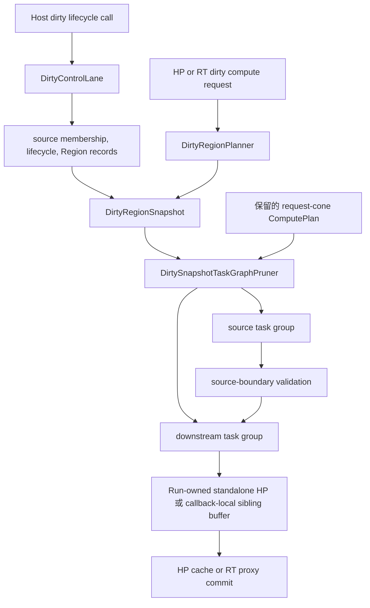

# 脏区传播与工作选择

本文描述当前内核已经实现的 dirty-region 行为，并区分 graph-scoped dirty facts、request
planning、task selection、policy/ready-store selection、私有 route execution、output commit，
以及截至 issue #81 已实现的 cooperative Run-cancellation、latest-wins commit observation 与
统一逻辑 Region 行为。
拟议的 Macro retile 与自适应
coarsening 属于内核演进
路线图，而不是本文的当前行为契约。Dirty geometry
路径与私有 clone/resize/channel/ROI processing contract 都由内核拥有；configured build 会选择
OpenCV adapter 或标准库实现，因此 compute/runtime 代码不会直接声明 OpenCV。

## 术语与所有权

**Dirty source** 是一个 graph node，表示某个 snapshot 中 dirty work 的来源。Lifecycle event 可以
显式指定它；request planner 也可以把选中 dependency cone 的 upstream root 推导为 dirty source。

**Dirty Region** 是由 `RegionSet` 表示的规范化逻辑 affected/demanded work。V-4 的 HP 支持
精确 ImageRect 与 rank-general TensorSlice；RT 只接受精确 ImageRect。当前 Host/IPC v2
inspection、operation ABI v1 adapter、dense Value processing 与 physical image tile 使用 checked
derived `PixelRect`/`PixelSize`。这些 physical rectangle 在各自 HP 或 RT storage
allocation 中都是零基坐标，不继承有符号逻辑原点。只有 provider 或算法在真实 matrix 或 algorithm call 处才会
局部创建 OpenCV rectangle 与 size。

**Dirty generation** 是存储在 `DirtyRegionSnapshot` 中并复制到 selected task metadata 的值，用于
标识 dirty inspection 与 source commit state。它不是 graph revision、`ComputeRun` 或 private-route
batch epoch。

**Dirty domain** 分为 `HighPrecision`（HP full-resolution coordinate）与 `RealTime`（execution
record 使用的 RT proxy coordinate）。HP 与 RT 是不同 compute domain；dirty planning 不会在二者
之间创建 task dependency。

当前所有权划分如下：

| 所有者 | 当前职责 | 不拥有 |
| --- | --- | --- |
| `DirtyControlLane` | 在串行 graph-state path 上应用显式 begin/update/end source event，并派生 wake/cutoff hint | Compute task、ready-store entry 或 execution route |
| `DirtyRegionPlanner` | 构造 HP/RT request snapshot，并更新 lifecycle snapshot | Worker execution 或 result commit |
| `DirtyRegionSnapshotBuilder` | 规范化 source Region，物化 derived image Micro tile 或 monolithic record | Graph traversal 或 compute request |
| `RoiPropagationService` | 计算 typed Region forward inspection 与 backward demand projection，并把精确 ImageRect 适配到当前 callback | Graph topology ownership |
| `DirtySnapshotTaskGraphPruner` | 从现有 request plan 中选择并裁剪 active task | 新 task shape |
| dirty executor 与 write buffer | 按 source-first 顺序执行，在现有 phase/node/tile/provider 边界观察匹配 Run lease，并暂存 HP/RT output；standalone 非 realtime HP staging 由其 `ComputeRun` 拥有，配对 realtime sibling buffer 仍保持 callback-local | Cancellation authority、Run grouping 或 graph revision policy |

## 当前流程

```mermaid
flowchart TD
  EVENT["Host dirty lifecycle call"] --> LANE["DirtyControlLane"]
  LANE --> FACTS["source membership, lifecycle, Region records"]
  FACTS --> SNAPSHOT["DirtyRegionSnapshot"]

  REQUEST["HP or RT dirty compute request"] --> PLAN["DirtyRegionPlanner"]
  PLAN --> SNAPSHOT
  SNAPSHOT --> SELECT["DirtySnapshotTaskGraphPruner"]
  STATIC["保留的 request-cone ComputePlan"] --> SELECT
  SELECT --> SOURCE["source task group"]
  SELECT --> DOWNSTREAM["downstream task group"]
  SOURCE --> VALIDATE["source-boundary validation"]
  VALIDATE --> DOWNSTREAM
  DOWNSTREAM --> STAGE["Run-owned standalone HP 或 callback-local sibling buffer"]
  STAGE --> COMMIT["HP cache or RT proxy commit"]
```

Dirty lifecycle call 只更新 graph state，不会自动启动 compute request。Parallel execution 始终从
另行构造的 request-cone `ComputePlan` 开始；dirty preparation 会保留其 callback-free shape，
直到 dirty/external-boundary selection。

## `DirtyRegionSnapshot`

Graph 会保存 latest snapshot、debug summary，以及至多 16 个 recent snapshot。Snapshot 保存的是
value record，不是 graph 或 task pointer：

- `graph_generation`；
- `dirty_source_nodes`；
- 每个 source 的 lifecycle state、累计 authoritative Region record 与 derived image ROI record；
- `dirty_updating_count`；
- `dirty_tiles` 与 `dirty_monolithic_nodes`；
- `per_node_dirty_regions` 与 `actual_dirty_regions`，以及 image ROI projection；
- edge-level Region mapping，并在精确时附带 image ROI projection。

它有意排除 dependency counter、ready-store entry、policy snapshot/binding、task reference count、
resource grant、cancellation state 与 commit policy。Snapshot 是 inspection/execution input，不是 undo log
或 durable event history。

### Lifecycle 产生的 snapshot

`begin_dirty_source()` 与 `update_dirty_source()` 会验证 node 与非空有限 source Region，把 node
加入 source membership、追加 Region，并把 source state 设为 `Updating`。`end_dirty_source()` 只把该 source 改为
`Settled`，不会追加 ROI。Source membership 与此前 ROI record 会继续保留；end 后再次 begin 本身
不会打开新 generation。Graph runtime-state reset 才会清除这些状态。每次 event 后，系统会从全部
source state 重新计算 `dirty_updating_count`。

Planner 会复制 graph 的 latest snapshot。只有复制出的 snapshot generation 为零时才分配新
generation，随后根据当前 event 的 domain，从已保存 source record 重建 derived Region、tile、
monolithic 与 edge container。当前 lifecycle rebuild 是 source-local：它只规范化已记录的 source
node，不遍历 downstream graph edge。因此，它会清空 edge mapping list，且不会重新生成 mapping。

`DirtyControlLaneResult` 会报告 snapshot、lifecycle event、generation、updating-source count、
`should_wake_dispatcher` 与 `cutoff_after_downstream`。这些是 control hint，不是 public subscription，
也不会自动触发 compute。

### Request planning 产生的 snapshot

`plan_high_precision()` 与 `plan_real_time()` 针对一个 target 和 dirty Region 构造新的 request
snapshot。Planner 会验证 target 与 Region，取得从 target 出发的 topological postorder，解析 HP
authoritative extent，并反向遍历选中 graph 以推导 upstream demand。结果 plan 的 upstream root
会成为 settled dirty source。

对于 TensorSlice，该遍历只会在 exact validity 能证明 complete coverage 的 upstream
formal output 处停止。缺失或部分有效的 intermediate exact-core dense node 会在 consumer
前继续保留在 plan 中，并接收同一 logical demand。uncached leaf source 是分类明确的
missing dependency。Planner 会记录 direct TensorSlice source Region，而不会从空
PixelRect compatibility projection 推断 source provenance。
对于 ImageRect HP、当前所有 ImageRect RT 路径与 TensorSlice HP，每个 executable target 或
upstream node 都会立即把其精确选中的 revision 缩减成 callback-free operation key 与完整
identity/device/shape/metadata record。同一个 revision 既提供 ImageRect dirty/dependency 行为，
也在 TensorSlice 情况下通过 exact-core 检查。Request plan 只保留这些带 revision 的 record，
不保留 callable 或 DSO lease。Dirty preparation 随后会重新解析该精确 revision，并把其 tiled
output inference 与 execution、propagation callback 一起复制；它永远不会借用 sibling
operation-level policy。在
dirty/external-satisfaction selection 识别 active task node 后，若 active view 为空，dirty
preparation 会在比较 intent、device inventory、task id 或 node route 前把它视为成功 no-work。
否则，空 route snapshot 或缺失 active-node route 本身就是 fail-closed mismatch；preparation 会在
应用 ROI 或 materialize work 前，把每条 active task-population route 与保留的 record 比较。因此
剩余 active work 的 target 或 upstream replacement 会在取得
provider/gate/grant/reservation/ledger ownership 前以 `NoOperation` 失败；普通 execution
随后仍会重新解析 callable。

Formal HP cache eligibility 由 production node/cache pruner 记录，而不是由测试自行修改 execution
order。普通 full HP planning 可以立即消费 `ComputeCachePolicy` 给出的 exact complete 结果。Dirty
preparation 会保留完整的 callback-free request cone，但 dirty selector 会把每个
snapshot-selected node 排除在 formal-cache satisfaction 之外。Exact 旧 output 是用来保留未选
坐标的 staging merge base，不是当前 dirty Region 已经是最新的证据。因此，exact、removed 与
partial 三种 target-cache 状态都会保留选中的 provider cone。Force-recache 会禁用 cache reuse，
RT intent 绝不会把 formal HP cache 当成 task satisfaction。

Planner 记录 `BackwardDemand` edge mapping。Forward affected-region projection 是独立的
`RoiPropagationService` inspection behavior，不是当前 dirty execution plan 的物化遍历方式。

## Region 传播

对于精确内建 ImageRect，`RoiPropagationService` 会经过 checked private adapter 转换，向选中的
provider-neutral propagation callback 请求 projection，验证返回 rectangle，再把它包装成 Exact
Region。这个 callback 可以来自 dependency-neutral core、optional provider 或当前 pure-C
operation ABI v1 adapter。Static formula 继续覆盖 identity、neighborhood、crop、resize 与其他
image geometry；data-dependent operation 可以提供经过验证的 dependency LUT。同一 parent 的
image demand 保留当前有界矩形行为。

TensorSlice 绝不进入 rectangular callback。Request-bound `RoiPropagationService` 会使用与
execution 相同的规范 route device inventory 和 HP/RT intent 选出实际的 revisioned
implementation；只有该选中 callback 是精确 source-private core dense identity
implementation 时才接受 TensorSlice。它不会为了 core identity 过滤 candidate，也不会查询
scalar-only fallback。因此，route 选中的 same-key device 或 plugin replacement 会返回
Unsupported，而不会继承自己未声明的 contract。缺失 transform 与不可表示 operation 保持为
typed Unknown、Unsupported 或 TooComplex，而不是伪造 Region。

Connected parameter producer 可能改变 geometry。若 request 尚未先稳定这些 value，planner 会把
受影响 consumer、connected parameter producer 与相关 image parent 保守扩展到 full extent。Dirty
execution 也可以构造 request-local stabilized planning graph，使 extent、halo、propagation 与
task-shape decision 观察同一份 parameter snapshot。

如果某 operation 有 monolithic HP callback、但没有 tiled HP callback，它会被视为 monolithic
boundary。其局部 image dirty ROI 会提升为 whole output，并记录为一个 `DirtyMonolithicRegion`。该判断基于
registry，即使请求 RT domain 也复用同一判断。离开该局部 node 后，传播仍可能得到更窄 ROI。

## 坐标与网格规则

当前常量只是 implementation parameter，不是 public ABI：

| 规则 | 值 | 坐标空间 |
| --- | --- | --- |
| RT downscale factor | 4 | HP-to-proxy projection |
| HP dirty Micro tile | 64 x 64 | HP full-resolution space |
| RT dirty Micro tile | 16 x 16 | RT proxy space |
| preferred HP Macro task size | 256 x 256 | task-shape planning，不用于 dirty snapshot materialization |

对于 ImageRect，HP request planning 会把 propagated ROI 向 64 对齐并裁剪。RT request planning 保留向 64 对齐的
HP-space propagation ROI，随后用保守 rounding 把 extent 与 work ROI 除以 4，再向 16 对齐并在
proxy space 中裁剪。

因此，coordinate interpretation 取决于 snapshot 生产方式：

- request-planned RT snapshot 的 `per_node_dirty_rois` 与 edge mapping 是 HP-space planning
  record，而 RT tile 与 monolithic work record 位于 proxy space；
- lifecycle-produced RT snapshot 会先在 HP space 裁剪 source ROI，再把
  `per_node_dirty_rois`、`actual_dirty_rois` 与 work record 规范化到 RT proxy space。

当前物化的所有 `DirtyTileKey` 都使用 `DirtyTileLevel::Micro`。Value model 中虽然存在
`DirtyTileLevel::Macro`，snapshot builder 并不会生成它。Builder 会对已经裁剪的 ROI 再做 outward
alignment，且不会再次裁剪生成的 key，因此边界处的 `DirtyTileKey::pixel_roi` 可能延伸到 output
extent 之外；已经展开的 execution task 则保留其自身裁剪后的边界 shape。

TensorSlice planning 只支持 HP。它把每个 axis 裁剪到具体 sealed DenseTensor shape，在 source、
node、monolithic 与 edge record 中保留 exact Region，并创建没有 PixelRect 或 tile
coordinate、按 dependency-first 排列的 monolithic work。complete upstream cache 是 read
boundary；缺失或 partial intermediate output 会在 downstream execution 前进入 plan 并完成
staging。

## Task 选择与执行

Dirty execution 会先取得所请求 domain 的 immutable retained request-cone plan。
`DirtySnapshotTaskGraphPruner::select()` 会把 snapshot 作为 overlay 应用到已经展开的 task，让
dirty candidate 保持 executable、裁剪 image execution ROI、保留 task id、推导 task-level
dependency，并分离 source-boundary 与 downstream task id。它不会展开 node、创建新 tile shape
或插入 retile task。Nonempty nonprojectable Region record 会选择既有 non-tile work 并抑制 extent-derived
rectangle；没有精确 image projection 时，绝不会选择 physical tile。

Current-request external satisfaction 是 demand cut，而不是孤立的 task filter。
Selection 会在完整保留的 dependency universe（包括 inactive connector 与 satisfied node）中，
从每个 unsatisfied sink 逆向遍历。它会在 satisfied node 处停止；如果另一个 unsatisfied sink
仍需要 shared upstream node，该 node 会继续保留；最终只发出 dirty candidate task。Dirty
candidate 自身绝不会被旧 cache 满足。这样可以避免 inactive satisfied connector 把其 exclusive
upstream producer 错误变成 sink。若显式 external satisfaction 使结果没有 active task，外层产品
request 仍会完成 candidate admission、逻辑 Run/RunGroup 安装、successful terminal arbitration、
quiescence、resource settlement 与 unregistration；它不会创建 ready entry、callback、operation
gate、policy invocation、physical reservation/grant、provider entry 或 ledger demand。

在选中的 tiled `image_mixing` node 分派其借用的 `InputTile`/`OutputTile` view 之前，
`NodeExecutor` 会为该次 node invocation 一次性规范化所需 secondary input。Crop/pad 使用
stride-aware 内核 fill/copy 原语，因此 active pixel 会通过各 descriptor 的 `step` 复制，padding
byte 则被排除。临时 normalized `NodeOutput` owner 保持 request-local，并存活到同步 tile callback
全部结束。该 normalization 不会改变 selected task id 或 dirty ROI geometry。

同一条 metadata-only 证明还会按 raw policy 投影 Sample Domain authority：扩展型 crop/pad
贡献零，三到四通道转换贡献当前维护的 opaque raw value。排除任一常量的声明会被整体省略；包含
全部常量的声明则保留到后续 operation-specific 证明。Resize、纯 crop、replication 与 reduction
在该规则下不增加固定常量。它从不读取 payload extrema，也不改变 raw normalization 算法。

在分配 per-node dirty Host binding 前，精确 selected output inference 会接收这些 operation input，
包括其投影后的 optional authority，并冻结 descriptor、channel count、有符号 geometry 与已授权
optional fact。现有 staged output
只有在精确 plan matching 后才可能成为 byte seed，绝不会作为 semantic operation input 被前置。
Inference 缺失时会省略可选 display/channel/sample/color 事实，而不是复制 first input。

每个 HP 或 RT dirty tiled invocation 都会在自己的同步 execution stack 上拥有这份 prepared
context。Context 在 plan freeze 前创建，覆盖 binding lookup/allocation 与全部 provider callback
的生命周期，并且 callback entry 不会再次执行 normalization。并发 selected task 可以分别根据
各自精确 prepared context 推导 plan；write buffer 只有在 frozen plan 与其唯一 per-node binding
匹配时才会接受它们。因此，staged seed byte 只能保留未触及坐标，不能影响 inference 或替换
`context.inputs()`。

Dispatcher 会提交 selected source group 并等待其 settle，验证所需 source output 已存在于相关
staged 或 committed store，随后提交 initially-ready downstream group。Dependency completion 会继续
释放其他 ready downstream work。

两个 initial group 属于不同的 `ExecutionService` phase admission，并获得独立的私有
route/runtime epoch，用于 attribution 与 batch lifetime。Dirty generation 虽然存在于 request/task
metadata 中，但 source-first dispatcher 不会把该 generation 作为 execution authority 传入。
Host 会在 reserved start 前重新验证 current candidate/Run state，并能清除精确 cancelled Run 的
queued work；任何机制都不能抢占已经进入 provider 的 callback。

Source node execution 还会比较当前 dirty generation 与该 source 已提交的 generation。若 work 比
committed source generation 更旧，则跳过并记录 trace；相同 generation 仍可能再次执行，downstream
node 也不会进行该比较。这只是狭窄的 source-boundary stale guard，不是通用 revision validation、
supersession、deadline handling 或 cooperative cancellation。Supersession 是独立的
request-key 与 commit-generation 契约；它不会复用 dirty generation。

Issue #73 增加了一条独立的 Run-owned cooperative 边界。Dirty preflight、source 与 downstream
phase、node/tile/provider 进入与返回、dependency release，以及最终 commit 都会观察匹配 child
lease。显式 request 与过期 monotonic deadline 使用同一个 terminal arbiter。已经进入的 operation
可以完成，但 cancellation 会关闭后续 publication，并丢弃 request-owned staging。这些检查不会把
dirty generation 或 route/runtime epoch 变成 cancellation authority。

## 暂存与提交

HP dirty task 把 output 与 Region validity 暂存到 `HighPrecisionDirtyWriteBuffer`；RT dirty task
把 image output 与 HP-space ImageRect validity 暂存到 `RealtimeProxyWriteBuffer`。每个 write
buffer 对每个节点最多拥有一个尚未发布的 `HostOutputBinding`。它冻结 selected task 中 immutable
HP/RT geometry 实际可执行的 task 数量，从该单一 binding 签发 disjoint grant，并让最后一个
executable task 恰好一次完成 seal。被裁剪为空 RT geometry 的 selected task 不会增加
retirement count。成功 request 会通过 intent-specific commit path，把 staged HP state 提交到
`GraphModel`，或把 RT state 提交到 `RealtimeProxyGraph`。Standalone 非 realtime HP request
拥有一个 `ComputeRun`。每个 `RealTimeUpdate` 会在 preflight 前创建不同的 HP 与 RT child Run，
并将它们放入一个 request-owned `RunGroup`；两者捕获相同的强 Graph instance identity、
authoritative revision 与 request supersession generation，同时保留各自独立的 domain、lease、
phase、terminal 与 staging state。当前不会创建 mixed-domain Run。

Exact core Region bridge 会返回 complete-shaped dense result，但对于 partial invocation，
只有 selected coordinate 是 authoritative。`HighPrecisionDirtyWriteBuffer` 会通过一个 checked
whole grant seed 其 binding，随后 update grant 只替换 selected coordinate，最后只 seal 一次；
unselected coordinate 保持不变。若 prior output 为 complete，即使 full ImageRect proof 与
TensorSlice update 使用不同 Region domain，其 complete validity 仍保持为 true。fresh
partial output 只有 partial validity，因此 whole-output dependency resolution 与当前
regionless disk persistence 会拒绝它，直到 normal Whole commit 将其替换。Generic operation ABI v1
monolithic callback 保持 complete-output replacement behavior。

Task pruner 会把 active selected-task flag 之外的 dependency 视为已经满足。对于非空 mapping，
active spatial consumer 会保留精确覆盖 ROI 的 producer task id；空的 exact mapping 只把
selected producer task set 保留为 publication join，因为 execution 仍会解析完整 `NodeOutput`。
每个非最终 tile 都会 retirement，但不释放这些 edge；最终 selected producer seal 并安装完整
Value 后，其唯一 publisher 才会通过每个原始 selected sibling task map 批量释放。这样，tile
无法消费 sibling 正在部分写入的 binding，同时非空 task identity 保持精确，也不会制造
continuation task。Whole 与 parameter dependency 继续使用完整的 producer-node join。
overlap、out-of-range geometry、exception、cancellation、
duplicate 或 missing retirement，或者使用未排空 binding 执行 commit，都会形成 sticky failure，
不释放尚未发布的 tile edge，并保持此前的 formal/proxy Value 不变。

Kernel 的 product commit policy 会先物化 publication copy，随后在 graph-state work item 内检查：
每个 child Run 已处于 `CommitPending`、拥有精确 staged Graph/proxy，并且仍匹配 live Graph
identity、revision 与 current supersession key/generation。Stale child 不发布任何
Graph/proxy/cache output，并通过现有 `ComputeError` path 失败。这些精确 predicate 会拒绝旧 work，
但不会停止已经运行的 callback。

对于 `RealTimeUpdate`，RT 与 HP 是 sibling computation。RT sibling 可以先提交 proxy state；HP
sibling 则在发布 authoritative HP state 前观察 sibling commit gate。该协调不会创建 HP-to-RT task
edge，也不会让 RT output 成为 authoritative HP cache。它也不是跨 domain atomic transaction：RT
提交成功后若 HP 失败，proxy commit 不会回滚。

在私有 route sibling phase 启动前，`ComputeService` 会创建一个 request-owned 的 per-node
synchronization object，并由两个 domain 共享。只有同一节点的 live `Node` snapshot/`ParameterMap`
resolution 与短暂 staging 临界区会被串行化；不同节点与 operation execution 仍可并发。该 owner
会存活到 sibling failure cleanup 与私有 route callback drainage 完成，随后随本次 request 销毁；它不会被
`GraphModel`、`GraphRuntime` 或 process-wide state 保留。

## 边界与原理

当前实现不提供：

- `ReTileTask` insertion 或 Micro-to-Macro/Macro-to-Micro dirty conversion；
- Macro dirty-key materialization 或动态 Micro/Macro coarsening；
- multiple-clause sparse Region set、dirty-area cap、time-window merge 或 adaptive batching；
- 自动启动 compute 的 node-to-backend dirty subscription；
- public 或 lifecycle-driven cancellation，或对已经进入的 provider callback 进行 preemption。
  Dirty work 已使用当前 policy 与 reserved-start admission path。

当前逻辑 dirty authority 在 propagation、planning、source history、per-node state、edge
mapping、HP validity、staging 与 Region-aware core dense operation 中使用规范化 `RegionSet`。
Checked derived `PixelRect` 与 `PixelSize` 只保留在 image tile/task、dense Value processing、Host/IPC v2
与 operation ABI v1 adapter 边缘。Region endpoint 与 tensor-shape arithmetic 都受检查；image adapter
拒绝 uncertainty、TensorSlice、custom domain、multi-atom clause 与 narrowing overflow。只有
provider 或 adapter 实现在真实调用处才会创建 OpenCV rectangle 与 size。

对于普通 dense image，`ImageRect` 使用 immutable `ImageFacet::data_window` 的 signed logical
coordinate domain。full-image region 就是该 half-open window 本身，包括 non-zero 或 negative
origin。只有在完成 containment 检查之后，才可通过减去 data-window origin 得到 dense storage
index。可选 display window 不会重定义 dirty coordinate，dynamic `RegionSet` 也不会修改任一
window。provider-defined OpenEXR Deep window 仍是独立 provider contract，不是 ordinary dense
image 的 authority。

因此，每个 image `HpPlanEntry`/`RtPlanEntry` 都会保留 HP data window、零基 `roi_hp` 与逻辑
`region_hp`；`roi_rt` 则独立地在 RT proxy allocation 中使用零基坐标。Edge/snapshot Region
metadata 只能从相应 storage ROI 经 checked origin addition 构造。HP dirty write 会把 logical
ImageRect validity 交给 downsample；downsample 为像素访问减去当前已提交 HP origin，并把逻辑
Region 原样保存为 RT HP-validity metadata。Empty、Whole、stale-generation、failure 与
cancellation handling 都不会授权一个坐标域不匹配的结果。

把 dirty fact、static task shape、ready dispatch 与 staged commit 保持为不同 value，可以防止 ROI
update 重写 topology，或把 graph ownership 转交 policy snapshot、ready store 或私有 execution
route。上述明确限制界定了当前 generation 与 epoch check 能够保证的范围。

## 实现与验证入口

- `src/lib/compute/compute_geometry.hpp`
- `include/photospider/data/region.hpp`
- `src/lib/core/region.*`
- `src/lib/core/region_image_adapter.*`
- `src/lib/core/{dense_image_processing,value_region}.*`
- `src/lib/adapters/opencv/value_adapter_opencv.*`
- `src/lib/compute/dirty/dirty_region_snapshot.hpp`
- `tests/unit/test_dense_image_processing.cpp`
- `src/lib/compute/dirty/dirty_region_snapshot_builder.cpp`
- `src/lib/compute/dirty/dirty_region_planner.cpp`
- `src/lib/compute/dirty/dirty_region_planning_policy.hpp`
- `src/lib/compute/dirty/dirty_control_lane.cpp`
- `src/lib/compute/dispatch/task_graph_planning.cpp`
- `src/lib/compute/dirty/dirty_execution_common.cpp`
- `src/lib/compute/compute_run.*`
- `src/lib/compute/dirty/dirty_update_executor.cpp`
- `src/lib/compute/dirty/tiled_input_normalizer.cpp`
- `src/lib/compute/dirty/node_executor.cpp`
- `src/lib/graph/roi_propagation_service.cpp`
- `tests/integration/test_resource_admission.cpp`
- `tests/unit/test_policy_registry.cpp`
- `tests/integration/test_compute_service_split.cpp`
- `tests/integration/opencv_route_normalization_cases.hpp`
- `tests/integration/test_host_adapter.cpp`
- `tests/integration/test_stride_aware_compute_paths.cpp`
- `tests/unit/test_compute_run.cpp`
- `tests/unit/test_propagation_contracts.cpp`
- `tests/unit/test_region_contracts.cpp`
- `tests/integration/test_cpu_dense_tensor_image_operation.cpp`
