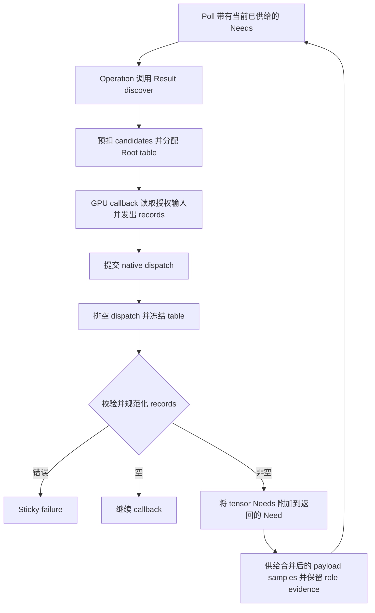

# 有界 GPU 请求发现

## Result tensor discovery

### 范围与所有权

Result GPU discovery 让 operation 在 native GPU callback 中检查已经供给的 tensor samples，并报告一组有界的附加 tensor regions。Executor 拥有 table 分配、native work 排空、记录校验和 typed Need 附加。Discovery 不会追踪任意 shader 读取。C Result ABI 2 service 和 C++ `ResultProgramPhase::discover` 入口都使用这条 Result 路径。`Value` 可以提供私有 backing storage，但不再公开独立的 dependency discovery phase。

C Result operation 在普通 `poll` callback 中调用 `ps_result_services_v2::discover`。Discovery callback 只能使用当前 Need 的 read、native atlas、scratch、work、cancellation 和 GPU dispatch services；它返回普通 status，并且必须提交实际 native work。若 receipt 非空，外层 operation callback 必须返回 `PS_RESULT_NEED_V2`。Executor 会在这些 Need 尚未供给时拒绝 publication。空 receipt 不增加 Need，callback 可以继续执行。

```c
uint64_t receipt = 0;
if (services->discover(services->context, capacity, candidates,
                       compute_requests, user, &receipt))
  return 1;
return PS_RESULT_NEED_V2;
```

若之后的 poll 需要读取规范化记录，callback 应将 receipt handle 保存在 operation state 中。读取完 records 后释放 handle。`discovery_requests` 支持 count-only 查询：`output == NULL` 且 `capacity == 0`；随后可将 records 复制到已初始化的目标结构中。C handle 在跨 poll 期间归该 plugin instance 所有，直到显式释放或 operation 销毁。C++ `ResultProgramPhase::discover` 返回 `shared_ptr<const ResultDiscoveryReceipt>`，其中也是 typed footprint metadata，不含 source payload。

### Wire 格式与内存

Result v2 table 保留 16-byte header 和每条 144-byte record。Header 包含四个小端 `uint32_t`：尝试写入的 record 数、overflow 标志和两个必须为零的保留字。每条 record 包含四个 `uint32_t`，随后是八个 `uint64_t offsets` 与八个 `uint64_t extents`：

| 偏移 | 内容 |
| --- | --- |
| 0..3 | Input port index |
| 4..7 | Data、Control 和 Validation role mask |
| 8..11 | 完整 sample rank |
| 12..15 | Tensor slot index |
| 16..79 | `uint64_t offsets[8]` |
| 80..143 | `uint64_t extents[8]` |

Rank 与 coordinates 使用 tensor 的完整 sample shape，即 batch axes 在前、cell axes 在后。每条原始 rectangle 都必须在选定 slot 的范围内，并满足完整 tuple/channel closure。Roles 是 Data、Control、Validation 的非空组合。Decoder 以 input port、tensor slot 与 role mask 分组，再在共享 work/metadata 限额内规范化这些 regions。

Result helper 名为 `PS_RESULT_GPU_DISCOVERY_MSL_V2`，其 Metal 函数签名为：

```metal
bool ps_result_discovery_emit(device atomic_uint* table, uint capacity,
                              uint input, uint slot, uint roles, uint rank,
                              thread const ulong* offsets,
                              thread const ulong* extents);
```

它按 input、roles、rank、tensor slot 的顺序写入 record。旧 `PS_GPU_DISCOVERY_MSL_V11` 仍可用，它在第四个 record 字段写入零，而不是 tensor slot。两个 helper 共用 header 和 record 大小，但只有 Result v2 record 会选择 tensor member。

容量为 `K` 时，逻辑 table 大小为：

$$
S = 16 + 144K.
$$

Executor 在分配零初始化 Root table 前预扣 `candidates + 2S` work。Table 使用独立的 Root native storage，不占 operation workspace。设备取整后的 table capacity 另行准入。同步 callback 及其已提交 GPU work 排空后，host 才冻结并解码 table。Table 指针和 service pointer 不会越过 discovery callback 生命周期。

### 执行与 Need 状态



Discovery callback 是同步 GPU 路径。它可以读取当前 Need 覆盖的 samples、为该 Need 获取 atlas、分配或释放 scratch、计入 work、检查取消并提交 GPU commands。成功 discovery 必须至少执行一次真实 native dispatch。设备不可用、table overflow、记录格式错误、slot 无效、rectangle 越界、tuple closure 缺失或资源限额耗尽都会返回类型化错误；解码器不会把授权扩大成 bounding box。

Executor 将发现的 Needs 附加到 operation poll callback 返回的 `ResultProgramNeed`。Operation 也可以在同一 Need 中额外请求输入。Stage 的总条目数不得超过 65,536 与 dependency set `maximum_boxes` 中较小者。相同 input、相同 slot 的多 role tensor Needs 会合并 payload-readable regions，只供给一次；每个 role 原始 coverage 仍单独校验并记为 dependency evidence。这样可避免重复读取 slot，同时保留 role-specific history。

C receipt 返回规范化的 `ps_result_discovery_request_v2` records，其中含 input、slot、role mask 和 sample-space region。未知数量时先执行 count-only 查询，再设置每个目标 record 的 `struct_size` 并提供足够容量。Receipt metadata 不可变，也不含 tensor bytes。每个 `candidates` 值只限制对应的一张 table；一个 active poll 内多次 discovery 共享 work 与 metadata 计量。Actor 的 discovery-work 额度跨 poll 保留；每次调用也会消耗 Run 与 Root work。重复 raw records 仍然消耗 emit 与 normalization work。

### 限额与失败处理

`capacity` 必须为正，且不得超过 65,536、`DependencyLimits::maximum_gpu_requests` 或适用的 `maximum_boxes`。`maximum_gpu_requests=0` 会禁用 discovery。`candidates` 必须为正，它限定并计费全部 emit attempts，包括重复项及超过 table 容量的尝试。Shader dispatch 的 emitter 数量不得超过此上限。仅当 emit 时没有可用 slot 才设置 overflow；正好写满最后一个 slot 合法。Host 拒绝 overflow，也会检查尝试数是否超过 `candidates`。

Table bytes、取整后的 native capacity、candidate work、decode work 与 request metadata 分别计入相应 Root/dependency 限额。Read 和 atlas 仍受当前 Need 限制。Discovery callback 不能发起新 Need、发布 output、进入 block callback 或递归调用 discovery。未执行 native work 的 callback 会以 `OperationFailed` 失败。已提交 dispatch 排空后才释放 table owners。

### G4 Result discovery workflow

`examples/g4_gpu_workflow/discovery_plugin.c` 注册 Result ABI 2 C operation。输入为 8,192 个样本的 rank-one Float32 data Result 与 Int64 control Result。GPU callback 通过 atlas 读取已供给的 Control sample，发出需要的数据 rectangles 并执行 Result discovery shader。Host 把这些 rectangles 附加为 tensor Needs；下一次 poll 读取新供给的数据并发布 output tensor。

当前 workflow 在 CPU 和 Metal 上都返回 `8,24`；Metal 路径执行四次 dispatch。实际 GPU workflow 使用 rank-one tensor 和 slot 0。修改 Control 后，第一个结果变成 24，其 Data support 更新为 `{1,4097}`。Frozen execution 仍返回 8。Workflow 检查非法 Control 值、table overflow、过早 publication，以及通过 `maximum_gpu_requests=0` 禁用 discovery。

`test_result_gpu_discovery` 独立检查 decoder 的 rank-8 坐标、tensor slot 1、batch/channel closure 与不同 role groups。这些是 decoder 用例，不是 native workflow 所用的 shape 或 slot。

Discovery 必须从当前 callback 的 entry thread 调用。C++ API 的 `ResultProgramPhase::consume_work` 可以由 worker threads 并发计费；C discovery services 仍只允许在 entry thread 调用。从 worker 调用 `discover` 会在 compute callback 执行前失败。线程用例由两个 worker 通过 `consume_work` 各计入 4,096 units：8,512 限额会拒绝，8,513 会准入并执行一次 native dispatch。Workflow 还检查跨 poll 的 discovery-work 和 Run-work：8,192-unit 限额可以完成单样本请求；双样本请求会在后续 poll 中耗尽累计预算，不会重新获得完整预算。

C workflow 将 receipt handle 保存在 operation state 中，直到恢复后的 poll 复制规范化请求并释放 handle。Request-table pointer 仅在同步 discovery callback 期间借用。GPU token 遵循外层 poll 的生命周期，但 discovery 返回时 host 会冻结 table；之后通过该 token 写入会失败。失败用例检查 discovery table/atlas owners 退休后，Root Payload 恢复到仅保留 source 的水平，不进入 result cache，并允许重新执行一次 native retry。

可用以下命令构建并运行 native workflow 与 standalone decoder 测试：

```sh
cmake --build build --target test_gpu_discovery_workflow test_result_gpu_discovery -j 8
ctest --test-dir build -R '^(test_gpu_discovery_workflow|test_result_gpu_discovery)$' --output-on-failure
```

安装 consumer 测试名为 `installed_gpu_discovery_workflow`，位于已配置的 `build/consumer-build`。它使用安装后的 kernel package，并运行相同的 rank-one、slot-zero native workflow。

容量为 128 的准入案例使用 132,400 字节 Root live-payload 边界：输入绑定占 98,304 字节，continuation state 占 1,160 字节，取整后的 table storage 占 32,768 字节，Control atlas 占 168 字节。Fixture 在 132,399 字节时拒绝，在 132,400 字节时准入。此准入失败后 table owners 退休；在准入容量下的新 native query 随后成功。该边界仅适用于此 fixture。

## MSL discovery emitter 与 wire 兼容性

`PS_RESULT_GPU_DISCOVERY_MSL_V2` 是 Result emitter，会把 input、tensor slot、roles 和 rank 写入每条 record 的前四个字段。`PS_GPU_DISCOVERY_MSL_V11` 仍作为 slot-zero record 的 wire 兼容 emitter 保留：第四个字段始终写零。v11 macro 定义 record 布局；执行和 Need 附加仍通过上文的 Result API 进行。

两个 emitter 都使用上文的 16-byte header 和每条 144-byte record。Result decoder 把第四个字段解释为 tensor slot，并依据选定的 Result schema 校验 input、slot、rank、roles、extents、未用轴、sample-domain 边界和 tuple/channel closure。因此，v11 emitter 生成的 record 指向 slot 0；需要其他 tensor slot 的 operation 应使用 Result v2 emitter。Table capacity、candidate 限额、overflow 处理、native work 排空、资源计量和 receipt 所有权均遵循上文 Result discovery 契约。

Native GPU service 独立使用 `PS_GPU_ABI_VERSION_1` 版本，提供 discovery 使用的同步 buffer 与 dispatch 操作。Result discovery 本身属于 Operation Plugin ABI 2。Vulkan 构建支持为可选项。Native GPU 行为要求构建启用了对应 backend 且设备可用；协议 mock 只能覆盖校验和错误路径，不能证明 native 执行。
