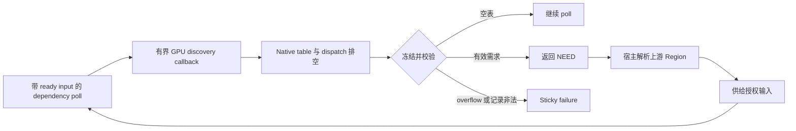

# 有界 GPU 依赖发现

## 模块边界与职责 (Scope & Ownership)

GPU discovery 允许注册的 dependency program 在已供给输入上使用所选 GPU，返回一组有界的附加输入 Region。宿主负责表分配、native dispatch 生命周期、解码、校验和把需求附加到当前 poll。Discovery 必须显式调用，不会跟踪任意 shader 读取。

```c
#include "photospider/plugin/dependency_plugin_api.h"

int request_discovery(ps_dependency_services_v11* services,
                      uint32_t capacity, uint32_t candidates,
                      ps_dependency_discovery_compute_v11 compute,
                      void* user) {
  return services->discover(services->context, capacity, candidates, compute,
                            user);
}
```

这些 callback/service 类型定义于 `dependency_plugin_api.h` 的 dependency service ABI v11。表布局定义于 `gpu_discovery_msl.h` 的 `PS_GPU_DISCOVERY_MSL_V11`。Callback 可使用 ready-input read、计费 scratch、取消以及同步 GPU buffer/dispatch 服务。Callback 返回成功或错误，不返回 `NEED`。每个 service failure 都是 sticky，即使 callback 忽略返回值也会保留。

## 核心数据结构与内存布局 (Data Layout & Memory)

宿主通过当前 execution resource budget 分配并清零有界 native table。表以四个小端 `uint32_t` 开始：emit 尝试数、overflow 标记和两个保留零字段。随后为每条 record 预留 144 bytes：

| 偏移 | 内容 |
| --- | --- |
| 0, 4, 8, 12 | `uint32_t` port、role mask、rank、保留零值 |
| 16..79 | `uint64_t offsets[8]` |
| 80..143 | `uint64_t extents[8]` |

Callback 借用 table 至返回。宿主先排空已提交 native work，再冻结 table；冻结后不能通过旧 native view 写入。宿主验证每条记录的 port、rank、Data/Control/Validation role、正 extent、未用轴零值和 descriptor 边界。图像输入的每条原始记录必须包含全部 channel 后才能规范化；多个部分 channel 记录不能拼接绕过通道闭包。

`capacity` 必须在 1..65536。`candidates` 限制所有 emit 尝试数，包括重复和超过容量的尝试，并在 callback 开始前计费。只有 emit 尝试没有可用 record slot 时才设置 overflow；刚好填满最后一个 slot 不算 overflow。超出容量的尝试不会写 record。Overflow 返回 `ResourceExhausted`；格式错误记录使回调失败。Discovery table 字节、native 实际 capacity、解码工作、request metadata 和候选工作分别受对应限制。Table、atlas、scratch、state 和 output owner 在最后一个 owner 释放后才退费。

## 调度与状态机 (Execution & State)



非空 table 通过校验后，dependency program 必须返回 `NEED`。宿主保留每个请求与当前 Atomic observation 或完整 terminal `RequestRecord` 的关联，解析上游输入、供给后再次 poll。仍有未解决请求却返回数值完成属于协议错误。空表不会增加依赖，可用于常量或仅依赖 control 的完成路径。

`DependencyLimits::maximum_gpu_requests` 限制单张 discovery table；默认值和硬上限都是 65536，零值关闭 discovery。该设置进入 dependency Flight identity。各 poll 的 request metadata 和每个 Run 的 work budget 由多次 discovery 与规范化分组共享。宿主在去重前先计费原始行数与关联检索，因此重复结果不会抵消已执行工作。`Footprint::from_regions` 可在成功、失败或异常时报告已消耗工作；decoder 在进入下一组前扣除该计数。超过 discovery request、共享 work 或 metadata 限额时返回有界资源错误。

Discovery 不能递归执行，不能在 pure dependency block 内运行，也不能在 discovery callback 中调用 pure block。Callback 同步执行且属于受信任代码；取消是协作式的，已提交 dispatch 排空后才释放 native owner。Table 指针和 discovery service 表在 compute 返回时失效。其他 dependency service/context/input/scratch 指针在 poll 返回时失效。`retain_input` handle 保留精确授权及原 owner，直到调用 `release_owner` 或 dependency state 销毁，不会在 poll 结束时失效。

Discovery service 函数返回布尔 `1` 表示成功、`0` 表示失败。Discovery compute callback 返回普通 operation result code，不能返回 `NEED`。只有宿主校验非空 table 并把请求关联到当前 poll 后，外层 dependency callback 才返回 `NEED`。

## 算法与数学实现 (Algorithms & Math)

Wire table 使用 16-byte header 和每条 144-byte record。容量为 `K` 时，逻辑大小为：

$$
S = 16 + 144K.
$$

宿主在分配前检查乘法和加法溢出，再按查询到的 native backing capacity 准入；实际值可能大于 `S`。Candidate 上限独立于 table capacity，因为 overflow 和重复尝试同样计费。

## 限制与非目标 (Limitations & Non-Goals)

- Discovery 是显式、受信任的 callback 协议，不是 page fault handler、隐式 shader tracing 或任意 shader loop 沙箱。
- Discovery service 自身不提供 output publication、修改 association、checkpoint 或 pure-block service。
- Discovery callback 只能读取已供给输入。缺失样本必须在数值完成前转成声明需求。
- Native GPU discovery 要求构建启用 backend 且设备可用。Apple 平台默认启用 `PHOTOSPIDER_ENABLE_METAL`；可选 `PHOTOSPIDER_ENABLE_VULKAN` 默认关闭。
- 协议 mock 覆盖校验和错误路径，但不能证明 native GPU 行为。
