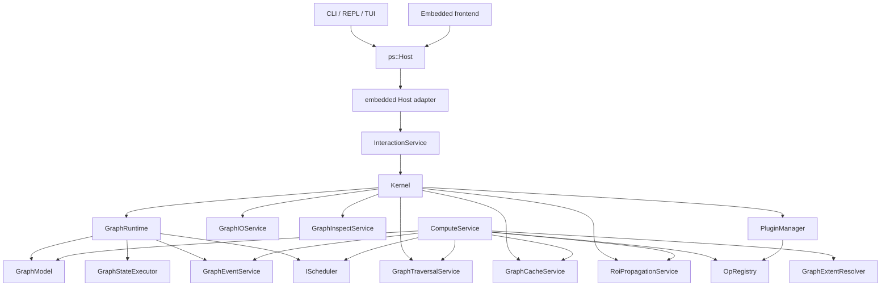

# 内核架构概览

本文档描述当前分支中的架构。较旧的阶段计划和里程碑报告已移动到 `docs/outdated/`。

此目录是内核维护中的开发者文档。应将其视为算子、调度器、插件和内核服务所使用公共契约的事实来源。OpenSpec change artifact 是规划材料，不假定一定随仓库提交。

## 当前状态

Photospider 围绕图运行时构建，包含服务拆分、操作 registry、缓存层、调度器抽象，以及面向前端的
Host seam。Parallel planned work 现在会通过 scheduler-owned task runtime dispatch。Graph-state
命令和会修改可见图状态的 compute request 会进入显式的每图 `GraphStateExecutor` 边界，而不是
scheduler dispatch 路径。Scheduler-backed parallel compute 会在该 graph-state 边界内使用
scheduler runtime 执行 ready task callback。

代码可用且可测试，但部分边界尚未最终稳定。尤其是 `Kernel` 和 `ComputeService` 仍协调大量行为，未来可能移动到更窄的服务中。

## 构建模块

根 `CMakeLists.txt` 构建以下内部模块：

| Target | 角色 |
| --- | --- |
| `photospider_core_types` | 核心数据类型、OpenCV 适配器、YAML 节点解析、内置 op registry 源。 |
| `photospider_operation_plugin_shim` | 面向动态 operation callback 代码的窄共享 helper 库，用于提供 `ImageBuffer`/OpenCV adapter 符号，不包含 registry 状态。 |
| `photospider_graph` | `GraphModel` 加图 IO、遍历、缓存和 inspect 服务。 |
| `photospider_plugin` | 动态操作插件管理器和加载器。 |
| `photospider_compute` | 仅用于构建的交互运行时、调度器、计算服务与事件 helper。 |
| `photospider` | 静态可安装后端产品，归档文件名为 `libphotospider`，由 CLI 和 embedded Host 前端链接。它只安装 `include/photospider/**`，并导出 `Photospider::photospider`；operation plugin 通过 `OperationPluginRegistrar` 和 `register_photospider_ops_v1` 注册，而不是为了 registry 状态链接该产品。 |
| `photospider_cli_common` | REPL 命令、TUI 编辑器、自动补全、CLI 配置。 |
| `graph_cli` | 终端用户可执行文件。 |

输出目录：

| 输出 | 路径 |
| --- | --- |
| executable | `build/bin` |
| libraries | `build/lib` |
| operation plugins | `build/plugins` |
| scheduler plugins | `build/schedulers` |
| tests | `build/tests` |

Package 边界：

- `cmake --install` 会安装静态 `photospider` 归档、`include/photospider/**` public header tree、
  `PhotospiderTargets.cmake` 和 `PhotospiderConfig.cmake`。Unix-like 工具链中的归档名为
  `libphotospider.a`，MSVC 中为 `photospider.lib`。
- `Photospider::photospider` 为 consumer 携带 `PHOTOSPIDER_STATIC`，并让 `src/` include root
  只对仓库内部构建私有。在 build tree 中，该 target 的 generated public include root 只包含
  `photospider/` forwarding header。CMake 会跟踪 header 的新增和删除，wrapper 直接读取实时
  source header，不需要目录 symlink。
- OpenCV（`core`、`imgproc`、`imgcodecs`、`videoio`）、`yaml-cpp`、`Threads`、平台
  dynamic-loader 库，以及 Apple `Metal`/`Foundation` framework 标志，是静态归档的实现链接依赖。
  Library dependency 会作为 `$<LINK_ONLY:...>` entry 出现在安装后的 target 上；Apple framework
  flag 来自 Apple-only 的 private product link block。Public Host/core 头避免暴露 OpenCV 和
  `yaml-cpp` 类型；Windows consumer 会收到 `PHOTOSPIDER_STATIC`，因此 declaration 不使用 DLL
  import/export 标注。
- FTXUI、`photospider_cli_common`、operation plugin shim、operation plugin 和 scheduler plugin
  都不会作为 embedded static package 的依赖导出。

## 运行时所有权

## 主要组件

| 组件 | 角色 |
| --- | --- |
| `Kernel` | 多图 facade、服务 owner、运行时 bootstrapper、顶层图/缓存/计算 API。 |
| `ps::Host` | `include/photospider/host` 下的 public frontend interface；返回复制的 request/result/snapshot value，并隐藏 Kernel、GraphModel 和 GraphRuntime。 |
| `embedded Host adapter` | 由 `Kernel` 和 `InteractionService` 支撑的 in-process Host 实现，供本地前端使用，同时保持 CLI 行为不变。 |
| `GraphRuntime` | 每图资源容器，包含模型、graph-state executor、事件、调度器和平台 context。 |
| `GraphModel` | 图状态持有者：私有节点存储、拓扑邻接索引、缓存根目录、计时数据、quiet/skip-save 标志。 |
| `InteractionService` | 由 embedded Host adapter 和 backend code 使用的内部 `Kernel` wrapper；包括 CLI 在内的 frontend 都使用 public Host seam。 |
| `ComputeService` | 解析依赖、检查缓存、执行 op，协调 RT/HP/tiled 路径和计时事件。 |
| `GraphTraversalService` | 只负责拓扑：基于 `GraphModel` 邻接索引提供遍历顺序、结束节点发现、祖先检查、上游依赖查询和下游依赖查询。 |
| `RoiPropagationService` | ROI/空间传播边界，负责单节点上游 ROI 计算以及图级 forward/backward ROI 投影。 |
| `GraphExtentResolver` | HP 权威的输出范围解析器，供 ROI 传播和脏区规划使用。 |
| `GraphCacheService` | 内存/磁盘缓存操作和缓存同步。 |
| `GraphInspectService` | 基于图拓扑构建结构化缓存/空间元数据 inspect 和 dependency-tree snapshot。 |
| `GraphEventService` | 每节点计算事件收集。 |
| `PluginManager` | 加载操作插件、传入 host-provided registrar、记录操作来源，并在卸载前持有动态库句柄。 |
| `OpRegistry` | 全局操作实现 registry，包括 HP/RT、tiled/monolithic、设备元数据和 ROI propagator。 |

## 维护中文档

| 文档 | 范围 |
| --- | --- |
| `Overview.md` | 顶层模块所有权和当前架构状态。 |
| `Data-Model.md` | `GraphModel`、`Node`、YAML schema、输入、输出、参数和缓存字段。 |
| `Compute-Flow.md` | 顺序、并行、RT、HP、ROI 更新和事件/计时流程。 |
| `Compute-Service-Split.md` | 计划中的 `ComputeService` facade/内部拆分和 TODO 边界。 |
| `Cache-Model.md` | HP/RT 内存缓存语义、遗留 HP 缓存重命名和磁盘缓存行为。 |
| `Graph-Lifecycle.md` | 图运行时所有权、图加载/reload/edit 失败语义和 `GraphModel::clear()`。 |
| `ImageBuffer-Memory-Contract.md` | 公共 `ImageBuffer` 内存/设备契约、对齐、步长和适配器规则。 |
| `Dirty-Region-Propagation.md` | ROI 传播、tile 映射和当前可调 tile 默认值。 |
| `Scheduler-Architecture.md` | 正式 `IScheduler` 生命周期、内置调度器和 task-runtime dispatch 边界。 |
| `Plugin-ABI.md` | 操作插件和调度器插件 ABI 契约。 |
| `Development-Validation.md` | 主线 macOS 架构、CTest 预期和后续重构边界。 |
| `Benchmark-Spikes.md` | Metal 适配器和 ARM 对齐基准计划与后续状态。 |

## 计算流程

典型 REPL 计算流程：

1. REPL 命令调用 public `ps::Host` interface。
2. embedded Host adapter 将 public value 转换为内部 `InteractionService` / `Kernel` request。
3. `Kernel` 解析活跃的 `GraphRuntime`。
4. `Kernel` 创建或使用 `ComputeService` 所需服务。
5. `ComputeService` 通过 `GraphTraversalService` 解析拓扑顺序。
6. `ComputeService` 通过 `GraphCacheService` 检查内存和磁盘缓存。
7. 脏区路径通过 `RoiPropagationService` 和 `GraphExtentResolver` 计算 ROI 需求和 HP 权威范围。
8. `ComputeService` 从 `OpRegistry` 选择操作实现。
9. 工作通过递归或配置的调度器路径执行。
10. `GraphEventService` 记录每节点事件和计时数据。
11. embedded Host adapter 将结果复制为 public Host value snapshot，CLI 再渲染这些 value。

典型 embedded Host 计算流程：

1. 本地前端通过 `create_embedded_host()` 创建 `ps::Host`。
2. 前端使用 `include/photospider/host` 和 `include/photospider/core` 中的 public value type
   发送 `GraphLoadRequest`、`HostComputeRequest` 或 inspection request。
3. embedded Host adapter 将这些 value 转换为现有 `InteractionService` / `Kernel` request。
4. Kernel 和 service execution 继续走与 CLI 相同的 graph-state、compute、cache、scheduler 和 plugin
   路径。
5. 结果会复制回 `OperationStatus`、`GraphInspectionView`、`DirtyRegionInspectionSnapshot`、
   timing/event snapshot、scheduler info 或其他 Host value snapshot。Host caller 不会收到
   `Kernel`、`GraphModel`、`GraphRuntime`、OpenCV rectangle 或 YAML node。
6. 对 Host 提交的 async compute，`close_graph()` 会等待 Host wrapper 已经把 backend completion
   转换成 `OperationStatus`。这样失败的 async request 可以在 graph close 清理 runtime diagnostic
   之前读取 backend `LastError` 分类。
7. 可恢复 backend failure 会转换成 Host status/result value，而资源耗尽保持异常语义：非析构
   Host method 和被消费的 async future 可以按可安装接口的文档传播 `std::bad_alloc`。

## 调度器模型

运行时识别两个计算意图：

| 意图 | 含义 |
| --- | --- |
| `GlobalHighPrecision` / HP | 完整质量计算路径。 |
| `RealTimeUpdate` / RT | 交互工作流的低延迟更新路径。 |

内置调度器类型：

| 类型 | 角色 |
| --- | --- |
| `cpu_work_stealing` | 多线程 CPU 执行。 |
| `serial_debug` | 单线程确定性调试路径。 |
| `gpu_pipeline` | CPU/GPU 路由的异构 pipeline。 |
| `heterogeneous` | `gpu_pipeline` 的别名。 |

CLI 通过 `scheduler` REPL 命令暴露调度器控制。默认类型和插件目录在本地 `config.yaml`
中配置；根 `config.yaml` 被仓库忽略，应视为每个工作树自己的覆盖配置。启动时会在图加载前扫描
`scheduler_dirs`，因此插件提供的 scheduler 类型可用于每图调度器注入。发现插件本身不会选中
scheduler：当前图实际使用 `scheduler_hp_type` / `scheduler_rt_type` 配置的类型，或之后通过
`scheduler set <hp|rt> <type>` 显式切换的类型。

`IScheduler` 是正式生命周期接口，scheduler-owned `SchedulerTaskRuntime` 是 compute-service
planned parallel work 的 dispatch 契约。`GraphStateExecutor` 是 graph-state operation
以及读取或修改可见 `GraphModel` 的 compute request 的独立访问边界。

## 操作 Registry

操作以 `type:subtype` 为 key。Registry 支持：

- 遗留 monolithic 操作注册
- HP monolithic 实现
- HP tiled 实现
- RT tiled 实现
- CPU 和 Metal 等按设备实现
- dirty ROI propagator
- forward ROI propagator
- dependency builder

内置操作在 `src/ops.cpp` 中注册。运行时插件示例位于 `custom_ops/`。

## 缓存模型

缓存层使用一个 node-local 正式缓存，加上一个 runtime-owned RT proxy graph：

- `Node::cached_output_high_precision`：正式可复用 HP 缓存。
- `RealtimeProxyGraph`：按 node id 保存的低分辨率临时 RT 预览/更新状态，不是正式缓存权威。
- HP version/ROI 字段位于 `Node`；RT version/ROI 字段位于 proxy node state。
- 配置缓存根目录下的磁盘缓存文件。

`GraphCacheService` 将缓存命令集中化。HP 代码应使用 `cached_output_high_precision`；RT 代码只能将 `RealtimeProxyGraph` 用作交互式状态。Dirty RT worker 写入会先通过 `RealtimeProxyWriteBuffer` stage，再提交到 proxy；dirty HP worker 写入会先通过 `HighPrecisionDirtyWriteBuffer` stage，再提交到 graph。正式缓存保存、加载和同步行为、后续 HP 计算以及长期存储应使用 HP 输出。

## ImageBuffer 契约

`ImageBuffer` 是公共内核契约，不是内部实现细节。算子、调度器、插件、适配器和缓存代码可以依赖其文档化字段和不变量。

内核拥有的 CPU 缓冲区必须提供 64 字节对齐的行起点。`step` 是字节单位的行步长，可以大于紧凑行大小以保持对齐。ARM Mac 高性能路径可能需要或受益于 128 字节对齐，但 128 字节对齐是优化目标，而不是可移植最低要求。

## 脏区传播

ROI 传播通过 `RoiPropagationService` 处理，它使用 registry 提供的 propagator、`GraphModel` 拓扑邻接和 `GraphExtentResolver`。活跃传播说明位于 `docs/kernel-architecture/Dirty-Region-Propagation.md`。

重要当前行为：

- source/generator/analyzer/math 类节点的恒等传播
- `resize`、`crop`、`convolve` 和 `gaussian_blur` 的特定传播
- 下游脏区投影的 forward propagation
- 可在 tile 空间执行的算子的 tiled compute 元数据
- 当前 tile 默认值是可调实现参数，不是永久 ABI

## 已知架构张力

这些是实现现实，不是立即阻塞项：

- `Kernel` 较宽，同时充当图管理器、服务 owner、运行时管理器、缓存 API、计算 API 和编辑 API。
- `ComputeService` 包含 planning、cache coordination、execution、ROI update、scheduler interaction 和 metrics emission。
- 缓存 API 仍同时暴露遗留概念和较新的 RT/HP 概念。

`ComputeService` 拆分现在由 `split-compute-service` OpenSpec change 和维护文档
`Compute-Service-Split.md` 跟踪。`GraphTraversalService` 拓扑/ROI 拆分已经落地：
traversal 现在只负责拓扑，ROI 传播是独立服务，范围解析显式化；dependency-tree data 由 inspect
边界结构化，经内部 `InteractionService` 交给 embedded Host adapter，复制为 public Host snapshot，
再由 CLI/TUI/frontend code 渲染。

## 维护文档边界

活跃文档应描述当前行为。历史规划 artifact、阶段评审、带日期的状态报告和推测性图示属于 `docs/outdated/`。
