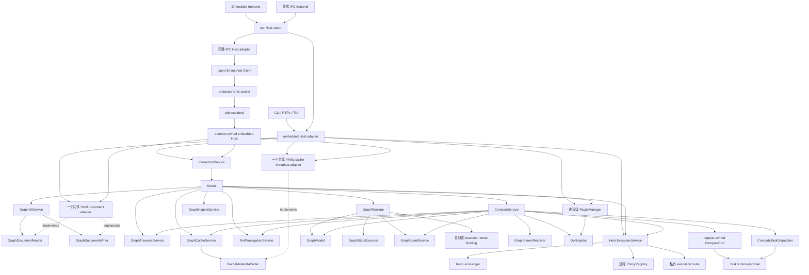

# 内核架构概览

本文概述当前源码树中的架构。文档职责和推荐阅读顺序由 `README.zh.md` 定义，并遵循
[ADR 0006](../../adr/zh/0006-kernel-documentation-separates-facts-decisions-targets-and-status.zh.md)
裁定的信息架构；领域术语由 `Terminology.zh.md` 定义。

## 架构概述

Photospider 围绕图运行时构建，包含服务拆分、操作 registry、缓存层、进程级 policy registry、
私有 execution route，以及面向前端的 Host seam。全部 planned work 都经过一个固定的、由 Host
组合的 `ExecutionService`：policy 对无权限候选项排序，Host 执行 reserved start，再由一个私有
route 执行已提交工作。
每个 Graph 都有一条有界串行 compute-request lane 和一个显式可见状态
`GraphStateExecutor`；两者各自拥有一个 worker，最多容纳 64 个等待 callback 与一个 active
callback。Compute 通过 graph-state 捕获 request-owned Graph/proxy snapshot，经所选 execution
route 在该 lane 外运行 planning 与 operation，只在进行精确 revision 验证与 no-throw publication
时重新进入 graph-state。

在 macOS/Linux 上，同一个 public Host seam 也具有完整的 installed IPC adapter。
`create_ipc_host(socket_path)` 通过精确的 typed 60-method version 2 协议实现当前全部 58 个非析构
virtual；`photospiderd` 拥有另一个 embedded Host，并让每项 backend operation 经由该 Host
进入。这个 remote path 增加 polling job、bounded registry 与 protected output artifact，但不
暴露 backend ownership。`graph_cli` 仍构造 embedded adapter，不会自动连接 daemon。

`Kernel` 是内部多图组合 facade。`ComputeService` 是内部计算 facade，更窄的协作者分别拥有
planning、pruning、dispatch、propagation、cache decision、execution 和 metrics。当前职责由
`Compute-Boundaries.zh.md` 定义。

## 构建模块

根 `CMakeLists.txt` 构建以下内部模块：

| Target | 角色 |
| --- | --- |
| `photospider_core_internal` | 仅用于构建的依赖中立 core value 与中立 parameter formatting，并包含构建所选的 image-processing 与 image-artifact 实现。`PHOTOSPIDER_ENABLE_OPENCV=ON` 选择 OpenCV processing/codec adapter；`OFF` 选择标准库 processing 实现与 unavailable codec，且不发现 OpenCV。 |
| `photospider_graph_internal` | 仅用于构建的依赖中立 core operation source、`GraphModel`、registry behavior、graph IO、遍历、缓存、传播与 inspect 服务。 |
| `photospider_yaml_adapter_internal` | 仅在 `PHOTOSPIDER_ENABLE_YAML=ON` 时存在的构建期 YAML adapter。它拥有共享 parameter-value translation、graph-document parsing/emission、cache-metadata parsing/emission 及其直接 filesystem 行为；格式中立的 GraphIO、Kernel、runtime 与 cache contract 不声明 parser value。 |
| `photospider_opencv_operation_provider_internal` | 仅用于构建、可选的仓库 OpenCV CPU operation provider。它拥有 operation algorithm、OpenCV 进程初始化与 OpenCV 异常翻译，并且只在 `PHOTOSPIDER_BUILD_OPENCV_OPERATION_PROVIDER=ON` 时存在。 |
| `photospider_plugin_host_internal` | 仅用于构建的 host-side operation plugin manager、configured-provider composition、v2 loader、value adapter 与 DSO lifetime owner。 |
| `photospider_policy_internal` | 仅用于构建的进程 policy registry、纯 C ABI-v1 DSO loader、不可变 binding、sticky fault 与 DSO lease。 |
| `photospider_execution_internal` | 仅用于构建的私有物理资源计账与 execution-domain 支持。 |
| `photospider_compute_internal` | 仅用于构建的 compute、dirty-region、runtime、interaction、event、固定 worker service、reserved-start 与私有 route 实现；它单向依赖 policy 和 execution internal。 |
| `photospider_host_internal` | 仅用于构建的 Kernel/Interaction facade 与 embedded Host composition root。它根据 producer capability 选择真实 YAML persistence adapter 或显式 unavailable adapter。 |
| `photospider_kernel` | 可构建的聚合 target，编译实际选中的 core、graph、operation-plugin、policy、execution、compute、Host 以及可选 provider/adapter 模块；它不是安装 artifact，也不是占位 library。 |
| `photospider_operation_runtime` | 可安装的 public image-buffer factory 静态实现；不依赖 OpenCV、yaml-cpp、Threads、graph、registry 或 embedded product。 |
| `photospider_operation_sdk` | operation v2 header 的可安装 interface target；传递链接 `operation_runtime`。 |
| `photospider_operation_opencv` | 可安装、显式 opt-in 的 OpenCV adapter，只使用 OpenCV `core` component；仅在 `PHOTOSPIDER_ENABLE_OPENCV=ON` 时存在。 |
| `photospider_policy_sdk` | 携带自包含纯 C policy ABI header 与 C11/C++17 requirement 的可安装、无依赖 interface target。 |
| `photospider` | 静态可安装后端产品，归档文件名为 `libphotospider`，由已启用的 CLI 和 embedded Host 前端链接。它导出 `Photospider::photospider`，在 OpenCV 与 YAML 均禁用时仍可构建；operation plugin 通过 `ps::plugin::OperationPluginRegistrar` 和 `register_photospider_ops_v2` 注册，而不是为了 registry 状态链接该产品。 |
| `photospider_ipc_client` | 已安装的 static typed Unix IPC client 与完整 IPC Host adapter。它导出 `Photospider::photospider_ipc_client`，实现全部 60 个 direct Client method 和当前全部 58 个 Host virtual，且不链接 backend，也不暴露 JSON/POSIX implementation type。 |
| `photospider_ipc_server_internal` | 不安装的 bounded Unix listener、typed router，以及 private session/job/snapshot/output registry。它让所有 backend access 经由一个 daemon-owned Host 串行执行。 |
| `photospiderd` | 已安装的 foreground macOS/Linux daemon，拥有一个 embedded Host、protected per-user socket/output store 与确定性的 joined shutdown。 |
| `photospider_cli_common` | 仅在 `PHOTOSPIDER_BUILD_GRAPH_CLI=ON` 时存在、不可安装的 application helper，从 `apps/graph_cli/src/`、`src/lib/benchmark/benchmark_service.cpp` 与 `src/lib/benchmark/benchmark_yaml_generator.cpp` 构建：REPL 命令、TUI 编辑器、自动补全、CLI 配置与 CLI benchmark service。 |
| `graph_cli` | 进程入口位于 `apps/graph_cli/main.cpp` 的终端用户可执行文件；只有 OpenCV 与 YAML capability 均启用时，其派生默认值才为 `ON`。 |

CLI 自有的 application surface 对 `apps/graph_cli/` 私有，包括其中的 `include/graph_cli/` header
与 `resources/help/` 文本。完整 CLI target closure 还精确包含上面两个按角色归属的 benchmark
翻译单元；它们只链接进不可安装的 `photospider_cli_common` helper 与完整 CLI closure，不会折叠进
可安装的 `photospider` 静态产品。Backend graph、compute、runtime、policy、execution、plugin、cache 与 Host
实现仍留在按角色归属的 `src/lib/**` library/internal module 中，不复制进 application。仓库自有
plugin 位于 `plugins/{ops,policies}`；维护中的测试翻译单元归类到
`tests/{unit,integration}`。

输出目录：

| 输出 | 路径 |
| --- | --- |
| executable | `build/bin` |
| libraries | `build/lib` |
| operation plugins | `build/plugins` |
| policy plugins | `build/policies` |
| tests | `build/tests` |

Package 边界：

- `cmake --install` 会安装静态 `photospider`、operation-runtime、operation/policy interface
  SDK、`include/photospider/**` 下已启用的 public-header inventory，以及基础
  `PhotospiderTargets.cmake`、`PhotospiderEmbeddedTargets.cmake` 和
  `PhotospiderConfig.cmake`。OpenCV 启用时还会安装 operation-OpenCV 归档、header 与
  `PhotospiderOpenCVTargets.cmake`；否则不会安装或宣告这部分 surface。Unix-like 工具链中的主归档名为
  `libphotospider.a`，MSVC 中为 `photospider.lib`。Config 会在导入基础 export set 前完成 dependency
  与 required-component 检查；此后只导入 producer 实际创建的 export set，并且只发现 producer
  启用的 dependency。显式选择的 component 或省略 component 时的 embedded 默认路径仍决定导入
  哪些可用 set。
- 在 macOS/Linux 且 `PHOTOSPIDER_BUILD_IPC=ON` 时，安装还会导出
  `Photospider::photospider_ipc_client`，安装精确三个 `include/photospider/ipc/` header 与
  `photospiderd`，同时让 server library 保持 private。IPC-only consumer 请求
  `COMPONENTS ipc_client` 时只解析 `Threads`；省略 component 则保留 embedded 默认行为及其
  backend dependency。
- `Photospider::photospider` 为 consumer 携带 `PHOTOSPIDER_STATIC`，并让 `src/lib/` include root
  只对仓库内部构建私有。在 build tree 中，该 target 的 generated public include root 只包含
  `photospider/` forwarding header。CMake 会跟踪 header 的新增和删除，wrapper 直接读取实时
  source header，不需要目录 symlink。
- Package component 包括 `embedded`、`ipc_client`、`operation_sdk`、`operation_runtime`、
  `operation_opencv` 与 `policy_sdk`。省略 component 时保留 embedded 默认行为。
  `policy_sdk`、`operation_sdk` 和 `operation_runtime` 不发现外部 package；
  `operation_opencv` 只发现 OpenCV `core`；`ipc_client` 只解析 Threads。如果 optional
  `operation_opencv` discovery 找不到 OpenCV `core`，package 仍保持 found，
  `Photospider_operation_opencv_FOUND` 为 false，不导入其 target，而所请求的无依赖 target 仍然
  可用。若将该 component 设为 required，则 package discovery 失败。
- Producer capability value 会记录在 package config 中。OpenCV-disabled install 会在不发现
  OpenCV 的情况下报告 `operation_opencv` unavailable。OpenCV/YAML-disabled product 的 embedded
  consumer 不会发现这两个 package，并可链接、运行真实 Host product。
- 启用时的 OpenCV（`core`、`imgproc`、`imgcodecs`、`videoio`）和 `yaml-cpp`，以及始终需要的
  `Threads`、平台
  dynamic-loader 库，以及 Apple `Metal`/`Foundation` framework 标志，是静态归档的实现链接依赖。
  Library dependency 会作为 `$<LINK_ONLY:...>` entry 出现在安装后的 target 上；Apple framework
  flag 来自 Apple-only 的 private product link block。Public Host/core 头避免暴露 OpenCV 和
  `yaml-cpp` 类型；Windows consumer 会收到 `PHOTOSPIDER_STATIC`，因此 declaration 不使用 DLL
  import/export 标注。
  `PHOTOSPIDER_ENABLE_OPENCV` 选择 image processing、image codec、public adapter 与派生的
  provider/plugin 默认值；`PHOTOSPIDER_ENABLE_YAML` 选择 graph-document 与 cache-metadata
  persistence。显式 target/capability 组合无效时会在 configure 阶段失败。
- FTXUI、`photospider_cli_common`、operation plugin、policy plugin 及其实现特定依赖，都不会作为
  embedded static package 的依赖导出。
- `apps/graph_cli/include/graph_cli/**` 下的 CLI header 是 private build input，不会安装；public
  install inventory 仍严格限定为 `include/photospider/**`。
- Source-tree extension header 不属于 public inventory，也不提供 forwarding header。Operation
  契约只位于 `include/photospider/plugin`，policy 契约只位于 `include/photospider/policy`，共享 device
  label 位于 `include/photospider/core/device.hpp`，完整可变/private declaration 则归属相应
  `src/lib` 目录。

## 运行时所有权

`create_embedded_host()` 是已配置的 persistence composition root。YAML 启用时，它构造一个
`YamlGraphDocumentAdapter` 与一个 `YamlCacheMetadataCodec`；YAML 禁用时，则构造显式
unavailable graph-document 与 cache-metadata adapter。它把 document owner 转换为格式中立的
reader 与 writer contract，并将这三个 contract 连同已配置的真实或 unavailable image codec
注入 `Kernel`。Disabled profile 仍支持 empty 与 in-memory session lifecycle；显式
representation IO 返回 `GraphErrc::Io`。`GraphIOService` 保留 document owner，
`GraphCacheService` 则保留 image 与 metadata owner。Kernel 和这些 service 都没有默认
persistence constructor 或隐式 fallback adapter。私有的显式依赖 Host root 供替换测试使用。
IPC Host 仍是 client-side transport adapter；只有 daemon-owned embedded Host 会组合 backend
persistence。

每个 embedded Host 都拥有自己的 Kernel、graph runtime 和异步协调状态，但 operation plugin 不同：
所有 Host 与 Kernel 都访问同一个进程寿命 `PluginManager` 和 `OpRegistry`。Host 析构绝不会卸载
operation plugin。任意 Host 执行 load 或显式 unload，所有 Host 都会观察到相同的进程级 operation view；
callback 与返回值 lease 会在 registry 移除后继续保持插件代码映射，直到在途状态完成销毁。

每个 embedded Host 都拥有一个固定 worker `ExecutionService`、一个默认 CPU dimension 为 32
的独立 resource ledger，以及 Interactive 和 Throughput 各一个 policy binding。每个 Run
预留完整 CPU/memory/scratch/ready vector。Graph runtime 只保留复制的 HP/RT route ID 与非零
generation；`cpu`、`serial_debug` 和 `gpu_pipeline` 是私有进程 execution route。
Reserved-start transaction 在进入 route 前恰好一次把 ready grant 交换为 execution grant。

IPC Host 只拥有 client-side connection、interruptible polling worker 与 mapped image lifetime。
Daemon session、accepted job、snapshot、output lease 与 backend Host 仍归 daemon 所有。销毁
adapter 会唤醒并 join 自有 poller，但不会关闭 session、卸载 plugin 或重复 mutation。精确的
socket、protocol、status、quota 与 artifact lifecycle 定义在
`../../codebase-structure/zh/IPC-Protocol-v2.zh.md`。

## 主要组件

| 组件 | 角色 |
| --- | --- |
| `Kernel` | 多图 facade、服务 owner、运行时 bootstrapper、顶层图/缓存/计算 API。 |
| `ps::Host` | `include/photospider/host` 下的 public frontend interface；返回复制的 request/result/snapshot value，并隐藏 Kernel、GraphModel 和 GraphRuntime。 |
| `embedded Host adapter` | 由每 adapter 独立的 `Kernel` 和 `InteractionService` 状态支撑的 in-process Host 实现；所有 adapter 共享进程级 operation plugin owner。 |
| `IPC Host adapter` | 完整的 installed Host 实现，只由 typed short-lived Client call 支撑。它组合 polling compute、join async worker、保留精确 status domain，并把 protected image artifact 映射为只读。 |
| `ps::ipc::Client` | Move-only direct client，为精确排序的 60-method version 2 inventory 提供 owned value；它验证 correlated result shape，且不暴露 raw JSON call。 |
| `photospiderd` | Foreground local service，拥有一个 embedded Host 并串行化全部 Host call，同时独立服务 metadata 与 job polling。 |
| daemon registry | 对 opaque session、compute job、stable collection snapshot、protected output 与 delivery lease 的 private bounded ownership；它们都不是 public backend handle。 |
| `GraphRuntime` | 每图资源容器，包含模型、graph-state lane、精确 64 个总单元的 compute-request lane、一个 latest-wins coordinator、固定容量 execution trace ring、复制的 HP/RT route binding 和平台 context。 |
| `GraphModel` | 图状态持有者：不复用的强 instance identity、经过检查的权威 revision、私有节点/拓扑存储、缓存根目录、计时数据、quiet/skip-save 标志，以及完整 compute snapshot/publication primitive。 |
| `InteractionService` | 由 embedded Host adapter 和 backend code 使用的内部 `Kernel` wrapper；包括 CLI 在内的 frontend 都使用 public Host seam。 |
| `ComputeService` | 解析依赖、检查缓存、执行 op，协调 RT/HP/tiled 路径和计时事件。 |
| `ComputeRequestCoordinator` | 每个 live Graph 的 latest-wins owner，负责 checked generation、精确 key 的 pending coalescing、每个 admitted key 的一个 persistent ticket、active cancellation notification，以及由现有 compute-lane worker 执行的精确 pending settlement。 |
| `RunGroup` | Realtime request owner，负责不同的 HP Full 与 RT Interactive child Run、它们的 observation lease、shared cancellation source、RT-first gate 与确定性 aggregate outcome。 |
| `ComputeRun` | 一个非 realtime HP domain 或一个 realtime HP/RT child domain 的私有 request owner。每个 Run 都拥有带精确 Graph identity/revision 与 supersession identity 的不可变 descriptor、单调 phase、一个 terminal arbiter、稳定 cooperative-cancellation reason，以及由共享 control 持有的 full-plan/temporary storage 或 dirty staging storage。内建 CPU full、dirty 与 preflight work 会通过固定的多 Graph service 保留稳定 lease 与复合 task identity。Public cancellation control 和最终 lifecycle registry 仍是后续工作。 |
| `GraphTraversalService` | 只负责拓扑：基于 `GraphModel` 邻接索引提供遍历顺序、结束节点发现、祖先检查、上游依赖查询和下游依赖查询。 |
| `RoiPropagationService` | ROI/空间传播边界，负责单节点上游 ROI 计算以及图级 forward/backward ROI 投影。 |
| `GraphExtentResolver` | HP 权威的输出范围解析器，供 ROI 传播和脏区规划使用。 |
| `GraphCacheService` | 内存/磁盘缓存操作和缓存同步；磁盘 image 与中立 metadata 经过必需的注入 codec contract。 |
| `GraphInspectService` | 基于图拓扑构建结构化缓存/空间元数据 inspect 和 dependency-tree snapshot。 |
| `GraphEventService` | 线程安全、固定容量的每节点 compute-event ring，提供带 sequence 的破坏性 batch 与饱和 drop accounting。 |
| `PluginManager` | 唯一的进程寿命 operation plugin owner；串行化 load/seed/unload/inspection 并拥有 source/restoration/handle 状态。Load 会注册并记录动态插件，seed 会初始化或对齐 built-in，只有显式全局 unload 才会移除动态插件。 |
| `OpRegistry` | 进程级 operation implementation registry，返回一致的 callback copy snapshot，包括 HP/RT、tiled/monolithic、设备元数据和 ROI propagator。 |

## 可观察行为

### 计算流程

典型 REPL 计算流程：

1. REPL 命令调用 public `ps::Host` interface。
2. embedded Host adapter 将 public value 转换为内部 `InteractionService` / `Kernel` request。
3. `Kernel` 解析活跃的 `GraphRuntime`、规范化 supersession key、分配经检查的 graph-wide
   generation，并通过 runtime coordinator 发布一个 latest pending candidate。
4. `Kernel` 创建或使用 `ComputeService` 所需服务。
5. 对于非 realtime HP，`ComputeService` 创建一个 `ComputeRun`；realtime request 则创建一个
   `RunGroup`，其中包含独立的 HP `Full` 与 RT `Interactive` child Run。每个 child 都捕获 session
   label、强 Graph instance identity、权威 revision、target、intent、quality、显式 QoS 与不可变
   supersession key/generation。
6. `ComputeService` 通过 `GraphTraversalService` 解析拓扑顺序。
7. `ComputeService` 通过 `GraphCacheService` 检查内存和磁盘缓存。
8. 脏区路径通过 `RoiPropagationService` 和 `GraphExtentResolver` 计算 ROI 需求和 HP 权威范围。
9. `ComputeService` 从 `OpRegistry` 选择操作实现。
10. Full、dirty 与 preflight ready work 会在完整 ledger 准入、Host policy 选择和 reserved start
    后跨越固定的多 Graph `ExecutionService`；随后由选中的私有 route 执行。
    Full plan/temporary result 与 dirty staging 会由匹配 Run 持有到唯一 terminal publication。私有
    cancellation 会在 planning、queue、callback、dependency、phase 与 commit 边界被观察；已经
    进入的 non-preemptible provider 会排空，但不能授权 publication。
11. Staged output 验证后，私有产品 commit policy 会验证精确 Run/staged/live identity、权威
    revision 与 current supersession key/generation，并在 Run success 前通过一个 graph-state
    transaction 发布完整状态。
12. `GraphEventService` 记录每节点事件和计时数据。
13. embedded Host adapter 将结果复制为 public Host value snapshot，CLI 再渲染这些 value。

典型 embedded Host 计算流程：

1. 本地前端通过 `create_embedded_host()` 创建 `ps::Host`。
2. 前端使用 `include/photospider/host` 和 `include/photospider/core` 中的 public value type
   发送 `GraphLoadRequest`、`HostComputeRequest` 或 inspection request。
3. embedded Host adapter 将这些 value 转换为现有 `InteractionService` / `Kernel` request。
4. Kernel 和 service execution 继续走与 CLI 相同的 graph-state、compute、cache、policy、execution-route 和 plugin
   路径。
5. 结果会复制回 `OperationStatus`、`GraphInspectionView`、`DirtyRegionInspectionSnapshot`、
   timing/event snapshot、policy 或 execution info 或其他 Host value snapshot。Host caller 不会收到
   `Kernel`、`GraphModel`、`GraphRuntime`、OpenCV rectangle 或 YAML node。
6. 对 Host 提交的 async compute，Kernel work item 会返回自身拥有的精确 outcome。一个 joined
   adapter worker 不读取共享 `LastError`，而是直接映射该 outcome，先兑现 caller-visible
   `OperationStatus` promise，再通知 `close_graph()` status publication 已完成。
7. Embedded close admission 会先发布 lifecycle marker，拒绝新的 compute 与 execution-route work，以及
   required graph save、node-YAML replacement、ROI projection work、timing inspection 与
   all-cache clearing。该 marker 之前已准入的调用会完成 caller-visible result/status translation；
   随后 Kernel 会停止 compute-request admission，从而唤醒阻塞在该满 FIFO 上的 producer；只有此后
   Host 才等待 async submission placeholder 与 status promise。已接受 compute request 会在
   graph-state 保持可用于最终 commit 时排空。Kernel 接着排空
   `GraphStateExecutor`、把 runtime 标记为 stopped 并移除它。进程拥有的 worker 与 policy
   binding 比 Graph 存活更久；复制的 route binding 不携带需要停止的物理 owner。已经加入完成
   generation 的 close caller 仍会返回，runtime 必须在 admitted work 完成后才能 erase。
8. 可恢复 backend failure 会转换成 Host status/result value，而资源耗尽保持异常语义：非析构
   Host method 和被消费的 async future 可以按可安装接口的文档传播 `std::bad_alloc`。

典型 IPC Host 计算流程：

1. 显式 daemon frontend 通过 `create_ipc_host(socket_path)` 创建 `ps::Host`；构造过程不会连接或
   启动 daemon。
2. Compute call 打开 short-lived typed Client，只 submit 一次，并收到带
   `cancellable:false` 的 `queued`。唯一 daemon worker 在恰好一次 embedded Host compute call
   后，让 job 经由 `running` 进入 immutable `succeeded` 或 `failed`。
3. Adapter 立即执行首次 poll，随后按 10/20/40/80/160/320/500 ms 等待，并重复 500-ms 上限，
   不设置同步总超时。每次 status RPC 只尝试一次；terminal state、首次精确 RPC failure 或
   adapter stop 会结束 polling。
4. Terminal Host/output failure 是正常 correlated job value；其中 nested `OperationStatus` 会
   保留精确 Graph 或 Daemon 语义，RPC、admission 与 lookup failure 则保持独立。在 public Host
   boundary 上，唯一 status vocabulary 能区分 `none`、`transport`、`protocol`、`graph` 与
   `daemon`，transport 绝不会变成 graph IO。
5. Image mode 在 delivery lease 下验证 same-user mode-`0600` artifact，把 tight row 映射为只读，
   随后尝试匹配的 job/lease release。最后一个 shared image owner 恰好 unmap/close 一次。
6. Async adapter destruction 会发出 stop、唤醒 wait、interrupt active descriptor、用 Transport
   `client_stopped` (5) 完成 unfinished future，并 join worker；它不会 resubmit，也不会关闭
   daemon-owned session。

Production bound 包括 64 个 active 与 256 个 retained terminal compute job；64 个 artifact、
总计一 GiB retained byte、每 artifact 512 MiB；8,192 个 compute event；以及 65,536 个
execution-trace entry。完整 method 映射与全部 string/page/snapshot/frame limit 维护在协议文档中。

### 有界 Event 与 Trace 观察

Public Host observation boundary 绝不会返回无上限的 compute-event 或 execution-trace vector。
`ComputeEventSnapshot` 与 `ExecutionTraceEventSnapshot` 都携带 per-session `sequence`；
`ComputeEventBatch` 与 `ExecutionTracePage` 都携带 bounded `events`、`next_sequence`、
`has_more` 与 `dropped_count` value。

Compute event 使用 8,192-entry production ring，以及包含 1 至 1,024 个 entry 的破坏性 Host
page。Execution trace 使用 65,536-entry production ring，以及包含 1 至 4,096 个 entry 的
非破坏性 cursor page。有效 publication sequence 为 `1..UINT64_MAX-1`；`UINT64_MAX` 专门
保留给 terminal exhaustion。两个 ring 都能在 backend construction 内注入更小 capacity 与
initial sequence state，用于 deterministic test，而不会增加 public Host configuration。

Compute-event name 与 source 在 retention 前限制为 1,024 UTF-8 byte。Oversized publication
会整条丢弃；所有 overflow、oversize 与 exhaustion accounting 都会饱和而不回绕。Invalid Host
limit 与 trace cursor 返回 `GraphErrc::InvalidParameter`，且不修改 retained observation；对于
valid request，缺失 session 仍返回 `GraphErrc::NotFound`。

### Policy 与 Execution 模型

Compute intent 与 policy class 彼此独立：

| 领域 | 取值 | 含义 |
| --- | --- | --- |
| Compute intent | `GlobalHighPrecision`、`RealTimeUpdate` | 选择 HP 或 RT 产品路径及其复制的 route binding。 |
| Policy class | `Interactive`、`Throughput` | 在执行前选择一个进程 ranking binding。 |

不可变内建 policy type 是 `interactive` 和 `throughput`。纯 C ABI-v1 policy DSO
可以增加 canonical ranking type，但只接收 Host 已准入的不可变标量候选项，不拥有资源或
执行能力。Host 为每个 class 保留一个 binding，校验每项决策，记录每代第一次 sticky fault，
并通过 Host-authored frontier 回退。

私有 execution route 恰好是：

| Route | 角色 |
| --- | --- |
| `cpu` | 固定 Host-lifetime worker pool 与可复用多条目执行。 |
| `serial_debug` | 一次只执行一个 callback 的确定性私有 route。 |
| `gpu_pipeline` | 私有 GPU/CPU pipeline 与 completion adapter。 |

CLI 暴露 `policy` 和 `execution` REPL 命令。本地配置使用 `policy_dirs`、
`policy_interactive_type`、`policy_throughput_type`、`execution_hp_type`、
`execution_rt_type` 和 `execution_worker_count`。已移除的 `scheduler` 命令和
`scheduler_*` key 会被拒绝，不会翻译。

`GraphStateExecutor` 仍是独立的可见状态访问边界。Runtime 的有界 compute-request lane
串行化同 Graph request 与 route replacement；GraphRuntime 保存复制的 route ID/generation，
不保存物理 worker 或 policy context。进程 service 拥有 ready store、两个 policy binding、
class arbitration、资源交换、私有 route 与 completion callback。

Public worker 请求范围是零到八。零解析为 bounded automatic value；显式一到八保持精确。
进程 CPU pool 固定后，零或相同请求保留现状，不同正值会被事务性拒绝。每个 Run 支付完整
CPU、retained-memory、scratch、ready-entry 与 ready-byte vector。容量耗尽是 Graph
`ComputeError`；无效 policy 或 route value 是 `InvalidParameter`。Policy 不能预留或启动工作。

### 操作 Registry

操作以 `type:subtype` 为 key。Registry 支持：

- 遗留 monolithic 操作注册
- HP monolithic 实现
- HP tiled 实现
- RT tiled 实现
- CPU 和 Metal 等按设备实现
- dirty ROI propagator
- forward ROI propagator
- dependency builder

依赖中立的 core analyzer/math operation 及其 propagation contract 在
`src/lib/core/ops.cpp` 中注册。Build-configured composition 入口位于
`src/lib/providers/configured_operation_providers.cpp`；启用可选 provider 时，
`src/lib/providers/opencv/` 下的实现会注册 OpenCV image algorithm，并拥有对应的 process policy
与 exception translation。运行时插件示例位于 `plugins/ops/`；Metal operation 实现仅属于
`plugins/ops/metal/`。Dynamic operation plugin 通过精确 v2 registrar，使用 `ps::plugin`
snapshot 注册；public callback 不会获得可变 `Node`、`GraphModel`、`OpRegistry`、YAML tree
或 private cache owner。

### 缓存模型

缓存层使用一个 node-local 正式缓存，加上一个 runtime-owned RT proxy graph：

- `Node::cached_output_high_precision`：正式可复用 HP 缓存。
- `RealtimeProxyGraph`：按 node id 保存的低分辨率临时 RT 预览/更新状态，不是正式缓存权威。
- HP version/ROI 字段位于 `Node`；RT version/ROI 字段位于 proxy node state。
- 配置缓存根目录下的磁盘缓存文件。

`GraphCacheService` 将缓存命令集中化。HP 代码应使用 `cached_output_high_precision`；RT 代码只能将 `RealtimeProxyGraph` 用作交互式状态。Dirty RT worker 写入会先通过 `RealtimeProxyWriteBuffer` stage，再提交到 proxy；dirty HP worker 写入会先通过 `HighPrecisionDirtyWriteBuffer` stage，再提交到 graph。正式缓存保存、加载和同步行为、后续 HP 计算以及长期存储应使用 HP 输出。该 service 要求非空的 `ImageArtifactCodec` 与 `CacheMetadataCodec` owner，绝不构造或声明 YAML value。已配置的 `YamlCacheMetadataCodec` 负责 YAML syntax、filesystem metadata IO，并把 parser/emitter failure 翻译为现有 graph error taxonomy。

### ImageBuffer 契约

`ImageBuffer` 是公共内核契约，不是内部实现细节。算子、执行器、插件、适配器和缓存代码可以依赖其文档化字段和不变量。

内核拥有的 CPU 缓冲区必须提供 64 字节对齐的行起点。`step` 是字节单位的行步长，可以大于紧凑行大小以保持对齐。ARM Mac 高性能路径可能需要或受益于 128 字节对齐，但 128 字节对齐是优化目标，而不是可移植最低要求。

### 脏区传播

ROI 传播通过 `RoiPropagationService` 处理，它使用 registry 提供的 propagator、`GraphModel`
拓扑邻接和 `GraphExtentResolver`。当前行为记录在
[脏区传播与工作选择](Dirty-Region-Propagation.zh.md)中。

重要当前行为：

- Host、graph、dirty-region、planning 与 task geometry 使用 `PixelRect` 和 `PixelSize`
  表示，而不是 OpenCV value type
- source/generator/analyzer/math 类节点的恒等传播
- `resize`、`crop`、`convolve` 和 `gaussian_blur` 的特定传播
- 下游脏区投影的 forward propagation
- 可在 tile 空间执行的算子的 tiled compute 元数据
- 当前 tile 默认值是可调实现参数，不是永久 ABI

## 边界与原理

- `Kernel` 组合图级 service，不暴露可安装 API。
- `ComputeService` 协调私有协作者，其模块边界是 `ps::Host` 后方的实现细节。
- 当前 `ComputeRun` 拥有一个非 realtime HP domain 或一个 realtime HP/RT child domain。
  Realtime `RunGroup` 拥有两个 child 的 observation lease、shared cancellation source、RT-first
  gate 与 aggregate outcome。每个 child descriptor 保留强 Graph instance identity、权威 revision
  与不可变 supersession identity；topology generation 仍是独立 planning cache key。内建 CPU
  full、dirty 与 preflight work 会在稳定 Run lease 下执行 owned callback，并按
  `(RunId, RunLocalTaskId)` 路由 failure；所有 dirty route 都会通过 completion 保留 owned Run lease。一个私有 request source 会把稳定的首个 reason 扇出到两个 realtime
  child Run，而 HP-only child cancellation 保持局部。
- 每个 live Graph coordinator 拥有 checked graph-wide generation、每个精确 key 的一个 latest
  pending mailbox 与 persistent continuation ticket，以及一个 logical active-runner marker。现有有界
  compute-lane worker 执行每次 ticket turn；supersession 不创建 background runner 或额外 thread。
  Commit 必须匹配 current generation，因此最新 generation 失败不会恢复旧 commit right。
- `GraphTraversalService` 只拥有 topology query。
- `RoiPropagationService` 与 `GraphExtentResolver` 拥有空间传播和 HP-authoritative extent resolution。
- Dependency-tree data 由 inspection 边界构建，经 embedded Host adapter 复制，再由 frontend 渲染，
  不暴露后端对象。
- 仓库自有 CPU OpenCV provider 使用可重入 `cv::Mat` callback，并在发布前把 OpenCV 内部 CPU
  threading 固定为一。注册算法抛出的每个 `cv::Exception` 都在 provider 内翻译为 host-owned
  `GraphError`；若 OpenCV 报告资源耗尽，则翻译为新建的 `std::bad_alloc`。已准入 execution
  grant 拥有外层 callback parallelism，真实共享 backend state 则继续在对应 provider 内同步。
- `PHOTOSPIDER_BUILD_OPENCV_OPERATION_PROVIDER=OFF` 会省略这些 builtin image operation
  callback，同时保留依赖中立 core operation。此时 v2 operation plugin 可以提供缺失 key。启用
  provider 时，同一 registration transaction 可以替换 active key，卸载后恢复 builtin
  predecessor。
- 多 graph/intent 的内建 CPU work 会共享每个 embedded Host 的一个固定 `ExecutionService`。
  其 ledger 会原子准入完整 Run vector；其 policy-aware
  ready store 按 entry 和 byte 有界。Ready work 使用经过 checked arithmetic 的 work-unit 加
  4-KiB byte-quanta cost。Graph score 只属于已选 service class，按 weight 归一化的 Run score
  也留在每个 Run 的不可变 class 中，从而在不泄漏跨 class 历史的前提下保持多租户公平。两个 class
  都 ready 时，class 仲裁会在至多三次连续 Interactive dispatch 后强制选择 Throughput。八次
  dispatch aging 只在仲裁已选定的 class 内生效，不能替换该决策。受保护 headroom 只限制 active Throughput root reservation；Interactive work 不会扣减该 class
  quota，而 ledger 仍是共享物理容量的最终权威。Throughput charge 会一直保留到所有 child grant
  结束后的精确 root release。Policy 不拥有容量，私有 route 不能绕过 reserved start。
  ADR 0003 与 ADR 0007 记录已接受的所有权/生命周期契约。ADR 0003 与 ADR 0007 记录已接受的所有权/生命周期契约。

- [ADR 0001](../../adr/zh/0001-graph-state-access-is-not-scheduler-dispatch.zh.md)
  分开 graph-state access 与 scheduler dispatch。
- [ADR 0002](../../adr/zh/0002-external-libraries-are-kernel-adapters.zh.md)
  定义外部库 adapter 目标。
- [ADR 0003](../../adr/zh/0003-process-owned-execution-resources.zh.md) 定义已接受的进程执行域。
- [ADR 0004](../../adr/zh/0004-opencv-cpu-operations-are-reentrant-provider-work.zh.md)
  定义当前 OpenCV CPU provider 并发。
- [ADR 0005](../../adr/zh/0005-graph-document-ingestion-is-a-classified-transaction.zh.md)
  定义已实现的图文档摄取事务。
- [ADR 0006](../../adr/zh/0006-kernel-documentation-separates-facts-decisions-targets-and-status.zh.md)
  定义当前事实、决策、目标与实施状态如何保持分离。
- [ADR 0007](../../adr/zh/0007-compute-runs-and-process-execution-have-separate-owners.zh.md)
  固定完整的目标 Run、completion、execution-service、ledger 与 lifecycle 所有权；其中 issue
  #67 的 Run-lease 基础、issue #69 的固定多 Graph HP/RT service 与 child Run，以及 issue #70
  的 ledger 准入与 bounded ready store 已经是当前行为。Issue #71 的私有无状态 Interactive/
  Throughput policy、层级、公平 aging、burst 上限与受保护 headroom 也是当前行为。Issue #72
  的强 Graph identity/revision、request-owned 产品 staging、精确 revision visible commit 与
  RT-first 独立 child publication 也是当前行为。Issue #73 的私有 cooperative Run cancellation、
  deadline observation、精确 queue/resource drainage 与 cancellation/commit arbitration 也是当前
  行为。Issue #74 的 request-owned `RunGroup`、checked latest-wins generation、有界 ticket-backed
  coalescing 与 current-generation commit predicate 也已是当前行为。Issue #75 的纯 C policy
  ABI、Host-authored frontier、reserved start、私有 execution route 与 protocol-v2 control
  surface 也已是当前行为。Issue #76 的 lifecycle registry/close/shutdown fence 和 public
  cancellation control 仍是未来行为。

[内核演进 roadmap](../../roadmap/zh/Kernel-Evolution.zh.md) 把目标决策组合成长远方向，但不会改变
本文档所记录的当前状态。

## 实现与验证入口

- `CMakeLists.txt`
- `include/photospider/host/host.hpp`
- `src/lib/graph/graph_document_reader.hpp`
- `src/lib/graph/graph_document_writer.hpp`
- `src/lib/adapters/yaml/yaml_graph_document_adapter.*`
- `src/lib/adapters/yaml/parameter_value_yaml.*`
- `src/lib/adapters/yaml/yaml_cache_metadata_codec.*`
- `src/lib/core/cache_metadata_codec.hpp`
- `src/lib/core/image_buffer_processing.*`
- `src/lib/core/parameter_value_text.*`
- `src/lib/adapters/opencv/image_buffer_processing_opencv.cpp`
- `src/lib/providers/configured_image_artifact_codec.*`
- `src/lib/providers/configured_persistence_adapters.*`
- `src/lib/graph/graph_io_service.*`
- `src/lib/runtime/kernel.*`
- `src/lib/runtime/graph_runtime.*`
- `src/lib/compute/compute_run.*`
- `src/lib/host/embedded_host.cpp`
- `tests/integration/test_host_adapter.cpp`
- `tests/integration/test_graph_document_injection.cpp`
- `tests/integration/test_kernel_contracts.cpp`
- `tests/integration/test_ipc_daemon.cpp`
- `tests/integration/static_product_consumer_smoke.py`
- `tests/integration/ipc_disabled_install_smoke.py`
- `tests/integration/dependency_disabled_install_smoke.py`
- `tests/unit/test_compute_run.cpp`
- `tests/unit/test_stdlib_image_buffer_processing.cpp`
