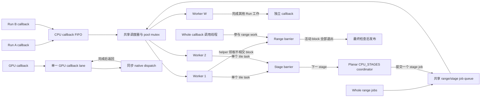

# 并行执行模型

## 1. 核心摘要 (TL;DR)

`ExecutionContext` 拥有固定 CPU worker pool、独立的 CPU/GPU callback lane，以及共享的等待 callback 上限。Whole CPU callback 可与空闲 pool worker 共同执行 range work；planar staged callback 提交单线程 tile，并在每个 stage 等待完成。取消会停止后续领取和发布，再等待已运行的工作及已提交设备任务结束。

## 2. 架构心智模型 (Mental Model & Intuition)

不同 Run 竞争同一 context 的 worker 容量。Whole callback 的调用线程处理 range block，空闲 worker 可领取其他 block；被其他 callback 占用的 worker 必须等其返回后才能协助。共享调度器在普通 callback 和 range block 之间轮换机会，并在领取后轮转可执行的 range job。



普通 callback 使用 CPU callback FIFO。Whole range job 与 planar `CPU_STAGES` job 使用另一个共享 range/stage job list。两个结构共用 scheduler mutex 和 worker pool，因此 callback、range job 和 staged job 会争用 worker 容量。调度器在 callback 与 range 工作之间轮换机会；range worker 领取互不重叠的 block，stage coordinator 提交 tile 工作并在每个 stage barrier 等待。Whole callback 调用线程也直接参与自己的 range barrier。GPU callback lane 使用独立队列，但共享 context 的等待容量。Range block 和 stage tile 会增加普通 callback 的等待时间。

## 3. 契约规约与接口 (Formal Contracts & APIs)

### CPU Whole range service

```c
#include <stdint.h>

typedef int (*ps_cpu_range_callback_v1)(
    void* user, uint64_t begin, uint64_t end, uint32_t slot);

typedef struct ps_cpu_parallel_service_v1 {
  uint32_t struct_size;
  uint32_t abi_version;
  uint32_t maximum_workers;
  void* context;
  int (*run)(void* context, uint64_t count, uint64_t grain,
             uint32_t workers, ps_cpu_range_callback_v1 callback,
             void* user);
} ps_cpu_parallel_service_v1;
```

该 service 借给 CPU Whole callback。它把 `[0, count)` 划分为有限、不相交且不超过 `grain` 的区间。`workers == 0` 使用最大 grant；正数请求 1 到最大参与者，其中包含调用线程。实际并行 block 数可以少于 grant。每个活动 block 获得唯一存活的 scratch slot。输入和 callback user data 借用至同步 barrier 返回；scratch 不得逃逸该调用。

非空 run 在启动任何 block callback 前，先按 Root Host 和 Metadata 容量预留 job record 与一个 Root Entry，再扣除 `work=count` 和 `stages=ceil(count/grain)`。预留或扣费失败时，run 返回 sticky resource failure，block callback 调用数为零。`count=0` 不创建 job，也不扣 work 或 stages；常规参数检查和取消检查仍会执行。

一个参与者的 grant 或可装入一个 block 的 range 会在调用线程内联执行。长 block 必须轮询给定取消 token。Service 停止新领取，并在返回前等待活动 block 退出。Block 使用不可变输入和预分配输出；行访问、分配、发布、准备和诊断 service 属于 callback 线程，range block 不可调用。嵌套 range 调用会拒绝，service 违规保持 sticky。

对元素数 `N` 和正 grain `B`，block count 采用避免 `N + B - 1` 溢出的计算：

$$
N_{blocks}=N/B + (N\bmod B\ne0),\qquad
end=begin+\min(B,N-begin).
$$

Structured CPU Result Whole poll 会通过 `ResultProgramPhase::cpu_parallel` 收到此借用 service。它只在当前 Whole callback 内调度 block，不会独立并行化 Result dependency graph。`tests/integration/test_cpu_parallel.cpp` 在 Root 已发行 work 后请求 `UINT64_MAX` range，并检查资源拒绝发生在任何 block callback 之前。`tests/unit/test_cpu_range.cpp` 在没有 Root 预算时检查端点算术，因此不能证明 Root admission 行为。

### Structured Result callback wave

Structured coordinator 登记请求的 named Result roots，并推进其 dependency Actor。潜在的 CPU contract-1 joint 候选根会延迟启动，直到其 consumer Actor 验证 Need 并登记 producer inputs，使 peer C1 inputs 可以在候选启动前合组。经过验证的 Need 会把符合条件的计算型输入加入 pending frontier。Need 中每个 input 都有独立 cursor；coordinator 在可推进的 input 之间轮转，并保证每个 Actor 在一次 traversal 中最多访问一次。这避免深层 dependency chain 随 peer input 被重复递归遍历。

Frontier 有 queued callback work 时，coordinator 从 Root-owned pending list 提交最多 `maximum_parallelism` 个 task。它等待已提交 callback 退出，再读取 phase result 并串行应用，然后推进下一个 dependency frontier。该上限作用于已提交的 callback task，不是另建 Result graph scheduler。CPU staged-tile controller 与 GPU callback 仍使用各自的 inline/controller 和 single-lane 路径。

Run coordinator 拥有调度策略和发布顺序。独立组件分别拥有每 Run cache quota 与 checkpoint scopes、actor phase/continuation state、Need producer cursor、joint 推进状态和每次 submission 的 stage 数据。Need cursor 拥有 producer 和每个输入的请求状态；coordinator 校验并登记每个已提供 envelope 后才推进 cursor。每个 submission 的 transfer、tile 和 native observations 保留至 task 退出，再由 coordinator 合并。Joint worker 标记 callback 已进入并运行共享 callback；coordinator 在退休时只计一次该 group。Result poll timing 从 phase 创建计至 coordinator 退休，包括 queue 与 wave 等待，因此不是纯计算时长。同步 Run 完成和 shutdown 会先排空已提交工作，再释放借给 callback 的状态。

### Planar staged tile service

```c
#include <stdint.h>

#define PS_CPU_TILES_ABI_VERSION_1 1U

typedef struct ps_cpu_tile_v1 {
  uint32_t struct_size, slot;
  uint64_t index, begin[3], end[3];
} ps_cpu_tile_v1;

typedef int (*ps_cpu_tile_callback_v1)(void* user,
                                       const ps_cpu_tile_v1* tile);

typedef struct ps_cpu_tile_stage_v1 {
  uint32_t struct_size;
  uint64_t extent[3], tile[3];
  uint32_t workers;
} ps_cpu_tile_stage_v1;

typedef struct ps_cpu_tiles_service_v1 {
  uint32_t struct_size, abi_version, maximum_workers;
  void* context;
  int (*run)(void*, const ps_cpu_tile_stage_v1*,
             ps_cpu_tile_callback_v1, void*);
} ps_cpu_tiles_service_v1;
```

Coordinator 提交一个三维 work-item grid，并等待全部 tile callback 退出后才开始下一 stage。每个 callback 收到半开 tile box，作为一个不可分割任务运行于共享 CPU worker。Coordinator 执行分配、行访问和 stage 转换。`workers == 0` 使用 Run grant 上限；正数只限制并行参与数，不改变 tile 几何。

对 `(height, width, channel)` 张量，operation 可令一个 tile 跨完整 channel extent，使像素矩形保留每个像素的全部 RGBA 样本。这些坐标描述计算 work，不是物理 planar storage page。任一 extent 为零时不产生 tile callback。宿主检查 tile size 为正、ceil-div 与三轴乘积后才提交队列。一个 stage 持有其等待 admission 和 managed Queue lease，直至 callback 退出且 job 从队列摘除。

### 取消、资源与发布

Context 在创建时确定 CPU worker 数；`cpu_workers` 为零时解析为有界硬件线程数。CPU 始终可用，native GPU 可选。`maximum_queued_tasks` 限制 CPU/GPU lane 共享的等待 callback 数。普通 callback 在 worker 开始执行时释放等待 slot；planar `CPU_STAGES` job 会保留 admission 和 managed Queue lease，直到所有已提交 tile 退出且 job 从队列摘除，具体规则见上文。活动 job 在退役前保留输入 owner、callback state、scratch 和输出 storage。

取消会关闭后续 range/tile 领取，并阻止后续 device submission。同步 range call 等待活动 block；GPU service 在返回前排空已提交工作。最终取消和 currentness 检查通过后才发布输出。Sticky host-service failure 优先于 callback success。宿主不能抢占任意 plugin code 或已提交 native dispatch。

CPU helper 保存并恢复浮点环境，以 nearest-even 舍入和 gradual underflow 执行。Operation 自行定义 reduction 顺序，以及保持该顺序的 block 几何。

`ExecutionContextConfig::collect_scheduler_timing` 默认为 false。启用后，`scheduler_statistics()` 分别返回 CPU/GPU lane 快照，并分别同步。Accepted 统计成功插入 FIFO 的 callback；started 统计 worker 从 FIFO 取出的 callback。`submission_ns` 从提交入口计至插入 FIFO，包括 mutex 获取和队列存储。`queue_wait_ns` 从成功插入计至 worker 取出。计时不包括 callback runtime 和 device execution。FIFO 统计不包含 range/tile claim，但这些工作占用 worker 时会增加 callback 等待。多个 Run 共享 context 的累计计数；仅当快照未饱和时，计数和耗时总和的差可用于选定区间。`maximum_queue_wait_ns` 与 `maximum_queued_callbacks` 是 context 生命周期最大值，不能通过差分得到区间最大值。不同 lane 快照可能对应不同时间点。

## 4. 负面清单与边界 (Non-Goals & Explicit Boundaries)

- 同一 invocation 的 Whole range callback 与 planar CPU staged callback 使用互斥服务。
- Tile callback 不拥有 coordinator 的行、分配、发布、诊断或准备服务。
- 调度器不承诺 work stealing、抢占，也不保证实际并发数等于 worker grant。
- GPU callback 经每 context 单 lane 同步提交；已提交 dispatch 完成后才能释放 owner。
- Planar GPU callback 在图边界使用 host row window。跨图节点共享的 device-resident planar page 不属于当前接口。
- Managed accounting 不包括线程栈、driver 私有分配和未建模容器存储。

## 5. 后果与代价 (Consequences)

CPU worker 全忙时，ready callback 会留在对应 lane queue 等待。共享等待额度用尽时，提交返回 `ResourceExhausted`，执行器不会自动重试。调用方若要重试，须先释放容量或减少并发工作。

取消延迟由活动 block 和已提交 dispatch 的剩余运行时间决定。长 CPU block 必须轮询取消；慢 callback 会延迟结果清理和 context shutdown。单一 GPU callback lane 会串行执行该 context 的 GPU callback，planar 边界复制会增加传输开销。

等待队列限额和 managed memory/work 限额控制不同资源。Run 按其 owner 生命周期保留输入、中间结果、callback state 和结果 storage。ABI 兼容规则见 [Plugin ABI](Plugin-ABI.zh.md)。
