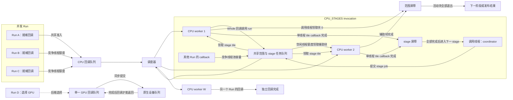

# 并行执行模型

## 核心摘要

内核通过固定线程池执行独立工作，并在执行完成前保留请求所需的存储。Whole 回调可与辅助 worker 共同处理范围工作，staged 回调则提交单线程 tile 并在每个阶段边界汇合。取消会停止新任务领取、排空活动工作，并控制结果发布。

## 架构心智模型

每个执行上下文都有固定数量的 CPU 线程。Whole 回调将范围拆成块，调用线程自己处理一部分，空闲线程从范围队列领取其他块。其他 Run 共享这个线程池，因此忙碌线程可能先完成另一个回调，再参与辅助工作。调用线程会持续领取块，也可以独自完成整个范围；只有在全部块已被领取，或失败已停止后续领取时，它才进入屏障等待。



调度器在池互斥锁保护下集中领取队列任务。它在普通回调和可领取的范围块之间轮换执行机会，并在领取后将范围任务轮到队列后方，使并发 Whole 调用共享辅助线程机会。调用线程及其辅助 worker 根据任务游标领取互不重叠的后续区间。CPU_STAGES 调用使用调用线程作为 coordinator：它一次提交一个 stage，等待该 stage 的全部 tile callback 结束，再进入下一 stage。Coordinator 负责准备工作和 row 访问；内核 worker 单线程执行 tile callback，即使只有一个 worker 获准，kernel 工作仍由该 worker 执行。其他 Run 与 tile job 竞争同一线程池。启用 GPU 的上下文还拥有一个 GPU 回调队列。GPU 回调同步提交原生工作，并在设备完成前保留 buffer 和服务状态。

## 契约与不变量

### 工作就绪、观测与 Region

计划阶段的全部声明前置条件成功后，该阶段进入就绪状态。执行器将就绪回调提交到所选 backend 队列；同一 Run 中的依赖边规定阶段顺序，不同 Run 可以同时占用线程池。

observation 是关联依赖证据和传播失效的单位。内核分别记录 Data、Control、Validation 和 Descriptor 角色。Regional 请求授权其观测所需的已声明输入支持；Whole 请求使用操作的完整依赖组。Empty 请求验证静态元数据并返回空覆盖。

输入被编辑后，内核将编辑区域与保留的依赖关系相交，再把受影响的输入支持映射回消费该输入的观测，并向下游记录传播相应输出区域。例如，源图像的一个矩形被编辑时，只有依赖支持与该矩形相交的缓存输出矩形会失效；无界或 Whole 输入关系会使完整输出失效。这就是从保留的“输入影响输出”关系反向映射的具体过程。

planner 只沿操作声明为可分的轴生成 tile 边界。如果张量布局为 `(height, width, channel)`，且契约声明 channel 轴不可拆分，那么 tile 可以覆盖一块像素矩形，同时保留每个像素的四个 RGBA 值。宿主向该 tile 授权输入区域，并只发布回调实际生成的输出覆盖。逻辑依赖区域独立于存储布局和 tile 边界。

### CPU 回调与范围服务

一个执行上下文拥有固定容量的 CPU worker 池。CPU Whole 回调申请同步参与者额度；调用线程直接参与，空闲池 worker 可以领取辅助块。Whole CPU range 服务提供给 CPU Whole 回调，每个 CPU tile 回调则作为一个回调任务执行。

| 符号 | 含义 | C API 字段或参数 |
| --- | --- | --- |
| **W** | CPU 池容量及服务最大额度 | `maximum_workers` |
| **G** | 参与者额度，包含调用线程；`1 <= G <= W` | `workers`（`0` 选择 **W**） |
| **B** | 单个范围块最多包含的元素数；`B > 0` | `grain` |
| **N** | 范围内的元素数量 | `count` |

```cpp
#include <stdint.h>

typedef int (*ps_cpu_range_callback_v1)(
    void* user, uint64_t begin, uint64_t end, uint32_t slot);

typedef struct ps_cpu_parallel_service_v1 {
  uint32_t struct_size;
  uint32_t abi_version;
  uint32_t maximum_workers;
  void* context;
  int (*run)(void* context, uint64_t count, uint64_t grain,
             uint32_t workers, ps_cpu_range_callback_v1 callback, void* user);
} ps_cpu_parallel_service_v1;
```

该服务通过共享任务游标推进 `[0, N)`，并依次提供长度最多为 `B` 的有限领取区间。并发领取时，调用线程及其辅助 worker 在池互斥锁保护下推进游标。参与者额度为一，或整个范围只需一个块时，调用线程直接执行。worker 请求值为零时使用服务最大额度 `W`；正值选择 `1` 到 `W` 之间的 `G`。未取消的调用遇到 `N = 0` 时成功返回，块数为零。实际同时运行的块数可以少于申请额度 `G`。

每个活动块获得唯一的活动 scratch slot 和互不重叠的索引区间。操作将这些索引映射到输入数据和输出存储，并保持共享输入不可变，将写入分配到各自独立的输出位置。调用者在同步屏障返回前保留 user 数据和 scratch。长时间运行的块自行轮询调用取消状态；服务在块与块之间检查取消，并等待已经开始的块退出。

范围队列与普通回调队列共享线程池互斥锁和 worker。辅助线程可用或忙碌时，调用者都会继续处理自己的块。调度器在普通回调和范围块机会间轮换，并轮转可执行的范围任务以共享辅助线程。范围块使用传入输入和预先分配的缓冲区。

### CPU staged tile service

Planar `CPU_STAGES` 模型向 coordinator 线程提供 `ps_cpu_tiles_service_v1`。Coordinator 提交一个三维 work-item grid 描述的 stage，并等待该 stage 完成后再准备下一阶段。每个 callback 收到一个半开 tile box，并作为不可再分的单线程任务运行在共享内核 worker 上。Coordinator 负责分配、buffer 构造、row 访问和阶段切换；共享 worker 执行 tile callback。即使 grant 只有一个 worker，kernel 工作仍在该 worker 上执行。内部计算分块与输出 `RegionRule` 分离：一个 operation 可以要求完整图像输入，同时把内部计算划分为有限 work item。

对于每轴 extent `E_i` 和正 tile 大小 `T_i`，网格每轴有 `C_i` 个坐标，三轴 checked product 给出 callback 数。展平索引以轴 0 为最快变化轴；例如 RGBA 的尾部 channel 轴可使用覆盖全部 channel 的单个 tile，同时按矩形划分 height 和 width。这些 work-item 坐标表示计算工作，与 tensor 逻辑轴和物理 planar storage tile 分离。

对于非空网格，宿主按轴顺序拆分展平 index，并在每轴后继续整除剩余商：

$$
C_i=\left\lceil\frac{E_i}{T_i}\right\rceil,\quad
N_{tiles}=C_0C_1C_2,\quad
q_0=index\bmod C_0,\ r_1=\left\lfloor\frac{index}{C_0}\right\rfloor,\quad
q_1=r_1\bmod C_1,\ q_2=\left\lfloor\frac{r_1}{C_1}\right\rfloor,\quad
begin_i=q_iT_i,\quad
end_i=begin_i+\min(T_i,E_i-begin_i).
$$

实现先在 `T_i > 0` 条件下计算 `extent / tile + (extent % tile != 0)`，并在发布任务前检查三轴乘积。任一 extent 为零时 callback 数为零。`end` 先减后加，保证末尾部分 tile 不越过对应 extent。每个 stage 使用预留 buffer；callback 写入分配给它的互斥区域，分配和 row 服务由 coordinator 执行。

调用线程与 tile service 共用 context 的 waiting admission 和 managed queue lease。一次 admission 及其 queue lease 持有到 stage 排空且 job 从队列摘除。`maximum_parallelism` 限制 stage grant，同时保持 tile 几何固定。取消会停止后续领取，并等待活动 callback 结束。Whole callback 可使用由调用线程参与的 range 服务；staged invocation 使用 tile 服务，两项服务在一次 invocation 中互斥。

### 取消、发布与数值环境

取消会阻止新的范围块领取和后续设备提交。范围服务在返回前汇合活动块；GPU 服务在返回前排空已提交工作。执行器在发布输出前执行最终取消和计划有效性检查。请求输出仅在回调成功且最终检查通过后发布；宿主服务中的粘滞错误优先于回调的成功码。

CPU 范围辅助线程保存并恢复浮点环境，并使用 nearest-even 舍入和渐进下溢。调度器保持所选操作数值 profile 声明的性质。每个操作契约定义自身归约顺序，以及可保持该顺序的块几何。

### 资源计费与所有权

执行上下文对并发 Run 应用共享准入上限。回调准入会占用一个等待队列槽位，直到 worker 开始执行。输入 owner、回调状态、scratch、依赖元数据和输出存储会在各自规定的 owner 生命周期内保持有效。Run 释放临时 owner 后，结果仍保留其存储所需的 lease。

`OperationPreparation::additional_workspace_bytes` 为注册的 workspace 上界增加经检查的静态增量。Preparation 根据元数据和参数大小推导此增量；解析后的上界参与操作身份。运行时构造和计算通过回调 allocator 和工作计费服务执行。

`BufferAllocator::limited()` 限制仍存活 backing storage 的总实际容量；`limited_requested()` 限制仍存活分配请求字节数的总和。两个额度可以嵌套：requested quota 与 root capacity charge 分开计算，native allocation 的实际 backing capacity 仍向 root 计费。`CpuStorage` 在发布后保留两类 lease 和分配来源；最后一个 storage owner 释放时，先退役 native owner，再释放两类额度。Failure observer 会随 allocator scope 和 native conversion 传递。

Generic Value `ExecutionRun` GPU step 的 callback allocator 按该 step 计划的逻辑字节上界限制仍存活请求；root 则按每个 native allocation 查询到的实际 capacity 非阻塞准入。准入前 Run 尝试回收 pending disk writes 和 memory cache；原子准入以 root reservation 为准。普通 CPU Run step 保留 complete reservation。`planned_peak_bytes` 表示观察到的 reservation 峰值，包含 complete CPU reservation 和增量 native reservation。

GPU 执行使用独立回调队列和原生 buffer token。插件边界上的 dispatch 提交和完成是同步的。token 在 dispatch 期间保留 view owner；最后一次 dispatch 完成并释放 token 后，该 view 退出。Planar row window 位于宿主内存，回调在明确的设备边界复制数据，并可在回调期间将中间 buffer 留在设备上。

### 边界与性能证据

对于上文定义的 `N` 个元素和块 grain `B`，检查整数运算给出领取次数。终点表达式中的 `min` 使每次加法保持在 `N` 以内：

$$
N_{blocks}=\left\lceil\frac{N}{B}\right\rceil,\qquad
end=begin+\min(B,N-begin),\quad B>0,\ begin\le N.
$$

```cpp
#include <algorithm>
#include <cstdint>

std::uint64_t block_count(std::uint64_t count, std::uint64_t grain) {
  // Precondition: grain > 0.
  return count / grain + (count % grain != 0);
}

std::uint64_t block_end(std::uint64_t begin, std::uint64_t count,
                        std::uint64_t grain) {
  // Preconditions: grain > 0 and begin <= count.
  return begin + std::min(grain, count - begin);
}
```

代码中的 `count` 对应 `N`，`grain` 对应 `B`；worker 额度 `G` 控制并发度，块数由 `N` 和 `B` 决定。

形状乘积、字节宽度、页对齐和元数据容量在分配或发布前使用检查运算。每次范围调用有一条调用期间的 job 记录，并用位掩码跟踪已占用的 scratch slot；并发 job 会将该记录接入范围队列。该记录保留到同步汇合结束。等待回调上限与受管理内存上限控制不同的准入决定。

性能测量分别记录建图、验证、分配、整数元数据处理、队列等待、回调计算、设备提交、完成和发布。代表性负载包括小任务饱和、并发 Run、变化绑定、冷启动和热运行。报告延迟分布和 QPS 时，同时记录 worker 数量、队列上限、受管理字节数、RSS、上下文切换和可用硬件计数器；这些指标描述不同的资源成本。

`ExecutionContextConfig::collect_scheduler_timing` 可选记录回调 FIFO 观测，默认值为 `false`。启用后，`ExecutionContext::scheduler_statistics()` 在各自线程池互斥锁下分别返回 CPU 和 GPU 的 `CallbackQueueStatistics`。每个快照包含成功接收和已启动回调数、累计 `submission_ns` 与 `queue_wait_ns`，以及 context 生命周期内的 `maximum_queue_wait_ns` 和 `maximum_queued_callbacks`。如果计数器或时长总和的加法将溢出 `UINT64_MAX`，会设置 `saturated`。

`accepted_callbacks` 统计成功插入 FIFO 的回调，`started_callbacks` 统计 worker 移除的回调；被拒绝的提交不计入两者。`submission_ns` 从 `ThreadPool::submit` 入口计时到 FIFO 插入后立即记录的时间戳，包含等待线程池互斥锁和插入队列的时间；计时在通知 worker 和释放互斥锁前结束。`queue_wait_ns` 从该时间戳计到 worker 移除回调，因此包含通知、释放互斥锁以及 worker 随后等待取得线程池锁的时间。启用观测时，每次提交尝试都会读取入口时间戳，成功入队后读取发布时间戳，worker 开始回调时读取移除时间戳。每个成功回调因此读取三次时钟；被拒绝的提交仍读取入口时间戳，但不增加计数。关闭观测时不会读取计时钟。FIFO 计数不含 CPU range block 领取和 staged tile 领取。worker 执行这些工作时的占用可能增加回调的观测队列等待。队列等待不代表图像传输时间、callback 执行时长或设备执行时长。

提交和 worker 移除计数复用线程池已有互斥锁；callback 完成路径不会获取额外的计时互斥锁。

每个 lane 的快照单独同步，因此 CPU 与 GPU 数值可能来自不同时间点。共享一个 context 的多个 Run 共用累计计数。若两个快照均未饱和，调用方可用计数和时长总和的差值描述自选区间；生命周期最大值不能相减得到区间最大值。最大值包含 warmup 和该 context 此前发生的活动。

## 非目标与明确边界

- 本文规定内核的共享调度和所有权。具体操作的算法、参数和数值 profile 由对应规格描述。
- CPU staged 接口属于 planar C 扩展；其他 callback 类型遵循各自声明的执行模型。
- 范围块不能使用仅限回调线程的分配、row 修改、发布、诊断或 preparation 服务。
- 缺失输入区域不授权读取 payload，空覆盖不授权读取样本。
- 并发 tile 窗口覆盖文档所述的确定性 CPU 流式执行路径。Frozen cache、checkpoint、request/fragment flight、joint operation、structured output、保留 view 和 GPU 阶段使用各自路径；收集执行当前串行处理有界 CPU tile。
- GPU 取消在 dispatch 边界协作。已提交设备 dispatch 完成后，其 owner 才能退出；此接口不提供设备抢占。
- Planar GPU 回调在图边界使用宿主 row window。跨节点驻留设备的 planar 输出页面需要新的接口。
- 线程栈、驱动私有内存和未建模容器存储不计入声明的受管理容量。

## 后果与代价

当全部 **W** 个 CPU worker 都在运行时，新的就绪回调会留在共享队列等待。执行上下文的等待回调额度用满后，新提交以 `ResourceExhausted` 失败；执行器不尝试重试。调用方若要重试，需要先释放容量或降低并发 Run 数量。CPU 和 GPU 回调共用上下文的等待额度，尽管它们使用独立回调队列。

取消会停止后续领取，再等待所有活动 CPU 块和已提交 GPU dispatch 完成。长块回调必须轮询取消 token，因为宿主无法中断任意插件代码。回调执行缓慢时，取消、结果清理和线程池关闭都会延迟到该工作结束。

长时间运行的 Run 会让输入、scratch 分配、中间 buffer 和排队回调状态保持有效，直到各自 owner 退出。配置的等待、workspace 或受管理内存上限耗尽时，Run 可能准入失败。受管理容量不含线程栈、驱动私有分配和部分容器开销，因此进程 RSS 可能超过配置的受管理上限。

设备执行在 planar 图边界增加主机到设备、设备到主机的复制。回调内部保留设备中间结果可以减少重复传输；同一上下文中的 GPU 回调仍由单一 GPU 队列串行执行。

公开 CPU range、operation、planar 和 GPU 表均为带版本接口。ABI 不匹配时，插件验证阶段会拒绝加载；使用新表布局的消费者需要针对匹配的 SDK 重建。版本与拒绝规则见 [插件 ABI](../Plugin-ABI.md)。
