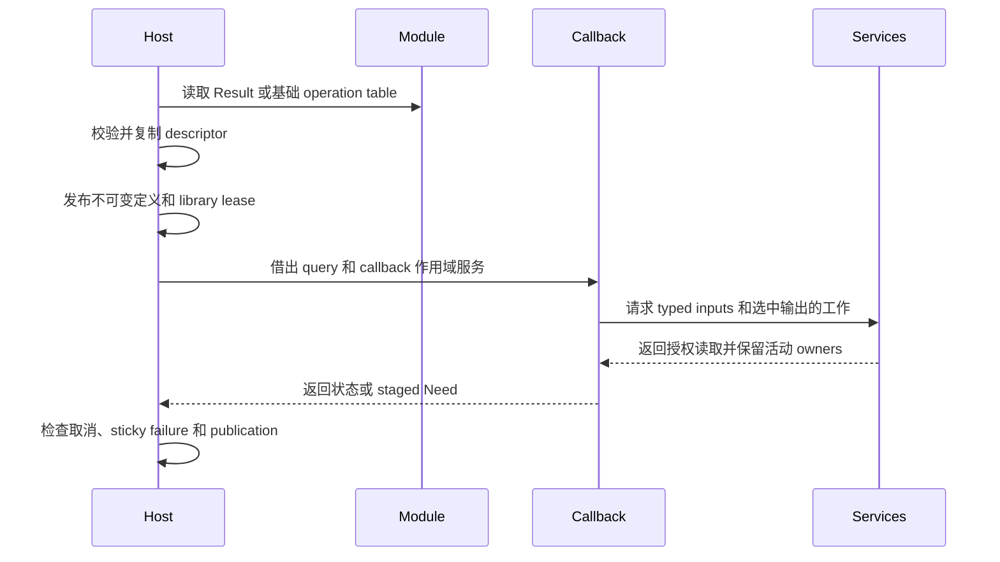

# 插件 ABI 与所有权

## 1. 核心摘要 (TL;DR)

Photospider 通过版本化 C 表在宿主进程中加载受信任的 operation module，并在发布前复制其声明。结构化 `Result` 是图像输入和输出的唯一契约；每个图像 slot 在 Result 对象内以 typed planar samples 作为 backing。当前 package 为 0.29.0，基础 operation table 为 ABI 11，独立 structured Result table 为 ABI 1。

## 2. 架构心智模型 (Mental Model & Intuition)



Registry 持有每个不可变定义及其动态库 lease。Invocation snapshot 在 callback 运行期间保留定义。Structured coordinator 解析具名输出、选中输入投影、Result 图像 sample 请求、field I/O、dependency evidence 和 backend 服务；`PlanarImage` allocation 是 Result 持有的 backing。

## 3. 契约规约与接口 (Formal Contracts & APIs)

### 入口与核心模型

```c
#include "photospider/plugin/result_operation_plugin_api.h"

const ps_result_operation_plugin_api_v1*
ps_result_operation_plugin_get_api_v1(void);
```

```cpp
#include <utility>
#include "photospider/data/result.hpp"

ps::SchemaTemplate schema;
ps::ResultImageSpec pixels;
pixels.key = "pixels";
pixels.frames = 2;
pixels.layers = 3;
pixels.descriptor = {ps::ElementType::Float32, {1080, 1920, 4}};
pixels.layout.height_axis = 0;
pixels.layout.width_axis = 1;
pixels.layout.channel_axis = 2;
schema.images.push_back(std::move(pixels));
```

Result schema 将 primitive records 与 image slots 保持为不同的 typed members，fields 与 image slots 合计最多 16 个。每个 image slot 最多有 4096 组 frame/layer backings，并描述有界的 `{frame, layer, ...sample}` domain；`descriptor` 描述单帧/层，`layout` 描述 planar storage。Primitive record bytes 存于 `ResultFieldSpec`；图像像素存于 image slot 的 typed planar backing。Result object identity、schema、descriptor facts、fields、image backing、relations 和 source association 由同一个 owning Result reference 持有。数值 `Value` 输出仍走 Value 路径。

Result operation ABI 1 是独立 C table。Module 导出 `ps_result_operation_plugin_get_api_v1`；loader 要求精确 table size 和 ABI version，将全部 records 导入私有 registry candidate 后原子发布。任何 record 失败都会让 registry 保持原状。基础 operation ABI 11 仍供使用 Value/dependency callback 契约的 operation 使用。Loader 不再加载原 planar callback table。

每个 Result output descriptor 声明名称、Value 或 Result typed port、输入投影，以及 Whole 或 Regional 执行方式。Input ports 可以约束普通 Value、numeric scalar 范围、typed Value 或 Result schema。可选的 `resolve_metadata` callback 接收借用的已编译 input metadata、parameters 和 output prototypes。该纯 metadata 步骤中，callback 按 output 的 registry index，对每个 output 调用一次同步 `ps_result_metadata_sink_v1::set_output`。Sink 在 `set_output` 返回前复制并校验所有嵌套 descriptors，因此 callback 可使用局部 schema、image 和 facet records。Sink error 为 sticky；有 output 未提供时 preparation 失败。Operation key、output names/projections、output kind、Result schema id/version 和已声明的 output constraints 保持固定。`start`/`poll` callback 收到实际解析的 input/output metadata、选中 `output_index`、requested Regions、tile geometry、parameters 和 backend。`need_value` 与 `need_image` 增加有界 sample 请求；`need_result` 请求 field facts，field read 则通过临时存储 I/O 的 Need/poll/reply 顺序进行。`read_image` 受 `need_image` 授予的 captured image capability 限制。`requested_kind` 区分完整 Result object query（`0`）、Value footprint（`1`）和 image footprint（`2`）。Kind 为 1 或 2 且 Region 数量为零时表示 Empty coverage。Retained image handle 在 release 或 state 销毁前保留相同 slot 和 coverage。

Callback 可以使用 relation rows 和 finality 发布 typed Result image，追加并发布 primitive fields，绑定 descriptor support，发布普通 Value output，并 seal Result。`ResultSupportTarget` 区分 Value samples、fields、image slots 和 descriptor observations。`Exact`、`Conservative` 和 `Unknown` 保留各自 dirty propagation 强度；Exact 是关于 support 的注册声明，宿主不会证明其数值定理。Association 单调增加，并在派生结果生命周期内保留已消费的源对象。`ResultRef::capture()` 将一个 descriptor revision 与其 image/field coverage、relations 和 dependency evidence 一起冻结；共享 waiter 消费该 captured publication。`ResultRef::resources()` 提供 schema 根据 typed image facets 和 Result metadata 选择并保留的 ICC/OCIO bindings。

### Callback 生命周期、资源与执行

Query 和 service table 在一次 `start` 或 `poll` 期间借用。保存的 phase context 会在该调用返回时过期。Retained image handles 和 operation state 具有显式释放/销毁生命周期。Result C service calls 在 callback entry thread 上运行。通过 `cpu_parallel` 或 `cpu_tiles` 调度的 CPU worker callback 只调用 `cancelled`；worker 可以写入 entry thread 已为其分配的 scratch bytes。Metadata sink 只在 resolver entry 期间借用，`set_output` 在 resolver entry thread 上运行。Callback 检查 service 返回码；即使 callback 随后报告成功，宿主仍保留 sticky service failures。

Whole CPU callback 可以使用 CPU range service。CPU tile callback 使用 coordinator 的 tile service。存在 native GPU lane 时，Whole 和 staged Result callback 按 operation capability 声明获得相应 native services。GPU service 只能由当前 callback 线程调用，dispatch 会保留引用的 owners 直到完成。C++ `ResultProgramPhase::gpu_status` 是当前 native invocation 的借用状态读取器。Callback 在 GPU service call 后于 entry thread 上调用它，以取得具体 host status，包括 numeric GPU table 将错误概括报告时丢失的细节。该 reader 随 phase 过期。CPU tile callback 作为不可分割的 tile task 运行。

配置 resource root 后，宿主计量准入的 work、stages、I/O、relation/map metadata、payload capacity 和 retained owners。超出限制时 callback 收到 resource 或 stage failure；已发放的 work 不退款。Result publication 在公开 immutable result 前校验 schema、sample 坐标、relation coverage、finality、cancellation 和 resource ownership。

基础 operation ABI 11 保留独立的 Value/dependency 入口和既有多输出投影规则。公共 C SDK target 为 C++ operation helper 提供 `Photospider::operation_sdk`，纯 C provider headers 由 `Photospider::data_provider_sdk` 提供。Result ABI header 是 C11 interface，其 DSO callback table 不继承 operation SDK 的 C++ 要求。

## 4. 负面清单与边界 (Non-Goals & Explicit Boundaries)

- Operation module 是同进程受信任代码。ABI 校验不提供 sandbox 或 authentication。
- 已移除的 planar extension ABI v1、v2、v3 均拒绝。旧 planar header 和独立 image executor 已删除，不提供兼容 adapter。
- Package 0.29 要求 C++ consumer 重建。WorkflowDocument schema 4 和 OperationTraits version 21 拒绝旧契约。基础 C operation table 保持 ABI 11；独立 Result operation table 为 ABI 1。
- Production image operation 的可用性按[图像 operations](Image-Operations.zh.md)中列出的源码与 registry 分类执行。
- GPU 执行需要构建启用 native backend 且设备可用。Table 或 capability 声明本身不能证明硬件执行。
- C image descriptor 将 planar storage order 和 row pitch 作为 physical layout 输入。C Result table 提供已声明的 Value 与 Result ports；IPC plugin-loading 和 daemon protocol 不属于该 ABI。

## 5. 后果与代价 (Consequences)

格式错误或不兼容的 table 在 registry 发布前失败；loader 不会重新解释旧 planar table。Native loading 后被拒绝的 module 会释放 library owner；已发布定义在最后一个 invocation 或 state owner 退役前保持动态库加载。Service、资源、取消或 backend 错误不会自动重试 callback。

同步 native dispatch 会保留 input owners 直到设备完成，因此取消可能等待正在执行的调用。长 CPU callback 必须通过 services 观察取消。Native module 具有宿主进程权限，只能加载受信任代码。
