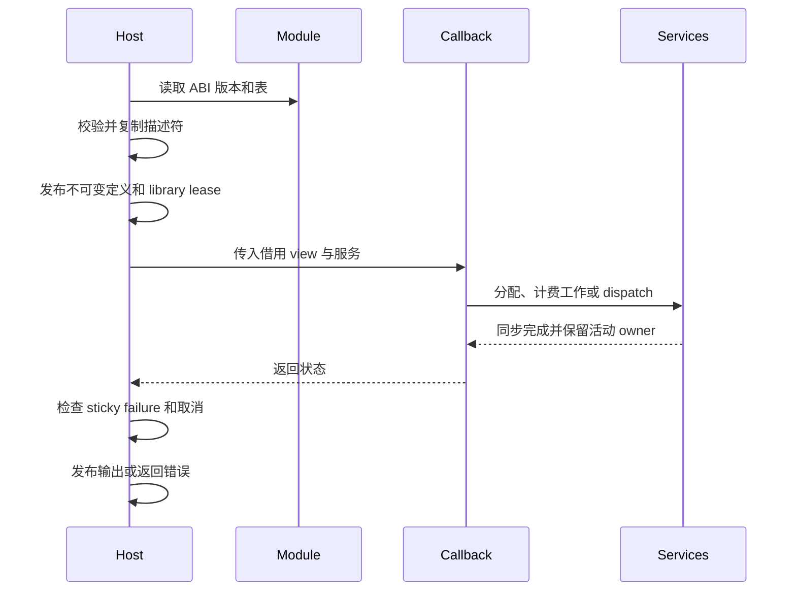

# 插件 ABI 与所有权

## 1. 核心摘要 (TL;DR)

Photospider 通过版本化 C 表在宿主进程中加载受信任的 operation 和 data-provider 模块。宿主先校验并复制描述符，再发布定义，并在每次调用中借出带有明确内存和取消约束的服务。当前 package 0.28 使用 operation ABI 11、data-provider ABI 1，以及可选 planar 扩展 ABI 3。

## 2. 架构心智模型 (Mental Model & Intuition)



Registry 持有已发布定义及其动态库 lease。调用快照在用户代码运行期间保留该定义，因此只有所有 callback owner 退出后才会卸载动态库。Callback 参数和服务表按文档约定借用；输出存储和显式 handle 使用各自的 owner。

## 3. 契约规约与接口 (Formal Contracts & APIs)

### 当前入口

```c
#include "photospider/plugin/operation_plugin_api.h"
#include "photospider/plugin/data_provider_api.h"
#include "photospider/plugin/planar_operation_plugin_api.h"

const ps_operation_plugin_api_v11* operation_api(void) {
  return ps_operation_plugin_get_api_v11();
}
```

Planar table 是 operation ABI 11 的可选扩展，两张 operation 表逐项对应。启用扩展的模块中，每条记录都是 planar operation，并替代普通 Value callback。Provider ABI 1 独立发布会被复制的 schema key、element type 和最大 rank。

Operation ABI 11 描述 key、flags、输入/输出 traits、参数 schema、callback 和模块状态。复制后的 traits 包含 backend 能力、确定性和副作用声明、shape/Region 规则、输入约束、输出 facets 与 cache policy。C 表使用精确 struct size 和封闭 enum。未知、缺失、类型错误或冲突参数会在 callback 前拒绝；callback 收到经过校验的规范值。

一个 operation 最多可发布 64 个有序输出 descriptor。每个输出分别声明名称、dtype/shape contract、Region 规则、语义约束、observation/failure policy 和输入投影。宿主在 registry 发布前复制所有有效记录。多输出定义必须确定且无副作用。Invocation/query 带选中输出的 `output_index`；投影后的输入 view 保留原始 `input_index`。

Operation callback 收到带 storage origin、byte offset、有符号 stride、有效 coverage 和精确 demand 的输入 view。输入字节借用至 callback 返回。Output sink 给出期望 descriptor、Region 和 packed size。`allocate_output` 返回宿主拥有的输出；`allocate_scratch` 返回 callback 局部 scratch。发布宿主输出会冻结而不复制；发布调用方或栈内存会通过相同宿主 allocator 复制。第一次 publish 尝试即占用 sink，即使失败；后续尝试产生 sticky `OperationFailed`。

C operation 返回码区分成功、普通失败、取消、backend 不可用、资源耗尽、类型不匹配和参数无效。未知非零值映射为 `OperationFailed`。GPU callback 只有在 descriptor 声明 CPU/GPU 两种能力且允许 fallback，并且尚未发布输出时，才能以 backend unavailable 请求 CPU fallback。宿主取消和 sticky service failure 保留各自优先级。GPU-only descriptor 在 CPU callback 执行前拒绝。

C++ `OperationTraits::Fixed` 描述逻辑输出 descriptor。只要 operation 不要求 dense output，C++ registry 可以发布稀疏或 zero-stride broadcast Value，即使逻辑 shape 很大也无需 dense byte product。同步 C DSO sink 要求 fixed descriptor 具有可表示的连续有符号 stride、非零 `uint64_t` byte count、末字节不超过 `INT64_MAX` 且大小不超过 `SIZE_MAX`。Staged dependency 输出逐 fragment 校验；逻辑域很大时，只要请求 fragment 有界仍可表示。

纯 C++ 静态准备可以根据 metadata 和参数特化输出 traits，并增加经过溢出检查的 runtime workspace 上界。`PreparedOperation` 不可变，可并发共享；其 state 析构前会保留注册定义和动态库。它不包含 Value payload、Run 数据、I/O 状态或可变缓存。解析后的 workspace 和输出特化进入 operation identity；独立调用之间不会隐式共享准备结果。

### Planar 扩展与同步服务

```c
#include "photospider/plugin/planar_operation_plugin_api.h"

int charge_work(const ps_planar_services_v3* services, uint64_t units) {
  return services->consume_work(services->context, units);
}
```

Whole planar callback 使用选定的 CPU 或 GPU lane。CPU Whole 可调用同步 range service；GPU Whole 使用同步 native GPU service。CPU staged callback 获得仅供 coordinator 使用的 `cpu_tiles`，由 coordinator 执行行访问和分配。Scratch 由宿主持有、初始化为零、8-byte 对齐，按存活 requested bytes 总量限额，并可显式释放或在 callback 返回时统一释放。Native backing capacity 另向 context root 计费。Service failure 为 sticky 并覆盖 callback 成功；只有 callback 成功且最终取消检查通过后才提交输出。

Planar extension ABI 3 支持单输出 Whole CPU/GPU 和 CPU staged operation。Staged 执行要求 CPU-only 能力。GPU service 只允许 callback 所属线程调用；token 在同步 dispatch 完成前保留 view owner，并在 callback 返回时失效。Planar row 指针指向 host storage，需在设备边界显式复制。

C++ dependency `start_dependency` protocol 是 Value operation 的 staged 执行方式。ABI 11 提供每个 poll 有界服务，用于精确关联、授权读取/fragment、保留输入 owner、发布输出、scratch、取消、工作计量、checkpoint、pure block、native atlas/dispatch 和 GPU discovery。Service error 为 sticky。借用 service/view 指针在 poll 返回时失效；retained input handle 持续有效至显式释放或 state 销毁。Joint poll 可组合独立 Atomic 输出，同时仍要求 singleton callback。完整生命周期见 [依赖数据](Dependency-Data.zh.md)。

### 校验、生命周期与错误

打开模块前，loader 校验路径非空、长度在限制内且不含内嵌 NUL。随后验证 ABI version、精确 table size、指针/数量组合、对齐、数量上限、UTF-8 key、enum、flag、traits 和必要 callback，再发布定义。拒绝时 registry 不变，并释放已取得的 native handle。多记录表中任何后续记录错误都会拒绝整张表。

Registry 复制所需 schema 和 descriptor，并让每个不可变定义持有 module lease。调用 handle 在 callback 期间保持模块加载；描述符表在卸载前销毁。Provider 查询结果拥有自己的复制 key，不借用映射中的 provider 内存。嵌入式 C++ callback 使用相同不可变定义所有权模型。DSO 注册通过私有事务完成，打开动态库本身不会发布 operation。失败路径对每个已取得的 destroy/close 恰好执行一次。Registry snapshot 复制 shared definition handle；callback 和 callable 析构函数不在 registry mutex 下执行。

安装的 `Photospider::operation_sdk` target 传递 `cxx_std_17` 和 wrapper 头文件。`Photospider::data_provider_sdk` 只提供 provider include 目录，不传递 C++ 语言特性，C11 provider 无需继承 C++ 要求。

ABI 运行同进程受信任代码。异常不得越过 C 边界；host service error 保持 sticky，分配失败保留资源分类，其他 callback 错误变为 `OperationFailed`。回调不得释放借用指针，也不得在声明寿命之后保留它。

## 4. 负面清单与边界 (Non-Goals & Explicit Boundaries)

- ABI 校验检查结构和行为契约，不提供 sandbox、认证、隔离或进程准入。
- 不提供 plugin 调度 ABI、policy DSO、provider storage service 或通过 IPC 加载 plugin 的路径。
- Operation ABI 11 和 planar ABI 3 没有旧入口兼容。安装后的 C++ consumer 和 module 必须针对匹配 public headers 重建。
- GPU 能力取决于构建选择的 native backend。ABI 可用不表示设备存在或所有 operation 都能运行于 GPU。
- Planar GPU 只支持 Whole callback，不支持 staged callback 或 CPU fallback。

## 5. 后果与代价 (Consequences)

格式错误或版本不兼容的模块在 registry 发布前失败。调用方收到状态，可选择其他模块；loader 不会将旧表重新解释为新表。Callback 即使忽略失败的分配或其他 service violation，返回后仍会看到 sticky host failure。

同步 dispatch 会让 callback owner 保持存活到设备完成，并可能按 dispatch 剩余时间延迟取消。长 CPU callback 必须轮询取消。资源和队列耗尽返回有限错误，callback 不会自动重试。Native module 拥有宿主进程权限，只能加载受信任代码。
