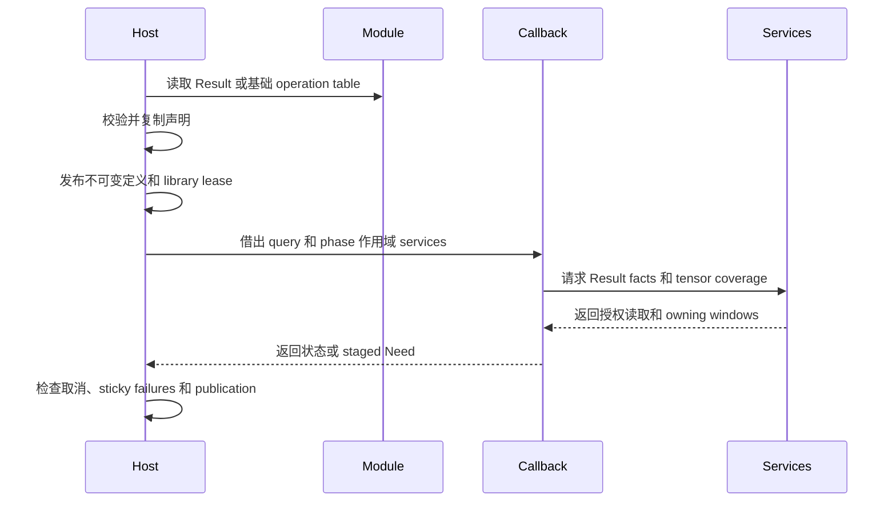

# 插件 ABI 与所有权

## 1. 核心摘要 (TL;DR)

Photospider 通过版本化 C 表在宿主进程中加载受信任的 operation module，并在发布前复制声明。Structured Result C ABI 的每个 port 对应一个 Result object；typed tensor members 保存数值或图像 samples，fields 保存 primitive records。当前 package 为 0.32.0，operation plugin 仅使用 Result operation C ABI 2，OperationTraits 为 24；旧基础 operation C ABI 已移除。

## 2. 架构心智模型 (Mental Model & Intuition)



Registry 持有每个不可变定义及其动态库 lease。Invocation snapshot 在 callback 运行期间保留定义。Result coordinator 解析具名 outputs、tensor 投影、field I/O、dependency relations 和 backend services。Result 持有 schema 与 tensor storage；tensor 可使用 affine CPU storage 或由 physical layout 描述的其他 backing。

## 3. 契约规约与接口 (Formal Contracts & APIs)

### 入口与核心模型

```c
#include "photospider/plugin/result_operation_plugin_api.h"

const ps_result_operation_plugin_api_v2*
ps_result_operation_plugin_get_api_v2(void);
```

`result_operation_plugin_api.h` 是独立的 C11 Result SDK header。它定义 Result element type 与 parameter type enums、parameter descriptor/value records、facet view、capability flags 和普通 callback/service statuses，是不依赖旧 operation-plugin header 的 standalone C11 SDK。`PS_RESULT_EXPORT` 也在此定义，并使用共享的 `PHOTOSPIDER_OPERATION_PLUGIN_BUILD` producer switch。Native GPU 声明位于独立的 `native_gpu_api.h`，使用自己的 ABI 版本。

```cpp
#include <utility>
#include "photospider/data/result.hpp"

ps::SchemaTemplate schema;
ps::ResultTensorSpec pixels;
pixels.key = "pixels";
pixels.batch_axes = {2, 3};
pixels.descriptor = {ps::ElementType::Float32, {1080, 1920, 4}};
pixels.layout.spatial = true;
pixels.layout.height_axis = 0;
pixels.layout.width_axis = 1;
pixels.layout.channel_axis = 2;
schema.tensors.push_back(std::move(pixels));
```

Result schema 声明 tensor members、primitive fields、domain 和 metadata；tensor members 与 fields 合计最多 16 个。Tensor descriptor 描述 cell axes 与 element type；`batch_axes` 位于这些 axes 前面，构成完整 sample shape，完整 rank 最多为 8。`ResultTensorLayout` 中的空间轴索引相对于 cell axes。Storage order 和 row pitch 描述 physical layout，不属于 semantic schema identity。Tensor payload 与打包的 field records 分开存储。 对于 non-spatial tensor，所有 batch 与 cell extents 都必须为正数，完整 sample rank 为 1 至 8；schema validation 不要求 dense byte allocation，也不要求所有 extents 的乘积可表示。Packed field 的 record rank 最多为 7。Schema validation 会计算每行字节数，并在乘积超过 `INT64_MAX` 时拒绝 schema，但不会为该 field 的全部 rows 分配 dense storage。

Result object identity、schema、descriptor facts、fields、tensor members、relations 和 resource bindings 由 owning Result reference 持有。Association 按顺序保留 source ObjectIds 作为历史记录；dependency support 由 relation rows 表示。Association 本身不保留 source payload。保留的 Result、tensor window 或已发布 view 会持有读取所需的 backing owners。

Result operation ABI 2 是独立 C table。Module 导出 `ps_result_operation_plugin_get_api_v2`；loader 在接管 table destroy hook 前检查 table alignment、精确结构大小和 ABI version。导入阶段校验 pointer/count 配对与 alignment、record 大小、operation constraints，以及有界且严格合法的 UTF-8 operation 和 parameter 名称。Facet key 必须是可打印 ASCII，version 必须为正，每个 facet list 最多 64 项，单个 payload 最多 65,536 bytes。Loader 将 records 导入私有 registry candidate，再一次性发布完整 candidate。成功导入后，只要已注册定义仍可能使用 plugin-owned declarations，host 就保留 table owner；保留的 table 生命周期结束时调用 destroy。导入失败、重复 key 或 owner 分配失败时，loader 先通过已接管的 destroy hook 释放 table，再关闭 native library。Loader 只接受 Result ABI 2 入口；module 未提供该入口时会被拒绝，没有基础 operation C fallback。`Value` 是 Result storage 与 codecs 使用的 typed numeric backing，不定义 operation 或 workflow 的 input/output 类型。C++ 与 C operation interface 都使用 Result ports。Dependency records 描述 Result support evidence，不是另一套 operation callback table。 `test_result_plugin.cpp::continuation_owns_library` 启动 Result Object Need 后让 registry 离开作用域，期间没有 publication observer，随后 continuation 仍能成功继续；导入的 definition 会将 module owner 保留到 callback 完成。

每个 Result output descriptor 声明名称、Result port、input projection、Whole 或 Regional 执行方式及 output policy。Input ports 约束 Result schema 或选定的 tensor-member predicate。可选的 `resolve_metadata` callback 接收借用的已编译 input metadata、parameters 和 output prototypes。它按 output index 对每个 output 调用一次同步 metadata sink；sink 在返回前复制并校验嵌套 schema records。Resolver 可推导 output port/schema，但不能改变 flags 或 payload bound；`start` 和 `poll` 接收的 `output` view 会反映已注册的 policy。Sink failures 为 sticky；有 output 未提供时 preparation 失败。Operation keys、output names 和 projections、Result schema identity 及已声明约束保持固定。

`ps_result_output_v2::flags` 选择不可变的 output policy。`PS_RESULT_OUTPUT_PRESERVE_VIEWS_V2` 允许 CPU、非 joint Atomic output 保留兼容的 immutable input view。`PS_RESULT_OUTPUT_REQUIRE_INPUT_VIEWS_V2` 隐含 Preserve flag，要求 CPU Whole execution；affine view 不可用时会在 computation callback 前拒绝。Compiled structured CPU Whole path 中，coordinator 会在 computation poll 前准备已授权的 Need boxes；Auto 仅在 view 不可用时收集。Direct callback entry 不会自动生成 Need 或 view preparation。`PS_RESULT_OUTPUT_PAYLOAD_BOUND_V2` 启用 `maximum_output_payload_bytes`；零表示显式的零字节上限，而 flag 清零时该字段必须为零。Payload bound 支持 CPU Whole 或 staged output。Host 在 publication 时检查实际物理 owners、对共享 backing 去重，并排除由 Result 或已授权 Tensor Need 保活的 source allocations。Root 仍单独计量 source 与收集后的 input backing、workspace、metadata 和 referenced resources。Singleton 与 joint callback query 都会反映注册的 output policy；contract-2 joint 会将某个 output cap 超限限定为该 member 的失败。Bound 不会阻止 callback 之前已进行的分配。Importer 会拒绝未知或不一致的 flags。

新增字段改变嵌套 `ps_result_output_v2` 的二进制布局，operation C ABI 仍为 ABI 2。Importer 要求当前完整结构的精确大小，并拒绝旧的 prefix，因此 C module 必须按当前 header 重新构建；不提供兼容 shim。

`start` 或 `poll` callback 接收解析后的 ports、选中的 output index、requested coverage、tile geometry、parameters 和 backend。`need_result` 请求 Result descriptor 与 field facts。`need_tensor` 按 Data、Control、Validation 或 Descriptor roles 请求有界 sample coverage（mask 1 至 15）。仅 Descriptor 的 tensor coverage 授权读取 facts，不授权 payload reads。`read_tensor` 复制已授权 samples。Query kind `0` 请求完整 Result object；kind `2` 描述 tensor coverage。Kind-2 query 的 box 数量为零时表示 Empty，而不是 Whole。临时 field read 使用 Need/poll/reply 顺序，`read_io` 读取 reply。Retained tensor handles 会保留已认证的 tensor capability，直到释放或 operation state 销毁。

普通 Result C callback 和 service 返回 `int`，其 0 至 6 状态码由 `ps_result_status_v2` 定义，依次表示 success、failure、cancelled、backend unavailable、resource exhausted、type mismatch 和 invalid argument。Poll yield code 与 `VIEW_UNAVAILABLE` 遵循各自的 service 契约。Contract-2 Atom failure detail 使用独立的 `ps_result_error_code_v2` 与 failure-detail records；两组数值不能互换。Native GPU service 使用独立的 GPU result code。Operation capability flags 为 `PS_RESULT_FLAG_DETERMINISTIC_V2`、`PS_RESULT_FLAG_SIDE_EFFECT_FREE_V2`、`PS_RESULT_FLAG_CPU_V2`、`PS_RESULT_FLAG_GPU_V2` 和 `PS_RESULT_FLAG_CPU_FALLBACK_V2`。Fallback flag 要求同时声明 CPU 和 GPU capability。

Callback 可使用 support rows 与 finality 发布 tensor regions，追加和发布 primitive fields，绑定 descriptor support，发布 tensor view，并 seal Result。`PS_RESULT_FLAG_CPU_FALLBACK_V2` 是显式的 GPU-to-CPU 可恢复错误重试 opt-in，并要求同时声明 CPU 与 GPU capability。Result C table 的 `start` 与 `poll` callbacks 都在 structured executor 的 poll-phase fallback gate 中执行。回退要求 traits 为 deterministic 且 side-effect-free、attempt 可安全重试，并且尚无已发布 output、field I/O、native dispatch、sticky operation/service、取消或 stale-state failure。其他错误为终止错误。独立的 C++ `OperationRegistry::start_result` 入口会在创建 continuation 前验证 operation 声明的 backend capability，但不会检测 execution context 是否具有可用 GPU lane 或 device。Structured execution 会在进入 GPU-targeted start factory 前检查 GPU lane 与 device 是否可用，再按既有规则处理 `BackendUnavailable` fallback。成功发布 tensor/view/field/Result 后若 callback 返回 `BackendUnavailable`，会被转换为 `OperationFailed`；单独调用 `begin_result` 不算 publication。`publish_result` 的 `complete` 只能为 0 或 1，每个 poll 只能成功 publication 一次；下一 poll 可再发布一个 prefix。同一 poll 中有效的重复 publication 会锁存 `OperationFailed`。此前的非法 service failure 会保持 sticky，即使 callback 随后尝试有效 publication 或返回成功也不改变它。实际 host cancellation 可在 execution 边界覆盖有效重复 publication 的失败；callback 自行返回 `Cancelled` 不会覆盖。Relation targets 区分 fields、tensors 和 descriptor observations。Exact、Conservative 和 Unknown 保留各自的 dependency propagation 含义；Exact 是注册时声明的 support 契约，不是 host 证明的数值定理。`make_mapping` 使用完整 sample coordinates（含 batch axes）构造从 output tensor 到 input tensor 的 support。`make_reshape`、`make_prefix` 和 `make_neighborhood` 构造其他 retained tensor relations。`make_tensor_cartesian` 将每个 output tensor sample 映射到 input tensor 扁平 domain 中相同的 `[first, first + count)` span，domain 顺序为 batch axes 后接 cell axes。其 roles 是非空的 Data（1）、Control（2）和 Validation（4）掩码（1 至 7），guarantee 为 Exact 或 Conservative。Service 检查 tensor slots 和 source bounds；cardinality 溢出返回 `ResourceExhausted`。Service 返回供 publication 使用的 relation handle，callback 使用 `release_relation` 释放。Relations 仅描述 dependency support，不授权读取 payload；callback 仍须用 `need_tensor` 单独请求 sample coverage。Service errors 为 sticky。

### Callback 生命周期、资源与执行

Query 和 service table 在一次 `start` 或 `poll` 期间借用，保存的 phase context 会在调用返回时过期。Retained tensor handles 和 operation state 具有显式释放与销毁生命周期。Entry-thread services 在 callback entry thread 上运行。CPU range 和 tile workers 可调用 `cancelled` 并写入已准入的 scratch；owning window 的 `row` 和 `rectangle` access 也可由 CPU workers 并发执行，且不会重新进入 execution services。Window data pointers 在最后一个对应 handle 释放前有效；释放必须发生在 worker 完成后。Metadata sink 仅在 resolver entry 期间借用。即使 callback 随后报告成功，host 仍保留 service failures。

C++ Result operation factory 及 scalar/joint poll callback 会在 registry 与 continuation 边界捕获异常。`std::bad_alloc` 转为 `ResourceExhausted`；标准异常转为带 `HostException` 的 `OperationFailed`，并保留 `what()` 文本；若 `what()` 为 null，则 message 为空。非标准异常转为带固定 `HostException` 诊断的 `OperationFailed`。Phase service 已记录的 failure 优先；host failure observer 抛出的异常不会替换该已选错误。Joint poll 失败会锁存，后续不会再次调用该 callback。

`ResultProgramPhase::acquire_native_tensor` 与 C service `acquire_native_tensor_window` 将当前 GPU callback 已授权的 tensor Need 转为供 native access 使用的 owning window。GPU callback 再将其 row 或 rectangle 绑定到 native dispatch；API 不会代替调用者执行 dispatch。没有 GPU lane 时返回 `BackendUnavailable`。缺少 slot、coverage 不足或仅有 Descriptor 授权时，会产生 sticky `InvalidArgument` protocol errors。CPU 或不兼容设备的 backing 会按需 packing 并在 Root 计费后上传。兼容的同设备 affine backing 可直接复用而无需上传。Fragmented backing 可能先 materialize 再 upload，两步分别计为 transfer。Window 会跨 callback phases 和外部 owner 释放继续保留 source Result owner、schema、descriptor、cancellation state 与 native storage。C caller 使用普通 window release service 释放返回的 handle。 Executor 可在同一 Run 内复用 raw native backing，前提是仍存活的 weak proof 指向同一 CPU storage，且完整 physical view key 匹配；该复用不保留 source CPU owner、Result facets、resources 或 association。跨 Run 的可选 byte-bounded content cache 使用 device instance/build 以及 logical samples、Region、dtype 和 shape 作为 key。Key 不包含 Result facets 与 resources；命中后会按当前 Result metadata 和 association 重新绑定。可选 hashing 使用 coordinator 共享的 cache-work budget；可选工作不足时会跳过 cache 查找或保留。容量压力可先回收可重新传输的 Run entries，再驱逐 context 保留的 native entries。`host_access_count` 只记录 callback scope 中实际暴露的 live native-backed storage CPU 读取，并按 storage 去重；普通 metadata 检查、native address 获取、view 转发和上传 hashing 均不计为 host read。

Whole CPU callbacks 可以使用 CPU range service。CPU tile callbacks 使用 coordinator 的 tile service。存在 native GPU lane 时，callback 根据 operation capability 获得相应 native services。GPU 调用在 active callback thread 上执行，dispatch 会保留引用的 owners 直到完成。C++ `ResultProgramPhase::gpu_status` 读取 active invocation 的 host status，并随 phase 过期。CPU tile callback 作为不可分割的 tile task 运行。

Execution Root 计量准入的 work、stages、I/O、relation/map metadata、payload capacity 和 retained owners。超出限制时 callback 收到 resource 或 stage failure；已发放的 work 不退款。Result publication 在公开 immutable result 前校验 schema、sample 坐标、relation coverage、finality、cancellation 和 resource ownership。

Owning tensor-window reads 也会从捕获的 execution Root 扣除 work。C row 与 rectangle services 在读取前按 `ResultWindowAccess::read_work` 计算并扣除上界；row 的系数为 1，rectangle 为 2。Retained window 的寿命超过 borrowed poll phase，因此这部分属于 Root-lifetime work，与单次 execution 配置的 per-run dependency/program work limit 分开。

共享的 `Photospider::operation_sdk` target 提供 C++ Result helpers，包括 `ps::plugin::element_type_value`；`Photospider::data_provider_sdk` 提供纯 C provider headers。Result operation table 仍是独立的 C11 interface，其 DSO callback 不要求使用 C++。 Callback outcome codes 不携带 C callback 提供的 error string；host status、timing 和 count diagnostics 与通过 `report_numeric` 提供的数值细节分开。

## 4. 负面清单与边界 (Non-Goals & Explicit Boundaries)

- Operation module 是同进程受信任代码。ABI 校验不提供 sandbox 或 authentication。
- 已移除的 planar extension ABI v1、v2、v3 均被拒绝。旧 planar header 和独立 image executor 没有兼容 adapter。
- Package 0.32.0 要求 C++ consumers 重建。WorkflowDocument schema 5 和 OperationTraits 24 定义当前 compiler contract。Result operation C table 为 ABI 2，也是唯一的 operation-plugin C table。
- Production image operation 的可用性按[图像 operations](Image-Operations.zh.md)中的源码与 registry 分类确定。
- GPU 执行需要 native-backend build 和可用设备。Table 或 capability 声明本身不能证明硬件执行。
- Result C table 仅提供 Result ports 与 tensor members。IPC plugin loading 和 daemon protocol 不属于该 ABI。

## 5. 后果与代价 (Consequences)

格式错误或不兼容的 table 在 registry 发布前失败；loader 不会重新解释旧 planar table。Native loading 后被拒绝的 module 会释放 library owner。已发布定义在最后一个 invocation 或 state owner 退役前保持动态库加载。Service、资源和取消失败均为终止错误。Backend failure 也为终止错误，只有上文说明的显式 opt-in、attempt 可安全重试的 GPU `BackendUnavailable` 情形会例外。

同步 native dispatch 会保留 input owners 直到设备完成，因此取消可能等待正在执行的调用。长 CPU callback 必须通过 services 观察取消。Native modules 具有宿主进程权限，只能加载受信任代码。
