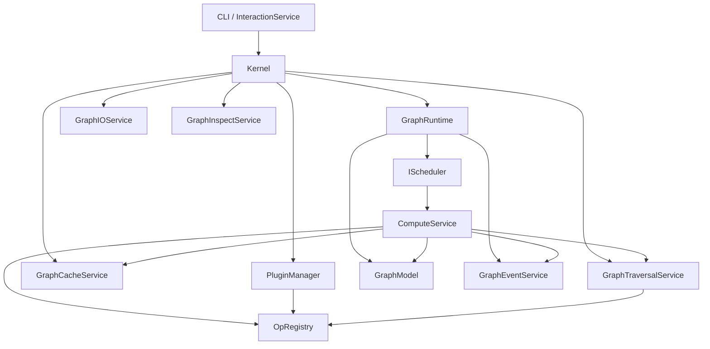

# Photospider Current-State Report

_Generated on 2026-04-10 from the codebase, build system, and test results. This report intentionally treats existing docs as secondary sources because the repository documentation is known to be stale._

_Removal note, 2026-06-11: references below to legacy `Node::cached_output`
describe removed content. The current branch no longer has that node field or a
legacy cache fallback._

## TL;DR

- The repo is **not in an early prototype stage anymore**; it is in a **mid-migration architecture stage**.
- The kernel already has a meaningful service split (`GraphIOService`, `GraphTraversalService`, `GraphCacheService`, `GraphInspectService`, `GraphEventService`, `ComputeService`), but the real orchestration still concentrates in two large classes: `Kernel` and `ComputeService`.
- The codebase is currently **between two designs**:
  - a legacy single-cache / recursive compute model centered on `Node::cached_output` (removed on 2026-06-11)
  - a newer intent-driven RT/HP model with schedulers, dual caches, ROI propagation, and heterogeneous execution hooks
- The scheduler/runtime work is real and fairly advanced, but the migration was incomplete when this report was written. The strongest sign at the time was that `Node` still carried both legacy and new cache fields, while services such as disk caching still mostly operated on the legacy path. Removal status: the legacy node field called out here was removed on 2026-06-11.
- Validation status today:
  - `cmake -S . -B build -DCMAKE_BUILD_TYPE=RelWithDebInfo`: configures successfully
  - `ctest --output-on-failure --test-dir build`: **60/61 tests pass**
  - one integration test fails: `GpuPipelineIntegrationTest.DualSchedulerConcurrentExecution`
  - rebuilding `graph_cli` currently fails in this environment because the compiler is targeting `x86_64` while Homebrew libraries are `arm64`
- My recommendation is **refactor in place, not rewrite from scratch**. The repo already contains useful runtime/scheduler ideas and a test corpus worth preserving. A rewrite would likely re-learn the same lessons with less safety.

---

## 1. What Stage Is This Repo In?

### My assessment

This repo is in a **late experimental / pre-hardening stage**, with visible evidence of multiple milestones having landed, but without a final stable architecture boundary yet.

### Evidence for that assessment

1. **The module graph is real, not speculative.**
   `CMakeLists.txt` already separates the project into `photospider_core_types`, `photospider_graph`, `photospider_plugin`, `photospider_compute`, `photospider_lib`, and `photospider_cli_common`.

2. **The kernel has already evolved beyond a simple single-threaded executor.**
   There is a per-graph `GraphRuntime`, scheduler injection, scheduler plugins, dual-priority queues, epoch cancellation, and Metal/GPU hooks.

3. **The code is in migration, not in consolidation.**
   Historical state at report time: `Node` exposed:
   - `cached_output` (legacy; removed on 2026-06-11)
   - `cached_output_real_time`
   - `cached_output_high_precision`
   - `rt_version`, `hp_version`, `rt_roi`, `hp_roi`

   That is a strong sign that the old and new execution models currently coexist.

4. **Test coverage is milestone-shaped.**
   Test files like `test_milestone2.cpp`, `test_milestone3.cpp`, `test_milestone34.cpp`, `test_gpu_pipeline_scheduler.cpp`, and `test_propagation.cpp` imply an active milestone-driven development style rather than a finalized product architecture.

### Bottom line

This is best described as:

> **an actively evolving kernel/runtime architecture with solid experimental groundwork, but not yet a cleaned-up production design.**

---

## 2. High-Level Module Structure

## Build-level structure

| Module | Purpose | Main contents |
| --- | --- | --- |
| `photospider_core_types` | Core data types and op registry | `src/ps_types.cpp`, `src/ops.cpp`, adapters, YAML node parsing |
| `photospider_graph` | Graph data + graph services | `graph_model.cpp`, traversal/io/cache/inspect services |
| `photospider_plugin` | Dynamic op/plugin loading | `plugin_manager.cpp`, plugin loader |
| `photospider_compute` | Runtime and execution layer | `compute_service.cpp`, `kernel.cpp`, `graph_runtime.mm`, schedulers |
| `photospider_lib` | Shared backend library | benchmark sources + linked backend modules |
| `photospider_cli_common` | CLI/TUI frontend logic | `src/cli/*.cpp` |
| `graph_cli` | Executable | `cli/graph_cli.cpp` |

## Runtime-level structure

The runtime center of gravity is:

- `Kernel`: multi-graph facade and service coordinator
- `GraphRuntime`: per-graph execution container
- `GraphModel`: graph state and nodes
- `ComputeService`: execution orchestrator
- `OpRegistry` + `PluginManager`: operation implementation lookup and extension loading

---

## 3. Current Kernel Service Structure

## Service inventory

| Service | Owned by | Main dependencies | Role | Current state |
| --- | --- | --- | --- | --- |
| `GraphIOService` | `Kernel` | `GraphModel`, YAML | Load/save graph YAML | Small and focused |
| `GraphTraversalService` | `Kernel`, used by `ComputeService` | `GraphModel`, `OpRegistry`, ROI math | Topology queries, dependency trees, ROI forward/backward projection | Powerful but overloaded |
| `GraphCacheService` | `Kernel`, used by `ComputeService` | `GraphModel`, disk cache, OpenCV/YAML | Memory/disk cache load/save/clear/sync | Still legacy-cache-centric |
| `GraphInspectService` | `Kernel` | `GraphModel`, `NodeOutput` | Human-readable metadata dump | Small but cache-model aware |
| `GraphEventService` | `GraphRuntime` | mutex + vector buffer | Collect per-node compute events | Minimal and clean |
| `ComputeService` | ephemeral, created by `Kernel` when needed | traversal/cache/events/runtime/model/op registry | Execute graph nodes, recursive compute, parallel compute, RT/HP updates | Huge orchestrator / refactor hotspot |

## Relationship diagram

## Practical call flow

For a typical compute request today, the flow is roughly:

1. CLI/interaction layer calls `Kernel`
2. `Kernel` finds the target `GraphRuntime`
3. `Kernel` creates a `ComputeService` with shared services
4. `ComputeService` resolves traversal/dependencies
5. `ComputeService` checks memory/disk cache via `GraphCacheService`
6. `ComputeService` resolves the op implementation from `OpRegistry`
7. `ComputeService` executes recursively or via scheduler/runtime path
8. `GraphEventService` stores timing events
9. `Kernel` exposes results, timing, inspection, traversal, and cache operations back upward

---

## 4. What Each Kernel Piece Is Really Doing

## `Kernel`

`Kernel` is not just a façade. It currently acts as:

- graph registry (`graphs_`)
- service owner
- error aggregator (`last_error_`)
- scheduler bootstrapper
- compute entry point
- cache-management API
- YAML editing API
- traversal/inspection API

### Assessment

This is convenient, but `Kernel` is now too broad. At ~1000 lines, it behaves like an application service layer, graph manager, runtime manager, and admin API all at once.

## `GraphRuntime`

`GraphRuntime` is the per-graph execution capsule. It owns:

- the `GraphModel`
- the per-graph `GraphEventService`
- worker threads and queues
- epoch/cancellation state
- Metal context handles
- the per-intent scheduler map

### Assessment

This is one of the better abstractions in the repo. It gives you a natural unit of isolation per graph and is a good foundation to keep during refactoring.

## `GraphModel`

`GraphModel` is the actual graph state holder:

- `nodes`
- `cache_root`
- timing results
- quiet/skip-save flags

### Assessment

The model is currently very lightweight, but it exposes most of its state publicly. That makes iteration fast, but it weakens invariants and allows services to know too much about node internals.

## `ComputeService`

This file is the execution brain of the project. It contains:

- recursive legacy compute logic
- cache handling glue
- op dispatch
- tile helpers
- HP/RT intent logic
- dirty ROI update logic
- parallel runtime interactions
- timing/event emission

### Assessment

This is the biggest refactor candidate in the repo. At roughly **2990 lines**, it is carrying too many responsibilities at once.

## `GraphTraversalService`

This service currently combines:

- topological ordering
- ancestor/parent/tree queries
- dependency tree formatting
- ROI backward projection
- ROI forward projection
- output-size inference helpers
- dependency LUT-aware spatial propagation

### Assessment

This is useful functionality, but it mixes pure graph traversal with spatial geometry and presentation concerns. It should probably become at least two services later:

- graph/topology service
- spatial/ROI propagation service

## `GraphCacheService`

This service manages:

- node cache directory naming
- save/load disk cache
- clear disk cache
- clear memory cache
- cache-all/sync/free-transient-memory

### Assessment

Historical weakness at report time: the node model had RT/HP caches, but the cache service still mostly targeted the old `cached_output` path. That meant the service boundary no longer matched the real execution model. Removal status: this old path was removed on 2026-06-11.

## `GraphIOService`

This is simple and valuable. It just loads/saves graph YAML.

### Assessment

This service is correctly scoped, but its loading behavior is not transactional yet.

## `GraphInspectService`

This formats cached output metadata for human inspection.

### Assessment

Small and fine, but still cache-model coupled: it prefers legacy cache first, then HP, then RT.

---

## 5. Architectural Relationships and Tensions

## Healthy relationships

These parts are directionally good:

- `Kernel` owning shared services and delegating into runtimes
- `GraphRuntime` as per-graph execution container
- scheduler abstraction via `IScheduler`
- `PluginManager` feeding the global `OpRegistry`
- tests covering scheduler behavior and propagation behavior

## Current tensions

### 1. Legacy path vs new path

The codebase is split between:

- old recursive compute + `cached_output` (removed on 2026-06-11)
- newer intent-driven RT/HP scheduling + per-intent caches

This is the single most important structural fact about the repo today.

### 2. Data ownership is soft

`GraphModel::nodes` is public, and multiple services directly manipulate node internals. That keeps development fast, but it makes long-term invariants difficult to enforce.

### 3. Execution logic is too centralized

`ComputeService` is effectively planner + cache coordinator + executor + ROI updater + metrics emitter.

### 4. Service boundaries lag behind the new scheduler design

The runtime/scheduler layer is more modern than the graph/cache layer. That mismatch creates awkward adaptation code and partially migrated behavior.

---

## 6. Concrete Bugs and Risks Observed

## Confirmed from validation

### 1. `GpuPipelineIntegrationTest.DualSchedulerConcurrentExecution` fails

**Observed result:** `ctest` reports 1 failing test out of 61.

**Failure:**

> `RealTimeUpdate intent requires a dirty ROI region.`

### What this means

The scheduler/runtime API and the test expectation disagree about RT semantics:

- the test submits an RT compute without `dirty_roi`
- the implementation requires `dirty_roi` for `ComputeIntent::RealTimeUpdate`

### Assessment

This is either:

- a real API bug, if RT full-frame compute should be allowed, or
- an integration contract bug, if callers must always provide `dirty_roi`

Either way, the contract is not clean enough yet.

---

### 2. Test registration is incomplete in `CMakeLists.txt`

The build script creates these test binaries:

- `test_scheduler`
- `test_milestone2`
- `test_milestone3`
- `test_milestone34`
- `test_propagation`
- `test_op_registry_m31`
- `test_gpu_pipeline_scheduler`
- `test_scheduler_plugin_loader`

But only these are registered with `gtest_discover_tests`:

- `test_scheduler`
- `test_op_registry_m31`
- `test_milestone34`
- `test_gpu_pipeline_scheduler`
- `test_scheduler_plugin_loader`

### Impact

`test_milestone2`, `test_milestone3`, and `test_propagation` are built but not automatically executed by `ctest`. That creates a false sense of coverage.

---

### 3. Local rebuild is currently broken by architecture mismatch

**Observed result:** `cmake --build build --target graph_cli -j1` fails.

### Root cause

The linker is building for `x86_64`, while Homebrew dependencies found by CMake are `arm64`, e.g.:

- `libyaml-cpp.0.8.0.dylib`: `arm64`
- `libopencv_core.4.12.0.dylib`: `arm64`

### Impact

This means the current developer environment is not reproducible as-is. The existing build tree can still contain usable old artifacts, but a clean rebuild is not reliable until architecture selection is made explicit.

---

## Code-level issues worth fixing

### 4. `GraphIOService::load()` is not transactional

Current behavior:

- it loads YAML
- calls `graph.clear()`
- starts adding nodes one by one

If a later node is invalid, throws, or creates a cycle, the graph can be left partially rebuilt.

### Better behavior

Load into a temporary `GraphModel` or temporary node list, validate fully, then commit.

---

### 5. `GraphModel::clear()` does not fully reset model-level runtime state

It clears `nodes`, but does not reset everything associated with previous runs, such as accumulated timing state. That is survivable, but it makes reload semantics fuzzy.

---

### 6. Historical: cache service still mostly targeted the legacy cache model

At report time, the node type supported:

- unified legacy cache (removed on 2026-06-11)
- RT cache
- HP cache

At report time, `GraphCacheService` still mostly saved/loaded/cleared the unified `cached_output` path. Removal status: this path was removed on 2026-06-11.

### Impact

This increases the chance of subtle correctness issues, stale caches, or inconsistent semantics between legacy and intent-driven execution paths.

---

### 7. CLI and docs are out of sync

The CLI executable currently exposes a small top-level option set (`--read`, `--output`, `--print`, `--traversal`, `--repl`, etc.), but some repository guidance still suggests commands like `--compute all` directly on `graph_cli`.

### Impact

Developer onboarding is harder than it should be, and old docs can easily mislead you about what still works.

---

## 7. Things That Still Need To Be Developed

These are the highest-value missing developments, based on the code as it exists now.

## A. Finish the cache-model migration

Historical cleanup target:

- `cached_output` (removed on 2026-06-11)
- `cached_output_real_time`
- `cached_output_high_precision`

The legacy unified cache has since been removed rather than retained as a compatibility bridge.

## B. Split `ComputeService`

Recommended split:

- `ComputePlanner` or `ExecutionPlanner`
- `NodeExecutor`
- `IntentUpdateCoordinator` for RT/HP update behavior
- keep `GraphCacheService` focused on cache only

## C. Split traversal from spatial propagation

Recommended separation:

- `GraphTopologyService`
- `RoiPropagationService`

This would make both the graph structure logic and ROI logic easier to reason about and test.

## D. Make graph load/edit operations transactional

This applies to:

- YAML load
- node YAML replacement
- possibly graph mutation from CLI/TUI

## E. Harden the build and tooling story

At minimum:

- make architecture explicit on Apple Silicon
- add CMake presets
- export `compile_commands.json`
- add lint/format targets
- make `ctest` actually run all intended tests

## F. Clarify scheduler contracts

Especially for:

- whether `RealTimeUpdate` requires `dirty_roi`
- how HP/RT fallback should work
- what the default behavior is when GPU/Metal is unavailable

## G. Decide whether benchmark/editor code belongs in the same backend layering

Some YAML/editor/benchmark functionality leaks across layers in a way that makes linking and ownership more complicated than necessary.

---

## 8. Development Environment Evaluation

## What currently works

- CMake configure works on this machine
- dependencies are discoverable:
  - AppleClang 21
  - OpenCV 4.12
  - yaml-cpp 0.8
  - OpenSSL 3.6
  - GTest 1.17
  - nlohmann_json 3.12
- the existing build tree contains runnable test artifacts
- the overall test suite is in decent shape functionally

## What currently hurts productivity

### 1. Architecture mismatch on macOS

This is the biggest environment problem right now. If you are on Apple Silicon, you should make sure the terminal, compiler target, and Homebrew prefix all agree on `arm64` vs `x86_64`.

### 2. Missing build presets / standardized bootstrap

There is no obvious one-command “known good dev setup” encoded in the repo. That means a returning developer has to reconstruct too much context manually.

### 3. Stale docs

You already called this out, and the code agrees.

### 4. Validation pipeline is incomplete

`ctest` is useful, but because not all test binaries are registered, it is not yet the full truth.

## Overall environment grade

### Build/tooling

**5.5/10**

The project is real and buildable in principle, but the current machine-specific architecture mismatch and incomplete test wiring make the environment less trustworthy than it should be.

### Architecture clarity

**6/10**

There is a strong architecture trying to emerge, but it is not yet fully expressed in the service boundaries.

### Refactor readiness

**8/10**

This codebase is absolutely ready for a structured refactor, because the major abstractions already exist and the test suite gives you a partial safety net.

---

## 9. Should You Redesign / Refactor From Scratch?

## Short answer

**Refactor aggressively, but do not start from zero unless your product direction has changed.**

## Why I would not recommend a full rewrite

Because the repo already has several valuable assets:

- a real graph model
- a working op registry / plugin mechanism
- ROI propagation machinery
- scheduler abstraction and runtime isolation
- a meaningful test corpus
- concrete lessons encoded in milestone tests

A rewrite would likely recreate these ideas more cleanly, but it would also discard a lot of learned behavior and make regressions likely.

## What I would preserve

- `GraphRuntime` as the per-graph execution boundary
- `IScheduler` and scheduler plugin support
- `OpRegistry` + plugin loading design
- graph YAML format and node schema, unless you specifically want to break compatibility
- the propagation and scheduler test suites

## What I would redesign in place

- split `ComputeService`
- make `GraphModel` less publicly mutable
- replace legacy-vs-new cache ambiguity with a single explicit cache policy
- make `Kernel` thinner
- separate graph topology concerns from spatial propagation concerns
- standardize build/test/dev scripts

## Best strategy

The best strategy is a **guided internal rewrite**, not a greenfield rewrite:

1. stabilize environment and tests
2. formalize contracts
3. extract services behind cleaner interfaces
4. migrate call sites
5. delete legacy path only after parity is proven

---

## 10. Suggested Refactor Plan

## Phase 0: Make the repo trustworthy again

- fix Apple Silicon architecture selection
- register all tests with `ctest`
- document the actual CLI usage and actual dev commands
- add one clean “getting started for contributors” doc

## Phase 1: Contract cleanup

- define exact semantics of `GlobalHighPrecision` vs `RealTimeUpdate`
- decide whether RT without `dirty_roi` is allowed
- define canonical cache ownership rules

## Phase 2: Structural extraction

- extract planner logic out of `ComputeService`
- extract ROI logic out of `GraphTraversalService`
- introduce transactional graph loading/editing

## Phase 3: Delete migration residue

- remove dead legacy cache paths if no longer needed
- simplify inspect/cache APIs around the final cache model
- shrink `Kernel` to graph/runtime management and public API only

## Phase 4: Hardening

- add sanitizers to CI or local presets
- add regression tests for all observed bugs
- add architecture-specific build notes for macOS/Metal

---

## 11. Hotspots by Size

These files are currently the main complexity hotspots:

| File | Approx. lines | Why it matters |
| --- | ---: | --- |
| `src/kernel/services/compute_service.cpp` | 2990 | execution brain, too many responsibilities |
| `src/kernel/kernel.cpp` | 1003 | wide API surface and orchestration hub |
| `src/kernel/scheduler/gpu_pipeline_scheduler.cpp` | 937 | advanced scheduler logic and integration risk |
| `src/kernel/services/graph_traversal_service.cpp` | 829 | topology + ROI + printing mixed together |
| `src/kernel/graph_runtime.mm` | 638 | runtime lifecycle, queues, epochs, scheduler bridge |

These are the files I would treat as the primary refactor map.

---

## 12. Final Recommendation

If you are coming back after five months, the fastest mental model is this:

> The repo has already grown a serious runtime and scheduler architecture, but the codebase is still halfway through migrating from the old single-cache recursive executor to the newer intent-driven RT/HP model.

So the practical next move is:

- **do not rewrite blindly**
- **stabilize the build/test environment first**
- **then refactor around the migration seam**

That migration seam is the real story of the current codebase.
